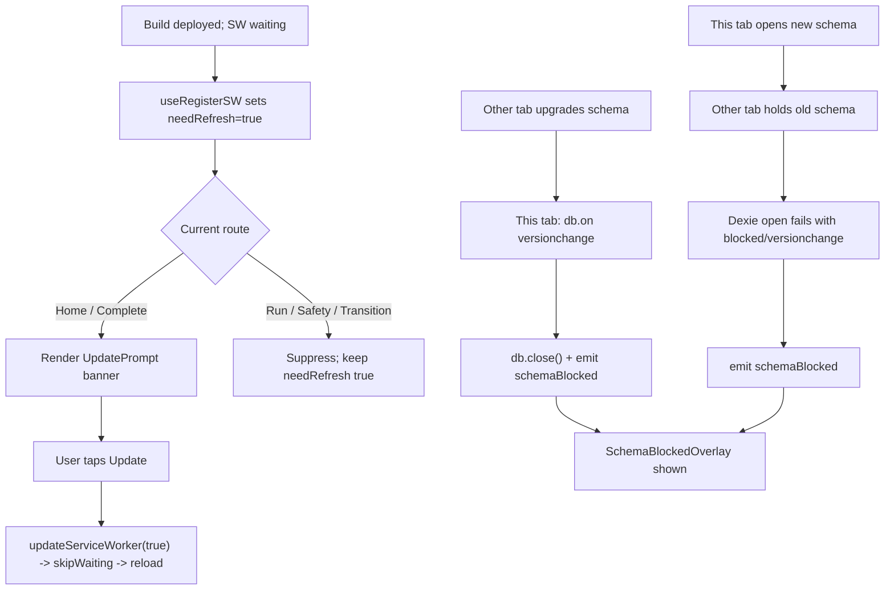

# Phase B: Test Infrastructure and Service Worker Safety

## Overview

Close HARD-02 / FB-07 by replacing the current `autoUpdate` service-worker policy with a safe-boundary prompt, and land the three real-browser Playwright smokes (update flow, warm-offline, blocked schema-upgrade) that the harness research calls for.

## Problem Frame

v0a ships `registerType: 'autoUpdate'` + `immediate: true`, which violates D41's safe-boundary policy (an update could swap the service worker mid-session). v0b needs:
1. A user-visible, boundary-aware update prompt that never fires during an active session.
2. A warm-offline smoke that proves the PWA shell renders and Dexie data reads back after a reload offline.
3. A blocked schema-upgrade UX plus smoke that proves the user sees a "close other tabs" prompt rather than a silent deadlock when schema versions diverge across tabs.

## Requirements Trace

- R1. Flip SW registration from `autoUpdate` to `prompt`; wire `useRegisterSW` so the app knows when an update is waiting (V0B-20)
- R2. Surface an update-available affordance at safe boundaries only — Home, post-review (CompleteScreen), and when no active session exists. Never during Run/Safety/Transition (V0B-20)
- R3. Tapping the affordance calls `updateServiceWorker(true)` → `skipWaiting` → `controllerchange` → reload (V0B-20)
- R4. One Playwright smoke: warm-offline + persisted-state (V0B-21)
- R5. One Playwright smoke: blocked schema-upgrade triggers the "close other tabs" prompt, not a silent deadlock (V0B-22)
- R6. Dexie `blocked` event is handled with a user-facing prompt on the page that holds the new schema (V0B-22 product decision)

## Scope Boundaries

- No update-flow smoke for V0B-20 in this plan — building a "serve a second build" test fixture is real work and the flip itself is the high-value change. The warm-offline smoke indirectly verifies registration works. V0B-20's update-flow smoke is deferred to a follow-up if tester evidence indicates it's needed.
- No cross-browser matrix. Chromium only per `docs/research/minimum-viable-test-stack.md`.
- No changes to Workbox caching strategy or `navigateFallback`.
- No automated quota/eviction tests.

## Context & Research

### Relevant Code and Patterns

- `app/vite.config.ts` — VitePWA config; currently `registerType: 'autoUpdate'`
- `app/src/main.tsx` — SW registration via `registerSW({ immediate: true })`
- `app/src/screens/HomeScreen.tsx` — Home states: `loading`, `resume`, `review_pending`, `ready`, `error`. Update prompt mounts here.
- `app/src/screens/CompleteScreen.tsx` — post-review safe boundary
- `app/src/db/schema.ts` — Dexie versions; v3 is current. `Dexie` exposes `db.on('versionchange', ...)` for the "another tab upgraded the schema" side, and Dexie's open promise rejects with `OpenFailedError` / `blocked` on the new-version tab.
- `app/e2e/session-flow.spec.ts`, `edge-cases.spec.ts`, `phase-a-schema.spec.ts` — existing Playwright patterns
- `app/playwright.config.ts` — `serviceWorkers: 'allow'`, targets production build via `vite preview`

### Patterns to Follow

- Registration lives in `main.tsx`; the hook in-screen pulls from a shared registration handle
- Use `virtual:pwa-register/react`'s `useRegisterSW({ onRegistered, onRegisterError })` for the prompt path; it already exposes `needRefresh` state and `updateServiceWorker(reloadPage)`
- Existing Playwright tests use `page.evaluate(() => indexedDB.deleteDatabase(...))` as the setup / teardown hook

## Key Technical Decisions

- **Schema-blocked UX: single "close other tabs and reload" prompt.** When Dexie opens fails with `blocked` (another tab holds the old version), show a dedicated full-screen banner/screen directing the user to close other tabs. Dismiss by reload once they confirm. This is the minimum honest UX per the plan note.
- **Update prompt lives on Home + Complete screens only.** Any route that represents an active session (`/run`, `/safety`, `/transition`) must not mount the prompt. The Home screen is the primary surface; Complete screen is the post-review boundary.
- **Registration moves from `main.tsx` to a dedicated module.** `src/lib/pwa-register.ts` owns the `useRegisterSW` wiring so screens can import it cleanly and tests can mock it.
- **Dexie `versionchange` handler on the old-version tab.** When another tab triggers a version upgrade, the old-version tab's `db.on('versionchange')` fires. Close the connection and show the same "reload to continue" prompt to avoid the "other tab is blocking" state on the new-version tab.

## Open Questions

### Resolved During Planning

- **Where does the update-available state live?** `useRegisterSW` already returns a `[needRefresh, setNeedRefresh]` signal. Import and use it where needed; no global store required.
- **How does the blocked-schema UX surface?** A route-independent modal-style overlay on any screen that detects the blocked state at open time, rendered via a top-level `SchemaBlockedOverlay` component that subscribes to a module-level event.

### Deferred to Implementation

- Exact copy for the update-prompt and blocked-schema prompt. Use the draft language in the plan; polish during implementation if clearer wording emerges.

## High-Level Technical Design

## Implementation Units

- [x] **Unit 1: Flip SW to `prompt` and add update-prompt UI (V0B-20)**

**Goal:** Replace `autoUpdate` with `prompt` registration and surface a safe-boundary update affordance.

**Requirements:** R1, R2, R3

**Dependencies:** None

**Files:**
- Modify: `app/vite.config.ts`
- Create: `app/src/lib/pwa-register.ts`
- Create: `app/src/components/UpdatePrompt.tsx`
- Modify: `app/src/main.tsx`
- Modify: `app/src/screens/HomeScreen.tsx`
- Modify: `app/src/screens/CompleteScreen.tsx`
- Test: `app/src/components/__tests__/UpdatePrompt.test.tsx` (new)
- Test: `app/src/lib/pwa-register.test.ts` (new)

**Approach:**
- Change `registerType: 'autoUpdate'` → `'prompt'` in `vite.config.ts`
- Create `src/lib/pwa-register.ts` exporting a `useAppRegisterSW()` hook that wraps `useRegisterSW` from `virtual:pwa-register/react` and returns `{ needRefresh, updateApp }` where `updateApp = () => updateServiceWorker(true)`
- Remove the existing `registerSW` import from `main.tsx` (the react hook handles registration)
- Create `UpdatePrompt` component that renders a small banner with "Update available" + an "Update" button. Takes `needRefresh` + `onUpdate` as props.
- Mount `UpdatePrompt` in `HomeScreen` (above the pending-review / ready section) and `CompleteScreen`
- The component must be resilient to the virtual module being unavailable (for unit tests without Vite) — the hook module should be mockable

**Patterns to follow:**
- `virtual:pwa-register/react` API from vite-plugin-pwa docs
- Existing `Button` component from `src/components/ui`

**Test scenarios:**
- Happy path: `UpdatePrompt` renders nothing when `needRefresh={false}` (no banner, no DOM noise)
- Happy path: `UpdatePrompt` with `needRefresh={true}` shows an "Update" button; clicking calls `onUpdate`
- Edge case: clicking Update while the button is already triggered does not re-fire (idempotent)

**Verification:** Banner appears on Home when a waiting SW exists. Does not appear on Run/Safety/Transition routes. Clicking "Update" reloads the page.

- [x] **Unit 2: Schema-blocked overlay + Dexie versionchange handler (V0B-22 product side)**

**Goal:** Handle Dexie's blocked/versionchange paths with a user-facing "close other tabs and reload" prompt.

**Requirements:** R6

**Dependencies:** None (can run in parallel with Unit 1)

**Files:**
- Modify: `app/src/db/schema.ts` — add `db.on('versionchange')` handler + `blocked` event emission
- Create: `app/src/components/SchemaBlockedOverlay.tsx`
- Create: `app/src/lib/schema-blocked.ts` — shared event emitter (`onBlocked`, `emitBlocked`)
- Modify: `app/src/App.tsx` — mount `SchemaBlockedOverlay` above all routes
- Test: `app/src/lib/schema-blocked.test.ts` (new)
- Test: `app/src/components/__tests__/SchemaBlockedOverlay.test.tsx` (new)

**Approach:**
- `src/lib/schema-blocked.ts` exposes a tiny pub-sub: `subscribeSchemaBlocked(callback)` and `emitSchemaBlocked()`. Allows DB layer to signal without importing React.
- `db/schema.ts`: after `new VolleyDrillsDB()`, attach `db.on('versionchange', () => { db.close(); emitSchemaBlocked() })`. Also attach `db.on('blocked', () => emitSchemaBlocked())` on the new-version tab side. The `versionchange` event is emitted by Dexie on the OLD connection when ANOTHER tab tries to upgrade.
- `SchemaBlockedOverlay.tsx`: React component that subscribes on mount, renders a fixed-position full-screen overlay when blocked, with copy "A newer version of the app is open in another tab. Close other tabs and reload to continue." and a Reload button that calls `window.location.reload()`.
- Mount overlay at the top of `App.tsx` inside the `ErrorBoundary` so it appears on any route.

**Patterns to follow:**
- Pure TypeScript module-level event emitter pattern (similar to Node EventEmitter but typed and minimal)
- Existing `Button` component for the Reload action

**Test scenarios:**
- Happy path (lib): subscribing then emitting fires the callback
- Happy path (lib): unsubscribe stops firing
- Edge case (lib): multiple subscribers each fire independently
- Happy path (component): overlay is hidden by default
- Happy path (component): emitting `schemaBlocked` causes overlay to render
- Happy path (component): clicking Reload calls `window.location.reload` (can mock)

**Verification:** When another tab upgrades the schema, this tab shows the overlay. The new-version tab also shows the overlay if an old tab holds the connection.

- [x] **Unit 3: Warm-offline Playwright smoke (V0B-21)**

**Goal:** Real-browser test that PWA shell renders and Dexie data reads after an offline reload.

**Requirements:** R4

**Dependencies:** None (test-only)

**Files:**
- Create: `app/e2e/warm-offline.spec.ts`

**Approach:**
- Navigate to `/`, wait for `navigator.serviceWorker.ready` via `page.evaluate`
- Build and end-early a session so there's persisted Dexie data
- Set `context.setOffline(true)`
- Reload the page
- Assert the Home screen renders (the PWA shell is served from cache)
- Assert the review-pending state is present (proves Dexie data round-tripped offline)
- Read IndexedDB directly and assert `executionLogs` count ≥ 1

**Patterns to follow:**
- `app/e2e/phase-a-schema.spec.ts` — raw IndexedDB reads via `page.evaluate`
- `app/e2e/session-flow.spec.ts` — `setupAndStart` / `passSafety` / `endSessionEarly` helpers (inline the needed bits or extract if reused)
- Playwright `context.setOffline(true/false)`

**Test scenarios:**
- Happy path: build + end session → go offline → reload → Home renders + review-pending visible + executionLogs count ≥ 1

**Verification:** Test passes in Chromium against `vite preview`.

- [x] **Unit 4: Blocked schema-upgrade Playwright smoke (V0B-22 test side)**

**Goal:** Real-browser test that the blocked-schema overlay appears when one tab holds the old schema while another tab tries to upgrade.

**Requirements:** R5

**Dependencies:** Unit 2 (the overlay + handler must exist)

**Files:**
- Create: `app/e2e/blocked-schema.spec.ts`

**Approach:**
- This test simulates the schema-blocked scenario by directly triggering a `versionchange` on an open Dexie connection via `page.evaluate`. Rather than orchestrating two real browser tabs (flaky), we open a manual IDB connection with a higher version number from the same page, which triggers `versionchange` on the active app's Dexie connection. The app's handler fires, `emitSchemaBlocked` runs, and the overlay appears.
- Alternative if the evaluate-based simulation doesn't reliably fire: use `context.newPage()` to open a second tab that triggers the upgrade via direct IDB. Pick whichever is more reliable in Chromium.

**Patterns to follow:**
- `app/e2e/phase-a-schema.spec.ts` — direct `indexedDB.open(...)` via `page.evaluate`

**Test scenarios:**
- Happy path: trigger version upgrade from a parallel connection → overlay appears → "Close other tabs and reload" text visible

**Verification:** Test passes in Chromium against `vite preview`.

## Risks & Dependencies

| Risk | Mitigation |
|------|------------|
| `virtual:pwa-register/react` types not available in unit tests | `pwa-register.ts` module is thin; tests mock the whole module or test the component behavior with a prop-driven mock |
| Dexie `versionchange` behavior varies across browsers | Chromium-only is the v0b commitment; test in the target environment |
| Blocked-schema test simulation is flaky | Plan two approaches (same-page parallel connection, two-tab); pick whichever reliably triggers |

## Sources & References

- **Origin document:** [docs/plans/2026-04-12-v0a-to-v0b-transition.md](docs/plans/2026-04-12-v0a-to-v0b-transition.md) § "Phase B — Test infrastructure and update safety"
- Related research: [docs/research/minimum-viable-test-stack.md](docs/research/minimum-viable-test-stack.md), [docs/research/local-first-pwa-constraints.md](docs/research/local-first-pwa-constraints.md)
- Related specs: [docs/specs/m001-quality-and-testing.md](docs/specs/m001-quality-and-testing.md) (invariants 1, 2, 4, 5, 6)
