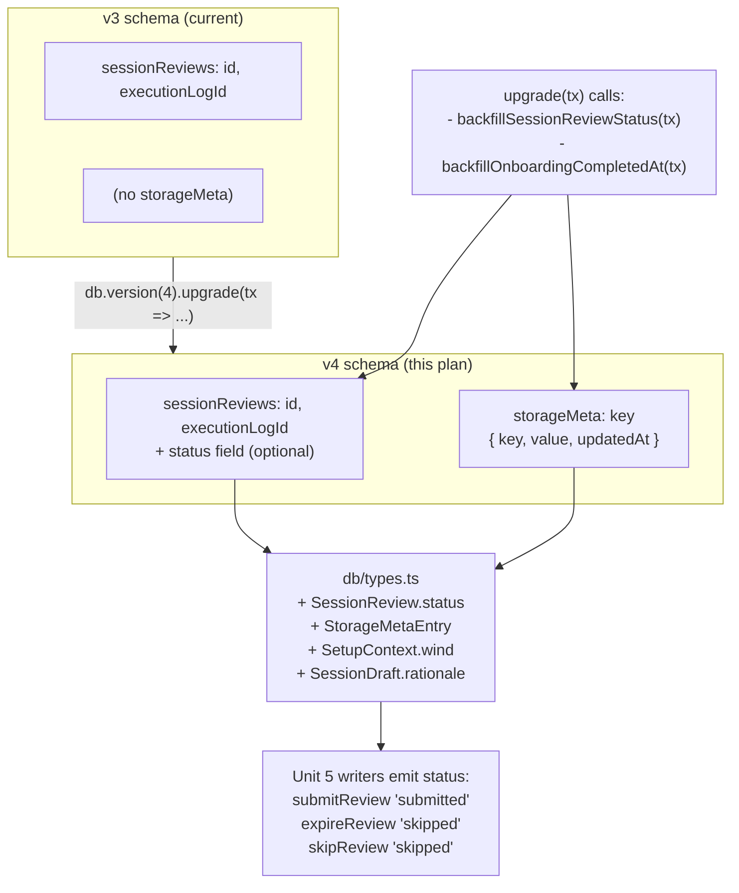

# Phase C-0: Schema and Data Shape

## Overview

Land the Dexie v4 schema bump that every subsequent Phase C sub-phase depends on: a new `storageMeta` key-value table for onboarding resume state + UX one-shot keys, a `status` field on `SessionReview` that replaces the `sessionRpe: -1` sentinel, a `wind` field on `SetupContext`, and an optional `rationale` string on `SessionDraft` (schema-only per `H7`).

**Revision 2 (v3 red-team fix plan):** Unit 2 now exports the backfill body as a reusable function so tests can run without wrestling the singleton `db`. Unit 6's Playwright approach rewritten for IDB semantics (can't open v3 against a v4 DB). Unit 3 atomicity clarified. Idempotency-guard comment reworded. Deployment-posture section added. The `onboarding.completedAt` backfill migration (H15) is added to Unit 2 alongside the `status` backfill — both fire in the same v4 upgrade transaction.

## Problem Frame

Phase C-1 (review contract), C-3 (onboarding), and C-4 (home priority) all need schema primitives v3 doesn't provide:

- **C-1** needs `SessionReview.status` to distinguish submitted / skipped / draft reviews (the `A1` enumerated filters rely on it; so does the C-2 session counter and the 3-case summary matrix).
- **C-3** needs `storageMeta` with `onboarding.skillLevel`, `onboarding.completedAt`, `onboarding.step` (crash-safe first-run resume) and `SetupContext.wind` (D93 wind capture on Today's Setup).
- **C-4** needs `storageMeta.ux.softBlockDismissed.{execId}` for `A7` (soft-block modal fires once per pending-review instance; cleaned up on terminal-review write).
- **C-5** needs `SessionDraft.rationale` as a schema reservation (UI cut per `H7`; field stays for M001-build to light up without migration).

Landing these together in one Dexie version bump avoids three or four subsequent migrations and lets the sub-phases downstream consume a stable type surface.

## Deployment Posture (H15)

**No tester-facing incremental builds during Phase C.** The v4 migration will run on every tester's next open after deploy, including existing testers with v3 data. If C-0 ships to testers mid-Phase-C (e.g. for pilot dogfooding), the onboarding backfill migration (per H15 defense-in-depth) ensures those testers don't get force-routed through the onboarding flow when C-3 later lands: any device with existing `ExecutionLog` records gets `onboarding.completedAt` backfilled to `Date.now()` as part of the v4 upgrade.

**Recommended release posture:**
- Internal dev builds only through C-0 / C-1 / C-2 / C-3 / C-4 / C-5 / E.
- D91 testers receive a single end-to-end v0b build at D91 kickoff.
- The onboarding backfill is belt-and-suspenders: it runs at v4 upgrade time regardless, so even if a tester somehow hits C-0 before C-3, they won't be forced through onboarding.

## Requirements Trace

- R1. `SessionReview.status: 'submitted' | 'skipped' | 'draft'` is defined on the type and migrated onto every existing v3 record (`D-C7`, `A5`).
- R2. Migration backfill is numerically safe: a valid `sessionRpe === 0` must land as `'submitted'`, not `'skipped'`.
- R3. `storageMeta` key-value table exists; multi-key writes are atomic when wrapped in a transaction (`A4`). Single-key writes inherit IDB per-operation atomicity.
- R4. `SetupContext.wind` is an optional enum on the type; existing `SessionPlan` records read it as `undefined` (D93).
- R5. `SessionDraft.rationale` is an optional string on the type; `buildDraft()` emits `undefined` in v0b (schema-only per `H7` / `GD37`).
- R6. `onboarding.completedAt` backfill: on v4 upgrade, if any `ExecutionLog` exists AND the key is absent, write `onboarding.completedAt = Date.now()` into `storageMeta` (H15).
- R7. Contract tests assert every round-trip + migration invariant.
- R8. No test regression in existing Vitest + Playwright suites.
- R9. The backfill body is an exported pure function so tests can exercise it directly against seeded records (GD28).

**Explicitly cut from C-0:**

- `SessionReview.reviewTiming` (C4 — derive at export time)
- `SessionPlan.context.setWindowPlacement` (C3 — lands with V0B-14 if it ever ships)
- `ux.staleDraftLastWarnedAt` (C5 — age tiers cut)
- `banner.safariToHswaDismissedAt` (H12 — V0B-27 cut)

## Scope Boundaries

- No UI changes. Review screen, onboarding screens, and home screen are untouched in this sub-phase.
- No service-layer business logic beyond migration + writer `status` additions. `submitReview`, `expireReview`, `skipReview` get `status` added (Unit 5) — necessary for A5 sequencing per the red-team fix plan's hygiene note; the A1 filter rewrites themselves land in C-1.
- No consumer of `SessionDraft.rationale`. `buildDraft()` emits `undefined` in v0b.
- Dexie v4 bump is singular: one `.version(4).stores(...).upgrade(...)` block covers everything.

## Context and Research

### Relevant code

- `app/src/db/schema.ts` — Dexie versions; v3 is current. Cross-tab `versionchange` / `blocked` handlers already in place (V0B-22).
- `app/src/db/types.ts` — all Dexie record interfaces.
- `app/src/services/review.ts` — `submitReview()`, `expireReview()`.
- `app/src/services/session.ts` — session lifecycle + `skipReview()`.
- `app/src/lib/skillLevel.ts` — type-guard-on-read precedent (`isSkillLevel()`).
- `app/src/test-setup.ts` — per-test `IDBFactory` isolation pattern.
- `app/src/services/__tests__/session.v0b.test.ts` — Dexie-backed integration tests.
- `app/src/services/__tests__/review.test.ts` — Dexie-backed review tests.
- `app/e2e/phase-a-schema.spec.ts` — Playwright reference: `clearIndexedDB(page)` helper + raw IDB reads via `page.evaluate`.

### Patterns to follow

- Optional fields on Dexie records do not require index changes. `status` is a new optional field with no index (the C-1 A1 filter reads all reviews into memory and filters in JavaScript, consistent with current `findPendingReview()`).
- Dexie migrations run inside `db.version(N).upgrade(async tx => ...)`. The `tx` argument is scoped to the upgrade transaction — use `tx.table('sessionReviews')`, not `db.sessionReviews`.
- Existing `versionchange` / `blocked` handlers in `schema.ts` fire on v3→v4 transitions; no change needed.
- Write multi-key `storageMeta` operations inside `db.transaction('rw', db.storageMeta, async () => { ... })` per `A4`.

## Key Technical Decisions

1. **Single v4 bump.** Dexie supports additive optional fields without index work, but `storageMeta` is a new table — that requires `.stores()` mutation and therefore a version bump. We land everything in the same bump to avoid v4 → v5 → v6 churn.
2. **Migration backfill uses numeric type check, not truthiness.** `sessionRpe === 0` is a valid CR10 rating ("rest"). The migration must check `typeof sessionRpe === 'number' && !Number.isNaN(sessionRpe) && sessionRpe >= 0`.
3. **`status` is required on new writes, optional on the type.** Writers (`submitReview`, `expireReview`, `skipReview`) emit `status` unconditionally. The type marks it optional (`status?:`) to tolerate reads of v3 records the migration may have missed (defense in depth).
4. **`storageMeta` rows are `{ key, value, updatedAt }`.** Primary key is `key`. `value` is `unknown`; callers type-check on read using the `isSkillLevel()` pattern. The service helper (Unit 3) contains this unsafety.
5. **`storageMeta` multi-key atomicity:** `setStorageMeta` (single-key) is atomic via IDB's per-operation transaction. `setStorageMetaMany` explicitly wraps in `db.transaction('rw', db.storageMeta, ...)`. Callers that need read-then-write atomicity (e.g. A7 check-and-set on `ux.softBlockDismissed.{execId}`) MUST use `db.transaction('rw', db.storageMeta, ...)` directly — the helpers do not expose that pattern.
6. **Unit 5 (writers) lands in C-0, not C-1.** The v3 red-team fix plan specifies the A1 filter + A3 transactions ship together in C-1. Unit 5 pulls the writer-side `status` emission forward into C-0 as inter-deploy hygiene: during any C-0→C-1 gap, new writes (`submitReview` etc.) must still emit `status` so records don't land field-less mid-gap. The `status?:` optional type tolerates any v3 records without status, so this split is safe. The red-team "single-deploy" constraint targets the filter-without-writers partial landing, not writers-ahead-of-filter.
7. **`SetupContext.wind` defaults to `undefined`.** No migration transform needed; callers handle undefined as "calm".
8. **`SessionDraft.rationale` is reserved only.** `buildDraft()` emits `undefined` in v0b per GD37 (no stub string — keeps V0B-15 export noise-free).
9. **Idempotency guard in the upgrade callback** (`if (r.status) return`) is defense-in-depth for the edge case of records that somehow already carry `status` because a forward-writer wrote them on a v3 schema. In normal operation, Dexie upgrades run exactly once per version transition (upgrade transaction succeeds → version commits → never re-runs; upgrade fails → rolls back → DB stays at v3 → next open retries from scratch, no partial data).

## Open Questions

All resolved during planning:

- **`storageMeta.value` typed as `unknown` or `string`?** `unknown`. Numbers (timestamps), booleans, and structured values are all valid.
- **Does the migration need to set `reviewTiming`?** No — field cut per C4.
- **Migration behavior for `sessionRpe: -1` (legacy v0a skip sentinel)?** Maps to `'skipped'` via the numeric check (`sessionRpe < 0` → `'skipped'`).
- **Re-running a completed v4 upgrade?** Dexie's `.upgrade()` runs exactly once per version transition. The idempotency guard in the callback protects against hypothetical forward-writer records, not against re-runs.

## High-Level Technical Design



## Implementation Units

- [x] **Unit 1: Type additions in `db/types.ts`** — landed 2026-04-17

  **Goal:** Extend type surface so downstream units compile.

  **Requirements:** R1, R4, R5

  **Dependencies:** None

  **Files:**
  - Modify: `app/src/db/types.ts`

  **Approach:**
  - Add `SessionReviewStatus = 'submitted' | 'skipped' | 'draft'` type alias.
  - Add `status?: SessionReviewStatus` to `SessionReview`.
  - Add `wind?: 'calm' | 'light' | 'strong'` to `SetupContext`.
  - Add `rationale?: string` to `SessionDraft`.
  - Add `StorageMetaEntry = { key: string; value: unknown; updatedAt: number }` type.

  **Test scenarios:** Type-level only; TypeScript build must stay clean.

  **Verification:** `npm run typecheck` passes.

- [x] **Unit 2: Dexie v4 migration with exported backfill bodies** — landed 2026-04-17

  **Goal:** Bump Dexie version; add `storageMeta` table; backfill `status` on existing `SessionReview` records; backfill `onboarding.completedAt` if any `ExecutionLog` exists.

  **Requirements:** R1, R2, R3, R6, R9

  **Dependencies:** Unit 1

  **Files:**
  - Modify: `app/src/db/schema.ts`
  - Create: `app/src/db/migrations/backfills.ts` — exports `backfillSessionReviewStatus(tx)` and `backfillOnboardingCompletedAt(tx)` as pure functions
  - Create: `app/src/db/__tests__/schema-v4-migration.test.ts`

  **Approach:**

  1. Add `storageMeta!: Table<StorageMetaEntry, string>` to `VolleyDrillsDB` class.
  2. Add `.version(4).stores({ ...existing + storageMeta: 'key' }).upgrade(async tx => { await backfillSessionReviewStatus(tx); await backfillOnboardingCompletedAt(tx); })`.
  3. Factor the backfill bodies into `app/src/db/migrations/backfills.ts` so tests can invoke them directly against seeded records:

     ```typescript
     export async function backfillSessionReviewStatus(
       tx: Transaction,
     ): Promise<void> {
       const reviews = tx.table<SessionReview, string>('sessionReviews')
       await reviews.toCollection().modify(r => {
         // Defense-in-depth: tolerate records that somehow already carry status
         // (forward-writer leakage edge case). Normal Dexie upgrades run exactly
         // once per version transition and this guard is otherwise a no-op.
         if (r.status) return
         const rpe = r.sessionRpe
         if (typeof rpe === 'number' && !Number.isNaN(rpe) && rpe >= 0) {
           r.status = 'submitted'
         } else {
           r.status = 'skipped'
         }
       })
     }

     export async function backfillOnboardingCompletedAt(
       tx: Transaction,
     ): Promise<void> {
       const meta = tx.table<StorageMetaEntry, string>('storageMeta')
       const execs = tx.table<ExecutionLog, string>('executionLogs')
       const existing = await meta.get('onboarding.completedAt')
       if (existing) return
       const execCount = await execs.count()
       if (execCount === 0) return
       await meta.put({
         key: 'onboarding.completedAt',
         value: Date.now(),
         updatedAt: Date.now(),
       })
     }
     ```

  **Test scenarios** (run `backfillSessionReviewStatus` directly against seeded records in a fresh `fake-indexeddb` Dexie instance with a unique DB name):

  - v3 record with `sessionRpe: 7` → `status: 'submitted'`
  - v3 record with `sessionRpe: 0` → `status: 'submitted'` (critical: 0 is valid CR10)
  - v3 record with `sessionRpe: null` → `status: 'skipped'`
  - v3 record with `sessionRpe: -1` (legacy v0a sentinel) → `status: 'skipped'`
  - v3 record already with `status: 'submitted'` → unchanged by defense-in-depth guard
  - Empty `sessionReviews` table: no-op, no throw

  **Test scenarios** for `backfillOnboardingCompletedAt`:

  - Empty DB: no write
  - `storageMeta.onboarding.completedAt` already present: no overwrite
  - At least one `ExecutionLog` + key absent: writes `{ onboarding.completedAt = now }`

  **Verification:** New Vitest suite passes. Existing test suites (`review.test.ts`, `session.v0b.test.ts`) continue to pass.

- [x] **Unit 3: `storageMeta` service helper** — landed 2026-04-17

  **Goal:** Type-safe read/write for `storageMeta` with transaction-atomic multi-key support.

  **Requirements:** R3

  **Dependencies:** Unit 2

  **Files:**
  - Create: `app/src/services/storageMeta.ts`
  - Create: `app/src/services/__tests__/storageMeta.test.ts`

  **Approach:**

  Export three functions:
  - `getStorageMeta<T>(key: string, guard: (v: unknown) => v is T): Promise<T | undefined>`
  - `setStorageMeta(key: string, value: unknown): Promise<void>` — single-key write. IDB per-operation transaction provides atomicity.
  - `setStorageMetaMany(entries: Record<string, unknown>): Promise<void>` — wraps writes in `db.transaction('rw', db.storageMeta, async () => { ... })` for cross-key atomicity.

  Each write records `updatedAt: Date.now()`. `getStorageMeta` returns `undefined` if the key is absent or the guard fails.

  **Atomicity note:** `setStorageMeta` (single-key) is atomic via IDB's per-operation transaction semantics — no explicit wrap needed. Callers that need **read-then-write** atomicity (e.g. A7 check-and-set on `ux.softBlockDismissed.{execId}`) must open their own `db.transaction('rw', db.storageMeta, async () => { const existing = await db.storageMeta.get(key); if (!existing) { await db.storageMeta.put(...) } })`. The helper does not expose a read-then-write primitive.

  **Test scenarios:**
  - Happy path: `setStorageMeta('foo', 'bar')` then `getStorageMeta('foo', v => typeof v === 'string')` returns `'bar'`
  - Type-guard rejection: a stored number read with a string guard returns `undefined`
  - Multi-key atomicity: `setStorageMetaMany({ a: 1, b: 2 })` writes both
  - Empty input: `setStorageMetaMany({})` resolves with no writes

- [x] **Unit 4: Contract-test suite for schema invariants** — landed 2026-04-17

  **Goal:** Property tests that protect the v4 invariants long-term.

  **Requirements:** R7

  **Dependencies:** Units 1-3

  **Files:**
  - Create: `app/src/db/__tests__/schema-v4-invariants.test.ts`

  **Approach:** Tests for writers that emit `status`:
  - `submitReview(...)` writes a record with `status === 'submitted'`
  - `expireReview(...)` writes a record with `status === 'skipped'` AND `quickTags: ['expired']`
  - `skipReview(...)` writes a record with `status === 'skipped'` AND `quickTags: ['skipped']`
  - Fresh v4 DB has empty `storageMeta` table
  - `storageMeta` round-trips string, number, boolean, nested object

  (Migration-produced records may have any `goodPasses` value since `goodPasses` isn't enforced by the migration; the "skipped implies goodPasses === 0" invariant applies to writer-produced stubs only.)

- [x] **Unit 5: Update existing writers to emit `status`** — landed 2026-04-17

  **Goal:** `submitReview`, `expireReview`, `skipReview` all write `status`. Lands in C-0 for inter-deploy hygiene (see Key Technical Decision 6).

  **Requirements:** R1, R8

  **Dependencies:** Unit 1 (type)

  **Files:**
  - Modify: `app/src/services/review.ts` (`submitReview`, `expireReview`)
  - Modify: `app/src/services/session.ts` (`skipReview`)
  - Modify: `app/src/services/__tests__/review.test.ts` — extend assertions

  **Approach:**
  - `submitReview`: add `status: 'submitted'` to the written record.
  - `expireReview`: add `status: 'skipped'` to the stub (alongside existing `quickTags: ['expired']`).
  - `skipReview`: add `status: 'skipped'` to the stub.
  - No control-flow changes. No guard changes (A1/A3 land in C-1).

  **Pre-landing audit (per GD27 / feasibility LOW-2):** `grep -rE 'sessionReviews.*toEqual\\(|SessionReview\\s*=\\s*\\{' app/src/services/__tests__` before landing; add `status` to any exact-match `toEqual(...)` test assertions.

  **Test scenarios:**
  - `submitReview(...)` → record has `status === 'submitted'`
  - `expireReview(...)` → stub has `status === 'skipped'` AND `quickTags: ['expired']`
  - `skipReview(...)` → stub has `status === 'skipped'` AND `quickTags: ['skipped']`
  - Existing round-trip assertions continue to pass

- [x] **Unit 6: Playwright schema-v4 smoke** — landed 2026-04-17

  **Goal:** Real-browser verification that the v4 migration runs against a seeded v3 DB.

  **Requirements:** R1, R2, R6, R7

  **Dependencies:** Units 2 and 5

  **Files:**
  - Create: `app/e2e/phase-c0-schema-v4.spec.ts`

  **Approach:**

  IDB semantics note: once the app's Dexie opens at v4, opening the same DB at v3 via `indexedDB.open('volley-drills', 3)` raises `VersionError`. The test must delete the DB first and seed v3 via `onupgradeneeded` before triggering the v4 upgrade.

  Sequence:

  1. `await page.goto('/')` — app bundle loads, opens v4.
  2. `await clearIndexedDB(page)` — reuse the helper from `app/e2e/phase-a-schema.spec.ts`; deletes the `volley-drills` DB entirely.
  3. `await page.evaluate(...)` — manually open IDB at version 3 with an `onupgradeneeded` handler that creates the v3 stores:

     ```javascript
     await new Promise((resolve, reject) => {
       const req = indexedDB.open('volley-drills', 3)
       req.onupgradeneeded = () => {
         const db = req.result
         db.createObjectStore('sessionPlans', { keyPath: 'id' })
         const execs = db.createObjectStore('executionLogs', { keyPath: 'id' })
         execs.createIndex('planId', 'planId')
         execs.createIndex('status', 'status')
         const reviews = db.createObjectStore('sessionReviews', { keyPath: 'id' })
         reviews.createIndex('executionLogId', 'executionLogId')
         db.createObjectStore('timerState', { keyPath: 'id' })
         db.createObjectStore('sessionDrafts', { keyPath: 'id' })
       }
       req.onsuccess = () => resolve(req.result)
       req.onerror = () => reject(req.error)
     })
     ```

  4. Seed four fixture `SessionReview` records: `sessionRpe: 5`, `sessionRpe: 0`, `sessionRpe: null`, `sessionRpe: -1`. Also seed one fixture `ExecutionLog` for the `onboarding.completedAt` backfill test.

  5. Close the manual v3 connection (`db.close()`).

  6. `await page.reload()` — app reopens at v4 and runs the upgrade.

  7. **Poll the DB version** (not `serviceWorker.ready`, which is unrelated to Dexie):

     ```javascript
     await page.waitForFunction(async () => {
       const db = await new Promise((res, rej) => {
         const req = indexedDB.open('volley-drills')
         req.onsuccess = () => res(req.result)
         req.onerror = () => rej(req.error)
       })
       const version = db.version
       db.close()
       return version === 4
     }, { timeout: 5000 })
     ```

  8. Read records back and assert:
     - `sessionRpe: 5` → `status === 'submitted'`
     - `sessionRpe: 0` → `status === 'submitted'` (critical)
     - `sessionRpe: null` → `status === 'skipped'`
     - `sessionRpe: -1` → `status === 'skipped'`
     - `storageMeta` table exists
     - `storageMeta.onboarding.completedAt` present (backfilled because `ExecutionLog` existed)

  **Test scenarios:**
  - Full sequence above passes
  - Second variant (no `ExecutionLog`): after clear + v3 seed with zero execs + reload, `storageMeta.onboarding.completedAt` is absent (backfill skipped)

  **Verification:** Playwright Chromium suite passes against `vite preview`.

## Risks and Dependencies

| Risk | Mitigation |
|------|------------|
| Dexie `.modify()` on large record sets | D91 cohort has ~20 reviews/tester max; negligible. Verify in M001-build. |
| Existing `toEqual` tests break when `status` is added | Pre-landing grep audit (Unit 5 approach) catches these |
| Multi-tab v4 upgrade races with ongoing writes | `versionchange` / `blocked` handlers already in place (V0B-22) |
| v4 backfill misclassifies edge records | Numeric type check + Unit 2 test coverage on all four edge cases |
| If C-1 later discovers a missing field, v5 bump is needed | Live testers on v4 would see the SchemaBlockedOverlay on v5 open; ~1 hour of support impact across 5 testers. C-0 schema is sized to absorb C-1..C-5 needs; this is a small residual risk, not a plan gap |
| `storageMeta.value: unknown` scatters type-guards | Unit 3's helper pattern contains this; each caller types its guard |
| `backfillOnboardingCompletedAt` runs for testers who completed v0a onboarding-equivalent steps | They had no onboarding in v0a; the backfill gives them `onboarding.completedAt = Date.now()` which means they skip C-3's first-run flow. This is the intended behavior per H15. |

## Sources and References

- **Origin:** [docs/plans/2026-04-16-003-rest-of-v0b-plan.md](2026-04-16-003-rest-of-v0b-plan.md) §C-0
- **Approved red-team fix plan v3:** [docs/plans/2026-04-16-004-red-team-fixes-plan.md](2026-04-16-004-red-team-fixes-plan.md) — authoritative on H7 (schema-only rationale), H12 (V0B-27 cut means no `banner.safariToHswaDismissedAt`), H15 (deployment posture + onboarding backfill), A5 sequencing split, GD25-GD31 (this plan's corrections)
- **UX spec:** [docs/specs/m001-phase-c-ux-decisions.md](../specs/m001-phase-c-ux-decisions.md) — D-C7 (status), D-C4 (skillLevel), Surface 1 (wind, `storageMeta.onboarding.step`)
- **Code precedents:** `app/src/db/schema.ts` (v3 migration), `app/src/lib/skillLevel.ts` (type-guard-on-read), `app/src/services/review.ts` (writer shape), `app/e2e/phase-a-schema.spec.ts` (`clearIndexedDB` helper + raw IDB in `page.evaluate`)
