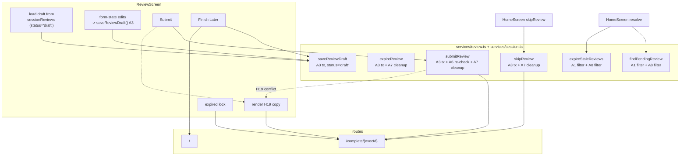

# Phase C-1: Review contract + V0B-02

## Overview

Finish the review flow on top of the V0B-30 / V0B-31 / V0B-32 service-layer work that already landed, and add the red-team Group A integration layer: enumerated A1 filters, A3 transactional guards, A6 submit-time cap re-check, A7 soft-block plumbing, A8 discarded-resume exclusion, A9 CompleteScreen universal landing, review-draft persistence with the `notCaptured` escape, Finish Later wiring, H19 conflict handoff, and V0B-02 / H13 tap-to-type as the sole pass-metric control.

This is the largest sub-phase by unit count (ten units). Every A-group item lands in the **same deploy** — partial landings produce inconsistent review data. V0B-02 carves in here instead of a nominal Phase D per `H6`, and H13 locks it as the only pass-metric control on the Review screen.

## Problem Frame

After C-0 lands, the type surface is ready (`SessionReview.status`, `storageMeta`) and writers emit `status`. But the **caller sites** still behave as if the `sessionRpe: -1` sentinel is live: `findPendingReview()` reads every review indiscriminately, there are no draft records to filter out, the Review screen has no Finish Later persistence, and the Home-skip / expired paths bypass CompleteScreen so the C-2 summary matrix can never fire for those cases.

The red-team fix plan v3 spells out six distinct correctness gaps (A1 through A9) plus H19 (conflict handoff) and H13 (V0B-02 sole-control). Each is a small edit in isolation; shipping any subset without the rest lands inconsistent state that is *worse* than the v0a baseline.

This plan packages all ten as one atomic sub-phase with a single-deploy guarantee.

## Requirements Trace

- R1. `findPendingReview()` and `expireStaleReviews()` filter out drafts (`status !== 'draft'`) AND discarded-resume sessions (`l.endedEarlyReason !== 'discarded_resume'`). The remaining A1 callers apply their caller-specific filter per the table in [docs/plans/2026-04-16-004-red-team-fixes-plan.md](2026-04-16-004-red-team-fixes-plan.md) §A1.
- R2. `submitReview` / `expireReview` / `skipReview` each wrap their read-decide-write in `db.transaction('rw', db.sessionReviews, ...)` (A3). A 4x3 state-vs-action matrix test asserts correct behavior for every cell.
- R3. `ReviewScreen.handleSubmit` re-checks `isPastDeferralCap(log, Date.now())` inside the submit handler **after** user intent is captured but **before** calling `submitReview`. If past, route to `/complete/{execId}` with the A6 copy (A6).
- R4. `storageMeta.ux.softBlockDismissed.{execId}` is readable / writable / deletable via typed helpers (`readSoftBlockDismissed` / `markSoftBlockDismissed` / `clearSoftBlockDismissed`). Terminal-review writes (`submitReview` / `expireReview` / `skipReview`) delete the key in the same transaction they land the review so `storageMeta` stays bounded (A7 cleanup).
- R5. `findPendingReview()` and `expireStaleReviews()` skip logs where `endedEarlyReason === 'discarded_resume'` (A8). Combined with R1 this closes the Home "Review pending" -> tap -> auto-bypass -> Home loop for discarded-resume sessions.
- R6. CompleteScreen is the universal post-session landing (A9 / H16). Submit success, Home-skip success, and ReviewScreen expired lock all route to `/complete/{execId}`. Discarded-resume routes to `/` (no summary — nothing to summarize).
- R7. Review draft persistence: on first meaningful change (first RPE tap, first pass-metric change, first quick-tag, first text in note), write a `SessionReview` with `status: 'draft'`. Overwrite on subsequent changes through A3. Re-entering the Review screen for the same `executionLogId` loads the draft into the form state.
- R8. `notCaptured` escape: a tap-target below the pass-metric input writes `goodPasses: 0, totalAttempts: 0` with `quickTag: 'notCaptured'` into form state; Submit is still gated on RPE only.
- R9. Finish Later button persists the form as a draft (R7) and navigates Home; no `incompleteReason` is required for Finish Later.
- R10. H19 refused-write UX: when `submitReview`'s A3 transaction discovers `existing.status === 'submitted'`, it refuses silently. ReviewScreen renders *"This session was already reviewed — showing what we saved."* and routes to `/complete/{execId}` with the persisted values.
- R11. V0B-02 / B5 / H13: `PassMetricInput` is tap-to-type only. No `+` / `-` / stepper controls. Good-passes and total-attempts each render as a tappable numeric display that opens a numeric keyboard; commit on blur or Enter.
- R12. No test regression in existing Vitest + Playwright suites.
- R13. The 4x3 A3 state-vs-action matrix is enumerated in [docs/plans/2026-04-16-004-red-team-fixes-plan.md](2026-04-16-004-red-team-fixes-plan.md) §A3; every cell has a test.

## Scope Boundaries

- **In scope:** Review service layer (`app/src/services/review.ts`, `app/src/services/session.ts`), ReviewScreen, CompleteScreen route targets (no layout changes — summary layout lands in C-2), PassMetricInput rewrite, a new `storageMeta` helper namespace (`softBlockDismissed`), review-draft read/write, notCaptured escape.
- **Not in scope (ships in C-2):** Summary copy matrix, verdict line rendering, bootstrap count, N alongside %, D86 copy regex guard.
- **Not in scope (ships in C-4):** D-C1 soft-block modal UI. C-1 ships the A7 plumbing; C-4 consumes it.
- **Not in scope (ships later):** Any multi-nudge or scheduled-prompt logic for Finish Later (cut per §2 of rest-of-v0b). Push notifications (out of scope for v0b).

### Critical-sequencing callout

**Single deploy only.** A1 filter + A3 transactions + A5 writers (already landed in C-0) + A6 submit re-check + A8 discarded-resume filter + A9 route flow ship together. Partial landings — e.g. A1 filter without A3 transactions, or A9 route without A6 re-check — produce inconsistent review data.

## Context and Research

### Relevant code

- [app/src/services/review.ts](../../app/src/services/review.ts) — `submitReview`, `expireReview`, `classifyCaptureWindow`, `FINISH_LATER_CAP_MS`, `loadSessionBundle`.
- [app/src/services/session.ts](../../app/src/services/session.ts) — `findPendingReview`, `expireStaleReviews`, `skipReview`, `discardSession` (writes `endedEarlyReason: 'discarded_resume'`).
- [app/src/screens/ReviewScreen.tsx](../../app/src/screens/ReviewScreen.tsx) — current submit flow, `isPastDeferralCap` helper, Finish later button (currently navigates Home without persisting).
- [app/src/screens/HomeScreen.tsx](../../app/src/screens/HomeScreen.tsx) — `handleSkipReview` (writes skip stub, no CompleteScreen route).
- [app/src/components/PassMetricInput.tsx](../../app/src/components/PassMetricInput.tsx) — current `+/-` stepper (to be removed).
- [app/src/services/storageMeta.ts](../../app/src/services/storageMeta.ts) — `getStorageMeta` / `setStorageMeta` / `setStorageMetaMany` (C-0 Unit 3).
- `app/src/services/__tests__/review.test.ts` — Dexie-backed review tests; extend with A3 matrix + H19 conflict.
- `app/src/services/__tests__/session.v0b.test.ts` — Dexie-backed session tests; extend with A8 filter cases.
- `app/e2e/session-flow.spec.ts` — Playwright reference for full-flow smokes.

### Patterns to follow

- A3 transactional guards use `db.transaction('rw', db.sessionReviews, db.storageMeta, async () => { ... })`. `storageMeta` enters the transaction because A7 cleanup writes in the same tx.
- Idempotency guards stay at the top of each writer (`const existing = await tx.table(...).where(...).first(); if (existing?.status === 'submitted') return`). Matches the existing pattern in `expireReview`.
- Route navigation uses `navigate(routes.complete(execId), { replace: true })` so the Review route drops from history.
- Draft reads happen once per mount via `useEffect`, keyed on `executionLogId`. Draft writes are fire-and-forget on form-state change, debounced conservatively (200 ms) so each keystroke in the text note does not produce a Dexie round-trip.
- Schema-blocked suppression: draft writes call `isSchemaBlocked()` before reporting errors to the user, matching HomeScreen / ReviewScreen precedent.

## Key Technical Decisions

1. **A1 filters stay in JavaScript, not indexes.** The review count per tester in the D91 cohort is bounded at ~20 records. No Dexie index on `status` is needed; the filter runs on the already-in-memory array from `toArray()`. Matches C-0 Key Decision #1 ("no index changes for optional fields").
2. **A3 transactions are intra-connection only.** Per H17, v0b does not add a `ver` optimistic-concurrency field. The correctness boundary is A3 (intra-connection atomicity) + A6 (submit-time cap re-check) + the 2 h cap. Rare cross-tab races can produce transient "pending -> expired" UI flickers; the ReviewScreen expired copy covers those cases. Documented in the A3 unit's approach.
3. **A7 helper surface is three functions, not a generic read-then-write primitive.** `readSoftBlockDismissed(execId)` returns a boolean; `markSoftBlockDismissed(execId)` writes the entry; `clearSoftBlockDismissed(execId, tx?)` deletes it, optionally inside a caller's transaction. Callers needing check-and-set atomicity (e.g. the modal itself in C-4) open their own `db.transaction('rw', db.storageMeta, async () => { ... })` per C-0 Key Decision #5.
4. **Draft writes land through the same A3 transaction envelope as terminal writes.** `saveReviewDraft(data)` wraps in `db.transaction('rw', db.sessionReviews, async (tx) => { ... })` and emits `status: 'draft'`. Re-using the envelope simplifies the A3 matrix — `submit` / `skip` / `expire` all expect `status: 'draft'` as one possible "existing" state.
5. **`notCaptured` writes form-state only.** The chip tap sets `goodPasses = 0` / `totalAttempts = 0` / appends `'notCaptured'` to the `quickTags` local array. It does not bypass the draft-persistence path. The server-side effect is identical to submitting those exact values.
6. **V0B-02 removes `+/-` entirely per H13.** Not "primary tap-to-type with +/- as secondary"; the entire stepper comes out of `PassMetricInput.tsx`. This is the exact thesis-extension H6 was designed to enforce: *one control, one pattern*.
7. **H19 copy renders inside ReviewScreen, not via a toast.** ReviewScreen transitions to a synthetic `conflicted` state that renders the copy + a button routing to CompleteScreen. No external notification surface.
8. **CompleteScreen route targets stay in `app/src/routes.ts`.** A9 is a routing decision, not a new screen; `/complete/{execId}` already exists. The A9 unit only rewires three caller sites.

## Open Questions

All resolved during planning:

- **Should draft writes debounce or commit-on-change?** Debounce 200 ms on the text note only; RPE tap / pass-metric change / quick-tag toggle commits immediately (single round-trip, no user-visible latency on a Dexie write).
- **Does H19 need an export flag so V0B-15 can tell refused-write conflicts from normal submits?** No — the refused-write never persists, so there is nothing to export. The conflict is a UI concern only.
- **Should A7 helpers delete the `softBlockDismissed` key on `skipReview`?** Yes. Any terminal-review write clears the key; otherwise stale entries accumulate indefinitely.

## High-Level Technical Design



Discarded-resume handling (not shown): `findPendingReview` + `expireStaleReviews` skip the log per A8; any code path that lands on `/review?id={discarded_resume_id}` via a stale URL hits the ReviewScreen auto-route-to-`/` belt (R6).

## Implementation Units

- [x] **Unit 1: A1 enumerated filters** — landed 2026-04-17

  **Goal:** Every caller site reads reviews through its intent-specific filter, not a generic "any review exists" check.

  **Requirements:** R1, R5

  **Dependencies:** C-0 landed (status + storageMeta table).

  **Files:**
  - Modify: `app/src/services/session.ts` — `findPendingReview`, `expireStaleReviews`.
  - Modify: `app/src/services/review.ts` — `expireReview` idempotency guard.
  - Modify: `app/src/services/__tests__/session.v0b.test.ts` — assert discarded-resume + draft filter behavior.

  **Approach:**
  - `findPendingReview`: the unreviewed-log scan currently filters by `!reviewedIds.has(l.id)` and the 2 h cap. Extend the review-set construction to *only include terminal reviews* (`status !== 'draft'`), so draft records don't shadow the pending state. Extend the log filter to exclude `l.endedEarlyReason === 'discarded_resume'` (A8).
  - `expireStaleReviews`: mirror the same two filters. A draft record on a past-cap log must **not** block expiration — the expire path overwrites drafts to the terminal `status: 'skipped'` stub.
  - `expireReview`: the idempotency guard `if (existing) return` currently short-circuits on any existing review. Change it to `if (existing && existing.status !== 'draft') return` so the expire path overwrites drafts (consistent with the v3 red-team fix plan A1 row: `expireReview` idempotency filter is `status !== 'draft'`).
  - Other A1 caller sites (C-2 counter, V0B-15 export, D-C1 modal) land in the sub-phases that own them; this unit covers the three session/review callers only.

  **Test scenarios:**
  - `findPendingReview` skips a log whose matching review is `status: 'draft'` (treats it as still pending — correct: drafts are pending).
  - `findPendingReview` skips a log with `endedEarlyReason === 'discarded_resume'`.
  - `expireStaleReviews` overwrites a past-cap `status: 'draft'` with a terminal `status: 'skipped'` + `quickTags: ['expired']`.
  - `expireStaleReviews` no-ops on a past-cap discarded-resume log.
  - `expireReview` overwrites a draft on the same log; no-ops on a terminal submitted/skipped.

  **Verification:** `npm run test -- --run session.v0b` passes; `npm run test -- --run review` passes.

- [x] **Unit 2: A3 transactional read-decide-write guards** — landed 2026-04-17

  **Goal:** Every writer that reads-decides-writes on `sessionReviews` wraps in an intra-connection transaction so the read and the write cannot interleave with a concurrent writer in the same tab.

  **Requirements:** R2, R13

  **Dependencies:** Unit 1 (A1 filter corrections land first so idempotency guards match).

  **Files:**
  - Modify: `app/src/services/review.ts` — `submitReview`, `expireReview`.
  - Modify: `app/src/services/session.ts` — `skipReview`.
  - Create: `app/src/services/__tests__/review.a3-matrix.test.ts` — 4x3 matrix: existing state (`none` / `draft` / `submitted` / `skipped`) x action (`submit` / `skip` / `expire`).

  **Approach:**

  Each writer adopts this shape:

  ```typescript
  await db.transaction('rw', db.sessionReviews, db.storageMeta, async (tx) => {
    const reviews = tx.table<SessionReview, string>('sessionReviews')
    const existing = await reviews
      .where('executionLogId')
      .equals(executionLogId)
      .first()
    // decide-write on existing + status
    // A7 cleanup inside the same tx
  })
  ```

  Idempotency / conflict rules by cell (from red-team fix plan v3 §A3):

  | Existing | submit | skip | expire |
  |----------|--------|------|--------|
  | none | write submitted | write skipped | write skipped |
  | draft | overwrite to submitted | overwrite to skipped | overwrite to skipped |
  | submitted | refuse silently (H19) | no-op | no-op |
  | skipped | no-op | no-op | no-op |

  H17 scope: intra-connection only. Cross-tab concurrency is bounded by the 2 h cap + A6 submit re-check, not by a `ver` field.

  **Test scenarios:** All 12 cells of the matrix. Each cell seeds the `existing` state, runs the action, asserts final DB state + return value.

  **Verification:** New Vitest suite passes; existing `review.test.ts` + `session.v0b.test.ts` continue to pass.

- [x] **Unit 3: A6 submit-time cap re-check** — landed 2026-04-17

  **Goal:** Re-check `isPastDeferralCap(log, Date.now())` inside `ReviewScreen.handleSubmit` after the user presses Submit but before calling `submitReview`. If past, route to `/complete/{execId}` with the A6 copy.

  **Requirements:** R3, R6

  **Dependencies:** Unit 2 (A3 transactions land so conflict detection is reliable).

  **Files:**
  - Modify: `app/src/screens/ReviewScreen.tsx`.
  - Modify: `app/src/screens/__tests__/ReviewScreen.pair-copy.test.tsx` or create `ReviewScreen.a6-cap-recheck.test.tsx`.

  **Approach:**
  - In `handleSubmit`, after `isSubmitting` is set and before `submitReview` is called, compute `const pastCap = isPastDeferralCap(log, Date.now())`. If true, set a synthetic `loaded.status = 'expired'` (or route directly via `navigate(routes.complete(executionLogId), { replace: true })` with a state flag so CompleteScreen renders the A6 copy).
  - A6 copy (per red-team fix plan v3 §A6): *"This session passed the 2 h window while you were filling in the review — it's saved in history but won't drive the next recommendation."* Copy actually renders on CompleteScreen in the C-2 Case A matrix ("No change") because the expired stub is `status: 'skipped'`; the only novel copy here is the transient message shown on the brief redirect.
  - Do **not** run `expireStaleReviews()` inline — that would fire the A3 conflict path. Just route; the next Home resolve sweeps the stale record.

  **Test scenarios:**
  - Simulate a log whose `completedAt` is 2 h 5 min in the past, mounted in ReviewScreen (`loaded.status === 'ready'` because the tester passed the cap during form filling). Pressing Submit triggers the re-check and routes to `/complete/{execId}` without writing a review.
  - Simulate a log inside the cap: Submit writes normally; no re-check redirect.

  **Verification:** New component test passes.

- [x] **Unit 4: A7 soft-block helper module** — landed 2026-04-17

  **Goal:** Typed helpers for the `storageMeta.ux.softBlockDismissed.{execId}` key, plus cleanup integration into the three terminal-review writers.

  **Requirements:** R4

  **Dependencies:** C-0 Unit 3 (`storageMeta` service helpers land).

  **Files:**
  - Create: `app/src/services/softBlock.ts` — three exported functions.
  - Modify: `app/src/services/review.ts` — `submitReview`, `expireReview` call `clearSoftBlockDismissed(execId, tx)` inside the A3 transaction.
  - Modify: `app/src/services/session.ts` — `skipReview` does the same.
  - Create: `app/src/services/__tests__/softBlock.test.ts`.

  **Approach:**

  ```typescript
  const key = (execId: string) => `ux.softBlockDismissed.${execId}` as const

  export async function readSoftBlockDismissed(execId: string): Promise<boolean> {
    const v = await getStorageMeta(key(execId), (x): x is true => x === true)
    return v === true
  }

  export async function markSoftBlockDismissed(execId: string): Promise<void> {
    await setStorageMeta(key(execId), true)
  }

  export async function clearSoftBlockDismissed(
    execId: string,
    tx?: Transaction,
  ): Promise<void> {
    const table = tx
      ? tx.table<StorageMetaEntry, string>('storageMeta')
      : db.storageMeta
    await table.delete(key(execId))
  }
  ```

  The `tx?` parameter lets the three writers call `clearSoftBlockDismissed(execId, tx)` inside their A3 transaction (R4 cleanup happens in the same tx as the terminal-review write). The modal itself (C-4) calls `clearSoftBlockDismissed(execId)` without a `tx`.

  **Test scenarios:**
  - `markSoftBlockDismissed` + `readSoftBlockDismissed` round-trip: true after mark, false after clear.
  - `readSoftBlockDismissed` returns false on a never-set execId.
  - After `submitReview` succeeds on an execId with `softBlockDismissed` set, the key is gone.
  - Same for `skipReview` and `expireReview`.

  **Verification:** New Vitest suite passes.

- [x] **Unit 5: A8 discarded-resume exclusion (finalization)** — landed 2026-04-17

  **Goal:** Belt-with-suspenders for the A8 filter: in addition to the service-layer filter (Unit 1), ReviewScreen auto-routes any log it loads with `endedEarlyReason === 'discarded_resume'` to `/`.

  **Requirements:** R5, R6

  **Dependencies:** Unit 1.

  **Files:**
  - Modify: `app/src/screens/ReviewScreen.tsx` — add the auto-route guard in `useEffect` after `loadSession` resolves.
  - Modify: `app/src/screens/__tests__/RunScreen.terminal-redirect.test.tsx` or create `ReviewScreen.discarded-resume.test.tsx`.

  **Approach:**
  - After `loadSession(executionLogId)` resolves, if `result.execution.endedEarlyReason === 'discarded_resume'`, immediately `navigate(routes.home(), { replace: true })` and skip setting form state.
  - No new copy. The Home screen already handles the landing.

  **Test scenarios:**
  - Seed a discarded-resume log, render ReviewScreen, assert the navigation fires and no form renders.
  - Seed a normal `ended_early` log (reason `'fatigue'`) — form renders normally.

  **Verification:** New component test passes.

- [x] **Unit 6: A9 CompleteScreen universal landing** — landed 2026-04-17

  **Goal:** Submit / Home-skip / expired-lock all route to `/complete/{execId}`. Discarded-resume routes to `/`.

  **Requirements:** R6

  **Dependencies:** Units 3, 5.

  **Files:**
  - Modify: `app/src/screens/HomeScreen.tsx` — `handleSkipReview` navigates to `/complete/{execId}` after the `skipReview` call succeeds.
  - Modify: `app/src/screens/ReviewScreen.tsx` — `loaded.status === 'expired'` renders the lock message briefly and auto-routes to `/complete/{execId}` (replace the current "Back to start" link flow).
  - Modify: `app/src/screens/__tests__/RunScreen.terminal-redirect.test.tsx` or create `ReviewScreen.expired-landing.test.tsx`.
  - Extend: `app/e2e/session-flow.spec.ts` — add the three route landings to the smoke.

  **Approach:**
  - `HomeScreen.handleSkipReview`: after `await skipReview(execId)`, call `navigate(routes.complete(execId))` instead of `resolve()` (resolve fires on the next Home visit, which is fine because CompleteScreen's Done button routes back to `/`).
  - `ReviewScreen` expired branch: render the existing lock message for a beat (or immediately) and `navigate(routes.complete(executionLogId), { replace: true })`. The C-2 Case A summary ("No change") renders there because the expired stub is `status: 'skipped'`.
  - Discarded-resume already routes to `/` via Unit 5's guard; no change here.

  **Test scenarios:**
  - Home -> Skip review (two-step confirm) -> CompleteScreen renders (Case A verdict after C-2 lands; for this unit, verify the route).
  - ReviewScreen on an expired log -> CompleteScreen (not Home).
  - ReviewScreen on a discarded-resume log -> Home (not CompleteScreen).
  - Normal submit -> CompleteScreen (existing behavior, regression covered).

  **Verification:** Component tests pass; Playwright `session-flow` smoke still green.

- [x] **Unit 7: Review draft persistence + notCaptured escape** — landed 2026-04-17

  **Goal:** Form edits on ReviewScreen persist as `status: 'draft'` through the A3 envelope. On re-entry (Home -> Finish Review), the draft loads into form state.

  **Requirements:** R7, R8

  **Dependencies:** Units 2, 4.

  **Files:**
  - Modify: `app/src/services/review.ts` — add `saveReviewDraft(data)` and `loadReviewDraft(execId): Promise<SessionReview | null>`.
  - Modify: `app/src/screens/ReviewScreen.tsx` — add `useEffect` to load draft on mount; add change-handler wrappers that call `saveReviewDraft`.
  - Modify: `app/src/components/PassMetricInput.tsx` — add a `notCaptured` chip (persists only form state; see Unit 10 for the tap-to-type rewrite).
  - Create: `app/src/services/__tests__/reviewDraft.test.ts`.

  **Approach:**

  `saveReviewDraft` shape (draft analog of `submitReview`):

  ```typescript
  export async function saveReviewDraft(data: DraftReviewData): Promise<void> {
    await db.transaction('rw', db.sessionReviews, async (tx) => {
      const reviews = tx.table<SessionReview, string>('sessionReviews')
      const existing = await reviews
        .where('executionLogId')
        .equals(data.executionLogId)
        .first()
      if (existing?.status === 'submitted') return
      await reviews.put({
        id: `review-${data.executionLogId}`,
        executionLogId: data.executionLogId,
        status: 'draft',
        sessionRpe: data.sessionRpe,
        goodPasses: data.goodPasses,
        totalAttempts: data.totalAttempts,
        drillScores: data.drillScores,
        incompleteReason: data.incompleteReason,
        quickTags: data.quickTags,
        shortNote: data.shortNote,
        submittedAt: Date.now(),
      })
    })
  }
  ```

  Draft load in ReviewScreen: after `loadSession`, also run `loadReviewDraft(executionLogId)`. If a draft exists, seed the form state from it (`sessionRpe`, `good`, `total`, `incompleteReason`, `quickTags`, `shortNote`). Submitting then overwrites via `submitReview` under A3.

  Change handlers call `saveReviewDraft` (fire-and-forget). The note field debounces 200 ms; RPE / pass-metric / quick-tags commit immediately (cheap Dexie puts). `isSchemaBlocked()` suppresses user-visible errors on write failures (HomeScreen precedent).

  `notCaptured` chip: tap sets `good = 0`, `total = 0`, toggles `quickTags` to include `'notCaptured'`, and triggers the change-handler (which persists the draft). Second tap removes `'notCaptured'` and leaves the zeros.

  **Test scenarios:**
  - First form edit writes a draft.
  - Subsequent edits overwrite the draft.
  - Re-mounting ReviewScreen for the same `executionLogId` seeds form state from the draft.
  - Submit overwrites the draft with `status: 'submitted'`.
  - `notCaptured` chip sets zeros + tag; untapping removes the tag.
  - Text note debounces: 5 keystrokes in 150 ms produce one draft write.

  **Verification:** New Vitest suite passes; new component test passes.

- [x] **Unit 8: Finish Later wiring + deferred sRPE re-entry** — landed 2026-04-17

  **Goal:** "Finish later" button persists the form as a draft (Unit 7) and navigates Home; Home's "Finish review" CTA routes back to ReviewScreen, which re-loads the draft via Unit 7's mount-time hook.

  **Requirements:** R7, R9

  **Dependencies:** Unit 7.

  **Files:**
  - Modify: `app/src/screens/ReviewScreen.tsx` — `handleFinishLater` awaits `saveReviewDraft(currentFormState)` then navigates Home.
  - No HomeScreen changes beyond what C-4 lands (current "Finish Review" CTA already routes to `/review?id={execId}`).
  - Modify: `app/e2e/session-flow.spec.ts` — extend smoke to cover Finish Later -> Home -> Finish Review -> draft loaded.

  **Approach:**
  - Change `handleFinishLater` from the current "navigate Home" to: `await saveReviewDraft({ ...formState, executionLogId })` then `navigate(routes.home())`.
  - No `incompleteReason` requirement: Finish Later persists whatever partial state exists.
  - Re-entry already works via Unit 7's load hook.

  **Test scenarios:**
  - Finish Later with partial state persists all filled fields; re-entry loads them.
  - Finish Later with empty state (no meaningful edits) still persists a draft with `submittedAt` + no RPE — or chooses not to persist (see Open Questions resolution below).
  - Playwright smoke: end session -> Review (partial) -> Finish Later -> Home shows review pending -> tap -> form pre-filled.

  **Verification:** Component test + e2e smoke pass.

  **Note on empty-state Finish Later:** Per Unit 7's "first meaningful change" trigger, a Finish Later with no meaningful edits does not create a draft. If the user genuinely tapped zero times, there is nothing to persist; the pending state already lives on the `ExecutionLog`, and `findPendingReview` returns it with or without a draft.

- [x] **Unit 9: H19 conflict handoff** — landed 2026-04-17

  **Goal:** When `submitReview`'s A3 transaction discovers `existing.status === 'submitted'`, refuses silently. ReviewScreen renders the H19 copy + routes to CompleteScreen with the persisted values.

  **Requirements:** R10

  **Dependencies:** Unit 2 (A3), Unit 6 (A9 route).

  **Files:**
  - Modify: `app/src/services/review.ts` — `submitReview` returns `{ status: 'ok' | 'refused' }` so the caller can differentiate.
  - Modify: `app/src/screens/ReviewScreen.tsx` — on `refused`, transition to `status: 'conflicted'` and render the H19 copy + "View saved review" button that routes to `/complete/{execId}`.
  - Create: `app/src/screens/__tests__/ReviewScreen.h19-conflict.test.tsx`.

  **Approach:**
  - A3 transaction returns `'refused'` when the existing state is `submitted`; `'ok'` otherwise.
  - Conflict copy: *"This session was already reviewed — showing what we saved."*
  - The conflict screen is a lightweight `StatusMessage` variant — same pattern as the current `missing` / `expired` branches.
  - Call-to-action: one button labeled "View saved review" that navigates to `/complete/{execId}`.

  **Test scenarios:**
  - Seed a submitted review for execId X; mount ReviewScreen for X with draft form state; press Submit; assert conflict screen renders and does not overwrite the submitted record.
  - Tap "View saved review" -> CompleteScreen loads the persisted values.
  - Normal submit (no conflict) still routes to CompleteScreen directly.

  **Verification:** New component test passes.

- [x] **Unit 10: V0B-02 / B5 / H13 tap-to-type pass metric** — landed 2026-04-17

  **Goal:** `PassMetricInput.tsx` becomes a tap-to-type-only control. No `+`, `-`, stepper, or ±5 / ±10 affordances.

  **Requirements:** R11

  **Dependencies:** Unit 7 (draft persistence wiring already goes through the change handlers that Unit 10 preserves).

  **Files:**
  - Rewrite: `app/src/components/PassMetricInput.tsx`.
  - Modify: `app/src/components/__tests__/PassMetricInput.test.tsx` (create if missing).

  **Approach:**
  - Each of "Good" and "Total" renders as a large tappable numeric display. Tap opens a numeric keyboard (`<input type="number" inputMode="numeric" pattern="[0-9]*" />` that is absolute-positioned over the display, or the display is the input styled to look like a display; both are acceptable — pick the simpler one).
  - Commit on blur or Enter. If the user types a "Good" that exceeds "Total", bump "Total" to match on commit (preserves the current invariant).
  - The `notCaptured` chip from Unit 7 lives below the two numeric displays.
  - No `+` / `-` / stepper / helper buttons anywhere in the component.
  - Keep the `rate` display below the inputs (existing `{rate}% good pass rate` line).

  **Test scenarios:**
  - Tap on "Good" display -> numeric keyboard opens.
  - Typing `8` then blurring commits 8; `onGoodChange(8)` fires once.
  - Typing `15` when `total=10` auto-bumps total to 15 on commit.
  - Typing `-1` rejects (clamp to 0) or prevents invalid input.
  - No `+` / `-` buttons render in the component (regex assertion against the DOM).
  - `notCaptured` chip tap sets 0/0 and appends tag (covered in Unit 7 test; verify rerender here).

  **Verification:** New / updated Vitest RTL test passes; `npm run test -- --run PassMetricInput` and ReviewScreen tests green.

## Risks and Dependencies

| Risk | Mitigation |
|------|------------|
| Partial deploy lands A1 filter without A3 transactions; concurrent writers corrupt state | Units 1 and 2 ship in the same PR; single-deploy constraint called out at the top of this plan |
| Draft writes flood Dexie during aggressive note typing | 200 ms debounce on note field; immediate commit for single-field inputs is ~1 round-trip per tap, well under the D91 load target |
| H19 refused-write confuses users who genuinely tapped Submit twice | Conflict screen copy explicitly says "already reviewed"; "View saved" button is unambiguous |
| V0B-02 tap-to-type regression on mobile keyboards that force landscape | Rely on `inputMode="numeric"` for iOS; Playwright smoke covers iOS viewport sizes |
| A7 cleanup forgotten on one of the three writers | Unit 4 test asserts cleanup for each of `submit` / `skip` / `expire` |
| ReviewScreen's current `Finish later` text link users rely on nav-without-persist | Migration is silent: the new behavior is strictly additive from the tester's perspective (draft was never persisted, now it is; re-entry is still a tap on Home's "Finish Review") |
| Cross-tab concurrency produces transient "pending -> expired" flicker | Documented in Key Decision #2; H17 accepts this; UX covered by expired copy |

## Sources and References

- **Origin:** [docs/plans/2026-04-16-003-rest-of-v0b-plan.md](2026-04-16-003-rest-of-v0b-plan.md) §C-1
- **Approved red-team fix plan v3:** [docs/plans/2026-04-16-004-red-team-fixes-plan.md](2026-04-16-004-red-team-fixes-plan.md) — Group A (A1-A9), H13 (V0B-02 sole control), H17 (intra-connection atomicity), H19 (refused-write UX)
- **UX spec:** [docs/specs/m001-phase-c-ux-decisions.md](../specs/m001-phase-c-ux-decisions.md) — Surface 4 (Review + Finish Later + deferred sRPE), D-C7 (status field)
- **Review micro-spec:** [docs/specs/m001-review-micro-spec.md](../specs/m001-review-micro-spec.md) — capture-window buckets, pair-session scope
- **Master sequencing:** [docs/plans/2026-04-17-phase-c-master-sequencing-plan.md](2026-04-17-phase-c-master-sequencing-plan.md)
- **Downstream consumers:** [docs/archive/plans/2026-04-17-feat-phase-c2-session-summary-plan.md](2026-04-17-feat-phase-c2-session-summary-plan.md) (reads `status === 'submitted'` counter + pain-first matcher), [docs/archive/plans/2026-04-17-feat-phase-c4-home-priority-plan.md](2026-04-17-feat-phase-c4-home-priority-plan.md) (consumes A7 helper)
- **Code precedents:** `app/src/services/review.ts` (writer shape landed in V0B-30 / V0B-31), `app/src/screens/ReviewScreen.tsx` (`isPastDeferralCap`, `formatFinishLaterWindow`), `app/src/services/session.ts` (`discardSession` writes the `'discarded_resume'` reason)
