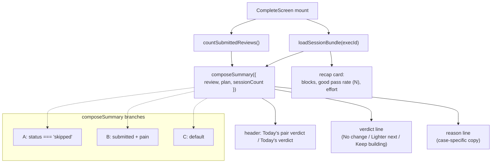

# Phase C-2: Session summary on CompleteScreen

## Overview

Extend CompleteScreen with the minimum-honest-copy session summary per `D-C2` and `D-C6`: a 3-case copy matrix (skipped / pain / default) with pain-first matching, the `Today's pair verdict` vs `Today's verdict` header by `playerCount`, session counter derived from submitted-only reviews, and the `V0B-13` rule that every pass-rate % display shows N alongside it.

Cut from C-2: the full `V0B-11` engine (`peak30`, `curr14/prev14`, novelty-spike, drill-variant aggregation) — deferred to M001-build. The four "Keep building" variants collapsed to one default case per `H10`. Bootstrap-vs-post-bootstrap distinction is not surfaced to the user per `H14`.

## Problem Frame

After C-1 lands, every terminal review state routes to `/complete/{execId}` (A9 / H16). Today CompleteScreen renders a generic "Session Complete" block with raw metrics and no forward-looking guidance. The D91 cohort needs one line of honest guidance per session that the engine can trust:

- A **skipped** review produces "No change" — tells the tester next session stays at the same level, matches the reality that we have no usable subjective load.
- A **submitted + pain** review produces "Lighter next" — tells the tester the plan will de-intensify, matches the pain-branch regulatory posture (D86).
- All other submitted reviews produce "Keep building" with a session counter + raw good/total numbers.

The code is straightforward; the correctness risk is in the copy (D86 avoid-phrase list, H10 collapse, H14 counter framing) and in the matcher order (`A2` pain-first).

## Requirements Trace

- R1. A pure function `composeSummary({ review, plan, sessionCount })` returns exactly one of the three cases for every valid `SessionReview` state (`A2`, `H10`).
- R2. Pain-first invariant: any session with `incompleteReason === 'pain'` AND `status === 'submitted'` returns Case B, regardless of other state (`A2`).
- R3. `status === 'skipped'` returns Case A ("No change") regardless of `incompleteReason` (`A2`).
- R4. Default case C: `"Session {N}. {good_passes} good passes today — {total_attempts} attempts."` with two modifiers:
  - If `totalAttempts < 50` and `goodPasses > 0`: append `" Not enough reps yet to trust the rate."`
  - If `totalAttempts === 0`: reason becomes `"Session {N} — one more in the book."`
- R5. Session counter `{N}` is the count of `SessionReview` records with `status === 'submitted'` on the local device at summary-render time (`A1`, `H18`). Drafts and skipped stubs do not contribute.
- R6. CompleteScreen header reads `Today's pair verdict` when `playerCount === 2`, `Today's verdict` when `playerCount === 1` (Surface 5).
- R7. Layout is inverted-pyramid: verdict largest, reason below, metrics below, save-status below (existing V0B-24 three-state copy), per Surface 5 wireframe.
- R8. V0B-13: every pass-rate display surface shows `N` alongside `%` (e.g. `72% (18 of 25)`).
- R9. D86 / H10 copy regex guard: summary copy never contains `compared`, `trend`, `progress`, `spike`, `overload`, `injury risk`, `first N days`, `baseline`, `early sessions` (H14 drops the "of your first 14 days" suffix that older drafts carried).
- R10. Verdict icon is a neutral equal-sign / steady-state glyph (no warning iconography), with `aria-hidden="true"` (the verdict word carries meaning for screen readers).
- R11. Verdict line has `aria-live="polite"` and is the first element the screen reader lands on inside the summary region.

## Scope Boundaries

- **In scope:** `composeSummary` pure function, CompleteScreen layout extension, session counter query, V0B-13 rule surfaced on CompleteScreen and anywhere else a pass-rate displays (in v0b: CompleteScreen only; the repeat card in C-5 also shows a rate).
- **Not in scope (M001-build):** `progress` / `deload` engine paths. v0b never renders them; the `hold` family's "Keep building" label is the only surface vocabulary live.
- **Not in scope:** Bootstrap / post-bootstrap tier copy on the default case. H14 dropped the "of your first 14 days" suffix; the counter is "Session {N}" unadorned.
- **Not in scope:** AI / LLM copy generation. Template composition from a fixed table only. The spec explicitly flags any LLM reach-around as a violation.
- **Not in scope:** A separate session history surface (deferred to V0B-33; the counter on the summary is the minimum-honest-slice history).

## Context and Research

### Relevant code

- [app/src/screens/CompleteScreen.tsx](../../app/src/screens/CompleteScreen.tsx) — current layout, uses `loadSessionBundle`, renders save-status.
- [app/src/services/review.ts](../../app/src/services/review.ts) — `loadSessionBundle` returns `{ log, plan, review }`.
- [app/src/lib/format.ts](../../app/src/lib/format.ts) — existing `effortLabel` (kept); extend with `formatPassRateWithN` if needed.
- `app/src/db/schema.ts` — `db.sessionReviews` for the counter query.

### Patterns to follow

- Pure functions in `app/src/domain/*.ts` with RTL-compatible return types. Precedent: `app/src/domain/sessionBuilder.ts`.
- Copy tables as module-level `const` records keyed by case enum. Precedent: `app/src/lib/storageCopy.ts`.
- Test-side regex guards as a single test that reads a representative sample of the composer's output (all three cases, pair + solo, varying RPE / totals) and asserts no forbidden substring.

## Key Technical Decisions

1. **`composeSummary` is the only copy source.** CompleteScreen calls it once per render with the loaded bundle + counter. No inline template composition elsewhere. This makes the H10 3-case matrix enforceable via contract test.
2. **Session counter runs as a Dexie count query on mount, not a live subscription.** `db.sessionReviews.toArray()` followed by in-memory filter on `status === 'submitted'`. At D91 cohort scale (~20 records max per tester) the query is negligible.
3. **Counter includes the session being summarized.** If this is the tester's first submitted review, `{N} = 1` ("Session 1. ..."). Defined at render time, after the submit has landed (the A9 route guarantees the submit completed before CompleteScreen mounts).
4. **Pair / solo header is the only place `playerCount` surfaces.** Verdict and reason strings are pair-agnostic in v0b per `D120` (pair-collective stance means no pair-averaged metrics, no split view).
5. **No conditional sub-reason for the "Keep building" default case beyond the two R4 modifiers.** Five variants worth of differentiation is matrix theater; three cases is the target per H10.
6. **Verdict icon is a Unicode equal sign or a pause glyph** rendered in `text-text-secondary`. Matches the "neutral steady-state" intent and avoids importing a new SVG.
7. **Copy regex guard is a live test, not a build-time check.** Runs in the RTL test suite; cheap enough to include in CI. Caught-at-merge is acceptable for a 5-tester cohort.

## Open Questions

All resolved during planning:

- **Does the counter count the current review before or after the render that renders it?** After. CompleteScreen mounts *after* the review has landed (A9 path guarantees this), so the counter reflects the already-persisted record.
- **Should "Session {N}" localize `N`?** No. v0b is English-only; localization is a future concern.
- **Does `notCaptured` submit count toward the counter?** Yes — it's still `status === 'submitted'`. The R4 `totalAttempts === 0` branch catches it with the "one more in the book" copy.

## High-Level Technical Design



## Implementation Units

- [x] **Unit 1: `composeSummary` pure function + copy table** — landed 2026-04-17

  **Goal:** Single source of truth for the 3-case copy matrix.

  **Requirements:** R1, R2, R3, R4, R9

  **Dependencies:** C-1 shipped (`SessionReview.status` semantics consistent end-to-end; A2 pain-first invariant implementable).

  **Files:**
  - Create: `app/src/domain/sessionSummary.ts`
  - Create: `app/src/domain/__tests__/sessionSummary.test.ts`

  **Approach:**

  ```typescript
  export type SummaryCase = 'skipped' | 'pain' | 'default'

  export interface SummaryInput {
    review: SessionReview
    plan: SessionPlan
    sessionCount: number
  }

  export interface SummaryOutput {
    case: SummaryCase
    header: string     // "Today's pair verdict" | "Today's verdict"
    verdict: string    // "No change" | "Lighter next" | "Keep building"
    reason: string     // plain prose
  }

  export function composeSummary(input: SummaryInput): SummaryOutput {
    const { review, plan, sessionCount } = input
    const header =
      plan.playerCount === 2 ? "Today's pair verdict" : "Today's verdict"

    // A2 ordering: skipped matches before default; pain matches before default.
    if (review.status === 'skipped') {
      return {
        case: 'skipped',
        header,
        verdict: 'No change',
        reason: 'No review this time — next session stays at the same level.',
      }
    }
    if (
      review.status === 'submitted' &&
      review.incompleteReason === 'pain'
    ) {
      return {
        case: 'pain',
        header,
        verdict: 'Lighter next',
        reason:
          'You stopped early with pain — next session will be gentler to let things settle.',
      }
    }
    return {
      case: 'default',
      header,
      verdict: 'Keep building',
      reason: composeDefaultReason(review, sessionCount),
    }
  }

  function composeDefaultReason(
    review: SessionReview,
    sessionCount: number,
  ): string {
    if (review.totalAttempts === 0) {
      return `Session ${sessionCount} — one more in the book.`
    }
    const base = `Session ${sessionCount}. ${review.goodPasses} good passes today — ${review.totalAttempts} attempts.`
    if (review.totalAttempts < 50 && review.goodPasses > 0) {
      return `${base} Not enough reps yet to trust the rate.`
    }
    return base
  }
  ```

  Defensive behavior: any unknown `status` (e.g. a stale `draft` that leaked through) falls through to the default case. Tests assert this.

  **Test scenarios:**
  - Case A: `status: 'skipped'` with any `incompleteReason` -> "No change".
  - Case A: `status: 'skipped', incompleteReason: 'pain'` -> "No change" (A2 skipped-first over pain).
  - Case B: `status: 'submitted', incompleteReason: 'pain'` -> "Lighter next".
  - Case C default: `status: 'submitted', goodPasses: 18, totalAttempts: 25, sessionCount: 3` -> `"Session 3. 18 good passes today — 25 attempts."`.
  - Case C low-N: `totalAttempts: 20, goodPasses: 10, sessionCount: 1` -> appends "Not enough reps yet to trust the rate."
  - Case C notCaptured: `totalAttempts: 0, goodPasses: 0` -> `"Session {N} — one more in the book."`.
  - Header: `plan.playerCount === 2` -> "Today's pair verdict"; `=== 1` -> "Today's verdict".
  - Regex guard: run all cases, assert no output line matches `/\b(compared|trend|progress|spike|overload|injury risk|first N days|baseline|early sessions)\b/i`.
  - Property test: enumerate every combination of `status` x `incompleteReason` from the allowed enums; assert each maps to exactly one `SummaryCase`.

  **Verification:** New Vitest suite passes.

- [x] **Unit 2: Session counter query** — landed 2026-04-17

  **Goal:** Derive `sessionCount` (the `{N}` in Case C) from submitted-only reviews.

  **Requirements:** R5

  **Dependencies:** None (Dexie reads are safe from C-0 onward).

  **Files:**
  - Modify: `app/src/services/review.ts` — export `countSubmittedReviews(): Promise<number>`.
  - Modify: `app/src/services/__tests__/review.test.ts`.

  **Approach:**

  ```typescript
  export async function countSubmittedReviews(): Promise<number> {
    const all = await db.sessionReviews.toArray()
    return all.filter((r) => r.status === 'submitted').length
  }
  ```

  No Dexie index on `status`; D91 cohort record counts make the in-memory filter negligible. This matches C-0 Key Decision #1 and the existing pattern in `findPendingReview`.

  **Test scenarios:**
  - Empty DB -> 0.
  - Three submitted + two skipped + one draft -> 3.
  - Stale v3 record with missing `status` but valid `sessionRpe` — per C-0 Unit 2 backfill, this record gets `status: 'submitted'` on v4 upgrade; counter returns 4. (Covered end-to-end by the C-0 migration test; Unit 2 here only asserts the post-migration behavior.)

  **Verification:** New Vitest test passes.

- [x] **Unit 3: CompleteScreen extension with summary layout** — landed 2026-04-17

  **Goal:** CompleteScreen renders the Surface 5 inverted-pyramid layout using `composeSummary` + `countSubmittedReviews`.

  **Requirements:** R6, R7, R10, R11

  **Dependencies:** Units 1, 2.

  **Files:**
  - Modify: `app/src/screens/CompleteScreen.tsx`.
  - Create: `app/src/screens/__tests__/CompleteScreen.summary.test.tsx` (extend existing test file if present).

  **Approach:**
  - Add `sessionCount` state; load it in the existing `useEffect` alongside `loadSessionBundle`.
  - When bundle is ready, compute `const summary = composeSummary({ review, plan, sessionCount })`.
  - Replace the static "Session Complete" header with `summary.header` as a small section header (14 px equivalent), then render:
    - Verdict icon (neutral equal sign / pause glyph) with `aria-hidden="true"`.
    - Verdict line (28-32 px, bold) with `aria-live="polite"`, containing `summary.verdict`.
    - Reason line (14 px, secondary color), containing `summary.reason`.
  - Keep the existing recap `Card` below the summary (blocks completed, pass rate, effort) with the V0B-13 rule applied to the pass-rate display (Unit 4).
  - Keep the save-status block (V0B-24) below the recap as it lives today.
  - Accessibility: the summary region is a single `<section aria-labelledby="summary-verdict">`; the verdict is an `<h2 id="summary-verdict">`.

  **Test scenarios:**
  - Seed a submitted review + plan (solo) + sessionCount=2 -> renders "Today's verdict" header, "Keep building" verdict, "Session 2. {good} good passes today — {total} attempts." reason.
  - Pair mode -> header "Today's pair verdict".
  - Skipped review -> "No change" + skipped reason.
  - Pain + submitted -> "Lighter next".
  - Verdict line has `aria-live="polite"`.
  - Verdict icon has `aria-hidden="true"`.

  **Verification:** Updated component test passes.

- [x] **Unit 4: V0B-13 N alongside % + D86 copy regex guard** — landed 2026-04-17 (`formatPassRateLine` helper landed with Unit 3 because CompleteScreen needed it to compile; Unit 4 added the copy-guard test + helper unit tests)

  **Goal:** Every pass-rate display renders `N` alongside `%`; a live test guards against forbidden vocabulary.

  **Requirements:** R8, R9

  **Dependencies:** Unit 3.

  **Files:**
  - Modify: `app/src/screens/CompleteScreen.tsx` — replace the `goodPassRatePct` display with the V0B-13 format.
  - Modify: `app/src/lib/format.ts` — add `formatPassRateLine(good, total)` returning the canonical "`72% (18 of 25)`" shape (or `"—"` when `total === 0`).
  - Create: `app/src/screens/__tests__/CompleteScreen.copy-guard.test.tsx`.

  **Approach:**
  - Helper:

    ```typescript
    export function formatPassRateLine(good: number, total: number): string {
      if (total === 0) return '—'
      const pct = Math.round((good / total) * 100)
      return `${pct}% (${good} of ${total})`
    }
    ```

  - CompleteScreen's recap card's `Good pass rate` row renders `formatPassRateLine(review.goodPasses, review.totalAttempts)` instead of the bare `{pct}%`.
  - Copy guard test:

    ```typescript
    const forbidden =
      /\b(compared|trend|progress|spike|overload|injury risk|first\s+\d+\s+days|baseline|early sessions)\b/i

    it('summary copy never uses forbidden vocabulary', () => {
      // render all three cases (solo + pair, low-N + high-N, pain + notCaptured)
      const container = render(...)
      const text = container.textContent ?? ''
      expect(text).not.toMatch(forbidden)
    })
    ```

  **Test scenarios:**
  - `formatPassRateLine(18, 25)` -> `"72% (18 of 25)"`.
  - `formatPassRateLine(0, 0)` -> `"—"`.
  - `formatPassRateLine(0, 10)` -> `"0% (0 of 10)"`.
  - Copy guard fires on a test fixture that inserts a forbidden word (sanity check).
  - Copy guard passes against the live composer output across all cases.

  **Verification:** New tests pass; existing CompleteScreen tests still green.

## Risks and Dependencies

| Risk | Mitigation |
|------|------------|
| Copy drift introduces a forbidden word later | The regex guard runs on every CI test run; any PR that adds forbidden vocabulary will fail |
| Bootstrap counter confuses testers who expect trend analysis | H14 drops the window-length framing; the counter is just "Session N" which is unambiguous |
| Pair verdict is read as "verdict about each player individually" | The header reads "Today's pair verdict"; the verdict and reason lines are pair-agnostic per D120; the save-status block and recap are unchanged |
| Session count race: submit completes but counter runs before Dexie is consistent | A9 route guarantees submit has persisted before CompleteScreen mounts. If somehow stale, the user sees `N-1`; at worst one session off for a render cycle — cosmetic only |
| Verdict icon rendering inconsistent across iOS / Android PWA | Use a text glyph (equal sign or pause), not an imported SVG, so platform font rendering differences are bounded |
| Summary copy has to change post-D91 when full engine lands | `composeSummary` is the only surface; swap the implementation in M001-build without touching callers |

## Sources and References

- **Origin:** [docs/plans/2026-04-16-003-rest-of-v0b-plan.md](2026-04-16-003-rest-of-v0b-plan.md) §C-2
- **Approved red-team fix plan v3:** [docs/plans/2026-04-16-004-red-team-fixes-plan.md](2026-04-16-004-red-team-fixes-plan.md) — A2 (3-case matrix), H10 (6 -> 3 collapse), H14 (drop suffix), H18 (bootstrap count semantics)
- **UX spec:** [docs/specs/m001-phase-c-ux-decisions.md](../specs/m001-phase-c-ux-decisions.md) — Surface 5 (Session summary on CompleteScreen), D-C2 (minimum-honest copy), D-C6 (extend CompleteScreen, no new route)
- **Upstream:** [docs/archive/plans/2026-04-17-feat-phase-c1-review-contract-plan.md](2026-04-17-feat-phase-c1-review-contract-plan.md) (A1 filter + A9 route flow)
- **Master sequencing:** [docs/plans/2026-04-17-phase-c-master-sequencing-plan.md](2026-04-17-phase-c-master-sequencing-plan.md)
- **Decisions:** D86 (regulatory copy), D91 (field test), D120 (pair-collective verdict), D121 (surface vocabulary)
