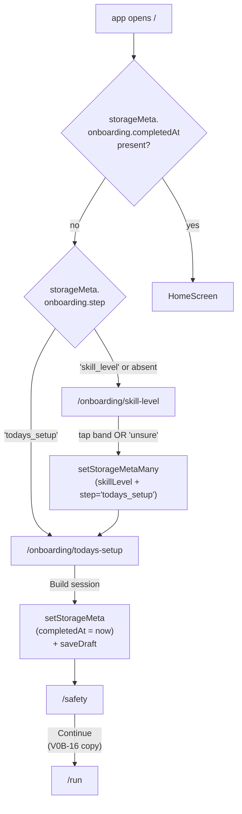

# Phase C-3: Two-screen onboarding

## Overview

Land the v0b first-run path: two screens (`Skill Level` -> `Today's Setup`), first-open routing off `storageMeta.onboarding.completedAt`, persistent resume semantics via `storageMeta.onboarding.step`, the `V0B-16` answer-first safety copy rewrite, and a single end-to-end Playwright smoke that proves the flow.

The Home/NewUser welcome screen is **cut** per `H9` / `C13`. First-open routes directly to Skill Level; a one-line preamble ("Welcome. Let's get you started.") sits above the existing heading. The onboarding backfill migration already lives in C-0 Unit 2; C-3 Unit 1 only verifies the trigger condition end-to-end.

## Problem Frame

Today there is no first-run surface. `/` routes to HomeScreen which routes the tester straight to `/setup` on "Start Workout". Two v0b invariants need a pre-setup capture:

- **D-C4 / D121:** The app needs a persisted Skill Level enum (`foundations` / `rally_builders` / `side_out_builders` / `competitive_pair` / `unsure`) for D91 retention-cohort correlation analysis and for post-hoc replay. No code path gates on it in v0b.
- **D93:** `SetupContext.wind` captures wind at session start. Wind is load-bearing for M001-build adaptation (heavier wind = lower effective intensity at the same RPE), but today the schema doesn't carry it.

The UX spec (Surface 1) also upgrades the safety copy per `V0B-16`: inline consequence lines under the pain question ("We'll switch to a lighter session if yes.") and recency chips ("0 days or First time -> shorter, lower-intensity start.") in D86 vocabulary.

Putting all three into one sub-phase lets the new first-run path ship atomically and keeps `V0B-16` honest by editing the safety surface in the same pass.

## Requirements Trace

- R1. When `storageMeta.onboarding.completedAt` is absent and the app opens `/`, the user lands on `/onboarding/skill-level` (not `/` Home or `/setup`).
- R2. `SkillLevelScreen` renders four pair-first functional-band buttons + a `Not sure yet` text link, per [docs/lib/skillLevel.ts](../../app/src/lib/skillLevel.ts) enum values and [docs/specs/m001-phase-c-ux-decisions.md](../specs/m001-phase-c-ux-decisions.md) Surface 1 wireframe. A one-line preamble reads "Welcome. Let's get you started." above the existing heading.
- R3. The Skill Level heading reads "Where's the pair today?" in pair mode and "Where are you today?" in solo mode. Descriptor pronouns swap accordingly (copy-only — the enum is shared).
- R4. On Skill Level tap, write `storageMeta.onboarding.skillLevel = {enum}` and `storageMeta.onboarding.step = 'todays_setup'` in a single transaction.
- R5. `TodaysSetupScreen` renders: player-mode toggle (Solo / Pair), time profile (15 / 25 / 40), equipment chips (net availability, wall availability), and a wind chip row (`Calm` / `Light wind` / `Strong wind`, default `Calm`).
- R6. On "Build session" tap, write `SessionDraft` via existing `buildDraft` + `saveDraft` AND write `storageMeta.onboarding.completedAt = Date.now()`. Route to `/safety` as today.
- R7. `SessionDraft.context.wind` is set from the wind chip selection (D93).
- R8. Back-behavior: no back arrow on Skill Level (first-open = no prior screen); back arrow on Today's Setup returns to Skill Level.
- R9. Resume semantics: if a user closes the tab on Skill Level and returns, they land on Skill Level. If they close on Today's Setup, they land on Today's Setup. Controlled by `storageMeta.onboarding.step`.
- R10. The onboarding backfill migration from C-0 Unit 2 (`backfillOnboardingCompletedAt`) prevents existing testers with `ExecutionLog` records from being force-routed through onboarding. R1's check reads the same key the migration backfills.
- R11. `SafetyCheckScreen` renders V0B-16 answer-first consequence copy: an inline secondary line under the pain question ("We'll switch to a lighter session if yes.") and an inline secondary line under the recency chips ("0 days or First time -> shorter, lower-intensity start.").
- R12. Playwright smoke: fresh install (clear IndexedDB) -> `/` -> Skill Level -> Today's Setup -> Safety -> Run first block. Second variant: seed an `ExecutionLog` + open -> backfill fires -> app lands on Home (not onboarding).

## Scope Boundaries

- **In scope:** New routes (`/onboarding/skill-level`, `/onboarding/todays-setup`), two new screens, first-open redirect, wind chip addition to SetupContext, V0B-16 copy on SafetyCheckScreen, resume semantics via `storageMeta.onboarding.step`.
- **Not in scope (cut per H9):** Home/NewUser welcome screen.
- **Not in scope (M001-build):** Any code path that gates on `skillLevel` (`skillLevelToDrillBand` is not called in v0b per `D-C4`).
- **Not in scope (cut per D121):** Secondary "about even / one newer / one stronger" pair-differential question; numeric band labels; per-drill band picker; "my level vs partner's level" split.
- **Not in scope:** Session Prep screen (cut per D98). `TodaysSetupScreen`'s "Build session" routes straight to `/safety`.
- **Not in scope:** Per-block swap affordance (Surface 3 calls this out, but it's a future polish item living on the existing Setup surface, not the onboarding surface).

## Context and Research

### Relevant code

- [app/src/screens/SetupScreen.tsx](../../app/src/screens/SetupScreen.tsx) — existing Setup flow. `TodaysSetupScreen` will share most of this code; the onboarding variant is essentially Setup with the wind chip added and a different navigation target (already `/safety`, unchanged).
- [app/src/screens/SafetyCheckScreen.tsx](../../app/src/screens/SafetyCheckScreen.tsx) — pain question + recency chips; V0B-16 copy lands here.
- [app/src/lib/skillLevel.ts](../../app/src/lib/skillLevel.ts) — D121 shim (`SKILL_LEVELS`, `SKILL_LEVEL_LABEL`, `isSkillLevel`, `skillLevelToDrillBand`). Reuse unchanged.
- [app/src/routes.ts](../../app/src/routes.ts) — route table; add onboarding routes.
- [app/src/main.tsx](../../app/src/main.tsx) — `BrowserRouter` + route tree; add the first-open guard.
- [app/src/services/storageMeta.ts](../../app/src/services/storageMeta.ts) — helper module from C-0 Unit 3.
- [app/src/domain/sessionBuilder.ts](../../app/src/domain/sessionBuilder.ts) — `buildDraft` consumes `SetupContext`; wind passes through.
- `app/e2e/phase-a-schema.spec.ts` — Playwright reference: `clearIndexedDB(page)` helper.

### Patterns to follow

- Top-level redirect in `main.tsx` / route tree: a small `FirstOpenGate` component that reads `storageMeta.onboarding.completedAt` on mount and renders either the onboarding outlet or the normal outlet. Keep the gate a single-purpose component so it's easy to test in isolation.
- Chip rows as a component: reuse the `ToggleChip` pattern already present in `SetupScreen.tsx`.
- Dexie writes through `setStorageMeta` / `setStorageMetaMany` from C-0 Unit 3; the Skill Level tap uses `setStorageMetaMany` to batch `skillLevel` + `step`.
- Type guard on read: `getStorageMeta(key, isSkillLevel)` pattern for skillLevel; `getStorageMeta(key, (x): x is number => typeof x === 'number')` for `completedAt`; `getStorageMeta(key, isOnboardingStep)` for `step`.

## Key Technical Decisions

1. **First-open gate is a route-tree guard, not a screen-level redirect.** Putting the check in `main.tsx`'s route tree prevents HomeScreen from flashing before the redirect fires. `FirstOpenGate` wraps the whole route tree, reads the meta on mount, and either renders a synchronous redirect or the children.
2. **Loading state is a blank screen, not a spinner.** The first read of `storageMeta.onboarding.completedAt` takes a few ms on warm Dexie; showing a spinner would flash. A blank screen (or the app chrome) covers the gap with less visual noise.
3. **Skill Level writes transaction the two keys together.** `setStorageMetaMany({ 'onboarding.skillLevel': enum, 'onboarding.step': 'todays_setup' })` ensures a crash between the writes doesn't leave a `step` pointing to a screen that depends on a `skillLevel` that's missing.
4. **Wind chip defaults to `Calm`, persists `undefined` when Calm.** Matching C-0 Key Decision #7: "callers handle undefined as 'calm'". This keeps existing `SessionPlan` records consistent and means the wind field is only materialized when it carries information.
5. **`V0B-16` copy lives on SafetyCheckScreen, not a new safety component.** Small inline additions under each question — no refactor, no test regression risk.
6. **`TodaysSetupScreen` shares the existing `SetupScreen` component with a feature flag, NOT a fork.** `SetupScreen` gains an `isOnboarding?: boolean` prop that: (a) suppresses the "prefilled from last session" behavior (first-open has no last session), (b) sets `onboarding.completedAt` on Build, (c) routes via the onboarding route tree back-stack. Avoiding a fork keeps wind-chip logic single-source.
7. **Route tree entries are `/onboarding/skill-level` and `/onboarding/todays-setup`.** The nested path helps URLs read right and makes the Playwright smoke's assertions unambiguous.
8. **D121 Skill Level escape (`'unsure'`) is a text link, not a fifth button.** Keeps the primary action rail four-tall and the escape visually secondary per the UX spec wireframe.

## Open Questions

All resolved during planning:

- **Should Skill Level let the tester pick pair-vs-solo for the descriptor pronoun swap before they've made it through Today's Setup?** No. The first-open path defaults the Skill Level descriptor to **pair** (the D121 pair-first framing is deliberate); if the tester later picks Solo on Today's Setup the persisted enum doesn't change, and the on-screen Skill Level copy is never shown again in v0b. The pronoun swap on re-entry (not a v0b concern) can read `storageMeta` + the active draft context.
- **Does the wind chip affect `buildDraft`?** Schema-only in v0b: `SetupContext.wind` is captured, but the session builder doesn't branch on it. M001-build reads it at load-computation time.
- **What happens if a user closes the tab mid-tap with `skillLevel` written but `step` not?** Atomicity of `setStorageMetaMany` prevents this (single transaction). If the partial write did land (say a Dexie regression), the R9 resume reads `step` and defaults to `skill_level` on absence, so the tester redoes Skill Level — idempotent and safe.

## High-Level Technical Design



## Implementation Units

- [x] **Unit 1: First-open gate + route tree wiring** — landed 2026-04-17

  **Goal:** Route `/` to `/onboarding/skill-level` when `storageMeta.onboarding.completedAt` is absent; respect `storageMeta.onboarding.step` as the specific onboarding screen to resume.

  **Requirements:** R1, R9, R10

  **Dependencies:** C-0 Unit 2 (`backfillOnboardingCompletedAt`), C-0 Unit 3 (`storageMeta` helper).

  **Files:**
  - Modify: `app/src/routes.ts` — add `onboardingSkillLevel` / `onboardingTodaysSetup`.
  - Modify: `app/src/main.tsx` — wrap the route tree in `<FirstOpenGate>`.
  - Create: `app/src/components/FirstOpenGate.tsx`.
  - Create: `app/src/components/__tests__/FirstOpenGate.test.tsx`.

  **Approach:**

  `FirstOpenGate` is a top-level wrapper:

  ```typescript
  export function FirstOpenGate({ children }: { children: ReactNode }) {
    const navigate = useNavigate()
    const { pathname } = useLocation()
    const [resolved, setResolved] = useState(false)

    useEffect(() => {
      void (async () => {
        const completedAt = await getStorageMeta(
          'onboarding.completedAt',
          (v): v is number => typeof v === 'number',
        )
        if (completedAt != null) {
          setResolved(true)
          return
        }
        // Not completed: route to the right onboarding step.
        const step = await getStorageMeta(
          'onboarding.step',
          isOnboardingStep,
        )
        const target =
          step === 'todays_setup'
            ? routes.onboardingTodaysSetup()
            : routes.onboardingSkillLevel()
        // Only redirect if we're not already inside /onboarding/*.
        if (!pathname.startsWith('/onboarding/')) {
          navigate(target, { replace: true })
        }
        setResolved(true)
      })()
    }, [navigate, pathname])

    if (!resolved) return null
    return <>{children}</>
  }
  ```

  `isOnboardingStep` is a small type-guard in `app/src/lib/onboarding.ts` (create if missing) exporting the `OnboardingStep = 'skill_level' | 'todays_setup'` type.

  **Test scenarios:**
  - No `onboarding.completedAt` + no `step` -> redirect to `/onboarding/skill-level`.
  - No `onboarding.completedAt` + `step === 'todays_setup'` -> redirect to `/onboarding/todays-setup`.
  - `onboarding.completedAt` set -> renders children (HomeScreen).
  - Existing `ExecutionLog` + backfill ran (C-0 Unit 2) -> `completedAt` set -> no redirect.
  - User already on `/onboarding/skill-level` -> no redirect (avoids loop).

  **Verification:** New component test passes; existing route-level tests green.

- [x] **Unit 2: `SkillLevelScreen` component** — landed 2026-04-17

  **Goal:** Render the D121 four-band picker + "Not sure yet" text link; on tap, persist `skillLevel` + `step` atomically and navigate to `/onboarding/todays-setup`.

  **Requirements:** R2, R3, R4

  **Dependencies:** Unit 1 (route exists).

  **Files:**
  - Create: `app/src/screens/SkillLevelScreen.tsx`.
  - Create: `app/src/screens/__tests__/SkillLevelScreen.test.tsx`.

  **Approach:**
  - Structure: preamble (`14 px` secondary) -> heading (`20 px` bold) -> four full-width buttons (>=60 px) with label + one-sentence descriptor -> "Not sure yet" text link (`14 px` underline).
  - Button click handler:

    ```typescript
    async function handlePick(level: SkillLevel) {
      await setStorageMetaMany({
        'onboarding.skillLevel': level,
        'onboarding.step': 'todays_setup',
      })
      navigate(routes.onboardingTodaysSetup())
    }
    ```

  - Descriptor copy lives in a module-level `const` keyed by `SkillLevel`:

    ```typescript
    const DESCRIPTOR_PAIR: Record<SkillLevel, string> = {
      foundations: 'Keeping a friendly toss alive.',
      rally_builders: 'Pass easy serves, short rallies.',
      side_out_builders: 'Pass to target, attack the 3rd.',
      competitive_pair: 'Tougher serves, game-like play.',
      unsure: '', // handled as a text link
    }
    // Solo variant swaps "we" -> "I" in the long D121 descriptors; v0b ships
    // the short pair version above on both solo and pair first-open because
    // the first-open default context is pair-first per D121.
    ```

  - `Not sure yet` handler writes `level = 'unsure'` through the same `handlePick`.
  - No back arrow.

  **Test scenarios:**
  - Renders five interactive elements (4 buttons + 1 text link).
  - Tap on "Foundations" writes `skillLevel = 'foundations'` + `step = 'todays_setup'` and navigates.
  - Tap on "Not sure yet" writes `skillLevel = 'unsure'`.
  - Preamble "Welcome. Let's get you started." renders.
  - Heading pair-default "Where's the pair today?" (solo pronoun swap is out of v0b scope; see Open Questions).
  - No back arrow in the DOM.

  **Verification:** New RTL test passes.

- [x] **Unit 3: `TodaysSetupScreen` component (SetupScreen with onboarding flag)** — landed 2026-04-17

  **Goal:** Reuse `SetupScreen` via an `isOnboarding` flag; add the wind chip row; on Build, write `onboarding.completedAt` + route to `/safety`.

  **Requirements:** R5, R6, R7, R8

  **Dependencies:** Units 1, 2.

  **Files:**
  - Modify: `app/src/screens/SetupScreen.tsx` — add `isOnboarding?: boolean` prop; add wind chip row.
  - Modify: `app/src/db/types.ts` — `SetupContext.wind` landed in C-0 Unit 1; verify the field flows through `saveDraft` (no change needed here).
  - Create: `app/src/screens/TodaysSetupScreen.tsx` — thin wrapper calling `<SetupScreen isOnboarding />`.
  - Modify: `app/src/domain/sessionBuilder.ts` — ensure `buildDraft` passes `wind` through `SetupContext` (schema is already there; verify).
  - Modify / Create: `app/src/screens/__tests__/SetupScreen.test.tsx` — cover wind chip + onboarding flag.

  **Approach:**
  - Add a `wind` state (`'calm' | 'light' | 'strong'`) defaulting to `'calm'`.
  - Render a chip row:

    ```
    Wind
    [ Calm ]  [ Light wind ]  [ Strong wind ]
    ```

  - Only persist `wind` into `SetupContext` when it's not `'calm'` (Key Decision #4).
  - Build handler, when `isOnboarding`, wraps the existing `saveDraft(draft)` with an additional `await setStorageMeta('onboarding.completedAt', Date.now())`. Both writes happen before navigation.
  - Back arrow on Today's Setup routes to `/onboarding/skill-level` when `isOnboarding`, otherwise the existing Home behavior.
  - Under the onboarding flag, the "prefilled from last session" effect is disabled (`getLastContext()` is still safe to call but the caller ignores the result).

  **Test scenarios:**
  - Render with `isOnboarding` -> back arrow goes to `/onboarding/skill-level`.
  - Wind chip "Light wind" tap -> `SetupContext.wind = 'light'` in the saved draft.
  - Wind chip "Calm" (default) tap -> `SetupContext.wind` absent from the saved draft.
  - Build under onboarding -> `onboarding.completedAt` is set.
  - Build outside onboarding -> `onboarding.completedAt` is NOT written (regression guard).

  **Verification:** Updated Vitest + RTL tests pass.

- [x] **Unit 4: V0B-16 answer-first safety copy** — landed 2026-04-17

  **Goal:** Inline consequence lines on `SafetyCheckScreen` under the pain question and the recency chips, using D86 vocabulary.

  **Requirements:** R11

  **Dependencies:** None (independent of onboarding wiring but ships in the same sub-phase for acceptance).

  **Files:**
  - Modify: `app/src/screens/SafetyCheckScreen.tsx`.
  - Modify: `app/src/screens/__tests__/SafetyCheckScreen.test.tsx` (create if missing).

  **Approach:**
  - Under the "Any pain that changes how you move?" heading, add a `14 px` secondary paragraph: "We'll switch to a lighter session if yes."
  - Under the "When did you last train?" heading, add a `14 px` secondary paragraph: "0 days or First time -> shorter, lower-intensity start."
  - Wording is D86-compliant (no "injury risk", no "overload"). Keep copy under 60 characters per line where possible.

  **Test scenarios:**
  - Pain consequence line renders.
  - Recency consequence line renders.
  - Copy regex guard (reuse from C-2 Unit 4 if pulled into a shared helper): no forbidden vocabulary.

  **Verification:** Updated RTL test passes.

- [x] **Unit 5: Resume semantics smoke + onboarding backfill verification** — landed 2026-04-17

  **Goal:** Explicitly test that tab-close-and-reopen lands on the correct step and that the C-0 backfill prevents existing testers from seeing onboarding.

  **Requirements:** R9, R10

  **Dependencies:** Units 1, 2, 3.

  **Files:**
  - Create: `app/src/components/__tests__/FirstOpenGate.resume.test.tsx`.
  - Modify: `app/src/db/__tests__/schema-v4-migration.test.ts` (if the assertion isn't already covered in C-0 Unit 2's test).

  **Approach:**
  - Seed `storageMeta.onboarding.step = 'todays_setup'` (no `completedAt`); mount the app root; assert the redirect lands on `/onboarding/todays-setup`.
  - Seed `storageMeta.onboarding.step = 'skill_level'`; assert redirect to `/onboarding/skill-level`.
  - Seed nothing; assert redirect to `/onboarding/skill-level`.
  - Simulate C-0 backfill: seed one `ExecutionLog` + no `onboarding.completedAt` + open the app -> C-0 migration fires -> `completedAt` set -> gate allows render of Home.

  **Test scenarios:**
  - Each of the five scenarios above.

  **Verification:** New tests pass.

- [x] **Unit 6: Playwright smoke — fresh install to first block** — landed 2026-04-17 (2/2 tests: fresh install + seeded-exec skip)

  **Goal:** End-to-end proof that first-open onboarding works in a real browser.

  **Requirements:** R1, R2, R6, R12

  **Dependencies:** Units 1-5.

  **Files:**
  - Create: `app/e2e/phase-c3-onboarding.spec.ts`.

  **Approach:**

  Sequence:
  1. `await page.goto('/')` -> app bundle loads.
  2. `await clearIndexedDB(page)` -> fresh Dexie state (no `onboarding.completedAt`).
  3. `await page.reload()` -> FirstOpenGate fires, redirect lands on `/onboarding/skill-level`.
  4. Tap "Foundations" -> URL is `/onboarding/todays-setup`.
  5. Tap Solo, tap 15 min, tap wind `Light wind`, tap Build session -> URL is `/safety`.
  6. Tap "No" for pain, tap "1 day" for recency, tap Continue -> URL is `/run?id=...`.
  7. First block renders (no assertion on block name — presence of Start Block button is sufficient).

  Second spec case: seed an `ExecutionLog` via `page.evaluate` BEFORE `page.goto('/')`, reload, assert URL stays on `/` (no onboarding redirect).

  **Test scenarios:**
  - Fresh install -> full flow completes.
  - Seeded exec log -> no onboarding.

  **Verification:** Playwright Chromium suite passes against `vite preview`.

## Risks and Dependencies

| Risk | Mitigation |
|------|------------|
| FirstOpenGate flashes HomeScreen before redirecting | `resolved` state renders `null` until the gate decides; the first Dexie read is ~5 ms on warm storage |
| Existing `SetupScreen` regresses when `isOnboarding` flag lands | Flag is additive; all existing callers get `undefined` which matches current behavior |
| Back arrow from Today's Setup in onboarding mode creates a loop if user hasn't finished Skill Level | `step === 'todays_setup'` implies `skillLevel` is already written; back navigates to Skill Level where the tester can re-pick and continue |
| Playwright smoke flakes on Dexie open timing | Use `page.waitForURL` instead of fixed delays; the gate resolves as soon as Dexie reads complete |
| Wind chip enum drifts from the spec as copy evolves | Enum persisted as the short machine value (`'calm'` / `'light'` / `'strong'`); labels are copy-only and safe to edit |
| V0B-16 copy drift from D86 vocabulary | Reuse the copy regex guard from C-2 Unit 4 in the SafetyCheckScreen test |

## Sources and References

- **Origin:** [docs/plans/2026-04-16-003-rest-of-v0b-plan.md](2026-04-16-003-rest-of-v0b-plan.md) §C-3
- **Approved red-team fix plan v3:** [docs/plans/2026-04-16-004-red-team-fixes-plan.md](2026-04-16-004-red-team-fixes-plan.md) — H9 (Home/NewUser cut), H15 (deployment posture + backfill)
- **UX spec:** [docs/specs/m001-phase-c-ux-decisions.md](../specs/m001-phase-c-ux-decisions.md) — Surface 1 (onboarding), D-C4 (skill level), D121 amendment
- **Decisions:** D-C4, D93 (wind), D121 (skill-level taxonomy rationale)
- **Code precedents:** [app/src/lib/skillLevel.ts](../../app/src/lib/skillLevel.ts) (D121 shim + type guard), [app/src/screens/SetupScreen.tsx](../../app/src/screens/SetupScreen.tsx) (reuse pattern), [app/src/screens/SafetyCheckScreen.tsx](../../app/src/screens/SafetyCheckScreen.tsx) (V0B-16 copy target)
- **Upstream:** [docs/archive/plans/2026-04-16-005-feat-phase-c0-schema-plan.md](2026-04-16-005-feat-phase-c0-schema-plan.md) (`storageMeta` + `SetupContext.wind` + backfill migration)
- **Master sequencing:** [docs/plans/2026-04-17-phase-c-master-sequencing-plan.md](2026-04-17-phase-c-master-sequencing-plan.md)
