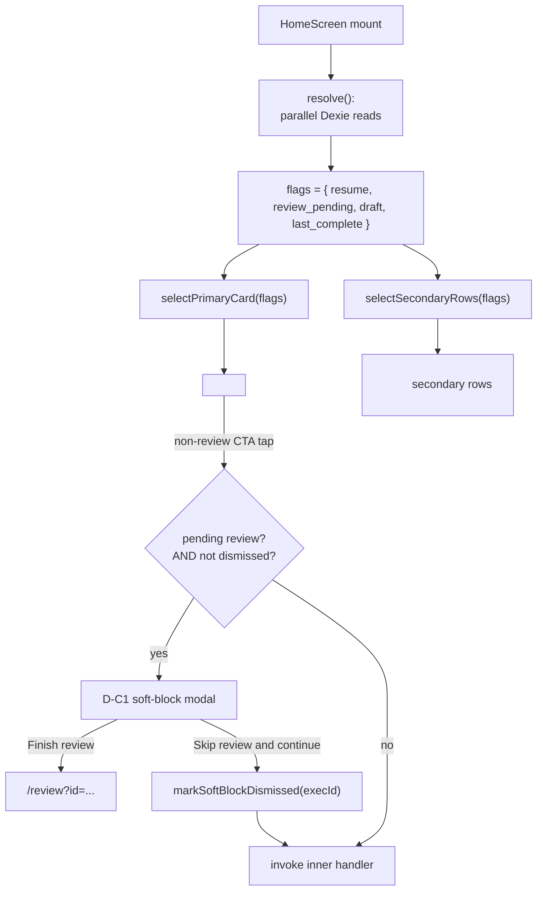

# Phase C-4: Home priority model + soft-block modal

## Overview

Extend `HomeScreen` from the current five-kind state machine (`loading | resume | review_pending | ready | error`) to the full flat 4-row precedence model from Surface 2: `resume > review_pending > draft > last_complete > new_user`. Add `HomePrimaryCard` + `HomeSecondaryRow` components, the `D-C1` soft-block modal that fires on non-review CTA tap when a review is pending, and the 7-row precedence component test matrix that proves exactly one primary card renders at a time.

Per `H11` / `C15`, no `>28d Welcome back` tier. Per `C5`, no aged-draft `>7d` / `>21d` tiers. Per `C6`, no multi-pending count UI (`findPendingReview` already returns newest-only). Per `H12`, no Safari->HSWA banner. The flat model is deliberate.

## Problem Frame

Today's Home handles three surfaces: `resume`, `review_pending`, and a single "ready" state that combines NewUser + returning users without differentiation. The v0b thesis *(surface what moved)* requires Home to carry:

- **Draft cards** — sessions the user built but didn't start.
- **LastComplete cards** — the repeat path primary for returning users (C-5 depends on this).
- **NewUser cards** — first-time tap that routes to the Skill Level screen (not a dedicated welcome, per H9).
- **Soft-block modal** — intercepts non-review CTA taps when a review is pending; A7 dismissal plumbing from C-1 keeps it to once per pending-review instance.

The combinatorial space is 4 boolean flags ($2^4 = 16$) but the precedence table collapses them to 7 distinct rows. Each row has a canonical primary card + secondary list.

## Requirements Trace

- R1. `resolve()` on HomeScreen returns a flat record of the four independent flags: `resume`, `review_pending`, `draft`, `last_complete`, plus the loaded bundles they index. NewUser is derived: true iff `!resume && !review_pending && !draft && !last_complete`.
- R2. A pure function `selectPrimaryCard(flags)` returns one of `resume | review_pending | draft | last_complete | new_user` per the precedence table. Secondary rows are returned separately.
- R3. Exactly one primary card renders at any time (property test across all 16 flag combinations).
- R4. `HomePrimaryCard` is a single component with a variant prop; `HomeSecondaryRow` is a compact variant.
- R5. Copy per Surface 2 wireframes: NewUser, Resume, Review Pending, Draft (Start), LastComplete (Repeat). Primary + secondary variants differ in CTA text where specified ("Finish Review (advisory)" in rows where it's not the primary).
- R6. Accessibility: primary card is a `<section role="region" aria-label="...">`; secondary list is a `<ul role="list">` with `<li>` rows. Update banner uses `aria-live="polite"` (existing).
- R7. D-C1 soft-block modal: when a review is pending AND the user taps a non-review CTA (Start Session, Repeat, Edit Draft), intercept with a modal asking "Finish review first" or "Skip review and continue". Only fires once per pending-review instance, keyed via `storageMeta.ux.softBlockDismissed.{execId}` through the C-1 A7 helper.
- R8. Modal dismissal persists: `markSoftBlockDismissed(execId)` on "Skip review and continue"; the modal does NOT fire again for the same `execId` on any subsequent tap.
- R9. Modal cleanup: C-1 Unit 4 already deletes the key in the same transaction as terminal-review writes. C-4 only consumes the helper; no cleanup work here.
- R10. NewUser primary routes to `/onboarding/skill-level` (not to a Home/NewUser welcome screen, which is cut per H9 / C13).
- R11. LastComplete primary is rendered by C-4 (shell only); the Repeat CTA behavior lands in C-5. Until C-5 ships, the LastComplete card's Repeat button routes to `/setup` pre-filled (already the default behavior of the Setup screen).

## Scope Boundaries

- **In scope:** HomeScreen state machine rewrite, precedence function, `HomePrimaryCard` + `HomeSecondaryRow` components, D-C1 soft-block modal UI + dismissal plumbing integration, copy updates per Surface 2, component test matrix.
- **Not in scope (C-5):** Repeat-this-session flow behavior (pre-fill, stale-context banner, ended-early branching). C-4 ships the LastComplete card shell with default Repeat-to-Setup behavior; C-5 upgrades it.
- **Not in scope (cut):** `>28d Welcome back` tier (H11), aged-draft `>7d` / `>21d` (C5), multi-pending count UI (C6), V0B-26 storage-health log (C2), V0B-27 Safari->HSWA banner (H12).
- **Not in scope (C-3):** First-open gate; C-3's `FirstOpenGate` handles the routing BEFORE Home ever renders. C-4 assumes `onboarding.completedAt` is set when HomeScreen mounts.

## Context and Research

### Relevant code

- [app/src/screens/HomeScreen.tsx](../../app/src/screens/HomeScreen.tsx) — current state machine, `resolve()`, `handleSkipReview`, `handleResume`, `handleDiscard`, `handleFinishReview`.
- [app/src/services/session.ts](../../app/src/services/session.ts) — `findResumableSession`, `findPendingReview`, `expireStaleReviews`, `getCurrentDraft`, `getLastContext`.
- [app/src/services/softBlock.ts](../../app/src/services/softBlock.ts) — C-1 Unit 4: `readSoftBlockDismissed`, `markSoftBlockDismissed`.
- [app/src/components/ResumePrompt.tsx](../../app/src/components/ResumePrompt.tsx) — existing Resume primary card; kept, re-used.
- [app/src/db/types.ts](../../app/src/db/types.ts) — `SessionDraft` (populated when a Build session exists), `SessionPlan`.

### Patterns to follow

- Boolean flags computed independently inside `resolve()` (parallel Dexie reads), then passed to a pure `selectPrimaryCard` function for testability. The rest of HomeScreen stays dumb.
- Modal uses the existing `<dialog>` or an accessible custom overlay with a focus trap. Precedent: the two-step skip confirm in the current HomeScreen uses inline confirmation; the soft-block modal needs a full overlay because it gates a CTA tap that has already been captured.
- Fire-and-forget modal dismissal: the modal's "Skip review and continue" action calls `markSoftBlockDismissed(execId)` then invokes the deferred CTA handler; no need for a user-visible spinner.

## Key Technical Decisions

1. **Precedence selection is a pure function over flags.** `selectPrimaryCard({ resume: true, review_pending: false, ... })` returns a variant. The `HomeScreen` component only owns wiring: Dexie reads into flags, flags into the pure selector, selector's output into JSX. Matches the testability pattern elsewhere in the repo (e.g. `sessionBuilder.ts`).
2. **Secondary rows are a separate pure function.** `selectSecondaryRows(flags)` returns an ordered array of row variants. Makes assertion in the 16-row test matrix explicit rather than having to parse the JSX.
3. **Soft-block modal lives inside HomeScreen, not as a route.** A separate route would invite URL sharing that breaks the "once per pending-review instance" contract. The modal is transient state.
4. **Modal fires at tap time, not at render time.** A modal that renders on every Home mount with a pending review pops on every app launch, which is unusable. The modal is a tap interceptor: when the user intends a non-review action, we ask once.
5. **CTA tap capture is a `useCallback` wrapper.** Each primary / secondary action (e.g. `handleStartWorkout`, `handleRepeat`, `handleEditDraft`) is wrapped by `interceptIfSoftBlock(execId, inner)` — a higher-order function that reads `softBlockDismissed` and either fires the modal or invokes the inner handler directly.
6. **NewUser primary CTA routes to `/onboarding/skill-level`**, not `/setup`. Per H9, the Welcome screen is merged into Skill Level's preamble; first-time users hit Skill Level directly from Home on a cold install that somehow skipped the gate (shouldn't happen, but defense in depth).
7. **Update banner stays unchanged.** Current V0B-20 `UpdatePrompt` renders above the primary card as today. Phase C-4 does not move it.
8. **Component test matrix uses a table-driven pattern.** One `describe` per primary variant; inside each, an `it.each` over the 16 flag combinations asserts exactly one primary and the expected secondary rows.

## Open Questions

All resolved during planning:

- **Does the soft-block modal fire on Resume too?** No. Resume has absolute precedence per the table; if `resume` is true, `review_pending` is muted to a secondary row and the modal concept doesn't apply.
- **If the user dismisses the modal for exec X, starts a new session, finishes it, and now has exec Y pending — does the modal fire again?** Yes. The `execId` key is instance-specific. Exec Y gets a fresh modal.
- **What if a draft exists but points to a stale plan (archetype removed)?** Not a C-4 concern. The existing `getCurrentDraft` returns whatever's persisted; downstream screens handle invalid state. C-4 only decides whether to *show* the draft card.

## High-Level Technical Design



## Implementation Units

- [x] **Unit 1: `resolve()` rewrite — four independent flags + NewUser derivation**

  **Goal:** Replace the current tagged-union `HomeState` with a flat record of independently-resolved flags so precedence selection is purely a function of flags.

  **Requirements:** R1

  **Dependencies:** C-1 landed (A1 filter correctly excludes drafts from `findPendingReview`), C-3 landed (`onboarding.completedAt` gate ensures Home only renders post-onboarding).

  **Files:**
  - Modify: `app/src/screens/HomeScreen.tsx` — state shape + `resolve()`.
  - Modify: `app/src/services/session.ts` — add `getLastComplete(): Promise<{ plan: SessionPlan; log: ExecutionLog; review: SessionReview } | null>`.
  - Modify: `app/src/services/__tests__/session.v0b.test.ts`.

  **Approach:**

  New state shape:

  ```typescript
  type HomeFlags = {
    resume: ResumableSession | null
    reviewPending: PendingReview | null
    draft: SessionDraft | null
    lastComplete: LastCompleteBundle | null
  }

  type HomeState =
    | { kind: 'loading' }
    | { kind: 'ready'; flags: HomeFlags }
    | { kind: 'error' }
  ```

  `resolve()` shape:

  ```typescript
  async function resolve(): Promise<HomeFlags> {
    const [resume] = await Promise.all([findResumableSession()])
    if (resume) {
      // short-circuit: resume overrides everything per precedence row 1
      return {
        resume,
        reviewPending: null,
        draft: null,
        lastComplete: null,
      }
    }
    // otherwise: run the rest in parallel
    await expireStaleReviews()
    const [reviewPending, draft, lastComplete] = await Promise.all([
      findPendingReview(),
      getCurrentDraft(),
      getLastComplete(),
    ])
    return { resume: null, reviewPending, draft, lastComplete }
  }
  ```

  `getLastComplete`: newest `ExecutionLog` with `status: 'completed' | 'ended_early'` AND a `status: 'submitted' | 'skipped'` `SessionReview` (per A1 filter semantics). Returns the plan + log + review bundle so the card has everything it needs to render.

  NewUser flag is **derived** from the other four (`!resume && !reviewPending && !draft && !lastComplete`), not stored.

  **Test scenarios:**
  - Empty DB -> all flags null -> NewUser derived true.
  - Resumable session -> only `resume` populated (other reads are short-circuited).
  - Pending review + last complete -> both populated; `reviewPending` primary per precedence (handled in Unit 2).
  - Draft + last complete -> both populated; `draft` primary per precedence.
  - Three-way (review_pending + draft + last_complete) -> all populated.
  - `getLastComplete` skips a log whose review is `status: 'draft'` (it's not yet terminal).
  - `getLastComplete` returns the newest terminal log by `completedAt`.

  **Verification:** Updated Vitest passes; existing HomeScreen tests continue to pass (may need updates for the new state shape).

- [x] **Unit 2: `selectPrimaryCard` + `selectSecondaryRows` pure functions**

  **Goal:** The precedence table codified as two pure functions; tested exhaustively over all 16 flag combinations.

  **Requirements:** R2, R3

  **Dependencies:** Unit 1.

  **Files:**
  - Create: `app/src/domain/homePriority.ts`.
  - Create: `app/src/domain/__tests__/homePriority.test.ts`.

  **Approach:**

  ```typescript
  export type PrimaryVariant =
    | 'resume'
    | 'review_pending'
    | 'draft'
    | 'last_complete'
    | 'new_user'

  export type SecondaryRow =
    | { kind: 'review_pending_advisory' }
    | { kind: 'draft' }
    | { kind: 'last_complete' }

  export interface FlagSummary {
    resume: boolean
    reviewPending: boolean
    draft: boolean
    lastComplete: boolean
  }

  export function selectPrimaryCard(flags: FlagSummary): PrimaryVariant {
    if (flags.resume) return 'resume'
    if (flags.reviewPending) return 'review_pending'
    if (flags.draft) return 'draft'
    if (flags.lastComplete) return 'last_complete'
    return 'new_user'
  }

  export function selectSecondaryRows(flags: FlagSummary): SecondaryRow[] {
    if (flags.resume) return [] // resume mutes everything
    const primary = selectPrimaryCard(flags)
    const rows: SecondaryRow[] = []

    if (primary === 'review_pending') {
      if (flags.draft) rows.push({ kind: 'draft' })
      if (flags.lastComplete) rows.push({ kind: 'last_complete' })
    }
    if (primary === 'draft' && flags.lastComplete) {
      rows.push({ kind: 'last_complete' })
    }
    // draft or last_complete primary with review pending promotes the review
    // to an advisory row — but since reviewPending having a true flag always
    // takes primary before draft/last_complete, that combination doesn't
    // actually produce `primary !== 'review_pending'` with reviewPending true.
    return rows
  }
  ```

  The invariant "exactly one primary" is trivially satisfied by the sequential `if` chain; the test enumerates all 16 combinations to prove it.

  **Test scenarios:**
  - All 16 flag combinations; for each, assert `selectPrimaryCard` returns exactly one variant.
  - Table-driven test of all 16 combinations asserting the expected `selectSecondaryRows` output.
  - Precedence: `{ resume: true, ...everything else }` -> `resume` primary, `[]` secondary.
  - Review pending + draft + last_complete -> `review_pending` primary, `[draft, last_complete]` secondary.
  - Draft + last_complete (no resume, no review) -> `draft` primary, `[last_complete]` secondary.
  - Nothing -> `new_user` primary, `[]` secondary.

  **Verification:** New Vitest suite passes; 16-row matrix covered.

- [x] **Unit 3: `HomePrimaryCard` + `HomeSecondaryRow` components**

  **Goal:** Variant-driven components that render per Surface 2 wireframes.

  **Requirements:** R4, R5, R6, R10, R11

  **Dependencies:** Units 1, 2.

  **Files:**
  - Create: `app/src/components/HomePrimaryCard.tsx`.
  - Create: `app/src/components/HomeSecondaryRow.tsx`.
  - Create: `app/src/components/__tests__/HomePrimaryCard.test.tsx`.
  - Create: `app/src/components/__tests__/HomeSecondaryRow.test.tsx`.

  **Approach:**

  `HomePrimaryCard` accepts a discriminated-union prop:

  ```typescript
  type HomePrimaryCardProps =
    | { variant: 'resume'; data: ResumableSession; onResume(): void; onDiscard(): void }
    | { variant: 'review_pending'; data: PendingReview; onFinish(): void; onSkip(): void; confirmingSkip: boolean }
    | { variant: 'draft'; data: SessionDraft; onStart(): void; onEdit(): void }
    | { variant: 'last_complete'; data: LastCompleteBundle; onRepeat(): void; onEdit(): void; onSameAsLast(): void }
    | { variant: 'new_user'; onStart(): void }
  ```

  Each variant renders a `<section role="region" aria-label="{specific}">`. Content matches the Surface 2 wireframe:
  - **Resume:** reuse the existing `<ResumePrompt>` component unchanged.
  - **Review Pending:** promote the current HomeScreen inline review_pending block into the primary card.
  - **Draft:** "Today's suggestion" title + archetype + duration + `[Start session]` primary + `[Edit]` secondary.
  - **LastComplete:** "Your last session" title + archetype + duration + days-ago + `Next time: {verdict}` line + `[Repeat this session]` primary + `[Edit]` secondary + `Same as last time` text link. (C-5 wires the actual handlers; C-4 ships the shell with C-5's handler names as props.)
  - **NewUser:** "Ready for your first session?" + `[Start first workout]` -> routes to `/onboarding/skill-level` per R10.

  `HomeSecondaryRow` renders a compact `<li>` with one CTA:
  - **`review_pending_advisory`:** "Finish review" text link.
  - **`draft`:** "Today's suggestion..." + `[Open]` button.
  - **`last_complete`:** "Your last session..." + `[Repeat]` button.

  No age-tier subtext per H11 / C5 cuts.

  **Test scenarios:**
  - Each variant renders the expected CTAs and ARIA roles.
  - NewUser primary CTA handler routes via `onStart` (wired in Unit 5).
  - Variants render without crashing for representative fixture data.
  - Secondary row variants render correctly.

  **Verification:** New RTL tests pass.

- [x] **Unit 4: D-C1 soft-block modal**

  **Goal:** Intercept non-review CTA taps when a review is pending; fire once per pending-review instance.

  **Requirements:** R7, R8, R9

  **Dependencies:** Unit 3, C-1 Unit 4 (softBlock helper).

  **Files:**
  - Create: `app/src/components/SoftBlockModal.tsx`.
  - Modify: `app/src/screens/HomeScreen.tsx` — add `interceptIfSoftBlock` wrapper.
  - Create: `app/src/components/__tests__/SoftBlockModal.test.tsx`.
  - Modify: `app/src/screens/__tests__/HomeScreen.test.tsx`.

  **Approach:**

  `SoftBlockModal` is an accessible overlay with focus trap:

  ```typescript
  interface Props {
    pendingReview: PendingReview
    onFinish(): void
    onSkipAndContinue(): void
    onClose(): void
  }
  ```

  Copy (from D-C1):
  - Title: "Finish your review first?"
  - Body: "You have a review pending for {planName} — finish it, or skip and continue?"
  - Primary: "Finish review"
  - Secondary: "Skip review and continue"
  - Close (X) at top-right that calls `onClose` without dismissing.

  HomeScreen wrapper:

  ```typescript
  const interceptIfSoftBlock = useCallback(
    (innerAction: () => void) => async () => {
      if (!flags.reviewPending) return innerAction()
      const dismissed = await readSoftBlockDismissed(
        flags.reviewPending.executionId,
      )
      if (dismissed) return innerAction()
      setSoftBlockTarget({
        pendingReview: flags.reviewPending,
        innerAction,
      })
    },
    [flags.reviewPending],
  )
  ```

  - "Finish review" action inside the modal: `navigate(routes.review(pendingReview.executionId))`.
  - "Skip review and continue" action: `await markSoftBlockDismissed(pendingReview.executionId)` then invoke `innerAction`.
  - "Close" button: just close the modal without marking dismissed — the next CTA tap fires the modal again. (Matches "dismiss" != "skip".)

  Applies to these CTA handlers (per R7):
  - NewUser Start (but NewUser implies no reviewPending — defensive only).
  - Draft Start / Edit.
  - LastComplete Repeat / Edit / SameAsLast.
  - Secondary-row variant CTAs for draft and last_complete.

  Does NOT intercept:
  - Resume (resume implies no reviewPending per precedence).
  - Review Pending's own Finish / Skip.
  - Secondary-row `review_pending_advisory` Finish (that's the review CTA).

  **Test scenarios:**
  - Review pending + not dismissed + user taps non-review CTA -> modal renders.
  - Modal "Finish review" -> navigates to `/review?id=...`, does NOT mark dismissed.
  - Modal "Skip review and continue" -> marks dismissed, invokes inner action.
  - After dismissal, the same CTA tap invokes the action directly (no modal).
  - Modal close (X) -> next tap fires the modal again (no mark).
  - Focus trap: tabbing stays inside the modal.
  - ESC key closes the modal (no mark).

  **Verification:** New RTL tests pass.

- [x] **Unit 5: HomeScreen integration + copy updates**

  **Goal:** Wire Units 1-4 together inside HomeScreen. Update copy strings to match Surface 2 wireframes.

  **Requirements:** R5, R10, R11

  **Dependencies:** Units 1-4.

  **Files:**
  - Modify: `app/src/screens/HomeScreen.tsx`.
  - Modify: `app/src/screens/__tests__/HomeScreen.test.tsx` — expand to a state matrix.

  **Approach:**
  - Replace the existing tagged-union JSX with: `if (state.kind === 'ready') { render <HomePrimaryCard variant=... /> + <ul> of <HomeSecondaryRow ... /></ul> }`.
  - Wire action handlers:
    - `handleStartWorkout` (NewUser + Draft start) -> routes per variant: NewUser to `/onboarding/skill-level`, Draft to `/safety` via `getCurrentDraft` flow.
    - `handleResume` / `handleDiscard` / `handleFinishReview` / `handleSkipReview` retain current implementations.
    - `handleRepeat` / `handleEditDraft` / `handleSameAsLast` -> route stubs that satisfy the prop shape; C-5 fills them in.
  - Apply `interceptIfSoftBlock` to every non-review CTA per Unit 4's handler list.
  - Copy per Surface 2:
    - NewUser primary: "Ready for your first session?" + "3 minutes of setup, then ~15 min on sand." + "Start first workout".
    - Resume primary (existing `<ResumePrompt>`): keep current copy.
    - Review Pending primary: "Review your last session - {planName}" + "Finish review" / "Skip review".
    - Draft primary: "Today's suggestion - {archetypeName} - {duration} min" + "Start session" + "Edit".
    - LastComplete primary: "Your last session - {archetypeName} - {duration} min - {daysAgo}" + `Next time: {verdict}` (reads C-2's `composeSummary` output) + "Repeat this session" + "Edit" + "Same as last time".

  **Test scenarios:**
  - Full 7-row precedence component test: seed Dexie for each row, mount HomeScreen, assert the expected primary variant + secondary rows.
  - Soft-block modal integration: review pending + user taps Draft Start -> modal renders.
  - NewUser Start routes to `/onboarding/skill-level` (regression guard: NOT `/setup`).
  - LastComplete renders the C-2 verdict in the "Next time" line (integration with `composeSummary`; shell test verifies the prop is passed).
  - Dismissal state: `markSoftBlockDismissed(execId)` set before mount -> modal does not fire on first CTA tap.

  **Verification:** Updated RTL tests pass; Playwright home-state scenarios stay green.

## Risks and Dependencies

| Risk | Mitigation |
|------|------------|
| `resolve()` parallel reads produce inconsistent flags (e.g. draft was deleted between parallel reads) | Parallel reads are each Dexie point queries; within one tick, inconsistency is bounded to "flag-present-but-deleted-immediately" which is no worse than today. C-1's A3 transactions cover multi-tab writes |
| Soft-block modal fires on every re-render because dismissal state is async | `interceptIfSoftBlock` is a handler wrapper, not a render-time predicate; modal only opens on tap |
| Modal dismissal leaks across testers if dev-tooling seeds the DB inconsistently | `storageMeta.ux.softBlockDismissed.{execId}` is execId-scoped; a new session produces a new execId |
| Primary card accessibility regression on screen readers | `role="region"` + `aria-label` per variant; tests assert each variant's aria-label |
| LastComplete prop shape couples C-4 to C-5 implementation details | C-4 defines the prop shape; C-5 implements the handlers. Prop shape is documented in Unit 3 and stable |
| The 7-row precedence matrix missing a cell under test | Unit 2's 16-combination table-driven test covers every row of the underlying flag space; wider than the 7-row surface table |

## Sources and References

- **Origin:** [docs/plans/2026-04-16-003-rest-of-v0b-plan.md](2026-04-16-003-rest-of-v0b-plan.md) §C-4
- **Approved red-team fix plan v3:** [docs/plans/2026-04-16-004-red-team-fixes-plan.md](2026-04-16-004-red-team-fixes-plan.md) — H11 (>28d cut), H12 (V0B-27 cut), H9 (Home/NewUser cut), C5 / C6 (aged-draft + multi-pending cuts)
- **UX spec:** [docs/specs/m001-phase-c-ux-decisions.md](../specs/m001-phase-c-ux-decisions.md) — Surface 2 (Home), D-C1 (soft-block), D-C8 (one-primary rule)
- **Home and sync notes:** [docs/specs/m001-home-and-sync-notes.md](../specs/m001-home-and-sync-notes.md) — priority model, save copy
- **Upstream:** [docs/archive/plans/2026-04-17-feat-phase-c1-review-contract-plan.md](2026-04-17-feat-phase-c1-review-contract-plan.md) (A7 softBlock helper + A8 discarded-resume filter + A9 universal landing), [docs/archive/plans/2026-04-17-feat-phase-c3-two-screen-onboarding-plan.md](2026-04-17-feat-phase-c3-two-screen-onboarding-plan.md) (FirstOpenGate runs before Home)
- **Downstream:** [docs/archive/plans/2026-04-17-feat-phase-c5-repeat-path-plan.md](2026-04-17-feat-phase-c5-repeat-path-plan.md) (implements the LastComplete handlers C-4 defines)
- **Master sequencing:** [docs/plans/2026-04-17-phase-c-master-sequencing-plan.md](2026-04-17-phase-c-master-sequencing-plan.md)
