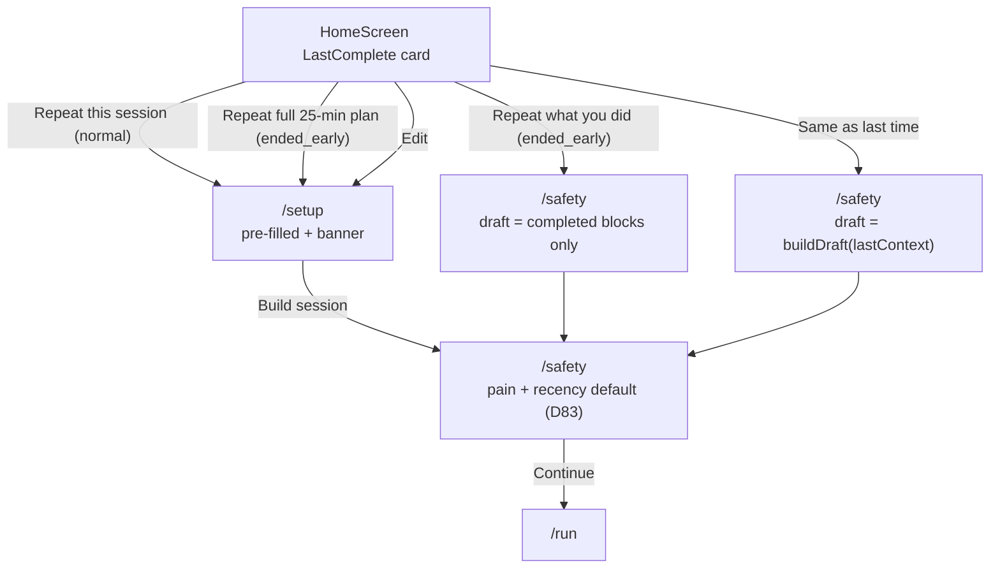

# Phase C-5: Repeat path

## Overview

Wire the LastComplete -> Setup-prefilled -> Safety -> Run path: `Repeat this session` primary CTA, `Same as last time` tertiary text link (skips Setup), ended-early branching (`Repeat full plan` vs `Repeat what you did`), stale-context banner on pre-filled Setup, and the D83 invariant that safety answers are never pre-filled.

Rationale `"See why"` UI is **cut** per `C7` / `H7`. The `SessionDraft.rationale` schema field (C-0 Unit 1) stays for M001-build; no UI consumer ships in v0b. Age >28d branching is **cut** per `H11` / `C15`.

## Problem Frame

C-4 ships the LastComplete primary card shell with C-5's handler names as props. C-5 fills in those handlers + the pre-filled Setup experience + the ended-early branch on the card.

Key invariants to preserve:

- **D83:** Pain and recency on SafetyCheckScreen are per-session — never pre-filled, never cached.
- **D37 plan-locking:** The original plan snapshots at session start. "Repeat full plan" recreates from `SessionPlan`; "Repeat what you did" recreates from the block subset actually completed.
- **H7 / C7:** No "See why" or "What changes next time" UI. The card's "Next time: {verdict}" line reads the C-2 composer output; no rationale string rendered.

The flow has two shapes (normal and ended-early) driven by `log.status`. "Same as last time" is the one-tap path that skips Setup.

## Requirements Trace

- R1. LastComplete primary card's "Repeat this session" CTA routes to `/setup` with the last `SessionPlan.context` pre-filled into Setup chips.
- R2. `Same as last time` tertiary text link on LastComplete routes directly to `/safety` with a freshly-built `SessionDraft` from the last context (skips Setup entirely).
- R3. If `lastComplete.log.status === 'ended_early'`: the primary card renders **two** buttons instead of one: `Repeat full 25-min plan` (primary, matches original intent per D37) and `Repeat what you did (14 min)` (secondary). Minute counts come from the plan's planned total and the actually-completed blocks.
- R4. Pre-filled Setup renders a stale-context banner: `Setup pre-filled from {dayName}. Adjust if today's different.` The day name reads as `Tuesday`, `Monday`, etc., computed from `lastComplete.log.completedAt`.
- R5. D83 invariant: `SafetyCheckScreen` on the repeat path renders pain and recency in their default (unselected) state. Tested by mutation: seed pain/recency in the last log's `SessionPlanSafetyCheck`, navigate via Repeat, assert the Safety form is blank.
- R6. `Repeat what you did` (ended-early variant) builds a `SessionDraft` containing only the blocks whose `blockStatuses[i].status === 'completed'`. Other block types pass through unchanged.
- R7. No `SessionDraft.rationale` UI consumer. `buildDraft()` continues to emit `undefined` per C-0 Key Decision #8; the repeat card does NOT render a `rationale` line.
- R8. Playwright smoke: `/` LastComplete -> Repeat -> `/setup` (pre-filled) -> `/safety` (pain/recency default) -> `/run`.

## Scope Boundaries

- **In scope:** LastComplete handlers (`onRepeat`, `onEdit`, `onSameAsLast`) and the corresponding flow wiring; ended-early branching in the card; stale-context banner on pre-filled Setup; Playwright smoke.
- **Not in scope (cut):** Rationale "See why" UI (H7); "What changes next time" line on LastComplete (H7); aged-LastComplete `>28d Welcome back` tier (H11).
- **Not in scope:** Session history surface (deferred V0B-33; LastComplete is a single-record card, not a list).
- **Not in scope:** Set-window marker UI from `SessionPlan.context.setWindowPlacement` (V0B-14 post-D91).
- **Not in scope:** LastComplete card shell component (lands in C-4 Unit 3; C-5 only fills in handlers).

## Context and Research

### Relevant code

- [app/src/screens/HomeScreen.tsx](../../app/src/screens/HomeScreen.tsx) — C-4 lands `handleRepeat` / `handleEditDraft` / `handleSameAsLast` as stubs on HomeScreen; C-5 fills in the behavior.
- [app/src/screens/SetupScreen.tsx](../../app/src/screens/SetupScreen.tsx) — already calls `getLastContext()` on mount to pre-fill (existing v0a behavior); C-5 adds the banner.
- [app/src/services/session.ts](../../app/src/services/session.ts) — `getLastContext()` returns the last `SessionPlan.context`. `createSessionFromDraft` already exists for the Same-as-last-time skip-Setup path.
- [app/src/domain/sessionBuilder.ts](../../app/src/domain/sessionBuilder.ts) — `buildDraft`. C-5 adds `buildDraftFromCompletedBlocks(plan, log)` for the ended-early variant.
- [app/src/components/HomePrimaryCard.tsx](../../app/src/components/HomePrimaryCard.tsx) — C-4 Unit 3 defines the `last_complete` variant with handler props + ended-early branching.
- [app/src/lib/format.ts](../../app/src/lib/format.ts) — existing date helpers; extend with `formatDayName(timestamp)` returning `Tuesday`, `Today`, `Yesterday`, etc.

### Patterns to follow

- `Same as last time` bypasses Setup by calling `buildDraft(lastContext)` + `saveDraft(draft)` then navigating to `/safety`. SafetyCheckScreen already loads the draft via `getCurrentDraft()` — no new logic needed.
- Ended-early variant builds an alternate `SessionDraft` from the subset of completed blocks in the original `SessionPlan`. `buildDraft` accepts a pre-composed block list if we extend its surface, or we add `buildDraftFromBlocks(context, blocks)` as a sibling.
- Stale-context banner is a dumb presentational component: `<StaleContextBanner dayName={formatDayName(log.completedAt)} />`.

## Key Technical Decisions

1. **"Same as last time" writes a new `SessionDraft` before navigating.** Doesn't rely on SafetyCheckScreen reading the last context directly; stays consistent with the existing "draft must exist before safety" contract.
2. **Ended-early variant builds from `SessionPlan.blocks`, not from the `SessionDraft` that built it.** The draft is deleted after session creation; the persisted plan is the source of truth. Block statuses come from `ExecutionLog.blockStatuses`.
3. **Stale-context banner always renders on the repeat path.** No age threshold — even a 2-minute-ago session gets the banner. The language ("Adjust if today's different") is gentle; rendering it consistently is easier to reason about than threshold logic.
4. **Day name uses the tester's local timezone.** `Intl.DateTimeFormat(locale, { weekday: 'long' })` with `navigator.language`. "Today" and "Yesterday" are special-cased over raw weekday names.
5. **D83 invariant is enforced by *not* touching SafetyCheckScreen.** SafetyCheckScreen already renders pain / recency in default state; there is no code path that reads cached safety. C-5 ships a regression test that asserts this, so a future change that adds a cache breaks CI.
6. **`buildDraftFromCompletedBlocks` preserves block ordering.** If the tester completed blocks 1, 2, 4 (skipped 3), the new draft contains blocks 1, 2, 4 in that order. Deviating from original order is a surprise.
7. **Repeat full plan (ended-early variant) rebuilds from the original context, not the original block list.** This ensures any drill-catalog updates post-session apply. Matches the "repeat the *intent*" interpretation.

## Open Questions

All resolved during planning:

- **Should Same-as-last-time re-check safety answers?** Yes. D83 is absolute. Same-as-last-time skips *Setup*, not *Safety*.
- **What happens on Repeat if the last plan referenced a drill that's since been removed from the catalog?** Open item flagged in the UX spec's "Open items to brainstorm" (Flow E13). Not a C-5 blocker: v0b drill catalog is fixed for the D91 cohort, so this edge case can't fire. Post-D91, a simple "substitute or refuse" rule lands.
- **Does ended-early branching apply to Same-as-last-time too?** No. Same-as-last-time is a one-tap escape for testers confident nothing has changed; it always builds the full plan from the last context. The ended-early nuance belongs to the deliberate Repeat primary CTA.

## High-Level Technical Design



## Implementation Units

- [x] **Unit 1: `handleRepeat` + stale-context banner**

  **Goal:** Primary Repeat CTA (normal case) routes to `/setup` with last context pre-filled; the stale-context banner renders there.

  **Requirements:** R1, R4

  **Dependencies:** C-4 Unit 3 (LastComplete card shell + prop shape).

  **Files:**
  - Modify: `app/src/screens/HomeScreen.tsx` — implement `handleRepeat` (currently a stub from C-4 Unit 5).
  - Modify: `app/src/screens/SetupScreen.tsx` — render `<StaleContextBanner />` when `isFromRepeat` state is set.
  - Create: `app/src/components/StaleContextBanner.tsx`.
  - Modify: `app/src/lib/format.ts` — add `formatDayName(timestamp, now?)`.
  - Create: `app/src/components/__tests__/StaleContextBanner.test.tsx`.
  - Modify: `app/src/screens/__tests__/SetupScreen.test.tsx`.

  **Approach:**

  `handleRepeat` in HomeScreen: navigate to `/setup?from=repeat` (or pass state via `navigate`'s state arg — pick the cleaner option; `from=repeat` is greppable).

  SetupScreen reads `from === 'repeat'` from the search param (or state). When true, and when `getLastContext()` returns a context, render the banner above the chip rows:

  ```typescript
  {isFromRepeat && lastCompletedAt != null && (
    <StaleContextBanner dayName={formatDayName(lastCompletedAt)} />
  )}
  ```

  `StaleContextBanner`:

  ```typescript
  export function StaleContextBanner({ dayName }: { dayName: string }) {
    return (
      <section
        role="status"
        aria-live="polite"
        className="rounded-[12px] bg-info-surface p-3 text-sm text-text-secondary"
      >
        Setup pre-filled from {dayName}. Adjust if today&rsquo;s different.
      </section>
    )
  }
  ```

  `formatDayName(timestamp, now = Date.now())`:
  - If same calendar date (local) -> "Today".
  - If calendar-yesterday -> "Yesterday".
  - If within the last 7 days -> weekday name ("Tuesday").
  - Else -> short date ("Apr 9"). (Not reachable in the 14-day D91 window with the "Home age cut" rules, but defensive for edge cases.)

  **Test scenarios:**
  - `formatDayName(now)` -> "Today".
  - `formatDayName(now - 24h)` -> "Yesterday".
  - `formatDayName(now - 3*24h)` -> weekday name.
  - `StaleContextBanner` renders with `role="status"` + `aria-live="polite"`.
  - SetupScreen with `from=repeat` + last context -> banner renders.
  - SetupScreen without `from=repeat` -> no banner.

  **Verification:** New / updated tests pass.

- [x] **Unit 2: `handleSameAsLast` — skip-Setup path**

  **Goal:** Tap `Same as last time` builds a draft from the last context and routes to `/safety` directly.

  **Requirements:** R2, R5

  **Dependencies:** Unit 1 (shares `getLastContext` wiring).

  **Files:**
  - Modify: `app/src/screens/HomeScreen.tsx` — implement `handleSameAsLast`.
  - Create: `app/src/screens/__tests__/HomeScreen.same-as-last.test.tsx`.

  **Approach:**

  ```typescript
  const handleSameAsLast = useCallback(async () => {
    const context = await getLastContext()
    if (!context) return
    const draft = buildDraft(context)
    if (!draft) {
      // The current context can't build — fall back to Setup with the banner.
      navigate(`${routes.setup()}?from=repeat`)
      return
    }
    await saveDraft(draft)
    navigate(routes.safety())
  }, [navigate])
  ```

  The "can't build" fallback covers the `buildDraft` return-null case (current context doesn't yield a valid session — rare, but defensive).

  **Test scenarios:**
  - Last context available + `buildDraft` succeeds -> draft saved, navigate `/safety`.
  - Last context unavailable -> no-op (or early-return; test asserts no navigation).
  - `buildDraft` returns null -> fallback navigates to `/setup?from=repeat`.
  - SafetyCheckScreen loads the new draft successfully.

  **Verification:** New RTL test passes.

- [x] **Unit 3: Ended-early branching on LastComplete card + `buildDraftFromCompletedBlocks`**

  **Goal:** When the last log is `ended_early`, the card renders two buttons; the secondary one builds a draft from the completed-block subset.

  **Requirements:** R3, R6

  **Dependencies:** C-4 Unit 3 (shell already defines the variant props), Unit 1.

  **Files:**
  - Modify: `app/src/components/HomePrimaryCard.tsx` — extend the `last_complete` variant to render two buttons when `data.log.status === 'ended_early'`.
  - Modify: `app/src/domain/sessionBuilder.ts` — add `buildDraftFromCompletedBlocks(log, plan): SessionDraft | null`.
  - Modify: `app/src/screens/HomeScreen.tsx` — add `handleRepeatWhatYouDid` that uses the new builder.
  - Modify: `app/src/components/__tests__/HomePrimaryCard.test.tsx`.
  - Create: `app/src/domain/__tests__/buildDraftFromCompletedBlocks.test.ts`.

  **Approach:**

  Card variant branching:

  ```tsx
  {data.log.status === 'ended_early' ? (
    <>
      <Button variant="primary" fullWidth onClick={onRepeat}>
        Repeat full {plannedTotalMinutes}-min plan
      </Button>
      <Button variant="outline" fullWidth onClick={onRepeatWhatYouDid}>
        Repeat what you did ({actualMinutes} min)
      </Button>
    </>
  ) : (
    <Button variant="primary" fullWidth onClick={onRepeat}>
      Repeat this session
    </Button>
  )}
  ```

  `plannedTotalMinutes` = sum of `plan.blocks[].durationMinutes`. `actualMinutes` = sum of `plan.blocks[i].durationMinutes` for blocks where `log.blockStatuses[i].status === 'completed'`.

  `buildDraftFromCompletedBlocks(log, plan)`:
  - Filter `plan.blocks` to the subset whose `log.blockStatuses[i].status === 'completed'` (preserve plan order).
  - Build a `SessionDraft` with `plan.context` and the filtered block list (each plan block becomes a draft block; IDs and metadata map 1:1).
  - Return `null` if zero blocks completed (the secondary button should be disabled or omitted in that case — the ended-early branch typically has at least a warm-up completed, but defensive).

  `handleRepeatWhatYouDid`:

  ```typescript
  const handleRepeatWhatYouDid = useCallback(async () => {
    if (!flags.lastComplete) return
    const draft = buildDraftFromCompletedBlocks(
      flags.lastComplete.log,
      flags.lastComplete.plan,
    )
    if (!draft) return
    await saveDraft(draft)
    navigate(routes.safety())
  }, [flags.lastComplete, navigate])
  ```

  Wrap with `interceptIfSoftBlock` per C-4 Unit 4.

  **Test scenarios:**
  - Ended-early variant renders two buttons with correct minute counts.
  - Normal variant renders one button.
  - `buildDraftFromCompletedBlocks` with 3 of 5 blocks completed -> returns draft with those 3 blocks in order.
  - `buildDraftFromCompletedBlocks` with 0 completed -> returns null.
  - `handleRepeatWhatYouDid` saves the partial draft + navigates to `/safety`.
  - `handleRepeat` on an ended-early log rebuilds the FULL plan (regression guard: should NOT reuse completed-only blocks).

  **Verification:** New / updated tests pass.

- [x] **Unit 4: D83 invariant regression test + Playwright smoke**

  **Goal:** Pin the D83 safety-never-prefill invariant and prove the end-to-end repeat path in a real browser.

  **Requirements:** R5, R8

  **Dependencies:** Units 1-3.

  **Files:**
  - Create: `app/src/screens/__tests__/SafetyCheckScreen.d83-regression.test.tsx`.
  - Create: `app/e2e/phase-c5-repeat.spec.ts`.

  **Approach:**

  D83 regression test:
  - Seed a previous `SessionPlan` with `safetyCheck: { painFlag: true, trainingRecency: '0 days', heatCta: true, painOverridden: true }`.
  - Call `handleSameAsLast` (or directly navigate through the repeat path).
  - Render `SafetyCheckScreen`.
  - Assert: pain `painFlag` state is `null` (default); `recency` state is `null` (default). No persisted values read.

  Playwright smoke (`phase-c5-repeat.spec.ts`):
  1. Seed IndexedDB via `page.evaluate`: one completed `ExecutionLog` + `SessionPlan` + submitted `SessionReview`. Clear any draft.
  2. `await page.goto('/')` -> Home shows LastComplete primary.
  3. Tap "Repeat this session" -> URL is `/setup` + stale-context banner renders.
  4. Tap Build -> `/safety` + pain/recency default.
  5. Select pain No + recency "1 day" + Continue -> `/run?id=...`.

  Second spec case: seed an `ended_early` log; Home shows two buttons ("Repeat full N min" + "Repeat what you did (M min)"). Tap "Repeat what you did" -> `/safety` directly with a subset draft.

  Third spec case: Home -> "Same as last time" text link -> `/safety` directly -> pain/recency default.

  **Test scenarios:**
  - D83 regression test asserts pain + recency default.
  - Playwright: normal-case Repeat happy path.
  - Playwright: ended-early variant happy path.
  - Playwright: Same-as-last-time happy path.

  **Verification:** Regression test + Playwright suite pass.

## Risks and Dependencies

| Risk | Mitigation |
|------|------------|
| Tester re-uses Same-as-last-time from a pair context while alone today | The stale-context banner appears on the Setup-prefilled path but NOT on Same-as-last-time; mitigation is a founder-contact check for D91 testers, since persistent-team-identity is out of v0b per D114-D117 |
| `buildDraftFromCompletedBlocks` produces a draft with only warm-up completed -> session is too short to be useful | Returns null (caller no-ops); UI shows the primary "Repeat full plan" instead |
| Day-name computation uses UTC instead of local time | `Intl.DateTimeFormat` respects local timezone; test covers a log near midnight local to guard against regression |
| Stale context banner clutters the normal Setup flow | Banner renders only when `from=repeat` param is set; normal Setup-from-Home is unchanged |
| D83 invariant regresses if someone adds a cache to SafetyCheckScreen | The regression test seeds prior safety answers and asserts defaults; any attempt to cache trips it |
| "Repeat what you did" minute label drifts from the actual block duration | Label reads directly from `plan.blocks[].durationMinutes` summed over completed blocks; no rounding shenanigans |

## Sources and References

- **Origin:** [docs/plans/2026-04-16-003-rest-of-v0b-plan.md](2026-04-16-003-rest-of-v0b-plan.md) §C-5
- **Approved red-team fix plan v3:** [docs/plans/2026-04-16-004-red-team-fixes-plan.md](2026-04-16-004-red-team-fixes-plan.md) — H7 / C7 (rationale UI cut), H11 / C15 (>28d tier cut)
- **UX spec:** [docs/specs/m001-phase-c-ux-decisions.md](../specs/m001-phase-c-ux-decisions.md) — Surface 6 (Repeat path), D-C3 (hybrid Repeat), D-C5 (duplicate-and-edit folded into Repeat)
- **Decisions:** D37 (plan-locking), D83 (per-session safety), D-C3, D-C5
- **Upstream:** [docs/archive/plans/2026-04-17-feat-phase-c2-session-summary-plan.md](2026-04-17-feat-phase-c2-session-summary-plan.md) (verdict line on LastComplete card), [docs/archive/plans/2026-04-17-feat-phase-c4-home-priority-plan.md](2026-04-17-feat-phase-c4-home-priority-plan.md) (card shell + handler prop shape)
- **Code precedents:** [app/src/screens/SetupScreen.tsx](../../app/src/screens/SetupScreen.tsx) (`getLastContext` prefill pattern), [app/src/screens/SafetyCheckScreen.tsx](../../app/src/screens/SafetyCheckScreen.tsx) (D83 default state lives here), [app/src/domain/sessionBuilder.ts](../../app/src/domain/sessionBuilder.ts) (`buildDraft`)
- **Master sequencing:** [docs/plans/2026-04-17-phase-c-master-sequencing-plan.md](2026-04-17-phase-c-master-sequencing-plan.md)
