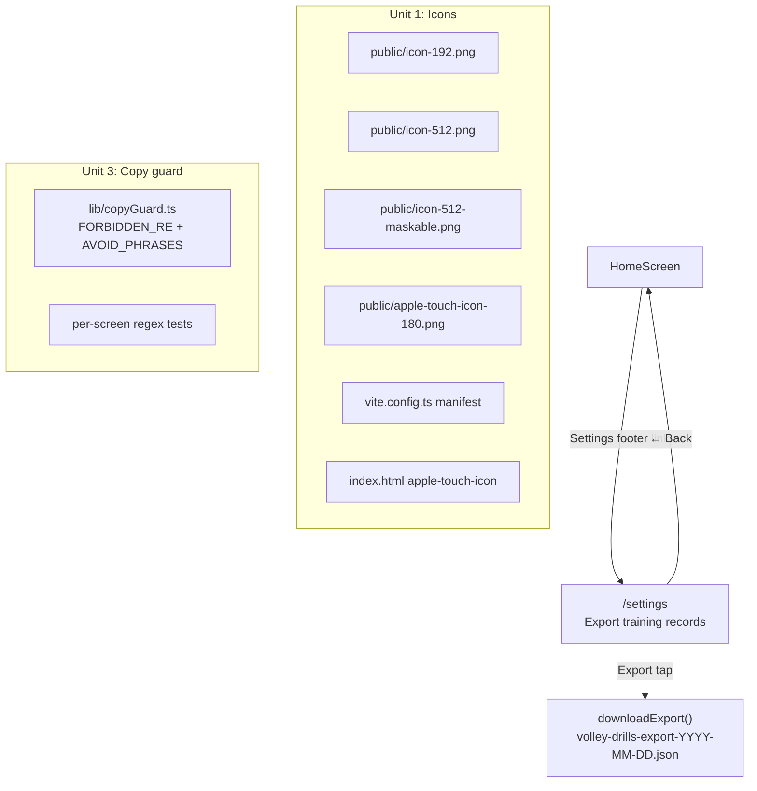

# Phase E: Content + founder tooling

## Overview

Final phase before the D91 field test. Three independent items, all required for tester launch:

1. **V0B-06 — Rasterized PNG icon set + manifest update.** Chromium installability warns against a single `any maskable` SVG; iOS falls back to low-res when the manifest doesn't provide high-resolution full-bleed PNGs. Ship three PNG icon entries + a real `apple-touch-icon-180.png` and drop the lone SVG.
2. **V0B-15 — Raw training-record JSON export.** Founder tooling. Dump `SessionReview` + `ExecutionLog` + `SessionPlan` as a single JSON blob downloadable from a settings surface. No UI summary layer — just the raw records so `D91` adherence-dimensions replay and `D104` binary-score replay can run against tester data.
3. **V0B-18 — Regulatory-posture copy audit (remaining surfaces).** Pain-branch pass landed 2026-04-16. Phase C introduced new surfaces (SkillLevelScreen, TodaysSetupScreen wind chip, CompleteScreen summary, StaleContextBanner, HomePrimaryCard variants, SoftBlockModal, ReviewScreen conflict copy). Extend the D86 forbidden-vocabulary regex guard across every rendered screen to catch future regressions, not just CompleteScreen.

Phase D is **empty** per `H6` / `C8` (V0B-02 carved into C-1). Phase E is the last gating work before the D91 field-test build.

## Problem Frame

**Why these three together:** They're independent (no cross-unit dependencies) and small (~1–2 days each). Bundling them into a single phase plan avoids plan-doc proliferation for trivial work. The master sequencing doc already declares Phase E as the post-Phase-C gate.

**Why each matters:**

- **V0B-06** is install-friction risk. Chromium's PWA install flow warns the user "icon not suitable" when maskable is missing or when the same asset serves both `any` and `maskable` purposes. iOS 26 added tinted / clear icon modes that require the full-bleed maskable PNG to render correctly on the home screen. Five testers, five devices, five home screens — the icon is part of the first impression.
- **V0B-15** is the entire founder-readout vehicle for D91. Without it the founder has to manually extract IndexedDB records tester-by-tester post-window — per [2026-04-12-v0a-to-v0b-transition.md](./2026-04-12-v0a-to-v0b-transition.md) §4. The export must be runnable from a tester's device (founder check-in) or exportable to founder-ground out-of-band.
- **V0B-18** is a regulatory-posture risk. D86 lands a public avoid-phrase list; the CompleteScreen copy-guard test already enforces it there. A Phase C surface silently introducing "injury risk" or "spike" copy would re-open regulatory exposure. Extending the guard to every screen is cheap and catches future regressions.

## Requirements Trace

### V0B-06 (Unit 1)

- R1. Manifest in `app/vite.config.ts` declares three PNG icon entries: `icon-192.png` (`sizes: '192x192'`, `purpose: 'any'`), `icon-512.png` (`sizes: '512x512'`, `purpose: 'any'`), `icon-512-maskable.png` (`sizes: '512x512'`, `purpose: 'maskable'`, padded for Android safe zone).
- R2. Single `icon.svg` entry removed from the manifest. SVG stays in `includeAssets` for `favicon.svg` compatibility; the manifest icon list is PNG-only.
- R3. `apple-touch-icon-180.png` (real 180×180 PNG) ships under `app/public/` and is wired into `app/index.html` via `<link rel="apple-touch-icon" href="/apple-touch-icon-180.png">` (currently points at `/icon.svg`).
- R4. `includeAssets` updated to include the new PNGs so the service worker precaches them.
- R5. Post-build smoke: manifest.json in `dist/` references the three PNG icons; files exist in `dist/`; a Lighthouse / DevTools install check reports no icon warnings.

### V0B-15 (Unit 2)

- R1. Pure function `buildExportPayload()` in `app/src/services/export.ts` returns `{ schemaVersion: 4, exportedAt: number, sessionPlans: SessionPlan[], executionLogs: ExecutionLog[], sessionReviews: SessionReview[], storageMeta: StorageMetaEntry[] }`. No `storageHealthEvents` (V0B-26 cut). No `sessionDrafts` (transient, not D91-replay material).
- R2. Helper `downloadExport()` serializes the payload to a JSON Blob and triggers a browser download (`volley-drills-export-{ISO-date}.json`). Uses `URL.createObjectURL` + anchor-click + `URL.revokeObjectURL` cleanup. No-op on non-browser environments (defensive for tests).
- R3. `SettingsScreen` at `/settings` with a single "Export training records" primary button. Header includes `← Back` to Home per the escape-hatch convention. Button is gated on `confirming` state so a double-tap doesn't download twice.
- R4. Home's empty-state footer gets a small `Settings` text-link entry point (tester-discoverable but not prominent). No `Settings` link on the active Home states (resume / review_pending / draft / last_complete primary) — those have their own thumb-zone priorities.
- R5. Route added to `app/src/routes.ts` + `app/src/main.tsx` route tree.
- R6. The payload shape MUST match the shapes the founder's replay scripts expect. Document the exact shape in the plan + a JSON schema comment in `export.ts` so a future schema change doesn't silently break replay.
- R7. Unit test: `buildExportPayload()` returns every row from every included table, in insertion order, with no mutation of the originals.
- R8. Integration test: clicking Export on SettingsScreen invokes `downloadExport` with the built payload (spy; we don't have to verify the actual download in JSDOM).

### V0B-18 (Unit 3)

- R1. The D86 forbidden-vocabulary regex (`/\b(compared|trend|progress|spike|overload|injury\s+risk|first\s+\d+\s+days|baseline|early\s+sessions)\b/i`) is extracted into a shared helper (`app/src/lib/copyGuard.ts` or similar) so tests import one canonical source rather than redefining the regex per spec.
- R2. A single screen-level integration test per Phase C surface scans its rendered body + aria attributes for forbidden vocabulary. Covers: `SkillLevelScreen`, `TodaysSetupScreen` (wind chip copy), `SetupScreen` (stale-context banner — already covered indirectly via StaleContextBanner render), `HomePrimaryCard` (all 5 variants), `HomeSecondaryRow` (all 3 variants), `SoftBlockModal`, `ReviewScreen` (finish-later countdown + conflict copy), `CompleteScreen` (already covered).
- R3. The helper also exports the literal avoid-phrase list as a `readonly string[]` for maintainability; changing the list in one place updates every test.
- R4. Verify no current Phase C surface contains any forbidden term. Expected: all pass on first run (the red-team pass already reviewed copy manually). If anything fails, fix the copy, not the regex.

## Scope Boundaries

- **In scope:** V0B-06 (icons), V0B-15 (export + settings screen), V0B-18 (broadened copy guard).
- **In scope:** `SettingsScreen` as the minimal container for the Export button. Route `/settings`. Home secondary link.
- **Not in scope:** Any settings beyond Export. No "reset data", no "clear cache", no "switch skill level" — those belong to M001-build.
- **Not in scope:** Server-side export / cloud sync. D91 is local-only.
- **Not in scope:** CSV / Parquet export shapes. JSON only; replay scripts convert if needed.
- **Not in scope:** `V0B-10` drill-catalog editorial polish. Deferred per `H8` / `C11`.
- **Not in scope:** `V0B-19` remaining warm-up / downshift content polish. Deferred per `H8` / `C10`.
- **Not in scope:** Landscape orientation (`V0B-05` cut per `H8` / `C9`).
- **Not in scope:** Safari → HSWA first-run banner (`V0B-27` cut per `H12` / `C16`).

## Context and Research

### Relevant code

- `app/vite.config.ts` — PWA manifest + `includeAssets`. V0B-06 edits here.
- `app/index.html` — `apple-touch-icon` link. V0B-06 updates to PNG.
- `app/public/` — current `icon.svg` + `favicon.svg` live here. V0B-06 adds the four PNGs.
- `app/src/db/schema.ts` + `app/src/db/types.ts` — Dexie table shapes for the export payload.
- `app/src/services/session.ts` — prior art for typed Dexie queries; `export.ts` follows the same conventions.
- `app/src/screens/HomeScreen.tsx` — home layout. V0B-15 adds a subtle Settings footer link.
- `app/src/routes.ts` + `app/src/main.tsx` — route registry. V0B-15 adds `/settings`.
- `app/src/screens/__tests__/CompleteScreen.copy-guard.test.tsx` — V0B-18 prior art for the scan + regex.

### Patterns to follow

- **Manifest icon shape:** from `docs/plans/2026-04-12-v0a-to-v0b-transition.md` §V0B-06:
  - `icon-192.png` → `purpose: 'any'`
  - `icon-512.png` → `purpose: 'any'`
  - `icon-512-maskable.png` → `purpose: 'maskable'` (full-bleed; Android safe-zone padding = ~80px inset on 512)
  - `apple-touch-icon-180.png` → NOT in manifest; wired directly in `index.html`
- **Export download pattern:** browser-native Blob + `URL.createObjectURL` + anchor-click + revoke. No extra library. Mock in tests by spying on `URL.createObjectURL` / `URL.revokeObjectURL`.
- **Copy-guard helper:** mirror the existing `CompleteScreen.copy-guard.test.tsx` structure but hoist the regex + avoid-phrase list into `app/src/lib/copyGuard.ts` so every new screen that touches pain / symptoms / physiology can lean on a single source of truth.

## Key Technical Decisions

1. **Export format is JSON, not CSV.** Preserves nested shapes (`blockStatuses[]`, `drillScores[]`, `storageMeta`) without flattening. Replay scripts already expect JSON per `V0B-15` scope. CSV would force schema-per-table files with fragile join keys.
2. **Export bundles every Dexie row unfiltered.** No "pick a date range" UI. The 5-tester cohort generates small payloads (~dozens of sessions); a strict dump keeps the export surface trivial and the replay deterministic.
3. **Export file name includes ISO date.** `volley-drills-export-2026-04-17.json` sorts lexically + is human-recognizable. No tester ID — testers don't know their cohort IDs, and the founder maps by device out-of-band.
4. **SettingsScreen is minimal.** One button, one header, one back link. Any scope creep (reset data, clear drafts) lands post-D91.
5. **Home's Settings entry point is a footer text-link, not a hamburger.** Hamburger menus have poor thumb reach on mobile and hide actions. A footer link on the NewUser empty state matches existing v0a `Your data stays on this device` placement. On active Home states (draft / last_complete / review_pending / resume primary), the Settings link stays rendered but styled subtly so it doesn't compete with primary CTAs. Decision-able: could hide entirely on non-empty states. Shipping it everywhere subtly is the lower-risk default — testers always know where the Export button is.
6. **Maskable icon padding:** 512×512 canvas, artwork fits inside a 448×448 safe zone (32px inset each side) per Chromium's maskable-icon guidance. Android applies the safe-zone mask; oversize padding wastes pixels, undersize crops the logo.
7. **V0B-18 guard runs per-screen, not globally.** A single giant "render all screens, scan all text" test would fail opaquely. Per-screen tests scope failures and keep test output readable.
8. **Copy-guard helper is just regex + list; no runtime consumption.** The helper is test-only. Runtime code has no reason to import it — the copy itself is the source of truth, not a runtime filter.

## Open Questions

All resolved during planning:

- **Should the export include `sessionDrafts`?** No. Drafts are transient pre-session state; post-session they're deleted. Not useful for D91 replay.
- **Should the export include `timerState`?** No. Single-row runtime state; not historically interesting.
- **Should the export include `storageMeta`?** Yes, partial. Include `onboarding.*` and `ux.softBlockDismissed.*` keys so the founder can see onboarding-completion timing. Exclude nothing for simplicity — storageMeta is tiny.
- **Who triggers the export during D91?** The founder, during weekly check-ins. Tester taps Settings → Export → AirDrop / email the JSON to founder-ground. No in-app upload.
- **Do we need an import flow?** No. Replay scripts consume the JSON directly; the tester device never needs to import anything.

## High-Level Technical Design



## Implementation Units

- [x] **Unit 1: V0B-06 — Rasterized PNG icon set + manifest**

  **Goal:** Ship four PNG icons, update the manifest to reference three of them, and wire the fourth via `apple-touch-icon`. Drop the SVG icon from the manifest.

  **Requirements:** R1, R2, R3, R4, R5

  **Dependencies:** None.

  **Files (as landed):**
  - Create: `app/scripts/generate-icons.mjs` — committed Node script that rasterizes via `sharp`.
  - Create: `app/public/icon-192.png` (192×192).
  - Create: `app/public/icon-512.png` (512×512).
  - Create: `app/public/icon-512-maskable.png` (512×512, `rx="0"` rewritten source so Android mask sees a flush square).
  - Create: `app/public/apple-touch-icon-180.png` (180×180).
  - Create: `app/public/icon-maskable.svg` — intermediate artifact written by the script so future regenerations don't silently diverge.
  - Modify: `app/package.json` — adds `"icons:generate": "node scripts/generate-icons.mjs"` + `sharp` devDep.
  - Modify: `app/vite.config.ts` — manifest `icons` array rewritten to three PNG entries (`any`, `any`, `maskable` at 192 / 512 / 512-maskable); `includeAssets` gains `apple-touch-icon-180.png`.
  - Modify: `app/index.html` — `<link rel="apple-touch-icon" sizes="180x180" href="/apple-touch-icon-180.png" />`.

  **Approach (as landed 2026-04-17):**

  Source art: the existing `app/public/icon.svg`. Rasterize via `sharp` (dev dependency) using a committed Node script at `app/scripts/generate-icons.mjs`, runnable via `npm run icons:generate`. Script + PNG outputs are both committed so any build machine has the assets available without a regeneration step; re-run whenever `icon.svg` changes.

  The maskable variant derives from the same SVG with `rx="108"` rewritten to `rx="0"` so Android's mask has a flush square canvas. The string replacement is strict — if `icon.svg` no longer contains exactly that attribute, the script throws rather than silently emitting a misaligned icon. The intermediate maskable SVG is also written to `public/icon-maskable.svg` so future regenerations don't silently diverge from what shipped.

  Tooling choice rationale: `sharp` (libvips-backed Node library, ~10M weekly downloads) rasterizes SVG natively with deterministic output, uses prebuilt platform binaries so install is ~3 seconds on Windows / macOS / Linux, and has zero runtime footprint (build-time only). `@resvg/resvg-js` was the backup pick if `sharp`'s prebuild ever failed to install; that fallback was not needed.

  Drop the `/icon.svg` entry from `manifest.icons`. Chrome's install flow prefers PNG at the declared sizes; SVG remains available via `includeAssets` for the favicon.

  Manifest shape (target):

  ```typescript
  icons: [
    { src: '/icon-192.png', sizes: '192x192', type: 'image/png', purpose: 'any' },
    { src: '/icon-512.png', sizes: '512x512', type: 'image/png', purpose: 'any' },
    { src: '/icon-512-maskable.png', sizes: '512x512', type: 'image/png', purpose: 'maskable' },
  ]
  ```

  `index.html`:
  ```html
  <link rel="apple-touch-icon" href="/apple-touch-icon-180.png" />
  ```

  `includeAssets` adds the new PNGs so the SW precaches them:
  ```typescript
  includeAssets: [
    'favicon.svg',
    'icon.svg',
    'offline.html',
    'apple-touch-icon-180.png',
  ]
  ```

  (Icons referenced by the manifest are precached by `vite-plugin-pwa` automatically; only the apple-touch-icon needs to join `includeAssets`.)

  **Test scenarios:**
  - `npm run build` produces `dist/manifest.webmanifest` with the three PNG entries.
  - `dist/` contains `icon-192.png`, `icon-512.png`, `icon-512-maskable.png`, `apple-touch-icon-180.png`.
  - Playwright smoke (extend `warm-offline.spec.ts` or new): install prompt can fire with no "icon not suitable" warning. Alternative: post-build dev check with Chrome DevTools → Application → Manifest pane showing all three icons with the right purposes.
  - Manual spot-check on iOS 26 (tinted + clear modes).

  **Verification:** Build succeeds; manifest validates; Chrome DevTools shows no icon warnings.

- [x] **Unit 2: V0B-15 — Raw JSON export + SettingsScreen**

  **Goal:** Founder-accessible export of the raw training records via a minimal Settings screen.

  **Requirements:** R1 through R8 under V0B-15.

  **Dependencies:** None from Phase E. Transitively depends on C-0 schema (storageMeta table + Dexie v4), which has landed.

  **Files:**
  - Create: `app/src/services/export.ts` — `buildExportPayload()` + `downloadExport()`.
  - Create: `app/src/services/__tests__/export.test.ts` — unit tests for both helpers.
  - Create: `app/src/screens/SettingsScreen.tsx`.
  - Create: `app/src/screens/__tests__/SettingsScreen.test.tsx`.
  - Modify: `app/src/routes.ts` — add `settings` route.
  - Modify: `app/src/main.tsx` — register the route.
  - Modify: `app/src/screens/HomeScreen.tsx` — add the subtle Settings footer text link.

  **Approach:**

  `export.ts`:

  ```typescript
  export interface ExportPayload {
    schemaVersion: 4
    exportedAt: number
    sessionPlans: SessionPlan[]
    executionLogs: ExecutionLog[]
    sessionReviews: SessionReview[]
    storageMeta: StorageMetaEntry[]
  }

  export async function buildExportPayload(): Promise<ExportPayload> {
    const [sessionPlans, executionLogs, sessionReviews, storageMeta] =
      await Promise.all([
        db.sessionPlans.toArray(),
        db.executionLogs.toArray(),
        db.sessionReviews.toArray(),
        db.storageMeta.toArray(),
      ])
    return {
      schemaVersion: 4,
      exportedAt: Date.now(),
      sessionPlans,
      executionLogs,
      sessionReviews,
      storageMeta,
    }
  }

  export async function downloadExport(): Promise<void> {
    const payload = await buildExportPayload()
    const json = JSON.stringify(payload, null, 2)
    const blob = new Blob([json], { type: 'application/json' })
    const url = URL.createObjectURL(blob)
    const a = document.createElement('a')
    a.href = url
    a.download = `volley-drills-export-${new Date().toISOString().slice(0, 10)}.json`
    document.body.appendChild(a)
    a.click()
    a.remove()
    // Revoke asynchronously so the download has a chance to start.
    setTimeout(() => URL.revokeObjectURL(url), 0)
  }
  ```

  `SettingsScreen.tsx`:
  - Three-column header (Back | centered "Settings" | spacer) matching SafetyCheckScreen / SetupScreen.
  - One primary button: "Export training records".
  - On tap: call `downloadExport()`, show a brief success/toast status message inline.
  - Footer line: `Data stays on your device`.

  `HomeScreen.tsx` Settings link: existing footer `Your data stays on this device` line becomes:
  ```tsx
  <div className="mt-auto flex flex-col items-center gap-2 text-center text-xs text-text-secondary">
    <Link to={routes.settings()} className="underline min-h-[44px] inline-flex items-center">
      Settings
    </Link>
    <p>Your data stays on this device</p>
  </div>
  ```

  (Or equivalent — keep thumb-zone friendliness.)

  **Test scenarios:**
  - `buildExportPayload()`: seed three tables with 2 records each + 1 storageMeta entry; assert payload shape and that every seeded record appears in its array.
  - `buildExportPayload()`: empty DB → returns `schemaVersion: 4, exportedAt: {number}, sessionPlans: [], executionLogs: [], sessionReviews: [], storageMeta: []`.
  - `downloadExport()`: spy on `URL.createObjectURL` + anchor creation; assert Blob contents parse back to the same payload.
  - `SettingsScreen` renders Back button routing to Home.
  - `SettingsScreen` Export button calls `downloadExport` exactly once per tap (double-tap guard).
  - HomeScreen Settings link routes to `/settings`.
  - Regression: precedence tests still pass after the footer-link reshuffle.

  **Verification:** All new unit + integration tests pass; existing HomeScreen suite unchanged.

- [x] **Unit 3: V0B-18 — Shared copy-guard helper + per-screen regression tests**

  **Goal:** Extract the D86 forbidden-vocabulary regex into a shared helper and extend per-screen regression tests across every Phase C surface.

  **Requirements:** R1 through R4 under V0B-18.

  **Dependencies:** None.

  **Files:**
  - Create: `app/src/lib/copyGuard.ts` — `FORBIDDEN_RE` + `AVOID_PHRASES` readonly exports.
  - Create: `app/src/lib/copyGuard.test.ts` — unit tests for the regex itself (positive + negative cases).
  - Modify: `app/src/screens/__tests__/CompleteScreen.copy-guard.test.tsx` — import the shared regex.
  - Modify: `app/src/domain/sessionSummary.test.ts` — import the shared regex.
  - Create (or extend existing): `app/src/screens/__tests__/SkillLevelScreen.test.tsx`, `TodaysSetupScreen.test.tsx`, `HomeScreen.copy-guard.test.tsx`, `SafetyCheckScreen.test.tsx` (reuse), `ReviewScreen.copy-guard.test.tsx` (new). Each adds exactly ONE `it('contains no D86 forbidden vocabulary')` case.

  **Approach:**

  `copyGuard.ts`:

  ```typescript
  /**
   * D86 avoid-phrase list from
   * `docs/research/regulatory-boundary-pain-gated-training-apps.md`.
   * Used by Phase C screen-level regression tests (V0B-18).
   *
   * Adding a phrase here MUST come with a sweep across every consuming
   * test file to confirm no current surface violates the rule.
   */
  export const AVOID_PHRASES = [
    'compared',
    'trend',
    'progress',
    'spike',
    'overload',
    'injury risk',
    'baseline',
    'early sessions',
    // `first N days` collapsed into a regex group below since N is numeric.
  ] as const

  export const FORBIDDEN_RE =
    /\b(compared|trend|progress|spike|overload|injury\s+risk|first\s+\d+\s+days|baseline|early\s+sessions)\b/i

  export function scanForForbidden(text: string): string[] {
    const matches: string[] = []
    const global = new RegExp(FORBIDDEN_RE.source, 'gi')
    for (const m of text.matchAll(global)) matches.push(m[0])
    return matches
  }
  ```

  Per-screen test shape:

  ```typescript
  it('contains no D86 forbidden vocabulary', async () => {
    render(<ScreenUnderTest />)
    await screen.findByRole(/* wait for first meaningful render */)
    const body = document.body.textContent ?? ''
    expect(scanForForbidden(body), `forbidden word in: ${body}`).toEqual([])
  })
  ```

  For screens with ARIA-attribute copy (error states, tooltip labels), also scan `[aria-label]` / `[title]` / `alt` attributes via `document.querySelectorAll('*')` traversal — CompleteScreen's copy-guard test already has a helper (`scanBodyAndAttributes`); lift that into a shared test utility too if duplicated across 3+ files.

  **Test scenarios:**
  - `FORBIDDEN_RE` matches each avoid-phrase (positive case).
  - `FORBIDDEN_RE` does not match `"progression"` (prefix), `"spike ball"` (word-boundary test — actually, `spike` IS forbidden, so this is a regression: confirm the rule is right).
  - Every Phase C surface renders without a forbidden match.

  **Verification:** All new + existing copy-guard tests pass. If any current surface violates, fix the copy first, then re-run.

## Risks and Dependencies

| Risk | Mitigation |
|------|------------|
| Manually rasterized icons ship wrong dimensions | Post-build smoke asserts exact byte-for-byte presence; a CI check could validate dimensions via `image-size` but out-of-scope for v0b's 5-tester window |
| JSON export blob exceeds browser Blob size limit | 5 testers × 14 days × a few sessions/day → low kilobytes per tester. No cap needed. |
| Tester's device blocks the download prompt | Download uses a plain anchor click; Safari / Chrome / iOS home-screen PWA all honor this pattern. Founder can screenshot the JSON if download blocks. |
| Export accidentally includes `sessionDrafts` or PII | The `buildExportPayload` function has an explicit allow-list; no `sessionDrafts` table is read. `storageMeta` values are founder-owned keys only (onboarding step, soft-block dismissals); no free-text that could leak PII. |
| V0B-18 regex matches a legit word (e.g. "progression") | Word-boundary `\b` handles the prefix cases; `FORBIDDEN_RE.test('progression')` returns false. Unit test asserts this. |
| Maskable PNG gets cropped on Android home screen | Safe-zone padding (32px inset on 512×512) per Chromium guidance. Spot-check on Android during D91 dogfeed. |

## Sources and References

- **Origin:** [docs/plans/2026-04-16-003-rest-of-v0b-plan.md](./2026-04-16-003-rest-of-v0b-plan.md) §5 Phase E
- **V0B registry:** [docs/plans/2026-04-12-v0a-to-v0b-transition.md](./2026-04-12-v0a-to-v0b-transition.md) §V0B-06, §V0B-15, §V0B-18
- **Master sequencing:** [docs/plans/2026-04-17-phase-c-master-sequencing-plan.md](./2026-04-17-phase-c-master-sequencing-plan.md) §1 (Phase E out of scope there; this plan picks it up)
- **V0B-06 evidence:** [docs/research/local-first-pwa-constraints.md](../research/local-first-pwa-constraints.md)
- **V0B-18 evidence:** [docs/research/regulatory-boundary-pain-gated-training-apps.md](../research/regulatory-boundary-pain-gated-training-apps.md) (D86 avoid-phrase list)
- **V0B-15 code precedent:** none (new surface); shape borrows from `services/session.ts` typed-Dexie patterns
- **V0B-18 test precedent:** [app/src/screens/__tests__/CompleteScreen.copy-guard.test.tsx](../../app/src/screens/__tests__/CompleteScreen.copy-guard.test.tsx)
- **Decisions:** D28 (export posture), D86 (regulatory vocabulary), D91 (field test replay windows)
