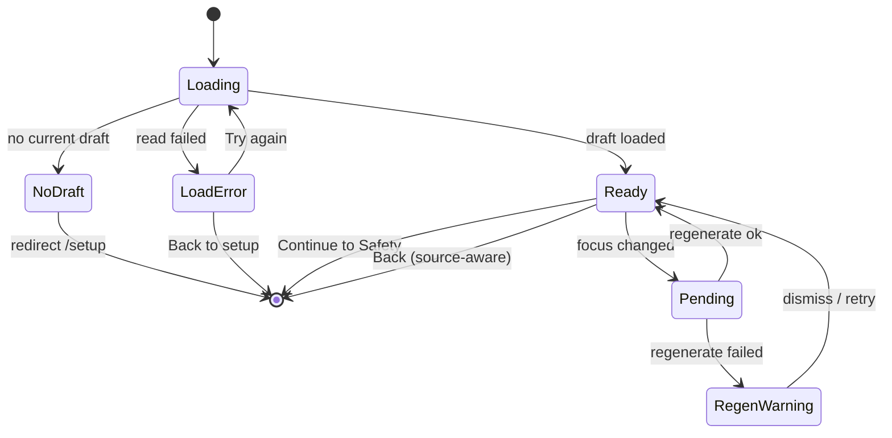

# Tune today route + session focus picker

## Overview

Ship the v1 surface for the Tier 1c focus picker: a minimal pre-safety **Tune today** route that every pre-run draft entry path passes through. The screen renders one focal recommendation card, a four-state focus radiogroup (Recommended, Passing, Serving, Setting), and a single Continue to Safety action. Choosing a focus regenerates the saved draft via a shared domain path so initial selection and later mid-run swaps cannot drift on focus semantics.

This plan implements `docs/brainstorms/2026-04-29-session-focus-picker-requirements.md` and supersedes the older "Swap-Focus cycle button" Stream 1 sketch. Stream 2 (skill-level mutability) and Stream 3 (catalog reserve audit) are out of scope; the catalog audit ships independently per `docs/plans/2026-04-28-tier-1c-prepay-and-catalog-audit.md`.

---

## Problem Frame

`D135` fired the Tier 1c trigger: real partner and founder use surfaced the need to say "today I want serving" before the session starts. The active sketch said the control belongs on a "draft screen," but the current app has no draft-review route — `SetupScreen` builds and saves a draft, then routes straight to `/safety`. Dropping the picker on Setup re-formifies it, dropping it on Safety pollutes the readiness contract, and dropping it on Home only misses the fresh-build path.

The brainstorm resolved this by selecting a dedicated pre-safety **Tune today** review step. This plan turns that requirement into a concrete implementation: route, controller, regeneration use case, shared focus resolver, and updates to every pre-run draft entry path.

The plan deliberately keeps the surface calm and shibui (one focal card, four chips, one primary action) and treats off-focus mid-run swaps as a trust-breaking failure mode that v1 must prevent, not defer.

---

## Requirements Trace

- R1. Add a Tune today route that every fresh-build, Home draft, and repeat path passes through before Safety.
- R2. Land `SetupContext.sessionFocus?: 'pass' | 'serve' | 'set'` with `undefined` preserving today's recommended behavior.
- R3. Land one shared pure focus resolver consumed by `pickForSlot`, build-time `pickMainSkillSubstitute`, and `findSwapAlternatives`.
- R4. Implement a draft regeneration use case that reads the current saved draft, builds a new draft from `SetupContext` plus the selected focus, and atomically saves the replacement with a stale-write guard.
- R5. Render Tune today using existing UI primitives (`ScreenShell`, `Card focal`, `ToggleChip` radiogroup, `Button` primary), no new visual language.
- R6. Update `SetupScreen`, `HomeScreen` (primary, secondary, repeat paths), and onboarding `Today's setup` so each pre-run draft entry routes through Tune today and passes a `source` hint for source-aware Back.
- R7. Add a read-only focus echo on `SafetyCheckScreen`'s session summary line; no controls.
- R8. Strip explicit `sessionFocus` from drafts rebuilt off completed `SessionPlan.context` (Repeat / Repeat what you did) so today-only intent does not silently leak into future days.
- R9. Clear or override `sessionFocus` when Safety switches to a recovery draft so the resulting plan does not claim a focus its blocks no longer obey.
- R10. Cover the surface with controller-tier and domain-tier tests sized to the testing pyramid; add focused screen tests only for the new render contract.

**Origin actors:** A1 (founder/returning player), A2 (pair partner), A3 (future implementation agent).
**Origin flows:** F1 (fresh setup), F2 (existing draft), F3 (focus change), F4 (safety recovery).
**Origin acceptance examples:** AE1, AE2, AE3, AE4, AE5, AE6, AE7, AE8, AE9, AE10, AE11, AE12, AE13, AE14, AE15.

---

## Scope Boundaries

- No SetupScreen focus controls.
- No editable focus controls on Safety.
- No persistent last-used focus, profile mutation, Dexie migration, or telemetry. Persistence is limited to `SessionDraft.context` and the resulting `SessionPlan.context`.
- No skill-level override implementation: no controls, context fields, copy, tests, or implementation affordances. The Tune today layout must not preclude a later sibling row.
- No hard skill-level filtering.
- No new drill records and no Tier 1b authoring-cap consumption.
- No rich block-by-block preview, recommendation rationale paragraph, stats grid, or icon row in v1.
- No dark mode work, no audio cue changes, no PWA manifest changes.

### Deferred to Follow-Up Work

- Per-device or per-day persistence of last-used focus: separate plan, separate trigger.
- A Stream 2 skill-level row inside Tune today: own plan, own trigger.
- Pre-detecting unavailable focus options as disabled chips: deliberately not v1 (the v1 contract keeps all four enabled and uses inline failure copy on infeasible builds).

---

## Context & Research

### Relevant Code and Patterns

- `app/src/types/session.ts` — `SetupContext` interface lands the optional `sessionFocus` field. Mirror the existing optional `wind?: WindLevel` shape and ordering.
- `app/src/model/draft.ts` — `SessionDraft` shape is unchanged; focus rides through `context`.
- `app/src/domain/sessionBuilder.ts` — `buildDraft(context, options)` is the existing recommended-build entry point. The regeneration use case reuses it.
- `app/src/domain/sessionAssembly/candidates.ts` — `findCandidates`, `pickForSlot` consume `slot.skillTags`. The shared resolver supplies effective tags.
- `app/src/domain/sessionAssembly/swapAlternatives.ts` — `findSwapAlternatives` uses static `SKILL_TAGS_BY_TYPE`. The resolver replaces this lookup for `main_skill` / `pressure`.
- `app/src/domain/sessionAssembly/substitution.ts` — `pickMainSkillSubstitute` calls `findCandidates` with the slot directly. Resolver applies before that call.
- `app/src/domain/sessionFocus.ts` — `inferSessionFocus(blocks)` is read-side label inference. The new `sessionFocus` is the write-side input. Tests must not conflate them.
- `app/src/services/session/queries.ts` — `findLastCompletedDrillIdsByType` is the substitution input the regeneration use case re-queries.
- `app/src/services/session/commands.ts` — `saveDraft` is the existing single-point save. Regeneration uses it.
- `app/src/screens/SetupScreen.tsx` — current Build session navigates to `routes.safety()`. Updates to call `navigate(routes.tuneToday(), { state: { source: 'setup' } })`. The route helper is `() => path`; the source rides in `useLocation().state`.
- `app/src/screens/HomeScreen.tsx` — the primary `handleDraftStart`, `Repeat this session`, and `Repeat what you did` handlers all currently route to `/safety`. Each must route to Tune today with the correct source hint.
- `app/src/components/home/DraftCard.tsx` — keeps Start session and Change setup labels. No copy or layout change.
- `app/src/screens/SafetyCheckScreen.tsx` — extend the existing `sessionSummary` line to echo focus when set; no other change.
- `app/src/screens/drillCheck/useDrillCheckController.ts` — reference shape for the new Tune today controller (use `useState`, `useMemo`, `useNavigate`, schema-blocked handling, ref-guarded async writes).
- `app/src/components/ui/ScreenShell.tsx` — Header / Body / Footer composition for the new screen.
- `app/src/components/ui/Card.tsx` — `Card variant="focal"` is the focal recommendation card.
- `app/src/components/ui/ToggleChip.tsx` — `lg` size with `tone="accent"` matches the wireframe; render four chips inside a `role="radiogroup"` with `aria-label="Focus"` per existing Setup/Safety patterns.
- `app/src/components/ui/Button.tsx` — `variant="primary" fullWidth` for Continue to Safety.
- `app/src/contracts/screenContracts.ts` — Tune today must be registered.
- `app/src/routes.ts` — typed route helpers; add `tuneToday`.
- `app/src/App.tsx` — route tree.

### Institutional Learnings

- 2026-04-20 red-team rejected SetupScreen focus toggles. Tune today re-enters draft tuning after recommendation, not before.
- 2026-04-22 partner-walkthrough polish kept courtside surfaces calm and tap-first; Tune today inherits that posture.
- 2026-04-26 architecture pass codified screens-thin / domain-fat layering and the P12 screen contract registry. Tune today honors both.
- 2026-04-28 audio-pacing investigation showed how easily a single bug can ride multiple draft surfaces; the shared focus resolver is the analogous prevention here.

### External References

External research already consumed in upstream brainstorm work covered MOJO/Fitbod/Duolingo focus patterns, NN/g recommender UX, WCAG 2.2 target sizing, and ACSM/EIM readiness scope. No new external research warranted for this plan.

### Slack context

Not requested for this plan.

---

## Key Technical Decisions

- **K1. New `/tune` route between Setup and Safety.** The brainstorm and architecture pass both selected a dedicated route over Home-only or Safety-based alternatives. The route registers through `routes.ts`, `App.tsx`, and `screenContracts.ts`. *Rationale:* preserves single-purpose contracts on Setup, Home, Safety; gives Stream 2 a clean future home; keeps Home priority logic untouched.
- **K2. `SetupContext.sessionFocus?: 'pass' | 'serve' | 'set'`, default `undefined`.** Mirrors the existing `wind?:` shape. `undefined` means Recommended and is not serialized. *Rationale:* zero migration, preserves today's behavior when omitted, threads through the existing draft-to-plan persistence pipe.
- **K3. One shared pure focus resolver.** New `domain/sessionAssembly/effectiveFocus.ts` exports `effectiveSkillTags(slotType, context, fallback)`. Consumed by `pickForSlot`, `pickMainSkillSubstitute`, and `findSwapAlternatives`. *Rationale:* prevents drift between initial picks and swaps; tested once, used everywhere.
- **K4. Regeneration use case lives in `services/session/`, not `domain/`.** New `app/src/services/session/regenerateDraftFocus.ts` reads the current draft, runs the staleness check, calls `buildDraft`, and writes the replacement — all inside a single `db.transaction('rw', db.sessionDrafts, ...)` so read+check+put cannot be interleaved by a concurrent writer. *Rationale:* `domain/` cannot import services or Dexie per `.cursor/rules/data-access.mdc`. The transaction is the only way to make the stale-write guard actually atomic against `createSessionFromDraft` and other tabs.
- **K5. Mint a fresh assembly seed per focus change, but cache the visit baseline.** First Tune today render captures the current draft as `baselineDraft`. Selecting Recommended restores the cached baseline through the same regeneration use case (with a `useBaseline` mode that skips the rebuild but keeps the in-transaction stale-write guard). Selecting any non-Recommended focus mints a new seed via the existing `createAssemblySeed()`. *Rationale:* satisfies R15 reversibility while keeping exactly one tested write path with one stale-write guard.
- **K6. Re-query substitution inputs inside the regeneration use case.** The use case calls `findLastCompletedDrillIdsByType()` itself. *Rationale:* matches `SetupScreen.handleConfirm` exactly, avoids snapshotting state into `SessionDraft`, and keeps Dexie out of the screen.
- **K7. Source-aware Back via `useLocation().state.source`.** Each entry path navigates with `{ state: { source } }` where `source` is `'setup' | 'home' | 'repeat' | 'home-secondary'` (parsed defensively; unknown values default to `'home'`). The controller routes Back to Setup edit-mode for `'setup'` and to Home for everything else. *Rationale:* the four values are kept distinct so a future rule can diverge per source without a breaking change; the v1 controller intentionally co-locates the small policy. Promote to `domain/runFlow/tuneTodayBack.ts` if a second consumer appears.
- **K8. `buildDraftFromCompletedBlocks` is the canonical strip site for repeat-rebuilt drafts.** It always returns a draft whose `context.sessionFocus` is `undefined`, regardless of input plan context. HomeScreen does not strip independently. *Rationale:* makes the today-only invariant true by construction at the rebuild boundary so any future caller inherits it; one tested location, one regression to write.
- **K9. `buildRecoveryDraft` is the canonical strip site for recovery.** It always returns a draft whose `context.sessionFocus` is `undefined`. SafetyCheckScreen renders a short "Recovery overrides today's focus" line when the source draft had focus set. *Rationale:* same invariant-by-construction posture as K8, applied at the recovery boundary.
- **K10. Failure semantics: keep all four chips enabled; explain failures inline.** No disabled chips in v1. *Rationale:* the v1 risk is rare and the explicit failure copy is honest; pre-detection is deferred follow-up work.
- **K11. Test pyramid: most coverage at domain/controller; one screen test for render contract.** *Rationale:* mirrors `.cursor/rules/testing.mdc`. Avoids brittle screen-test coverage of state transitions.
- **K12. Unmount semantics: fire-and-forget for Dexie, cancel-only-the-React-update for the controller.** The use case always commits its in-transaction write once entered; the controller uses a `cancelled` ref so unmounted components do not call `setState`. Tapping Back while regeneration is pending is a no-op (Back is gated like Continue). *Rationale:* keeps disk and memory consistent at all times — picking the only option that does not produce a torn state under fast unmount.
- **K13. `RegenerateResult` carries explicit reasons including load and schema-blocked.** Shape: `{ ok: true, draft, changed: boolean } | { ok: false, reason: 'load' | 'stale' | 'build' | 'save' | 'schema_blocked' }`. The controller treats `'schema_blocked'` as "leave the screen in `loading` and let `SchemaBlockedOverlay` paint the UI"; all other failure reasons revert the chip selection and surface inline warning copy. *Rationale:* every Dexie boundary in the existing code enumerates a schema-blocked branch; the use case must, too.

---

## Open Questions

### Resolved During Planning

- **Q1.** Seed policy for focus regeneration. **Resolved K5:** fresh seed per change, baseline restored via the same use case in `useBaseline` mode.
- **Q2.** Substitution input snapshot vs re-query. **Resolved K6:** re-query inside the use case.
- **Q3.** Disabled vs enabled chips for unavailable focus. **Resolved K10:** all four enabled; inline failure copy in v1.
- **Q4.** Where the regeneration use case lives. **Resolved K4:** `app/src/services/session/regenerateDraftFocus.ts`.
- **Q5.** Strip ownership for repeat flows. **Resolved K8:** `buildDraftFromCompletedBlocks`.
- **Q6.** Strip ownership for recovery. **Resolved K9:** `buildRecoveryDraft`.
- **Q7.** Unmount and concurrent-tap semantics. **Resolved K12:** Dexie writes always commit; controller cancels React updates only; Back is gated like Continue.
- **Q8.** Route slug. **Resolved:** `/tune-today` (matches the screen identity used elsewhere; existing kebab-case route convention).

### Deferred to Implementation

- **DQ1.** Whether `SafetyCheckScreen`'s focus echo lives in the existing `sessionSummary` string or in a small adjacent line. Default: append to `sessionSummary` with `·` separator and suppress the focus suffix when `painFlag === true`. Decide during U8.
- **DQ2.** Exact controller H1 question text. Default candidates: `What's today's focus?` (solo), `Today's shared focus?` (pair). Pick during U7; the requirement is reader-question form per `.cursor/rules/courtside-copy.mdc` rule 1, not the specific words.

---

## Output Structure

```
app/src/
  contracts/
    screenContracts.ts                          # MODIFY — add tuneToday entry
  domain/
    sessionAssembly/
      candidates.ts                             # MODIFY — pickForSlot consumes resolver
      substitution.ts                           # MODIFY — pickMainSkillSubstitute consumes resolver
      swapAlternatives.ts                       # MODIFY — findSwapAlternatives consumes resolver
      effectiveFocus.ts                         # NEW — shared focus resolver
    sessionBuilder.ts                           # MODIFY — buildDraftFromCompletedBlocks strips focus; buildRecoveryDraft strips focus
    sessionFocus.ts                             # UNCHANGED (read-side label inference; do not conflate)
    __tests__/
      effectiveFocus.test.ts                    # NEW
      drillSelection.test.ts                    # MODIFY — focus-override scenarios
      findSwapAlternatives.test.ts              # MODIFY — focus-override scenarios
      buildDraftFromCompletedBlocks.test.ts     # MODIFY — focus-strip pin
      buildRecoveryDraft.test.ts                # NEW or MODIFY — focus-strip pin (location confirmed during U8)
  services/
    session/
      regenerateDraftFocus.ts                   # NEW — use case (rw transaction)
      __tests__/
        regenerateDraftFocus.test.ts            # NEW
  routes.ts                                     # MODIFY — add tuneToday helper + path '/tune-today'
  App.tsx                                       # MODIFY — register the route between /setup and /safety
  screens/
    TuneTodayScreen.tsx                         # NEW
    SetupScreen.tsx                             # MODIFY — navigate to /tune-today with source state
    SafetyCheckScreen.tsx                       # MODIFY — read-only focus echo + recovery copy line
    HomeScreen.tsx                              # MODIFY — Start session, secondary draft, repeat paths
    tuneToday/
      useTuneTodayController.ts                 # NEW
      __tests__/
        useTuneTodayController.test.tsx         # NEW
    __tests__/
      TuneTodayScreen.test.tsx                  # NEW (render contract only)
  types/
    session.ts                                  # MODIFY — SetupContext.sessionFocus?
docs/
  catalog.json                                  # MODIFY (U0) — register this plan; bump older Stream 1 status
  plans/
    2026-04-28-tier-1c-prepay-and-catalog-audit.md  # MODIFY (U0) — Stream 1 status to "implemented per this plan"
  status/current-state.md                       # MODIFY (U9) — recent shipped history line
  assets/
    tune-today-wireframe.png                    # already in repo (referenced by High-Level Technical Design)
```

The per-unit `**Files:**` sections remain authoritative if implementation reveals a better arrangement.

---

## High-Level Technical Design

> *This illustrates the intended approach and is directional guidance for review, not implementation specification.*

### Wireframe (calm shibui v1)

The Tune today screen renders one focal recommendation card, a four-option focus radiogroup, one helper line, and one pinned primary Continue action. The screen H1 is a reader-question (e.g., `What's today's focus?`) per `.cursor/rules/courtside-copy.mdc` rule 1, not the literal surface label "Tune today" — that string is the route brand only.


### Sequence: focus change with rw-transaction stale-write guard

The use case wraps read + check + put in one `db.transaction('rw', db.sessionDrafts, ...)` so a concurrent writer (Safety's `createSessionFromDraft`, another tab, an expire sweep) cannot squeeze between the staleness check and the save. The synchronous `buildDraft` runs outside the transaction; substitution input is re-queried before the transaction opens.

```mermaid
sequenceDiagram
    participant User
    participant Screen as TuneTodayScreen
    participant Controller as useTuneTodayController
    participant UseCase as regenerateDraftFocus
    participant Builder as buildDraft
    participant Tx as db.transaction(rw)

    User->>Screen: tap Serving
    Screen->>Controller: setFocus('serve')
    Controller-->>Screen: pending=true; chips/Continue/Back disabled
    Controller->>UseCase: regenerate({ srcUpdatedAt, focus, context })
    UseCase->>UseCase: lastCompletedByType = await findLastCompletedDrillIdsByType()
    UseCase->>Builder: buildDraft({ ...context, sessionFocus: 'serve' }, { lastCompletedByType })
    Builder-->>UseCase: nextDraft | null
    alt nextDraft is null
        UseCase-->>Controller: ok=false reason='build'
    else
        UseCase->>Tx: open rw on sessionDrafts
        Tx->>Tx: current = get('current')
        alt current missing OR updatedAt !== srcUpdatedAt
            Tx-->>UseCase: stale
            UseCase-->>Controller: ok=false reason='stale'
        else
            Tx->>Tx: put(nextDraft)
            Tx-->>UseCase: committed
            UseCase-->>Controller: ok=true changed=true draft=nextDraft
        end
    end
    Controller-->>Screen: ok → visible draft = nextDraft; failure → revert focus, inline warning
```

### State: Tune today screen states



---

## Implementation Units

> Sequencing rationale: catalog registration -> types -> domain resolver -> assembly call sites -> services regeneration use case -> route registration -> screen+controller -> entry-path updates -> safety polish + repeat hygiene -> docs sync. Each unit is independently testable and dependency-ordered. U0 and U1 are non-feature-bearing; U2-U9 each ship behavior.

- [ ] U0. **Register the plan in `docs/catalog.json` and bump older Stream 1 status**

**Goal:** Make this plan discoverable via the canonical agent index before any code lands, and stop the older Stream 1 sketch from looking implementable.

**Requirements:** R10 (docs hygiene branch).

**Dependencies:** None.

**Files:**
- Modify: `docs/catalog.json` (register `tune-today-focus-picker-2026-04-29` under plans with a one-line `canonical_for` summary)
- Modify: `docs/plans/2026-04-28-tier-1c-prepay-and-catalog-audit.md` (update Stream 1 status note from "must be rewritten before implementation" to "implementation owned by `docs/archive/plans/2026-04-29-001-feat-tune-today-focus-picker-plan.md`")

**Approach:**
- Atomic, doc-only commit. No code changes.

**Patterns to follow:**
- Existing `docs/catalog.json` plan entries; e.g., `tier-1c-impl-skill-level-mutability-and-catalog-audit-2026-04-28`.

**Test scenarios:**
- *Test expectation: none — docs hygiene only.*

**Verification:**
- `bash scripts/validate-agent-docs.sh` passes.

---

- [ ] U1. **Add `SetupContext.sessionFocus?` field**

**Goal:** Land the optional context field with `undefined` preserving today's behavior; no caller changes yet.

**Requirements:** R2

**Dependencies:** None.

**Files:**
- Modify: `app/src/types/session.ts`
- Modify: any test fixture that constructs `SetupContext` literally and breaks under exhaustive checks

**Approach:**
- Add `sessionFocus?: 'pass' | 'serve' | 'set'` after `wind?` to mirror the optional-context grouping. No behavior change, no exports renamed.

**Patterns to follow:**
- Existing `wind?: WindLevel` shape and JSDoc style in `types/session.ts`.

**Test scenarios:**
- *Test expectation: none — pure type extension. Behavioral coverage lands in U2-U5.*

**Verification:**
- `npm --prefix app run build` and `npm --prefix app test` pass with no behavior change.

---

- [ ] U2. **Shared focus resolver `effectiveFocus.ts` + tests**

**Goal:** One pure helper that returns effective skill tags for a slot/block type given the session focus, with `main_skill` and `pressure` honoring the override and every other slot type falling back to the caller's default.

**Requirements:** R3, R10

**Dependencies:** U1.

**Files:**
- Create: `app/src/domain/sessionAssembly/effectiveFocus.ts`
- Create: `app/src/domain/__tests__/effectiveFocus.test.ts`

**Approach:**
- Export a pure function: `effectiveSkillTags(blockType: BlockSlotType, context: SetupContext, fallback: readonly SkillFocus[]): readonly SkillFocus[]`. When `context.sessionFocus !== undefined` and `blockType` is `main_skill` or `pressure`, return `[context.sessionFocus]`; otherwise return `fallback` unchanged.
- Keep the function side-effect free, no logging, no module-level state.

**Execution note:** Test-first. The resolver is the trust invariant for swap parity, so write the test cases before the implementation.

**Patterns to follow:**
- Pure-helper shape in `domain/sessionAssembly/random.ts` and `domain/sessionFocus.ts`.

**Test scenarios:**
- Happy path: `sessionFocus = undefined` returns the fallback verbatim for every block type.
- Happy path: `sessionFocus = 'serve'` on `main_skill` returns `['serve']`.
- Happy path: `sessionFocus = 'serve'` on `pressure` returns `['serve']`.
- Edge case: `sessionFocus = 'serve'` on `warmup`, `technique`, `movement_proxy`, `wrap` returns the fallback unchanged.
- Edge case: empty fallback array with `sessionFocus = undefined` returns the empty array.
- Edge case: fallback that already includes the focus (e.g., `['pass','serve','set']` with `sessionFocus = 'serve'` on `main_skill`) collapses to `['serve']`, not the wider list.

**Verification:**
- `npm --prefix app test -- effectiveFocus` passes; lint clean.

---

- [ ] U3. **Wire `pickForSlot` and `pickMainSkillSubstitute` through the resolver**

**Goal:** Initial draft assembly honors `context.sessionFocus` for `main_skill` and `pressure` without changing any other slot's behavior.

**Requirements:** R3, R10

**Dependencies:** U2.

**Files:**
- Modify: `app/src/domain/sessionAssembly/candidates.ts` (`pickForSlot` calls `findCandidates` with a slot whose `skillTags` come from the resolver)
- Modify: `app/src/domain/sessionAssembly/substitution.ts` (`pickMainSkillSubstitute` mirrors the same resolver call before invoking `findCandidates`)
- Modify: `app/src/domain/__tests__/drillSelection.test.ts` (add focus-override scenarios under a new `describe('sessionFocus override')` block; do not introduce a parallel test directory)

**Approach:**
- Build a lightweight wrapper: when `pickForSlot` enters, derive `skillTags = effectiveSkillTags(slot.type, context, slot.skillTags ?? [])` and construct a slot copy with those tags before calling `findCandidates`. Do not mutate the input slot.
- `pickMainSkillSubstitute` follows the same shape so the substitute pool obeys focus too.
- No other heuristics inside `pickForSlot` (warmup/technique/movement/wrap branches) change.

**Patterns to follow:**
- Existing `slot = { ...slot, skillTags: [...] }` immutability discipline.
- `findCandidates(slot, context)` call site preserved.

**Test scenarios:**
- Happy path: `sessionFocus: undefined` produces identical results to baseline for `pair_open` 25-min.
- Happy path: `sessionFocus: 'serve'` on `pair_open` 25-min returns a `main_skill` block whose drill's `skillFocus` includes `'serve'`. Assert via `skillFocus.includes('serve')`, not specific drill IDs, so future catalog evolution does not break this test.
- Happy path: `sessionFocus: 'set'` on a layout with a `pressure` slot returns a `pressure` drill whose `skillFocus` includes `'set'`.
- Edge case: `sessionFocus: 'serve'` does not change the warmup, technique, movement_proxy, or wrap drills selected for the same seed.
- Edge case: `sessionFocus: 'pass'` with the substitution path triggered (`lastCompletedByType.main_skill` set) still picks a substitute whose `skillFocus` includes `'pass'` and is not the previously-completed drill.
- Edge case (multi-tag drill): a drill with `skillFocus: ['pass', 'movement']` is included in the candidate pool when `sessionFocus: 'pass'` and excluded when `sessionFocus: 'serve'`. Confirms the resolver narrows correctly without breaking multi-tag drill participation.
- Integration: Covers AE4 indirectly — initial main_skill drill choice respects focus.

**Verification:**
- New focus-override tests pass; existing `drillSelection.test.ts` continues to pass.

---

- [ ] U4. **Wire `findSwapAlternatives` through the resolver**

**Goal:** Mid-run swap pools honor the same focus semantics as initial picks. A Serving session must not silently surface off-focus main-skill / pressure swaps.

**Requirements:** R3, R10

**Dependencies:** U2.

**Files:**
- Modify: `app/src/domain/sessionAssembly/swapAlternatives.ts` (replace the static `SKILL_TAGS_BY_TYPE[block.type]` read with `effectiveSkillTags(block.type, context, SKILL_TAGS_BY_TYPE[block.type])`)
- Modify: `app/src/domain/__tests__/findSwapAlternatives.test.ts` (add focus-override scenarios under a new `describe('sessionFocus override')` block)

**Approach:**
- `SKILL_TAGS_BY_TYPE` stays as the default-fallback map. The resolver reads it via the `fallback` arg when `sessionFocus === undefined`.
- The slot constructed inside `findSwapAlternatives` uses the resolver result for `skillTags`.
- The existing progression/substitution branch in `findSwapAlternatives` is unchanged in shape; the resolver only narrows the candidate pool that those branches see.

**Test scenarios:**
- Happy path: `sessionFocus: undefined` returns the same alternatives as today (regression).
- Happy path: `sessionFocus: 'serve'` on a `main_skill` block returns alternatives whose `skillFocus` each include `'serve'`. Assert via `skillFocus` containment.
- Happy path: `sessionFocus: 'serve'` on a `pressure` block returns alternatives whose `skillFocus` each include `'serve'`.
- Edge case: `sessionFocus: 'serve'` does not change `warmup` / `wrap` swap pools (they remain empty per the existing early-return) or the underlying defaults for any non-affected type.
- Edge case (focused fallback): when no focused alternative exists for `main_skill`, the function returns an empty array rather than off-focus ones (R14, R41). Covers AE4.
- Integration: progression target × focus override — when `findPreferredProgressionTarget(block.drillId)` returns a drill whose `skillFocus` does not include the active focus, that drill is excluded by the resolver and the next candidate is used. Confirms swap parity holds even when a progression rule would have surfaced an off-focus drill.

**Verification:**
- New tests pass; existing `findSwapAlternatives.test.ts` continues to pass.

---

- [ ] U5. **Draft regeneration use case `services/session/regenerateDraftFocus.ts` + tests**

**Goal:** A single tested entry point that regenerates (or restores baseline of) the saved draft for a new focus, with one in-transaction stale-write guard covering every Tune today write.

**Requirements:** R4, R10

**Dependencies:** U1, U3.

**Files:**
- Create: `app/src/services/session/regenerateDraftFocus.ts`
- Create: `app/src/services/session/__tests__/regenerateDraftFocus.test.ts`

**Approach:**

- Public signature:
  ```
  type RegenerateMode =
    | { kind: 'focus'; nextFocus: 'pass' | 'serve' | 'set' | undefined }
    | { kind: 'baseline'; baselineDraft: SessionDraft }

  type RegenerateResult =
    | { ok: true; draft: SessionDraft; changed: boolean }
    | { ok: false; reason: 'load' | 'stale' | 'build' | 'save' | 'schema_blocked' }

  regenerateDraftFocus(input: {
    sourceUpdatedAt: number
    context: SetupContext
    mode: RegenerateMode
  }): Promise<RegenerateResult>
  ```
- Outside the transaction: in `kind: 'focus'` mode, re-query `findLastCompletedDrillIdsByType()` (mirrors `SetupScreen.handleConfirm`); call `buildDraft({ ...context, sessionFocus: nextFocus ?? undefined }, { lastCompletedByType })`. If `null`, return `{ ok: false, reason: 'build' }`. In `kind: 'baseline'` mode, the next draft is the supplied `baselineDraft` (no rebuild).
- Inside `db.transaction('rw', db.sessionDrafts, async () => { ... })`:
  - `current = await db.sessionDrafts.get('current')`
  - If `current` is missing or `current.updatedAt !== sourceUpdatedAt`, return `{ ok: false, reason: 'stale' }`.
  - In `kind: 'focus'` mode, if the new focus equals the current saved focus, return `{ ok: true, draft: current, changed: false }` (noop, no write).
  - Otherwise `await db.sessionDrafts.put(nextDraft)` and return `{ ok: true, draft: nextDraft, changed: true }`.
- Top-level `try/catch`: if `isSchemaBlocked()` is true on any thrown error, return `{ ok: false, reason: 'schema_blocked' }`. A read-side failure outside the transaction returns `'load'`. A `put` failure inside the transaction surfaces as `'save'`.
- Pure module — no logging, no React imports.

**Execution note:** Characterization-first for the stale-write guard. The first test opens a parallel `db.transaction` that deletes `sessionDrafts.current` and asserts the use case returns `stale` and does not put.

**Patterns to follow:**
- `services/session/commands.ts` for `db.transaction('rw', ...)` shape (e.g., `createSessionFromDraft`).
- `SetupScreen.handleConfirm` for substitution-input handling, including the `try/catch` + `isSchemaBlocked()` fallback to `{}`.

**Test scenarios:**
- Happy path: `kind: 'focus'`, undefined → 'serve' returns `ok: true, changed: true` with a saved draft whose `context.sessionFocus === 'serve'`.
- Happy path: `kind: 'focus'`, 'serve' → undefined returns a saved draft whose `context.sessionFocus` is absent.
- Happy path: `kind: 'baseline'` returns `ok: true, changed: true` and the on-disk draft equals the supplied baseline.
- Edge case (noop): `kind: 'focus'`, nextFocus equals current saved focus → `ok: true, changed: false`; no `put` is observed.
- Edge case (build failure): `buildDraft` returns `null` → `ok: false, reason: 'build'`; saved draft unchanged; no transaction is opened.
- Edge case (stale guard, simulated mutation): a parallel `db.transaction('rw', sessionDrafts)` updates `updatedAt` between the test's setup and the use-case call → result `ok: false, reason: 'stale'`; final on-disk draft equals the parallel writer's value, not the use case's candidate.
- Edge case (stale guard, deletion): a parallel writer deletes `sessionDrafts.current` mid-flight → result `ok: false, reason: 'stale'`; on-disk draft remains deleted (no resurrection).
- Edge case (load failure): mocked `db.sessionDrafts.get` rejects with a non-schema error → `ok: false, reason: 'load'`.
- Edge case (schema-blocked): mocked I/O throws and `isSchemaBlocked()` returns true → `ok: false, reason: 'schema_blocked'`; no further reads or writes attempted.
- Edge case (save failure): mocked `db.sessionDrafts.put` rejects → `ok: false, reason: 'save'`; surface preserved for U7 to revert.
- Edge case (no Dexie write on failure): for each of `build`, `stale`, `load`, `schema_blocked`, no `put` is observed via a Dexie put-spy.
- Integration: `kind: 'focus'`, substitution path — when `lastCompletedByType.main_skill` resolves to a substitute drill, the new focus narrows the substitute pool through the U2 resolver without divergence from `pickForSlot`.

**Verification:**
- All scenarios pass under `npm --prefix app test -- regenerateDraftFocus`; lint clean; build clean.

---

- [ ] U6. **Register the Tune today route + screen contract (paired with U7 in one PR)**

**Goal:** Land route registration and the P12 contract so U7 has a real route. Ship U6 and U7 in the same PR — U6 alone would expose a placeholder route to users.

**Requirements:** R1, R5

**Dependencies:** None at the file level; ship together with U7.

**Files:**
- Modify: `app/src/routes.ts` (add `tuneToday: '/tune-today'` to `routePaths`; add `tuneToday: () => routePaths.tuneToday` to `routes`)
- Modify: `app/src/App.tsx` (register `<Route path={routePaths.tuneToday} element={<TuneTodayScreen />} />` between Setup and Safety)
- Modify: `app/src/contracts/screenContracts.ts` (add a fully populated `defineScreenContract` entry with `route: '/tune-today'`, `screen: 'TuneToday'`, `action: "Confirm or steer today's session focus."`, `signal: "Recommendation summary plus focus selection."`, `reason: "Steer today's session before Safety, with one tap to keep the recommendation."`)
- Create: `app/src/screens/TuneTodayScreen.tsx` (real screen body lands in U7)

**Approach:**
- Mirror the existing kebab-case route style (`/onboarding/skill-level`, `/run/check`).
- The component is created in this unit but its real body and tests are part of U7. The two units describe distinct conceptual changes (routing vs UI) but ship together.

**Patterns to follow:**
- Existing `setup`, `safety`, `transition` route registrations and `defineScreenContract` entries.

**Test scenarios:**
- Happy path: existing `app/src/contracts/__tests__/screenContracts.test.ts` exhaustiveness check passes with the new route key registered.
- Edge case: the new `defineScreenContract` entry has non-empty `action`, `signal`, and `reason` strings; pinned by the existing test.

**Verification:**
- `npm --prefix app run build` and `npm --prefix app test -- screenContracts` pass after U6 + U7 land together.

---

- [ ] U7. **Tune today controller + screen + tests**

**Goal:** Implement the calm v1 surface, including all states from the State diagram.

**Requirements:** R1, R5, R6, R10

**Dependencies:** U1, U5, U6.

**Files:**
- Create: `app/src/screens/tuneToday/useTuneTodayController.ts`
- Modify: `app/src/screens/TuneTodayScreen.tsx` (real screen body)
- Create: `app/src/screens/tuneToday/__tests__/useTuneTodayController.test.tsx`
- Create: `app/src/screens/__tests__/TuneTodayScreen.test.tsx` (render-contract only)

**Approach:**

**Controller responsibilities:**
- On mount, calls `getCurrentDraft()` once. States: `loading`, `noDraft` (controller exposes a `redirectTo: '/setup'` flag; screen calls `navigate(..., { replace: true })`), `loadError` (retry / Back to setup), `ready`. On any I/O failure where `isSchemaBlocked()` is true, the controller stays in `loading` and lets `SchemaBlockedOverlay` paint the UI; it does not show retry copy.
- Captures `baselineDraft` on first `ready` transition.
- Exposes:
  - `controlState`: `'Recommended' | 'Passing' | 'Serving' | 'Setting'` derived from `effectiveDraft.context.sessionFocus`.
  - `effectiveDraft`: the draft to render.
  - `pending`, `warning`, `helperText`, `redirectTo` flags.
- `setFocus(next)` is the only write entry point. Always calls `regenerateDraftFocus(...)`:
  - When `next === undefined` AND `baselineDraft` exists: pass `mode: { kind: 'baseline', baselineDraft }`.
  - Otherwise pass `mode: { kind: 'focus', nextFocus: <internal value> }` where `<internal value>` is `'pass' | 'serve' | 'set' | undefined`.
  - The controller never calls `saveDraft` directly. This routes every Tune today write through U5's in-transaction stale-write guard.
- While a regenerate is in flight, `pending = true` and the chip group, Continue, and Back are all disabled. Tapping Continue or Back while `pending` is a no-op (R11, R34, K12).
- Result handling:
  - `ok: true` → `effectiveDraft = result.draft`; clear `warning`.
  - `ok: false, reason: 'build' | 'save' | 'stale' | 'load'` → revert `controlState`, set parametric `warning`. The build/save/stale copy reads `Can't build a {focusLabel}-focused session for this setup.` where `{focusLabel}` is the human label of the attempted focus (`Passing`, `Serving`, `Setting`); for the `'Recommended'` baseline path the message is `Couldn't refresh the recommendation. Try again.`. Stale gets `Saved draft changed. Reloading…` and triggers a re-load.
  - `ok: false, reason: 'schema_blocked'` → leave the controller untouched; `SchemaBlockedOverlay` is responsible for the UI.
- Uses a `cancelled` ref (mirrors `useDrillCheckController`) so unmounted components do not call `setState`. Per K12, the in-flight Dexie write still commits.
- `controlState` label is derived through a small local helper that maps `'pass' | 'serve' | 'set' | undefined` to `'Passing' | 'Serving' | 'Setting' | 'Recommended'`. Do not use `domain/sessionFocus.ts::focusLabel` (that helper covers different labels and would type-error here).
- `handleContinue()` navigates to `routes.safety()`.
- `handleBack()` reads `useLocation().state?.source`; routes to `routes.setup()` with `state: { editDraft: true }` when `source === 'setup'`, otherwise `routes.home()`. An exported `parseTuneSource(value)` helper narrows untrusted location state to the four documented values; unknown values default to Home.

**Screen responsibilities (thin):**
- Uses `<ScreenShell>` with header (BackButton + centered H1), body (focal Card + radiogroup + helper line + warning slot), footer (Continue button).
- Calls the controller; renders states from the State diagram. No persistence imports.
- **H1 is reader-question form per `.cursor/rules/courtside-copy.mdc` rule 1.** Default solo string `What's today's focus?`; pair string `Today's shared focus?`. The literal `Tune today` is the route brand and does NOT appear as the H1.
- Recommendation summary content (rendered inside `Card variant="focal"`): a small muted eyebrow `Today's suggestion`, `archetypeName` as the main line, then a single compact metadata line `${minutes} min · ${blocks.length} blocks · ${controlStateLabel}`.
- Radiogroup: four `ToggleChip` components inside `<div role="radiogroup" aria-label="Focus">` with `tone="accent"` and `size="lg"`. The chip layout wraps to two rows on a 390 px viewport.
- Helper line: `This only changes this session.` for solo; `Today's shared focus.` for pair (R30).
- Warning slot: empty by default; populated with the controller's parametric warning string. Implemented as a polite live region (`role="status"`, `aria-live="polite"`) so screen readers announce calmly (R28).
- The recovery override message `Recovery overrides today's focus.` does NOT live on Tune today; it lives on Safety (U8). Documented here so reviewers do not double-place it.

**Patterns to follow:**
- `useDrillCheckController` for the controller layout (state, refs, schema-blocked handling, navigation).
- `SetupScreen` and `SafetyCheckScreen` for `<ScreenShell>` header/body/footer composition.
- `Card variant="focal"` from `components/ui/Card.tsx`.

**Test scenarios:**

Controller-tier (`useTuneTodayController.test.tsx`):
- Happy path: mounts, loads draft with `sessionFocus: undefined`, exposes `controlState: 'Recommended'`, `pending: false`. Covers AE1.
- Happy path: changing to Serving calls `regenerateDraftFocus` with `mode: { kind: 'focus', nextFocus: 'serve' }`, swaps `effectiveDraft`, `controlState === 'Serving'`. Covers AE2 (forward leg).
- Happy path: changing back to Recommended after Serving calls the use case with `mode: { kind: 'baseline', baselineDraft }`; the on-disk draft equals the baseline snapshot. Covers AE2 (return leg).
- Edge case (build failure): regenerate returns `{ ok: false, reason: 'build' }` → controlState reverts, warning reads `Can't build a Setting-focused session for this setup.` Covers AE3.
- Edge case (save failure): regenerate returns `{ ok: false, reason: 'save' }` → controlState reverts, warning surfaces, prior draft remains current. Covers AE12.
- Edge case (stale guard): regenerate returns `{ ok: false, reason: 'stale' }` → controller re-runs `getCurrentDraft()` and renders `Saved draft changed. Reloading…` warning until reload settles.
- Edge case (load failure): regenerate returns `{ ok: false, reason: 'load' }` → controlState reverts, warning surfaces.
- Edge case (schema-blocked on mount): `getCurrentDraft()` rejects with the schema-blocked sentinel and `isSchemaBlocked()` returns true → controller stays in `loading`; no retry button is rendered.
- Edge case (schema-blocked on regenerate): regenerate returns `{ ok: false, reason: 'schema_blocked' }` → controller keeps `pending: false`, no warning text, no controlState revert.
- Edge case (no draft): `getCurrentDraft()` resolves `null` → controller exposes `redirectTo: '/setup'`; the screen-tier test asserts the `<Navigate replace>` effect. Covers AE8.
- Edge case (load error retry): `getCurrentDraft()` rejects with a non-schema error → state is `loadError`; calling the exposed `retry()` returns to `loading`. Covers R33.
- Edge case (back source `'setup'`): Back routes to `/setup` with `editDraft: true` state. Covers AE10.
- Edge case (back source `'home'`/missing/unknown): Back routes to `/`. Covers AE11.
- Edge case (continue while pending): tapping Continue while `pending: true` is a no-op.
- Edge case (back while pending): tapping Back while `pending: true` is a no-op.
- Edge case (concurrent taps): tapping Serving and immediately tapping Setting — only one regeneration runs at a time (the second tap is dropped while the first is in flight, or queued behind it depending on the controller's chosen serialization; the test pins whichever is shipped). The on-disk draft never reflects the dropped tap.
- Edge case (unmount during regenerate): controller is unmounted while regenerate is in flight; React state is not updated post-unmount; the underlying Dexie write still commits per K12.
- Edge case (baseline never captured before failure): `loadError` happens before a `ready` transition; retrying loads the draft; first transition to `ready` captures baseline; Recommended after a subsequent Serving failure routes through `kind: 'focus'` with `nextFocus: undefined` rather than `kind: 'baseline'` because no baseline existed.
- Integration: pair-mode draft → controller's exposed `helperText === "Today's shared focus."`; solo helper text otherwise. Covers AE15.

Screen-tier (`TuneTodayScreen.test.tsx`):
- Render: focal card with eyebrow `Today's suggestion`, `archetypeName` main line, and the compact metadata line including `controlStateLabel`.
- Render: H1 is a reader-question (e.g., `What's today's focus?` or `Today's shared focus?`), and the literal string `Tune today` does NOT appear as the H1. Pin per `.cursor/rules/courtside-copy.mdc` rule 1.
- Render: `role="radiogroup"` with `aria-label="Focus"` wraps four `role="radio"` chips with `aria-checked`; only one is checked at a time.
- Render: pinned Continue button with copy `Continue to safety`, full-width, primary variant.
- Render: `noDraft` state issues a `<Navigate to="/setup" replace />` (assert via the test router).
- Render: `loadError` state shows the retry button and a Back-to-setup affordance; on a 390 px viewport these stay above the fold inside `ScreenShell`.
- Render: regeneration `pending: true` disables all four chips, the Continue button, and the BackButton (per K12).
- DOM contract: no block-by-block list, no rationale paragraph, no stats grid, no icon row are present in the rendered DOM. Covers AE6, R23.
- Accessibility: warning region uses `role="status"` with `aria-live="polite"` and is empty when there is no warning; populated string is announced. Covers R28.
- Accessibility: focus visibly moves through chips via Tab; selected chip is announced as `aria-checked="true"`.

**Verification:**
- All controller and screen tests pass; lint clean; `npm --prefix app run build` clean.

---

- [ ] U8. **Re-route every pre-run draft entry to Tune today + canonical strip sites + Safety polish**

**Goal:** Every fresh build, Home draft action, and repeat path passes through Tune today before Safety. Repeat-rebuilt drafts always have `sessionFocus` cleared (canonical strip in `buildDraftFromCompletedBlocks`). Recovery drafts always have `sessionFocus` cleared (canonical strip in `buildRecoveryDraft`). Safety echoes focus in its summary, except during the recovery branch where the override line appears instead.

**Requirements:** R1, R6, R7, R8, R9, R10

**Dependencies:** U1, U7.

**Files:**
- Modify: `app/src/screens/SetupScreen.tsx` (`handleConfirm` navigates to `routes.tuneToday()` with `state: { source: 'setup' }`; remove the `routes.safety()` jump). `TodaysSetupScreen` is a thin wrapper around `SetupScreen` and inherits this change automatically — no separate edit.
- Modify: `app/src/screens/HomeScreen.tsx`:
  - `handleDraftStart` → `navigate(routes.tuneToday(), { state: { source: 'home' } })`.
  - Repeat-this-session and Repeat-what-you-did handlers → after `saveDraft`, navigate to `routes.tuneToday()` with `state: { source: 'repeat' }`. Pass `priorContext` / `plan.context` directly to `buildDraft` / `buildDraftFromCompletedBlocks` — the strip is owned at the domain boundary, not here (K8).
  - Any secondary draft `Open` action → `navigate(routes.tuneToday(), { state: { source: 'home-secondary' } })`. If the existing handler is a shared `handleDraftStart`, split it so the secondary action carries its distinct source value (the four-value source enum stays distinct per K7).
- Modify: `app/src/domain/sessionBuilder.ts` — `buildDraftFromCompletedBlocks` always returns a draft whose `context.sessionFocus` is `undefined`, regardless of the input plan's stored focus (K8). Implement as a small private helper (e.g., `stripExplicitFocus(context)`) used inside this function.
- Modify: `app/src/domain/sessionBuilder.ts` — `buildRecoveryDraft` always returns a draft whose `context.sessionFocus` is `undefined` (K9). Use the same `stripExplicitFocus` helper.
- Modify: `app/src/domain/__tests__/buildDraftFromCompletedBlocks.test.ts` (new test pinning the strip).
- Create or modify: a `buildRecoveryDraft.test.ts` next to its existing tests if one exists, otherwise add the strip pin to whichever test file currently exercises `buildRecoveryDraft`.
- Modify: `app/src/screens/SafetyCheckScreen.tsx`:
  - When `draft.context.sessionFocus` is defined AND `painFlag !== true`, append the focus label to the existing `sessionSummary` line with a `·` separator (e.g., `Pair · Open · 25 min, 5 blocks · Serving`).
  - When `painFlag === true`, suppress the focus suffix on `sessionSummary` so it does not contradict the override line below.
  - When the user enters the recovery branch (`useRecovery: true` on Continue) AND the source draft had `sessionFocus` defined, render a single short line near the recovery confirmation: `Recovery overrides today's focus.`. Use a polite live region matching the other Safety messages.
  - The actual focus strip happens inside `buildRecoveryDraft`; `SafetyCheckScreen` does NOT strip independently.
- Modify: existing tests that asserted `Setup → /safety` navigation; assert `Setup → /tune-today` instead, plus one round-trip test (Setup → Tune today → Back → Setup edit mode → Build → Tune today again).
- Modify: existing repeat-flow tests in `HomeScreen.repeat-ended-early.test.tsx` and friends; assert the rebuilt draft has no `sessionFocus` and the navigation target is `/tune-today`.

**Approach:**
- The two domain-side strips (K8, K9) make today-only intent true by construction. HomeScreen and SafetyCheckScreen do not need their own strip helpers; the `withoutExplicitFocus` helper is intentionally not introduced.
- Keep DraftCard's existing labels. The Home change is purely in the navigation handlers (and the secondary-draft handler split).
- Safety changes stay minimal: one conditional string concat on `sessionSummary` plus one conditional line under the recovery branch.

**Patterns to follow:**
- Existing `navigate(routes.safety())` call sites and `useLocation().state` reads in `SetupScreen`.
- Existing `buildDraftFromCompletedBlocks` and `buildRecoveryDraft` shape in `domain/sessionBuilder.ts`.

**Test scenarios:**
- Happy path: `SetupScreen` Build session writes draft and navigates to `/tune-today` with `state.source === 'setup'`. Covers AE1.
- Happy path: Home `handleDraftStart` (existing draft) navigates to `/tune-today` with `state.source === 'home'`. Covers AE5.
- Happy path: Home Repeat-this-session writes a draft whose `context.sessionFocus` is `undefined`, then navigates to `/tune-today` with `state.source === 'repeat'`. Covers AE13.
- Happy path: Home Repeat-what-you-did writes a partial draft with no `sessionFocus`, then navigates to `/tune-today` with `state.source === 'repeat'`. Covers AE9, AE13.
- Edge case: Home secondary draft Open action navigates to `/tune-today` with `state.source === 'home-secondary'` (asserts the secondary handler is split, not aliased to the primary). Covers AE9.
- Edge case (round-trip): Setup → Tune today → Back → Setup edit-mode (draft preserved) → Build → Tune today again. Covers AE10 plus the Back-and-rebuild loop.
- Edge case (Safety summary, no pain): Serving-focused draft renders `· Serving` in `sessionSummary`; an undefined-focus draft renders the existing summary unchanged. Covers AE14.
- Edge case (Safety summary, pain): when `painFlag === true`, the focus suffix is suppressed and the recovery override line appears in the body. Covers AE14, prevents the "header says Serving while body says recovery" contradiction.
- Edge case (Safety recovery strip): user with Serving focus taps recovery → the resulting `SessionPlan.context.sessionFocus` is `undefined`. Pin at the domain tier in `buildRecoveryDraft.test.ts`: `buildRecoveryDraft({ ...ctx, sessionFocus: 'serve' }).context.sessionFocus === undefined`.
- Edge case (recovery override copy): the override line uses a polite live region (`role="status"`, `aria-live="polite"`) so the announcement matches Tune today's warning region.
- Edge case (legacy plan): a plan that pre-dates this feature (no `sessionFocus`) repeats safely; `buildDraftFromCompletedBlocks` returns a draft with no focus. Covers AE13.
- Edge case (focused plan repeated): a `SessionPlan` whose `context.sessionFocus === 'serve'` produces a `SessionDraft` whose `context.sessionFocus === undefined` via `buildDraftFromCompletedBlocks` — domain-tier pin.
- Regression: the existing draft-edit flow (`Change setup`) still navigates to `Setup` in edit mode. Covers R6 secondary clause.

**Verification:**
- `npm --prefix app test` passes including updated repeat / safety tests; `npm --prefix app run build` clean; manual smoke confirms one-tap Continue path on a fresh build.

---

- [ ] U9. **Docs sync, status note, and supersession alignment**

**Goal:** Make the durable docs reflect the shipped behavior so future agents do not follow the older Stream 1 sketch.

**Requirements:** R10 (docs hygiene branch).

**Dependencies:** U8.

**Files:**
- Modify: `docs/status/current-state.md` — add a one-line entry under recent shipped history naming the route, the focus-resolver, and the swap-parity guarantee.
- Modify: `docs/plans/2026-04-28-tier-1c-prepay-and-catalog-audit.md` — flip Stream 1's status block from "implementation owned by this plan" (set in U0) to "implemented per `docs/archive/plans/2026-04-29-001-feat-tune-today-focus-picker-plan.md`"; mark U1-U5 as historical/landed-by-supersession.
- Modify: `docs/plans/2026-04-20-m001-tier1-implementation.md` Tier 1c §"Architectural prerequisites" — add a one-line landed-status pointer to this plan.
- Modify: `docs/catalog.json` if any related summaries became stale during implementation (the canonical entry was registered in U0).
- Modify: `app/README.md` if its route-map section references the Setup → Safety jump; update to reflect the intermediate Tune today step.

**Approach:**
- Light, atomic edits. No cross-doc rewrites; just status pointers and catalog registration.

**Patterns to follow:**
- The 2026-04-28 audio-pacing investigation's docs sync style.

**Test scenarios:**
- *Test expectation: none — docs hygiene only.*

**Verification:**
- `bash scripts/validate-agent-docs.sh` passes.

---

## System-Wide Impact

- **Interaction graph.** New `/tune` route between `/setup` and `/safety`. Updated handlers on `SetupScreen`, `HomeScreen` (primary, secondary, repeat), and `SafetyCheckScreen`. New controller in `app/src/screens/tuneToday/`. New domain helpers in `app/src/domain/sessionAssembly/effectiveFocus.ts` and `app/src/domain/sessionBuilder/regenerateDraftFocus.ts`.
- **Error propagation.** Regeneration errors stay inside the controller and surface as a single `warning` field. They do not leak into Safety, Run, or any persistence layer. Stale-write guards prevent cross-tab clobbering.
- **State lifecycle risks.** The new `baselineDraft` cache lives only in controller memory; it is never persisted. Repeat flows strip explicit focus before rebuilding so today-only intent cannot escalate. Recovery clears focus so plan blocks and effective focus stay consistent.
- **API surface parity.** The shared resolver guarantees `pickForSlot`, `pickMainSkillSubstitute`, and `findSwapAlternatives` agree on focus semantics. No off-focus drift can survive U2-U4.
- **Integration coverage.** Domain tests cover resolver and assembly call sites. Controller-tier tests cover state transitions, source-aware Back, save and stale failures. One screen test covers the render contract on a 390 px viewport.
- **Unchanged invariants.**
  - `D81` reserve mechanism — unchanged.
  - `D91` retention gate — unchanged; this work falls under the deferred posture.
  - `D104` 50-contact gate — unchanged.
  - `D121` per-skill vector — unchanged.
  - `D131` no-telemetry posture — preserved.
  - Existing Tier 1b authoring-cap (4/10) — unchanged.
  - Run-flow audio/pacing/wake-lock — untouched.
  - Dexie schema — unchanged (no migration).

---

## Risks & Dependencies

| Risk | Mitigation |
|------|------------|
| Off-focus alternatives leak through one of the three candidate-pool paths | U2 lands the resolver; U3 and U4 wire all three call sites (`pickForSlot`, `pickMainSkillSubstitute`, `findSwapAlternatives`); tests in U2-U4 pin the negative cases (warmup/technique/movement/wrap unaffected) and a multi-tag drill case. |
| Stale async write clobbers a newer draft (other tab, Safety recovery) | U5 wraps read + check + put in one `db.transaction('rw', db.sessionDrafts)` so the guard is genuinely atomic. Baseline restore routes through the same use case (K5) so all writes share the guard. |
| Today-only focus silently becomes a future default via Repeat flows | K8 makes `buildDraftFromCompletedBlocks` the canonical strip site; the invariant is true by construction at the rebuild boundary; pinned by domain-tier test. |
| Recovery plan claims a focus its blocks no longer obey | K9 makes `buildRecoveryDraft` the canonical strip site; pinned by domain-tier test. Safety also suppresses the focus suffix on its summary line during the recovery branch and renders an explicit "Recovery overrides today's focus" message. |
| Tune today drifts into a dense draft preview during implementation | The brainstorm's R22-R24 lock the calm hierarchy; U7 implements only the four-slot layout; review checks no block preview, rationale paragraph, stats grid, or extra secondary action enters the screen. |
| Source-aware Back loses its hint via browser back history | A `parseTuneSource()` helper in U7 narrows untrusted location state to the four documented values; unknown values default to Home. Tests pin explicit, missing, and malformed source branches. |
| Concurrent focus taps cause two regenerations or torn state | U7 disables chips/Continue/Back while pending and pins one in-flight regeneration at a time; the test scenario covers a fast double-tap. |
| Unmount during pending regeneration causes a setState-after-unmount warning or torn UI | K12 picks fire-and-forget for Dexie + cancelled-ref for React; U7 test pins the unmount path. |
| `RegenerateResult` schema-blocked branch is missed and Tune today shows a dead-end retry over the SchemaBlockedOverlay | K13 + U5 + U7 enumerate `'schema_blocked'` as a first-class reason and the controller leaves the screen in `loading`. |
| Accessibility regression on the new chip group | U7 implements `role="radiogroup"` and `role="radio"` semantics; chip-tier visible focus + selected-state announcements are tested explicitly. |
| Stream 2 silently inherits this surface | Brainstorm R42, R43 forbid sharing without a separate plan; U9 keeps the older plan's Stream 2 status accurate. |
| The new `/tune` URL conflicts with future routes | `/tune` is a brand-internal verb; if a clearer slug emerges in review, U6 can change the path string before merge. The constant is centralized in `routes.ts`. |

---

## Documentation / Operational Notes

- This plan touches routes, draft persistence semantics, and session-assembly behavior. After merge, the `app/README.md` route map and any quick-start instructions referencing Setup → Safety should mention the intermediate Tune today step. U9 covers status/current-state and catalog registration; the `app/README.md` micro-edit can ride U9 or land as a docs-only follow-up.
- No deployment, monitoring, or feature-flag work. Local-first PWA; the change ships with the next build.
- No analytics or telemetry hooks added (D131 preserved).

---

## Sources & References

- **Origin document:** `docs/brainstorms/2026-04-29-session-focus-picker-requirements.md`
- **Predecessor ideation and supersession context:** `docs/ideation/2026-04-28-what-to-add-next-ideation.md`, `docs/plans/2026-04-28-tier-1c-prepay-and-catalog-audit.md`
- **Tier 1c domain spec source:** `docs/plans/2026-04-20-m001-tier1-implementation.md` §"Architectural prerequisites"
- **Design context:** `docs/research/outdoor-courtside-ui-brief.md`, `docs/research/japanese-inspired-visual-direction.md`
- **Decisions:** `docs/decisions.md` D81, D91, D121, D130, D131, D135
- **Wireframe:** `assets/tune-today-wireframe.png` (planning-time low-fi only; not a visual spec)
