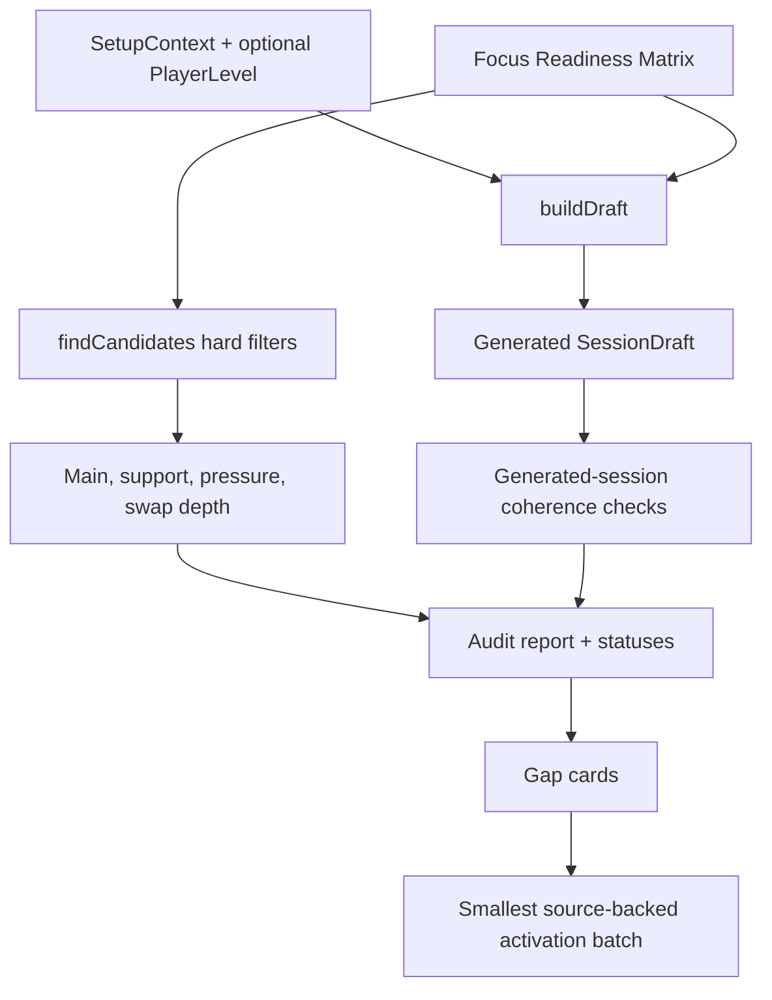

# Focus Coverage Catalog Readiness Plan

## Overview

Implement the readiness control plane behind Tune today focus trust: a test-backed coverage audit, generated-session checks, skill-level-aware generation, current 40-minute long-session readiness, same-focus swap readiness, support-slot focus semantics, and durable source-backed gap-card / activation-batch artifacts.

The plan treats the origin requirements as the source of truth. The outcome is not a hidden "thin focus" fallback. Named-focus Tune today remains v1-ready only when required cells are verified or explicitly not applicable.

**Completion update (2026-04-30):** The readiness engine now verifies all 135 current matrix cells. Passing, Serving, and Setting each stand at 45/45 verified across current configurations, beginner/intermediate/advanced levels, and fixed 15/25/40-minute profiles. Generated-draft coherence now also verifies full requested duration without repeated focus-controlled drill families. Final activation batch: `focus-readiness-batch-3-advanced-pass-set`.

**Follow-up note (2026-05-01):** User dogfood surfaced a 40-minute Serving draft where optional focused slots were skipped and the missing minutes folded into one 24-minute serving block. That behavior is acceptable under the current contract, but it exposes the next quality layer: the audit should distinguish "can generate a full plan" from "can generate a plan without stretching a selected drill past its authored workload envelope." This is also the right staging point for future curated mixed-focus themes such as `Serve + Receive`; do not add arbitrary multi-select focus filtering before the generator can measure theme-specific depth and stretch pressure.

---

## Problem Frame

Tune today made Passing, Serving, and Setting visible peer choices. The current app can steer `main_skill` and `pressure`, but skill level is not consumed by generation, the longest real time profile is 40 minutes, `technique` / `movement_proxy` are still pass-shaped support slots, and swap behavior may widen to off-focus alternatives for usability. Those behaviors are acceptable as interim product behavior, but they are not enough to prove the catalog is ready for named-focus trust.

This plan adds the software and documentation surfaces that make that bar measurable and enforceable, then uses the audit to produce durable gap cards and any smallest safe activation batch the current sources can justify.

---

## Requirements Trace

- R1-R5. Audit every visible focus, skill band, setup configuration, duration, and eligible active variant after hard filters.
- R6-R10. Enforce the practical depth floor: two main families, one support option, pressure where applicable, same-focus swaps, and long-session variety.
- R11-R13. Preserve the no-thin-focus contract and keep Recommended from masking named-focus incompleteness.
- R14-R17. Produce source-backed gap cards, prefer variant/reserve repairs, and gate cap override through feasibility and source quality.
- R18-R20. Do not add new focus chips, scenario taxonomy, or a custom builder.
- R21-R24. Make skill level, current 40-minute long-session behavior, pressure applicability, and per-slot swap coverage app-expressible rather than paper-only.
- R25-R28. Add scan-first audit structure, statuses, risk buckets, traceability, and activation-batch manifests.
- R29-R32. Keep no-net Serving honest, add generated-session coherence checks, inherit Tune today UI contracts, and require readiness-counted support slots to reinforce the selected focus.

**Origin actors:** A1 focus-steering player, A2 pair-session player, A3 catalog author / planning agent, A4 product maintainer.

**Origin flows:** F1 coverage audit, F2 focused practice generation, F3 gap closure.

**Origin acceptance examples:** AE1 pair/no-net Serving floor, AE2 actual 40-minute generated practice, AE3 advanced Setting skill-level exclusion, AE4 no known unsupported named focus, AE5 variant-first Serving repair, AE6 no new focus taxonomy, AE7 scan-first audit / gap-card trace, AE8 smallest activation batch.

---

## Scope Boundaries

- No new Tune today focus chips beyond Passing, Serving, and Setting.
- No hard skill-level UI, skill-level override, or new persistence path; generation consumes the existing onboarding skill level via `skillLevelToDrillBand()`.
- No manual/custom duration entry in this slice. Longer user-entered durations such as 90 minutes are useful future work after fixed-profile readiness is trustworthy.
- No AI-generated drill content. New or activated catalog material must be source-backed and carry exact source/adaptation trace.
- No group or 3+ player support except as future gap-card notes behind `D101`.
- No medical or injury-prevention claims in drill copy.

### Deferred to Follow-Up Work

- Full elimination of every discovered failing cell may require additional source research after the first audit. This branch must make failures durable and may land a smallest safe activation batch, but it must not invent unsourced drills to force green.
- New user-facing readiness dashboards are out of scope. The artifact is repo-facing docs/tests, not an app screen.

---

## Context & Research

### Relevant Code and Patterns

- `app/src/types/session.ts` owns `TimeProfile`, `SetupContext`, `BlockSlot`, and `SessionArchetype` shapes.
- `app/src/data/archetypes.ts` owns setup configurations and layouts; `technique` / `movement_proxy` currently carry pass-oriented support tags.
- `app/src/domain/sessionBuilder.ts` is the generated-session entry point and uses `pickForSlot`, `allocateDurations`, and seeded random selection.
- `app/src/domain/sessionAssembly/candidates.ts` owns hard eligibility filters and already calls `effectiveSkillTags()`.
- `app/src/domain/sessionAssembly/effectiveFocus.ts` is the shared focus resolver; today only `main_skill` and `pressure` are focus-controlled.
- `app/src/domain/sessionAssembly/swapAlternatives.ts` preserves user usability by widening off-focus when same-focus swap pools are empty.
- `app/src/lib/skillLevel.ts` maps persisted onboarding levels to `PlayerLevel`; current comments state generation has not consumed it yet.
- `app/src/data/catalogValidation.ts` is the existing home for static catalog invariants.
- `docs/reviews/2026-04-28-m001-candidate-false-audit.md` is the source for reserve-activation posture.

### Institutional Learnings

- No `docs/solutions/` learning entries exist in this repo.
- Adjacent docs reinforce variant-first / source-backed expansion and warn that advanced-band coverage is expected to expose real catalog gaps.

### External References

- External research is already curated in origin dependencies: `docs/research/fivb-source-material.md`, `docs/research/bab-source-material.md`, `docs/research/vdm-development-matrix-takeaways.md`, and `docs/research/ltd3-development-matrix-synthesis.md`.

---

## Key Technical Decisions

- **Audit first, then author.** Build a deterministic readiness engine and report before changing the catalog so new drills are justified by named failing cells.
- **Generation must express readiness dimensions.** Make skill-level-aware candidate filtering and current 40-minute long-session checks use real generated-session behavior instead of audit-only assumptions.
- **Readiness and runtime swap UX are related but not identical.** Keep off-focus swap fallback available for mid-run usability if needed, but the readiness engine must ignore that fallback when measuring same-focus swap depth.
- **Support-slot focus becomes explicit.** `technique` and `movement_proxy` support slots counted by readiness must be focus-reinforcing. Warmup and wrap remain recommendation-owned.
- **Gap cards are durable docs.** Store source/gap/manifest artifacts in `docs/reviews/` so readiness failures and cap overrides are reviewable without adding app UI.
- **Themes are curated contracts, not tag ORs.** A future `Serve + Receive` theme should declare its intended slot mix and acceptable dual-skill drills instead of treating multi-select as "any drill matching either focus." The session theme becomes a new readiness dimension only when it has a product name, a slot contract, and generated-session diagnostics.
- **Stretch pressure is diagnostic before it is a hard failure.** Current single-focus sessions may redistribute skipped optional minutes into `main_skill`. The next audit layer should report selected-block duration versus `variant.workload.durationMaxMinutes` and `fatigueCap.maxMinutes`, then route over-cap cells into gap cards. Hard-failing every stretch would be premature until product decides which drills can safely run long or be split into rounds.

---

## Open Questions

### Resolved During Planning

- **Long-session shape:** Use the existing first-class `40` `TimeProfile` as the v1 long-session readiness target. Manual custom duration entry, including 90-minute practices, is future work and must not be smuggled into this implementation.
- **Audit format:** Use both test-backed domain code and repo-facing markdown artifacts. Tests enforce mechanics; docs carry source and cap-review trace.
- **Skill-level source:** Use existing onboarding skill level read from `storageMeta`, mapped by `skillLevelToDrillBand()`. Pure domain calls accept a `PlayerLevel` option for tests and services.

### Deferred to Implementation

- **Exact failing cells:** The audit engine must discover the current failing matrix rather than the plan guessing every gap.
- **Activation batch content:** Only activate or add drills/variants when exact FIVB/BAB/Volley Canada source references support the specific failing cell.
- **Final directory/file names for readiness internals:** Implementer may split `focusReadiness` helpers if the module becomes too large, as long as boundaries stay pure-domain.

---

## High-Level Technical Design

> *This illustrates the intended approach and is directional guidance for review, not implementation specification. The implementing agent should treat it as context, not code to reproduce.*

### Future Diagnostic Layer: Stretch Pressure And Themes

The current readiness matrix answers: "Can every visible single focus generate a coherent plan for the supported setup, level, and duration cells?" The next matrix should answer: "Can it do so without hidden duration pressure, and can curated mixed-focus themes meet their own slot contract?"

Recommended architecture:

- Add a pure duration-pressure helper beside `focusReadiness.ts`, fed by a real `SessionDraft`, `DRILLS`, and the selected variants. It should report each block's planned minutes, variant `durationMaxMinutes`, `fatigueCap.maxMinutes`, and whether the overage came from optional-slot redistribution.
- Keep this diagnostic separate from the existing readiness pass/fail at first. A 24-minute serving block is not automatically wrong, but it should be visible as `over_authored_max` or `over_fatigue_cap` rather than hidden inside a green readiness cell.
- Add parameterized tests over `focus × configuration × playerLevel × duration × seed`. The assertion should initially be "all stretch pressure is classified and routeable," not "zero stretch exists."
- Add a second matrix only when a theme ships. For `Serve + Receive`, the dimensions should include the theme id, setup, level, duration, and an explicit slot contract such as "at least one serve-primary family, at least one pass/serve-receive family, and no more than N minutes of unexplained over-cap stretch."
- Gap cards stay the content-authoring queue. If the theme or stretch diagnostic fails, create a gap card with the failing cell and source-backed candidate direction before authoring or activating drills.

---

## Implementation Units

- [x] U1. **Readiness model and status vocabulary**

**Goal:** Define the pure TypeScript model for matrix cells, risk buckets, statuses, gap-card fields, source references, and activation-batch manifests.

**Requirements:** R1-R5, R14, R25-R28, AE7, AE8

**Dependencies:** None

**Files:**
- Create: `app/src/domain/sessionAssembly/focusReadiness.ts`
- Test: `app/src/domain/sessionAssembly/__tests__/focusReadiness.test.ts`

**Approach:**
- Model focus, setup configuration, duration, player level, slot coverage, risk bucket, and status vocabulary as closed unions.
- Add helpers that validate monotonic status transitions and required gap-card / activation-manifest fields.
- Keep the module pure: no Dexie, no React, no filesystem reads.

**Execution note:** Implement the model helpers test-first.

**Patterns to follow:**
- `app/src/domain/sessionAssembly/effectiveFocus.ts`
- `app/src/data/catalogValidation.ts`

**Test scenarios:**
- Happy path: a complete gap card with exact source reference, affected catalog IDs, and adaptation delta validates.
- Edge case: a proposed activation without `drillId` / `variantId` or explicit new-ID marker fails validation.
- Edge case: `blocked_by_source` cannot move directly to `verified` without an unblock note.
- Error path: an unknown risk/status value is rejected by type guards or validation helpers.

**Verification:**
- Readiness vocabulary and artifact validators are covered by focused unit tests.

---

- [x] U2. **Eligibility and coverage audit engine**

**Goal:** Build the deterministic audit engine that evaluates the full matrix using the same hard filters as generation.

**Requirements:** R1-R10, R23-R24, R29-R32, F1, AE1, AE7

**Dependencies:** U1

**Files:**
- Modify: `app/src/domain/sessionAssembly/focusReadiness.ts`
- Test: `app/src/domain/sessionAssembly/__tests__/focusReadiness.test.ts`

**Approach:**
- Enumerate visible focuses, setup configurations, supported durations, and player levels.
- Reuse `selectArchetype()` and `findCandidates()` for eligible active variants.
- Count distinct drill families; allow same-family variant depth only through an explicit material-distinction field in the gap card model, not by default.
- Mark pressure `not_applicable` only when the generated layout lacks a `pressure` slot and record the reason.
- Measure same-focus swaps with a strict readiness path that does not use off-focus fallback.

**Execution note:** Characterize current candidate behavior before adding readiness-specific counting.

**Patterns to follow:**
- `app/src/domain/sessionAssembly/candidates.ts`
- `app/src/domain/sessionAssembly/swapAlternatives.ts`
- `app/src/domain/sessionBuilder.test.ts`

**Test scenarios:**
- Happy path: a synthetic or fixture-backed covered cell reports sufficient main, support, pressure, and swap coverage.
- Edge case: a 15-minute layout without `pressure` returns `not_applicable` with a reason rather than passing silently.
- Edge case: a same drill family with two variants counts once unless material distinction is declared.
- Error path: pair/no-net Serving cannot count a net-required serving variant.
- Integration: candidate counts match `findCandidates()` hard filters for participants, net/wall, and unmodeled equipment.

**Verification:**
- The audit can produce deterministic per-cell results for the current catalog.

---

- [x] U3. **Skill-level-aware generation**

**Goal:** Make generated sessions and readiness consume the existing onboarding skill level through `skillLevelToDrillBand()` without adding UI or persistence.

**Requirements:** R2, R5, R21, AE3

**Dependencies:** U2

**Files:**
- Modify: `app/src/domain/sessionAssembly/candidates.ts`
- Modify: `app/src/domain/sessionBuilder.ts`
- Modify: `app/src/screens/SetupScreen.tsx`
- Modify: `app/src/services/session/regenerateDraftFocus.ts`
- Modify: `app/src/lib/skillLevel.ts`
- Test: `app/src/domain/sessionBuilder.test.ts`
- Test: `app/src/services/session/__tests__/regenerateDraftFocus.test.ts`
- Test: `app/src/screens/__tests__/SetupScreen.test.tsx`

**Approach:**
- Extend pure generation inputs with an optional effective `PlayerLevel`; keep `SetupContext` persistence unchanged unless implementation proves a narrower option impossible.
- Filter candidates by `levelMin` / `levelMax` when the effective band is present.
- Read existing `storageMeta['onboarding.skillLevel']` at draft-build/regeneration call sites and map through `skillLevelToDrillBand()`.
- Preserve conservative fallback when the persisted value is absent or invalid.

**Execution note:** Start with failing domain tests that advanced generation excludes beginner-only drills.

**Patterns to follow:**
- `app/src/lib/skillLevel.ts`
- `app/src/services/storageMeta.ts`
- `app/src/services/session/regenerateDraftFocus.ts`

**Test scenarios:**
- Happy path: `competitive_pair` maps to advanced and advanced generation only counts eligible level ranges.
- Edge case: `unsure` maps to beginner and still builds a session.
- Error path: invalid persisted skill-level values are ignored with conservative fallback.
- Integration: Setup and Tune today regeneration both pass the same effective band into generation.

**Verification:**
- Generation and readiness cannot pass skill-level cells by metadata alone.

---

- [x] U4. **40-minute long-session readiness**

**Goal:** Treat the existing 40-minute generated practice as the long-session readiness target across current archetypes and named focuses.

**Requirements:** R4, R10, R22-R23, AE2

**Dependencies:** U2

**Files:**
- Modify: `app/src/domain/sessionBuilder.test.ts`
- Modify: `app/src/domain/sessionAssembly/focusReadiness.ts`
- Test: `app/src/domain/sessionAssembly/__tests__/focusReadiness.test.ts`

**Approach:**
- Keep `TimeProfile` at the current fixed profiles, including `40` as the v1 long-session profile.
- Ensure readiness treats 40-minute layouts as the long-session cells.
- Assert current 40-minute generated sessions include the support/main/pressure shape needed for focus-readiness checks.
- Record manual custom durations such as 90 minutes as deferred future work, not an implementation dependency.

**Execution note:** Add failing readiness/coherence tests before modifying audit logic.

**Patterns to follow:**
- Existing `40` layouts in `app/src/data/archetypes.ts`
- Existing duration allocation tests in `app/src/domain/sessionBuilder.test.ts`

**Test scenarios:**
- Happy path: every archetype builds a 40-minute draft whose block durations sum to 40.
- Edge case: recovery draft for a 40-minute context still returns 40 total minutes while dropping higher-load blocks.
- Integration: readiness treats 40-minute sessions as long-session cells and does not require a 45-minute or manual-duration profile.

**Verification:**
- A 40-minute Serving, Passing, and Setting draft can be generated or explicitly fails readiness with a gap card.

---

- [x] U5. **Focus-reinforcing support slots and strict swap readiness**

**Goal:** Align generated support behavior and readiness swap checks with the named focus contract while preserving runtime swap usability.

**Requirements:** R7-R9, R24, R30-R32, F2, AE1, AE2

**Dependencies:** U2, U3, U4

**Files:**
- Modify: `app/src/domain/sessionAssembly/effectiveFocus.ts`
- Modify: `app/src/domain/sessionAssembly/candidates.ts`
- Modify: `app/src/domain/sessionAssembly/swapAlternatives.ts`
- Modify: `app/src/domain/sessionBuilder.test.ts`
- Modify: `app/src/domain/__tests__/findSwapAlternatives.test.ts`
- Test: `app/src/domain/sessionAssembly/__tests__/effectiveFocus.test.ts`
- Test: `app/src/domain/sessionAssembly/__tests__/focusReadiness.test.ts`

**Approach:**
- Make support-slot readiness explicit for `technique` and `movement_proxy`.
- Decide in implementation whether runtime generation should focus-control those support slots directly or whether a readiness-specific support classifier is safer for current catalog constraints.
- Add a strict same-focus swap helper for readiness so off-focus fallback does not satisfy R9/R24.
- Keep warmup/wrap general.

**Execution note:** Use characterization tests around existing off-focus fallback before adding strict readiness checks.

**Patterns to follow:**
- `app/src/domain/sessionAssembly/effectiveFocus.ts`
- `app/src/domain/sessionAssembly/swapAlternatives.ts`

**Test scenarios:**
- Happy path: a named-focus long session has focus-reinforcing support counted by readiness.
- Edge case: warmup and wrap remain focus-agnostic and do not fail support checks.
- Edge case: a runtime off-focus swap fallback may be returned to the user but does not count for readiness.
- Integration: Serving and Setting generated-session samples do not pass coherence by using pass-flavored support as the only support proof.

**Verification:**
- Readiness counts and generated-session coherence reflect named-focus support without breaking existing swap UX.

---

- [x] U6. **Audit report, gap cards, and activation manifest**

**Goal:** Generate or author the repo-facing readiness artifact, gap cards, and any smallest safe source-backed activation batch manifest.

**Requirements:** R14-R17, R25-R29, F3, AE5, AE7, AE8

**Dependencies:** U1-U5

**Files:**
- Create: `docs/reviews/2026-04-30-focus-coverage-readiness-audit.md`
- Create: `docs/reviews/2026-04-30-focus-coverage-gap-cards.md`
- Modify: `docs/catalog.json`
- Modify: `docs/README.md` if the reviews index requires a new pointer.
- Modify: `app/src/data/drills.ts` only for source-backed variants/activations justified by the audit.
- Test: `app/src/data/__tests__/catalogValidation.test.ts`
- Test: `app/src/domain/sessionAssembly/__tests__/focusReadiness.test.ts`

**Approach:**
- Run the readiness engine against the current catalog and record summary-by-focus, user-risk buckets, per-cell results, and linked gap cards.
- For each failing user-visible cell, create a gap card with candidate source material; mark activation-ready only when exact source reference and adaptation delta are present.
- If exact FIVB/BAB/Volley Canada material supports a small variant-first fix, add only that activation batch and manifest it. Otherwise leave the failing cell durable rather than inventing content.

**Execution note:** Do not author new drill content unless the exact source reference is in hand.

**Patterns to follow:**
- `docs/reviews/2026-04-28-m001-candidate-false-audit.md`
- Existing frontmatter and catalog registration conventions.

**Test scenarios:**
- Happy path: audit artifact includes focus-level summary, risk buckets, statuses, and linked gap cards.
- Edge case: non-primary sources cannot activate a drill without a source-quality explanation.
- Error path: activation manifest missing cap delta or verification criteria fails validation.
- Integration: any changed drill records still pass catalog validation.

**Verification:**
- Future agents can trace failing cells to gap cards and any catalog changes to source-backed manifests.

---

- [x] U7. **End-to-end verification and docs sync**

**Goal:** Verify the implementation, sync docs/catalog routing, and leave a clear readiness state.

**Requirements:** All origin requirements and success criteria

**Dependencies:** U1-U6

**Files:**
- Modify: `docs/catalog.json`
- Modify: `docs/status/current-state.md` if current posture changes materially.
- Modify: `docs/archive/plans/2026-04-30-002-feat-focus-coverage-readiness-plan.md` checkboxes as units complete.

**Approach:**
- Run focused domain/data tests after each implementation cluster.
- Run full app tests, lint, build, and agent-doc validation before review.
- Update plan checkboxes and docs routing only for work that actually landed.

**Patterns to follow:**
- `docs/ops/agent-documentation-contract.md`
- `app/package.json` scripts.

**Test scenarios:**
- Test expectation: none beyond verification commands and plan/docs sync; this is a quality gate unit.

**Verification:**
- Relevant focused tests pass.
- Full app verification passes or failures are documented with actionable blockers.
- `bash scripts/validate-agent-docs.sh` passes.

---

## System-Wide Impact

- **Interaction graph:** Setup and Tune today regeneration will need the same effective skill-level source; session assembly, swaps, and readiness audit share candidate-selection semantics.
- **Error propagation:** Invalid or absent skill-level metadata should fall back conservatively, not block session creation.
- **State lifecycle risks:** Avoid adding persisted fields unless necessary; `SetupContext` remains the stable persisted draft/session context.
- **API surface parity:** Initial generation and focus regeneration must both pass through the same skill-level / focus resolution path.
- **Integration coverage:** Domain tests must prove generator, candidates, swaps, and readiness counts agree on hard filters.
- **Unchanged invariants:** Recommended remains default; warmup/wrap remain recommendation-owned; pain recovery strips focus.

---

## Risks & Dependencies

| Risk | Mitigation |
|------|------------|
| Audit reports many failing cells and tempts unsourced content authoring | Land durable gap cards first; author only exact-source, smallest-batch fixes. |
| Skill-level filtering makes existing sessions unbuildable | Keep fallback conservative for missing skill level; tests identify failing catalog cells rather than hiding them. |
| Support-slot focus control breaks required slots for Serving/Setting | Characterize current generation and choose runtime focus-control only where catalog supports it; otherwise fail readiness with gap cards. |
| Manual/custom duration scope creeps into readiness | Keep this branch on fixed-profile 40-minute readiness and document 90-minute manual entry as future work. |
| Runtime swap fallback conflicts with readiness | Separate strict readiness checks from user-facing fallback behavior. |

---

## Documentation / Operational Notes

- Register new review artifacts and this plan in `docs/catalog.json`.
- Keep readiness status honest: if failing cells remain, docs must say named-focus Tune today is not fully v1-ready yet.
- Any activation batch must carry source references, affected IDs, cap delta, and checkpoint criteria.

---

## Sources & References

- **Origin document:** `docs/brainstorms/2026-04-30-focus-coverage-catalog-readiness-requirements.md`
- **Prior Tune today plan:** `docs/plans/2026-04-30-001-feat-pre-run-simplification-plan.md`
- **Reserve audit:** `docs/reviews/2026-04-28-m001-candidate-false-audit.md`
- **Session assembly:** `app/src/domain/sessionBuilder.ts`
- **Candidate filtering:** `app/src/domain/sessionAssembly/candidates.ts`
- **Swap alternatives:** `app/src/domain/sessionAssembly/swapAlternatives.ts`
- **Skill-level mapping:** `app/src/lib/skillLevel.ts`
