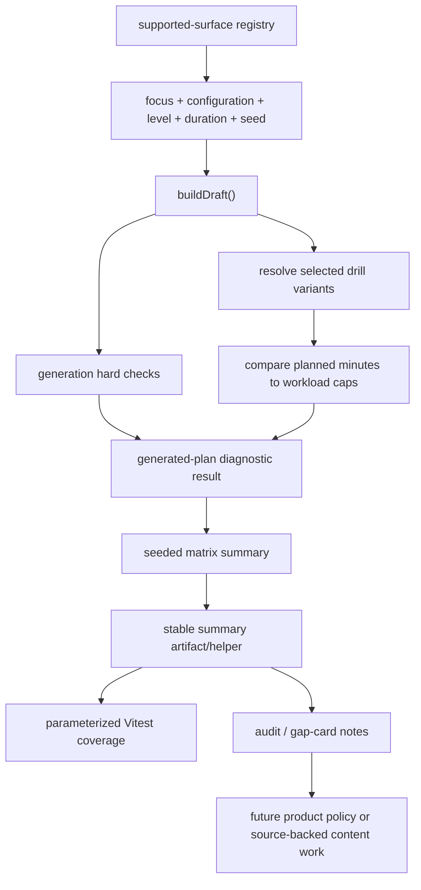

# Generated-Plan Stretch Diagnostics Plan

## Overview

Add the next quality layer behind Tune today's focus readiness: generated-plan diagnostics that run real seeded `buildDraft()` outputs across the existing focus-readiness matrix, classify hard failures separately from routeable observations, and make duration stretch against selected variant workload caps visible.

This is a follow-up to the completed focus-coverage readiness plan, not a replacement for it. The current matrix proves every visible single-focus cell can generate a coherent full-duration practice. This plan proves those generated practices do not hide unclassified stretch pressure such as a 40-minute Serving draft that folds skipped optional work into one 24-minute serving block.

The matrix should be future-resistant: when Volleycraft adds a supported focus, setup parameter, level, duration, or later theme dimension, diagnostics should pick it up from the supported-surface registry and fail if the drill library cannot satisfy it. The fallback is explicit registration with a deliberate `not_applicable` or deferred reason, not silently leaving new product surface untested.

---

## Problem Frame

The 2026-04-30 readiness pass made Passing, Serving, and Setting fully verified across 135 current focus/configuration/level/duration cells. Dogfood then exposed a different class of issue: a session can be valid, focused, and full-duration while still stretching one selected drill past its authored workload envelope because optional focus-controlled slots were skipped and redistributed.

The product decision from the origin requirements is intentionally nuanced: over-cap stretch is not automatically wrong. Some drills can safely run long, some should split into rounds, and some indicate missing catalog depth. The software job in this slice is to classify that pressure so maintainers can route it through gap cards and policy instead of discovering it ad hoc during use.

---

## Requirements Trace

- R33. Keep catalog-depth readiness separate from generated-plan diagnostics.
- R34. Sweep the supported matrix with a deterministic seed corpus: visible focus, setup configuration, effective player level, duration, and seed.
- R35. Classify hard failures separately from warnings. Hard failures include no draft, wrong duration, missing required slot, off-focus focus-controlled work, hard-filter violations, and unclassified stretch pressure. Warnings include classified over-cap stretch, fatigue-cap overage, optional-slot redistribution, and thin/repetitive generated shape.
- R36. Compare each generated block's planned minutes to the selected variant's `workload.durationMaxMinutes` and `workload.fatigueCap.maxMinutes` when present, reporting block type, required flag, drill/variant IDs, planned minutes, authored caps, and redistribution evidence.
- R37. Treat authored-cap overage as visible and routeable first, not automatically product-failing.
- R38. Preserve curated mixed-focus themes as explicit future contracts, not arbitrary multi-select OR filters.

**Origin actors:** A1 focus-steering player, A2 pair-session player, A3 future catalog author or planning agent, A4 product maintainer.

**Origin flows:** F4 generated-plan stretch diagnosis, plus F1 coverage audit and F3 gap closure where diagnostic findings route into repo-facing artifacts.

**Origin acceptance examples:** AE9 40-minute Serving draft classifies the 24-minute serving stretch; AE10 future `Serve + Receive` requires a theme contract instead of raw `pass OR serve` filtering.

---

## Scope Boundaries

- No user-facing UI changes, focus-chip changes, or runtime warning copy in this slice.
- No arbitrary multi-select focus picker. Mixed-focus work remains future curated session themes with explicit contracts.
- No catalog activation, new drills, or variant cap changes as part of the diagnostic implementation. Findings route to gap cards first.
- Branch-level catalog changes in `app/src/data/drills.ts` are owned by the 2026-04-30 focus-coverage readiness batches, not by this generated-plan diagnostic slice.
- No manual/custom duration support. The diagnostic covers the current fixed `15 | 25 | 40` `TimeProfile` set.
- No policy escalation that hard-fails every known over-cap block. Unknown or unclassified stretch fails; classified over-cap stretch starts as report data, even when the selected block was required.
- No new persisted session schema. Diagnostics should operate from existing `SessionDraft`, archetype, and drill metadata.
- No automatic inclusion of every `SkillFocus` union member. Support tags such as `movement`, `warmup`, and `recovery` are not visible focus choices; the dynamic matrix follows product-visible supported surfaces, not raw type membership.

### Deferred to Follow-Up Work

- `Serve + Receive` implementation: create a separate theme contract plan only after single-focus generated-plan diagnostics exist.
- Product policy for acceptable over-cap thresholds: decide later which routeable observation categories become hard failures, which drills can run long, and which should split into rounds.
- Source-backed catalog/content fixes: address only after the diagnostic identifies concrete cells and the gap-card manifest has exact source references.

---

## Context & Research

### Relevant Code and Patterns

- `app/src/domain/sessionAssembly/focusReadiness.ts` already owns visible focuses, readiness configurations, player levels, durations, status vocabulary, and the 135-cell audit loop.
- `app/src/domain/sessionBuilder.ts` owns deterministic `buildDraft()` generation, optional-slot skipping, and current redistribution of skipped minutes into `main_skill` or the last selected block.
- `app/src/domain/sessionAssembly/candidates.ts` owns canonical hard filters for M001 candidacy, participants, equipment, net/wall, unmodeled requirements, and player level.
- `app/src/data/archetypes.ts` owns layout slots, required/optional flags, and slot min/max duration envelopes for each setup/time profile.
- `app/src/types/drill.ts` owns `DrillVariant.workload.durationMaxMinutes` and optional `fatigueCap.maxMinutes`, the authored caps this diagnostic compares against.
- `app/src/types/session.ts` owns `SetupContext`, `TimeProfile`, `BlockSlot`, and `DraftBlock` shapes. `SetupContext.playerLevel` is already the effective band surface.
- `app/src/domain/sessionAssembly/__tests__/focusReadiness.test.ts` already parameterizes readiness over the full focus/configuration/level/duration matrix and includes generated-draft coherence checks.
- `docs/reviews/2026-04-30-focus-coverage-gap-cards.md` already contains `future-gap-block-stretch-pressure` and future theme-manifest requirements.
- The existing readiness constants are the first supported-surface registry. This plan should strengthen that pattern so future supported dimensions enter one registry and automatically expand diagnostics rather than requiring hand-authored one-off tests.

### Institutional Learnings

- No applicable `docs/solutions/` institutional learnings exist for this area yet.
- After this work lands, capture a learning if the diagnostic/matrix pattern becomes reusable.

### External References

- No new external research is needed for this slice. The work is internal TypeScript domain diagnostics over existing app metadata and source-backed readiness docs.

---

## Key Technical Decisions

- **Domain-level diagnostics:** Place the buildDraft-consuming evaluator at the domain root beside `sessionBuilder.ts`, while reusing lower-level sessionAssembly helpers and readiness constants. This avoids making a lower-level sessionAssembly module depend upward on the session builder.
- **Supported-surface registry, not static test lists:** Build diagnostic inputs from exported product-supported dimension registries. Adding a visible focus, setup configuration, player level, duration, or future theme should expand the matrix automatically, and insufficient catalog support should produce a hard failure or explicit `not_applicable` report.
- **Classification over enforcement:** Unknown states hard-fail because the repo cannot reason about them. Known over-cap stretch becomes structured routeable observation data until product policy promotes specific cases.
- **Real generated drafts:** Use `buildDraft()` with deterministic seeds rather than candidate counts alone. Candidate readiness and generated-plan behavior answer different questions.
- **Two-tier test budget:** Keep fast analyzer fixtures and a bounded smoke subset in the normal test path, and keep the full seeded matrix available as a focused diagnostic suite. Summaries should report cell count and seed count so reviewers know exactly what was exercised.
- **No raw theme ORs:** Do not widen `effectiveSkillTags()` or focus filtering to support multi-select. Future theme work must reconsider the right contract in its own plan; this slice only preserves the guardrail against raw OR filtering.
- **Machine-readable report before content action:** Diagnostics should produce one stable summary artifact or summary helper that tests can assert and docs can cite before any catalog repair is proposed.

---

## Open Questions

### Resolved During Planning

- **Create a new plan or revise the completed plan?** Create a new follow-up plan because the prior readiness plan is complete and this is a new diagnostic layer.
- **Should over-cap stretch fail immediately?** No. Classified over-cap stretch is a routeable observation first; unclassified stretch is a hard failure.
- **Should external research be added?** No. Existing repo patterns are strong and the work does not touch external APIs, security, privacy, or third-party contracts.
- **How many seeds should the first matrix use?** Plan for four deterministic seeds per cell plus one or more named regression seeds, but split fast normal coverage from the full focused diagnostic suite if runtime becomes noisy.
- **Should future dimensions be opt-in or automatic?** Automatic where the product surface is enumerable from a supported registry. If a new dimension cannot be derived safely, implementation must require explicit registry entry with a reason rather than silently skipping it.

### Deferred to Implementation

- **Exact seed labels:** Choose stable, readable seed names while writing tests so failures are easy to reproduce.
- **Exact observation summary shape:** Keep it compact enough for test assertions and docs summaries; prefer a stable summary helper or small machine-readable report over manual-only markdown counts.
- **Skipped optional pressure policy details:** Start as routeable observation data when optional. Requiredness is report context, not an automatic cap-overage escalator; only missing required slots or unclassified stretch hard-fail in this slice.
- **Under-minimum duration diagnostics:** This plan focuses on over-cap stretch. The selected-variant resolver may expose under-minimum context, but under-min policy should not block R33-R37 unless it is trivial and well-classified.

---

## High-Level Technical Design

> *This illustrates the intended approach and is directional guidance for review, not implementation specification. The implementing agent should treat it as context, not code to reproduce.*

The generated-plan diagnostic should produce one result per seeded cell. Each result should have a terminal classification: `hard_failure`, `observation_only`, or `clean`. Precedence is explicit: any hard failure makes the result `hard_failure`, while observations are still preserved for triage. Observation-only results are valid generated practices, but they identify stretch pressure or variety pressure that must be visible in reports and gap cards.

---

## Implementation Units

- [x] U1. **Diagnostic model, supported-surface registry, and matrix inputs**

**Goal:** Define the pure diagnostic vocabulary, supported-surface registry, seed corpus, result shape, and reusable matrix input helpers for generated-plan diagnostics.

**Requirements:** R33, R34, R35

**Dependencies:** None

**Files:**
- Create: `app/src/domain/generatedPlanDiagnostics.ts`
- Test: `app/src/domain/__tests__/generatedPlanDiagnostics.test.ts`

**Approach:**
- Reuse `VISIBLE_FOCUSES`, `READINESS_CONFIGURATIONS`, `PLAYER_LEVELS`, and `READINESS_DURATIONS` from `focusReadiness.ts` rather than duplicating matrix definitions.
- Treat those exported readiness constants as the first supported-surface registry. If implementation needs a clearer name or wrapper, create one registry that remains the single source of product-supported diagnostic dimensions.
- Build matrix inputs by expanding registered dimensions, not by hardcoding per-focus or per-setup test cases.
- Include an explicit `not_applicable` / deferred-reason path for registered dimensions that are product-supported but intentionally outside a specific diagnostic run.
- Keep raw type unions subordinate to product registries: adding a `SkillFocus` support tag should not automatically create a Tune today focus cell, but adding a product-visible focus to `VISIBLE_FOCUSES` should.
- Model hard-failure codes separately from routeable observation codes. Hard failures should include no draft, wrong total duration, missing required slot, unresolved selected variant, hard-filter violation, off-focus focus-controlled work, and unclassified stretch pressure. Observations should include over authored max, over fatigue cap, optional-slot redistribution, and generated-shape variety pressure.
- Model enough block-level detail to trace a finding: focus, configuration, level, duration, seed, block type, required flag, drill ID, variant ID, planned minutes, authored caps, and redistribution evidence.
- Keep the module pure and deterministic: no filesystem writes, no docs generation side effects, no Dexie reads, and no assertions against volatile `updatedAt` values.

**Execution note:** Implement closed TypeScript unions test-first. Add runtime guards only if a machine-readable report crosses a parsing boundary.

**Patterns to follow:**
- `app/src/domain/sessionAssembly/focusReadiness.ts`
- `app/src/domain/sessionAssembly/__tests__/focusReadiness.test.ts`
- `app/src/data/catalogValidation.ts`

**Test scenarios:**
- Happy path: building the default generated-plan matrix yields one input per focus/configuration/level/duration/seed combination.
- Happy path: adding a new value to a fixture supported-surface registry expands generated matrix inputs without adding bespoke test cases.
- Happy path: every diagnostic status, hard-failure code, and routeable observation code is represented by a closed union or const array.
- Edge case: four default seeds per cell plus one or more named regression seeds produce deterministic, stable input IDs.
- Edge case: a registered dimension with an explicit `not_applicable` reason appears in summary output instead of disappearing from the matrix.
- Error path: a product-visible dimension without a diagnostic projection fails matrix validation instead of being silently skipped.
- Error path: unknown diagnostic codes cannot enter typed diagnostic results, or are rejected if a runtime report parser is added.
- Integration: generated-plan matrix input count is derived from current readiness constants and changes when the readiness matrix changes.

**Verification:**
- Diagnostic vocabularies and matrix inputs are stable, typed, and covered by focused unit tests.

---

- [x] U2. **Selected draft stretch analyzer**

**Goal:** Analyze one real `SessionDraft` against its archetype layout and selected variants, then classify selected-block stretch pressure.

**Requirements:** R33, R35, R36, R37, AE9

**Dependencies:** U1

**Files:**
- Modify: `app/src/domain/generatedPlanDiagnostics.ts`
- Modify: `app/src/domain/sessionBuilder.ts`
- Test: `app/src/domain/__tests__/generatedPlanDiagnostics.test.ts`

**Approach:**
- Resolve each draft block's `drillId` and `variantId` against `DRILLS`; unresolved drill or variant IDs are hard failures.
- Compare `block.durationMinutes` to `variant.workload.durationMaxMinutes`; equal-to-cap is clean, greater-than-cap is an `over_authored_max` routeable observation.
- Compare to `variant.workload.fatigueCap.maxMinutes` only when present; missing fatigue caps are not observations.
- Make redistribution evidence observed from the generation path rather than guessed from final blocks. Prefer extracting a non-persisted assembly trace from `buildDraft()` internals that exposes selected layout indices, skipped optional indices, base allocated durations, and redistribution target.
- If implementation cannot expose observed redistribution metadata without unsafe churn, mark causality as inferred and never use inferred causality to downgrade an otherwise unclassified over-cap case.
- If a block exceeds a cap and the analyzer cannot classify the source with enough confidence, mark `unclassified_stretch_pressure` as a hard failure.
- Include layout slot max overage as context only; the primary R36 comparison is variant workload caps.

**Execution note:** Start with fixtures that intentionally exceed caps, equal caps, and omit fatigue caps before wiring full generated drafts.

**Patterns to follow:**
- `app/src/domain/sessionBuilder.ts`
- `app/src/data/archetypes.ts`
- `app/src/types/drill.ts`
- `app/src/types/session.ts`

**Test scenarios:**
- Happy path: a draft block at exactly `durationMaxMinutes` returns clean cap status.
- Happy path: a draft block over `durationMaxMinutes` returns an `over_authored_max` observation with planned minutes and cap minutes.
- Happy path: a draft block over `fatigueCap.maxMinutes` returns an `over_fatigue_cap` observation when the fatigue cap exists.
- Edge case: a variant with no fatigue cap never emits a fatigue observation.
- Edge case: an optional skipped slot produces skipped-slot and redistribution metadata when minutes move to the main skill block.
- Error path: unresolved `drillId` or `variantId` is a hard failure.
- Error path: over-cap stretch with no classifiable source is a hard failure, not an observation.
- Integration: analyzer output for an actual 40-minute Serving draft includes block type, required flag, drill/variant IDs, planned minutes, authored caps, and redistribution evidence.

**Verification:**
- One-draft analysis can explain every cap overage or fail loudly when it cannot.

---

- [x] U3. **Seeded generated-plan matrix evaluator**

**Goal:** Run `buildDraft()` across the supported matrix and seed corpus, layering hard checks and stretch analysis into one diagnostic report.

**Requirements:** R33, R34, R35, R36, R37, F4, AE9

**Dependencies:** U1, U2

**Files:**
- Modify: `app/src/domain/generatedPlanDiagnostics.ts`
- Test: `app/src/domain/__tests__/generatedPlanDiagnostics.test.ts`
- Test: `app/src/domain/sessionAssembly/__tests__/focusReadiness.test.ts`

**Approach:**
- For each matrix input, build a `SetupContext` from readiness configuration, duration, focus, and player level.
- Consume matrix inputs from the supported-surface registry built in U1. Do not write per-focus or per-configuration loops that must be updated separately when new parameters ship.
- Call `buildDraft()` with deterministic seed and effective player level.
- Hard-fail no draft, wrong total duration, context mismatch, missing required slot, off-focus focus-controlled work, hard-filter violation, unresolved variant identity, and unclassified stretch.
- Treat known over-cap stretch, fatigue-cap overage, optional-slot redistribution, and generated-shape variety pressure as routeable observations unless product policy later promotes them.
- Keep focus-controlled checks aligned with the readiness-owned predicate or metadata used by candidate selection. Do not hard-code a second independent list of slot types inside diagnostics; if the focus-controlled boundary changes later, diagnostics should change from the shared predicate.
- Summarize by focus, configuration, level, duration, seed, hard-failure count, observation count, observation categories, cell count, and seed count so tests can assert health without brittle full snapshots.
- Split verification into a fast default path and a full focused matrix path if the full `135 × seedCount` sweep becomes too slow for normal tests.

**Execution note:** Add parameterized tests before broadening assertions so failures identify the exact cell and seed.

**Patterns to follow:**
- `app/src/domain/sessionAssembly/__tests__/focusReadiness.test.ts`
- `app/src/domain/sessionBuilder.test.ts`
- `app/src/domain/sessionAssembly/candidates.ts`

**Test scenarios:**
- Covers AE9. Given a 40-minute Serving draft that skips optional focus-controlled work and redistributes minutes into a long serving block, the result remains full-duration but reports classified over-cap observations.
- Happy path: every current generated-plan matrix result is `clean` or `observation_only`, with no unknown classification.
- Happy path: introducing a fixture focus/configuration/duration with insufficient catalog coverage produces a classified hard failure, proving new supported dimensions fail closed.
- Edge case: a 15-minute layout with no pressure slot does not fail pressure checks when no pressure slot exists.
- Edge case: warmup and wrap can be general-purpose without triggering off-focus hard failures.
- Error path: a synthetic or fixture-backed no-draft cell reports `no_draft` as a hard failure.
- Error path: a synthetic off-focus `main_skill` or `pressure` block reports an off-focus hard failure.
- Integration: advanced-level generated cells do not select beginner-only drill variants after candidate filtering.
- Integration: diagnostics detect repeated focus-controlled drill families within one draft as routeable generated-shape pressure. Cross-seed low-variety checks should use an explicit threshold before entering the report.

**Verification:**
- The generated-plan matrix produces deterministic, fully classified results for every current focus-readiness cell and seed.

---

- [x] U4. **Report and gap-card routing**

**Goal:** Surface generated-plan diagnostic findings in repo-facing artifacts so future agents can route over-cap observations before authoring content.

**Requirements:** R35, R36, R37, R38, F1, F3, AE9, AE10

**Dependencies:** U1, U2, U3

**Files:**
- Create: `docs/reviews/2026-05-01-generated-plan-diagnostics-report.md`
- Modify: `docs/reviews/2026-04-30-focus-coverage-readiness-audit.md`
- Modify: `docs/reviews/2026-04-30-focus-coverage-gap-cards.md`
- Modify: `docs/catalog.json`
- Test: `app/src/domain/__tests__/generatedPlanDiagnostics.test.ts`

**Approach:**
- Add a stable machine-readable diagnostics summary, or an equivalent exported summary helper if checking in JSON proves too noisy, so tests and docs share one source of truth for counts.
- Add a generated-plan diagnostics section to the readiness audit with summary counts by focus and observation category. Keep it scan-first and avoid dumping every cell unless failures require detail.
- Include matrix dimension metadata in the report: registered focuses/themes if any, configurations, levels, durations, seed count, skipped/not-applicable dimensions, and full cell count. That makes it obvious when a future product surface expanded the diagnostic run.
- Update `future-gap-block-stretch-pressure` with concrete diagnostic outputs: affected cells, selected drill/variant IDs, cap categories, and whether the fix path appears to be policy allowance, block splitting, variant repair, or source-backed content depth.
- Preserve the theme guardrail without designing the theme now: this slice must not add raw multi-select OR behavior, and a future mixed-focus plan owns its own contract, alternatives, and allowed-overage rationale using these diagnostics as input.
- If diagnostics are all clean/observation-only, document that state honestly; do not convert observations into catalog activation without source-backed policy.

**Execution note:** Treat docs updates as a report of implementation output. Do not guess affected cells before diagnostics run.

**Patterns to follow:**
- `docs/reviews/2026-04-30-focus-coverage-readiness-audit.md`
- `docs/reviews/2026-04-30-focus-coverage-gap-cards.md`
- `docs/archive/plans/2026-04-30-002-feat-focus-coverage-readiness-plan.md`
- `docs/catalog.json`

**Test scenarios:**
- Happy path: generated-plan report summary can be derived from diagnostic results without relying on markdown parsing.
- Edge case: multiple observation categories on one block are represented without double-counting the block as multiple unrelated user risks.
- Error path: a diagnostics run with hard failures cannot be summarized as verified.
- Integration: docs and catalog routing reflect the new diagnostic layer without changing source-of-truth ownership.

**Verification:**
- The repo has a durable, scan-first account of generated-plan stretch pressure and how any observations route into future work.

---

- [x] U5. **Verification and scope guard**

**Goal:** Prove the diagnostic layer is wired into the current app/test/doc surfaces while preserving the existing product and runtime boundaries.

**Requirements:** R33-R38 and origin success criteria for generated-plan stretch diagnostics

**Dependencies:** U1, U2, U3, U4

**Files:**
- Modify: `docs/archive/plans/2026-05-01-001-feat-generated-plan-diagnostics-plan.md`
- Modify: `docs/status/current-state.md` only if current project posture changes materially.
- Test: `app/src/domain/__tests__/generatedPlanDiagnostics.test.ts`
- Test: `app/src/domain/sessionAssembly/__tests__/focusReadiness.test.ts`

**Approach:**
- Keep plan checkboxes and status aligned with completed implementation units.
- Verify that no UI route, focus chip, Dexie schema, or catalog activation changed as part of this slice unless a later explicit plan authorizes it.
- Ensure the diagnostic layer composes with the existing focus-readiness audit rather than replacing it.
- Verify that supported-surface expansion fails closed: new registered focuses, configurations, levels, durations, or themes must either generate diagnostic cells or carry an explicit not-applicable/deferred reason.
- Leave residual observations documented as policy/content follow-up, not hidden test debt.

**Patterns to follow:**
- `docs/ops/agent-documentation-contract.md`
- `AGENTS.md`
- Existing docs/catalog registration conventions.

**Test scenarios:**
- Test expectation: no new behavioral unit tests beyond U1-U4. This unit is a verification, scope, and documentation synchronization gate.

**Verification:**
- Focus-readiness tests and generated-plan diagnostic tests pass.
- Docs validation passes for the new plan and catalog updates.
- The final diff does not include UI, persistence, or unplanned catalog-content changes.

---

## System-Wide Impact

- **Interaction graph:** `buildDraft()` remains the generation source. Diagnostics call it as a consumer and should not change runtime generation behavior unless a hard-failure test reveals an existing bug that needs a separate fix.
- **Error propagation:** Diagnostics collect hard failures and routeable observations as report data. They should not throw for expected classified observation states, but should fail tests for unknown/unclassified states.
- **State lifecycle risks:** No persisted state changes are planned. `SessionDraft.context.playerLevel` and existing block identity fields are sufficient inputs.
- **API surface parity:** Initial generation and readiness diagnostics must agree on setup, focus, level, duration, and hard filters. Runtime swap behavior remains separate from readiness diagnostics.
- **Integration coverage:** Parameterized matrix tests prove domain-level behavior across seed/cell combinations, with a fast/default subset and a full focused matrix when needed; UI/E2E tests are not needed unless implementation changes runtime behavior unexpectedly.
- **Unchanged invariants:** Recommended remains default; warmup and wrap remain recommendation-owned; arbitrary multi-select remains out of scope; known over-cap stretch starts as a routeable observation rather than an automatic failed product state.

---

## Risks & Dependencies

| Risk | Mitigation |
| --- | --- |
| Matrix tests become too slow or noisy | Split fast/default checks from the full focused matrix; keep report assertions summarized rather than snapshotting every block. |
| Diagnostics duplicate readiness logic and drift | Reuse readiness constants and candidate hard-filter helpers; make generated-plan diagnostics a domain-level consumer of `buildDraft()` rather than a parallel generator. |
| Dynamic discovery accidentally includes non-user-facing support tags | Drive the matrix from product-supported registries such as `VISIBLE_FOCUSES`, not raw `SkillFocus` union membership. |
| New product parameters ship without diagnostics | Require registry expansion to fail closed when no diagnostic projection or not-applicable reason exists. |
| Over-cap observations get mistaken for permission to author unsourced drills | Route observations through existing gap cards and require exact source references before content changes. |
| Optional-slot redistribution is inferred incorrectly | Prefer observed non-persisted assembly trace metadata from the generation path; hard-fail unclassified stretch instead of guessing. |
| Theme scaffolding becomes premature abstraction | Limit this plan to guardrails and docs; do not implement `Serve + Receive` runtime logic. |

---

## Documentation / Operational Notes

- Register this plan in `docs/catalog.json`.
- Update the focus coverage audit and gap cards only after diagnostics produce concrete findings backed by the stable summary artifact/helper.
- Keep docs wording clear that stretch diagnostics are a quality/reporting layer, not an immediate product policy that forbids every long block.
- A future `Serve + Receive` plan should use this diagnostic layer as input, but should still reconsider the theme contract, alternatives, and allowed-overage rationale in that future plan.

---

## Sources & References

- **Origin document:** `docs/brainstorms/2026-04-30-focus-coverage-catalog-readiness-requirements.md`
- **Completed readiness plan:** `docs/archive/plans/2026-04-30-002-feat-focus-coverage-readiness-plan.md`
- **Readiness audit:** `docs/reviews/2026-04-30-focus-coverage-readiness-audit.md`
- **Gap cards:** `docs/reviews/2026-04-30-focus-coverage-gap-cards.md`
- **Session builder:** `app/src/domain/sessionBuilder.ts`
- **Focus readiness:** `app/src/domain/sessionAssembly/focusReadiness.ts`
- **Candidate filters:** `app/src/domain/sessionAssembly/candidates.ts`
- **Archetypes:** `app/src/data/archetypes.ts`
- **Drill workload caps:** `app/src/types/drill.ts`
- **Session context and slots:** `app/src/types/session.ts`
