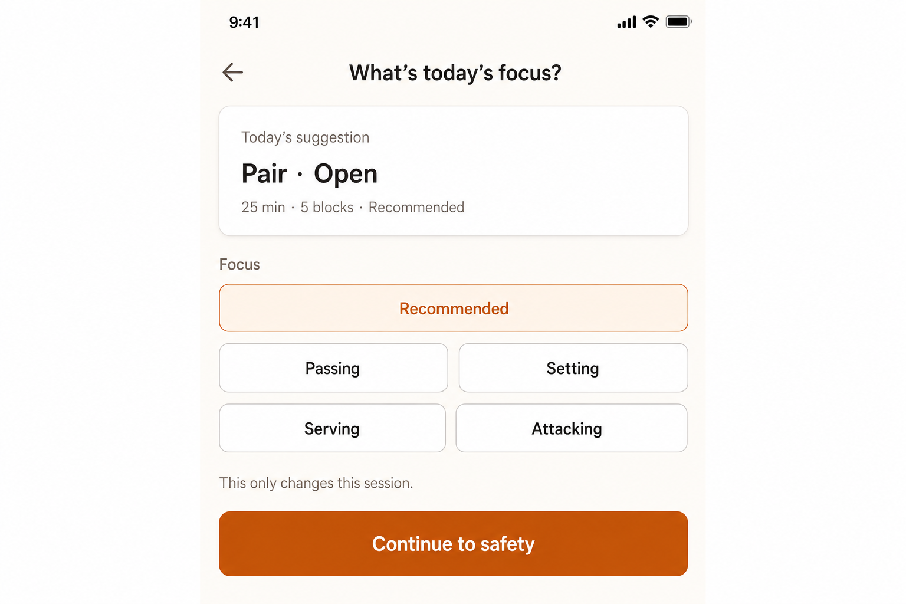

# Skill-scope forward reservation requirements — SUPERSEDED

> **Superseded 2026-04-30** by `docs/brainstorms/2026-04-30-pre-run-simplification-requirements.md` (Track 4). The replacement records the same policy direction — "out-of-system is scenario, not skill; attack waits for D135-style trigger evidence" — in a single `docs/decisions.md` row instead of a types PR + research note. No code under this doc was implemented; it is preserved as historical record of the analysis.

## Problem Frame

The 2026-04-29 skill-scope ideation answered three questions in the user's prompt — "should we add attacking, team tactics, out-of-system, and live/adaptive layers?" — with three different verdicts. Most of those verdicts are deferrals (`S4` team tactics → M003+, `S7` live/adaptive → existing runner work, `S3` game-like → copy/runner polish on existing `MetricType`). One verdict is structural and ready to ship: `S1` schema reservation for `attack` in the `SkillFocus` union and an optional `scenario` field on `DrillVariant`, paired with `S2` documenting the two-axis (skill × scenario) catalog model as architecture.

This is the smallest move that compounds. It costs two type-union edits, one optional interface field, and a research note. It costs zero new drill records, zero UI changes, zero Dexie migrations, zero new routes, and zero Tier 1b authoring-attention slots. It explicitly does **not** consume the `D135` walkthrough-equivalence trigger — that trigger remains armed for the day attacking is actually exposed in UI or authored as drill content.

The risk we are buying down is silent: Tier 1c just locked four UI states (Recommended / Passing / Serving / Setting) into the `Tune today` picker copy and the `effectiveFocus.ts` resolver. Without S1's reservation, the next time a partner-walkthrough or founder-ledger row says "I needed an attacking session today," the response cost is not just authoring drills — it is also a schema bump, a migration, and a refactor of every site that switches on `SkillFocus`. With S1, that day's cost is content and one chip.

S2's two-axis note exists because the ideation surfaced an even bigger latent risk: the team is one or two ill-fitting drill ideas away from accidentally adding `'out-of-system'` or `'side-out'` to the `SkillFocus` enum, which would be the wrong shape. Coaching practice, the skill-correlation vendor synthesis, and adjacent training apps all model these as **scenarios over skills**, not as new skills. Naming the axis explicitly — once, in a research note — prevents that wrong shape from being discovered the hard way.

---

## What ships in this slice

This slice authorizes **a single docs + types PR**:

1. Add `'attack'` to the `SkillFocus` type union in `app/src/types/drill.ts` as a forward reservation. Zero drills carry `'attack'` after this PR.
2. Add an optional `scenario?: Scenario` field to `DrillVariant` in `app/src/types/drill.ts`, where `Scenario = 'in_system' | 'out_of_system' | 'transition' | 'side_out' | 'game_like'`. Zero variants carry a `scenario` value after this PR.
3. Document both reservations in `docs/decisions.md` as a new decision row (`D136` or similar — final ID assigned by the implementation plan).
4. Author a research note `docs/research/skill-vs-scenario-axes.md` that names the two-axis model, cites the skill-correlation evidence, and codifies "out-of-system is scenario, not skill" as a design principle.
5. Cross-link the new docs from `docs/decisions.md`, `docs/research/README.md`, and `docs/catalog.json`.

This slice does **not** ship:

- No `Tune today` chip changes, no new chip count, no copy changes anywhere in the running app.
- No drill records at any skill, scenario, or progression level.
- No `Tier 1b` authoring-attention slot consumption.
- No Dexie migration. The `scenario?` field is optional and not stored on Dexie row shapes today (it lives on the static catalog `DrillVariant`).
- No telemetry, export-format change, profile change, or `D131` posture change.
- No `M001` scope expansion. Cap discipline (`docs/plans/2026-04-20-m001-adversarial-memo.md` 4/10 cap) is unchanged.
- No `D135` trigger-fire. Reserving the enum is not equivalent to exposing it; the partner-walkthrough or founder-ledger evidence threshold for actually shipping attacking content remains armed.

---

## Definitions

- **Skill axis** — the technique GMP a drill primarily trains. Existing `SkillFocus` values: `pass`, `serve`, `set`, `movement`, `conditioning`, `recovery`, `warmup`. This slice adds `attack` as a reserved-only value.
- **Scenario axis** — the tactical context in which a skill is exercised. Reserved values: `in_system`, `out_of_system`, `transition`, `side_out`, `game_like`. Orthogonal to the skill axis; the same drill can carry one skill and any of these scenarios.
- **Forward reservation** — a type-union or optional-field addition that exists so future content can land without a schema bump or migration. Reservations carry zero behavior, zero UI exposure, and zero authored content on the day they ship.
- **Cluster** (for S5 forward compatibility) — an internal architecture grouping. `pass` and `set` form an underhand-ball-control cluster; `serve` and `attack` form an overhead-striking cluster. Cluster identity is documented in the research note but is not user-facing.
- **Trigger** — the `D135` walkthrough-equivalence policy that gates content authoring or UI exposure. Reservations do not consume the trigger.

---

## Friction Budget / Trust Thesis

This slice does not interact with users at all. Its trust thesis is internal: **future implementers should not have to re-litigate "is attack a skill or a scenario?" or "does out-of-system go in the SkillFocus enum?"** when a real trigger fires. The slice earns its small cost only if it makes the next decision faster, not by shipping anything visible.

If, six months from now, a partner walkthrough says "I want to drill out-of-system passing today," the right response should be **author drills with `skillFocus: ['pass']` and `scenario: 'out_of_system'`** — not a schema bump and a meeting about whether out-of-system is its own skill.

---

## Privacy / Data Boundary

- This slice mutates only the static drill catalog type definitions and adds documentation. It writes nothing to Dexie, does not change `SessionPlan` / `SessionDraft` shape, does not add export fields.
- `scenario` is a static catalog property of `DrillVariant`. It is not a per-session field and is not a profile field. It does not become user-facing data until UI exposes it.
- `D131` no-telemetry posture is preserved by definition: no behavior changes, no events fire.

---

## Actors

- **A1. Future implementation agent** — the primary "user" of this slice. Reads the reserved enum, the optional field, the decision row, and the research note when authoring a future trigger-fired feature (attacking content, scenario-typed drills, two-axis runner surfacing).
- **A2. Future ideation/planning agent** — uses the research note to triage proposals that pull the catalog beyond pass/serve/set, including proposals to add new skills that are actually scenarios.
- **A3. Future content author (founder)** — authors drills with `skillFocus: ['attack']` or `scenario: 'out_of_system'` once the relevant trigger fires, without needing a schema PR first.

---

## Key Flows

This slice has no runtime flows. Its flows are documentation-time.

- **DF1. Trigger-fire flow (future, post-this-slice).**
  - **Trigger:** A partner walkthrough or ≥3 founder-ledger rows name an attack gap (per `D135`).
  - **Steps:** Implementer reads `D136` (or the assigned decision row) and the two-axis research note. Authors 1-2 attack drills with `skillFocus: ['attack']`. Adds `'attack'` as a fifth `Tune today` focus chip per the cluster guidance in the research note. Updates `effectiveFocus.ts` to map the new chip.
  - **Outcome:** Attack ships without a schema bump, migration, or "wait, where does this go?" decision overhead.
  - **Covered by:** R1, R5, R7, R8

- **DF2. Out-of-system proposal triage flow (future, post-this-slice).**
  - **Trigger:** Any agent or human proposes adding `'out-of-system'` to `SkillFocus`.
  - **Steps:** Triager reads the research note, sees the explicit "out-of-system is scenario, not skill" principle, and routes the proposal to a `scenario: 'out_of_system'` content authoring path instead.
  - **Outcome:** The wrong shape is rejected fast, with a citable rationale.
  - **Covered by:** R3, R5

- **DF3. Two-axis content authoring flow (future, post-this-slice).**
  - **Trigger:** A future content authoring effort wants to add scenario-typed variants of existing drills (e.g., `d05-pair` with an `out_of_system` scenario tag).
  - **Steps:** Author sets `scenario` on the variant. No schema PR required. Validation, swap, and assembly logic continues to work because they ignore unknown optional fields by default.
  - **Outcome:** Scenario-typed content authoring is a one-line change on the variant, not a refactor.
  - **Covered by:** R2, R4, R6

---

## Requirements

### Schema reservation

- **R1. Reserve `attack` in `SkillFocus`.** Add `'attack'` to the `SkillFocus` type union in `app/src/types/drill.ts`. After this slice, `Drill.skillFocus: SkillFocus[]` may carry `'attack'` as a valid value.
- **R2. Reserve `Scenario` and `DrillVariant.scenario?`.** Add an exported `Scenario` type union in `app/src/types/drill.ts` with the values `'in_system' | 'out_of_system' | 'transition' | 'side_out' | 'game_like'`. Add an optional `scenario?: Scenario` field to `DrillVariant`. The field is optional and undefined on every existing variant.
- **R3. No drills carry the new values on this slice's PR.** No record in `app/src/data/drills.ts` (or the catalog source-of-truth file) uses `'attack'` in `skillFocus`, and no `DrillVariant` record sets `scenario` to a defined value, in the same PR. CI validation must pass without authoring or modifying drill records.
- **R4. Optionality is honest.** `scenario` must be syntactically optional and runtime-tolerant: any consumer that does not yet branch on `scenario` must continue to work unchanged. No exhaustive-switch on `scenario` becomes load-bearing in this slice.
- **R5. Reservation is documented as a decision.** `docs/decisions.md` gains a new decision row (the implementation plan picks the next available `D` ID, expected `D136` at write time) recording (a) what the reservation includes, (b) what the reservation explicitly does not include (UI, content, trigger fire), (c) the expose-trigger criteria reusing `D135`-style walkthrough-equivalence, and (d) the cluster pairing (`attack` clusters with `serve` per `S5`).
- **R6. Existing CI catalog validation must still pass.** Whatever rule set lives in `app/src/data/validateDrillCatalog.ts` (or the equivalent) must accept the new reserved enum value and the new optional field without flag. New validation rules added in this slice are optional and limited to "if `scenario` is set, it is one of the documented values."

### Two-axis architecture note

- **R7. Author the research note.** Create `docs/research/skill-vs-scenario-axes.md` with at minimum: (a) the named two-axis model (skill axis = technique GMP; scenario axis = tactical context); (b) a table cross-referencing existing drills to (skill, scenario) for the most common amateur-beach training contexts as illustration; (c) the explicit "out-of-system is scenario, not skill" principle; (d) the cluster mapping for the skill axis (`pass+set` underhand-control, `serve+attack` overhead-striking, plus the supporting `movement`/`conditioning`/`recovery`/`warmup` cluster that is not user-pickable); (e) citations to `docs/research/skill-correlation-amateur-beach.md` for the per-skill modeling evidence and to `docs/ideation/2026-04-29-skill-scope-and-game-layers-ideation.md` for the survivor analysis.
- **R8. Research note codifies design principles, not UI prescriptions.** The note must say *how* future content should be tagged (which axis goes where) but must not prescribe new UI surfaces. The default `Tune today` picker stays skill-only.
- **R9. Research note is cross-linked.** The new note is referenced from `docs/research/README.md`, the new decision row in `docs/decisions.md`, and `docs/catalog.json`.

### Catalog and entrypoints

- **R10. Register both surfaces in `docs/catalog.json`.** Add the new decision row reference (or rely on existing decisions-row registration if catalog already auto-routes) and add an entry for `docs/research/skill-vs-scenario-axes.md` with `type: research`, `status: active`, and a `canonical_for` summary that names the reservation policy and the two-axis model.
- **R11. Update related ideation `related:` field.** `docs/ideation/2026-04-29-skill-scope-and-game-layers-ideation.md` `related:` block adds the new requirements doc and (post-plan-author) the implementation plan path.

### Anti-substitution guardrails

- **R12. No UI exposure in this slice.** No `Tune today` chip is added, no Home or Setup copy changes, no `effectiveFocus.ts` rule changes, no swap-pool change. Anything that would surface the new enum to a user is out of scope.
- **R13. No content authoring in this slice.** No drill record is created or edited to use the new values. The catalog reserve audit (`docs/plans/2026-04-28-tier-1c-prepay-and-catalog-audit.md` Stream 3) is the right home for any catalog content changes; this slice authors zero.
- **R14. No `D135` trigger fire.** This slice is *prep for* the trigger, not a fire. The trigger conditions for shipping attacking content remain armed and unchanged.
- **R15. No `M001` scope change.** The 4/10 cap and Tier 1c sequencing are unchanged. No founder-ledger row or partner-walkthrough citation is required to land this slice (because it ships nothing user-facing); none is consumed either.

### Forward-compat and consistency

- **R16. The new reserved values are present in every place that switches on `SkillFocus` or could carry `scenario`.** Any exhaustive-switch over `SkillFocus` in the codebase must add an `'attack'` arm (typically: throw or fall through to a documented "reserved" path). The PR cannot leave a non-exhaustive switch behind for the new value.
- **R17. The cluster pairing is internal.** `attack` clusters with `serve` per `S5` for runtime resolver / candidate-pool purposes when eventually exposed. This slice does not implement cluster-aware behavior in `effectiveFocus.ts`; it only documents the pairing in the research note so the future implementer does not have to re-derive it.
- **R18. The reservation must not regress Tier 1c.** All tests and behaviors authored by `docs/plans/2026-04-29-001-feat-tune-today-focus-picker-plan.md` continue to pass. The four `Tune today` UI states (`Recommended | Passing | Serving | Setting`) are unchanged. `effectiveFocus.ts` still maps explicit focus to its current semantics; `'attack'` does not appear in the `Tune today` picker even after the union is expanded.

---

## Acceptance Examples

- **AE1. Covers R1, R3, R12, R16, R18.** Given the reservation PR is merged, when the app runs locally, the four `Tune today` chips remain `Recommended | Passing | Serving | Setting`, no chip for attacking is rendered, and a TypeScript exhaustive-switch over `SkillFocus` (e.g., in any `assertNever` site) compiles without removing or generalizing the existing arms.
- **AE2. Covers R2, R3, R4.** Given the reservation PR is merged, when an existing drill is read from the catalog, `variant.scenario` is `undefined` for every existing variant and any code path that does not branch on `scenario` works unchanged.
- **AE3. Covers R5.** Given the new decision row is added, when an agent reads `docs/decisions.md`, the row clearly states (a) the type changes, (b) that this slice does not author drills or expose UI, (c) the trigger criteria that gate exposure, and (d) the `attack`-clusters-with-`serve` pairing.
- **AE4. Covers R6.** Given the reservation PR is merged, when CI runs `validateDrillCatalog`, it passes without flagging the new reserved enum value or the new optional field.
- **AE5. Covers R7, R8, R9.** Given a future agent receives a proposal "let's add `'out-of-system'` to `SkillFocus`," when they read the new research note, they find an explicit, citable rationale that out-of-system is scenario rather than skill, and they route the proposal accordingly.
- **AE6. Covers R10.** Given an agent runs `bash scripts/validate-agent-docs.sh` after the PR, validation passes and the new research note and the requirements/plan docs appear in `docs/catalog.json`.
- **AE7. Covers R13, R14, R15.** Given the reservation PR is merged, when the founder or implementation agent reviews ledger and walkthrough records, no `D135` trigger row is logged as having been consumed by this slice; the cap (4/10) is unchanged; the Tier 1c plan trigger budgets are unchanged.
- **AE8. Covers R17, R18.** Given a future agent runs the `effectiveFocus` resolver tests, they pass unchanged; the resolver does not yet emit `attack`-typed candidate-pool tags. The cluster behavior is documented in the research note but not implemented.
- **AE9. Covers R11.** Given the reservation PR is merged, the 2026-04-29 skill-scope ideation `related:` block links forward to the new requirements doc and to the resulting implementation plan when it lands.

---

## Design Preview (for the future surface this prep enables)

This slice ships nothing user-visible. The mockup below is a **forward-compatibility check**, not a UI to ship in this slice. It exists to confirm that when the trigger eventually fires, the resulting screen still respects the calm/no-overload constraints `docs/brainstorms/2026-04-29-session-focus-picker-requirements.md` established for `Tune today`.

**Findings from the design check (drives `R8` and `R17`):**

- A 2x2 grid for the four named skills (`Passing` / `Setting` / `Serving` / `Attacking`) under a full-width `Recommended` chip preserves calm at five total options. Density stays well under the 7±2 ceiling and tap targets remain courtside-sized.
- The "overhead-striking pair" (serve + attack) cannot be communicated through chip layout alone without explicit copy or dividers, both of which would violate the friction budget. **Conclusion: cluster identity is internal architecture (resolver / candidate-pool input), never UI taxonomy.** This is captured as `R17` and is the design-side reason `R7(d)` is in the research note.
- Five chips is the cap. A sixth primary skill (e.g., promoting `movement` or `conditioning` to the picker) would force a 2x3 grid or scrolling chips; both break calm. The research note must explicitly recommend that `movement` / `conditioning` / `recovery` / `warmup` remain *system-derived*, never user-pickable, even after `attack` is exposed. This is captured as `R7(d)` plus implicit guidance in the research note's cluster table.
- The "today only" copy commitment from the Tier 1c picker survives unchanged in the future state. Single-chip selection still does not capture *why* the user picked `Attacking`; the runner Note Drawer + Recovery surfaces continue to own intent. This validates that a richer "scenario" picker on `Tune today` should not be added — scenarios surface, if at all, on the runner, not pre-run.

---

## Success Criteria

- A docs+types PR lands with `'attack'` reserved in `SkillFocus`, `scenario?` reserved on `DrillVariant`, a new decision row, a new research note, and catalog/entry-point cross-links.
- `bash scripts/validate-agent-docs.sh` passes.
- All Tier 1c tests pass unchanged.
- The next time a content proposal arrives that wants to add a new skill (e.g., out-of-system, defense), the maintainer cites the research note and the decision row to triage it, not a meeting.
- The next time a partner-walkthrough or founder-ledger row names an attack gap, the response cost is content authoring and one chip — not a schema bump.

---

## Scope Boundaries

- No UI exposure of `'attack'` or any `scenario` value.
- No drill records authored or edited.
- No Dexie migration. (The `scenario?` field lives on the in-memory `DrillVariant` interface; it is not stored on Dexie rows today.)
- No telemetry, export-shape change, or profile mutation.
- No `D135` trigger consumption.
- No `M001` cap consumption.
- No update to `effectiveFocus.ts` resolver behavior, `Tune today` chip set, or any swap/assembly heuristic.
- No `M002` or `M003` material; team-tactics deferral is documented separately (see `S4` in the source ideation) and is not the subject of this slice.

---

## Key Decisions

- **KD1. Reserve, don't expose.** The reservation lands now precisely because it costs nothing user-facing. Adding the chip or authoring drills waits for the trigger. This is the cap-discipline move.
- **KD2. Scenario lives on `DrillVariant`, not on `Drill`.** Scenario is a property of how a variant configures a drill, not of the drill family itself. The same `d05-pair` drill could in principle be authored as both an `in_system` variant and an `out_of_system` variant.
- **KD3. Scenario stays orthogonal to skill.** No drill is "an out-of-system drill"; every drill is a (skill, scenario) pair. The research note enforces this framing.
- **KD4. Five reserved scenarios, not seven, not three.** `in_system / out_of_system / transition / side_out / game_like` are the smallest set that covers the amateur-beach training contexts cited in `docs/research/skill-correlation-amateur-beach.md` and the FIVB/USA Volleyball coaching practice. Fewer values would force scenario overlap; more would invite analysis paralysis at content-authoring time.
- **KD5. Cluster identity is documented but not implemented.** The research note records that `serve` clusters with `attack`. The resolver does not yet act on the cluster. When the trigger fires, the implementer of cluster-aware swap behavior can implement it without re-deriving the pairing.
- **KD6. The reservation is not a milestone-relevant ship.** It does not appear on the founder-use ledger as a session row, does not consume the cap, and does not change `M001` posture. It is recorded only in `docs/decisions.md` and `docs/catalog.json`.
- **KD7. The future five-chip picker keeps the same shibui/no-overload constraints as the current four-chip picker.** Validated by the design preview mockup. Cap is five chips; cluster cues stay internal.

---

## Dependencies / Assumptions

- Existing exhaustive-switch sites over `SkillFocus` are findable and small in number. The implementation plan must enumerate them and require each to add an `'attack'` arm.
- The catalog source-of-truth file (`app/src/data/drills.ts` or the equivalent under any future split) does not need a migration when `SkillFocus` gains a value; the array literals continue to typecheck because no record uses the new value.
- `docs/catalog.json` decision-row registration policy is unchanged. The new `D` ID slot is the next available one (expected `D136`).
- The skill-correlation research note (`docs/research/skill-correlation-amateur-beach.md`) is canonical for the per-skill versus per-scenario evidence the new research note cites.
- Tier 1c `docs/plans/2026-04-29-001-feat-tune-today-focus-picker-plan.md` lands first or in parallel; this slice does not block on it but must respect its tests.

---

## Outstanding Questions

### Resolve Before Planning

- **Q1.** What is the exact next available `D` ID? (Expected `D136`; planning confirms by reading `docs/decisions.md` HEAD before authoring.)
- **Q2.** Is the catalog source-of-truth file `app/src/data/drills.ts` or has it been split? (Planning confirms by inspecting `app/src/data/`.)
- **Q3.** Are there exhaustive-switch sites over `SkillFocus` in `app/` today that will need an `'attack'` arm added? (Planning enumerates by grep; if sites exist, planning lists them as required edits.)

### Deferred to Planning

- The exact text of the new decision row and the exact section ordering of `docs/research/skill-vs-scenario-axes.md` are implementation-plan deliverables, not requirements.
- Whether the research note should include illustrative `(skill, scenario)` table rows for existing drills as documentation-only enrichment, or stay abstract, is left to planning.
- Whether to add a passive CI check that "no record in `app/src/data/drills.ts` carries `skillFocus: ['attack']` until the trigger fires" (a reservation-enforcement guard) is left to planning.

---

## Next Steps

→ `/ce-plan` for structured implementation planning. The plan should produce a single docs+types PR covering:

1. Type changes (`app/src/types/drill.ts`).
2. Exhaustive-switch enumeration and arm additions (any sites surfaced by planning Q3).
3. Decision row in `docs/decisions.md`.
4. Research note `docs/research/skill-vs-scenario-axes.md`.
5. Catalog and entrypoint updates (`docs/catalog.json`, `docs/research/README.md`, ideation `related:` block).
6. Verification commands (Tier 1c tests still pass; `bash scripts/validate-agent-docs.sh`; any new optional CI guard from planning Q3-deferred).

After the plan and PR land, the next skill-scope work is **paused on trigger** per `D135`. The next time partner-walkthrough or founder-ledger evidence names an attack gap, that evidence is the input to the next brainstorm pass (`S5` shape: attack as the second member of the overhead-striking cluster, exposed as a fifth `Tune today` chip).
