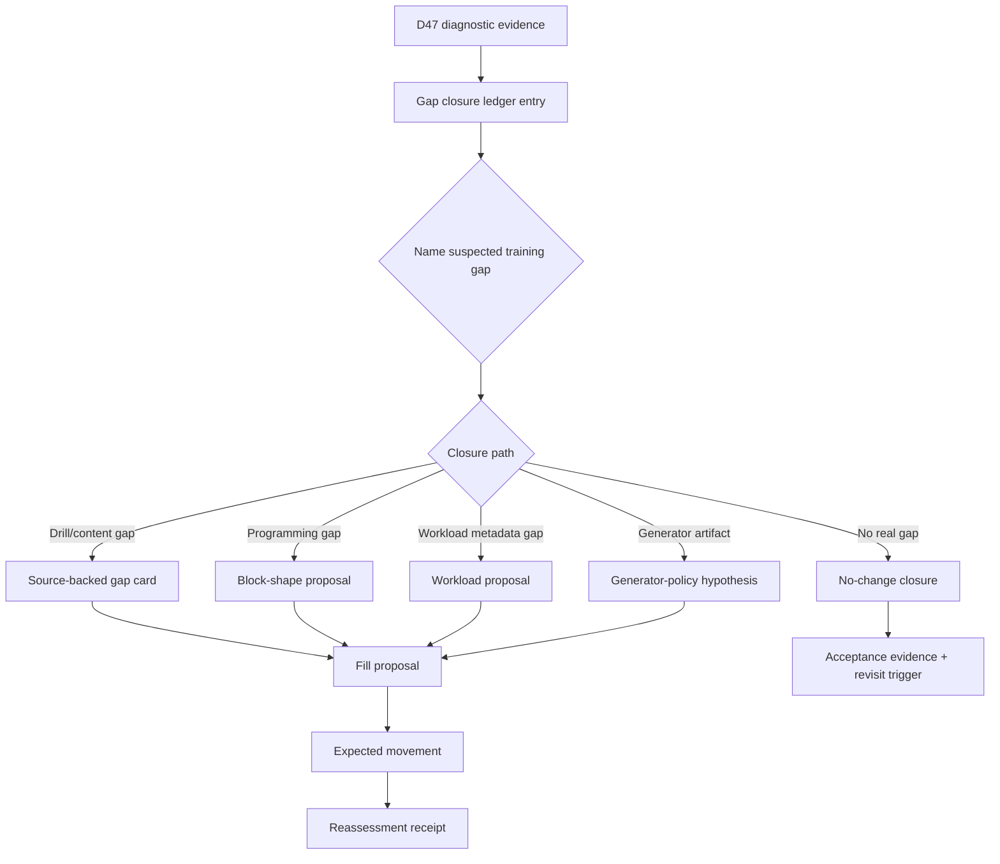

# Generated Diagnostics D47 Gap Closure Ledger Requirements

## Problem Frame

Generated-plan diagnostics are now good at surfacing routeable evidence, but the product goal is larger: determine real drill and programming gaps, fill those gaps concretely, and verify that the fill improved the training system.

The current D47 ticket for `d47` / `d47-solo-open` proves the gap between evidence and action. It identifies a mixed-pressure candidate but still has missing proposal facts: concrete delta, evidence basis, falsification condition, expected diagnostic movement, product/training-quality hypothesis, and no-action threshold.

D47 refers to the generated diagnostic group for drill `d47`; `d47-solo-open` is the pilot drill/variant row in the generated triage workbench. The stable diagnostic group key remains the receipt identity for this pilot.

This addendum defines a D47-piloted gap closure ledger. The ledger should make the primary object the suspected training gap and its closure state, not the diagnostic row. It should route D47 toward one of the real closure paths: drill/content inventory fill, programming/block-shape change, workload metadata review, generator-policy hypothesis, evidence-gathering hold, or no-change closure.

Prose requirements govern if the diagram and text ever disagree.

---

## Actors

- A1. Maintainer: Decides whether D47 represents a real training gap and which closure path is admissible.
- A2. Gap author: Writes the gap ledger entry, evidence shopping list, proposed fill path, and reassessment expectation.
- A3. Source researcher: Supplies source-backed evidence when the closure path claims a drill/content inventory gap.
- A4. Agent planner: Plans implementation only after the ledger entry identifies a concrete fill path and does not invent missing product facts.
- A5. Reviewer: Checks that the ledger separates evidence from authorization and keeps no-change, generator-policy, and source-backed paths distinct.

---

## Key Flows

- F1. D47 evidence becomes a gap ledger entry
  - **Trigger:** The D47 proposal-admission ticket remains in `evidence_gathering`.
  - **Actors:** A1, A2, A5
  - **Steps:** The gap author records D47 identity, receipt facts, suspected training gap, closure path, missing evidence, and no-change threshold.
  - **Outcome:** D47 is no longer just a diagnostic candidate; it is a reviewable suspected gap with a closure state.
  - **Covered by:** R1, R2, R3, R4, R5
- F2. The ledger chooses a concrete fill path
  - **Trigger:** Maintainer wants to move D47 toward actual gap filling.
  - **Actors:** A1, A2, A3, A5
  - **Steps:** The entry distinguishes drill/content inventory, programming/block-shape, workload metadata, generator-policy, and no-change paths; each path names required evidence and what implementation would later change. Because D47 has mixed causality, the entry records separate subclaims for pressure that disappears under the counterfactual, pressure that remains, and non-redistribution pressure.
  - **Outcome:** Planning can target the right kind of fill instead of building generic preview tooling.
  - **Covered by:** R6, R7, R8, R9, R10, R11, R12
- F3. A fill is reassessed after implementation
  - **Trigger:** A later plan fills a ledger-backed gap through a source-backed card, workload/block proposal, or generator-policy change.
  - **Actors:** A1, A2, A4, A5
  - **Steps:** The entry records expected movement before implementation, actual movement after regeneration, and whether training-quality/no-action thresholds were met.
  - **Outcome:** The workflow proves whether the concrete fill closed the gap.
  - **Covered by:** R18, R19, R20, R21

---

## Requirements

**Ledger identity and gap claim**

- R1. The ledger entry should identify D47 by stable group key, drill ID, variant ID, block type, route context, and the current receipt facts from the generated triage workbench.
- R2. The entry should state a suspected training gap in product language, not only diagnostic language.
- R3. The suspected gap should explicitly distinguish "real training-system gap" from "diagnostic evidence that might not require change."
- R4. The entry should separate three concepts instead of overloading one status field: `gap_type` (`drill_inventory_gap`, `programming_shape_gap`, `workload_metadata_gap`, `generator_policy_artifact`, `no_real_gap`, or `undetermined`), `decision_state` (`evidence_gathering`, `primary_fill_path_selected`, `no_change_closed`, `abandoned_for_better_candidate`, `fill_planned`, `fill_applied_reassessment_pending`, or `closed_validated`), and `authorization_status` (`not_authorized`, `ready_for_planning`, `authorized_for_fill_plan`, or `closed_without_fill`).
- R5. The entry should preserve D47 as the first pilot case without requiring a generic ledger for every diagnostic group before value is proven.
- R6. The entry should include D47 receipt currentness: diagnostic fingerprint or equivalent freshness marker, validation command, and explicit behavior when the current D47 group is missing, superseded, or stale.

**Closure paths**

- R7. A `drill_inventory_gap` path should require a source-backed gap card before catalog content, source-backed instructions, or variants are added.
- R8. A `drill_inventory_gap` path should first cite the existing D47 activation manifest or source references, then state the new content-depth delta not covered by that provenance.
- R9. A `programming_shape_gap` path should name the block or session-shape deficiency it believes is causing weak programming.
- R10. A `workload_metadata_gap` path should name the workload envelope fact under review and cite the workload-envelope guide basis for changing or not changing it.
- R11. A `generator_policy_artifact` path should name the generator-policy hypothesis and keep it separate from catalog or workload metadata changes.
- R12. A `no_change` path should cite a specific policy allowance, negative evidence, or harmless diagnostic segment; it should also state acceptance evidence, a no-action threshold, and a revisit trigger.
- R13. A ledger entry should be allowed to stay in `evidence_gathering` when the diagnostic candidate is credible but the closure path is not yet justified.
- R14. `evidence_gathering` should always name exactly one next artifact, owner, evidence source or command, promotion criteria, and abandon/no-change criteria.
- R15. Every closure path should name the smallest concrete next artifact that would move it toward an actual fill: source-backed gap card, workload proposal, block-shape proposal, generator-policy hypothesis, no-change receipt, or bounded evidence shopping list.
- R16. The D47 ledger should be segment-aware: pressure-disappears cells, pressure-remains cells, and non-redistribution pressure should each have a disposition or explicit reason they share a disposition.

**Evidence and fill readiness**

- R17. The D47 ledger entry should include an evidence shopping list for any missing facts: concrete delta, evidence basis, falsification condition, expected movement, training-quality hypothesis, and no-action threshold.
- R18. Fill readiness should be derived from a checklist of missing facts, target surface, evidence basis, and next artifact; a separate persisted fill-readiness state should be added only if planning proves U6 and non-U6 workflows need different machine-readable gates.
- R19. The entry should not become fill-ready until it names the target surface that would eventually change and the evidence needed to justify that change.
- R20. If the proposed fill requires source-backed content, the entry should require source references and adaptation rationale before activation planning.
- R21. If the proposed fill does not require source-backed content, the entry should say why source evidence is not needed.
- R22. The first D47 pass should end in exactly one pilot exit: `primary_fill_path_selected`, `no_change_closed`, or `abandoned_for_better_candidate`.
- R23. The first D47 pass should compare D47 against one simpler or higher-confidence candidate, or against a no-change baseline, and name the condition that would abandon D47 as the pilot.

**Reassessment and loop closure**

- R24. Before any fill is planned, the entry should state expected diagnostic movement and expected training-quality movement.
- R25. Training-quality movement should cite an allowed evidence source or explicitly mark it as not assessed in the receipt; allowed sources include source-rationale review, founder-use/dogfood note, manual session-fit receipt, workload honesty, block-shape coherence, or product copy/rationale review.
- R26. After a future fill lands, the entry should support a reassessment receipt comparing expected movement to actual regenerated diagnostics.
- R27. A reassessment receipt should keep `reassessment_result` separate from `decision_state`, using `validated`, `partially_validated`, `regressed`, or `inconclusive`.
- R28. A reassessment receipt should distinguish diagnostic validation from training-quality validation.
- R29. The ledger should record when no further action is justified so diagnostics do not remain an endless unresolved backlog.

**Scope and safety**

- R30. The first D47 ledger entry should be a minimal extension of the existing generated triage workbench and D47 admission surface unless planning proves a specific blocker.
- R31. The D47 gap closure ledger should not authorize direct edits to `app/src/data/drills.ts`, workload metadata, source-backed content, or runtime `buildDraft()` behavior.
- R32. The ledger should not build U6 preview tooling; it should produce the concrete proposal quality that makes U6 worth planning later.
- R33. The ledger should make it easy for a planner to choose the next workflow: source-backed gap-card brainstorm, workload/block-shape proposal, generator-policy investigation, no-change closure, or U6 preview planning when fill-ready.

---

## Acceptance Examples

- AE1. **Covers R1, R2, R3, R4, R6.** Given the current D47 ticket, when the ledger entry is created, it records the stable group key and receipt facts but also states the suspected training gap in product language and keeps freshness visible.
- AE2. **Covers R7, R8, R15, R20.** Given the ledger claims D47 lacks source-backed drill/content depth, when a planner reads it, the next artifact is a source-backed gap card that reuses existing D47 provenance before proposing new catalog content.
- AE3. **Covers R9, R10, R15, R21.** Given the ledger claims the gap is programming shape or workload metadata, when a planner reads it, the next artifact is a workload/block proposal with guide-based rationale, not source-backed content work.
- AE4. **Covers R11, R16.** Given D47 pressure partly disappears under the counterfactual while other pressure remains, when the ledger routes work, generator-policy evidence remains segment-aware and separate from drill/content and workload paths.
- AE5. **Covers R12, R29.** Given no-change is the best-supported outcome, when the ledger is closed, it records acceptance evidence, no-action threshold, and revisit trigger instead of staying unresolved.
- AE6. **Covers R24, R25, R26, R27, R28.** Given a future fill is applied, when diagnostics are regenerated, the ledger can compare expected and actual movement while separating diagnostic validation from training-quality validation.
- AE7. **Covers R13, R14, R15, R22, R23.** Given the D47 ledger remains evidence-gathering, when planning is requested, it must name one bounded next artifact and pilot exit instead of becoming generic research.
- AE8. **Covers R30, R31, R32, R33.** Given a planner wants to build U6 preview tooling, when the D47 ledger is not fill-ready, planning is redirected to the minimal existing workbench extension and fill-path definition rather than generic preview implementation.

---

## Success Criteria

- A maintainer can tell what real D47 training gap is suspected, what evidence is missing, and what concrete fill path would be next.
- The first D47 pass exits with exactly one result: primary fill path selected, no-change closed, or D47 abandoned for a better candidate.
- A planner can start the next workflow without inventing whether D47 needs drill inventory, programming shape, workload metadata, generator-policy, or no-change work.
- The workflow moves diagnostics toward concrete fills while preserving the existing evidence-before-authorization boundary.
- A future fill can be reassessed against expected diagnostic and training-quality movement.

---

## Scope Boundaries

- Do not edit the drill catalog, source-backed instructions, workload metadata, or generator behavior in this brainstorm.
- Do not build U6 preview tooling yet.
- Do not convert every current diagnostic group into a ledger entry before proving the D47 pilot.
- Do not assume every diagnostic observation is a real training gap.
- Do not require source-backed evidence for closure paths that are explicitly not content/inventory changes.
- Do not let no-change decisions bypass evidence; no-change is a closure path, not a disappearance path.
- Do not mark no-change as `closed_validated` while any D47 evidence segment lacks a disposition.

---

## Key Decisions

- D47 is the pilot, but not at all costs: It has mixed evidence and non-redistribution pressure, so it tests whether the workflow can handle ambiguous but important candidates; abandon it if the first pass cannot name causal warrant, product impact, and a likely closure path better than a simpler candidate.
- Gap closure, not proposal admission, is the product framing: Admission is a gate; closure is the end-to-end capability.
- Reassessment is part of the requirement: The system should eventually prove whether concrete fills worked.
- No-change is valid but must be evidenced: The goal is better training quality, not maximizing edits.
- Keep implementation deferred: The brainstorm defines the artifact and product behavior; planning should decide where it lives technically.

---

## Dependencies / Assumptions

- The current D47 admission ticket in `docs/reviews/2026-05-01-generated-plan-diagnostics-triage.md` is fresh.
- `docs/ops/workload-envelope-authoring-guide.md` remains the policy source for workload and block-shape interpretation.
- `docs/reviews/2026-04-30-focus-coverage-gap-cards.md` remains the source-backed activation precedent for drill/content fills.
- U6 preview planning remains deferred until the ledger entry is fill-ready enough to compare current and candidate outcomes.

---

## Outstanding Questions

### Deferred to Planning

- [Affects R4, R18, R30][Technical] Should the first ledger entry be generated into the existing triage workbench, captured as a small durable review doc, or represented as machine-readable proposal data?
- [Affects R2, R24, R25][Needs research] What D47 training-quality hypothesis is best supported by current sources and dogfood context?
- [Affects R7, R8, R20][Needs research] If D47 becomes a drill/content inventory gap, which existing D47 source references are sufficient and what new content-depth delta remains?
- [Affects R26, R27, R28][Technical] Which regenerated diagnostics should the reassessment receipt compare first: affected-cell counts, group state, route changes, readiness movement, or all of them?

---

## Next Steps

-> `/ce-doc-review` this requirements addendum, then `/ce-plan` the D47 gap closure ledger only after review fixes are applied.
