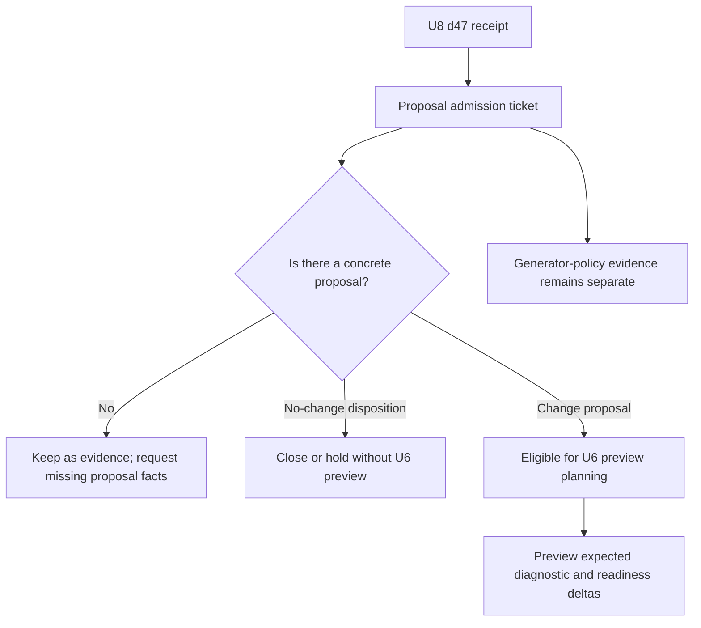

# Generated Diagnostics D47 U6 Proposal Admission Requirements

## Problem Frame

U8 turned the generator redistribution lane into a repeatable causality receipt. The strongest first proposal candidate is `gpdg:v1:d47:d47-solo-open:main_skill:true:optional_slot_redistribution+over_authored_max+over_fatigue_cap`, which maps to `d47` / `d47-solo-open` (Four Great Sets / Solo open).

The receipt makes this candidate useful but not yet actionable. It has mixed evidence: 30 affected cells, 12 cells where pressure disappears under the `allocated_duration_counterfactual`, 18 cells where pressure remains, and 6 non-redistribution pressure cells. That means a proposal could involve workload envelope review, block-shape review, source-backed content work, future U6 preview admission, and separate generator-policy evidence.

This addendum defines the admission ticket needed before U6 preview planning begins. It should turn the receipt-backed candidate into a concrete, reviewable proposal package without deciding the fix, editing the catalog, changing workload metadata, or building preview tooling prematurely.

Prose requirements govern if the diagram and text ever disagree.

---

## Actors

- A1. Maintainer: Decides whether the d47 receipt evidence is concrete enough to proceed toward U6 preview planning.
- A2. Proposal author: Writes the candidate package with affected group keys, proposed deltas, source evidence, and expected diagnostic movement.
- A3. Agent planner: Plans the D47 admission ticket first, then uses an admitted ticket to plan U6 preview work without inventing proposal facts.
- A4. Reviewer: Checks that the ticket preserves diagnostic boundaries and does not authorize catalog or generator changes.

---

## Key Flows

- F1. D47 candidate becomes an admission ticket
  - **Trigger:** U8 receipt identifies `d47-solo-open` as `pressure_remains_without_redistribution`.
  - **Actors:** A1, A2, A4
  - **Steps:** The proposal author records the stable group key, drill/variant IDs, receipt counts, proposed delta options, source evidence status, expected diagnostic movement, and explicit non-goals.
  - **Outcome:** The candidate is either concrete enough for U6 planning or clearly missing required evidence.
  - **Covered by:** R1, R2, R3, R4, R5, R6
- F2. Mixed evidence stays split
  - **Trigger:** The d47 ticket includes both pressure-disappears and pressure-remains evidence.
  - **Actors:** A1, A2, A3
  - **Steps:** The ticket separates generator-policy evidence from remaining workload/block/source-backed pressure; each track gets its own proposed next action.
  - **Outcome:** Planning does not collapse mixed evidence into one fix path.
  - **Covered by:** R7, R8, R9, R10, R11, R16
- F3. U6 preview remains gated
  - **Trigger:** A maintainer wants to plan U6 preview tooling.
  - **Actors:** A1, A3, A4
  - **Steps:** The admission ticket is checked for stable/current candidate identity, concrete candidate deltas, source/evidence status, expected movement, and verification commands before preview planning begins.
  - **Outcome:** U6 preview work starts from a concrete candidate proposal instead of generic tooling.
  - **Covered by:** R12, R13, R14, R15, R17, R18, R19, R20

---

## Requirements

**Admission identity**

- R1. The admission ticket should identify the candidate by stable diagnostic group key, drill ID, variant ID, block type, and route context.
- R2. The ticket should quote the current U8 receipt facts for `d47-solo-open`: total affected cells, pressure-disappears cells, pressure-remains cells, non-redistribution pressure cells, incomplete-evidence state, and follow-up routes.
- R3. The ticket should preserve `d47` / `d47-solo-open` as the candidate identity across brainstorm, plan, preview, and later review artifacts.

**Proposal package**

- R4. The ticket should require a concrete proposed delta before U6 preview planning starts.
- R5. A proposed delta should name the changed catalog or metadata surface it intends to evaluate, such as workload envelope, block shape, source-backed content depth, or no-change policy disposition.
- R6. The ticket should record whether source-backed evidence is present, missing, or not needed for the proposed delta.
- R7. The ticket should state expected diagnostic movement before preview: which counts or groups should improve, remain, regress, or become inconclusive if the proposal is valid.
- R8. The ticket should include the minimum verification commands or generated artifacts a planner must use after preview implementation.

**Mixed evidence handling**

- R9. The ticket should separate pressure that disappears under the allocated-duration counterfactual from pressure that remains without redistribution.
- R10. Generator-policy evidence should stay separate from workload, block-shape, and source-backed proposal work.
- R11. Non-redistribution pressure should be visible as its own reason to consider workload or block-shape review.

**Admission safeguards**

- R12. Each proposed delta should include the evidence basis that ties the delta to the observed pressure and a falsification condition that would keep it out of U6 preview planning.
- R13. The ticket should include a product or training-quality impact hypothesis for the d47 pressure and a no-action threshold that explains what evidence would make no change the correct outcome.
- R14. The ticket should compare d47 against at least one simpler or higher-confidence alternative and state what would cause maintainers to abandon d47 as the first admission case.
- R15. Planning should first check whether an existing generated triage, review, gap-card, or workload-guide surface can host the d47 admission package with a small extension before creating a standalone artifact.
- R16. Counterfactual-only pressure should remain diagnostic evidence until a policy-admissible generator hypothesis is named, and the ticket may explicitly defer generator-policy work.
- R17. A no-change disposition should define its own acceptance evidence and may close or hold the ticket without U6 preview unless preview would test a specific no-change claim.

**Scope and gating**

- R18. The ticket should not authorize catalog edits, workload metadata edits, source-backed activation, or runtime `buildDraft()` generator changes.
- R19. U6 preview planning should be allowed only when the ticket has enough proposal detail for preview to compare current and candidate diagnostic outcomes.
- R20. If required proposal facts are missing, the ticket should remain in an evidence-gathering state rather than becoming U6 implementation work.
- R21. The ticket should be reusable for future receipt-backed candidates, but d47 should remain the first concrete case and should not force a generic framework before it proves the shape.

---

## Acceptance Examples

- AE1. **Covers R1, R2, R3.** Given the current d47 U8 receipt, when the admission ticket is created, it records the stable group key, `d47`, `d47-solo-open`, and the receipt counts needed to understand the candidate.
- AE2. **Covers R4, R5, R7, R19.** Given a proposal only says "fix d47", when admission is checked, the ticket remains not preview-ready because no concrete delta or expected diagnostic movement is named.
- AE3. **Covers R6, R18.** Given a proposal requires source-backed content depth, when the ticket is read, it marks source evidence as required and does not authorize catalog activation.
- AE4. **Covers R9, R10, R11.** Given d47 has both pressure-disappears and pressure-remains cells, when the ticket routes next work, generator-policy evidence stays separate from workload/block/source-backed proposal work.
- AE5. **Covers R12, R19, R20.** Given d47 lacks enough proposal facts or causal warrant, when planning is requested, the ticket asks for evidence or candidate-delta detail instead of starting generic U6 preview tooling.
- AE6. **Covers R13, R17.** Given the ticket's best-supported disposition is no change, when the maintainer reviews it, the ticket records the no-action threshold and can close or hold without U6 preview unless preview would test a specific no-change claim.
- AE7. **Covers R14, R15, R21.** Given d47 is the first candidate, when the admission artifact is selected, the ticket compares d47 against a simpler alternative and checks existing surfaces before creating a new reusable artifact shape.

---

## Success Criteria

- A maintainer can tell whether `d47-solo-open` is ready for U6 preview planning without reading the full generated diagnostics report.
- A planner can start `/ce-plan` for the D47 admission ticket without inventing the candidate identity, proposal shape, expected movement, or scope boundaries.
- The ticket keeps U8's diagnostic-only boundary intact and avoids turning receipt evidence into direct catalog or generator changes.
- The admission shape is reusable for later receipt-backed groups if d47 proves it useful.

---

## Scope Boundaries

- Do not edit `app/src/data/drills.ts`.
- Do not change `durationMinMinutes`, `durationMaxMinutes`, `fatigueCap.maxMinutes`, courtside instructions, or source-backed content in this brainstorm.
- Do not build U6 preview tooling yet.
- Do not decide whether the eventual d47 proposal should be workload metadata, block-shape, content-depth, generator-policy, or no action.
- Do not treat the allocated-duration counterfactual as a valid runtime generator policy.
- Do not broaden this into a generic maintainer queue or diagnostics compatibility matrix.

---

## Key Decisions

- Start with `d47-solo-open`: It is the strongest first candidate because it has mixed U8 evidence and non-redistribution pressure, making it a better admission test than a purely redistribution-caused group.
- Admission before preview: U6 should not be planned as generic tooling until a candidate proposal names concrete deltas and expected diagnostic movement.
- Split mixed evidence: The admission ticket should preserve generator-policy, workload, block-shape, and source-backed tracks instead of choosing one prematurely.
- D47 versus simpler alternatives: d47 is worth trying first because it stress-tests mixed evidence and non-redistribution pressure; if the ticket cannot name causal warrant, product impact, or an admissible proposal path, maintainers should abandon it as the first case and choose a simpler high-confidence group or a no-change disposition.
- Reusable but not generic-first: The ticket should be structured enough to reuse, but the d47 case should drive the first shape.

---

## Dependencies / Assumptions

- The U8 receipt in `docs/reviews/2026-05-01-generated-plan-diagnostics-triage.md` is current and validated by `npm run diagnostics:report:check`.
- U7 workload guidance remains the policy reference for workload envelope interpretation.
- Source-backed catalog activation rules still apply before any content or catalog change.
- U6 preview planning will decide implementation details for candidate-catalog comparison; this brainstorm only defines admission requirements.

---

## Outstanding Questions

### Deferred to Planning

- [Affects R4-R8][Technical] What exact document or generated artifact should represent the first d47 admission ticket: a durable review doc, a generated section, or a small machine-readable proposal file?
- [Affects R7, R8, R19][Technical] Which diagnostic deltas should U6 preview compute first for d47: status counts, observation counts, affected group changes, readiness audit movement, or all of these?
- [Affects R5, R6][Needs research] What source evidence is sufficient to evaluate whether Four Great Sets needs workload envelope, block-shape, or content-depth changes?

---

## Next Steps

-> `/ce-plan` for the D47 U6 proposal admission ticket only. U6 preview planning should wait until the admission ticket satisfies the gate above.
