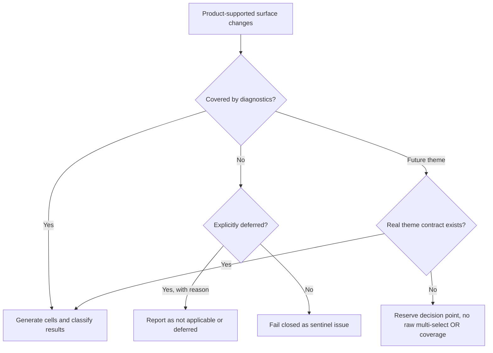

# Generated Diagnostics Dynamic Surface Sentinel Requirements

## Problem Frame

The generated-plan diagnostics matrix already expands from supported readiness dimensions, preserves explicit `not_applicable` cells, and hard-fails unsupported duration fixtures. U5 should not pretend that surface expansion is absent. The remaining gap is a stronger sentinel contract: when the product-supported diagnostic surface changes, new dimensions must enter diagnostics, be explicitly deferred with reasons, or stay blocked behind a real future contract.

The risk is silent drift. A future visible focus, setup configuration, duration, player level, or curated theme could become user-visible without matching generated-plan diagnostics coverage. That would make the current report look healthy while a newly supported surface bypasses the quality gate.

Prose requirements govern if the diagram and text ever disagree.

---

## Actors

- A1. Maintainer: Decides when a focus, setup, duration, level, or theme is product-supported enough to require diagnostics coverage.
- A2. Agent implementer: Builds the sentinel and keeps it narrow, deterministic, and tied to product-supported surfaces.
- A3. Reviewer: Checks whether a future surface change has generated-plan diagnostic evidence or an explicit deferral reason.

---

## Key Flows

- F1. New supported dimension enters diagnostics
  - **Trigger:** A product-supported focus, setup configuration, duration, or level is added or widened.
  - **Actors:** A1, A2, A3
  - **Steps:** The surface contract includes the new dimension; generated-plan diagnostics produce cells; unsupported generation becomes hard failure or explicit deferral; the generated report exposes the changed surface.
  - **Outcome:** The new surface cannot ship while invisible to diagnostics.
  - **Covered by:** R1, R2, R3, R6, R9
- F2. Product-deferred dimension is intentionally excluded
  - **Trigger:** A dimension exists in product or code vocabulary but is not yet supported by Tune today generated diagnostics.
  - **Actors:** A1, A2, A3
  - **Steps:** The dimension receives an explicit deferred or `not_applicable` reason; the reason appears in the generated surface summary; validation rejects silent omission.
  - **Outcome:** Deferral is visible and reviewable instead of implicit.
  - **Covered by:** R4, R5, R6, R10
- F3. Future curated theme is reserved without fake coverage
  - **Trigger:** A future mixed-focus or curated theme is discussed, planned, or added to adjacent docs.
  - **Actors:** A1, A2, A3
  - **Steps:** U5 records that themes require a concrete theme contract before diagnostics can claim coverage; raw multi-select OR behavior is not accepted as theme coverage; validation can reserve the decision point without forcing a current theme matrix.
  - **Outcome:** The repo is future-ready for themes without pretending themes are implemented.
  - **Covered by:** R7, R8, R11, R12

---

## Requirements

**Surface contract**

- R1. U5 should define the product-supported generated diagnostics surface as a deliberate contract, not merely a convenience list inside tests.
- R2. The contract should cover the currently supported single-focus Tune today dimensions: visible focus, setup configuration, player level, fixed duration, and deterministic seeds.
- R3. When a product-supported visible focus, setup configuration, level, or duration is added or widened, generated-plan diagnostics should either produce cells for that surface or fail closed.
- R4. A dimension may be excluded only through an explicit state that is visible in generated diagnostics output: `included`, `reserved_future`, `pre_activation_deferred`, or `unsupported_user_visible`.
- R5. Deferral reasons should be specific enough for review: they should name the dimension/value, why it is outside the current diagnostic run, the authority or boundary behind that decision, and the trigger for revisiting it.
- R6. Once a dimension is user-visible in Tune today or default generation, reason-only deferral should not be enough; it should either generate diagnostics or fail as `unsupported_user_visible`.

**Sentinel behavior**

- R7. U5 should validate that the generated surface summary and generated report account for included, applicable, and explicitly deferred cells.
- R8. Sentinel tests should be synthetic and clearly marked as sentinel tests; they should not activate new product-visible focuses, catalog content, or user-facing theme behavior.
- R9. The sentinel should fail on silent omission, unknown surface state, current-baseline surface shrinkage, or a newly supported dimension with neither generated cells nor a valid pre-activation deferral state.
- R10. Existing known observation groups should remain governed by triage and compression rules; U5 should not convert current routeable observations into hard failures merely because the surface contract became stricter.
- R11. The generated report should preserve enough surface-summary evidence for a reviewer to see whether the matrix changed after U5, including exact seed IDs rather than only seed count.

**Theme reservation**

- R12. U5 should reserve a decision point for future curated theme contracts without treating raw multi-select focus OR behavior as theme coverage.
- R13. A future theme should require a concrete contract before generated diagnostics can claim coverage, including at minimum a theme identity, supported setup/level/duration cells, and expected focused-slot behavior.
- R14. Until a real theme contract exists, theme-related diagnostics should be documented as a negative guardrail or reservation note, not included in the current single-focus matrix and not modeled as a durable theme registry.

**Workflow linkage**

- R15. The U5 requirements should link back to the broad R3 dynamic-surface requirement and forward to planning without requiring U6 impact preview or U8 redistribution comparison first.
- R16. The outcome of U5 should make future catalog, focus, or theme work easier to review by making diagnostic surface changes explicit in generated artifacts or validation output.

---

## Acceptance Examples

- AE1. **Covers R1, R2, R3, R7.** Given a product-supported duration is added to the generated diagnostics surface, when diagnostics run, the new duration produces generated cells or hard-fails because no draft can be built.
- AE2. **Covers R3, R6, R9, R10.** Given a product-supported visible focus is added without generated diagnostics coverage or a valid non-user-visible deferral state, when validation runs, U5 fails on silent omission without reclassifying current known observation groups as hard failures.
- AE3. **Covers R4, R5, R11.** Given a dimension is intentionally deferred, when the report is generated, the output includes the deferred or `not_applicable` reason in the surface evidence.
- AE4. **Covers R8.** Given a sentinel fixture uses a synthetic surface expansion, when a reviewer reads the test or generated artifact, it is clear the fixture proves sentinel behavior and does not activate product scope.
- AE5. **Covers R12, R13, R14.** Given a future curated theme is discussed but no theme contract exists, when U5 runs, diagnostics reserve or defer the theme decision instead of claiming coverage through raw multi-select focus OR logic.
- AE6. **Covers R15, R16.** Given a later catalog or focus change is proposed, when reviewers inspect diagnostics, they can tell whether the supported surface changed and whether that change is covered or explicitly deferred.

---

## Success Criteria

- A maintainer can add or widen a supported generated diagnostics dimension only by making coverage or deferral explicit.
- A reviewer can distinguish supported, applicable, deferred, and reserved surfaces without reading every diagnostic row.
- Future theme work cannot accidentally claim diagnostics coverage through raw multi-select OR behavior.
- Current-baseline surface shrinkage and seed replacement cannot make diagnostics look healthier by changing the same constants that define the generated matrix.
- Downstream planning does not need to invent U5's product boundary, theme boundary, or success criteria.

---

## Scope Boundaries

- Do not add a new product-visible focus, setup, duration, level, or theme as part of U5.
- Do not add catalog drills, variants, tags, caps, or source-backed content.
- Do not change runtime session generation behavior.
- Do not build U6 catalog change impact preview.
- Do not build U8 redistribution comparison.
- Do not require every future possible `SkillFocus` value to become a generated diagnostics cell; U5 follows product-supported surfaces, not raw type membership.
- Do not claim curated theme readiness until a concrete theme contract exists.

---

## Key Decisions

- Build the balanced slice: U5 should cover the surface contract, change guard, and theme reservation as far as each is useful for a small MVP.
- Treat U5 as a sentinel, not a product expansion: synthetic tests may prove guard behavior but must not activate new user-visible scope.
- Keep current observation policy intact: U5 protects surface coverage drift; U1-U4 and U7 still own observation triage and decision routing.
- Reserve themes explicitly as a negative guardrail: the repo should be ready to reject false theme coverage without pretending a theme matrix or theme registry exists today.

---

## Dependencies / Assumptions

- Current generated-plan diagnostics already use supported readiness dimensions and deterministic seeds.
- Current generated-plan diagnostics already preserve `not_applicable` cells in matrix summaries.
- The broad R3 requirement in `docs/brainstorms/2026-05-01-generated-plan-diagnostics-next-steps-requirements.md` remains the parent requirement for U5.
- `docs/plans/2026-05-01-002-feat-generated-diagnostics-triage-workflow-plan.md` remains the active implementation plan for sequencing U5 after U4 and U7.

---

## Outstanding Questions

### Deferred to Planning

- [Affects R1-R7][Technical] What is the smallest named contract/helper that can keep included values, deferred values, and reserved theme notes separate without duplicating the matrix source?
- [Affects R4-R7][Technical] Should deferred surfaces reuse the existing `not_applicable` language in report output, or use a separate surface-level status vocabulary?
- [Affects R12-R14][Technical] What is the smallest diagnostics-only theme reservation note that avoids creating fake theme coverage?

---

## Next Steps

-> `/ce-plan` for U5 dynamic surface and new-focus sentinel.