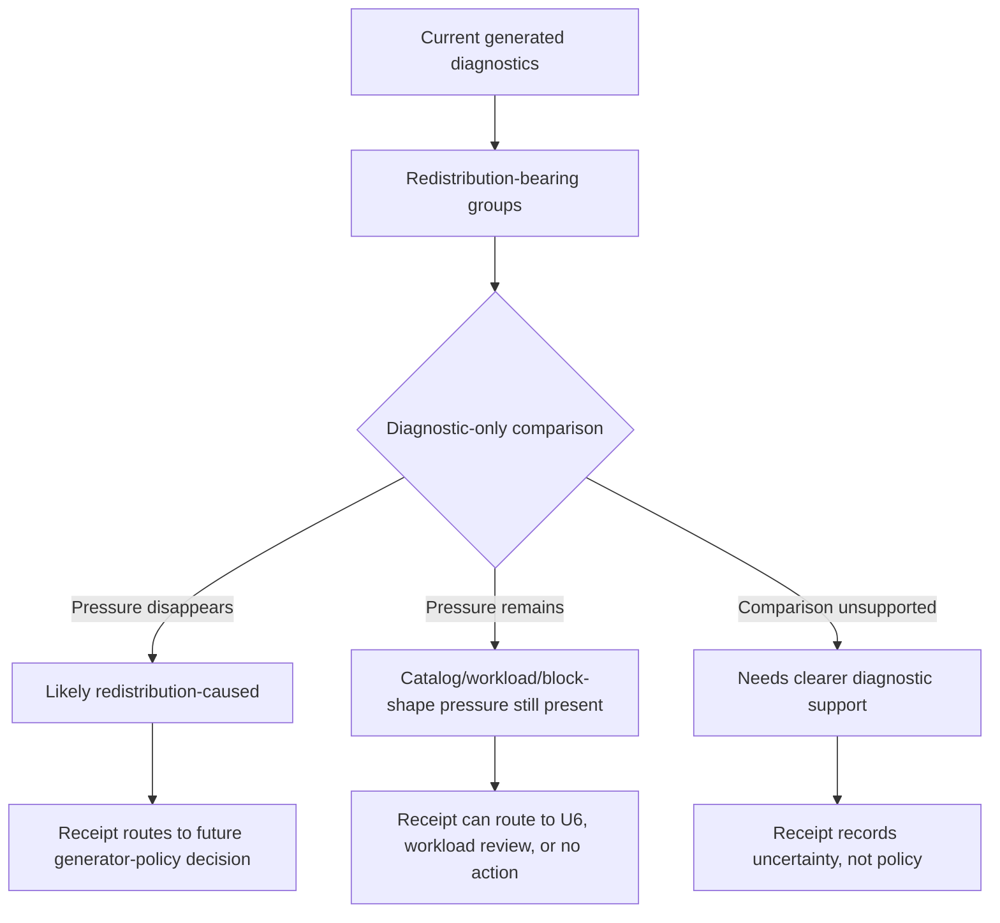

---

## id: generated-diagnostics-redistribution-causality-receipt-requirements-2026-05-02
title: "Generated Diagnostics Redistribution Causality Receipt Requirements"
status: active
stage: validation
type: requirements
summary: "Focused U8 requirements addendum for a repeatable diagnostic-only redistribution causality receipt that separates optional-slot redistribution pressure from catalog, workload, and block-shape pressure without changing runtime generation."
authority: "Requirements addendum for U8 redistribution comparison diagnostics; does not authorize runtime generator policy changes, catalog edits, workload metadata edits, or U6 catalog impact preview tooling."
last_updated: 2026-05-02
depends_on:
  - docs/brainstorms/2026-05-01-generated-plan-diagnostics-next-steps-requirements.md
  - docs/brainstorms/2026-05-01-generated-diagnostics-decision-debt-compression-requirements.md
  - docs/brainstorms/2026-05-01-generated-diagnostics-workload-envelope-guidance-requirements.md
  - docs/ideation/2026-05-01-generated-plan-diagnostics-next-steps-ideation.md
  - docs/plans/2026-05-01-002-feat-generated-diagnostics-triage-workflow-plan.md
  - docs/reviews/2026-05-01-generated-plan-diagnostics-triage.md
  - app/src/domain/generatedPlanDiagnostics.ts
  - app/src/domain/sessionBuilder.ts

# Generated Diagnostics Redistribution Causality Receipt Requirements

## Problem Frame

The generated diagnostics triage workflow now has stable observation identity, triage coverage, decision-debt compression, workload-envelope guidance, and a dynamic surface sentinel. The largest remaining evidence gap is the `generator_policy_investigation` lane: 21 routeable groups, 251 total affected cells, and 236 redistribution-affected cells currently ask whether optional-slot redistribution is causing workload-envelope pressure.

U8 should not be a one-off analysis. It should build a repeatable diagnostic-only capability that can run whenever the generated report is refreshed. The output should help maintainers distinguish redistribution-caused pressure from pressure that remains under a no-redistribution or isolated-redistribution comparison, without changing shipped `buildDraft()` behavior or deciding generator policy.

Prose requirements govern if the diagram and text ever disagree.

---

## Actors

- A1. Maintainer: Decides whether redistribution evidence warrants future generator-policy work, U6 proposal work, workload review, or no implementation action.
- A2. Agent implementer: Builds the repeatable diagnostic receipt while preserving the runtime generator boundary.
- A3. Reviewer: Checks whether the receipt is evidence-backed, deterministic, and scoped to diagnostics rather than policy changes.

---

## Key Flows

- F1. Redistribution-heavy group receives causality evidence
  - **Trigger:** The generated triage workbench contains a `generator_policy_investigation` prompt.
  - **Actors:** A1, A2, A3
  - **Steps:** U8 identifies redistribution-bearing affected cells; runs or derives a diagnostic-only comparison; separates cells whose pressure disappears from cells whose pressure remains; emits a receipt with group-level and aggregate counts.
  - **Outcome:** Maintainers can tell whether redistribution is likely the primary cause for each group.
  - **Covered by:** R1, R2, R3, R4, R5, R9
- F2. Comparison remains diagnostic-only
  - **Trigger:** A comparison suggests that a no-redistribution or isolated-redistribution strategy would reduce pressure.
  - **Actors:** A1, A2, A3
  - **Steps:** U8 records the comparison as evidence; the output explicitly states that shipped `buildDraft()` behavior is unchanged; any generator-policy change remains future work.
  - **Outcome:** U8 informs policy without silently shipping policy.
  - **Covered by:** R6, R7, R8, R11, R12
- F3. Non-redistribution pressure is routed elsewhere
  - **Trigger:** A group remains over cap, over fatigue cap, or under minimum even without redistribution effects.
  - **Actors:** A1, A3
  - **Steps:** U8 labels the remaining pressure separately and routes the next question to workload guidance, U6 proposal work, or no implementation action.
  - **Outcome:** Catalog/workload decisions are not hidden inside a generator-policy lane.
  - **Covered by:** R4, R9, R10, R13

---

## Requirements

**Repeatable causality receipt**

- R1. U8 should produce a repeatable redistribution causality receipt from generated diagnostics, not a one-off manually interpreted analysis.
- R2. The receipt should start from the current `generator_policy_investigation` compression lane and preserve stable group-key traceability.
- R3. For each redistribution-bearing group, the receipt should report total affected cells, redistribution-affected cells, and non-redistribution over-cap or under-minimum cells separately.
- R4. The receipt should distinguish at least three outcomes: `likely_redistribution_caused`, `pressure_remains_without_redistribution`, and `comparison_inconclusive`.
- R5. The receipt should include aggregate totals across the redistribution lane so maintainers can see whether the lane is mostly generator-policy evidence or mixed evidence.

**Diagnostic-only comparison**

- R6. U8 should not change shipped `buildDraft()` behavior, session assembly behavior, catalog content, or workload metadata.
- R7. Any no-redistribution or isolated-redistribution path should be clearly labeled diagnostic-only.
- R8. The receipt should avoid policy language such as "fix the generator" unless a future policy decision has been made outside U8.
- R9. If U8 cannot support a fair comparison for a group, it should report the comparison as inconclusive rather than dropping the group or claiming causality.
- R10. If U8 uses pre-redistribution allocated minutes as the comparison, the receipt should label the result as an `allocated_duration_counterfactual` and include unfilled-minute or skipped-optional-slot evidence so maintainers do not mistake a shorter draft for a valid runtime policy.

**Decision routing**

- R11. Groups whose pressure remains without redistribution should stay eligible for workload-envelope review, block-shape review, source-backed proposal work, or U6 proposal admission.
- R12. Groups whose pressure disappears under the diagnostic comparison should route to future generator-policy decision work, not immediate runtime changes.
- R13. U8 should preserve the current observation policy: routeable observations remain evidence, not automatic product failures.
- R14. U8 should make downstream planning easier by naming which follow-up path each group points toward: generator-policy decision, U6 proposal admission, workload review, block-shape review, source-backed proposal work, or no implementation action yet.

**Workflow linkage**

- R15. U8 should link back to the broad R6 redistribution comparison requirement and U4/U7 compression lane routing.
- R16. U8 should not require U6 impact preview first, but its output may identify groups that are ready for a later U6 proposal.
- R17. U8 should keep its output generated or validation-backed so it does not become a stale hand-maintained second report.

---

## Acceptance Examples

- AE1. **Covers R1, R2, R3, R5.** Given the current generator redistribution lane, when U8 runs, the receipt reports group count, total affected cells, redistribution-affected cells, and non-redistribution over-cap cells.
- AE2. **Covers R4, R9.** Given a group where comparison support is insufficient, when the receipt is generated, the group appears as `comparison_inconclusive` rather than disappearing.
- AE3. **Covers R6, R7, R8, R10, R13.** Given a diagnostic comparison where pressure disappears using allocated minutes, when the receipt is read, it states that shipped generation is unchanged, labels the evidence as an `allocated_duration_counterfactual`, includes unfilled-minute or skipped-optional-slot evidence, and authorizes no generator policy.
- AE4. **Covers R11, R14, R16.** Given a group whose over-cap pressure remains without redistribution, when U8 routes it, the receipt points toward workload review, block-shape review, source-backed proposal work, or future U6 proposal admission rather than generator-policy action.
- AE5. **Covers R12, R15.** Given a group whose pressure disappears in the diagnostic-only comparison, when U8 routes it, the receipt points toward future generator-policy decision work and references the U8 lane.
- AE6. **Covers R17.** Given diagnostics are regenerated, when the U8 receipt is stale, report freshness should block the check rather than leaving stale receipt counts in the committed workbench.

---

## Success Criteria

- Maintainers can tell whether the 21 generator-policy groups are mostly redistribution-caused, mixed, or inconclusive without reading every affected cell.
- A downstream planner can design U8 without inventing the receipt states, runtime boundary, or follow-up routing semantics.
- Reviewers can verify that U8 did not change runtime generation behavior or authorize catalog/workload edits.
- The receipt can be regenerated or checked with the diagnostics workflow rather than maintained as a standalone static analysis.

---

## Scope Boundaries

- Do not change shipped `buildDraft()` behavior.
- Do not change runtime session assembly, optional-slot redistribution policy, or archetype behavior.
- Do not add, remove, or edit catalog drills, variants, tags, caps, or workload metadata.
- Do not build U6 catalog impact preview.
- Do not declare any generator-policy change accepted.
- Do not mark existing routeable observations as hard failures merely because U8 added evidence.
- Do not require every deferred workload group to receive a final disposition before U8 is useful.

---

## Key Decisions

- Build U8 as a repeatable diagnostic capability, not a one-off analysis: the current redistribution lane is likely to recur after future catalog or surface changes.
- Include all three useful outputs in the MVP: causality split, diagnostic-only comparison, and decision receipt.
- Keep policy separate from evidence: U8 can say what the comparison suggests, but not what runtime generation should do.
- Preserve group-key traceability: the receipt should stay anchored to the existing triage/workbench model rather than replacing it.

---

## Dependencies / Assumptions

- Existing diagnostics already record redistribution evidence including skipped optional indexes, redistributed minutes, and affected cells.
- The current generated triage workbench remains the source for the `generator_policy_investigation` lane.
- U7 owns workload-envelope interpretation; U8 can route back to that guide but should not rewrite it.
- U6 remains deferred until a concrete proposal exists; U8 may identify candidates for that future proposal gate.

---

## Outstanding Questions

### Resolved During Planning / Implementation

- [Affects R4-R9][Technical] The smallest fair diagnostic comparison is the trace-derived `allocated_duration_counterfactual`; it is evidence for a shorter unfilled draft, not a runtime policy proposal.
- [Affects R1-R5][Technical] The U8 receipt lives in the generated triage workbench for scan-first review and in the generated diagnostics report JSON for machine-readable reuse.
- [Affects R16][Technical] U8 freshness rides the blocking `diagnostics:report:check` path.

---

## Next Steps

Use the generated redistribution causality receipt to decide follow-up routes for individual generator-policy groups. Runtime generator changes, catalog edits, and U6 proposal admission remain separate downstream decisions.