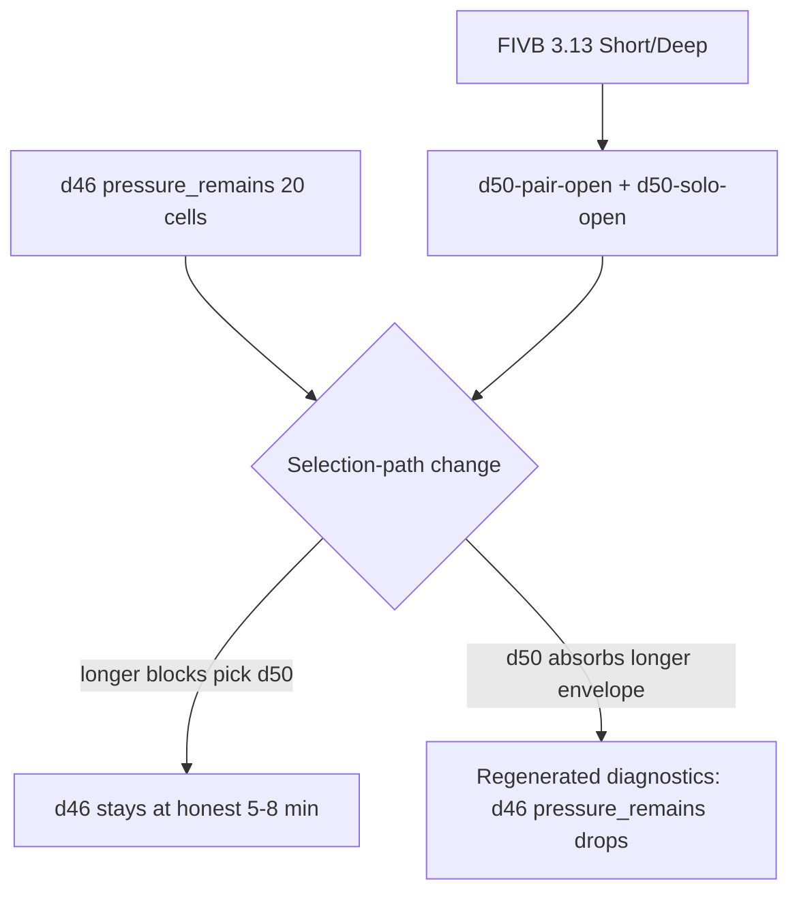

# d50 Advanced Passing Depth — Requirements

## Purpose

Define the minimum credible source-backed catalog addition that absorbs current `pressure_remains_without_redistribution` evidence on **d46-pair-open** (8/16 cells) and **d46-solo-open** (12/24 cells) without widening `d46`'s caps or duplicating its spin-read objective. Source: **FIVB Drill-book 3.13 Short/Deep** (intermediate, Passing chapter).

This document is brainstorm output, not implementation approval. It feeds `/ce-plan` next.

## Problem Frame

The generated diagnostics kit currently routes 23 groups to `generator_policy_investigation` and 35 to `defer`, but **0 to `source_backed_content_depth`** — even though 6 candidate groups have the right shape (`pressure_remains_without_redistribution` plus follow-up route `source_backed_proposal_work`).

The bottleneck is not source material. The repo holds the FIVB Drill-book PDF and a curated source archive (`docs/research/fivb-source-material.md`) that already names ~7 Tier 2 polish candidates with exact chapter.section IDs. We have not converted any of them into catalog adds yet.

This brainstorm picks the strongest single Tier 2 candidate (FIVB 3.13 Short/Deep) for the strongest two diagnostic groups (d46-pair-open and d46-solo-open). If this loop ships end-to-end, it proves the kit can repeatedly produce drill additions; if it doesn't, the actual bottleneck surfaces.

## Requirements

- **R1.** Author a new advanced passing drill family `d50` ("Short/Deep Pass Read") with two variants: `d50-pair-open` (partner-toss) and `d50-solo-open` (self-toss).
- **R2.** Source must be **FIVB Drill-book 3.13 Short / Deep** (intermediate, Passing chapter, page index per `docs/research/fivb-source-material.md`).
- **R3.** Skill focus must be `['pass', 'movement']` and **must not include spin-reading** as a teaching objective. d50 trains short/deep zone decisioning under fatigue; d46 trains spin reading. The two must remain distinct.
- **R4.** Workload envelope must be wide enough to honestly absorb 10–15 minute main-skill blocks. Concretely: `durationMinMinutes ≥ 8`, `durationMaxMinutes ≥ 14`, `fatigueCap.maxMinutes ≥ 14`. Exact numbers deferred to plan.
- **R5.** 1–2 player adaptation must be honest: `d50-pair-open` uses partner-toss to varied short/deep targets; `d50-solo-open` uses self-toss with marker zones for short and deep. **No 3+ player adaptation under any condition** (D101 boundary).
- **R6.** Selection-path change required: `buildDraft()` must prefer `d50` over `d46` for advanced pair-open / solo-open passing main-skill blocks **above 8 minutes**. Below 8 minutes, `d46` retains primacy. Exact selection logic deferred to plan.
- **R7.** Catalog ID `d50` must collision-check against `app/src/data/drills.ts` and `app/src/data/__tests__/catalogValidation.test.ts` before reservation.
- **R8.** Activation must include regenerated diagnostics showing intended movement: `d46-pair-open` and `d46-solo-open` `pressure_remains` cell counts must drop. If they don't, the implementation is reverted.

## Source Evidence (FIVB 3.13 Short/Deep)

Per `docs/research/fivb-source-material.md` and the FIVB PDF:

- **Drill ID:** 3.13 (Chapter 3 Passing, drill index 13)
- **Level tag:** intermediate
- **Drill objective:** Focused short-deep decision-making — passer must read whether the served ball is going short or deep, move accordingly, and pass into the set window.
- **Equipment:** ideal "as many balls as possible", minimum 3 balls (FIVB standard).
- **Participants (FIVB original):** ideal 4 athletes + coach observing; minimum 1 athlete + coach assisting (FIVB-typical pattern; we adapt to 1–2 player M001).
- **Why not redundant with d46:** d46 trains *spin-reading* (topspin/backspin recognition). d46 already does what FIVB 3.11 Backspin/Topspin Passing does, so 3.11 was rejected. FIVB 3.13 is the next-strongest match because short/deep zone decisioning is an adjacent-but-distinct advanced passing skill that d46 explicitly does not train.

The implementation plan must record the exact PDF page reference and any verbatim coaching cues used.

## 1–2 Player Adaptation Deltas

- **`d50-pair-open` (primary):** Feeder stands 4–6 m from passer behind a marker line. Feeder alternates between **short tosses** (landing inside a 2 m short marker zone close to feeder) and **deep tosses** (landing inside a 2 m deep marker zone behind passer's home position). Passer must read short/deep early, move, and deliver the pass into a marked 1 m set window. Switch roles every 12 feeds. Intervals run for the longer envelope (10–14 min) with explicit rest cycles.
- **`d50-solo-open` (secondary):** Self-toss equivalent. Passer self-tosses with controlled left/right + short/deep variation: alternate one short self-toss, one deep self-toss; pass each into the set window. Solo variant exists primarily for chain coherence and solo dogfooding under D130; pair-open is the primary surface.
- **Explicitly rejected (D101 boundary):** No 3+ player serve receive forms (no coach-fed multi-passer rotations, no triangle serve receive, no full-court coverage drills). One ball, markers only, 1–2 players only.

## Selection-Path Hypothesis

Current `buildDraft()` selects `d46-pair-open` (or `d46-solo-open`) for advanced open pair/solo passing main-skill blocks regardless of duration. Pressure originates because the cell tries to allocate 12+ minutes to a drill capped at 8.

The proposed change: when a generated block requests > 8 minutes of advanced pair-open or solo-open passing, prefer `d50` over `d46`. Below 8 minutes, `d46` retains primacy because it remains the better fit for the spin-read sub-skill at shorter envelopes.

If `buildDraft()` cannot make this distinction, the catalog add will not move diagnostics — and the implementation must be rejected, not shipped with no movement.

## Expected Diagnostic Movement

If the catalog add and selection-path change both ship correctly:

- `gpdg:v1:d46:d46-pair-open:main_skill:true:optional_slot_redistribution+over_authored_max+over_fatigue_cap` cells where `pressure_remains` should drop from 8 toward 0–2.
- `gpdg:v1:d46:d46-solo-open:main_skill:true:optional_slot_redistribution+over_authored_max+over_fatigue_cap` cells where `pressure_remains` should drop from 12 toward 0–4.
- New `gpdg:v1:d50:d50-pair-open:main_skill:...` and `gpdg:v1:d50:d50-solo-open:main_skill:...` groups will appear; they must show `likely_redistribution_caused` or no pressure (otherwise we have repeated the d49 residual pattern and the activation should be rolled back to a smaller envelope).
- Total routeable group count may change by ±2; this is expected and not a regression.

## Scope Boundaries

**In scope (this requirements doc):**

- Defining the d50 family contract and source basis.
- Naming the selection-path change at hypothesis level.
- Naming expected diagnostic movement and rollback criteria.

**Deferred to `/ce-plan`:**

- Exact workload envelope numbers (`durationMinMinutes`, `durationMaxMinutes`, `fatigueCap`).
- Exact `buildDraft()` selection rule wording.
- Exact verbatim FIVB 3.13 quotes for `courtsideInstructions` and `coachingCues`.
- PDF page reference for the source comment.
- Catalog validation test additions.
- Diagnostic regeneration commit boundary.

**Out of scope (not this slice):**

- d31 cluster (d31-pair-open, d31-pair, d31-solo-open) — those are workload/block-shape candidates, not content-depth candidates. Route through U7/U8 separately.
- d05-solo content add — d05's honesty clause already disclaims serve-reading; envelope pressure is workload review territory.
- d46 cap widening — explicitly rejected. d46 stays at 5–8 min; d50 absorbs longer envelopes.
- Multi-drill compound block shapes — separate generator-policy proposal, not blocked by this work but independent.
- 3+ player adaptations of FIVB 3.13 — rejected at the D101 boundary.
- Other FIVB Tier 2 polish candidates (3.6, 3.8, 3.11, 4.6, 4.7, 2.2, 2.4) — deferred to subsequent slices once this loop validates.

## Success Criteria

- A `/ce-plan` produces a complete implementation plan with U-IDs covering: catalog authoring, selection-path change, catalog validation tests, diagnostic regeneration, and rollback criteria.
- Implementation ships with regenerated diagnostics showing the intended movement from R8.
- If diagnostics do not show movement, the slice is reverted (drill record removed) and the bottleneck is documented for the next brainstorm.

## Open Questions

### Resolved here

- Which FIVB drill is the right source? FIVB 3.13 Short/Deep. Rejected: 3.11 (duplicates d46), 3.6/3.8 (movement-chain candidates, wrong target group), 4.6/4.7 (setting, not passing).
- Which diagnostic groups does this target? d46-pair-open + d46-solo-open. d31 cluster and d05-solo are deliberately out of scope.
- Do we need a comparator packet first? Yes — the existing `docs/reviews/2026-05-04-d46-pair-open-no-change-comparator-decision-packet.md` already named "D46 pair source evidence payload" as the next artifact. **This requirements doc is that payload's grounding.** The next artifact after this brainstorm is either an updated comparator outcome or a direct catalog implementation plan if we treat this brainstorm itself as the source evidence payload.

### Deferred to plan

- Exact d50 workload envelope numbers — should `durationMaxMinutes` be 14 or 16? Should `fatigueCap.maxMinutes` match `durationMaxMinutes` or be slightly higher?
- Exact selection threshold — is 8 minutes the right cut-over from d46 to d50, or is 9?
- Whether to also extend `d50-pair-open` to a `d50-pair` partner-receive variant where partner sits in the set window receiving the pass (rather than feeding). Likely deferred to a follow-up Tier 2 slice.
- Whether the existing `d46-pair-open-no-change-comparator-decision-packet` should be updated to reflect that source evidence is now landing, or whether a new comparator packet is needed. Plan should pick.

## Risks & Mitigations

| Risk | Mitigation |
|------|------------|
| d50 duplicates d46 in practice and diagnostics show no movement. | R3 + selection-path test: d50 must trigger above 8 min, d46 below. If diagnostics don't move, revert (R8). |
| Selection-path change accidentally pulls d50 into shorter blocks where d46 was correct. | Plan defines explicit duration cut-over and tests it in `sessionBuilder.test.ts`. |
| FIVB 3.13's coaching content cannot honestly adapt to 1–2 players. | Plan must record the verbatim 1–2 player adaptation; if no honest adaptation exists, slice is rejected before catalog edit. |
| New d50 group appears with `pressure_remains` (we just shifted the problem). | R8 rollback rule plus envelope sizing in R4 (must accommodate the longest cell allocation, not just 12 min). |
| Adds a 4th advanced passing chain entry and crowds the chain. | chain-4-serve-receive currently holds d09–d18, d46. d50 is one more record; not over-loading. |
| Plan over-scopes into d31 / d05 / multi-drill blocks. | Scope Boundaries section above explicitly excludes these. Plan must respect. |

## Sources & References

- `docs/research/fivb-source-material.md` — FIVB Tier 2 polish candidates list and 3.13 cross-reference
- `docs/research/sources/FIVB_Beachvolley_Drill-Book_final.pdf` — primary source PDF
- `docs/reviews/2026-05-04-d46-pair-open-source-backed-gap-card.md` — gap card this fulfills
- `docs/reviews/2026-05-04-d46-pair-open-no-change-comparator-decision-packet.md` — comparator packet that named the next artifact
- `docs/reviews/2026-05-01-generated-plan-diagnostics-triage.md` — current diagnostic state
- `app/src/data/drills.ts` — d46 contract (lines 1105–1180), d05 contract (lines 328–414)

## Handoff

Next step: `/ce-plan` to produce the catalog implementation plan with exact workload numbers, selection-path code change, source citations, validation tests, and rollback criteria.
