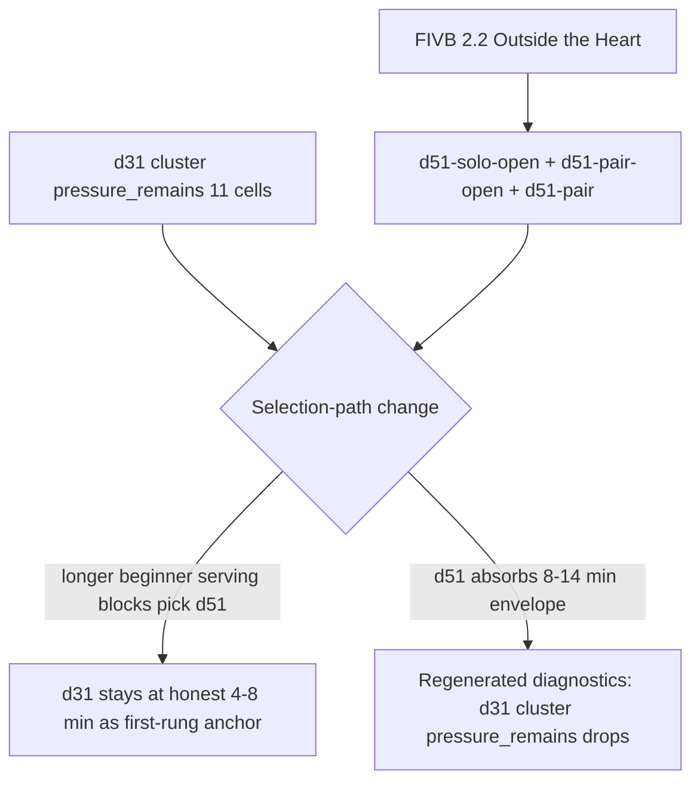

# d51 Beginner Serving Tactical Zone Depth — Requirements

## Purpose

Define the minimum credible source-backed catalog addition that absorbs current `pressure_remains_without_redistribution` evidence on the **d31 cluster** (d31-solo-open 7 cells, d31-pair-open 3 cells, d31-pair 1 cell — 11 cells total) without widening d31's caps or duplicating its single-target teaching surface. Source: **FIVB Drill-book 2.2 Serving Outside the Heart** (beginner / intermediate, Serving chapter).

This document is brainstorm output, not implementation approval. It feeds `/ce-plan` next.

## Problem Frame

After the d50 ship, the post-d50 redistribution causality receipt still shows three beginner-serving groups in `mixed_cell_states` with pressure_remains:

- `gpdg:v1:d31:d31-solo-open:main_skill:true:optional_slot_redistribution+over_authored_max+over_fatigue_cap`: **7/14 cells** pressure remains
- `gpdg:v1:d31:d31-pair-open:main_skill:true:optional_slot_redistribution+over_authored_max+over_fatigue_cap`: **3/6 cells** pressure remains
- `gpdg:v1:d31:d31-pair:main_skill:true:optional_slot_redistribution+over_authored_max+over_fatigue_cap`: **1/2 cells** pressure remains

d31 ("Self Toss Target Practice") is `levelMin: 'beginner'`, `levelMax: 'beginner'` with a 4-8 min envelope (fatigueCap 8 min / 20 reps). d33 ("Around the World Serving") exists at 6-10 min with `levelMax: 'advanced'` but the beginner-serving cells trying to allocate 12+ min over-stretch d31 even when d33 is in the candidate pool, because `pickForSlot` doesn't fire a duration-fit reroute for beginner serving.

Per the activation pattern (docs/solutions/2026-05-04-source-backed-content-depth-activation-pattern.md), the next move is a longer-envelope source-backed sibling for beginner serving plus a `shouldPreferBeginnerServingDurationFit` reroute. **FIVB 2.2 Serving Outside the Heart** is the named candidate in `docs/research/fivb-source-material.md`, explicitly flagged as Tier 2 polish since 2026-04-20 with the note: *"Not cloned in Tier 1 because d31 is our first-rung anchor."*

This activation does not displace d31; it adds the longer-envelope sibling with different content (tactical zone awareness vs single-target commitment).

## Requirements

- **R1.** Author a new beginner-friendly serving drill family `d51` ("Outside the Heart Serving") with three variants matching the d31 surface coverage: `d51-solo-open`, `d51-pair-open`, `d51-pair`. (origin: source-backed content-depth pattern, mirroring d50's variant structure)
- **R2.** Source must be **FIVB Drill-book 2.2 Serving Outside the Heart** (beginner/intermediate, Serving chapter). Inline provenance comment required.
- **R3.** `skillFocus` must be `['serve']` (matching d31). **Must not duplicate d31's single-target objective.** d31 = single small target commitment; d51 = tactical "no-serve heart zone" awareness with rotating outer-zone targets. The honesty boundary must be explicit in the objective.
- **R4.** Workload envelope: `durationMinMinutes ≥ 8`, `durationMaxMinutes ≥ 14`, `fatigueCap.maxMinutes ≥ 14`. Wider than d31's 8-min ceiling and d33's 10-min ceiling so it cleanly absorbs cells trying to allocate 12-15 min.
- **R5.** Level coverage: `levelMin: 'beginner'`, `levelMax: 'intermediate'` (per FIVB 2.2's stated level band). This lets d51 fire for the beginner-only pressure cells AND optionally serve intermediate-level cells where d33 currently dominates.
- **R6.** 1–2 player adaptation must be honest: `d51-solo-open` uses self-toss with marker zones (no net required); `d51-pair-open` mirrors with a partner-caller for verbal commitment; `d51-pair` uses net-and-shagger setup matching d31-pair's existing affordance. **No 3+ player adaptation under any condition** (D101 boundary). FIVB 2.2's source description says "minimum 1 athlete + coach assisting" — that adapts to 1-2 players cleanly.
- **R7.** `buildDraft()` must prefer `d51` over `d31` for beginner serving main-skill blocks **above 8 minutes**. Below 8 minutes, `d31` retains primacy as the first-rung anchor (BAB Lesson 4 Self-Toss Target Practice). Implementation: new `ADVANCED_SERVING_DURATION_FIT_DRILL_IDS` is the wrong name — call it `BEGINNER_SERVING_DURATION_FIT_DRILL_IDS = new Set(['d31'])` plus `shouldPreferBeginnerServingDurationFit` predicate (focus=`serve` + level=`beginner` + selected ∈ set + can't carry).
- **R8.** ID `d51` collision-check against `app/src/data/drills.ts` and `app/src/data/__tests__/catalogValidation.test.ts` before reservation.
- **R9.** Activation must include regenerated diagnostics showing intended movement: d31 cluster `pressure_remains` counts must drop. **Revert** if they don't, or if new d51 groups appear with `pressure_remains > 2`.

## Source Evidence (FIVB 2.2 Serving Outside the Heart)

Per `docs/research/fivb-source-material.md` and the FIVB PDF (Chapter 2 Serving, drill 2.2, beginner / intermediate):

- **Drill ID:** 2.2 (Chapter 2 Serving, drill index 2)
- **Level tag:** beginner / intermediate
- **Objective (FIVB):** *"Treat the middle-front of the receiving court as a no-serve zone shaped like a heart. Simpler than zone numbers and good for a first-rung tactical serving variant."*
- **Equipment:** Ideal "as many balls as possible", minimum 3 balls (FIVB standard).
- **Participants (FIVB original):** Ideal 4 athletes + coach observing; minimum 1 athlete + coach assisting (FIVB-typical pattern; we adapt to 1-2 player M001).
- **Why not redundant with d31:** d31 trains commitment to a *single small target circle*. FIVB 2.2 trains *avoiding* a no-serve zone (the "heart") with serves landing anywhere in the outer ring — tactical zone awareness instead of bullseye accuracy. Different content, complementary.
- **Why not redundant with d33:** d33 ("Around the World") rotates through 6 specific zones in order — sequenced accuracy across the whole court. FIVB 2.2 is a *prohibition zone* drill: avoid one bad zone, place anywhere else. Decision space is different (negative-space targeting vs positive-zone sequencing).

The implementation plan must record the exact PDF page reference and any verbatim coaching cues used.

## 1–2 Player Adaptation Deltas

- **`d51-solo-open` (primary):** Mark a 2 m × 2 m "heart" zone in the middle-front of an open sand area (use 4 markers). Self-toss and serve toward any sand outside the heart zone. Score: each serve landing outside the heart zone counts; serves into the heart subtract one. Run for 8-14 min with rest cycles every ~6 minutes.
- **`d51-pair-open`:** Partner stands in the heart zone (or beside it) as a visual anchor and calls "left," "right," "deep," or "short" before each toss. Server avoids the heart zone AND aims toward the called outer-zone direction. Switch every 10 serves.
- **`d51-pair` (net required):** Server serves over the net into the receiving court; partner shags from the receiving side. Same heart-zone avoidance, net-clearance enforced. Mirrors d31-pair's net-and-shagger affordance.
- **Explicitly rejected (D101 boundary):** No coach-fed multi-passer rotations, no 3-passer triangles, no court-coverage drills. One ball, markers + court, 1-2 players only.

## Selection-Path Hypothesis

Current `buildDraft()` selects d31 for beginner serving main_skill blocks regardless of duration. Pressure originates because the cell tries to allocate 12+ min to a drill capped at 8 min. d33 sometimes appears in the candidate pool but isn't preferentially picked.

Proposed change: when a generated block requests > 8 min of beginner serving and d31 is the default pick, reroute to d51 via `preferTargetDurationFit: true`. d31 retains primacy below 8 min as the first-rung anchor.

If `buildDraft()` cannot make this distinction, the catalog add will not move diagnostics — and the implementation must be reverted, not shipped with no movement.

## Expected Diagnostic Movement

If the catalog add and selection-path change both ship correctly:

- d31-solo-open `pressure_remains` should drop from 7 toward 0
- d31-pair-open `pressure_remains` should drop from 3 toward 0
- d31-pair `pressure_remains` should drop from 1 toward 0
- New `d51-solo-open`, `d51-pair-open`, `d51-pair` groups will appear; they must show `likely_redistribution_caused` or no pressure (otherwise envelope is too tight and we revert)
- Total routeable group count change: ±3 expected

## Scope Boundaries

**In scope (this requirements doc):**

- Defining the d51 family contract and source basis
- Naming the selection-path change at hypothesis level
- Naming expected diagnostic movement and rollback criteria

**Deferred to `/ce-plan`:**

- Exact workload envelope numbers
- Exact `buildDraft()` selection rule wording
- Exact verbatim FIVB 2.2 quotes for `courtsideInstructions` and `coachingCues`
- PDF page reference for the source comment
- Catalog validation test additions
- Diagnostic regeneration commit boundary

**Out of scope (not this slice):**

- d05-solo content add — honesty clause already disclaims serve-reading; envelope pressure is workload review territory
- d01-solo — on the D01 cap-catalog fork track; separate workflow
- Compound 2-drill main_skill blocks — a separate generator-policy lane (recommended as next-next iteration)
- d33 cap widening — d33's `levelMax: 'advanced'` makes a beginner-only cap widening unsafe; we add d51 instead
- Other FIVB Tier 2 polish candidates (3.6, 3.8, 3.11, 4.6, 4.7, 2.4) — subsequent slices once this loop validates
- 3+ player adaptations of FIVB 2.2 — rejected at the D101 boundary
- Any change to d31's existing record, workload, or selection logic except where the new reroute targets it

## Success Criteria

- A `/ce-plan` produces a complete implementation plan with U-IDs covering: catalog authoring, chain wiring, selection-path change, catalog validation tests, sessionBuilder reroute tests (test-first), diagnostic regeneration, and rollback criteria.
- Implementation ships with regenerated diagnostics showing R9 movement.
- If diagnostics do not show movement, the slice is reverted (drill record removed) and the bottleneck is documented.
- The activation pattern doc (`docs/solutions/2026-05-04-source-backed-content-depth-activation-pattern.md`) is extended to cite d51 as the third validated application.

## Open Questions

### Resolved here

- **Which FIVB drill is the right source?** FIVB 2.2 Serving Outside the Heart. Rejected: 2.3 (already partially activated for d34's deep-serve cue), 2.4 (intermediate pair-only pressure drill, wrong level for d31 cluster), 2.7 (advanced partner serving, wrong level).
- **Which diagnostic groups does this target?** d31 cluster (3 groups). d05-solo and d01-solo are deliberately out of scope.
- **Do we need a comparator packet first?** No. The d50 implementation collapsed the comparator into the brainstorm-as-source-evidence-payload (per the d46 comparator's `## Implementation Result`). Same collapse applies here — this brainstorm is the source evidence payload for any future "d31 vs no-change" comparator question.

### Deferred to plan

- Exact `BEGINNER_SERVING_DURATION_FIT_DRILL_IDS` naming and reroute condition wording
- Whether d51 needs a closed-pair `d51-pair-open-net` variant (currently 3 variants matching d31's coverage)
- Exact d51 envelope numbers — should `durationMaxMinutes` be 14 or 12?
- Whether `levelMax: 'intermediate'` will cause d51 to bleed into intermediate cells where d33 currently fires; if so, an additional gate may be needed

## Risks & Mitigations

| Risk | Mitigation |
|------|------------|
| d51 duplicates d31 in practice and diagnostics show no movement | R3 + selection-path test: d51 must trigger above 8 min, d31 below. If diagnostics don't move, revert (R9). |
| Selection-path change accidentally pulls d51 into shorter blocks where d31 was correct | Plan defines explicit duration cut-over and tests it in `sessionBuilder.test.ts`. |
| FIVB 2.2's coaching content cannot honestly adapt to 1-2 players | Plan must record verbatim 1-2 player adaptation; if no honest adaptation exists, slice is rejected before catalog edit. |
| New d51 groups appear with `pressure_remains` (we just shifted the problem) | R9 rollback rule plus envelope sizing in R4. |
| `levelMax: 'intermediate'` causes d51 to crowd intermediate cells where d33 currently dominates | U5 includes an intermediate-serving negative-gate test; if d51 displaces d33 unintentionally, restrict to `levelMax: 'beginner'`. |
| Adds a 5th drill to chain-6-serving and over-loads it | chain-6 currently has d22, d31, d23, d33 (4 entries). d51 is a 5th; not over-loading. |

## Sources & References

- `docs/solutions/2026-05-04-source-backed-content-depth-activation-pattern.md` — canonical activation pattern (third application here)
- `docs/research/fivb-source-material.md` — FIVB 2.2 Tier 2 polish candidate row + cross-reference table
- `docs/research/sources/FIVB_Beachvolley_Drill-Book_final.pdf` — primary source PDF (Chapter 2, drill 2.2)
- `docs/reviews/2026-05-01-generated-plan-diagnostics-triage.md` — current diagnostic state showing d31 cluster pressure
- `app/src/data/drills.ts` — d31 contract (lines 1645-1763), d33 contract (lines 1767+), d50 precedent
- `docs/plans/2026-05-04-003-feat-d50-advanced-passing-depth-plan.md` — most recent precedent (d46 → d50)

## Handoff

Next step: `/ce-plan` to produce the catalog implementation plan with exact workload numbers, selection-path code change, source citations, validation tests, and rollback criteria.
