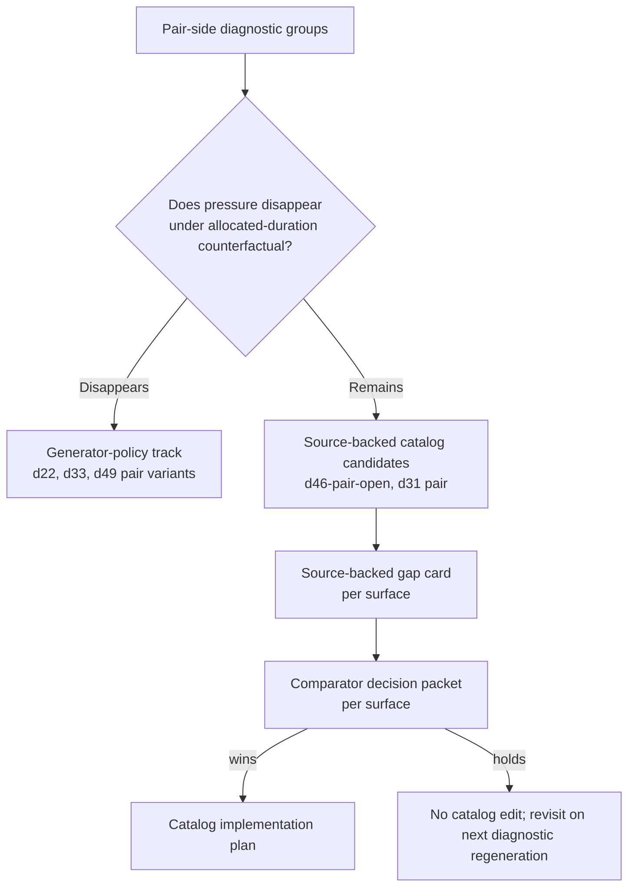

# Pair-Side Catalog Content Depth Requirements

## Problem Frame

Generated diagnostics now show 0 hard failures across 540 seeded cells, with 58 routeable observation groups. The advanced solo-side catalog gap was filled by D49 (`Set and Recover`) after the D47-vs-D05 comparator selected `d47_wins` and the D47 source-backed catalog implementation plan landed. The pair-side has a parallel but unfilled signal.

When we restrict the redistribution causality receipt to pair variants and to groups whose pressure does NOT disappear under the allocated-duration counterfactual (the "real" catalog/source-depth candidates per `docs/ops/workload-envelope-authoring-guide.md`), the surviving pair surfaces are:

- `gpdg:v1:d46:d46-pair-open:main_skill:true:optional_slot_redistribution+over_authored_max+over_fatigue_cap` — 8 cells where pressure disappears, 8 where pressure remains, mixed (action `pressure_remains_without_redistribution`).
- `gpdg:v1:d31:d31-pair-open:main_skill:true:optional_slot_redistribution+over_authored_max+over_fatigue_cap` — 3 disappears, 3 remains, mixed.
- `gpdg:v1:d31:d31-pair:main_skill:true:optional_slot_redistribution+over_authored_max+over_fatigue_cap` — 1 disappears, 1 remains, mixed.

Other pair groups either route to U8/generator-policy (d22, d33, d49 pair variants — pressure disappears under counterfactual, so they are diagnostic-only) or are already addressed (d49 just shipped; d33-pair-open and d33-pair are generator-policy lanes that the D49 U8 proof packet already named as future generator-policy work).

Prose requirements govern if the diagram and text ever disagree.

---

## Actors

- A1. Maintainer: decides whether the pair-side content depth signal warrants a source-backed sibling, a workload/cap proposal, a block-shape proposal, or no implementation action.
- A2. Agent implementer: produces the source-backed gap card, comparator packet, and downstream implementation plan after a comparator winner is selected.
- A3. Reviewer: confirms that pair-side catalog activation has source provenance, an adaptation delta within D101 limits, and post-implementation diagnostic movement.

---

## Key Flows

- F1. Pair-side gap card produced from current diagnostics
  - **Trigger:** Maintainer accepts that `d46-pair-open` is the highest-leverage pair-side mixed-pressure candidate.
  - **Steps:** Author a source-backed gap card for `d46-pair-open` (and optionally a sibling card for `d31-pair-open`/`d31-pair`) following the `gap-d47-advanced-setting-conditioning-depth` template.
  - **Outcome:** Documented `source_candidate` gap card with named diagnostic groups, current receipt facts, source references, adaptation delta, and a checkpoint criterion that activation remains `not_authorized` until the comparator selects a winner.
  - **Covered by:** R1, R2, R3, R4, R5
- F2. Comparator decision before catalog edit
  - **Trigger:** Pair-side gap card exists and the maintainer wants to proceed.
  - **Steps:** Build a comparator packet (e.g. `d46-pair-open` vs the simplest no-change baseline; optionally `d46-pair-open` vs the `d05` short-pass comparator if D05 re-entry triggers fire). Record receipt facts, source/adaptation basis, expected diagnostic movement, no-action threshold, and re-entry trigger.
  - **Outcome:** Comparator outcome of `d46_pair_wins`, `no_change_accepted`, or `hold_for_evidence`; activation remains `not_authorized` from this packet alone.
  - **Covered by:** R6, R7, R8
- F3. Catalog implementation plan only on wins
  - **Trigger:** Comparator selects a pair-side winner with source/adaptation evidence.
  - **Steps:** Write a focused source-backed catalog implementation plan that names the changed catalog IDs, cap delta, exact source references, adaptation delta, verification command, and expected diagnostic movement. The plan must include an activation gate, product acceptance criteria, and a fallback re-entry procedure (mirror of `docs/plans/2026-05-02-014-feat-d47-source-backed-catalog-implementation-plan.md`).
  - **Outcome:** Catalog content lands behind the activation gate; regenerated diagnostics confirm the intended pair-side movement; gap card status updates from `source_candidate` to `verified_or_held` per outcome.
  - **Covered by:** R9, R10, R11, R12

---

## Requirements

**Pair-side gap identification**

- R1. Use the current generated triage workbench plus redistribution causality receipt as the source of truth for pair-side catalog candidates; do not invent pair gaps from prose alone.
- R2. Limit the candidate pool to pair variants whose dominant action state is `pressure_remains_without_redistribution` or `mixed_cell_states`. Pair variants whose action state is `likely_redistribution_caused` are generator-policy work, not catalog work.
- R3. Treat `d46-pair-open` as the primary pair-side catalog candidate, and `d31-pair-open`/`d31-pair` as secondary candidates whose work can either bundle with the d46 plan or follow as a smaller separate slice.

**Source-backed gap card content**

- R4. Each pair-side gap card must name affected diagnostic groups, current receipt facts, current catalog coverage, suspected content-depth gap, candidate changed or missing IDs (collision-checked at implementation time), likely fix type, and a rejected direct cap-widening note.
- R5. Each pair-side gap card must cite exact source references suitable for 1-2 player adaptation. Source candidates include but are not limited to:
  - Better at Beach pair passing/serve receive drills.
  - FIVB drill book additional passing variants beyond 3.15/3.16.
  - JVA passing/serve receive habits drills.
  - TAOCV pass-and-go or pass-under-fatigue drills.
  Sources that require 3+ players are inadmissible by themselves; they may appear as supporting rationale only and must include a 1-2 player adaptation delta.

**Comparator gating**

- R6. No pair-side catalog edit is authorised by the gap card alone; activation requires a comparator packet that selects a pair-side winner with current source/adaptation and selection-path evidence.
- R7. The comparator must record an explicit `no_action_threshold` and a `re_entry_trigger` so that a held outcome stays held without further escalation.
- R8. If the pair-side comparator cannot beat the simplest no-change baseline, the gap card status remains `source_candidate` and no catalog implementation plan is opened.

**Catalog implementation safety**

- R9. The catalog implementation plan must reuse the D47→D49 pattern: requirements trace, scope boundaries (no D101 re-entry, no broad runtime redistribution change, no D49/D47 cap widening from this slice), activation gate, product acceptance criteria, and D05 re-entry procedure.
- R10. The plan must name the verification command set (catalog validation, drill copy regression, generated diagnostics check, build, agent doc validation) and require regenerated diagnostics to show the intended pair-side movement before the plan is marked complete.
- R11. The plan must check candidate ID collisions before editing `app/src/data/drills.ts`. Today the next free advanced-passing/conditioning ID likely begins at `d50`; implementation must re-verify against current catalog state rather than trusting this draft.
- R12. The plan must not introduce any 3+ player source form into M001. Pair-open adaptations must preserve 1-2 player playability with one ball and markers.

---

## Acceptance Examples

- AE1. **Covers R1, R2, R3.** Given current generated diagnostics, when the brainstorm names pair-side catalog candidates, the list contains `d46-pair-open`, `d31-pair-open`, and `d31-pair` and excludes pair variants whose pressure disappears under the counterfactual.
- AE2. **Covers R4, R5.** Given a gap card draft for `d46-pair-open`, when reviewed, it cites at least one BAB/FIVB/JVA/TAOCV source per candidate adaptation and names a 1-2 player adaptation delta for each cited source.
- AE3. **Covers R6, R7, R8.** Given a comparator packet for `d46-pair-open` vs no-change baseline, when the source/adaptation evidence is incomplete, the packet remains `hold_for_evidence` with `not_authorized` activation status and named re-entry triggers.
- AE4. **Covers R9, R10, R11, R12.** Given a comparator winner, when the catalog implementation plan ships, the plan reuses the D47→D49 structure, names changed catalog IDs after collision check, requires regenerated diagnostics movement, and rejects 3+ player source forms.

---

## Success Criteria

- A maintainer can pick the next pair-side catalog candidate from the generated triage workbench without re-deriving evidence from raw cells.
- The pair-side path mirrors the D47→D49 pattern so future agents can follow it without inventing process.
- Pair-side catalog activations are gated by a comparator and are recorded in `docs/reviews/2026-04-30-focus-coverage-gap-cards.md` alongside the existing solo/pair gap cards.
- After a pair-side activation lands, regenerated diagnostics show reduced over-cap or fatigue pressure on the targeted pair variant without new hard failures elsewhere.

---

## Scope Boundaries

- Do not change shipped `buildDraft()`, optional-slot redistribution, archetype, or session assembly behaviour from this brainstorm.
- Do not edit catalog content, drill caps, copy, or workload metadata from this brainstorm.
- Do not reopen the D101 (3+ player) boundary from this brainstorm; pair-open means 1-2 players only.
- Do not bundle pair-side work with solo-side D49/D47 follow-up. The D49 U8 generator-policy proof packet already covers d49 follow-up and is diagnostic-only.
- Do not promote `d22`, `d33`, or `d49` pair variants whose pressure disappears under the counterfactual; those are generator-policy decisions, not catalog work.

### Deferred for Later

- A pair-side U6 catalog impact preview tool: deferred until a concrete pair-side catalog proposal exists.
- A second pair-side gap card for `d31-pair-open`/`d31-pair`: defer until the d46-pair-open path either ships, holds, or rejects.
- Theme-level pair training (e.g. a pair-only `serve_receive` mixed-focus theme): outside this brainstorm; routes through the future theme manifest pattern.

### Outside This Product's Identity

- 3+ player drill activation in M001.
- Coach-driven sequence drills that require external feed mechanics.
- Tournament/match-emulation pair conditioning blocks.

---

## Key Decisions

- Treat `d46-pair-open` as the primary candidate because it carries the highest pair-side pressure-remains signal (8 cells) and has direct source-backed sibling potential parallel to D47→D49.
- Bundle `d31-pair-open`/`d31-pair` only if the d46 source review reveals a shared sibling candidate; otherwise defer to a separate slice.
- Preserve comparator gating. Even if the source-backed gap card looks compelling, no catalog edit ships without a comparator winner.
- Reuse the D47→D49 plan and gap card templates verbatim where possible to keep the maintainer surface small.
- Keep pair-side catalog work scoped to `pair-open` (1-2 players, one ball, markers). Do not slip into 3+ player source forms or net-clearance claims.

---

## Dependencies / Assumptions

- Generated diagnostics are current per `npm run diagnostics:report:check`; the pair-side group keys above are taken from the most recent regeneration.
- The D47→D49 path remains the canonical source-backed catalog activation template (see `docs/plans/2026-05-02-014-feat-d47-source-backed-catalog-implementation-plan.md`).
- The current D101 (3+ player) boundary remains in force; any source candidate that requires 3+ players is supporting rationale only.
- `docs/reviews/2026-04-30-focus-coverage-gap-cards.md` remains the canonical home for gap card status; new pair-side cards will be added there or referenced from there.

---

## Outstanding Questions

### Resolve Before Planning

- [Affects R3, R5][Product] Should the first pair-side gap card focus narrowly on `d46-pair-open` or bundle `d31-pair-open`/`d31-pair`? Default in this requirements doc: narrow to `d46-pair-open`; bundle only if the source review names one shared sibling.
- [Affects R4, R11][Technical] Does the candidate sibling want a new drill family (e.g. `d50`) or a new variant on `d46` (e.g. `d46-pair-open-conditioning`)? Default: new sibling drill family, mirroring D47→D49; revisit only if source evidence supports a longer cap on the existing variant.

### Resolved During Planning

- [Affects R6, R7][Technical] Comparator format: reuse the D47-vs-D05 comparator decision packet shape, with pair-side baseline as the no-change comparator.

### Deferred to Implementation

- [Affects R11][Technical] Exact next free drill ID. Implementation must grep `app/src/data/drills.ts` and `app/src/data/__tests__/catalogValidation.test.ts` for collisions before claiming a new ID.
- [Affects R10][Technical] Whether to add a focused pair-side e2e walkthrough alongside the catalog change or rely on the existing focus-readiness/sessionBuilder/drill-copy regression tests.

---

## Next Steps

After this brainstorm, the immediate next artefact is:

1. A source-backed gap card for `d46-pair-open` modelled on `docs/reviews/2026-05-02-d47-source-backed-gap-card.md`.
2. If the gap card is admissible, a comparator decision packet for `d46-pair-open` vs no-change baseline (and optionally vs the existing D05 short-pass comparator if D05 re-entry triggers fire).
3. If the comparator selects a pair-side winner, a source-backed catalog implementation plan modelled on `docs/plans/2026-05-02-014-feat-d47-source-backed-catalog-implementation-plan.md`.

The implementation plan that follows this brainstorm should narrow the immediate work to step 1 (gap card) plus the documentation/registration scaffolding needed so step 2 (comparator) and step 3 (catalog plan) can run cleanly later.
