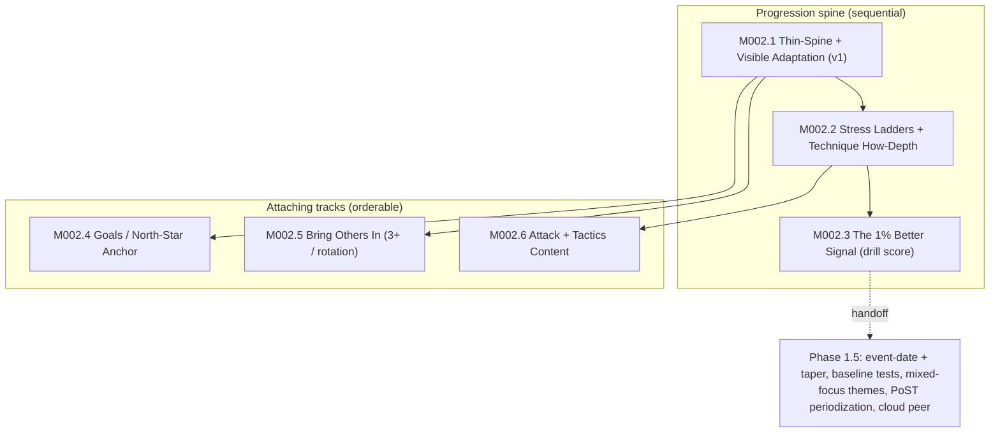

# M002 Thin-Spine v1 + Milestone-Series Scope

## Summary

Re-scopes M002 from a single "Weekly Confidence Loop" into a **series of milestones** — a self-coached deepening arc that turns a believable single session into a training home that visibly makes you better. This doc defines **M002.1 (v1)** precisely at the requirements level — a thin-spine plan + visible adaptation + a behavioral-primary receipt with confidence reframed to felt-readiness + a warmup content block — and scopes **M002.2 through the Phase 1.5 handoff at the milestone level** (outcome, shape, dependencies, evidence basis), to be planned one-by-one after the roadmap order is locked. The arc is organized by a **progression spine** (thin-spine → stress ladders → an objective "1% better" signal) with three attaching tracks (goals, more-people, attack/tactics content). "Stress" — the BAB-camp progressive-contextual-interference framework — is the organizing primitive for the mid-series milestones; v1 speaks its vocabulary without building its content (hybrid spine).

## Problem Frame

M001 proved one believable courtside loop. The next risk is not "can they finish a session?" but "does the app become the training home that makes us progressively better?" The founder's stated end-state for "for-sure my volley training home": train all core skills (incl. attack, tactics); bring others in; **see the plan building up and making me better over time**; set goals to build toward as an individual or pair; more content depth; and progressive adaptation chains.

Two things make a single "Weekly Confidence Loop" milestone the wrong container. First, the 2026-06-02 research day (`docs/research/2026-06-02-m002-evidence-meta-synthesis.md`) showed the milestone's confidence-as-skill-signal center of gravity is unsupported — the honest progress story is behavioral, with confidence as a felt-readiness companion. Second, the end-state is plainly a multi-milestone arc, not one surface. So M002 becomes a series: a thin, trustworthy v1 first, then the depth that earns the "training home" claim — sequenced and planned one milestone at a time.

## Key Decisions

- **M002 is a series, not a single milestone.** A progression spine (M002.1 → M002.2 → M002.3) plus three attaching tracks (goals, more-people, attack/tactics content) plus a Phase 1.5 handoff. Each is planned individually after the roadmap order is locked; this doc scopes them, it does not plan them.
- **Hybrid progression spine, organized by "Stress."** The BAB-camp "Stress" framework (low-stress/technique → layer stress every ~10 min → end most dynamic) is the applied name for **progressive contextual interference**, the one skill-side lever the periodization evidence supports, already in canon as `D68`. It becomes the organizing primitive ("stress ladder") for the mid-series content/progression milestones. **v1 speaks stress vocabulary** (the adaptation verdict says "a bit more / less stress next time") but does **not** build the stress-ladder content — that is M002.2. Cheap now, no wasted reframing later.
- **Behavioral-primary, confidence-as-companion.** The weekly receipt headlines a behavioral consistency signal; confidence is reframed to a felt-readiness companion ("how ready you feel in [skill]"), never surfaced as skill proof, never a single-week delta, never an auto-read dip-as-failure. The objective "1% better" signal (a repeated structured drill score) is a deliberate **seam** in v1, built in M002.3.
- **Visible adaptation is in v1 (minimal #5).** The founder's #1 need — "see the plan building up / know I'm getting better" — is served in v1 by a visible carry-forward + one offered "accept / keep original" verdict per session, not by a confidence number. The heavy append-only verdict ledger stays deferred.
- **Naming (founder-ratify).** Proposed umbrella rename of M002 from "Weekly Confidence Loop" to **"Weekly Training Home"** (or similar), since confidence is demoted and the arc is broader. The `M002` ID stays stable. The *meaning* reframe (confidence = felt readiness) is mandatory regardless of the name; the rename itself is the founder's call at roadmap-lock.
- **Phase boundary (founder-ratify).** The series spans the current roadmap Phase 1 / Phase 1.5 line: M002.1–M002.3 are Phase-1 "main-tool pull" core; goals/anchor and the heavier content/roster tracks lean into Phase 1.5 territory. Where the coach-gate sits (after which milestone the BYOC-lite clipboard may begin) is a roadmap-lock decision — recommended after the spine (M002.1–M002.3) proves main-tool pull.

## The M002 milestone series (milestone-level scope)

Ordering across tracks is a roadmap-lock decision (see Outstanding Questions). Dependencies are hard; sequence is a recommendation.

**M002.1 — Thin-Spine + Visible Adaptation (v1).** Defined precisely below. Outcome: a returning user sees what to do next, sees the plan adapting to them, and gets a calm behavioral receipt — without degrading the quick-start loop. Evidence: meta-synthesis VALIDATES the thin-spine + behavioral-primary receipt; reviewers S1 (pull #5 in) + S2 (reframe confidence).

**M002.2 — Stress Ladders + Technique "How" Depth.** Outcome: each focal skill gains an ordered ladder of **stress rungs** (clean-toss technique → moving → re-set in a new spot → game-like), each carrying an external-focus cue and an exploratory "see how it feels" criterion. This is simultaneously the technique-"how" depth layer (closes the loudest camp gap — "I never really knew how to set until now"), the content the thin-spine backlog orders over, and the substrate the next milestone scores against. Built **user-owned / process-framed / exploratory — never coach-graded pass/fail** (coach-pedagogy evidence: pass/fail backfires coachlessly). Key open: rung authoring cost; how many skills get ladders first; how a rung renders within the `D137` spine and the ≤45-word RunScreen budget. Dependencies: M002.1 (the backlog the ladders feed). Evidence: `docs/research/coach-pedagogy-translation-self-coached.md`; `docs/research/periodization-low-volume-amateur-skill-sport.md` (progressive CI); `D68`.

**M002.3 — The "1% Better" Signal.** Outcome: a repeated structured drill score on a focal skill (same task, same scoring rule, captured on `/run/check`), tied to clearing a stress rung — the objective advancement signal seamed in v1. "1% better" becomes legible: you cleared the rung at a higher stress level. Key open: the Phase 2B capture shape trigger (`docs/status/post-m001-content-backlog.md`) and a same-drill repeat cadence the spine must guarantee (feasibility F1). Dependencies: M002.2 (rungs to score against). Evidence: `docs/research/single-tracked-metric-amateur-skill-apps.md` (the believable improvement metric everyone points to).

**M002.4 — Goals / North-Star Anchor.** Outcome: a named capability/focus target — individual **or** pair — the backlog orders *toward* ("set goals to build towards"). Eventless capability anchor first; the dated A-event + taper is deferred to Phase 1.5 (the periodization physical-null reclaims that budget). Key open: a non-gamified "capability met?" definition; pair-vs-individual goal shape (`D146` pair-native). Dependencies: M002.1. Evidence: 2026-06-02 ideation survivor #1a; end-state "set goals … as an individual or a pair."

**M002.5 — Bring Others In (variable player count).** Outcome: run training with 3+ people / rotation despite the 2s orientation ("bring in friends and others"). Addresses the strongest churn signal on record — observed displacement-of-use (a 3s session run outside the app). Key open: collides with `D101` (3+ deferred) and needs 3+/rotation content; this milestone reopens that deferral deliberately and needs its own decision packet. Dependencies: M002.1; `D101` activation. Evidence: founder-ledger 3+ player gap (4 hits + displacement); ideation survivor #4.

**M002.6 — Attack + Tactics Content.** Outcome: attack-chain + tactics/team-play content — the most-corroborated founder ask (4 hits, partner-corroborated) and a named end-state skill ("train all core volley skills (attack, tactics)"). Authored **as stress ladders** (consumes the M002.2 primitive), via the `D148`-shape attack-chain decision packet and the `D143`/`D144` boundaries. Best modeled as a content track running parallel to the spine once M002.2 exists; given its evidence weight, a strong candidate to interleave early. Key open: the attack-chain decision packet (shape b vs c, already narrowed to b); zone conventions (`D143`); `pair_game` variant (`D144`). Dependencies: M002.2; the attack-content decision packet. Evidence: founder-ledger F1 (first-class content-gap) + 2026-06-02 camp.

**Phase 1.5 handoff (out of M002).** Event-date anchor + taper (#1b), baseline tests, curated mixed-focus themes, PoST periodization macro-vocabulary, optional cloud peer. M002 hands off to these; it does not absorb them. Evidence: `docs/roadmap.md` Phase 1.5; `O2`.

## M002.1 (v1) requirements

Precise requirements for the first milestone. Grouped by concern; R-IDs continuous.

**Plan shape (thin-spine)**

- R1. The plan is a small set of durable **intentions** (the focuses being trained) + a steady **weekly cadence** + a **ready backlog** of focuses. Only the **next session** is ever concrete; everything beyond stays intent until it is next.
- R2. The backlog is ordered by **staleness** (least-recently-trained first) over the currently-captured focuses; focus-agnostic blocks (warmup, recovery) are handled outside the staleness ordering. "Autoregulation" in the backlog means staleness + session-delegated load only — it does **not** reorder on any multi-week readiness/load construct (that stays in the session engine).
- R3. The plan is emitted as a **single artifact that Home, run-view, review, and export all format from**, implemented as a **pure formatter over the existing typed records** — not a persisted markdown source the typed objects are derived from. **The plan is always regenerable**: it is a projection recomputable on demand from captured records at any time, with **no derived plan artifact persisted and no new plan/season/backlog table** (decided 2026-06-03 — `D150`; validated against F4 — formatter over the typed model per `.cursor/rules/data-access.mdc`; the codebase precedent is `composeSummary` in `domain/sessionSummary.ts`, with the spine's adapt step landing in the currently-empty `domain/adaptation/`).

**Persistence model (decided 2026-06-03 — derive-don't-persist; `D150`).** v1 persists only genuine *user inputs*, never derived artifacts. The plan, staleness backlog ordering, carry-forward line, weekly receipt, and skill proxy are all recomputed on demand and can be regenerated at any time. The only new persisted records beyond existing capture (`ExecutionLog`, `SessionReview`, per-drill `/run/check`) are: (1) the R5 accept/keep **verdict choice** — a human decision that cannot be derived — stored as a minimal append-only record (offered delta, chosen delta, focus, timestamp); and (2) **at most one** optional R7 felt-readiness field, only if "Bet B" (capture) is chosen over "Bet A" (derive readiness from the already-captured difficulty-tag distribution) — see Assumptions / F5. This makes R3 a hard guarantee: replaying the captured *inputs* (sessions + verdict choices + any optional readiness field) through pure formatters always reproduces the current plan.

**Visible adaptation (minimal #5)**

- R4. After a completed session, Home/Complete surfaces a **visible carry-forward**: one bounded deterministic line for what carried into the next recommendation (what stayed, what changed, and why).
- R5. Each session's review ends with **one** forward "next time" delta offered as **accept / keep original** — never a silent reshuffle. The delta is framed in **stress vocabulary** ("a bit more / less stress next time on [focus]"), forward-compatible with M002.2, even though no stress-ladder content exists yet.

**Weekly receipt (behavioral-primary)**

- R6. The receipt headlines a **behavioral consistency** signal (sessions done against the user's own intended cadence). The exact denominator definition is a plan-time decision (see Outstanding Questions) — it must avoid calendar-guilt framing.
- R7. Confidence appears only as a **relabeled felt-readiness companion** ("how confident / ready you feel in [skill]"), skill-specific, shown over a **rolling 2-4-week window**. It is **never** surfaced as "your skill improved," **never** shown as a single-week delta, and a dip is **never** auto-read as failure. **Resolved (2026-06-03 — `D151`):** the *self-reported* readiness signal is **deferred from v1** — v1 surfaces no readiness number, only R8's honestly-labeled felt-difficulty proxy. These display invariants govern the **reserved weekly off-session capture seam** (skill-specific present-state 11-pt NRS, Home/receipt-side, not review, not pre-run) when it ships in a later milestone. See `docs/brainstorms/2026-06-03-m002-1-felt-readiness-capture-requirements.md`.
- R8. The receipt carries **one skill proxy** derived from already-captured data (the per-drill difficulty-tag distribution), labeled honestly as a felt-difficulty read, not an objective-skill claim.

**Content + invariants**

- R9. A structured **warmup pre-block** (ball-control touches/passes/low-pepper + courtside mobility) every session can front-load, scaled to focus, filling the existing `warmup` focus.
- R10. The objective "1% better" signal (a repeated structured drill score) is an explicit **seam reserved for M002.3** — v1 does not build it.
- R11. Calm/no-overload invariants hold: no streaks-as-hero, no missed-day/calendar-guilt surface, no precise weekly-delta display, the quick-start loop stays intact, and no new pre-run route is added (respects the `D137` Setup→Safety spine).

## Success criteria (v1)

- A returning user can see what to do next without rebuilding from scratch, and can **see the plan adapting to them** (the carry-forward + offered verdict are noticed and used).
- The added longitudinal layer does **not** degrade quick-start speed or review completion.
- The weekly receipt reads as a calm confidence/investment surface, not a dashboard; no surface implies confidence is a skill-improvement readout.
- At least one founder/partner read that the app is becoming "our training home," distinct from "a timer we finished once."

## Scope Boundaries

**Deferred for later (in the series, not v1)**

- Stress-ladder content + technique-how depth (M002.2); the objective drill score (M002.3); goals/anchor (M002.4); 3+ player / rotation (M002.5); attack + tactics content (M002.6).
- Event-date anchor + taper, baseline tests, mixed-focus themes, PoST periodization, cloud peer (Phase 1.5 handoff).
- The heavy append-only adaptation verdict ledger (only the minimal offered verdict is in v1).

**Outside this product's identity**

- AI-generated plans or open-ended coach chat (`P7`); coach-facing UI; full calendar/periodized planner; gamification; rich analytics/benchmarking; persistent `Team` object.

## Dependencies / Assumptions

- v1 rides existing capture surfaces (`ExecutionLog`, `SessionReview`, per-drill `/run/check`) and the `D137` spine; the staleness backlog rides existing focus data for the currently-captured focuses (pass/serve/set), per feasibility F3.
- **Resolved (2026-06-03 — `D151`):** the review-side felt-readiness field is **not** added in v1 — review is the contaminated post-session window the owning research warns against (`docs/research/subjective-skill-confidence-validity.md`). Confidence/readiness drops out of the v1 receipt and re-enters via a research-correct **weekly off-session seam** in a later milestone; v1 keeps only R8's derived felt-difficulty proxy. (Closes the prior "single optional review-side field is acceptable" assumption / feasibility F5.) See `docs/brainstorms/2026-06-03-m002-1-felt-readiness-capture-requirements.md`.
- Assumption: the behavioral receipt's "planned" denominator can be defined without a calendar-guilt surface (feasibility F2) — resolved at plan-time.
- "Stress" is treated as the applied name for progressive contextual interference (`D68`, periodization synthesis); it informs the adaptation model but does **not** re-parameterize the session-level sRPE engine.

## Outstanding Questions

**Resolve Before Planning (roadmap-lock decisions)**

- **Series ordering across tracks.** The spine order (M002.1 → M002.2 → M002.3) is dependency-fixed; the order in which the goals/anchor, more-people, and attack/tactics tracks interleave is open. Recommendation: spine first, then interleave attack content (M002.6) early given its evidence weight, with more-people (M002.5) and goals (M002.4) following.
- **Umbrella naming.** Rename "Weekly Confidence Loop" → "Weekly Training Home" (or keep the name with corrected meaning)? `M002` ID stays stable either way.
- **Phase 1 / 1.5 boundary + coach-gate placement.** Which milestone marks "main-tool pull proven" and unlocks the BYOC-lite coach gate? Recommendation: after the spine (M002.1–M002.3).
- **Open-question hygiene on the milestone.** `O24` is resolved by `D141` and should be dropped from the milestone's `open_question_refs`; `O21` (per-skill state) should be added as an input ref.

**Deferred to Planning (per-milestone, the F-series feasibility questions)**

- F2 — the exact "planned-vs-completed" denominator under a next-session-only spine (M002.1). **Constrained (2026-06-03):** the derive-don't-persist decision (R3) disfavors a newly-persisted cadence-target; resolve F2 toward a *derivable* denominator (e.g., sessions completed in a rolling 2-4-week window, no stored target) so the receipt stays regenerable.
- F1 — the drill-score capture mechanism: Phase 2B shape trigger + same-drill repeat cadence (M002.3).
- F4 — **RESOLVED (2026-06-03):** markdown-first emission is a **pure formatter over the typed model**, not a persisted source; the plan is always regenerable and adds no plan/backlog table. See R3 + Persistence model.
- F5 — **RESOLVED (2026-06-03 — `D151`):** self-reported readiness is deferred from v1; review-side capture rejected (contaminated window); reserved seam specced (weekly, off-session, skill-specific 11-pt NRS, Home/receipt-side). See `docs/brainstorms/2026-06-03-m002-1-felt-readiness-capture-requirements.md`.
- F6 — the difficulty-tag-distribution skill proxy definition (M002.1).
- F3 — staleness ordering scope (currently pass/serve/set; fuller taxonomy waits on the versioned-taxonomy primitive) (M002.1).

## Sources / Research

- `docs/research/2026-06-02-m002-evidence-meta-synthesis.md` — the cross-cutting evidence read this scope is built on.
- `docs/reviews/2026-06-02-m002-ideation-revalidation.md` — the red-team that produced S1 (pull #5 in) / S2 (reframe confidence) / S3 (don't defer all content) and the F-series feasibility findings.
- `docs/ideation/2026-06-02-plan-and-adaptation-system-ideation.md` — the survivor set (#2 thin-spine, #5 adaptation loop, #7 warmup, #3 cue-ladder, #1a anchor, #4 roster).
- `docs/research/periodization-low-volume-amateur-skill-sport.md`, `docs/research/coach-pedagogy-translation-self-coached.md`, `docs/research/single-tracked-metric-amateur-skill-apps.md`, `docs/research/subjective-skill-confidence-validity.md` — the four owning syntheses.
- `docs/research/founder-use-ledger.md` §2026-06-02 + 2026-06-03 addendum — BAB camp field evidence, incl. the "Stress" framework (item 6).
- `docs/milestones/m002-weekly-confidence-loop.md`, `docs/roadmap.md` Phase 1 / 1.5, `STRATEGY.md` — the canon this series re-scopes and must reconcile with at roadmap-lock.
