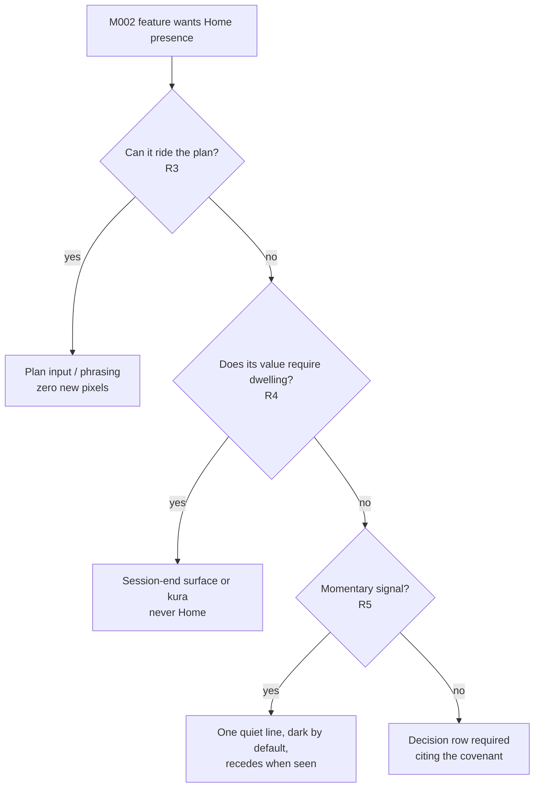

# Home Covenant — Requirements

## Summary

Ratify a founder-approved Home covenant — an identity sentence and five rules that protect what Home is for — plus a ledger of default Home lanes for the six known M002 claimants, inherited by each milestone unless a decision row justifies deviation. The pass is doc-only plus one small render test; no pixels change.

---

## Problem Frame

D152 absorbed the derived plan into the `last_complete` card, claiming the last of Home's focal capacity. The same-day red team graded the one-focal-zone contract B− on Home ("focal competition"), and card-interior creep happened within six days of D152 shipping — caught only because a manual design pass happened to run. Six M002 claimants are queued (stress rung, progress score, goals, roster, attack content, the deferred D151 readiness capture), and without standing rules each will open its own Home negotiation at ship time. Prior art says additive defaults without eviction end in card soup.

Founder dialogue (2026-06-11) settled Home's identity: calm and obvious, never overloaded with data, buttons, guilt, or stress; it should obviously start the next session, be trusted that it's the right one, and offer a quick custom escape. It also surfaced that deviations from the recommendation are not distrust — they happen when the founder knows something the plan doesn't (trying something new, fresh game-time evidence, less time than suggested). Trust grows by absorbing inputs, not by adding output surfaces.

---

## Key Decisions

- **Covenant over per-milestone negotiation.** Standing rules plus inherited defaults beat six ad-hoc allocation fights, especially as milestones increasingly ship through agent sessions without a full design walk each time.
- **Defaults, not promises.** Ledger lanes are renegotiable per milestone via a decision row. This is the right binding strength given the founder's explicit uncertainty about the product's year-out shape.
- **Home presence = consequence, not pixels.** The default integration channel for M002 features is the derived plan: inputs in, smarter sentence and launch out. D154 is the shipped proof — a flagship feature with zero new Home chrome.
- **Reflective content lives at session end.** Score reveals, goal movement, and ladder celebration belong to Complete/Review, where attention is already reflective and competition is zero. Steady-state Home shows no progress signals (founder-confirmed). The shipped D152 Recent-sessions consistency and felt-difficulty lines are classified as behavioral receipts, not progress signals — they stay in the R9 baseline census, and any promotion of them toward score/trend framing requires a decision row.
- **Input parsimony is a covenant rule, not a style preference.** The plan learns primarily from behavior; explicit asks must be near-zero cost and skippable, or clearly high-value to the user's future programming. Users never have to explain themselves.
- **Trust-building work is queued, not substituted.** The game-time observation input seam (the strongest lever on "trust it's the right session") is a separate follow-on brainstorm, not folded into this governance pass.

---

## Requirements

**The covenant (canon + decision row)**

- R1. Home's identity is ratified in canon, in the founder's words: Home exists to (a) calmly and obviously start the next session, (b) be trusted that it is the right session, and (c) offer a quick custom escape. No Home element may work against these three jobs.
- R2. The focal slot is session-lifecycle-only: only session lifecycle states (today: `resume`, `review_pending`, `draft`, `last_complete`, `new_user`) may occupy the primary card, chosen by precedence. The only non-lifecycle tenancy is a scheduled, expiring exception class (R8).
- R3. The default M002 integration channel is the derived plan: a feature is present on Home when it changes what the plan assembles, launches, or says. New Home pixels require their own decision row citing this covenant.
- R4. The genkan test governs admissibility: Home is a threshold, not a room. A feature whose value requires dwelling (studying a trend, browsing goals, reviewing a roster) fails Home placement by category — regardless of proposed footprint — and routes to session-end surfaces or a dedicated destination.
- R5. Periphery contract: steady-state Home carries at most one quiet line. Every peripheral signal defines its dark state — the condition under which it renders nothing — and recedes once seen or acted on. No dark state, no slot. The cap governs signals added under this covenant: the pre-covenant spine surfaces (plan line, carry-forward cell, the weekly read merged into Recent sessions, felt-difficulty lines) are grandfathered as-is until the R10 collapse trigger folds them into the single ranked peripheral line — but no new quiet line may be added while more than one already renders.
- R6. Input parsimony: the plan learns primarily from behavioral signals (sessions completed, ended-early, swaps, Setup choices — routing around the plan is itself a signal, never a prompt to explain). Any explicit ask is near-zero cost and skippable, or clearly high-value to the user's future adaptation and programming.

**The claimant ledger (defaults each milestone inherits)**

- R7. Default Home lanes for the six known claimants are recorded once, at ratification. Deviating from a lane requires a decision row citing the covenant rule it trades against. Each M002 milestone plan includes a one-line Home section citing its inherited lane (or the decision row justifying deviation); a milestone plan with no Home section is non-conforming.

| Claimant | Default lane |
| --- | --- |
| M002.2 stress rung | Plan input (steers assembly); rung movement surfaces at Transition/Complete, plus at most one quiet, receding Home line per R5 |
| M002.3 progress score | Complete/Review reveal; kura destination later; never a steady-state Home number |
| M002.4 goals | Plan lens (goal re-keys focus ordering and CTA phrasing); reflection at Review |
| M002.5 roster | Setup-time concern; Home reflects it only through plan phrasing (e.g. "Start pair passing session") |
| M002.6 attack/tactics | Plan vocabulary (focus names, drill content); no dedicated Home surface |
| D151 readiness capture | The one scheduled focal tenant (R8) |

- R8. The D151 weekly readiness check-in is the single approved scheduled focal tenant: it may claim the focal slot at most once per training week at its research-correct moment, is skippable without consequence, expires after that visit, and must demonstrably feed the plan it hands back — its answers steer assembly when readiness deviates, and an honest no-change week is a valid outcome, not a tenancy failure. A check-in whose answers can never influence the plan loses its tenancy. It claims the slot only when lifecycle precedence would otherwise resolve to `last_complete`; when `resume`, `review_pending`, or `draft` is present, the visit defers to the next qualifying open in the same training week and the weekly chance is not consumed. Its moment excludes the post-session window (per D151's capture research): if the week's first qualifying open immediately follows a session completion, the tenancy defers to the next open. The check-in card inherits the R9 card-interior and tap-target budget, asserted as a second case in the same render test when D151 ships.

**Enforcement**

- R9. A minimal render test pins the steady-state Home budget — steady-state meaning Home resolves to the `last_complete` primary card with no `resume`/`review_pending`/`draft` present; the test pins it with the periphery dark, the most common returning state. Budget dimensions: element count, tap-target count, and a card-interior line cap. A change that exceeds the budget must name what it evicts or amend the budget via decision row.
- R10. Heavier machinery stays behind named triggers: extract a pure focal-occupancy policy when D151 ships (first real rotation tenant); collapse the spine slots into the single ranked peripheral line at the third peripheral claimant; define a plan-phrasing composition rule (whose input wins the CTA and how modifiers stack) when the second plan-phrasing claimant ships; build the kura destination when two or more longitudinal surfaces exist; full CI ledger machinery only if the minimal test is repeatedly contested.
- R11. Ratification registers the covenant in the agent routing surfaces — the `docs/catalog.json` entry, the relevant `AGENTS.md` cold-start pack line, and a `.cursor/rules` pointer if planning shows agents missing it — so agent-shipped milestone work loads the covenant before touching Home; enforcement does not rest on the R9 census alone.

---

## Acceptance Examples

- AE1. **Covers R3, R7.** M002.3 planning proposes a score badge on Home. The inherited lane says Complete/Review reveal, never a steady-state Home number; the milestone plan's Home section is one line citing the lane. Shipping a Home pixel instead requires a decision row.
- AE2. **Covers R6, R8.** The weekly check-in claims the focal slot on the first qualifying open of a training week (no live lifecycle state, not immediately post-session). The founder skips it. It disappears until next week, never blocks starting a session, and skipping is not asked about.
- AE3. **Covers R5.** A session moves the stress rung. The next Home visit shows one quiet line; after it is seen (or after the next session completes), the periphery is dark again.
- AE4. **Covers R9.** A PR adds a fourth tertiary link to the `last_complete` card. The render test fails. The PR either removes an existing element or escalates with a decision row amending the budget.
- AE5. **Covers R1, R6.** The founder starts a custom session instead of the recommendation. No prompt, no "why?" — the session logs normally and feeds staleness and adaptation as behavioral signal.

---

## Success Criteria

- Each M002 milestone plan's Home section is one line citing an inherited lane, or a decision row justifying deviation — no open-ended Home design negotiation at ship time.
- Steady-state Home renders the same element census after M002.2 and M002.3 ship as it does today, unless a decision row changed the budget.

---

## Scope Boundaries

**Deferred for later**

- The game-time observation input seam (zero-typing, optional capture that steers next focus) — queued as the next brainstorm; the strongest trust lever surfaced in dialogue.
- The kura/Progress destination, the focal-occupancy refactor, the peripheral-line collapse, and full CI ledger machinery — each waits behind its R10 trigger.
- Custom-escape polish — the escape stays as-is.
- The =1 vs ≤1 focal question (may Home ever render an empty focal slot) — open, revisit if an empty-state proposal arrives with evidence.

**Outside this product's identity**

- A dashboard Home: steady-state progress numbers, comparative stats, or engagement-bait surfaces.
- Mandatory input gates anywhere on the pre-session path.
- Guilt surfaces (streak pressure, missed-week framing) on Home.

---

## Dependencies / Assumptions

- Depends on `docs/decisions.md` (D150–D154) and the design canon (`docs/research/brand-ux-guidelines.md` §7.1, `docs/research/japanese-inspired-visual-direction.md` §4).
- Assumes the founder remains the primary user through the D130 window while milestones increasingly ship via agent sessions — the covenant's value scales with unattended shipping.
- Assumes behavioral signals are sufficient adaptation input near-term; the queued game-time seam adds input bandwidth without violating R6.

---

## Outstanding Questions

**Deferred to planning**

- Where the ledger lives (the decision row itself, canon §7.1, or both with one canonical home).
- Exact budget numbers for the R9 render test (element count, tap targets, card-interior lines) — set from the current shipped census.
- Whether a "Why this session?" disclosure on the focal card is worth its one tertiary slot — only if founder-use evidence shows the recommendation being doubted rather than overridden for input reasons.

---

## Sources / Research

- `docs/ideation/2026-06-11-home-focal-headroom-ideation.md` — the 48-candidate ideation this brainstorm develops; includes the external prior-art digest (Oura, Headspace, Strava failure modes, Smart Stack, NYT, calm-tech, quiet-dark cockpit).
- `docs/design/reviews/2026-06-11-red-team-design-language-review.md` — the B− one-focal-zone grade and Home focal-competition finding.
- `docs/design/reviews/2026-06-11-design-language-deep-pass.md` — the card-interior creep incident and same-day fixes.
- `docs/brainstorms/2026-06-03-m002-thin-spine-and-milestone-series-requirements.md` — the M002 series map generating the claimant list.
