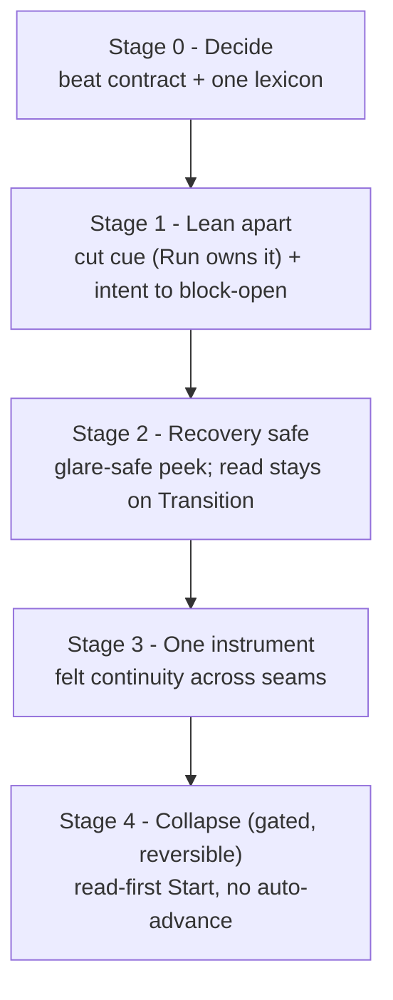

# Run-Flow Beat Contract and Staged De-Duplication Requirements

## Summary

Make the run flow read as one calm instrument by giving each beat one job under a single authored **beat contract**, rolled out in five risk-ordered stages where each de-risks the next; the earlier stages are cheaply reversible, while the Stage 4 collapse is a higher-cost rollback. Stage 0 ratifies the contract plus a shared label lexicon; Stage 1 cuts the duplicated coaching cue and relocates the rung-intent line to the block-opening; Stage 2 adds a glare-safe recovery peek of the full read on Run while the read stays homed on Transition; Stage 3 threads felt continuity across the seams; Stage 4 collapses Transition into a read-first, on-demand preview (the athlete taps Start when ready, with no auto-advance, so a resting athlete is never rushed). The full instruction read always has exactly one home, which migrates to Run's preroll only at the Stage 4 collapse.

Founder steer this session: **as minimal as possible**, and the staging is what keeps an ambitious change safe.

---

## Problem Frame

The founder reported the run-flow screens have "WAY too much text and fonts ... super messy." A 2026-06-23 calm pass tightened Transition, but the holistic read is structural: **Transition's body is a near-superset of Run's body one tap apart.** The coaching cue renders under "Cue" on Transition and again as "Now" on Run (and a third time behind Transition's "More cues"); the rung-intent line is rung-generic (identical for every drill on a rung) on a drill-specific screen; labels drift screen to screen ("Now" vs "Cue", "Swap" vs "Swap drill", bare `3/5` vs `Next: 3/5`).

These are all symptoms of one missing thing: there is no contract for what each beat carries, so content leaks across beats. Transition and Run were deliberately built as mirrors to fix truncated preview text (the dress-rehearsal rationale documented in app/src/screens/TransitionScreen.tsx); the fix overshot into duplication. The cost is paid every drill, several times a session, by a winded athlete who can absorb one or two items, not a paragraph.

---

## Key Decisions

- **The spine, not point fixes.** Every change hangs off one beat contract that assigns each athlete-facing run-flow field exactly one full-weight home. The duplication, density, and label drift are symptoms of the unwritten contract, so the contract is the durable fix that keeps later stages from regressing.
- **Reverse the mirror.** Transition complements Run (setup-read + decide) instead of mirroring it. This deliberately reverses the earlier "Transition mirrors Run" treatment (the dress-rehearsal rationale in app/src/screens/TransitionScreen.tsx).
- **Cut the cue from Transition outright.** No inline cue, no collapsed "More cues" fallback on Transition; the cue's only home is Run's "Now," literally the next screen. Founder-confirmed.
- **Relocate, do not cut, the rung-intent line.** It shows once at the block-opening (the first Transition where a focus block appears), then recedes. Keeps the D163 value, kills the per-drill repetition. This is a D163 revisit.
- **Single read-home that migrates.** The full instruction read lives on Transition through Stages 1-3 and migrates to Run's preroll only when Stage 4 collapses Transition, so Stage 2 never creates a second copy.
- **Staged, reversible, founder-gated; order is load-bearing.** Continuity (Stage 3) is only clean after de-duplication (Stage 1); collapse (Stage 4) is only safe after Run can surface the read on demand (the Stage 2 recovery peek). The founder has confirmed the decide-step is ~always "start," so the collapse premise is validated; the Stage 4 gate is regression-safety, not a go/no-go on the premise. The decide-step behavior is cheap to reverse, but the route collapse plus the read migration is a higher-cost rollback (route + continuity + moving the read back to Transition), so "reversible" applies in full only to the decide-step behavior, not the route change.
- **Canonical action label is "Start" (2026-06-23 mock review).** The decide-step CTA reads "Start" everywhere in the new design ("Start ›" on the collapsed get-ready); "Start next block" and "GO" are retired. Settles the action half of the Stage 0 lexicon.
- **Stage 4 collapse is read-first and never auto-advances (2026-06-23 mock review).** The collapsed get-ready leads with the read + intent and a single Start; it does not fire on its own, so a tired athlete can rest as long as they want between blocks. The 3·2·1 count runs only after Start, on the cockpit — nothing is read while a timer counts down. Two auto-firing variants (a muted count digit; an ambient progress ring) were mocked and cut for rushing rest. This also removes the Stage-4 read-quality risk the review flagged.
- **Contract as a doc + light lint, not a framework.** A `BeatBody`-style enforcement primitive is deferred; a doc plus a pinned-string test is enough for one user.

### The beat contract (target end-state)

Each field has exactly one full-weight home; some beats may carry a demoted echo; the rest must not render it.

| Field | Full-weight home | Demoted / on-demand | Must not render |
|---|---|---|---|
| Drill title (anchor) | all beats | — | — |
| Eyebrow (role / skill) | Transition + Run | — | Drill Check |
| Coaching cue (`coachingCues[0]`) | Run ("Now") | behind Run's "Show more cues" | Transition, Drill Check |
| Full instruction read (`courtsideInstructions`) | Transition (Stages 1-3) → Run preroll (Stage 4) | Run "peek setup" (recovery only) | the beat that is not the current home |
| Rung intent ("what this rung trains") | block-opening Transition (Stages 1-3) → first drill's get-ready (Stage 4) | — | mid-block Transition, Run live face, Drill Check |
| Duration | Transition | — | Run live face |
| Just-finished receipt | Drill Check (Transition only when Drill Check is bypassed) | — | both beats for one drill |
| Difficulty tag + counts/streak | Drill Check | — | Run, Transition |

---

## Requirements

**Stage 0 - Beat contract + lexicon**

- R1. A canonical run-flow beat contract is authored as a durable doc that, for every athlete-facing run-flow field, names exactly one full-weight home beat, any demoted/on-demand beats, and the beats that must not render it (the table above is the contract).
- R2. The contract is the reference future run-flow features consult to answer "which beat may carry field X" — a lookup, not a re-litigation.
- R3. A single run-flow lexicon defines one canonical label per concept (action label = "Start", cue label = "Now", swap, shorten, block counter) applied across Run / Transition / Drill Check, with a test pinning the canonical strings so drift cannot silently return.
- R4. The contract is enforced with light lint/tests, not a new layout framework.

**Stage 1 - Lean the beats apart**

- R5. Transition renders no coaching cue at all — no inline cue section and no collapsed fallback; the cue renders only on Run as "Now".
- R6. The rung-intent line renders only on the first Transition where a focus block appears, and not on subsequent transitions within that block; Run's live face never renders it.
- R7. After Stage 1, a mid-block Transition body contains only: the next title with eyebrow and duration, the full setup read, and the decide footer — nothing duplicated from Run.
- R7b. Stage 1 removes Run's existing inline full-read renderings (the segment-0 inline instructions and the "Show full instructions" disclosure) so the full setup read is homed only on Transition and Run keeps just the one-cue "Now"; Stage 2's recovery peek (R9) later restores on-demand access.

**Stage 2 - Make recovery safe**

- R8. Through Stage 3 the full-weight setup read stays homed on Transition; Stage 2 does not move it to Run. Stage 2's only Run-side change is the recovery peek (R9). The preroll full read arrives only at the Stage 4 migration, building on the existing segment-0 inline behavior — which today exists only for segmented drills (non-segmented drills currently route the full read to a "Show full instructions" disclosure), so the preroll read is net-new for those drills, not a free generalization.
- R9. A deliberate, large, positionally-stable, one-touch "peek setup" affordance lets a mid-rep athlete recover the full setup without hunting a small disclosure; it is recovery, not a default re-read. Peeking overlays the read while the block timer keeps running (unlike Swap/Shorten, which pause) and dismisses on tap back to the one-cue cockpit.
- R10. The full instruction read has exactly one home at any time: Transition through Stages 1-3, migrating to Run's preroll only at the Stage 4 collapse. No stage shows the full read in two beats at once.

**Stage 3 - One instrument**

- R11. The sequence reads as one continuous instrument: the title and just-finished receipt thread through the beat boundaries (preroll into Run) rather than re-instantiating per route. The default treatment is continuity-by-stillness — identical element positions and typography across the seam so nothing visibly animates — and the reduced-motion path is that same static layout; any explicit animation is added only if stillness proves insufficient. Continuity never delays the timer.
- R12. The just-finished receipt renders once per drill: on Drill Check where it shows, and on Transition only for blocks that bypass Drill Check (warmup/technique/wrap/skipped). It is never rendered on both beats for the same drill. Drill Check survives the Stage 4 collapse, so its receipt home carries through.

**Stage 4 - Collapse (reversible, regression-gated)**

- R13. The decide-step is read-first with a single dominant **Start** control and does not auto-advance: the athlete reads the setup and taps Start when ready, so resting between blocks is never interrupted by a timer. Swap and skip are reachable behind a clearly cancelable "Adjust"; the tired-athlete escape (Shorten) is a top-level CTA-width control, not behind Adjust. The 3·2·1 count-in runs only after Start, on the cockpit, never on the read surface.
- R14. After a short dogfood window confirms no regression (no stranded reads, no lost adjustments), the forced Transition route collapses into a read-first on-demand preview: Drill Check flows into Run's get-ready, which renders the full setup read, the block-opening intent (R15), and the Start / Adjust / Shorten controls. The get-ready does not auto-advance and carries no count-in; the 3·2·1 runs only after Start, on the cockpit, so the read is never raced against a timer.
- R15. The block-opening intent (R6) keeps a home after collapse — on the first drill's get-ready for that block — so relocating it in Stage 1 does not strand it in Stage 4.

**Invariants honored across all stages**

- R16. Run stays the one-cue DO-CONFIRM cockpit (D163 / courtside-copy rule 12a); no second live cue at glare distance.
- R17. No raw rung numbers, positions, or trends render anywhere (D157); run-flow copy stays descriptive, never a gate or score (D154).
- R18. Instruction copy stays within the ~45-word ceiling (rule 14) and uses no em-dashes in user-visible strings (rule 4); the shared run-family header, no-Back-button, and no-End-session-on-the-live-face invariants hold (D153).

---

## Key Flows

- F1. Mid-block transition (Stage 1 end state).
  - **Trigger:** Athlete finishes a drill that is not the last in its focus block.
  - **Steps:** Drill Check (reflect + tag, shows the just-finished receipt) → Transition shows next title/eyebrow/duration + full setup read + decide footer (no cue, no intent line) → Start → Run shows title + eyebrow + "Now" cue + timer.
  - **Covers:** R5, R6, R7.
- F2. Block-opening transition (Stage 1 end state).
  - **Trigger:** The next drill is the first of a new focus block.
  - **Steps:** Same as F1, plus the rung-intent line appears once under the title.
  - **Covers:** R6.
- F3. Collapsed flow (Stage 4 end state).
  - **Trigger:** Athlete finishes a drill after collapse has shipped.
  - **Steps:** Drill Check → Run get-ready carries the full read (and block-opening intent for a new block) with a Start control and no auto-advance (rest as long as needed); tapping Start runs the 3·2·1 on the cockpit; Shorten sits at top-level CTA width while "Adjust" exposes swap/skip; "peek setup" recovers the read mid-rep.
  - **Covers:** R8, R9, R13, R14, R15.

---

## Acceptance Examples

- AE1. **Given** a focus block of three drills, **when** the athlete reaches the first drill's Transition, **then** the rung-intent line shows; **when** they reach the second and third drills' transitions, **then** no intent line shows. Covers R6.
- AE2. **Given** any Transition, **then** no coaching cue appears anywhere on it; **when** the athlete starts the drill, **then** the cue appears on Run as "Now". Covers R5.
- AE3. **Given** Stages 1-3 are live (pre-collapse), **then** the full setup read appears on Transition and not in Run's live body; **given** Stage 4 has shipped, **then** the full read appears at Run's preroll and Transition is no longer a forced screen. Covers R10.
- AE4. **Given** the read-first collapsed get-ready, **when** the athlete does nothing, **then** nothing auto-advances and the read stays up; **when** they tap "Start", **then** the 3·2·1 runs on the cockpit and the block begins; **when** they tap "Adjust", **then** swap and skip become available (Shorten stays at top-level CTA width). Covers R13.

---

## Success Criteria

- Transition reads clean on founder dogfood — no "too much text" feeling, and nothing the athlete must re-read one tap later.
- Each authored field appears in exactly one full-weight place; siting a new field is a contract lookup, not a debate.
- The sequence feels like one instrument, not three page-loads.
- After collapse, between-drill friction drops with no stranded reads and no lost adjustments.
- All invariants (R16-R18) hold throughout.

---

## Scope Boundaries

**Deferred for later**

- A `BeatBody` layout primitive that enforces the contract in code — the doc + light lint is enough for one user now.
- Decision-control de-duplication (swap/shorten/skip living on both Transition and Run) — a later clause of the same contract.
- `externalFocusCue` as a dedicated typed cue field — a follow-on once the cue's single home is settled.
- A peripheral phase-signature system (color/tone/haptic) beyond whatever Stage 3 continuity needs.

**Outside this pass's identity**

- One cue per focus block instead of per drill — breaks the rule-13 triple-only readability contract.
- Inferred or auto-selected difficulty tags — corrupts D130 sole-evidence honesty (a warmed default biases the founder's own reflection).
- A propped-up / across-court phone redesign — a useful reframing lens, not a change built here.

---

## Dependencies / Assumptions

- D163 revisit: relocating the rung-intent line and removing the Transition cue both touch D163's shipped Transition placement; the change must land as an explicit decision, not a silent revert.
- Stage 4 reroutes the flow and intersects the D137 canonical pre-run spine and `routePaths`; collapse must preserve the get-ready and the tired-athlete escape.
- Founder is the sole evidence source (D130); each stage is gated by founder dogfood before the next.
- Assumption (verify in planning): the existing segment-0 inline-read behavior on Run generalizes to a full preroll read for all drills.

---

## Outstanding Questions

All product decisions for the spine are settled this session; the rest are planning-time details.

**Deferred to planning**

- Lexicon canonical labels (R3): planning surfaces the concrete current-vs-canonical string table (swap / shorten / block-counter prefixes) for a quick founder pass. The cue label is already settled as Run's "Now" by the Stage 1 cue cut, and the action CTA is settled as "Start" ("Start ›" for the collapsed get-ready); "Start next block" and "GO" are retired.
- The exact "peek setup" affordance shape and placement on Run (R9).
- The dogfood window length and the regression checks that gate the Stage 4 collapse (R14).

### From 2026-06-23 review

- **Program may exceed the "as minimal as possible" steer** — Summary / Requirements (P1, product-lens + scope-guardian, confidence 100)

  Only Stage 1 directly removes text for the founder's "too much text" complaint; the Stage 0 governance (contract doc + lexicon + lint), Stage 3 motion bridge, and Stage 4 route collapse serve the doc-introduced "one instrument" goal. Reviewers flag that a five-stage program sits in tension with the explicit "as minimal as possible" steer. The founder deliberately chose the full staged spine this session, so this is a reaffirm-or-trim call, not a defect: commit Stage 1 and gate Stages 2-4 on Stage-1 dogfood, or confirm the full spine as intended scope.

- **Stage 4 read quality — resolved by the read-first collapse (2026-06-23 mock review); block-opening detection still a planning detail** — Stage 4 / R15 (was P1; read-quality half now closed)

  The original concern was that collapse moved the full read into a timed count-in. The collapse is now read-first with no auto-advance and no count-in on the read surface (R13/R14), so there is no read-under-timer to gate on — that half is resolved. Remaining for Stage-4 planning: define how Run detects a block-opening to site the post-collapse intent home (R15), and the intent's recede timing; until that surface is specified, treat R15 as a tracked risk rather than a guarantee.

- **Reconcile with the in-flight M002.2 technique-how spine** — Dependencies / Stage 4 (P2, product-lens, confidence 75)

  The pass opens a separate run-flow track without sequencing against the half-shipped M002.2 technique-how spine (externalFocusCue, Run/Drill Check depth, the less-offer Review read), and Stage 4 collapses Transition — the READ-DO surface M002.2 chose as its technique-how home. Decide whether the on-demand preview can carry READ-DO technique-how depth, or whether Transition survives as the thin setup+decide beat (stop at Stage 3), and add a one-line sequencing note on whether this density pass precedes or follows finishing the M002.2 spine.

---

## Sources / Research

- docs/ideation/2026-06-23-run-flow-ux-ideation.md — the ideation this brainstorm commits (7 survivors + the "One Instrument, One Contract" meta-direction).
- Code: app/src/screens/RunScreen.tsx, app/src/screens/TransitionScreen.tsx, app/src/screens/DrillCheckScreen.tsx, app/src/screens/transition/useTransitionController.ts.
- Canon: .cursor/rules/courtside-copy.mdc (READ-DO / DO-CONFIRM, rules 12a / 13 / 14), docs/specs/m001-courtside-run-flow.md, docs/research/brand-ux-guidelines.md §7.4-7.x, docs/decisions.md (D153, D154, D157, D163, D137, D127).
