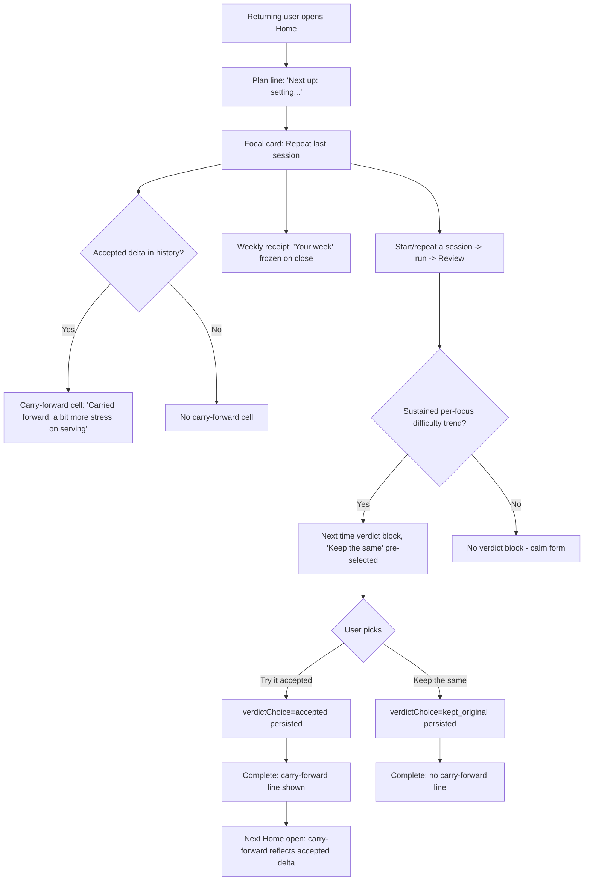
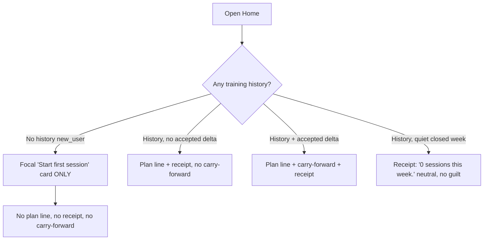

# Dogfood Report — M002.1 Thin-Spine + Adaptation

> Diff-scoped browser QA of the M002.1 changeset (since `4a79883`) on `main`. Generated by `/ce-dogfood-beta` on 2026-06-04, driven through `agent-browser` against the live dev server.

## Scope Note

This repo uses single-branch flow on `main` (per `AGENTS.md`), and the M002.1 work is already committed to `main`. The skill's literal "diff branch vs main" does not apply, so the dogfood was scoped to the **M002.1 changeset** (commits since the docs baseline `4a79883`) and run in place on `main`. Fixes follow the repo's commit-to-main convention.

## Diff Summary

- **Home thin-spine cluster** — a quiet plan-for-today line above the focal card (`PlanForTodayLine`), a non-temporal carry-forward cell below it (`CarryForwardCell`), and a frozen weekly receipt section (`WeeklyReceiptSection`), all derived on demand via `composePlan` / `composeReceipt` / `composeCarryForwardSummary`.
- **Review verdict** — a "Next time" accept/keep block that appears only when a sustained per-focus difficulty trend is detected (`replayAdaptation` → `computeVerdictOffer`); the user's choice is the only new persisted input.
- **Complete carry-forward** — an accepted-only carry-forward line on the completion screen.
- **Derive-don't-persist (`D150`)** — plan, backlog, carry-forward, receipt, and felt-difficulty proxy are pure formatters over captured records; no new Dexie tables. The only new persisted data is `offeredDelta` + `verdictChoice`, additive fields on `SessionReview` (Dexie v7).
- **Felt-readiness deferred (`D151`)** — v1 relies on the derived felt-difficulty proxy; no self-reported readiness prompt.

## Personas

Source: `STRATEGY.md` "Who it's for".

- **Serious amateur 2s/beach player (founder + Seb, `D130` founder-use mode)** — already invests real time in the sport, wants to practice but isn't sure what to run, loves progressive improvement, and is allergic to AI slop / random day-to-day work. Hired Volleycraft to offload session planning, capture data session-to-session, and *see training compound over time*. Cares most that the app reads as calm and courtside-fast, and that adaptation is **visible** ("it's adjusting to me") without nagging or guilt.

## Flows Tested

### Multi-session adaptation loop (the load-bearing journey)

### Cold-start vs history states

## Test Matrix & Results

| # | Flow | Journey / Scenario | Status | Issue | Fix | Commit |
|---|------|--------------------|--------|-------|-----|--------|
| F1 | Cold-start | Brand-new user Home: fresh-start, no receipt, no carry-forward | Fixed | Plan line rendered on empty cold-start, competing with focal CTA | Gate `showPlanLayer` on `primary !== 'new_user'` | `096d1c1` |
| F2 | History | Returning user w/ history: plan line + "Your week" receipt, no carry-forward | Pass | Minor "this week" label nuance (deferred) | - | - |
| F3 | Adaptation | Accepted delta: clustered plan + carry-forward + receipt, no contradiction | Pass | - | - | - |
| F4 | Review | Sustained too_hard trend → "Next time" block, accept path persists `accepted` | Pass | - | - | - |
| F5 | Review | No trend → no verdict block (calm, no filler), RPE still present | Pass | - | - | - |
| F6 | Complete | Accept → carry-forward line; keep-original → no line | Pass | - | - | - |
| F7 | Receipt | Quiet/zero-session closed week: "0 sessions this week.", no guilt copy | Pass | - | - | - |

## What Was Fixed

### Thin-spine plan line on brand-new cold-start — `096d1c1`
- **Symptom:** On the empty `new_user` Home, the plan-for-today line ("First up: passing after a warm-up. Serving and setting are queued.") rendered *above* the focal "Build your first beach session." card. For a user who has never trained, this is a generic fresh-start assertion that duplicates the "start" intent and competes with the single focal CTA — against the calm/shibui posture and `P12` (one action / one signal).
- **Root cause:** `showPlanLayer` only excluded `review_pending`. `composePlan` always returns a (fresh-start) plan, so the line rendered for `new_user` too, even though there is no history to derive a meaningful "next up" from.
- **Fix:** `app/src/screens/HomeScreen.tsx` — `showPlanLayer = flags.plan !== null && primary !== 'review_pending' && primary !== 'new_user'`. Carry-forward is already null for `new_user`, so only the plan line is affected. This mirrors the receipt, which is already history-gated.
- **Regression test:** `app/src/screens/__tests__/HomeScreen.precedence.test.tsx` — `new_user` hides the `"Your plan"` region; `last_complete` shows it. Both fail before the gate change and pass after.

## Console Errors

None across all 7 flows (checked via `agent-browser errors` after each navigation and submit).

## Human Verifications

None applicable — the M002.1 surface is fully local-first (Dexie/IndexedDB); no OAuth, email, payments, or SMS legs.

## Decisions for a Human

None. The one issue found was a small, low-risk, single-file gating fix consistent with existing patterns, so it was auto-fixed. One minor copy nuance is deferred (below), not escalated.

### Deferred (not escalated, low severity): receipt "this week" label
- The frozen weekly receipt reflects the **last completed week** but labels it "this week." For a user who opens within the current week (the common case) this reads naturally; for a lapsed user opening 10+ days later it is slightly inaccurate ("0 sessions this week" when they mean the last completed week). Defensible for the common path and purely a copy nuance — left as-is. Worth a future copy pass if lapsed-user framing becomes a priority.

## Learnings

- **Verify selection state before filing a verdict bug.** A ref-based `agent-browser click` on a grid `ToggleChip` reported success but did not fire the React `onClick` (the verdict radio stayed `checked=false`). A direct DOM `.click()` flipped it correctly and the accept path persisted `accepted` end-to-end. The component was fine; the harness click was the artifact. Confirming the post-click `aria-checked` state (and that the RPE chips registered) prevented a false "Try it is broken" report. For grid/chip radios, prefer a DOM-click eval or re-snapshot-and-verify over trusting a single ref click's exit code.
- **The derive-don't-persist (`D150`) model dogfooded cleanly.** Seeding only captured records (plans + execution logs + reviews) and reloading reproduced every Home/Review/Complete state with no migration or table setup — the formatters recomputed plan, receipt, carry-forward, and verdict offer on demand. This made state coverage fast and is good evidence the architecture holds.
- **Cold-start is its own design state.** Derived "what's next" surfaces should be history-gated the same way the receipt is; a formatter that always returns *something* will leak generic copy into the empty state and quietly erode the single-focal-zone discipline.

## Final Status

**Ready.** The M002.1 thin-spine + adaptation changeset is functionally correct and experientially on-system across all 7 dogfooded flows. The adaptation loop is coherent and visible (accepted delta carries forward without contradicting the plan line), the Review verdict respects the safe `keep` default and stays silent without a trend, and the weekly receipt holds its anti-guilt framing on quiet weeks. One cold-start paper cut was fixed (`096d1c1`) with a regression test. Full gate green afterward: typecheck, lint, `architecture:check:strict`, 2617 tests, diagnostics report. One low-severity copy nuance (receipt "this week" label for lapsed users) is documented and deferred.
