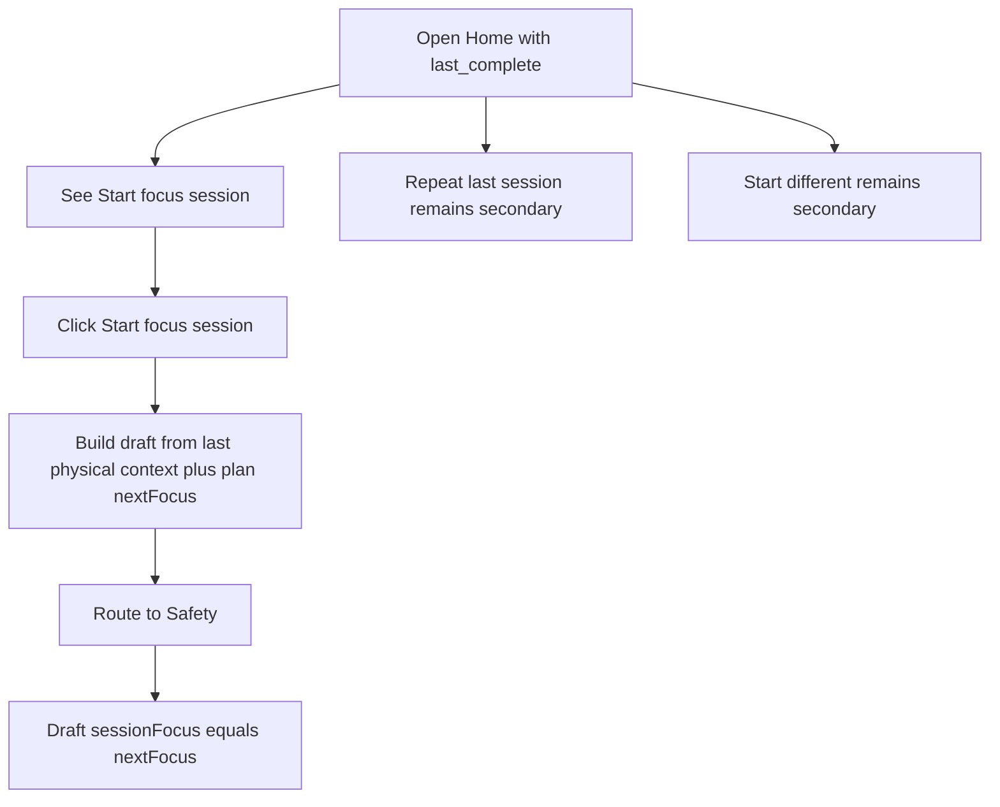
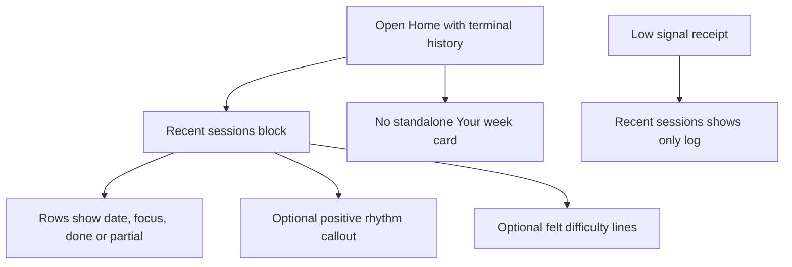

# Dogfood Report — Home Plan Coherence

> Diff-scoped browser QA of the current Home Plan Coherence working tree on `main`, generated by `/ce-dogfood-beta` on 2026-06-05. This repo uses single-branch flow, so the scope is the current working-tree diff rather than a separate feature branch.

## Diff Summary

- Home `last_complete` focal card now launches the derived plan: primary CTA is `Start [focus] session`, while repeat and start-different are secondary.
- Plan ordering now uses terminal trained sessions (with block overrides) so the next focus stays coherent with visible Recent sessions; adaptation remains eligible-review gated.
- Weekly receipt presentation moved into the Recent sessions block; the standalone `Your week` card was removed from Home.
- Governance docs record `D152` and current-state history for the Home coherence change.

## Personas

- **Serious amateur 2s/beach player (founder + Seb, `D130` founder-use mode)** — wants Volleycraft to offload planning, turn session history into a clear next action, and feel like structured progression without AI slop, extra typing, guilt, or dashboard noise. Source: `STRATEGY.md`.

## Flows Tested

### Plan Launch Flow

### History And Receipt Flow

## Test Matrix & Results

| # | Flow | Journey / Scenario | Status | Issue | Fix | Commit |
|---|------|--------------------|--------|-------|-----|--------|
| DF1 | Returning Home | Focal CTA is `Start [focus] session`; repeat/different secondary; no duplicate plan region | Pass | - | - | - |
| DF2 | Plan launch | Clicking `Start [focus] session` saves focus-steered draft and routes to Safety | Pass | - | - | - |
| DF3 | Fallback | Missing prior context falls back to Setup with no saved draft | Pass | - | - | - |
| DF4 | Precedence | No plan-launch CTA on new_user, draft, review_pending, or resume | Pass | - | - | - |
| DF5 | Trained ordering | Skipped/no-review terminal sessions move staleness and avoid false fresh-start copy | Pass | - | - | - |
| DF6 | Merged history | Recent sessions carries positive/felt lines; no standalone Your week or zero contradiction | Pass | - | - | - |
| DF7 | Low-signal receipt | Recent sessions shows just the log when receipt has no useful signal | Pass | - | - | - |

## What Was Fixed

No code fixes were needed during this dogfood pass.

## Console Errors

None observed across the tested scenarios.

## Human Verifications

None expected; this flow is local-first and browser-drivable.

## Paper Cuts By Persona

- Serious amateur 2s/beach player: no sharp paper cuts found. The Home focal card keeps one primary action, the secondary actions are visually subordinate, and the merged Recent block avoids redundant or guilt-inducing receipt copy.

## Decisions for a Human

None.

## Learnings

The Home coherence change dogfoods best when tested through seeded week-boundary states, not just component tests. The most important product proof is that the same visible terminal history drives both the Recent sessions log and the next-focus plan copy.

## Final Status

Ready from this diff-scoped dogfood pass. All seven scenarios passed, no console errors appeared, and no human-verification legs were required.

## Post-Review Fixes (2026-06-11)

A founder-requested code review after this dogfood pass surfaced design critiques (not functional failures); all were fixed in the same working tree:

1. **Receipt visibility restored with a temporal label** — the merged Recent header had reduced the weekly read to a rare strong-only callout. It now renders "Last week: N sessions" for steady and strong banded weeks (strong appends "— ahead of your usual rhythm"); low-history (`absolute`) and quiet-zero reads still render nothing (anti-guilt). The explicit label is what removes the frozen-week-vs-Today contradiction the strong-only merge was avoiding.
2. **Focal card header labeled** — metadata now reads "Last session: Pair + Net · 15 min" so it can't be read as describing the session the "Start [focus] session" CTA launches.
3. **Backlog line restored** — the card renders "Then: serving and setting." under the focal CTA, keeping the R3 queue visible after the standalone plan line was absorbed.
4. **Dead fallback removed** — `nextFocus` is now a required prop on the `last_complete` card; the unreachable Repeat-as-primary fallback layout was deleted.
5. **Repeat/launch symmetry** — one-tap Repeat moved into `app/src/services/planLaunch.ts` (`repeatSession`), sharing the build-and-save seam with `startPlanSession`.
6. **Delta gap named** — the accepted-verdict-delta-not-applied-to-assembly gap is now recorded in `D152` and the M002.1 plan doc as a named v1 gap owned by M002.2.
