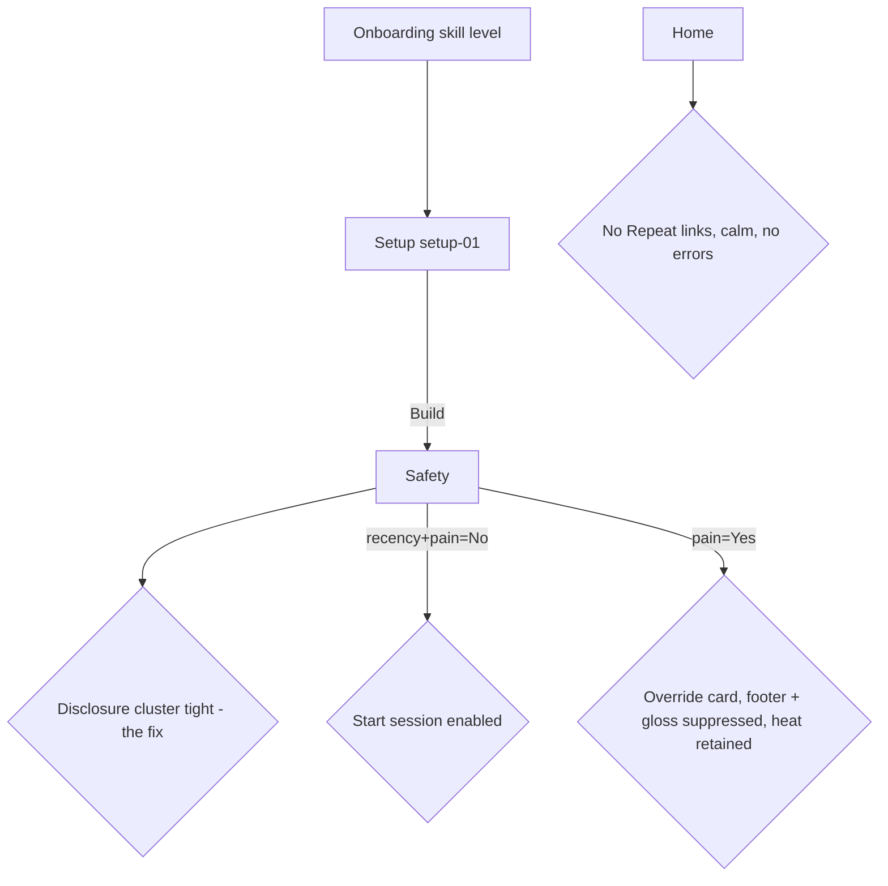

# Dogfood — Safety disclosure spacing + D158 pre-run surfaces (2026-06-12)

**Branch:** `main` (single-branch flow). Diff-scoped to the working-tree Safety fix plus the recently shipped D158 Home/Setup restructure and the resolved-line atomic-focus fix (`d15986a`, `eae68ae`, `7446c4d`).
**Verification tooling:** `agent-browser` against the local Vite dev server (`localhost:5173`, HMR serving the uncommitted fix). Frontend pass = `ce-frontend-design` Module C (existing app). QA = `ce-dogfood-beta`.

## Persona evaluated against

Self-coached amateur beach player, courtside, mobile-first, low-typing, wants calm + glanceable (source: `AGENTS.md` learned preferences + `docs/vision.md`). Judged for paper cuts from that user's eyes.

## Diff summary

- **Fix (this pass):** `app/src/screens/SafetyCheckScreen.tsx` — the two secondary disclosures (`Heat & safety tips`, `How sessions adapt`) were each in their own top-level `<section>`, so the body's `gap-6` (24px) stacked on top of each trigger's `min-h-[54px]` tap padding → ~58px of air between two thin text links, more separation than the questions above them got (inverted hierarchy; founder-flagged). Both triggers now share one `<section className="flex flex-col">`: one `gap-6` separates the cluster from the pain question; the two 54px tap targets sit adjacent in a calm settings-list rhythm.
- **Shipped earlier (re-exercised):** Setup setup-01 frame (resolved line + micro-label headings), Setup resolved-line atomic focus (`previewDraft.context`-sourced), Home v2-04 repeat-removal.

## Flows tested

## Test matrix & results

| # | Scenario | Result | Notes |
|---|----------|--------|-------|
| 1 | Setup setup-01: resolved line on top, micro-labels (PLAYERS/NET/TIME/FOCUS) | **Pass** | `Solo + Net · 15 min · Recommended focus`; Callout agrees (`about 15 min`). Screenshot `/tmp/dogfood-setup-01.png`. |
| 2 | Setup resolved-line atomic focus + minutes agreement | **Pass** | Covered by this surface + the 24 unit tests / mutation check from `7446c4d` (same code path). |
| 3 | Safety disclosure cluster (the fix), collapsed | **Pass** | Two expanders adjacent (~34px between labels) vs prior ~58px; reads as one secondary cluster. Screenshot `/tmp/dogfood-safety-cluster.png`. |
| 4 | Safety disclosures open correctly | **Pass** | Heat tips → "Stop immediately" + prevention bullets; "How sessions adapt" → contract copy; chevron rotates; no layout break with both open. Screenshot `/tmp/dogfood-safety-expanded.png`. |
| 5 | Safety gating: Yesterday + No → Start session enabled | **Pass** | CTA enabled; missing-hint clears. |
| 6 | Safety pain=Yes branch | **Pass** | PainOverrideCard shows; footer `Start session` hidden; `How sessions adapt` gloss suppressed (`painFlag !== true` gate); heat tips retained (intended — heat safety is pain-independent). Single-section wrapper handles the one-child case with no regression. |
| 7 | Home: no Repeat affordances, calm, no console errors | **Pass** | `Repeat` count = 0; draft-resume card renders clean; `agent-browser errors` empty. Screenshot `/tmp/dogfood-home.png`. |

## What was fixed

One change — the disclosure-cluster grouping above. Verified by `tsc -b`, `eslint` (incl. the `screen-shell-zone-spacing` rule), and the full `SafetyCheckScreen.test.tsx` suite (19 passed). No regression test added: the change is presentational (DOM grouping, no new behavior or query surface) and the existing role/text-based Safety tests already pin the disclosures' presence and toggle behavior.

## Paper cuts (by persona)

- **None blocking.** The two disclosure links are both accent-colored and sit adjacent without a divider; at the 54px tap-target rhythm they still read as a clean list, so no divider was added (keeps the shibui surface calm). Re-evaluate only if a third disclosure ever joins the cluster.

## Decisions for a human

- None. The fix is small, contained, and reversible.

## Not covered (acceptable)

- **Home `last_complete` v2-04 card** and the **Safety steering *line*** require a fully completed + steered real session (timer-driven run through all blocks → review → complete). Out of scope for a spacing pass; both were verified during the D158 ship. The "How sessions adapt" gloss state was reproduced here by seeding one `steeredFocus` plan row in the dev-profile IndexedDB (removed after the pass).

## Final status

**Ready.** The founder-flagged Safety spacing is fixed and verified in-browser; the adjacent D158 surfaces (Setup, Home) re-exercised clean with no console errors. Shipping to the Cloudflare Worker so it's live on mobile.
