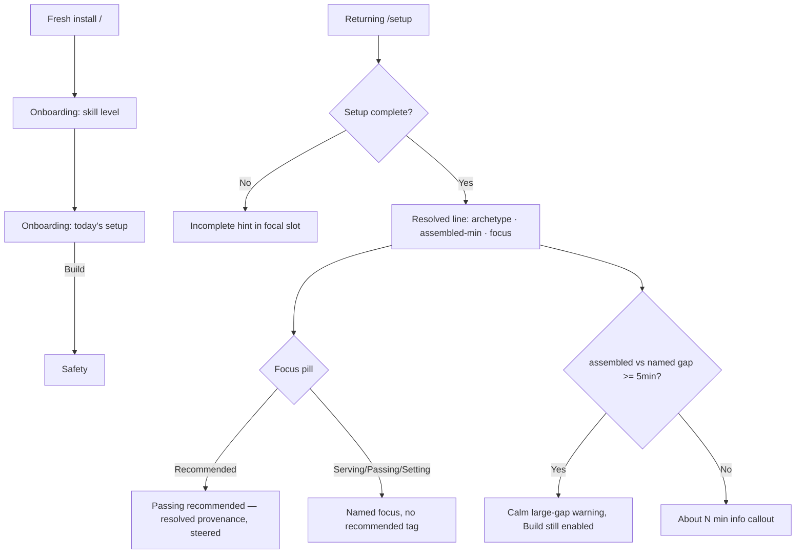
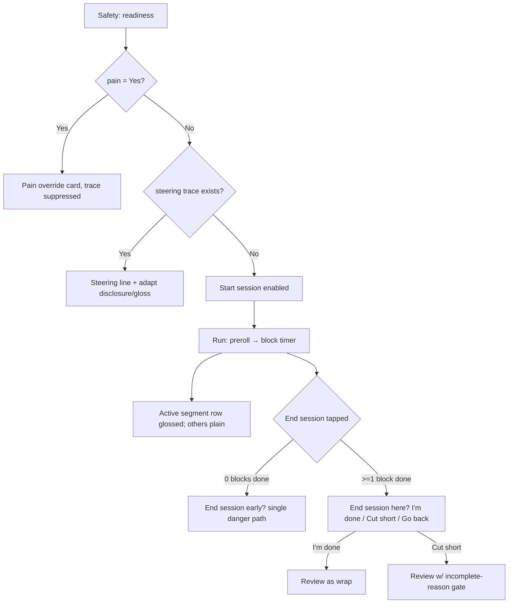
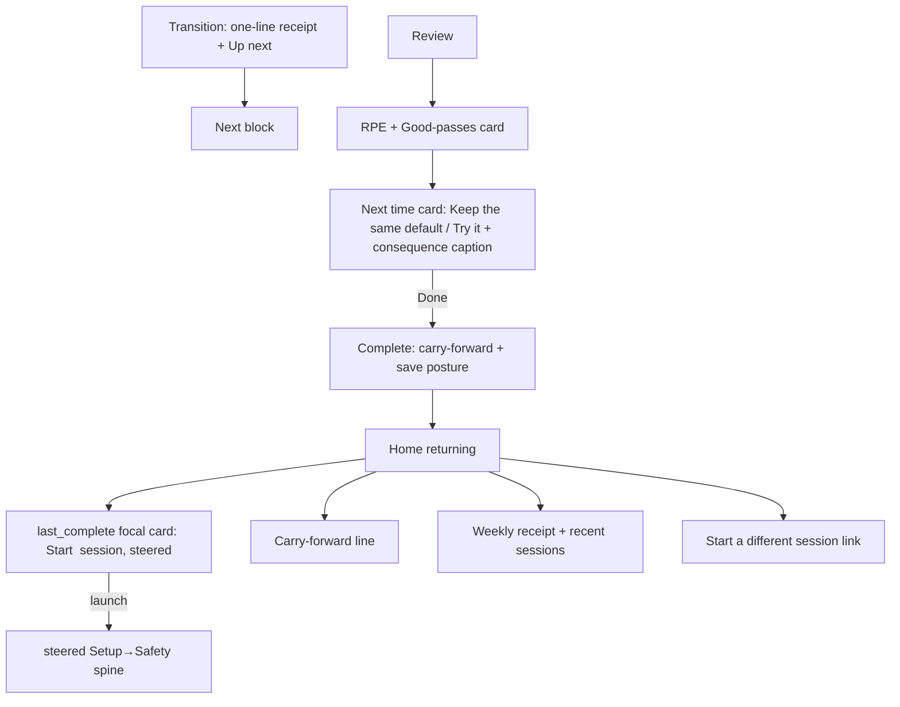

# Dogfood Report — M002.1 thin-spine series

> Diff-scoped browser QA of the M002.1 thin-spine series (`ee8284a..HEAD`, M001 close → 2026-06-21) on `main` (single-branch flow). Generated by `/ce-dogfood-beta` on 2026-06-21.

## Diff Summary

- **Home thin-spine + coherence (D150–D156):** focal `last_complete` card launches a steered plan, `PlanForTodayLine`, `CarryForwardCell`, behavioral weekly receipt, repeat-drift note; Repeat affordances retired (D158). Census pinned by `HomeScreen.render-budget.test.tsx`.
- **Setup recommendation-first frame (D158/D159):** focal resolved line (`Solo + Net · 15 min · Passing (recommended)`); Recommended resolves through the derived plan (staleness head) with `focusSource: 'resolved'` provenance; micro-label refine cluster; large-gap warning.
- **Safety trust loop (D157/U4):** steering trace line, one-time adapt disclosure, evergreen "How sessions adapt" gloss — all suppressed under pain override.
- **Run session-truth (D155):** two-intent end sheet (`I'm done` wrap vs `Cut session short`) once ≥1 block is complete; gloss underlines only on the active segment row; honest recorded duration.
- **Transition shibui (U1):** previous-block receipt demoted to one quiet line (`JustFinishedPill presentation="line"`).
- **Review verdict (D150/D151 + U2/U3):** accept/keep `Next time` card (Keep-the-same default), hedged accept-consequence caption, collapsed empty Good-passes line.

## Personas

Source: `STRATEGY.md` "Who it's for" + `AGENTS.md` learned preferences.

- **Serious amateur 2s/beach player (founder + Seb, `D130` founder-use mode)** — wants a structured, progressive session they can run courtside without a coach; cares about: low typing, glanceable calm (shibui) UI, honest session/duration truth, a believable week-over-week progression they can trust and approve.

## Flows Tested

### Flow A — Fresh cold-start → first session build (Setup recommendation-first)

### Flow B — Safety → Run loop → end-session truth

### Flow C — Transition → Review verdict → Complete → returning Home

## Test Matrix & Results

| # | Flow | Journey / Scenario | Status | Notes |
|---|------|--------------------|--------|-------|
| 1 | A | Cold-start onboarding skill-level renders + advances | Pass | Selecting a level routes straight to `/onboarding/todays-setup`. |
| 2 | A | Onboarding today's setup → Build → Safety | Pass | Pre-filled defaults (Solo+Net+15+Recommended); Build → `/safety`. |
| 3 | A | Setup resolved line: Recommended → `… · Passing (recommended)`, minutes agree | Pass | `Solo + Net · 15 min · Passing (recommended)`; footer callout `about 15 min` agrees (D159 resolved provenance). |
| 4 | A | Setup focus override (Serving) → `Serving focus`, no recommended tag | Pass | Line became `Solo + Net · 15 min · Serving focus`. |
| 5 | A | Setup incomplete state → hint in focal slot | Skipped | Not reachable via normal UI: chip defaults are always complete, so the `setup-resolved-line-placeholder` slot never fires from a fresh load. Placeholder is dead-unless-future-null-default. |
| 6 | A | Setup duration honesty / large-gap warning | Pass | Resolved line + footer always report the *assembled* total (15→15, 40→38, 40→39), never the named profile. 5-min large-gap branch couldn't be triggered at standard profiles (catalog is dense); covered by Setup unit suite. |
| 7 | B | Safety fresh user: trace + readiness gating + missing hint | Pass | Recommended draft is `focusSource:'resolved'` → a *steered* draft, so the R9 one-time disclosure + "How sessions adapt" gloss correctly fire on the first steered session; no steering *line* yet (no accepted delta). Disabled CTA carries "Tell us when you last trained to start." |
| 8 | B | Safety pain=Yes → override card, trace/gloss suppressed | Pass | `steering-trace` removed, gloss expander gone, heat tips retained (pain-independent, intended), footer CTA hidden, PainOverrideCard owns the CTAs. |
| 9 | B | Run preroll + first block timer, cockpit footer | Pass | "Warm up 1/4 · Beach Prep Three", segment list + timer + Pause/Next pinned footer. |
| 10 | B | Run segment gloss: underline only on the active segment row | Pass | Only the active (first) segment glossed "A-skip"; segments 2–4 plain despite flagged terms (ankle hops, lateral shuffles, pivot-back). Shibui U3. |
| 11 | B | Run end sheet, 0 blocks done → "End session early?" danger-only | Pass | Single danger path ("End session") + "Go back"; no wrap option. |
| 12 | B | Run end sheet, ≥1 block done → "End session here?" two-intent | Pass | `I'm done` (wrap) / `Cut session short` (danger) / `Go back`. Session-truth U2. |
| 13 | C | Transition one-line receipt + Up next eyebrow | Pass | `✓ Beach Prep Three · Complete` one quiet line; `Up next · Technique · Pass`; cue lines stacked one-per-line. |
| 14 | C | Review verdict card: Keep-the-same default + Try it + consequence caption | Pass | (Seeded 2 prior eligible serve reviews.) `A bit more stress on serving next time.`, default `Keep the same`, `Try it`, caption `Serving sessions lean toward drills like First to 10 Serving.` |
| 15 | C | Review Good-passes card states | Pass | Counts-input variant verified (Success rule + Good/Total + "Couldn't capture"). Empty-aggregate one-line variant covered by `format.emptyAggregateLine` + `ReviewScreen.perDrillAggregate` tests. |
| 16 | C | Review submit → Complete carry-forward + save posture | Pass | Complete: "Keep building", recap (Drills 1/4, 80% (8 of 10), Effort Moderate), "Saved in this browser on this device". |
| 17 | C | Returning Home: last_complete focal card launches steered plan | Pass | "Start serving session" (focus rotated off the just-trained passing) → silently built steered plan → `/safety`. |
| 18 | C | Returning Home: carry-forward line + recent sessions | Pass | After accept: `CarryForwardCell` "Carried forward: a bit more stress on serving."; Recent sessions `Serving · Done`, `Passing · Done`. (Carry-forward correctly absent before any accepted delta.) |
| 19 | C | Safety steering line after an accepted serve delta | Pass | Serve session Safety shows the R6 armed line `A bit more stress on serving today.` above the disclosure. Full trust loop closed end-to-end. |
| 20 | C | Home census visually calm (no overflow / stacked competition) | Pass | One focal card + quiet carry-forward footnote + recent list + footer; calm shibui, no overflow at 390×844. |

Status values: `Pending`, `Pass`, `Fixed`, `Skipped`, `Blocked (needs human verify)`, `Blocked (human decision)`.

**Result: 19 Pass, 1 Skipped (not reachable by design), 0 Fixed, 0 Blocked. No bugs found.**

## What Was Fixed

None. Every diff-touched user-visible surface behaved correctly; no autonomous fixes were needed.

## Console Errors

None. Zero page errors and zero console errors/warnings across the entire two-session run (onboarding → setup → safety → run → transition → review → complete → home → steered relaunch).

## Human Verifications

- **PWA / audio / wake-lock legs** not exercised: the block-end beep, `navigator.storage.persist()`, wake lock, and lock-screen behavior need a real device (the preroll "keep phone unlocked" hint rendered correctly). These are platform legs outside the M002.1 diff and are not headlessly verifiable.
- **Mobile dogfood** of the steering loop on a physical phone is the founder's call per the project's manual-dogfood preference; this pass used a 390×844 emulated iPhone viewport.

## Decisions for a Human

None. No issue required an architectural/product judgment call.

## Paper Cuts (by persona)

Persona: serious amateur 2s/beach player (founder + Seb).

- **Carry-forward vs Recommended can name different skills (low severity, by design).** On Home the carry-forward footnote ("Carried forward: a bit more stress on serving.") and the Recommended CTA ("Start setting session") deliberately reference different focuses — the carry-forward is global-latest-accepted-delta while the plan head is staleness-rotated. The code comments mark this divergence as intentional and warn against "fixing" one to match the other. It reads coherently here, but a first-time founder could briefly wonder "more serving — so why is it suggesting setting?" Worth watching in real founder-use; not a bug.
  - **Resolution (2026-06-21, founder call): leave as-is.** Reviewed against canon — the non-temporal "Carried forward:" framing in `composeCarryForwardSummary` is already the deliberate mitigation, and the D156 periphery contract forbids adding a clarifying line. Any further change (reword / conditional hide) would override a documented rationale and needs a `D*` row. Founder confirmed no change.
- **First steered Safety stacks three "adapt" elements (very low severity).** On the first steered session the steering line + the one-time disclosure callout + the "How sessions adapt" gloss can all be present at once. It's intended (disclosure is one-time, dismissable via "Got it"), and the cluster is calm, but it's the densest the Safety screen gets. Recedes permanently after the first "Got it".
  - **Resolution (2026-06-21, founder call): leave as-is.** The D157 trust-loop R9 comment explicitly intends the line and disclosure to coexist (disclosure states the contract; line instantiates it), self-resolving after "Got it" — the persistence I saw was an artifact of never dismissing it across seeded sessions. Suppressing the disclosure would amend R9 and needs a `D*` row. Founder confirmed no change.

## Learnings

- **The "visible adaptation" surfaces (verdict card, Home carry-forward, Safety steering line) are unreachable within 1–2 real sessions** — they require accumulated eligible per-focus difficulty history. A genuine dogfood must seed prior eligible reviews (or run many sessions) to exercise them. The seed shape that works: ≥2 `status:'submitted'` + `eligibleForAdaptation:true` reviews with `perDrillCaptures` whose `drillId` maps to the target focus (`focusForDrillId`), dominant `difficulty` consistent (`too_easy`→`more`, `too_hard`→`less`), and `sessionRpe < 8` (the `HIGH_RPE_SUPPRESS_MORE` gate). The whole loop (offer → accept → carry-forward → next-session line) then fires deterministically.
- **`agent-browser find text` does substring matching**: `find text "Yes"` matched "Yesterday" first. Use stable refs or testids for chip-style options that share prefixes.
- The honesty gating across the trust loop is internally consistent: the offer gate (`directionCanMovePosition`), the line arm (`acceptedReviewMovedPosition`), and the carry-forward all agree, so a no-op steering claim can't surface — a strong correctness property worth preserving.

## Final Status

**Ready.** The full M002.1 thin-spine series — recommendation-first Setup with resolved provenance, the Safety trust loop, the Run two-intent end sheet + active-only segment gloss, the quiet Transition receipt, the Review accept/keep verdict with consequence caption, and the Home coherence (steered focal launch + carry-forward + steering line) — all behaved correctly end-to-end across a fresh cold-start and a steered second session, with zero console errors and no bugs. Two low-severity paper cuts noted; both reviewed against canon (D156 periphery contract / D157 trust-loop R9) and consciously kept as-is by founder call on 2026-06-21 — each is documented intentional design, not a defect. Already shipped on `main`/`origin`.

