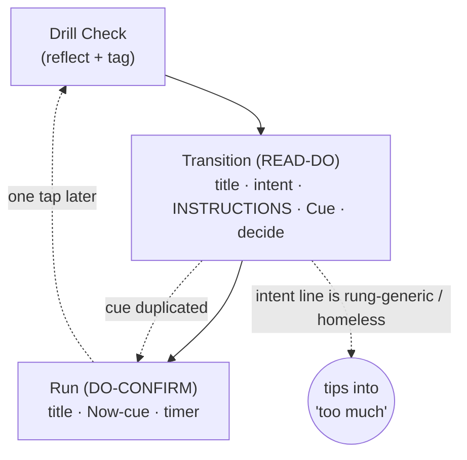
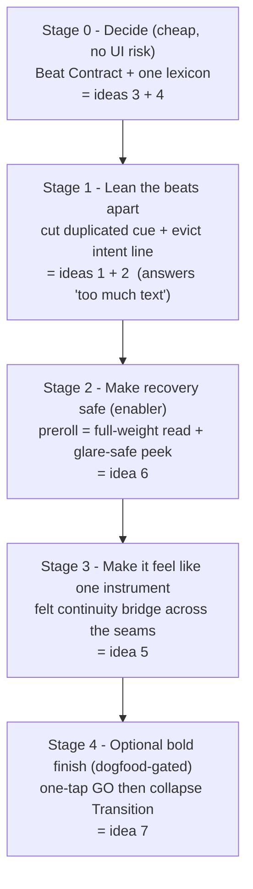

# Ideation: Run-Flow UX

Seven survivors across all five axes, filtered against the live run-flow screens and the repo's design canon. The set is deliberately weighted toward the actual complaint — Transition text density and a sequence that reads like three stitched-together pages rather than one calm instrument — rather than toward the Run cockpit, which the design canon already treats as exemplary.

## Grounding Context

**Codebase Context.** The run flow is a per-drill loop of three screens, all built on the `ScreenShell` three-zone layout (`max-w-[390px]`) and the shared run-family header (`RunFlowHeader`: SafetyIcon + centered title + spacer, ratified in D153):

- `/run` — `RunScreen`, the live **DO-CONFIRM** cockpit: drill title, one cue ("Now" = `coachingCues[0]`), 72px `BlockTimer`, controls. Governed by the one-cue rule (courtside-copy rule 12a). The dossier and verifier both call this face "already exemplary."
- `/run/check` — `DrillCheckScreen`, the reflective beat: a required difficulty chip (gates `Continue`) + optional counts/streak capture.
- `/run/transition` — `TransitionScreen`, the **READ-DO** preview/decide beat: just-finished receipt, next drill, duration, the D163 rung-intent line, full `courtsideInstructions`, a "Cue" section, and the decide footer (Start / Swap / Shorten / Skip).

**The wall this addresses.** The founder reported the run-flow screens had "WAY too much text and fonts ... super messy." A 2026-06-23 calm pass already tightened Transition. The holistic finding that drove ideation: **Transition's body is a near-superset of Run's body one tap apart.**

Three structural reads anchor the candidates: (1) the coaching **cue is duplicated** across Transition ("Cue") and Run ("Now") one tap apart; its real home is Run. (2) The full **instructions** are the only thing Transition uniquely carries at full weight — they justify the screen existing. (3) The **D163 rung-intent line** is rung-generic (identical for every pass drill on the rung) on a drill-specific screen — redundant and "homeless," and the line that tipped the screen into "too much."

**Hard constraints honored throughout** (full set in the dossier): Run stays one-cue (D163 / rule 12a); no raw rungs render (D157); copy is descriptive, never a gate (D154); ≤45-word instructions and no em-dashes (rules 14 / 4, lint); shared run-family header, no End-session on the live face (D153); density changes are founder-dogfood-gated (D127). Two survivors are explicit decision revisits and say so: M2 (D163) and "Collapse Transition" (D163 + routing, D137).

**Two natural packages** emerged from cross-frame synthesis: a conservative **lean-the-beats-apart** package (cut the cue + evict the intent line + ratify the contract = ideas 1, 2, 3) that delivers "less text" with no routing risk; and a bold **staged-collapse** path (idea 7, de-risked by the preroll-read enabler in idea 6). The meta-direction below shows how all seven compose into one program.

## Meta-Direction: One Instrument, One Contract

The seven survivors are not seven independent bets. Read together they trace to a single root cause and compose into one staged program. **Root cause:** the run flow has no contract for what each beat carries, so content leaks across beats — the cue renders three times, the rung-intent line has no home, labels drift screen to screen. Every "messy / too much text" symptom is downstream of that one missing contract.

The meta-move is to treat the run flow as **one instrument governed by one beat contract**, then roll it out in risk-ordered stages where each cheap, reversible stage de-risks and unlocks the next. The ordering is the point: continuity (stage 3) is impossible to do well before the content is de-duplicated (stage 1), and the bold collapse (stage 4) is only safe after the read has a home on Run (stage 2).

- **Stage 0 — Decide.** Ratify the Beat Contract (idea 3) and fold the lexicon into it (idea 4): one job per beat, one full-weight home per field, one canonical label per concept. READ-DO Transition owns setup-read + decide; DO-CONFIRM Run owns the one cue + timer; Drill Check owns reflection. A doc + a constants module + a test — no screen redesign — yet it *decides* everything downstream by lookup instead of by taste.
- **Stage 1 — Lean the beats apart.** Apply the contract: cut the duplicated cue from Transition (idea 1) and evict/relocate the homeless rung-intent line (idea 2). Transition collapses to its unique job and the two screens stop being near-supersets. This is the high-confidence win that resolves the founder's actual complaint, and it is just the contract enforced.
- **Stage 2 — Make recovery safe.** Turn Run's preroll into the full-weight read moment plus a glare-safe one-touch "peek setup" (idea 6). Once the setup read is recoverable at the get-ready, the beats can lean apart (and later collapse) without stranding a winded athlete who forgot the drill.
- **Stage 3 — Make it feel like one instrument.** With no duplicated content fighting across the seams, the felt-continuity bridge (idea 5) becomes clean: carry the title and just-finished receipt through the preroll into Run so the sequence reads as one morphing surface, not three page-loads.
- **Stage 4 — Optional bold finish.** If founder dogfood shows the Transition decision is almost always "start," take the staged collapse (idea 7): ship the reversible one-tap GO first, then collapse Transition into an on-demand preview — safe only because stage 2 moved the read onto Run.

**Why this beats picking one idea:** the contract (stage 0) keeps every later stage from regressing; stage 2 is the safety mechanism that makes the bold stage-4 bet responsible; stage 3's payoff is only reachable after stage 1's de-duplication. The one genuine fork the program leaves open — does Transition survive as a thin setup+decide beat (stop at stage 3) or collapse entirely (stage 4)? — becomes a clean, evidence-gated decision rather than an architectural coin-flip, because the contract already says what Transition is *for*.

**What stays out of the spine:** the rejected ideas stay rejected — no per-block cue (breaks rule 13), no inferred difficulty tag (breaks D130 honesty), no `BeatBody` framework yet (the doc + lint is enough for one user). The decision-control de-duplication (M12) is a sensible *later* clause of the same contract, not part of this density-first spine.

## Topic Axes

1. Sequence information architecture — cross-screen allocation across Transition / Run / Drill Check; the Transition↔Run duplication; whether Transition earns its existence.
2. Transition read craft — the preview/decide screen's own hierarchy, typography, default-visible vs revealed, the intent line, density.
3. Run cockpit craft — the live DO-CONFIRM face: one-cue rule, timer/progress, controls, glance legibility, mid-rep recall.
4. Decision & control affordances — swap / shorten / skip / end-session; the "decide here, execute there" choice architecture.
5. Continuity & rhythm — how the sequence reads as one instrument: motion between beats, preroll/get-ready, the just-finished receipt thread.

## Ranked Ideas

1. [Cut the duplicated coaching cue — Run is its only home](#1-cut-the-duplicated-coaching-cue-run-is-its-only-home)
2. [Evict or relocate the D163 rung-intent line](#2-evict-or-relocate-the-d163-rung-intent-line)
3. [Ratify a Run-Flow Beat Contract](#3-ratify-a-run-flow-beat-contract)
4. [One run-flow lexicon (resolve the T8 label drift)](#4-one-run-flow-lexicon-resolve-the-t8-label-drift)
5. [Make the sequence read as one calm instrument](#5-make-the-sequence-read-as-one-calm-instrument)
6. [Turn Run's preroll into the full-weight read moment](#6-turn-runs-preroll-into-the-full-weight-read-moment)
7. [Collapse the forced Transition into an on-demand preview](#7-collapse-the-forced-transition-into-an-on-demand-preview)

### 1. Cut the duplicated coaching cue — Run is its only home

**Description:** Remove the inline "Cue" section from `TransitionScreen` (or bury it fully behind "More cues"), so the coaching cue renders once, at the moment it is used, as Run's "Now". Transition then carries only what is unique to it (the full setup instructions + the decision). This is the single highest-converged idea — four of five frames proposed it independently — and the most direct answer to "too much text."

**Axis:** 1 — Sequence information architecture (also lifts Transition read craft)

**Basis:** direct — `app/src/screens/TransitionScreen.tsx` renders a "Cue" section, and `app/src/screens/RunScreen.tsx` renders the identical cue as the accent "Now" section one tap later; the Transition docblock states the body deliberately "mirrors Run's treatment ... decide here, execute there." courtside-copy rule 12a scopes the one-cue mandate to `RunScreen` only, so Transition's cue is discretionary. (Verifier: SOUND — strongest of the set, citations confirmed in place.)

**Rationale:** The cue is the most-repeated text block in the flow (Transition "Cue" + Run "Now" + a third copy behind Transition's "More cues"). Cutting the duplicate removes a whole labeled section from the screen the founder called messy with zero information loss — it reappears on the very next screen, which is also where motor-learning says the single external cue belongs (the last idea before movement).

**Downsides:** Reverses the deliberate 2026-04-22 "mirror" decision; test-coupled (pinned strings must change). A counter-argument exists — a pre-move cue *preview* could aid mental rehearsal — so this should be dogfooded, not assumed. If pursued, the typed-cue option (a dedicated `externalFocusCue` field, single-sourced so Run and any preview can never drift) is the clean follow-on.

**Confidence:** 85%
**Complexity:** Medium

### 2. Evict or relocate the D163 rung-intent line

**Description:** Drop the rung-intent subtitle ("what this rung trains") from `TransitionScreen`. Two variants: (a) cut it from the run flow entirely; (b) relocate it to where rung context is actually consumed — shown once when the focus block first appears, or on a rung-level surface (Review / Safety steering-trace) rather than on every between-drills beat.

**Axis:** 2 — Transition read craft

**Basis:** direct — `app/src/screens/TransitionScreen.tsx` renders `rungIntentLine` as a quiet subtitle under the title, sourced from `resolveBlockRungIntent(nextBlock, …)` in `app/src/screens/transition/useTransitionController.ts`. Because it derives from the rung, consecutive drills on the same rung necessarily show the identical sentence. The dossier names this exact line as the one that "tipped the screen into 'too much.'" (Verifier: SOUND.)

**Rationale:** It is the lowest-value-per-pixel line in the flow, on the screen the founder explicitly flagged, and it changes nothing the athlete does next. Removing it is the highest-confidence single deletion available; relocating (variant b) preserves the D163 payload while killing the per-drill repetition.

**Downsides:** D163 shipped this placement on 2026-06-22, so this is a decision-row-worthy D163 revisit, not a silent tweak. Variant (b) needs a real rung-level home, which may not exist yet in the run flow proper — that part may belong to a separate surface.

**Confidence:** 78%
**Complexity:** Low

### 3. Ratify a Run-Flow Beat Contract

**Description:** Author the net-new artifact the run flow currently lacks: a single table mapping every authored drill field (`drillName`, eyebrow, `coachingCues[]`, `courtsideInstructions`, rung `intent`, duration) to which beat owns it at full weight, which beat may only echo it demoted, and which beat must not render it. It encodes ideas 1 and 2 as law, so future "should X show on Transition?" questions become a lookup instead of a re-litigated taste argument.

**Axis:** 1 — Sequence information architecture

**Basis:** direct — the dossier records that there is no consolidated beat-contract doc; allocation currently lives scattered across D163, `courtside-copy.mdc`, and brand-UX §7.4–7.x, which is precisely how Transition and Run drifted into duplicating the cue. The single-source ("torn-UI") learning reinforces deriving each rendered field from one artifact. (Verifier: implicitly endorsed via the M1/M2 it formalizes.)

**Rationale:** This is the durability keystone. The duplication, the homeless intent line, and the recurring "too much text" complaints are all symptoms of an unwritten contract. One table makes every future field-placement decision a lookup, gives ideas 1 and 2 a spec to enforce against, and gives future M002 features a single place to ask "may this live on Run?"

**Downsides:** A doc alone can drift from code unless something enforces it; the heavier enforcement primitive (a typed per-beat layout slot map) was considered and deferred as premature for a one-user app — start with the doc + light lint, not the framework. Forces the founder to ratify the most contested question in the flow (does Transition mirror or complement Run).

**Confidence:** 75%
**Complexity:** Low

### 4. One run-flow lexicon (resolve the T8 label drift)

**Description:** The same concept wears different words one tap apart: the live cue is "Now" on Run but "Cue" on Transition; Swap is "Swap" in Run's paused grid but "Swap drill" on the running face and on Transition; "Shorten" vs "Shorten block"; the counter is bare `3/5` on Run, `Next: 3/5` on Transition, `Last: 2/5` on Drill Check. Put every run-flow user-facing label in one constants module, pick the canonical string once, and pin it with a test so drift cannot silently return.

**Axis:** 4 — Decision & control affordances (also continuity)

**Basis:** direct — verified across `app/src/screens/RunScreen.tsx`, `app/src/screens/TransitionScreen.tsx`, and the run controls component (`RunControls`): "Now" vs "Cue", "Swap" vs "Swap drill", "Shorten" vs "Shorten block", and the divergent counter prefixes. The dossier flags this as the documented, un-acted "T8" finding. (Verifier: SOUND — confirmed each string in place.)

**Rationale:** The cheapest coherence win available — no new pixels, no new copy. Naming each thing once turns a recurring per-screen polish chore into a solved problem and makes the sequence read as one instrument rather than three cousins; tests then guard the vocabulary.

**Downsides:** Surfaces real micro-decisions the founder holds taste on (is it "Now" or "Cue"? do the "Next:"/"Last:" counter prefixes earn their asymmetry or add noise?). Small surface, but the choices are genuine and shouldn't be made unilaterally.

**Confidence:** 80%
**Complexity:** Low

### 5. Make the sequence read as one calm instrument

**Description:** Replace the hard route-to-route cuts (Drill Check → Transition → Run) with felt continuity. Two variants: (a) cheap — a shared-element motion bridge that carries the drill title and the just-finished receipt through the preroll into Run, reusing the existing start haptic; (b) bold — one persistent surface whose body morphs decide → do → reflect → decide while the header and timer stay put, so it reads as one instrument in different modes rather than a wizard with N pages.

**Axis:** 5 — Continuity & rhythm

**Basis:** direct — `app/src/components/ui/ScreenShell.tsx` has no cross-route motion machinery (fades are body-internal only); `app/src/screens/DrillCheckScreen.tsx` already states the intent that "the run-flow sequence reads as one continuous instrument" with a Jo-Ha-Kyu cadence, and the just-finished receipt is rendered twice (Drill Check panel + Transition line) for the same drill. external — NN/g notes a multi-step wizard's per-step tedium can overwhelm the split's benefit; the antidote to "too many screens" is often making them not *feel* like screens. (Verifier: SOUND, second tier.)

**Rationale:** Continuity is the stated goal of this pass, and this is the rare lever that improves felt flow without adding any reading. The repo already built the scaffolding for "one instrument" (shared header, matched counters) but stops at navigation — closing that gap between stated intent and execution is the opportunity.

**Downsides:** Must respect reduced-motion and must never delay the timer; variant (b) reopens the route architecture (routePaths are stable per D137) and is a genuine refactor. Best treated as variant (a) first.

**Confidence:** 58%
**Complexity:** Medium (variant a) to High (variant b)

### 6. Turn Run's preroll into the full-weight read moment

**Description:** Generalize a pattern Run already uses for segmented drills: during the count-in, show the full instructions (and the one cue, at the motor-learning-optimal instant just before movement) at full weight, then let them recede to the lean one-cue cockpit once reps begin. Pair it with a deliberate, large, positionally-stable "peek setup" control so a winded athlete can recover the full instructions mid-rep with one touch instead of hunting a small disclosure at the bottom of a scrolling body.

**Axis:** 3 — Run cockpit craft

**Basis:** direct — `app/src/screens/RunScreen.tsx` already keeps the full `courtsideInstructions` inline only while in segment 0 / preroll and routes it into a `
` once the rep is in motion; the 72px accent count-in already owns the footer during preroll. external — Aiken & Becker (2023) and Winkelman: plan/internal focus before, one external cue during, "the last idea before they move should be one external cue." (Verifier: SOUND, second tier.)

**Rationale:** This relocates the READ-DO read into the one place the athlete is already paused and looking (the get-ready), which is what makes removing or collapsing Transition's read *safe*. It reuses a shipped, test-pinned pattern rather than inventing one, and it gives the preroll — currently a number plus "Get ready…" — a real job.

**Downsides:** Adds weight to the count-in window; must not compromise the one-cue discipline once reps start. The mid-rep "peek" must clear the rule-13 prohibition on re-reading prose in DO-CONFIRM mode — so it is recovery, not default. Evidence-gated (D127): the 390px check proves hierarchy, not sun/glare/set-down readability.

**Confidence:** 65%
**Complexity:** Medium

### 7. Collapse the forced Transition into an on-demand preview

**Description:** When the between-drill decision is almost always "start," stop charging a forced full-screen read for it. Stage it: first ship a reversible **one-tap GO** (auto-advance into the get-ready count-in unless the athlete reaches for swap/shorten/skip during a clearly cancelable window, or one dominant GO with adjustments folded behind a quiet "Adjust"); dogfood; then, only if warranted, collapse the route so Drill Check flows straight into Run's preroll with the full setup reachable on demand (tap-to-expand, timer holds).

**Axis:** 1 — Sequence information architecture

**Basis:** external — Peloton Gym makes the move-preview on-demand (timer auto-pauses, resumes after); Microsoft's "98% rule" says a step whose choice is almost always the same should be removed; Freeletics' forced per-drill tap drew "wrecks momentum" backlash. direct — `handleStartNext` in `app/src/screens/transition/useTransitionController.ts` is a pass-through (vibrate + navigate, no decision payload), and between-drill rationale prose was already deleted once for being "lots of text to read between each drill." The premise-defense is real too (GOV.UK calls a pure decide page a legitimate standalone step), which is exactly why it's worth debating. (Verifier: SOUND but "the one to watch" — must cite D137 by name and is the highest-risk bet.)

**Rationale:** This is the boldest lever and the highest cross-frame convergence (five frames). It asks whether a whole screen earns its forced place in the loop rather than only trimming what's on it — removing a recurring class of "too much text between drills" at the root and unifying "between drills" and "block start" into one rhythm primitive.

**Downsides:** Reroutes the run flow (routePaths are stable per D137; this is a D137 + D163 revisit) — the single most consequential structural change here, and must be founder-dogfood-gated, not a quiet refactor. The cancelable-window must preserve the tired-athlete escape (Shorten is documented as deserving CTA-width visibility). Depends on idea 6 (a full-weight read window on Run) to be safe.

**Confidence:** 50%
**Complexity:** High

## Rejection Summary

| # | Idea | Reason rejected |
|---|------|-----------------|
| M6 | Peripheral phase/beat signatures (color · tone · haptic) | Overlaps idea 5's continuity treatment; standalone value gated by the iOS-Safari AudioContext-on-lock cost — fold the color/haptic cue into idea 5 instead. |
| M9 | `BeatBody` layout primitive enforcing the contract in code | Premature for a one-user app; idea 3's doc + light lint delivers the value first (verifier: over-engineered). |
| M10 | Structured Transition setup fields (Setup/Target/Stop) | Basis drifts from the cited copy contract (verifier: WEAK); the allocation value is absorbed by idea 3's contract. |
| M11 | `externalFocusCue` as the typed canonical cue | Solid D163 open seam but secondary; sequence it as the follow-on to idea 1 once the cue's home is settled. |
| M12 | One home per plan adjustment (decision-control de-dup) | Real duplication, but tangential to the text-density complaint; revisit as a dedicated controls pass (label half is covered by idea 4). |
| M13 | Kill the "Pause tax" on mid-rep adjustments | Basis refuted by verification — the WCAG "sub-AA grid" note at `RunControls` is already fixed (`text-warning-strong`) and is about End-session, not Shorten. |
| M14 | Glare-safe mid-rep "peek setup" recall | Folded into idea 6 as its safety-net mechanism rather than a standalone card. |
| M15 | Zero-cost default (one-tap GO / auto-advance) | Folded into idea 7 as its staged, reversible first step. |
| M16 | Infer-and-confirm the difficulty tag + auto-tally | Conflicts with D130 sole-evidence honesty (a warmed default biases the founder's own reflection) and needs an in-run tally that does not exist (verifier: WEAK). |
| M17 | One cue per focus block, not per drill | Contradicts idea 2's drill-specificity and breaks rule-13 triple-only readability (verifier: WEAK). |
| M18 | Design Run for the propped-up / across-court phone | Valuable reframing lens (surfaces the iOS lock-audio blocker) but a brainstorm input, not a standalone shippable improvement; Axis 3 already served by idea 6. |
