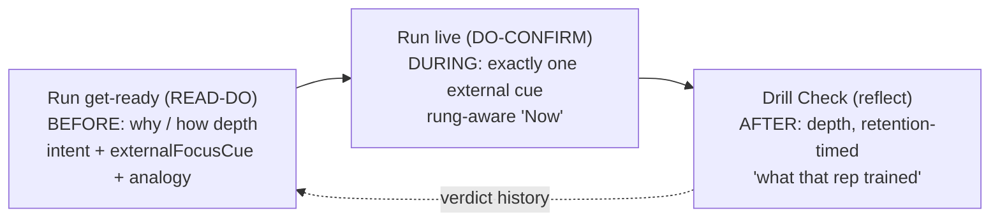
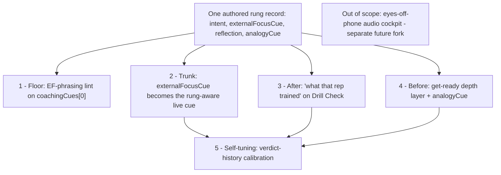

# Ideation: M002.2 Technique-How Depth

Six survivors across five axes, filtered against the live run-flow code and the design canon. The set is anchored on the one fact that organizes the whole space: `externalFocusCue` is **fully authored on every stress rung, validated, and rendered nowhere**. The question is not whether to build technique-how depth — the content already exists — but *where it is allowed to surface* without breaking the one-cue cockpit.

This is the deferred run-time half of M002.2. The reflective Review half (`explorationCriterion` / `graduationFeel`) and the get-ready rung `intent` line already shipped; this ideation is the explicit `externalFocusCue` + Run-live + Drill-Check follow-on that `docs/ideation/2026-06-23-run-flow-ux-ideation.md` sequenced out (its rejected "M11") once the cue's home was settled.

## Meta-Direction: Phase-Matched Depth

The strongest external finding maps almost 1:1 onto the beats this app already has. Motor-learning's **phase split** — internal/"why" framing *before* the rep, a single external cue *during*, technique depth *after* — is the same three-beat shape as the run-flow beat contract. Almost no training app executes this deliberately; Volleycraft is one beat-contract away from it.

Read together, the survivors are not six independent bets — they trace one spine and roll out in risk order: a safe authoring lint now, then a single-source record that makes the live cue rung-aware, then the before/after depth surfaces, then calibration, with one bold optional finish. The single genuine fork — *which beat owns `externalFocusCue`* — is resolved in favor of the live cue (5 of 5 ideation frames converged there independently), with the get-ready and overlay homes preserved as the documented runners-up.

## Meta-Idea: The Rung-Aware Coaching Arc

**One sentence.** Give each stress rung a single authored *coaching arc* — one record, surfaced phase-matched across the three beats (the *why* before, the *one cue* during, the *reflection* after), always pulled never pushed, and quietly calibrated by the athlete's own felt-readiness — so the ladder a coachless athlete is climbing finally becomes legible at the moment they train.

This is the synthesis of all six survivors, not a seventh idea competing with them. It is the spine that makes them one feature instead of six. Three facts already line up and nobody has connected them: the `StressRung` record *already* co-locates the whole teaching arc (`intent` + `externalFocusCue` + the felt-readiness fields); motor-learning's phase split (*why before → one external cue during → depth after*) is *already* the same three-beat shape as the run-flow beat contract; and a self-coached athlete is missing exactly one thing the app withholds — a coach's voice at each phase. **Author the arc once on the rung; surface it three times, each in its own register and its own beat home.**

**What the arc takes from each survivor (best of), and what it drops (worst of):**

- **Idea 1 — the spine.** Take the single-source per-`(focus, rung)` record and the rung-aware live cue: the app's best-authored cue finally reaches the athlete, single-sourced so it cannot drift. This is the trunk; everything hangs off it.
- **Idea 2 — the lint.** Take the EF-phrasing authoring guard as the *enabling first step* and permanent drift backstop. Drop its framing as a standalone feature — it is the floor under the arc, not a wall on its own.
- **Idea 3 — after.** Take the optional, retention-timed "what that rep trained" reflection on Drill Check. Drop the heavier "split what made it hard" branch from the core (hold it as a later option) so the after-beat stays one calm, dismissible line — a reflection, not a quiz.
- **Idea 4 — before.** Take the persistent, predictable on-demand depth layer and the `analogyCue` "say it another way" register. Drop a *separate* SDT "why this rung" slot — it overlaps the shipped `intent`; let `intent` carry the why and let the depth layer add only the analogy *how*.
- **Idea 5 — calibration.** Take the verdict-history default-tuning so depth recedes as you graduate, reusing data already collected. Drop the distance-effect-by-rung mapping (expertise is not the same as rung) and drop any calibration of the *live cue* — the cue always keys off the drill-actual rung, honest and stable.
- **Idea 6 — audio.** Drop it from the arc. The eyes-off-phone audio cockpit is a genuine future bet, but a medium-flip + decision-revisit + an iOS `AudioContext` blocker; folding it in would make a calm, reversible, incremental program depend on its riskiest, least-proven move. It stays an explicitly separate future fork the arc does not need.

**Why it's cross-cutting.** One authored record plus one phase-matched principle covers all five axes — A1 (the cue's home), A2 (get-ready depth), A3 (Drill Check reflection), A4 (the live cue and its lint), A5 (calibration) — and all three run-flow beats, without adding a single always-on element or a second live cue.

**Why it's aligned with the design language and vision:**

- *Shibui / calm / one-home-per-field* — every field keeps exactly one full-weight home (honors the D164 beat contract); the live face stays one cue (rule 12a is *upgraded*, not bent); nothing new is forced onto Home.
- *Pull, not push* — all depth (analogy before, reflection after) sits behind a persistent, predictable affordance: the exact antidote to the "too much text" wall and the competitor over-coaching backlash the research flagged.
- *Coachless self-coached athlete* — the arc is the coach-in-the-box: the why before, the one external cue during, the reflection after. That is the SDT trust/adherence lever a solo trainee has no other source for.
- *Makes the M002.2 stress ladder real* — today the ladder reshapes assembly but is invisible at runtime; the arc makes the rung you're on change what you hear and what you reflect on. That is the ladder's whole point.
- *Compounds with shipped data* — it lights up the authored-but-unused `externalFocusCue`, reuses the `StressRung` record, and gives the felt-readiness verdict log a second consumer.

**Why it's worth doing.** It is the M002.2 "run-time technique-how" done condition; it ships the best content the app already paid to author and currently sends nowhere; and it converts the stress ladder from an invisible assembly input into a felt, legible progression — all on a calm, reversible, dogfood-gated path.

**Risk-ordered rollout — each step independently valuable, each de-risks the next:**

1. **Floor** — EF-phrasing lint (Idea 2): safe now, no UI, raises the live cue catalog-wide.
2. **Trunk** — per-rung record + `externalFocusCue` as the rung-aware live cue (Idea 1): the ladder becomes audible at the rep.
3. **After** — "what that rep trained" reflection (Idea 3): depth at the retention-optimal moment.
4. **Before** — get-ready depth layer + `analogyCue` (Idea 4): the "say it another way" *how*, on demand.
5. **Self-tuning** — verdict-history calibration (Idea 5): the arc recedes as the athlete graduates.
6. **Out of scope** — eyes-off-phone audio cockpit (Idea 6): a separate future fork, not a step in this arc.

## Grounding Context

**Codebase Context.** The run flow is a per-drill loop of single-job beats governed by the beat contract (`D164`, `docs/specs/run-flow-beat-contract.md`):

- **Run get-ready** = READ-DO (before the rep): full `courtsideInstructions` read + block-opening rung `intent` line `Trains · …` (`RunScreen.tsx:310-327`). The one beat where depth/prose is sanctioned.
- **Run live** = DO-CONFIRM (during): exactly one cue ("Now" = `coachingCues[0]`, `RunScreen.tsx:401-411`), 72px timer, a transient "Drill details" overlay (`:548-565`) that recovers the read + remaining cues with the timer running.
- **Drill Check** = reflect (after): a required difficulty chip + optional capture; body "intentionally sparse" (`DrillCheckScreen.tsx:143-146`), no rung content today.

**The organizing fact.** `externalFocusCue` is defined on every `StressRung` ("the one external-focus attention prompt that makes this rung a real step — Wulf; rule 12b", `stressLadders.ts:43-49`), authored with real strings, validated (`catalogValidation.ts:366`) — and **referenced by no screen, domain, or component**. It is a complete, paid-for data seam waiting for a home.

**The keystone tension.** `externalFocusCue` is itself an external-focus cue, so it overlaps the drill's `coachingCues[0]`; showing both would put two cues at glare distance, violating one-cue rule 12a. That overlap is why `D163` shipped only the `intent` line and held `externalFocusCue` back.

**Hard constraints honored throughout** (full set in the run): one home per field (`D164`); Run live = one external cue (rule 12a); no prose re-read in DO-CONFIRM (rule 13); `intent` shows once per focus per session (first-appearance prefix scan); no raw rung numbers (`D157`); copy never gates ladder movement (`D154`); key off the drill-actual rung, not the offer position; recovery overlay ≠ a second home; ≤45-word reads with glossed jargon and no em-dashes; no new Home pixels without a `D156` row.

**External grounding (research value: high).** External focus beats internal at every skill level (Wulf/Chua, g≈0.58); overcoaching harms (one cue, max two, per rep); analogy cues are the sanctioned middle "how" register that stays external; progressive disclosure wants ≤2 levels behind a *persistent, predictable* affordance; SDT says a meaningful rationale is autonomy support — for a coachless user, "why this rung" is a trust/adherence lever, not just instruction. Cross-domain: Duolingo "Explain My Answer" (post-attempt, optional, retention-timed) is a near-perfect template for Drill Check; the chess hint-ladder models novice→expert layering; Hevy's "How to" tab opens mid-session without pausing; Peloton "talks-least" demand and Freeletics/Duolingo "forced tips" backlash both say depth must be *pulled, never pushed*.

## Topic Axes

- A1 — `externalFocusCue`'s home and its relationship to `coachingCues[0]` (the data-model / single-source keystone).
- A2 — Get-ready "why/how" depth (READ-DO, before the rep).
- A3 — Drill Check / post-rep depth (reflect, after the rep) — the most-deferred, highest-novelty seam.
- A4 — Run-live cockpit treatment (DO-CONFIRM, during) — heavily constrained; default bias is to protect the one-cue invariant.
- A5 — Level / rung / readiness-calibrated depth (cross-cutting "how much depth, for whom").

## Ranked Ideas

1. [Single-source rung technique-how record → the rung's externalFocusCue becomes the live cue](#1-single-source-rung-technique-how-record--the-rungs-externalfocuscue-becomes-the-live-cue)
2. [EF-phrasing authoring lint on coachingCues[0] (catalog-wide)](#2-ef-phrasing-authoring-lint-on-coachingcues0-catalog-wide)
3. [Post-rep "what that rep trained" reflection on Drill Check](#3-post-rep-what-that-rep-trained-reflection-on-drill-check)
4. [A persistent get-ready depth layer with an analogyCue middle register](#4-a-persistent-get-ready-depth-layer-with-an-analogycue-middle-register)
5. [Verdict-history-calibrated depth](#5-verdict-history-calibrated-depth)
6. [Eyes-off-phone audio cue cockpit (bold bet)](#6-eyes-off-phone-audio-cue-cockpit-bold-bet)

### 1. Single-source rung technique-how record → the rung's externalFocusCue becomes the live cue

**Description:** Co-locate each rung's technique-how into one structured record keyed by (focus, rung) — `intent` (get-ready, shipped), `externalFocusCue`, and the reflective frame (idea 3) — each field with one full-weight home, all read through one accessor family extending `resolveBlockRungIntent`. The headline consumer: when a drill sits on a rung, the live "Now" cue is sourced from that rung's `externalFocusCue` instead of the drill's generic `coachingCues[0]`. Still exactly one cue at glare distance — but rung-calibrated, and the app's best-authored cue finally reaches the athlete at the moment of execution. The two strings never both render, so there is nothing to deduplicate at runtime.

**Axis:** A1 — externalFocusCue home & single-source

**Basis:** direct: `stressLadders.ts:42-63` already co-locates `intent` / `externalFocusCue` / `explorationCriterion` / `graduationFeel` in one rung record — the schema home exists; `drillMetadata.ts:106-107` exposes the drill-actual rung ("no derived ladder position, steering, or verdict-offer state is read"), so the override is honesty-safe; the live cue resolves through `currentCue.ts` → `RunScreen.tsx:401-411`. external: Wulf/Chua external-focus superiority at every level; aviation's brief-then-call-one-callout discipline.

**Rationale:** This resolves the keystone question (where does `externalFocusCue` live?) by *upgrading* the one cue rather than adding a second — the only canon-clean way to honor rule 12a. The verifier's sharpest note made the unit clear: a render-time swap alone only *relocates* the duplication to authoring-time, so the durable move is the **record** (single authoring home) plus idea 2's lint as the drift backstop. Five of five ideation frames proposed the live-cue home independently — the strongest convergence in the run — and it makes the ladder finally mean something at runtime (today every rung of a drill shows the identical cue).

**Downsides:** Requires the record + accessor plumbing and a beat-contract row naming `externalFocusCue`'s live home; the alternative homes are real and deferred here, not refuted — (b) pairing it on the get-ready under `Trains ·` (the runner-up; lower live impact but zero glare risk), and (c) overlay-only "director's commentary" (lowest risk, lowest reach). Needs founder dogfood per `D127` before the override becomes default.

**Confidence:** 78%
**Complexity:** Medium

### 2. EF-phrasing authoring lint on coachingCues[0] (catalog-wide)

**Description:** Extend catalog validation to flag any `coachingCues[0]` that is internal-focus phrased (names a body part, joint, or sensation) while its rung carries a clean external cue — or that materially diverges from the rung's `externalFocusCue` without a single-source link. Authoring-time only: no UI change, no second cue, the live cockpit untouched. It is the cheapest immediate win *and* the mechanical backstop that lets idea 1's resolver assume the two strings are aligned.

**Axis:** A4 — Run-live cockpit treatment (authoring guard)

**Basis:** direct: rule 12(b) already mandates `coachingCues[0]` "names an outcome … not a body part, joint, muscle, or internal sensation" with an explicit exception-comment escape; `externalFocusCue` is already validated at `catalogValidation.ts:366`, so the lint slots into existing machinery. external: Wulf/Chua — external focus wins at every skill level, so an internal-phrased live cue is a measurable regression on the single highest-stakes courtside string.

**Rationale:** One lint, written once, raises the floor on the most-read string in the whole app and keeps it raised as new drills land — the purest authoring-time investment that pays catalog-wide, on the most constrained axis, without spending a live pixel. It can ship independently of every other idea here and de-risks idea 1.

**Downsides:** Surfaces existing catalog debt (some current `coachingCues[0]` may fail and need rewrites or exception comments); a lint encodes a phrasing judgment that the founder may want to spot-review rather than hard-fail in CI at first.

**Confidence:** 82%
**Complexity:** Low

### 3. Post-rep "what that rep trained" reflection on Drill Check

**Description:** After the required difficulty chip, offer an optional, dismissible tap-to-explain on the sparse Drill Check body that surfaces a backward-looking technique-how line — "that rep was training {rung effect}" — in a reflective voice distinct from the get-ready "why" and from Review. A sharper variant conditions on the chip: a "hard / still learning" tap can offer a one-tap split (was it the *pace/stress*, or could you not *execute*?) and, if technique, reveal the rung cue as the one thing for next time — disambiguating the only learning signal a coachless athlete has (hold the rung vs. fix the movement).

**Axis:** A3 — Drill Check / post-rep depth

**Basis:** direct: `DrillCheckScreen.tsx:143-146` ("body is intentionally sparse") with `difficulty` already wired (`:191-221`); the beat contract bans the `intent` field here (`:67`) but a *distinct* reflective field is a sanctioned row-amendment, not a violation (the verifier confirmed this). external: Duolingo "Explain My Answer" — optional, dismissible, *after* the attempt, justified by "feedback right after an attempt is retained better."

**Rationale:** This is the highest-novelty deferred seam and the retention-optimal moment: the half-second right after the rep, when a coach would have spoken. It turns an existing required interaction into a learning moment at zero added typing, and gives `externalFocusCue` a genuinely reflective home that doesn't compete with any live or get-ready surface.

**Downsides:** Needs a beat-contract row amending Drill Check's "must-not-render"; must stay strictly optional and never gate Continue (`D154`); risks creeping toward a second "read" if the copy grows — keep it one line, retrospective, dismissible.

**Confidence:** 72%
**Complexity:** Medium

### 4. A persistent get-ready depth layer with an analogyCue middle register

**Description:** Build one reusable, persistent, predictable expand affordance on the get-ready that renders rung depth on demand — debuting with an authored `analogyCue` (a metaphor encoding technique *without* naming body parts, e.g. "float it like setting a ball on a high shelf"). The analogy is the researched middle register between terse external cue and nothing — the only sanctioned way to add proximal "how" for a novice while staying external-focus-pure. The same primitive later hosts the "why this rung" rationale (the SDT trust framing) as additional content.

**Axis:** A2 — Get-ready "why/how" depth

**Basis:** external: analogy cues as the internal↔external middle layer (motor-learning); NN/g progressive disclosure (≤1 primary + 1 secondary, behind a *persistent, predictable* control to dodge the discoverability/stability trap); SDT (rationale = autonomy support → adherence for a coachless user). direct: get-ready is the READ-DO beat where depth is permitted; the `externalFocusCue` contract already bars body parts (`stressLadders.ts:44-47`), leaving an analogy slot as the only place proximal "how" can live.

**Rationale:** A coachless athlete has no human to rephrase a cue that doesn't click — so the rephrase must be authored, and competitors never build it because they assume a coach does it. Building the depth surface once turns every future technique-how content type into a slot-add rather than a new pipeline.

**Downsides:** Adds a new authored field (`analogyCue`) — catalog-wide authoring cost; risk of get-ready bloat if the layer defaults open or stacks too many slots; the SDT "why this rung" content overlaps the shipped `intent` line, so it must be a clearly different register or it is just a second intent.

**Confidence:** 60%
**Complexity:** Medium

### 5. Verdict-history-calibrated depth

**Description:** Use the felt-readiness verdict history the Review already records to set the *default* depth offered: while a focus's recent verdicts read "stay / explore," the get-ready depth layer (idea 4) and any post-rep depth (idea 3) default open and fuller; once verdicts trend toward graduation, depth recedes to the bare outcome cue. The expand affordance stays present in both states — calibration changes the default, never removes the control, and never moves the ladder (that stays the user-accepted verdict's job).

**Axis:** A5 — Level / rung / readiness-calibrated depth

**Basis:** direct: the Review verdict-gated "Next time" card is shipped (`run-flow-beat-contract.md:69`); `graduationFeel` is "user-accepted via the review verdict … never a gate, never auto-promotion" (`stressLadders.ts:58-63`). external: chess progressive-hint ladder; Peloton "talks-least" demand to dial chatter down. reasoned: verdict history is already-collected, user-owned signal, so tuning a *default* (not a gate) honors "copy never gates" while making depth self-tuning at zero new capture.

**Rationale:** It is the only idea that makes depth adaptive to the individual over time, and it compounds with already-shipped data — the verdict log gains a second consumer beyond the "Next time" card, so the system feels like it is learning the user without asking anything new.

**Downsides:** A "default open/closed" that changes under the user can feel unstable if not handled gently (mitigated by keeping the control persistent). A weaker secondary signal — calibrating cue *distance* by rung position (low rung → proximal, high rung → distal) — was considered but the Wulf distance-effect is about *expertise*, not stress-rung position, so that mapping is decorative and is not load-bearing here. Lowest confidence of the depth ideas; best sequenced after ideas 3-4 exist to calibrate.

**Confidence:** 55%
**Complexity:** Medium-High

### 6. Eyes-off-phone audio cue cockpit (bold bet)

**Description:** Flip the unspoken assumption that the athlete reads and the app stays silent: deliver the one external cue as *audio* at the rep, so the live face can go (near-)zero-visual — eyes on the ball, not the phone, especially with the phone propped across the court. Still exactly one external cue; only the channel changes from text to sound.

**Axis:** A4 — Run-live cockpit treatment (medium flip)

**Basis:** reasoned: the one-cue discipline is about cognitive load and attention, not about the *medium*; moving the single cue to audio preserves rule 12a's intent (one external prompt, no glare-distance competition) while removing the screen from the rep entirely — the cleanest expression of "eyes on the ball." external: Future's in-rep voiceover proves the pattern works; the audio-first minimalism counter-trend (hands-free, eyes-off) is a real demand. decision_revisit: rule 12a / `D163` (the cue *medium* is currently assumed visual).

**Rationale:** It is the only candidate that removes the phone from the moment of play — the deepest possible expression of the calm/shibui, courtside-first ethos — and it pairs naturally with idea 1 (the rung-aware single cue is exactly what gets spoken).

**Downsides:** Highest risk and complexity. iOS-Safari's AudioContext-on-lock restriction is a known blocker for a backgrounded/locked PWA; TTS vs. recorded audio is an open question; outdoor audibility and partner-session etiquette are unproven. A genuine decision-revisit, not a quiet refactor — founder-dogfood-gated.

**Confidence:** 40%
**Complexity:** High

## Rejection Summary

| # | Idea | Reason rejected |
|---|------|-----------------|
| R1 | `externalFocusCue` homed on get-ready, paired with `intent` ("feel for ·") | The runner-up A1 home; lost the fork to the live-cue home (5/5 frame convergence). Preserved as the documented alternative inside idea 1, not dropped. |
| R2 | `externalFocusCue` homed only in the "Drill details" overlay ("director's commentary") | The third A1 home; lowest reach. Folded into idea 1 as the lowest-risk alternative. |
| R3 | Stand-alone "split what made it hard" (stress vs technique) on Drill Check | Folded into idea 3 as its sharpest variant — listing separately would over-weight A3 and double-count the same Drill-Check interaction. |
| R4 | SDT "why this rung" as its own feature | Verifier WEAK — overlaps the shipped `intent` line and `graduationFeel`. Kept as a content register inside idea 4, not a standalone idea. |
| R5 | GPS turn-by-turn "discipline" guardrail for the live cue | Below the ambition floor — restates already-decided one-cue / overlay-is-not-a-home canon. A useful framing principle, not a shippable improvement. |
| R6 | Distance-effect cue calibration by rung position | Verifier WEAK — Wulf's distance effect is about *expertise*, not stress-rung position, so the mapping is decorative. Folded as the weaker secondary signal in idea 5; verdict history is the load-bearing signal. |
