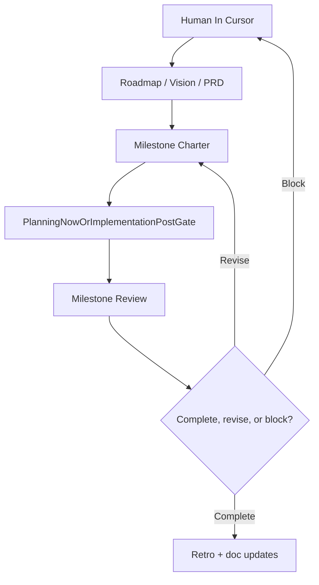

# Autonomous Milestone System

## Purpose

Define how this repo should support low-touch, milestone-based execution without pretending that every milestone is already safe to run unattended.

Repo-local scaffolding may exist for future low-touch runs, but that scaffolding is not permission to skip milestone approval, verification, or human checkpoints.

## Current stage boundary

The repository is still in the planning / vision stage.

That means the immediate focus is:

- product clarity
- roadmap sequencing
- milestone charters
- review and retro templates
- decision records that reduce ambiguity before implementation
- control-plane scaffolding that supports later implementation without driving product direction itself

It does **not** mean:

- a starter app template or validation stack choice means product implementation is already approved
- every new task should use unattended mode
- long-running agent loops should launch by default
- agent teams should become the default control plane

## Core principles

1. The human owns product direction and approves milestone boundaries.
2. The primary unit of work is a **milestone**, not a calendar sprint.
3. Milestones must be outcome-based and reviewable.
4. A milestone only counts as complete when its acceptance evidence is satisfied.
5. Autonomous execution is optional and staged in after the docs and milestone model are stable.
6. Agent teams are a later accelerator for clearly parallel work, not the default backbone.

## Definitions

### Phase

A high-level roadmap bucket used for sequencing and validation. Phases belong in `docs/roadmap.md`.

### Milestone

A concrete, reviewable slice of progress that can finish independently. Milestones belong in `docs/milestones/`.

### Milestone review

A short document that answers:

- what changed
- whether acceptance evidence was met
- what remains unresolved
- whether the next milestone should proceed, change, or pause

### Retro

A lightweight reflection after a milestone or planning pass that captures what to keep, change, and write back into shared docs.

### Blocker

Any issue that should stop autonomous progress and force a human decision because it changes scope, direction, or trust.

## Operating model

Today, treat the `PlanningNowOrImplementationPostGate` step as planning work only. Implementation belongs on the post-gate side of that label.

## Later execution model

When the repo is ready for implementation, the preferred execution stack is:

- Cursor as the human-facing orchestrator and shared repo contract
- Claude Code as an optional unattended executor for bounded tasks
- repo-local task specs, handoffs, and verification files under `ops/agent/`
- milestone-specific prompts and scripts for low-touch work
- optional agent teams only when work splits cleanly into independent lanes

This future model should be treated as a **capability to add later**, not a current repo requirement.

Implementation details for that stack live in `docs/ops/agent-runtime.md`.

## Stop conditions for future autonomous runs

Any future low-touch milestone loop should stop on one of four states:

1. **Done**: acceptance evidence is met and the milestone review is complete.
2. **Blocked**: a blocker requires a human decision.
3. **Failed**: execution or verification has reached a terminal error state that should not be retried automatically.
4. **Budget exhausted**: the loop has spent its agreed time / token / complexity budget without reaching done.

## Required artifacts before autonomous implementation begins

Before any real unattended milestone execution starts, the repo should have:

- an approved milestone charter
- an agreed acceptance checklist
- a review template
- a blocker report template
- a retro template
- clear repo memory for Claude (`CLAUDE.md` + `AGENTS.md`)
- an implementation-ready plan for the relevant milestone

Several planning-stage prerequisites already exist in this repo. The remaining gates are not "create more files at any cost"; they are:

- human approval to move from planning into implementation
- a stable milestone model that the team trusts
- an implementation-ready plan for a specific milestone
- explicit agreement that unattended execution is worth the added complexity

## When to use agent teams later

Agent teams make sense when:

- frontend, backend, testing, or review can move independently
- multiple hypotheses need parallel investigation
- the benefit of parallelism clearly outweighs coordination cost

They are a poor default when:

- the work is mostly sequential
- one file or one narrow surface is the main bottleneck
- the milestone is still mostly product ambiguity rather than build work
- the same result can be achieved more simply with one bounded worker plus a verify step

## Not-now decisions

These are intentionally deferred:

- higher-order hook policies beyond the implemented baseline scaffolding
- exact skill set for run/review/retro loops
- app stack wiring
- offline/sync implementation details
- durable schedulers beyond the current local planning workflow
