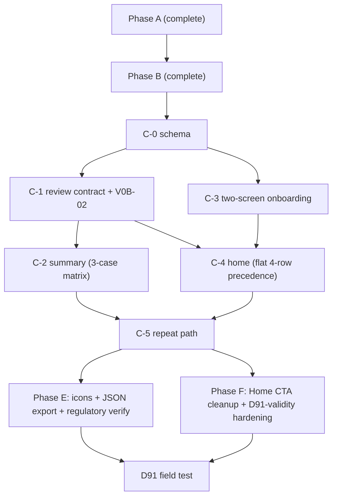

---

## title: "Rest of v0b: Phases C, D, E consolidated plan"
type: plan
status: active
date: 2026-04-16
origin: docs/plans/2026-04-12-v0a-to-v0b-transition.md
depends_on:
  - docs/plans/2026-04-12-v0a-to-v0b-transition.md
  - docs/specs/m001-phase-c-ux-decisions.md
  - docs/specs/m001-review-micro-spec.md
  - docs/specs/m001-home-and-sync-notes.md
  - docs/specs/m001-session-assembly.md
  - docs/specs/m001-adaptation-rules.md
  - docs/specs/m001-courtside-run-flow.md
  - docs/plans/2026-04-16-001-feat-phase-a-schema-data-shape-plan.md
  - docs/plans/2026-04-16-002-feat-phase-b-test-infra-sw-safety-plan.md
supersedes: "Sections 4 and 6 of the master transition plan for remaining scope"

# Rest of v0b: Phases C, D, E

## Agent Quick Scan

- This plan supersedes §4 (item backlog) and §6 (execution sequence) of `docs/plans/2026-04-12-v0a-to-v0b-transition.md` for the remaining v0b scope. Items marked landed or completed here override the status in the master plan.
- Phase A (schema/data shape) and Phase B (SW safety + test infra) are complete. Several Phase C items have also landed in the working tree ahead of this plan (see §1 below).
- Phase C is re-sequenced by product risk: **review contract and session summary land before onboarding and home priority**. The user's flow is Home → Onboarding → Setup → Safety → Run → Review → Summary, but the review/summary surfaces carry the most design risk and have the fewest dependencies.
- The authoritative UX spec for Phase C surfaces is `docs/specs/m001-phase-c-ux-decisions.md`. This plan owns the execution order, item status, and integration details; the UX spec owns the wireframes, copy, state machines, and product decisions.
- v0b is the **D91 field-test artifact**, not the full M001 product contract. Cuts here that reduce explanation density or longitudinal investment are cohort-time concessions, not blanket product rejection.

---

## 1. What has already landed

### Phase A — schema and data shape (complete)

V0B-12 (drill-variant grain), V0B-23 (actualDurationMinutes), V0B-29 (borderlineCount round-trip). Plan: `docs/plans/2026-04-16-001-feat-phase-a-schema-data-shape-plan.md`.

### Phase B — test infra and SW safety (complete)

V0B-20 (SW prompt flip + UpdatePrompt), V0B-21 (warm-offline smoke), V0B-22 (blocked schema-upgrade smoke + SchemaBlockedOverlay). Plan: `docs/plans/2026-04-16-002-feat-phase-b-test-infra-sw-safety-plan.md`.

### v0b pre-work (complete)

V0B-18 (pain-branch regulatory copy), V0B-19 code pass (Downshift rename + preset tightening + 15-min warm-up slot), V0B-24 (install-posture detector + three-state save copy on CompleteScreen), V0B-25 (gesture-bound `persist()` on session start). Also landed: `app/src/lib/skillLevel.ts` (D121 shim).

### Phase C-0 schema (complete, 2026-04-17)

Dexie v4 migration (`storageMeta` table + `backfillSessionReviewStatus` + `backfillOnboardingCompletedAt`); `SessionReview.status`, `SetupContext.wind`, `SessionDraft.rationale`, `StorageMetaEntry` types; `storageMeta` service helper; writers emit `status`; contract + Playwright smokes green. Plan: [2026-04-16-005-feat-phase-c0-schema-plan.md](2026-04-16-005-feat-phase-c0-schema-plan.md).

### Phase C-1 review contract + V0B-02 (complete, 2026-04-17)

All ten C-1 units landed: A1 filters, A3 transactional guards (4×3 matrix), A6 submit-time cap re-check, A7 softBlock helper + cleanup, A8 discarded-resume belt, A9 CompleteScreen universal landing, draft persistence + notCaptured, Finish Later wiring, H19 conflict handoff, V0B-02 / H13 tap-to-type rewrite of `PassMetricInput`. B4 2h rationale comment landed with the cleanup pass. Plan: [2026-04-17-feat-phase-c1-review-contract-plan.md](2026-04-17-feat-phase-c1-review-contract-plan.md).

### Phase C-2 session summary on CompleteScreen (complete, 2026-04-17)

All four C-2 units landed: `composeSummary` pure function (`app/src/domain/sessionSummary.ts`) with A2 pain-first + H10 3-case matrix; `countSubmittedReviews` counter query in `services/review.ts`; CompleteScreen rewritten to the Surface 5 inverted-pyramid (header → verdict → reason → recap → save-status); `formatPassRateLine` helper in `lib/format.ts` delivers V0B-13 `N alongside %`; copy regex guard in place at composer and CompleteScreen integration layers. Plan: [2026-04-17-feat-phase-c2-session-summary-plan.md](2026-04-17-feat-phase-c2-session-summary-plan.md).

### Phase C red-team hardening pass (complete, 2026-04-17)

Structured code review (ce:review pattern) dispatched 6 reviewer personas in parallel against the Phase C diff; 28 findings returned. Landed 12 fixes before moving to C-3: 2 P0 (A9 mount-time stub write + `expireReview` draft preservation), 5 P1 (ReviewScreen + CompleteScreen async try/catch, Finish Later error surfacing, exhaustive `SubmitReviewResult` switch, H19 skipped-vs-submitted differentiated copy, `expireStaleReviews` per-record try/catch), 5 P2 (counter cohort sentinel via `onboarding.completedAt`, autosave note-field 200 ms debounce, copy-guard attribute sweep, `PassMetricInput` discriminated props, HomeScreen handlers `isSchemaBlocked` gate). Deferred findings recorded for post-D91. Plan: [2026-04-17-phase-c-red-team-fixes.md](2026-04-17-phase-c-red-team-fixes.md).

### Phase C-3 two-screen onboarding (complete, 2026-04-17)

All six C-3 units landed: `FirstOpenGate` routes fresh installs to `/onboarding/skill-level` (respects `storageMeta.onboarding.step` for resume); `SkillLevelScreen` renders four D121 pair-first bands + `Not sure yet` and atomically writes `skillLevel` + `step`; `TodaysSetupScreen` is a thin wrapper around `<SetupScreen isOnboarding />` (wind chip + `onboarding.completedAt` write on Build); V0B-16 answer-first safety copy verified on `SafetyCheckScreen`; resume-semantics tests cover explicit step seeds + true unmount/remount round-trip; Playwright smoke proves fresh-install -> Skill Level -> Today's Setup -> Safety AND existing-tester (seeded ExecutionLog + completedAt) skips onboarding. Plan: [2026-04-17-feat-phase-c3-two-screen-onboarding-plan.md](2026-04-17-feat-phase-c3-two-screen-onboarding-plan.md).

### Phase C-4 home priority model + D-C1 soft-block modal (complete, 2026-04-17)

All five C-4 units landed: `getLastComplete()` service returns newest terminal log with a submitted/skipped review (A1/A8 filters applied); `selectPrimaryCard` + `selectSecondaryRows` pure functions in `domain/homePriority.ts` codify the flat 4-row precedence (`resume > review_pending > draft > last_complete > new_user`) with exhaustive 16-combination tests plus spot checks; `HomePrimaryCard` + `HomeSecondaryRow` variant-driven components render Surface 2 wireframes with `role="region"` / `role="list"` accessibility; D-C1 `SoftBlockModal` intercepts non-review CTA taps via `interceptIfSoftBlock` in HomeScreen, consuming A7's `storageMeta.ux.softBlockDismissed.{execId}` plumbing from C-1; HomeScreen rewritten end-to-end to `HomeFlags` state + `HomePrimaryCard` / `HomeSecondaryRow` render with the 6-case precedence-matrix integration test proving resume-mutes-all, review+draft+last secondary stack, and soft-block intercept-on-draft-open. Existing pre-C-4 HomeScreen tests updated to the new Surface 2 copy. Playwright + Vitest clean: 51 files / 365 Vitest tests + 24 Playwright tests all green. Plan: [2026-04-17-feat-phase-c4-home-priority-plan.md](2026-04-17-feat-phase-c4-home-priority-plan.md).

### Phase C-5 repeat path (complete, 2026-04-17)

All four C-5 units landed: `formatDayName()` helper in `lib/format.ts` with local-calendar awareness (Today / Yesterday / weekday name / short date, 7 tests); `StaleContextBanner` dumb component with `role="status"` + `aria-live="polite"`; `SetupScreen` reads `?from=repeat` and fetches `getLastComplete()` to seed the banner + pre-fill context; `handleSameAsLast` on HomeScreen builds a fresh `SessionDraft` via `buildDraft(lastContext)`, persists it via `saveDraft`, and routes directly to `/safety` (falls back to `/setup?from=repeat` when `buildDraft` returns null); `buildDraftFromCompletedBlocks(log, plan)` in `domain/sessionBuilder.ts` filters to plan blocks whose `log.blockStatuses[i].status === 'completed'` (preserves plan order, returns null for zero-completed or context-less plans, 6 tests); `HomePrimaryCard.last_complete` variant extended to render two buttons when `log.status === 'ended_early'` (`Repeat full N-min plan` primary + `Repeat what you did (M min)` secondary, minute counts sum directly from `plan.blocks[].durationMinutes`); `handleRepeatWhatYouDid` on HomeScreen wired through `interceptIfSoftBlock` per C-4 soft-block contract; D83 regression test in `SafetyCheckScreen.d83-regression.test.tsx` seeds prior pain/recency answers via SessionPlan + SessionReview + ExecutionLog and proves neither the Continue button nor PainOverrideCard render (both reveal-on-answer, so absence proves default state); Playwright `phase-c5-repeat.spec.ts` covers all three flows (normal Repeat → Setup+banner → Safety defaults → Run; ended-early partial → Safety; Same-as-last → Safety). Vitest + Playwright clean: 56 files / 393 Vitest tests + 27 Playwright tests all green. Plan: [2026-04-17-feat-phase-c5-repeat-path-plan.md](2026-04-17-feat-phase-c5-repeat-path-plan.md).

### Phase C post-landing polish — SafetyCheckScreen escape hatch (complete, 2026-04-17)

Dogfooding surfaced that `SafetyCheckScreen` was the single screen without an explicit back affordance: every other pre-run / post-run screen already carried either `← Home` (SetupScreen), `← Skill level` (TodaysSetupScreen / onboarding), `Back to start` (ReviewScreen / CompleteScreen / TransitionScreen / RunScreen-error), or a pause-confirm-end flow (RunScreen mid-session). SafetyCheck forced the tester to answer pain + recency before any escape was possible, creating a "stuck" feeling when the tester changed their mind post-Build. **Fix:** added a three-column header (`← Back` | centered "Before we start" | spacer) mirroring `SetupScreen`'s pattern so the tap zone is consistent across the pre-run flow. `← Back` navigates to Home without mutating the persisted `SessionDraft` — the draft surfaces on Home as the Draft primary card per C-4 Surface 2, so "I'll pick this up later" is a free escape from a data-integrity standpoint. Two regression tests in `SafetyCheckScreen.test.tsx` (`describe('SafetyCheckScreen escape hatch')`) pin both the navigation contract and the draft-unchanged invariant. Vitest: 56 files / 395 tests (+2). No plan owned this work; documented here for traceability.

### Phase F — D91-validity hardening + Home CTA cleanup (complete, 2026-04-19)

Founder-led UX red-team from a beach-amateur weekend-warrior POV surfaced five items that either (a) threatened D91 validity by actively misleading or blocking the target user, or (b) left same-URL duplication in the Phase C landed Home CTAs. Phase F landed 2026-04-19 — all five units green alongside regression test coverage (+46 vitest tests, +1 Playwright spec). Plan: [2026-04-19-feat-phase-f-d91-validity-hardening-plan.md](./2026-04-19-feat-phase-f-d91-validity-hardening-plan.md).

**Units (all landed 2026-04-19):**

1. **Home CTA cleanup** — LastComplete card drops `Same as last time` and `Edit` (same URL as Repeat), adds `Start a different session` tertiary text link (both normal + ended-early variants). Draft card renames `Edit` → `Change setup`. Amends D-C3 + D-C5 in the Phase C UX spec; amends Surface 2 + Surface 6 wireframes; amends State 2 + State 4 in `m001-home-and-sync-notes.md`.
2. **Solo-aware Skill Level header** — `SkillLevelScreen` and `TodaysSetupScreen` swap to solo voice (`"Where are you today?"`) when prior `storageMeta.lastPlayerMode === 'solo'`; first-open cold state defaults to pair voice. D121 taxonomy enum unchanged. New `storageMeta.lastPlayerMode` key (written on `createSessionFromDraft`).
3. **Block-end audio cue** — `lib/audio.ts` adds `playBlockEndBeep()` + `playPrerollTick()` via `AudioContext` oscillator. Narrow slice of `V0B-08` (full layered cue stack stays post-D91). Required v0b baseline because `navigator.vibrate` is unsupported on iOS Safari PWA (`D57`); without the beep the "phone courtside viable" D91 hypothesis cannot be honestly tested.
4. **Swap on RunScreen** — `RunControls` adds the missing `Swap` button (active + paused states). Cycles the current block's drill to the next-ranked curated alternate within the same block slot. Mutates `ExecutionLog.plan` only, preserving `SessionPlan` snapshot per `D37`. Warmup / wrap disabled. Spec upgrade in `m001-courtside-run-flow.md` §3.
5. **Phase C lite-polish** — `CompleteScreen` verdict glyph replaces the literal `=` character with an inline SVG; `RunScreen` defaults coaching cues to visible (Hide instead of Show); `composeSummary` default reason line reframes `"Not enough reps yet to trust the rate"` → `"Just getting started — I'll start tuning once you have a few more in the book."`

### Phase E content + founder tooling (complete, 2026-04-17)

All three Phase E units landed:

- **Unit 1 — V0B-06 (icons):** committed `sharp`-based generator at `app/scripts/generate-icons.mjs` + `npm run icons:generate`. Four PNGs emitted (`icon-192`, `icon-512`, `icon-512-maskable`, `apple-touch-icon-180`) with the maskable variant rendered from an `rx="0"` rewrite of the source SVG so Android's mask gets a flush square. Manifest in `vite.config.ts` rewritten to three PNG entries with split `any` / `maskable` purposes (Chromium's install flow warns against the previous `any maskable` single SVG); `apple-touch-icon` in `index.html` points at the 180px PNG. Build passes with 20 precache entries.
- **Unit 2 — V0B-15 (JSON export):** `buildExportPayload` + `downloadExport` in `services/export.ts`; minimal `SettingsScreen` at `/settings` with one button + success / error status copy; subtle Home footer Settings link. Payload includes `sessionPlans` + `executionLogs` (with `actualDurationMinutes`) + `sessionReviews` (with V0B-30 capture-window fields) + `storageMeta`; explicitly excludes `sessionDrafts` and `timerState`. `structuredClone` isolates returned payload from Dexie rows. File name `volley-drills-export-YYYY-MM-DD.json`. 6 unit + 5 component tests.
- **Unit 3 — V0B-18 (regulatory copy audit broadened):** `lib/copyGuard.ts` hoists `FORBIDDEN_RE` + `AVOID_PHRASES` + `scanForForbidden` + `scanElementForForbidden` (scans body text AND ARIA attributes — catches screen-reader-only labels that `document.body.textContent` missed). 19 helper unit tests. 15-surface regression sweep at `lib/__tests__/copyGuard.phase-c-surfaces.test.tsx` covers every Phase C screen + every HomePrimaryCard / HomeSecondaryRow variant + Brandmark / StaleContextBanner / SoftBlockModal / SettingsScreen. Existing copy-guard sites (`CompleteScreen.copy-guard.test.tsx`, `sessionSummary.test.ts`, `SafetyCheckScreen.test.tsx`) refactored to import the shared regex instead of duplicating it. All 15 current surfaces scan clean.

**UI polish — `Brandmark` component:** Replaced the prototype-era 🏐 emoji in HomeScreen's three render states (loading, error, header) with an inline SVG `<Brandmark>` component that matches the installed app icon. Tightened Home header from a centered 4xl emoji + 2xl bold title (read like a splash screen on every render) to an inline 28px icon + text-base wordmark so the primary card carries the visual weight. 3 Brandmark tests.

Plan: [2026-04-17-feat-phase-e-content-tooling-plan.md](2026-04-17-feat-phase-e-content-tooling-plan.md). Vitest + Playwright clean: 61 files / 444 Vitest tests + 27 Playwright tests all green.

### Phase C / Phase E wrap — D91-ready

With Phase E landed, v0b is feature-complete for the D91 field test per the `H8` / `H15` deployment posture. No further tester-facing code changes land before D91 kickoff. Remaining pre-launch items are non-code: app-store submission (if any), D91 tester recruitment, founder replay script spot-check against a dogfeed export.

This is the **field-test cut**, not the full self-coached product ceiling. Post-D91 work should resume first on the self-coached weekly-confidence layer before coach-connected expansion.

### Post-D91-ready dogfeed polish (complete, 2026-04-19)

Dogfeed session flagged four issues, all landed:

- **Em-dash removal pass.** User-visible copy no longer uses em-dashes (`—`) or en-dashes (`–`) as clause separators or sentinels. Replacements per context: `format.ts` "no value" sentinel `\u2014` -> plain hyphen `-` (with a named `NO_VALUE` constant so the intent is legible); `sessionSummary.ts` four summary lines replaced em-dash clause joiners with periods ("No review this time. Next session stays at the same level." etc.) and swapped "X good passes today — Y attempts" to "X good passes today out of Y attempts"; `ReviewScreen` conflict copy "already reviewed — showing what we saved" -> "already reviewed. Showing what we saved"; `SoftBlockModal` body rewritten to end the sentence before "Finish it first"; `PainOverrideCard` Override button "Override — use my original session" -> "Override: use my original session"; `SafetyCheckScreen` heat tip "10 AM – 4 PM" -> "10 AM to 4 PM" and sub-header "Solo + Wall — 25 min, 5 blocks" -> middle-dot separator ("Solo + Wall · 25 min, 5 blocks") for consistency with the LastComplete card. Test fixtures in `sessionSummary.test.ts`, `format.test.ts`, and `CompleteScreen.copy-guard.test.tsx` all updated; the copy-guard now explicitly asserts `not.toContain('\u2014')` as a regression check.

- **SafetyCheckScreen section reorder.** Pain-question-first + PainOverrideCard-sandwiched-between-questions made the Recency chips below look blocked by the override card when the tester tapped Yes. Reordered: Recency now section 1, Pain section 2, PainOverrideCard rendered directly below its triggering question (canonical reveal-on-answer pattern). Ordering pinned by a new `SafetyCheckScreen.test.tsx` case that asserts `headings[0]` matches "when did you last train" and `headings[1]` matches "pain that changes how you move" — a future revert breaks CI loudly.

- **Home chrome coverage gaps closed.** Two new regression tests in `HomeScreen.test.tsx` pin (a) the `<Brandmark>` SVG renders in the header with the accessible label (a regression guard so nobody can silently swap it back for 🏐), and (b) the footer `Settings` link routes to `/settings`.

- **Playwright smoke for V0B-15 export.** Previously claimed in the Phase E plan but not shipped; now lives at `e2e/phase-e-settings-export.spec.ts` (2 cases: Home footer -> Settings -> Export captures the `volley-drills-export-YYYY-MM-DD.json` anchor filename + success toast; Back from Settings returns to Home NewUser empty state unchanged). Instrumentation uses `page.addInitScript` to intercept anchor `click()` since download dialogs are suppressed under automation.

Final gates all green: tsc clean, eslint clean, **62 Vitest files / 456 tests**, **29 Playwright tests** (27 prior + 2 new Phase E smokes).

### Phase C early landings (pre-C-0, in working tree before C-0 shipped)

The following items landed in the working tree during pre-build work and are verified against the diffs:


| Item           | Status     | What landed                                                                                                                                                                                                                                                                                                                                       |
| -------------- | ---------- | ------------------------------------------------------------------------------------------------------------------------------------------------------------------------------------------------------------------------------------------------------------------------------------------------------------------------------------------------- |
| V0B-01         | **Landed** | 0-10 discrete chip grid with sparse Borg anchors, `ariaLabelledBy` prop, SELECTED_HINT confirming phrases. Full rewrite of `RpeSelector.tsx`.                                                                                                                                                                                                     |
| V0B-28         | **Landed** | Forced-criterion prompt on ReviewScreen: "Success rule: ball reached the target zone or the next contact was playable. If unsure, count it as Not Good."                                                                                                                                                                                          |
| V0B-30         | **Landed** | `RpeCaptureWindow` type, `capturedAt` / `captureDelaySeconds` / `captureWindow` / `eligibleForAdaptation` on `SessionReview`. `classifyCaptureWindow()` + `isEligibleForAdaptation()` in review.ts. `submitReview()` auto-computes all fields. Tests: 7 classification tests + 2 round-trip tests.                                                |
| V0B-31         | **Landed** | `expireReview()` + `FINISH_LATER_CAP_MS` (2 h) + `expireStaleReviews()` in session.ts. `findPendingReview()` filters by cap. HomeScreen calls `expireStaleReviews()` on resolve + two-step skip confirm. ReviewScreen: `expired` state with lock message + "Back to start" link. "Finish later" text link below Submit + countdown window helper. |
| V0B-32         | **Landed** | Pair-mode review copy: `How hard was this session for you?` + `One rating per device. Partner's score isn't required.` when `playerCount === 2`. RTL test file at `ReviewScreen.pair-copy.test.tsx`.                                                                                                                                              |
| D-C7 (partial) | **Landed** | `sessionRpe: number                                                                                                                                                                                                                                                                                                                               |


---

## 2. Scope boundaries

### What Phase C ships

- Two-screen onboarding (Skill Level → Today's Setup) with D121 pair-first functional bands. Home/NewUser screen cut per H9 — first-open routes directly to Skill Level with a one-line preamble.
- Home screen multi-state priority model with precedence table
- Constrained template session assembly from Setup (no Session Prep screen per D98)
- Full review contract: Finish Later (2h cap), deferred sRPE, draft persistence, status field, discarded-resume bypass
- Session summary with minimum-honest-copy **3-case matrix** on CompleteScreen (skipped / pain / default). CompleteScreen is the universal post-session landing — submit, skip, and expired flows all route here (H16 / A9).
- Repeat path from LastComplete with pre-filled Setup
- V0B-26 and V0B-27 both cut per the approved red-team fix plan v3 (`H5` cut V0B-26; `H12` cuts V0B-27). Safari→HSWA corner case is handled by install instructions + founder contact for the D91 cohort.

### What Phase F ships (pre-D91 hardening, 2026-04-19)

Added after Phase C landed; items surfaced by the weekend-warrior UX red-team that either threaten D91 validity or leave same-URL duplication in the landed Home CTAs. See [2026-04-19-feat-phase-f-d91-validity-hardening-plan.md](./2026-04-19-feat-phase-f-d91-validity-hardening-plan.md) for unit-level detail.

- Home CTA cleanup: drop `Same as last time` + `Edit` from LastComplete; add `Start a different session`; rename Draft `Edit` → `Change setup`.
- Solo-aware Skill Level header (surface-level copy only; D121 taxonomy enum unchanged).
- Block-end + preroll audio cues (narrow slice of V0B-08).
- Swap action on RunScreen (spec already required per `m001-courtside-run-flow.md` §3; impl gap).
- Phase C lite-polish (verdict glyph, coaching-cue default, forward-looking reason copy).

### What is cut or deferred (reflects approved red-team fix plan, 2026-04-16)


| Item                                                                            | Disposition                                            | Rationale                                                                                                                        |
| ------------------------------------------------------------------------------- | ------------------------------------------------------ | -------------------------------------------------------------------------------------------------------------------------------- |
| V0B-11 full reason-trace engine (`peak30`, `curr14/prev14`, novelty-spike)      | Deferred to M001-build                                 | Cannot meaningfully fire in a 14-day / 2-session cohort (D-C2)                                                                   |
| Session history surface (list, filter, search)                                  | Deferred out of v0b (post-D91 backlog, V0B-07)         | Minimal session-counter ships inside summary reason line instead                                                                 |
| Duplicate-and-edit as separate surface                                          | Folded into Repeat path (D-C5)                         | Redundant with LastComplete + pre-filled Setup                                                                                   |
| Multi-nudge / scheduled-prompt for Finish Later                                 | Dropped                                                | One badge on Home; no time-based re-prompts                                                                                      |
| Push notifications for deferred sRPE                                            | Out of scope                                           | iOS PWA constraint                                                                                                               |
| "Switch to solo/pair fallback" as Home action                                   | Folded into Setup re-entry                             | Home Draft card "Edit" reopens Setup                                                                                             |
| `SessionPlan.context.setWindowPlacement` reservation                            | **Cut** (C3)                                           | Dexie doesn't require pre-declaration for optional fields; lands with V0B-14 post-D91                                            |
| V0B-17 variant-ready safety routing                                             | **Cut** (C1)                                           | Framework ahead of need; no variant test exists                                                                                  |
| V0B-26 storage-health log                                                       | **Cut** (C2)                                           | 5 testers + founder check-ins observe failures through conversation; schema entity not justified                                 |
| `SessionReview.reviewTiming` field                                              | **Cut** (C4)                                           | Derive at export/readout time; ~10-20 reviews means replay cost is trivial                                                       |
| Home precedence `>7d` subtext, `>21d` demote, **and `>28d Welcome back`** tiers | **Cut all three** (C5 partial + H11/C15)               | All unreachable in a 14-day D91 window; seasonal-returner concern is M001-build scope                                            |
| Multi-pending-review count UI                                                   | **Don't-add** (C6)                                     | `findPendingReview()` already returns newest-only; no code to remove                                                             |
| `SessionDraft.rationale` "See why" UI + "What changes next time" line           | **Cut** (C7)                                           | Schema field stays for M001-build; UI tap targets for optional transparency violate the low-cognitive-load thesis                |
| V0B-09 +5/+10 stepper for pass metric                                           | **Cut** (H6 thesis extension)                          | V0B-02 tap-to-type ships; adding a third counting pattern costs cognitive load                                                   |
| V0B-05 landscape orientation                                                    | **Cut** (H8)                                           | Testers can rotate; not broken                                                                                                   |
| V0B-10 editorial content pass                                                   | Deferred to post-D91 (H8)                              | Editorial polish doesn't reduce annoyance; structural drill content already functions                                            |
| V0B-19 remaining (Beach Prep Three warm-up restructure)                         | Deferred to post-D91 (H8)                              | Pre-work structural landing is sufficient for D91 readout                                                                        |
| V0B-03/V0B-04/V0B-08/V0B-14 (Phase D polish)                                    | Deferred to post-D91 (H6)                              | Courtside polish without design risk; cherry-pick only if day-3 pulse evidence demands                                           |
| Full `progress` / `deload` engine paths                                         | M001-build                                             | v0b only renders "Keep building" / "No change" / "Lighter next" per the 3-case matrix (H10 collapsed from 6→3 cases)             |
| Home/NewUser welcome screen                                                     | **Cut** (H9 / C13)                                     | Content-free screen violates the thesis; merge the welcome line into Skill Level header                                          |
| Summary matrix cases 1/2/3/6 (four "Keep building" variants)                    | **Collapsed to default case** (H10 / C14)              | Four wordings for one verdict is matrix theater; session counter + raw numbers works for all bootstrap and post-bootstrap states |
| V0B-27 Safari→HSWA banner                                                       | **Cut** (H12 / C16)                                    | 5-tester concierge handles corner case via install instructions and founder contact                                              |
| Per-player subjective-load entries                                              | M001-build (D115 `SessionParticipant[]`)               | v0b stays single device-holder RPE                                                                                               |
| Persistent partner / team identity                                              | Post-D117                                              | D114-D117 exclusion                                                                                                              |
| Session history list (full surface)                                             | Post-D91 (V0B-33 if triggered by day-3 pulse evidence) | Counter inside summary captures most of the accumulation benefit at zero schema cost                                             |


### Deferred but not demoted (post-D91 self-coached follow-ons)

These items are intentionally **out of v0b** but should be read as first-return candidates once the D91 gate clears:

- recommendation-first starter reveal or lightweight workout preview before the flow feels like a form
- richer visible reasoning (`why this session?`, `what changed next time?`) once enough signal exists to support it honestly
- weekly-confidence surfaces: shallow next-N planning, minimal weekly receipt, and the smallest accumulation layer that makes the app feel like a training home

### What Phase D ships

**V0B-02 only** (carved out per `H6`; ships as part of C-1 review surface work since the pass counter is a review-time concern). Everything else originally in Phase D is deferred post-D91.

### What Phase E ships

Content editorial, icons, export, and last pre-field-test tooling.

---

## 3. Execution sequence (dependency DAG)




**Parallelism:** C-1 and C-3 can be built concurrently after C-0 lands. Single-engineer sequencing is C-0 → C-1 → C-2 → C-3 → C-4 → C-5 → E; two-engineer sequencing can parallelize C-1 and C-3. **Phase D is empty** in v0b — V0B-02 is carved into C-1 per H6/H13; all other original Phase D items are deferred post-D91. **Phase C-3 onboarding is two screens**, not three — Home/NewUser cut per H9; first-open routes directly to Skill Level with a one-line preamble.

**Deployment posture (per H15):** no tester-facing incremental builds during Phase C. Internal testing and dogfooding happen on dev builds; D91 testers receive a single end-to-end v0b build at D91 kickoff. C-3 also includes a backfill migration for any device with existing `ExecutionLog` records (sets `onboarding.completedAt`) as defense in depth.

### Phase C-0 — Schema prereq (~2-3 days)

Land the Dexie version bump and new fields/tables that Phase C surfaces depend on. All additions are optional or additive except the `storageMeta` table which requires a new Dexie version.

**Items:**


| Field / table                                             | Location       | Purpose                                                                                                                                                                                                                                                                                 |
| --------------------------------------------------------- | -------------- | --------------------------------------------------------------------------------------------------------------------------------------------------------------------------------------------------------------------------------------------------------------------------------------- |
| `storageMeta` table (key-value)                           | `db/schema.ts` | Keys used in v0b: `onboarding.skillLevel`, `onboarding.completedAt`, `onboarding.step`, `ux.softBlockDismissed.{execId}` (A7; cleaned up on terminal-review write). Cut: `ux.staleDraftLastWarnedAt` (age tiers dropped per C5), `banner.safariToHswaDismissedAt` (V0B-27 cut per H12). |
| `SessionReview.status: 'submitted' | 'skipped' | 'draft'` | `db/types.ts`  | Replaces `sessionRpe: -1` sentinel (D-C7, A5)                                                                                                                                                                                                                                           |
| `SetupContext.wind?: 'calm' | 'light' | 'strong'`         | `db/types.ts`  | D93 wind capture at session start                                                                                                                                                                                                                                                       |
| `SessionDraft.rationale?: string`                         | `db/types.ts`  | One-sentence assembly reason. **Schema-only per C7**: `buildDraft()` may emit `undefined` or stub string in v0b; no UI consumer ships                                                                                                                                                   |


**Cut from v0b C-0:** `SessionReview.reviewTiming` (derive at export), `SessionPlan.context.setWindowPlacement` (lands with V0B-14 if it ever ships).

**Contract tests (new invariants):**

- `SessionReview.status === 'submitted'` implies `sessionRpe` is a number in `[0, 10]`
- `SessionReview.status === 'skipped'` implies `sessionRpe === null` and `goodPasses === 0`
- `storageMeta` round-trips arbitrary key-value pairs through Dexie with transaction atomicity across multi-key writes (`A4`)
- Existing v3 reviews without `status` field are migrated to `'submitted'` if `sessionRpe` is a valid number, or `'skipped'` if `sessionRpe === null || sessionRpe === -1`
- Property test: after migration, every review record has a defined `status` field

**Dependencies:** None (Phase A/B complete).

**Approach:** Single Dexie version bump (v4). Migration uses `db.version(4).upgrade(async tx => { ... })` to backfill `status`. Migration must check `sessionRpe !== null && typeof sessionRpe === 'number' && sessionRpe >= 0` — not truthiness (a valid RPE of 0 would be lost). The `storageMeta` table is added in the same v4 migration.

### Phase C-1 — Review contract (~1 week)

The full review flow including Finish Later, deferred sRPE, draft persistence, the enumerated filter work from `A1`, and V0B-02 tap-to-type (carved out of Phase D per `H6`). Most of the service layer already landed (see §1); this phase wires the remaining UI plus the race-safety fixes from the approved red-team fix plan.

**Items:**


| ID                            | Item                                              | Status                                             | Phase C-1 work remaining                                                                                                                                                                                                                                                                                                                                                                 |
| ----------------------------- | ------------------------------------------------- | -------------------------------------------------- | ---------------------------------------------------------------------------------------------------------------------------------------------------------------------------------------------------------------------------------------------------------------------------------------------------------------------------------------------------------------------------------------- |
| V0B-01                        | 0-10 RPE chip grid                                | **Landed**                                         | Verify integration with `status: 'draft'` persistence. No further work.                                                                                                                                                                                                                                                                                                                  |
| V0B-28                        | Forced-criterion prompt                           | **Landed**                                         | No further work.                                                                                                                                                                                                                                                                                                                                                                         |
| V0B-30                        | Capture-window fields                             | **Landed**                                         | No further work on the four core fields. (`reviewTiming` cut per C4.)                                                                                                                                                                                                                                                                                                                    |
| V0B-31                        | Finish Later 2h cap                               | **Landed** (C-1 Unit 8, 2026-04-17)                | Finish Later persists review as `status: 'draft'` via `saveReviewDraft` through the A3 envelope; re-entry rehydrates via `loadReviewDraft`; `expireReview` writes `status: 'skipped'` terminal stub on past-cap sweep.                                                                                                                                                                   |
| V0B-32                        | Pair-mode review copy                             | **Landed**                                         | No further work.                                                                                                                                                                                                                                                                                                                                                                         |
| D-C7 / **A5**                 | Review status field + writers                     | **Landed** (C-0 Units 1+5, 2026-04-17)             | `status` field added to type + all three writers (`submitReview` / `expireReview` / `skipReview`) emit it unconditionally.                                                                                                                                                                                                                                                               |
| **A1**                        | Enumerated filter per caller                      | **Landed** (C-1 Unit 1, 2026-04-17)                | `findPendingReview` + `expireStaleReviews` exclude drafts AND discarded-resume logs; `expireReview` idempotency guard changed to overwrite drafts. C-2 counter + V0B-15 export + D-C1 modal callers land in their owning sub-phases.                                                                                                                                                     |
| **A3**                        | Transactional read-decide-write guards            | **Landed** (C-1 Unit 2, 2026-04-17)                | Every writer wrapped in `db.transaction('rw', db.sessionReviews, db.storageMeta, ...)`. 4×3 state-vs-action matrix covered by `review.a3-matrix.test.ts` (12/12 cells). Intra-connection atomicity only per H17.                                                                                                                                                                        |
| **A6**                        | Submit-time cap re-check on ReviewScreen          | **Landed** (C-1 Unit 3, 2026-04-17)                | `ReviewScreen.handleSubmit` re-checks `isPastDeferralCap`; past-cap calls `expireReview` inline and routes to `/complete/{execId}`. Covered by `ReviewScreen.a6-cap-recheck.test.tsx`.                                                                                                                                                                                                   |
| **A7**                        | Soft-block modal instance identity                | **Landed** (C-1 Unit 4, 2026-04-17 — helper + cleanup); modal UI ships in C-4. | `app/src/services/softBlock.ts` exports `read` / `mark` / `clear`; all three terminal-review writers call `clearSoftBlockDismissed(execId, tx)` inside their A3 transaction.                                                                                                                                          |
| **A8**                        | **Exclude discarded-resume from pending queries** | **Landed** (C-1 Units 1+5, 2026-04-17)             | `findPendingReview` + `expireStaleReviews` skip `endedEarlyReason === 'discarded_resume'`; ReviewScreen auto-routes to `/` as a belt over the service filter.                                                                                                                                                                                                                           |
| **A9**                        | **CompleteScreen universal post-session landing** | **Landed** (C-1 Unit 6, 2026-04-17)                | `HomeScreen.handleSkipReview` navigates to `/complete/{execId}`; ReviewScreen past-cap path auto-routes to `/complete/{execId}`; the old dead-end "Back to start" lock is gone.                                                                                                                                                                                                         |
| —                             | Discarded-resume bypass                           | **Landed** (C-1 Unit 5, 2026-04-17)                | ReviewScreen's `useEffect` routes discarded-resume logs to `/` before form state is seeded. Belt with A8's suspenders.                                                                                                                                                                                                                                                                  |
| —                             | `notCaptured` escape                              | **Landed** (C-1 Unit 7, 2026-04-17)                | "Couldn't capture reps this time" chip in `PassMetricInput` zeros the metric and adds `'notCaptured'` to `quickTags`; draft persists the tagged state.                                                                                                                                                                                                                                  |
| —                             | Review draft persistence                          | **Landed** (C-1 Unit 7, 2026-04-17)                | `saveReviewDraft` / `loadReviewDraft` through the A3 envelope; ReviewScreen rehydrates via a `hydrated` gate and auto-saves on every meaningful form change.                                                                                                                                                                                                                            |
| —                             | Deferred-sRPE re-entry                            | **Landed** (C-1 Units 7+8, 2026-04-17)             | Home "Finish Review" → ReviewScreen `loadReviewDraft` seeds form state; capture-window bucket is computed at submit time per V0B-30.                                                                                                                                                                                                                                                    |
| **V0B-02 / B5**               | **Tap-to-type pass metric (sole control)**        | **Landed** (C-1 Unit 10, 2026-04-17)               | `PassMetricInput.tsx` fully rewritten. `<input type="number" inputMode="numeric">` tap-to-type Good + Total; commit on blur or Enter; Good > Total auto-bumps Total; negatives clamp to 0. No +/- controls. Regression guard in `PassMetricInput.test.tsx`.                                                                                                                            |
| **A2**                        | Pain-first summary matching                       | **Fresh (wires into C-2)**                         | Pain branch matches before default; `skipped` branch matches before both. Three cases total. See C-2 for the copy matrix.                                                                                                                                                                                                                                                                |
| **B4**                        | 2h Finish Later rationale note                    | **Landed** (C-1 cleanup, 2026-04-17)               | `FINISH_LATER_CAP_MS` comment in `app/src/services/review.ts` cites V0B-31 / B4 / D120 `same_session` / `same_day` boundaries explicitly.                                                                                                                                                                                                                                                |
| **A3 refused-write UX / H19** | Conflict handoff                                  | **Landed** (C-1 Unit 9, 2026-04-17)                | `submitReview` returns `{ status: 'refused' }` on any existing terminal record; ReviewScreen renders *"This session was already reviewed — showing what we saved."* with a "View saved review" button routing to CompleteScreen.                                                                                                                                                        |


**Dependencies:** C-0 (needs `SessionReview.status`, `storageMeta` table, and `backfillSessionReviewStatus` available as the migration runs).

**Critical sequencing:** A1 filter + A3 transactions + A5 writers (landed in C-0) + A6 submit re-check + A8 discarded-resume filter + A9 route flow ship in **one C-1 deploy**. Partial landings produce inconsistent data.

**Key decisions (from Phase C UX spec + approved red-team fix plan v3):**

- Finish Later persists `status: 'draft'`, navigates to Home. Home shows Review Pending card (unless `endedEarlyReason === 'discarded_resume'`, which A8 filters out).
- `notCaptured` writes zeros with a tag; review is still submittable (RPE is the gating field, not pass count).
- Discarded-resume sessions skip review entirely via A8 + ReviewScreen auto-route.
- Partial session + Finish Later allowed without `incompleteReason`; only Submit requires it.
- Review draft writes are transactional; drafts are visible to `findPendingReview` but excluded from the session counter (C-2 uses `status === 'submitted'` only).
- Cross-tab ordering is NOT ordered by A3 alone (H17). The 2h cap + A6 submit re-check are the correctness boundary; rare "pending → expired" UX transitions are tolerated and covered by the expired copy.
- Past the 2h cap, `expireStaleReviews` overwrites the draft with a terminal skipped stub.

### Phase C-2 — Session summary on CompleteScreen (~3-4 days)

Extend CompleteScreen with the minimum-honest-copy session summary per D-C2 and D-C6.

**Items:**


| ID     | Item                         | Status                          | Scope                                                                                                     |
| ------ | ---------------------------- | ------------------------------- | --------------------------------------------------------------------------------------------------------- |
| V0B-11 | Session summary reason trace | **Landed** (C-2 Units 1-3, 2026-04-17) | 3-case copy matrix via `composeSummary` (`app/src/domain/sessionSummary.ts`). A2 pain-first, H10 three-case collapse. No engine; no bootstrap distinction surfaced to the user. |
| V0B-13 | N alongside any %            | **Landed** (C-2 Unit 4, 2026-04-17)    | `formatPassRateLine` in `app/src/lib/format.ts` returns `"72% (18 of 25)"`; CompleteScreen recap uses it; reserved for C-5 LastComplete card. |


**Copy matrix — 3 cases, pain-first matching (H10):**

```
if status === 'skipped'                                    → Case A
if status === 'submitted' && incompleteReason === 'pain'   → Case B
else                                                       → Case C (default)
```


| Case        | Condition                                               | Verdict line    | Reason line                                                                                                                                                                                                                                                                                  |
| ----------- | ------------------------------------------------------- | --------------- | -------------------------------------------------------------------------------------------------------------------------------------------------------------------------------------------------------------------------------------------------------------------------------------------- |
| A           | `status === 'skipped'`                                  | "No change"     | "No review this time — next session stays at the same level."                                                                                                                                                                                                                                |
| B           | `status === 'submitted' && incompleteReason === 'pain'` | "Lighter next"  | "You stopped early with pain — next session will be gentler to let things settle."                                                                                                                                                                                                           |
| C (default) | any other submitted                                     | "Keep building" | `"Session {N}. {good_passes} good passes today — {total_attempts} attempts."` • If `totalAttempts < 50` and `goodPasses > 0`: append `" Not enough reps yet to trust the rate."` • If `totalAttempts === 0` (recovery / notCaptured): reason becomes `"Session {N} — one more in the book."` |


**Copy constraints:** No "compared," "trend," "progress," "spike," "overload," "injury risk," "first N days," "baseline," "early sessions." Pure session count + raw numbers. The counter framing is the minimum-honest-slice session-history surface; there is no separate Home list in v0b.

**{N} definition:** total count of `SessionReview` records with `status === 'submitted'` on the current tester's device (H18 anchors bootstrap count semantics; the default case only cares about the total submitted count).

**CompleteScreen route flow** (H16 / A9): submit → `/complete/{execId}`; skip from Home → `/complete/{execId}`; expired lock → `/complete/{execId}`; discarded-resume → `/` (Home, no summary). This means Case A renders for both user-skips and timeout-expiries; Case B renders if pain was submitted inside the 2h cap.

**Contract tests:**

- Property test: every valid `SessionReview` state matches exactly one case.
- **Pain-first invariant:** any session with `incompleteReason === 'pain'` and `status === 'submitted'` returns Case B, regardless of other state.
- Regex guard: summary copy never contains "compared," "trend," "progress," "spike," "overload," "injury risk," "first N days," "baseline."
- `{N}` is derived from `status === 'submitted'` count only (not `!== 'draft'`); drafts and skipped stubs do NOT contribute.
- Home skip flow routes to `/complete/{execId}` and renders Case A copy.

**Dependencies:** C-1 (needs `SessionReview.status` + A1 enumerated bootstrap-count filter + A9 route flow).

**Layout:** Inverted-pyramid on CompleteScreen. Verdict largest, plain-prose reason below, metrics below that, save-status (V0B-24 three-state) below that. Pair mode adds "Today's pair verdict" heading; solo mode reads "Today's verdict". D86 compliance: no "spike", "overload", "injury risk", or red.

### Phase C-3 — Two-screen onboarding (~4-5 days, simplified from ~1 week per H9)

Onboarding is now two screens: Skill Level → Today's Setup. Home/NewUser cut per H9.

**First-open routing:** if `storageMeta.onboarding.completedAt` is absent, the app routes directly to the Skill Level screen. The Skill Level screen carries a one-line preamble *"Welcome. Let's get you started."* above the existing *"Where's the pair today?"* heading. Back button is hidden on Skill Level (no prior screen). After Today's Setup's "Build session" commits, the app routes to Safety → Run as today.

**Items:**


| ID                      | Item                                                     | Status                                                                                                                     | Scope                                                                                                                                                                                                                                                                             |
| ----------------------- | -------------------------------------------------------- | -------------------------------------------------------------------------------------------------------------------------- | --------------------------------------------------------------------------------------------------------------------------------------------------------------------------------------------------------------------------------------------------------------------------------- |
| —                       | Skill Level screen (D121 / D-C4)                         | **Landed** (C-3 Unit 2, 2026-04-17)                                                                                        | `app/src/screens/SkillLevelScreen.tsx` — four D121 bands + `Not sure yet` escape, atomic `setStorageMetaMany` writes `onboarding.skillLevel` + `onboarding.step` before navigating. 10-test spec covering copy, atomicity (shared `updatedAt`), and the no-back-arrow H9 invariant. |
| —                       | Today's Setup screen                                     | **Landed** (C-3 Unit 3, 2026-04-17)                                                                                        | `app/src/screens/TodaysSetupScreen.tsx` is a thin wrapper around `<SetupScreen isOnboarding />`. Wind chip row (`Calm` / `Light wind` / `Strong wind`, default `Calm`, not materialized on the draft when Calm per C-0 Key Decision #7). Build writes `SessionDraft` + `onboarding.completedAt` before routing to `/safety`. |
| —                       | **Onboarding backfill migration (H15 defense-in-depth)** | **Landed** (C-0 Unit 2, 2026-04-17) + verified end-to-end in C-3 Unit 5 (FirstOpenGate.resume.test.tsx) + Playwright smoke C-3 Unit 6 | `backfillOnboardingCompletedAt` runs inside the v4 upgrade transaction; writes `onboarding.completedAt = Date.now()` when any `ExecutionLog` exists and the key is absent. Existing testers skip C-3 onboarding on next open. |
| V0B-16                  | Answer-first safety copy                                 | **Landed** (C-3 Unit 4, 2026-04-17 — copy present from pre-work; C-3 added the regression spec covering both consequence lines + the D86 regex guard) | `app/src/screens/SafetyCheckScreen.tsx` renders "We'll switch to a lighter session if yes." under the pain question and "0 days or First time → shorter, lower-intensity start." under the recency chips. No forbidden vocabulary per D86. |
| ~~V0B-17~~              | ~~Variant-ready safety routing~~                         | **CUT** per `C1` (approved red-team fix plan). Framework ahead of need.                                                    | —                                                                                                                                                                                                                                                                                 |
| ~~Home/NewUser screen~~ |                                                          | **CUT** per `H9` / `C13`. First-open routes directly to Skill Level; welcome line is a preamble on the Skill Level header. | —                                                                                                                                                                                                                                                                                 |


**Research delta — D121:** Skill Level labels and descriptors are the canonical pair-first functional bands per D121. Short machine enum persisted; long helper sentences are copy-only. Internal drill band (`beginner` / `intermediate` / `advanced`) unchanged; mapping via `skillLevelToDrillBand()`. `skillLevelToDrillBand()` is not called in v0b (D-C4) — the mapping is reserved for M001-build assembly.

**Research delta — solo training environments:** Today's Setup defaults to open-sand-first per D102/D103. Equipment chip framing is "only sand and ball" (default) / "sand + wall" / "partner + net". Wall is a branch, not a default. Copy aligns with `docs/research/solo-training-environments.md`.

**Resume semantics:** Persist `storageMeta.onboarding.step` on every tap (value is `'skill_level'` or `'todays_setup'`). Tab close on Skill Level → return to Skill Level. Onboarding is complete when `SessionDraft` is written and `onboarding.completedAt` is set.

**Back behavior:** Back arrow on Today's Setup returns to Skill Level. No back arrow on Skill Level (first-open = no prior screen).

**Dependencies:** C-0 (needs `storageMeta` table, `SetupContext.wind`, and the v4 migration so the backfill runs).

### Phase C-4 — Home priority model (~3 days, simplified further per v3)

The multi-state Home screen with exactly one primary card and secondary list rows. Flat 4-row precedence: `resume > review_pending > draft > last_complete > new_user` with no age branching at all.

**Items:**


| ID   | Item                    | Status     | Scope                                                                                                                                                                                                                                                                                                                                              |
| ---- | ----------------------- | ---------- | -------------------------------------------------------------------------------------------------------------------------------------------------------------------------------------------------------------------------------------------------------------------------------------------------------------------------------------------------- |
| —    | Home priority model     | **Landed** | Flat precedence: `resume > review_pending > draft > last_complete > new_user`. Exactly one primary card; other active states are secondary rows.                                                                                                                                                                                                   |
| D-C1 | Soft-block review modal | **Landed** | If user taps non-review CTA while review pending, modal intercepts: "Finish review" / "Skip and continue". Modal fires at most once per pending-review instance per `A7` (dismissal persisted to `storageMeta.ux.softBlockDismissed.{execId}`; key deleted after the review terminates via submit / skip / expire so `storageMeta` stays bounded). |


**Cut from C-4 per approved red-team fix plan:**

- `>7d draft subtext` and `>21d draft demote` — unreachable in a 14-day D91 window (v2 / C5)
- `**>28d Welcome back` tier** — same reason; seasonal-returner concern is M001-build (v3 / H11)
- Multi-pending-review count UI — `findPendingReview()` already returns newest-only (v2 / C6)
- V0B-26 storage-health ring buffer — not justified for 5-tester cohort (v2 / C2)
- **V0B-27 Safari→HSWA first-run banner** — 5-tester concierge handles the corner case (v3 / H12)

**Precedence table (flat 4-row):**


| resume? | review_pending? | draft? | last_complete? | Primary                                                       | Secondary                            |
| ------- | --------------- | ------ | -------------- | ------------------------------------------------------------- | ------------------------------------ |
| Y       | *               | *      | *              | Resume                                                        | everything else muted                |
| N       | Y               | N      | N              | Finish Review                                                 | —                                    |
| N       | Y               | Y      | *              | Finish Review (advisory)                                      | Draft (Start), optional LastComplete |
| N       | Y               | N      | Y              | Finish Review (advisory)                                      | LastComplete (Repeat)                |
| N       | N               | Y      | *              | Draft (Start)                                                 | LastComplete (Repeat) if present     |
| N       | N               | N      | Y              | LastComplete (Repeat)                                         | —                                    |
| N       | N               | N      | N              | NewUser (Start first workout — routes to Skill Level per C-3) | —                                    |


**Dependencies:** C-1 (uses `SessionReview.status` for pending/skipped classification; A1 filter enumeration; A8 discarded-resume exclusion). C-3 (uses `storageMeta.onboarding.completedAt` for NewUser detection). C-0 (uses `storageMeta` table, V4 migration).

### Phase C-5 — Repeat path (~2-3 days, simplified from ~3 days)

LastComplete primary card with Repeat and `Start a different session` flows. `Same as last time`, LastComplete `Edit`, and the rationale "See why" UI are all cut from v0b; the schema field stays for M001-build.

**Items:**


| ID   | Item                     | Status                                                                                        | Scope                                                                                                                |
| ---- | ------------------------ | --------------------------------------------------------------------------------------------- | -------------------------------------------------------------------------------------------------------------------- |
| D-C3 | Repeat path              | **Landed**                                                                                    | "Repeat this session" → pre-filled Setup → Safety → Run. "Same as last time" text link → Safety → Run (skips Setup). |
| —    | Ended-early branch       | **Landed**                                                                                    | "Repeat full 25-min plan" (primary) + "Repeat what you did (14 min)" (secondary).                                    |
| —    | Stale-context banner     | **Landed**                                                                                    | "Setup pre-filled from Tuesday. Adjust if today's different."                                                        |
| ~~—  | Rationale "See why" UI~~ | **CUT** per `C7` / `H7`. `SessionDraft.rationale` schema field stays; UI lands in M001-build. | —                                                                                                                    |


**Invariant:** Safety answers (pain flag, recency) are NEVER pre-filled (D83). Per-session safety is always re-asked.

**Dependencies:** C-2 (summary verdict feeds forward into Home card "Next time: keep building" line), C-3 (Setup pre-fill depends on onboarding's Setup screen existing), C-4 (Home card layout hosts the Repeat CTA).

---

## 4. Phase D — Deferred post-D91

Phase D is **empty in v0b** per approved red-team fix plan `H6` / `C8`. V0B-02 carved into C-1 (ships in the main flow, not reactively). Phase F (2026-04-19) carves out the block-end + preroll audio slice from V0B-08. Remaining Phase D items go into post-D91 backlog:


| ID     | Disposition                                                                                                               | Rationale                                                                                                                                                                                                                 |
| ------ | ------------------------------------------------------------------------------------------------------------------------- | ------------------------------------------------------------------------------------------------------------------------------------------------------------------------------------------------------------------------- |
| V0B-02 | **Moved to C-1**                                                                                                          | Tap-to-type pass metric ships alongside review surface (counter is a review-time concern); carved out to avoid day-3-complaint-to-ship lag                                                                                |
| V0B-03 | Post-D91 backlog                                                                                                          | Pre-populate attempt count — polish, not retention-critical                                                                                                                                                               |
| V0B-04 | Post-D91 backlog                                                                                                          | Total session elapsed timer — informational, not friction-reducing                                                                                                                                                        |
| V0B-08 | **Partial: block-end + preroll audio moved to Phase F (2026-04-19); full layered cue stack remains post-D91** | Narrow audio slice is load-bearing for the "phone courtside viable" D91 hypothesis because `navigator.vibrate` is unsupported on iOS Safari PWA per `D57`. Full layered cue stack (tier-based reinforcement, background coaching audio) stays deferred. |
| V0B-09 | **CUT entirely** (H6 thesis extension)                                                                                    | Adding +5/+10 stepper alongside V0B-02 tap-to-type = third counting pattern; cognitive load of "which control do I use?" outweighs speed benefit                                                                          |
| V0B-14 | Post-D91 backlog                                                                                                          | Set-window marker UI — schema reservation also cut from C-0 per C3                                                                                                                                                        |


**Also deferred out of v0b:** V0B-07 (session history surface) per D-C5. Stays in post-D91 backlog.

**Also deferred — Workout preview / edit surface (M001-build):** A read-only preview of the generated `SessionDraft.blocks` between Setup and Safety, with per-block tap-to-swap and a "why this session?" line sourced from `SessionDraft.rationale`. Schema plumbing already exists: `SessionDraft.rationale` was reserved in C-0 Unit 1 per `GD37` / `H7` (emitted as `undefined` by `buildDraft`, no UI consumer in v0b). The edit surface belongs in M001-build alongside the drill-catalog browse UI, where per-block swap is useful rather than anxiety-inducing for a 5-tester D91 cohort with a fixed drill catalog. Captured from founder dogfeed 2026-04-17 - explicitly out of scope for v0b so D91 ships on time.

**Also deferred — Lock-screen presence for the courtside timer (post-D91, gated by field evidence):** Founder probe 2026-04-21 asked whether the block timer / block-end beep could surface on the iPhone lock screen. Current v0b uses `useWakeLock` to keep the screen awake during an active block plus a foreground `AudioContext` beep at block-end (Phase F Unit 3, narrow V0B-08 slice). When the user locks the phone or app-switches, both are lost. Three routes, none clean enough to land pre-D91:

1. **`MediaSession` API + continuously-playing audio track.** iOS 16.4+ supports `mediaSession.metadata` + `positionState` — a lock-screen media card with title ("Block 2 · Pass & Slap Hands"), progress bar, and play/pause buttons. **Disqualifier: audio-focus conflict with the tester's own music.** Beach rec players frequently train with Spotify/YouTube; `MediaSession` either grabs the audio focus (interrupting their playlist) or sits as a second weird tile, and there is no "lock-screen presence without owning audio" mode. Also requires an actual `<audio>` element playing a silent/near-silent track (our current Web Audio oscillator path in `app/src/lib/audio.ts` does not drive MediaSession), which iOS may pause anyway, burns battery, and fights `D54` ("no background audio in M001").
2. **Web Push notifications at block-end** (iOS 16.4+, installed PWA only). Lock-screen ping at block boundary — no live countdown, but a reliable "block ended" system notification even when the screen is off. Requires "Add to Home Screen" (fraction of testers do this) plus a notification permission grant (another gate on Safety screen, against the "answer-first, minimal gates" posture in `D86` / `V0B-16`). Plausible *complement* to foreground audio rather than a replacement.
3. **Native iOS shell with a Live Activity / ActivityKit.** Only route to a true live lock-screen countdown; out of scope for PWA validation.

**Decision:** status quo for v0b. Ask partner-walkthrough testers (`docs/research/partner-walkthrough-script.md`) whether they ever locked the phone mid-session or missed a block-end cue — if the D91 readout shows this is a common failure mode, revisit route 2 first (lowest cost, lowest risk to audio UX). Route 1 stays blocked on a `D54` reconsideration *and* field evidence that lock-screen presence is worth an audio-focus conflict with testers' music. Captured from founder probe 2026-04-21; cross-reference `D42` (run-mode baseline), `D54` (no background audio), `D57` (iOS Safari PWA constraints), `D122` (Phase F audio carve-out).

---

**Also deferred — "First time" recency chip + first-session smart path (M001-build):** Dogfeed 2026-04-19 flagged that `First time` as a Recency chip on `SafetyCheckScreen` is lukewarm: once the user has done one session in the app, the option is no longer meaningful, yet it stays rendered as a valid choice. Three progressive options to consider post-D91: (a) cache a `profile.hasEverCompletedSession` flag in `storageMeta` and hide the `First time` chip once the flag flips; (b) on first open, recommend a specific starter workout (archetype pinned to an "assessment" layout) rather than asking generic setup questions; (c) collapse the first-session path into the skill-level pick (SkillLevelScreen already carries the D121 four-band pair-first framing, so the first-session workout could be derived directly from the skill band). v0b ships the existing four-chip recency row because the 5-tester cohort is concierge-supported and the founder can answer "what does First time mean for me?" out-of-band; production UX needs the smart path. Tracked against M001-build onboarding spec. Captured from founder dogfeed 2026-04-19.

---

## 5. Phase E — Content and founder tooling

Must complete before D91 field test kicks off. Scope trimmed per `H8`. Detailed plan: [2026-04-17-feat-phase-e-content-tooling-plan.md](./2026-04-17-feat-phase-e-content-tooling-plan.md).


| ID                   | Item                                      | Status                                                                                                                                                           | Scope                                                                                                                                                                                                                                                     | Source                           |
| -------------------- | ----------------------------------------- | ---------------------------------------------------------------------------------------------------------------------------------------------------------------- | --------------------------------------------------------------------------------------------------------------------------------------------------------------------------------------------------------------------------------------------------------- | -------------------------------- |
| ~~V0B-05~~           | ~~Landscape orientation~~                 | **CUT** per `H8` / `C9`. Testers can rotate; not broken.                                                                                                         | —                                                                                                                                                                                                                                                         | —                                |
| V0B-06               | Rasterized PNG icon set                   | **Landed** (Phase E Unit 1, 2026-04-17)                                                                                                                           | Four PNGs (`icon-192`, `icon-512`, `icon-512-maskable`, `apple-touch-icon-180`) generated from `icon.svg` via committed `sharp` script (`npm run icons:generate`). Manifest in `vite.config.ts` rewritten to three PNG entries with split `any` / `maskable` purposes; SVG dropped from manifest. `apple-touch-icon` in `index.html` now points at the 180px PNG. iOS 26 tinted/clear spot-check deferred to hardware dogfeed. | `local-first-pwa-constraints.md` |
| ~~V0B-10~~           | ~~Content-quality pass on drill catalog~~ | **Deferred to post-D91** per `H8` / `C11`. Editorial polish doesn't reduce annoyance; structural drill content already functions.                                | —                                                                                                                                                                                                                                                         | —                                |
| V0B-15               | Raw training-record JSON export           | **Landed** (Phase E Unit 2, 2026-04-17)                                                                                                                          | `buildExportPayload` + `downloadExport` in `services/export.ts`; minimal `SettingsScreen` at `/settings`; Home footer link. Payload shape: `{ schemaVersion: 4, exportedAt, sessionPlans, executionLogs, sessionReviews, storageMeta }`. Excludes `sessionDrafts`/`timerState` (transient). File name `volley-drills-export-YYYY-MM-DD.json`. 11 tests.             | D28, D91 replay                  |
| V0B-18               | Regulatory-posture copy audit (remaining) | **Landed** (Phase E Unit 3, 2026-04-17)                                                                                                                          | `lib/copyGuard.ts` hoists `FORBIDDEN_RE` + `AVOID_PHRASES` + `scanElementForForbidden` helper (scans body text AND ARIA attributes). 15-surface regression scan at `lib/__tests__/copyGuard.phase-c-surfaces.test.tsx` covers every Phase C screen + variant-driven component. Existing `CompleteScreen.copy-guard.test.tsx` + `sessionSummary.test.ts` + `SafetyCheckScreen.test.tsx` refactored to import the shared regex. 19 helper tests + 15 per-surface scans.                                                  | D86                              |
| ~~V0B-19 remaining~~ | ~~Beach Prep Three warm-up restructure~~  | **Deferred to post-D91** per `H8` / `C10`. Pre-work structural landing (Downshift rename, preset tightening, 15-min warm-up slot) is sufficient for D91 readout. | —                                                                                                                                                                                                                                                         | —                                |


---

## 6. V0B item master status

Complete registry of all V0B-XX items with current status and owning phase.


| ID     | Description                             | Status                                                                                           | Phase                                     |
| ------ | --------------------------------------- | ------------------------------------------------------------------------------------------------ | ----------------------------------------- |
| V0B-01 | 0-10 RPE chip grid                      | **Landed**                                                                                       | C-1 (pre-landed)                          |
| V0B-02 | Tap-to-type pass metric                 | **Landed** (C-1 Unit 10, 2026-04-17)                                                             | C-1                                       |
| V0B-03 | Pre-populate attempt count              | **Deferred post-D91** (H6)                                                                       | Post-D91 backlog                          |
| V0B-04 | Total session elapsed timer             | **Deferred post-D91** (H6)                                                                       | Post-D91 backlog                          |
| V0B-05 | Landscape orientation                   | **CUT** (H8 / C9)                                                                                | —                                         |
| V0B-06 | Rasterized PNG icons                    | **Landed** (Phase E Unit 1, 2026-04-17)                                                          | E                                         |
| V0B-07 | Session history on Home                 | **Deferred**                                                                                     | Post-D91 backlog                          |
| V0B-08 | Layered cue stack                       | **Partial: block-end + preroll audio in Phase F (2026-04-19); full layered cue stack remains deferred post-D91** (H6) | F (partial) / Post-D91 backlog (remainder) |
| V0B-09 | +5/+10 stepper                          | **CUT** (H6 thesis extension)                                                                    | —                                         |
| V0B-10 | Content-quality pass                    | **Deferred post-D91** (H8 / C11)                                                                 | Post-D91 backlog                          |
| V0B-11 | Session summary reason trace            | **Landed** (C-2 Units 1-3, 2026-04-17 — minimum-honest 3-case matrix per H10)                    | C-2                                       |
| V0B-12 | Drill-variant grain on reviews          | **Landed**                                                                                       | A                                         |
| V0B-13 | N alongside any %                       | **Landed** (C-2 Unit 4, 2026-04-17)                                                              | C-2                                       |
| V0B-14 | Set-window marker                       | **Deferred post-D91** (H6); schema reservation also cut from C-0 (C3)                            | Post-D91 backlog                          |
| V0B-15 | Raw JSON export                         | **Landed** (Phase E Unit 2, 2026-04-17)                                                          | E                                         |
| V0B-16 | Answer-first safety copy                | **Landed** (C-3 Unit 4, 2026-04-17)                                                              | C-3                                       |
| V0B-17 | Variant-ready safety routing            | **CUT** (H5 / C1)                                                                                | —                                         |
| V0B-18 | Regulatory-posture copy audit           | **Landed** (pain-branch + Phase E Unit 3 broadened audit, 2026-04-17)                            | E                                         |
| V0B-19 | Warm-up / Downshift content             | **Landed** (code pass); remaining content **deferred post-D91** (H8 / C10)                       | A (landed) / Post-D91 backlog (remaining) |
| V0B-20 | Safe-boundary SW update prompt          | **Landed**                                                                                       | B                                         |
| V0B-21 | Warm-offline Playwright smoke           | **Landed**                                                                                       | B                                         |
| V0B-22 | Blocked schema-upgrade smoke            | **Landed**                                                                                       | B                                         |
| V0B-23 | Persist actualDurationMinutes           | **Landed**                                                                                       | A                                         |
| V0B-24 | Install-posture + three-state save copy | **Landed**                                                                                       | Pre-work                                  |
| V0B-25 | Gesture-bound persist()                 | **Landed**                                                                                       | Pre-work                                  |
| V0B-26 | Storage-health log                      | **CUT** (H5 / C2)                                                                                | —                                         |
| V0B-27 | Safari→HSWA bridge-or-warn              | **CUT** (H12 / C16)                                                                              | —                                         |
| V0B-28 | Forced-criterion prompt                 | **Landed**                                                                                       | C-1 (pre-landed)                          |
| V0B-29 | borderlineCount schema reservation      | **Landed**                                                                                       | A                                         |
| V0B-30 | Capture-window fields                   | **Landed**                                                                                       | C-1 (pre-landed)                          |
| V0B-31 | Finish Later 2h cap                     | **Landed** (service + home + expired lock); remaining UI in C-1                                  | C-1                                       |
| V0B-32 | Pair-mode review copy                   | **Landed**                                                                                       | C-1 (pre-landed)                          |
| V0B-33 | Minimal session list on Home            | **Contingent escalation** (H3); only shipped if day-3 tester pulse shows accumulation starvation | Post-day-3 decision                       |


---

## 7. Contract tests to add

Tests that must protect Phase C/D/E invariants. Pulled from the Phase C UX spec and extended.


| Test                                                                                                                                      | Assertion                                                                           | Source     |
| ----------------------------------------------------------------------------------------------------------------------------------------- | ----------------------------------------------------------------------------------- | ---------- |
| `UpdatePrompt` never renders on `/setup`, `/safety`, `/run`, `/transition`, `/review`                                                     | Extend existing update-prompt-boundary test                                         | D41        |
| `SessionReview.sessionRpe` is always `null` OR in `[0, 10]`                                                                               | Unit + type refinement                                                              | D-C7       |
| `SessionReview.status === 'submitted'` implies `sessionRpe` is a number                                                                   | Unit                                                                                | D-C7       |
| `SessionReview.status === 'skipped'` implies `sessionRpe === null` and `goodPasses === 0`                                                 | Unit                                                                                | D-C7       |
| Home primary card is exactly one at a time                                                                                                | Component integration test across every state of the flat 4-row precedence          | D-C8       |
| `findPendingReview` does NOT return a session with `endedEarlyReason === 'discarded_resume'`                                              | Unit                                                                                | A8         |
| `expireStaleReviews` does NOT write stubs for discarded-resume sessions                                                                   | Unit                                                                                | A8         |
| Finish Later persists review draft                                                                                                        | Unit on review service + component test                                             | C-1        |
| Schema-blocked reload preserves onboarding progress                                                                                       | Unit: `emitSchemaBlocked`, verify `storageMeta.onboarding.step` readable            | C-3        |
| Discarded-resume sessions bypass review (belt)                                                                                            | Component test: render `/review?id=…` for discarded-resume, assert route to `/`     | C-1        |
| Discarded-resume sessions route to `/` not `/complete/{execId}`                                                                           | Component test                                                                      | A9         |
| Home skip flow routes to `/complete/{execId}` and renders Case A                                                                          | Component test                                                                      | A9 / H16   |
| Expired ReviewScreen state routes to `/complete/{execId}`                                                                                 | Component test                                                                      | A9         |
| Summary copy matches exactly one of 3 cases for every valid `SessionReview`                                                               | Property test                                                                       | A2 / H10   |
| Pain-first invariant: `incompleteReason === 'pain'` with `status === 'submitted'` always returns Case B                                   | Unit                                                                                | A2         |
| Summary copy never contains "compared," "trend," "progress," "spike," "overload," "injury risk," "first N days," "baseline"               | Regex guard                                                                         | A2         |
| `{N}` counter in Case C derives from `status === 'submitted'` count only                                                                  | Unit                                                                                | A1 / H18   |
| Session summary shows `{good_passes}` and `{total_attempts}` (not just percentage)                                                        | Component test                                                                      | V0B-13     |
| Onboarding persists `storageMeta.onboarding.skillLevel` on tap                                                                            | Unit                                                                                | C-3        |
| Onboarding resumes at last step after tab close (no Home/NewUser screen)                                                                  | Unit: write `step`, remount, assert Skill Level renders on first-open               | C-3        |
| Onboarding backfill: when `ExecutionLog` exists but `onboarding.completedAt` absent, migration writes `completedAt = Date.now()`          | Unit                                                                                | C-3 / H15  |
| Repeat path never pre-fills safety answers                                                                                                | Component test: pre-fill Setup, navigate to Safety, assert pain/recency are default | C-5        |
| `expireStaleReviews` overwrites a `status: 'draft'` past the cap with `status: 'skipped'` + `quickTags: ['expired']`                      | Unit                                                                                | A1 / A3    |
| A3 submit-vs-existing matrix: 4×3 cells all behave per spec                                                                               | Unit                                                                                | A3         |
| `submitReview` conflict on existing `status: 'submitted'` refuses silently; ReviewScreen shows conflict copy and routes to CompleteScreen | Component test                                                                      | H19        |
| `classifyCaptureWindow` bucket boundaries                                                                                                 | Unit (already exists)                                                               | V0B-30     |
| After terminal-review write, `storageMeta.ux.softBlockDismissed.{execId}` is deleted                                                      | Unit                                                                                | A7 cleanup |


---

## 8. Risks and dependencies


| Risk                                                                       | Mitigation                                                                                                              |
| -------------------------------------------------------------------------- | ----------------------------------------------------------------------------------------------------------------------- |
| C-0 Dexie version bump breaks old reviews without `status`                 | Migration infers `status` from existing `sessionRpe` value; tested explicitly                                           |
| Review draft persistence creates race with schema-blocked overlay          | Draft writes are fire-and-forget; blocked overlay takes precedence and draft survives                                   |
| Onboarding `storageMeta` writes fail on Safari private mode                | `storageMeta` is Dexie-backed; same storage constraints as all other tables. V0B-27 warning covers the Safari→HSWA case |
| Home priority model has combinatorial complexity (2^5 flags)               | Precedence table is canonical; test matrix covers all rows                                                              |
| V0B-08 audio cue fails on iOS mute switch                                  | Audio is reinforcement, not primary; visual cue always fires first. No pocket/screen-off promise                        |
| Phase C-3 onboarding adds 2 new screens, increasing first-session friction | D121 keeps it lean (one screen, four options + escape); O11 validation question watches drop-off                        |


---

## 9. Sources and references


| Doc                                                             | Purpose                                                                            |
| --------------------------------------------------------------- | ---------------------------------------------------------------------------------- |
| `docs/plans/2026-04-12-v0a-to-v0b-transition.md`                | Master transition plan; canonical V0B-XX registry                                  |
| `docs/specs/m001-phase-c-ux-decisions.md`                       | Phase C surface behavior, copy, wireframes, state machines                         |
| `docs/specs/m001-review-micro-spec.md`                          | Review fields, capture-window buckets, pair-session scope                          |
| `docs/specs/m001-home-and-sync-notes.md`                        | Home state priorities, three-state save copy                                       |
| `docs/specs/m001-session-assembly.md`                           | Assembly model, template selection, rationale                                      |
| `docs/specs/m001-adaptation-rules.md`                           | Engine inputs v0b feeds, calendar-day confirmation rule, history phases            |
| `docs/specs/m001-courtside-run-flow.md`                         | Run flow, block transitions, timer model                                           |
| `docs/specs/m001-quality-and-testing.md`                        | Trust invariants, harness conventions                                              |
| `docs/decisions.md`                                             | D91, D98, D100, D102-D104, D113, D114-D121                                         |
| `docs/research/prescriptive-default-bounded-flex.md`            | AI-as-explainer posture, bounded-flex evidence for V0B-11                          |
| `docs/research/solo-training-environments.md`                   | Open-sand-first default, wall-as-branch for Today's Setup copy (D102/D103)         |
| `docs/research/dexie-schema-and-architecture.md`                | Session-first Dexie design, forward-compatible `SessionParticipant[]` hook         |
| `docs/research/courtside-timer-patterns.md`                     | Timer model, foreground-first PWA limits, wake lock for V0B-08                     |
| `docs/research/outdoor-courtside-ui-brief.md`                   | Pair-set-down posture, cue stack contract for V0B-08                               |
| `docs/research/d91-retention-gate-evidence.md`                  | Kill-floor vs go-bar, pair-vs-solo stratified reading                              |
| `docs/research/binary-scoring-progression.md`                   | D104 three-layer bias correction, V0B-11..V0B-15 evidence                          |
| `docs/research/srpe-load-adaptation-rules.md`                   | D113 operating bands, V0B-23 motivation                                            |
| `docs/research/onboarding-safety-gate-friction.md`              | V0B-16..V0B-17 evidence, answer-first framing                                      |
| `docs/research/regulatory-boundary-pain-gated-training-apps.md` | D86 avoid-phrase list, V0B-18 scope                                                |
| `docs/research/warmup-cooldown-minimum-protocols.md`            | V0B-19 Beach Prep evidence, Downshift framing                                      |
| `docs/research/beach-training-resources.md`                     | V0B-10 editorial rules (≤2 active cues, external focus, "read today's conditions") |
| `docs/research/minimum-viable-test-stack.md`                    | Test harness conventions, trust-boundary map                                       |
| `docs/research/local-first-pwa-constraints.md`                  | D118 three-layer durability model, V0B-24..V0B-27 evidence                         |
| `docs/research/persistent-team-identity.md`                     | D114-D117 exclusion reinforcement                                                  |
| `docs/research/pre-telemetry-validation-protocol.md`            | D91 operational protocol                                                           |
| `app/src/lib/skillLevel.ts`                                     | D121 shim: onboarding enum → internal drill band                                   |


