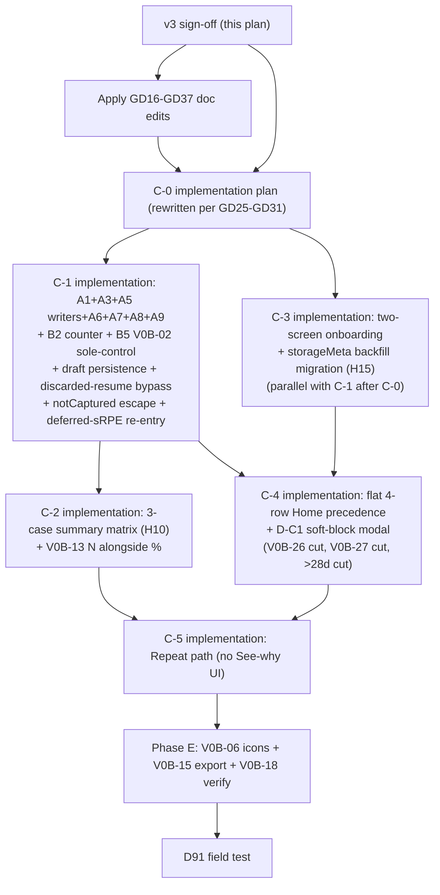

---

## title: "Red-team fix plan for rest-of-v0b (v3, approved)"

type: plan
status: approved
revision: 3
date: 2026-04-16
origin: docs/plans/2026-04-16-003-rest-of-v0b-plan.md
depends_on:

- docs/plans/2026-04-16-003-rest-of-v0b-plan.md
- docs/plans/2026-04-12-v0a-to-v0b-transition.md
- docs/archive/plans/2026-04-16-005-feat-phase-c0-schema-plan.md
- docs/specs/m001-phase-c-ux-decisions.md
- docs/specs/m001-review-micro-spec.md
- docs/specs/m001-home-and-sync-notes.md
- docs/decisions.md
supersedes: "v1 (draft) and v2 (approved) of this plan, same path"

# Red-team fix plan for rest-of-v0b (v3, approved)

## Revision history

- **v1** (2026-04-16, draft): Cataloged 24 round-1 findings across four groups.
- **v2** (2026-04-16, approved): Absorbed round-2 findings; renamed Group D → GD to resolve prefix collision; added C9-C11; reversed B2 primary/fallback; kept signed `unsure → beginner`; carved V0B-02 into C-1; deferred Phase D; replaced parallelism claim with dependency DAG; added net-velocity accounting.
- **v3** (2026-04-16, approved, this file): Absorbs round-3 findings. Three CRITICAL doc-coherence gaps closed; eight MAJOR specification ambiguities resolved; four additional SCOPE cuts applied (Home/NewUser screen, 6→3 case matrix, `>28d Welcome back` tier, V0B-27 Safari banner); V0B-02 sole-control decision locked; net-velocity narrative corrected (truthful ~0-2d v0b savings, ~4-7d earlier D91 readout); two new Group A items (A8 discarded-resume filter, A9 CompleteScreen universal landing).

## Agent Quick Scan

- Final approved decision record for the rest-of-v0b planning pass. After this plan's edits are applied across the doc set, the C-0 implementation plan is ready to build against.
- **Governing thesis** (unchanged from v2): keep the app clean, easy to use, low cognitive bandwidth, not annoying. Every addition must earn its keep; every surface is visual debt by default.
- v3 reduces v0b further: three more screens/tiers worth of scope cut, the summary copy matrix collapsed from 6→3 cases, explicit deployment posture, and unambiguous cross-tab concurrency rules.
- All items here are `approved` or `apply-now`. No outstanding PO decisions.

## v3 decision log (authoritative)

**Round-3 additional decisions** (the user delegated these per the thesis):


| #       | Decision                                                                                                                                                                                                                                                                                                                                                                                                                                                | Thesis rationale                                                                                                                                                                                       |
| ------- | ------------------------------------------------------------------------------------------------------------------------------------------------------------------------------------------------------------------------------------------------------------------------------------------------------------------------------------------------------------------------------------------------------------------------------------------------------- | ------------------------------------------------------------------------------------------------------------------------------------------------------------------------------------------------------ |
| **H9**  | **Cut Home/NewUser screen.** Onboarding is two screens now: Skill Level → Today's Setup. First-open routes directly to Skill Level with a one-line preamble "Welcome. Let's get you started." Back button hidden on Skill Level (no prior screen).                                                                                                                                                                                                      | A content-free welcome screen on the thesis-critical first interaction is pure visual debt. Merges one line of copy into the next screen; deletes a whole surface.                                     |
| **H10** | **Collapse summary copy matrix from 6 cases to 3.** `skipped` → "No change." `submitted + pain` → "Lighter next." Default → "Keep building" with session counter + good passes + attempts. Low-N suffix appended conditionally. Pain-first ordering preserved (pain matches before default).                                                                                                                                                            | Four "Keep building" variants = matrix theater, not differentiation. Session counter + raw numbers is the minimum-honest framing.                                                                      |
| **H11** | **Cut `>28d Welcome back` tier from Home priority.** Flat 4-row precedence: `resume > review_pending > draft > last_complete > new_user` (no `>28d` branch).                                                                                                                                                                                                                                                                                            | Unreachable in 14-day D91 window. Seasonal returners are a post-D91 concern that belongs to M001-build where multi-month data exists.                                                                  |
| **H12** | **Cut V0B-27 Safari→HSWA first-run banner from v0b.**                                                                                                                                                                                                                                                                                                                                                                                                   | 5-tester concierge: install instructions tell testers to add to Home Screen directly; corner cases handled via founder contact. Self-service banner infrastructure doesn't earn its keep at D91 scale. |
| **H13** | **V0B-02 is the sole pass-metric control on Review screen.** Tap-to-type numeric input replaces the existing `+/-` buttons entirely. No secondary increment controls.                                                                                                                                                                                                                                                                                   | "Which button do I press?" is the canonical thesis violation. One primary control, one interaction pattern.                                                                                            |
| **H14** | **Drop "of your first 14 days" suffix from the summary counter.** Just "Session {N}" on the default reason line.                                                                                                                                                                                                                                                                                                                                        | Unbounded past day 14. Cleaner framing and works at any session count. The counter's informational value is "what number session is this"; the window-length framing doesn't add signal to the tester. |
| **H15** | **Explicit deployment posture**: no tester-facing incremental builds during Phase C. Internal testing and dogfooding happen on dev builds; D91 testers receive a single end-to-end v0b build at D91 kickoff. Belt-and-suspenders: C-3 onboarding adds a backfill migration that sets `onboarding.completedAt` for any device with existing `ExecutionLog` records.                                                                                      | Avoids forcing mid-cycle users through onboarding if sequencing slips.                                                                                                                                 |
| **H16** | **CompleteScreen is the universal post-session landing.** Submit flow, skip flow (from Home), and expired-lock flow all route to CompleteScreen so the summary copy matrix actually fires. Discarded-resume routes to Home (no summary — nothing to summarize).                                                                                                                                                                                         | Closes the case-coverage gap: the "No change" case (skipped) and the pain/submitted case were architecturally unreachable in v2's route flow.                                                          |
| **H17** | **Cross-tab concurrency boundary.** A3 transactions provide intra-connection atomicity only. v0b does NOT add an optimistic-concurrency `ver` field. The real correctness boundary is: A6 submit-time cap re-check + A3 transactional guards + the 2h cap. The plan acknowledges that rare cross-tab races can produce transient "pending → expired" UI transitions; the ReviewScreen expired-copy ("Saved too late for planning") handles those cases. | 5-tester single-device v0b reality doesn't justify cross-tab optimistic concurrency. The 2h cap is the actual guarantee.                                                                               |
| **H18** | **Bootstrap count semantics pinned**: `first submitted review < 14 days ago` (first-submit-age). No rolling window.                                                                                                                                                                                                                                                                                                                                     | Simpler implementation; matches "bootstrap" framing.                                                                                                                                                   |
| **H19** | **A3 refused-write UX specified**: if `submitReview` encounters `existing.status === 'submitted'` inside the A3 transaction, it refuses silently and ReviewScreen shows: *"This session was already reviewed — showing what we saved."* Navigates to CompleteScreen with the persisted (not form-state) values.                                                                                                                                         | Silent drop is data loss; generic error is confusing; explicit handoff to CompleteScreen shows the canonical truth.                                                                                    |
| **H20** | **Net velocity narrative corrected**: v0b itself is ~0-2 days lighter (cuts minus adds). The real win is ~4-7 days of earlier D91 readout (because C10, C11, and most of C8 are deferrals past D91, not v0b work eliminated).                                                                                                                                                                                                                           | Framing honesty so future readers don't over-celebrate the scope pass.                                                                                                                                 |


**v2 decisions remain in force** (H1-H8) — see "v2 approved" section in the revision history. H4 specifically confirms: keep signed `unsure → beginner` mapping; any flip is M001-build scope.

---

## Group A — Code-path fixes (lands in C-0 and C-1 implementation plans)

### A1. Per-caller filter enumeration

**Unchanged from v2.** Three distinct filters keyed by caller intent:


| Caller                                               | Filter                                                                    |
| ---------------------------------------------------- | ------------------------------------------------------------------------- |
| `findPendingReview()`                                | `status !== 'draft'` AND `l.endedEarlyReason !== 'discarded_resume'` (A8) |
| `expireStaleReviews()`                               | `status !== 'draft'` AND `l.endedEarlyReason !== 'discarded_resume'` (A8) |
| `expireReview()` / `skipReview()` idempotency guards | `status !== 'draft'` (overwrite drafts, no-op terminals)                  |
| Bootstrap count in C-2 summary                       | `status === 'submitted'` AND first submit < 14d ago (H18)                 |
| B2 session counter source                            | `status === 'submitted'`                                                  |
| V0B-15 JSON export                                   | All records (status field included for downstream replay)                 |
| D-C1 modal dismissal                                 | keyed off `execId` via `storageMeta.ux.softBlockDismissed.{execId}` (A7)  |


### A2. Summary copy matrix — 3 cases with pain-first matching (H10)

```
if status == 'skipped'                                   → Case A
if status == 'submitted' && incompleteReason == 'pain'   → Case B
else                                                     → Case C (default)
```


| Case        | Condition                                             | Verdict line    | Reason line                                                                                                                                                                                                                                                                                  |
| ----------- | ----------------------------------------------------- | --------------- | -------------------------------------------------------------------------------------------------------------------------------------------------------------------------------------------------------------------------------------------------------------------------------------------- |
| A           | `status == 'skipped'`                                 | "No change"     | "No review this time — next session stays at the same level."                                                                                                                                                                                                                                |
| B           | `status == 'submitted' && incompleteReason == 'pain'` | "Lighter next"  | "You stopped early with pain — next session will be gentler to let things settle."                                                                                                                                                                                                           |
| C (default) | any other submitted                                   | "Keep building" | `"Session {N}. {good_passes} good passes today — {total_attempts} attempts."` • If `totalAttempts < 50` and `goodPasses > 0`: append `" Not enough reps yet to trust the rate."` • If `totalAttempts === 0` (recovery / notCaptured): reason becomes `"Session {N} — one more in the book."` |


**Contract tests:**

- Pain-first invariant: any `incompleteReason === 'pain'` returns Case B.
- Property test: every valid `SessionReview` state matches exactly one case.
- Copy never contains "compared," "trend," "progress," "spike," "overload," "injury risk," "first N days," "baseline," "early sessions."

### A3. Transactional read-decide-write guards

**Unchanged from v2** plus H17 clarification: intra-connection atomicity only. No `ver` optimistic concurrency. H19 specifies the refused-write UX for `submitReview` conflict.

### A4. `storageMeta` transactional multi-key writes

**Unchanged from v2.**

### A5. Type + writers (migrates in C-0 Unit 5)

**Unchanged from v2.** C-0 Unit 5 rationale corrected per MAJOR-2 (see §GD below).

### A6. Submit-time cap re-check on ReviewScreen

**Unchanged from v2.** Copy when re-check fires: *"This session passed the 2h window while you were filling in the review — it's saved in history but won't drive the next recommendation."* Routes to CompleteScreen per H16 (where the 3-case matrix renders the "No change" case since the expired stub is `status: 'skipped'`).

### A7. Soft-block modal instance identity

**Unchanged from v2** plus cleanup: after `submitReview` / `expireReview` / `skipReview` succeeds for an exec, delete the `storageMeta.ux.softBlockDismissed.{execId}` key in the same transaction. Prevents unbounded `storageMeta` growth.

### A8. **NEW: Exclude discarded-resume from pending-review queries** (round-3 Critical)

Both `findPendingReview()` and `expireStaleReviews()` must add `l.endedEarlyReason !== 'discarded_resume'` to their terminal-log filter. Without this, a discarded resume shows "Review pending" on Home, tapping routes to ReviewScreen which auto-bypasses back to Home, and the card reappears on every Home resolve until the 2h cap fires.

**Contract test:** *"Home does not show a review-pending card for a session with `endedEarlyReason === 'discarded_resume'`."*

### A9. **NEW: CompleteScreen as universal post-session landing** (round-3 Major, H16)

- `submitReview` success → `/complete/{execId}` (unchanged)
- Home skip flow (`skipReview()` success) → `/complete/{execId}`
- ReviewScreen expired state → `/complete/{execId}` (not the current "Back to start" link)
- Discarded-resume → `/` (Home). No CompleteScreen — nothing to summarize

This closes the case-coverage gap: Case A ("No change") and Case B ("Lighter next" when pain was recorded before the 2h cap expired) now actually render on screen for the users they were written for.

**Contract test:** *"Home skip flow navigates to CompleteScreen; CompleteScreen renders Case A copy for the skipped stub."*

---

## Group B — Product retention (subsumed copy + counter fix)

### B1. Counter framing (subsumed into A2 Case C)

**Updated per H14:** Drop "of your first 14 days" suffix. Just "Session {N}."

### B2. Session counter (primary, lives in A2 Case C)

**Unchanged from v2.** List escalation (V0B-33) contingent on day-3 pulse evidence only.

### B3. `unsure → beginner` mapping

**KEPT per H4 (v2).** Zero v0b runtime effect. Revisit at M001-build if field-test cohort data supports.

### B4. 2h Finish Later rationale note in C-1

**Unchanged from v2.**

### B5. **NEW: V0B-02 sole-control** (H13)

Tap-to-type replaces `+/-` buttons entirely on the Review screen's pass-metric input. `PassMetricInput.tsx` refactor:

- Single tappable numeric display per counter (Good / Total)
- Tap opens numeric keyboard
- Number commits on blur or explicit confirm
- No other increment/decrement affordances

**Rationale:** H13. One control, one pattern. The `+1`-per-tap era ends with C-1.

---

## Group C — Scope cuts (full list after v3 additions)


| #       | Item                                                 | Disposition                      | Source                                 |
| ------- | ---------------------------------------------------- | -------------------------------- | -------------------------------------- |
| C1      | V0B-17 variant-ready safety routing                  | **Cut**                          | v2                                     |
| C2      | V0B-26 storage-health log                            | **Cut**                          | v2                                     |
| C3      | `SessionPlan.context.setWindowPlacement` reservation | **Cut**                          | v2                                     |
| C4      | `SessionReview.reviewTiming` field                   | **Cut** (derive at export)       | v2                                     |
| C5      | Home precedence age tiers `>7d` + `>21d`             | **Cut**                          | v2 (partial: `>28d` cut in v3 per H11) |
| C6      | Multi-pending-review count UI                        | **Don't-add**                    | v2                                     |
| C7      | `SessionDraft.rationale` UI                          | **Cut** (schema field kept)      | v2                                     |
| C8      | Phase D full-block deferral                          | **Carve-out V0B-02 only**        | v2                                     |
| C9      | V0B-05 landscape                                     | **Cut**                          | v2                                     |
| C10     | V0B-10 editorial drill catalog                       | **Deferred post-D91**            | v2                                     |
| C11     | V0B-19 remaining (warm-up restructure)               | **Deferred post-D91**            | v2                                     |
| **C12** | **V0B-09 +5/+10 stepper**                            | **Cut entirely**                 | v2 (H6 thesis extension)               |
| **C13** | **Home/NewUser screen**                              | **Cut** — merge into Skill Level | v3 (H9)                                |
| **C14** | **Summary copy matrix**                              | **Collapse 6→3 cases**           | v3 (H10)                               |
| **C15** | **Home precedence `>28d Welcome back` tier**         | **Cut**                          | v3 (H11)                               |
| **C16** | **V0B-27 Safari→HSWA banner**                        | **Cut**                          | v3 (H12)                               |


**Onboarding is now two screens** (C-3):

1. **Skill Level** — direct entry on first app open. One-line preamble *"Welcome. Let's get you started."* above the existing "Where's the pair today?" heading. Four bands + "Not sure yet" escape.
2. **Today's Setup** — player count + equipment chips + wind chip.

Setup → Safety → Run unchanged.

---

## Group GD — Doc coherence (v3 additions to v2)


| #    | Fix                                                                                                                                                                                                                                       | Target                                            | Disposition |
| ---- | ----------------------------------------------------------------------------------------------------------------------------------------------------------------------------------------------------------------------------------------- | ------------------------------------------------- | ----------- |
| GD16 | Strike `SessionReview.reviewTiming` and `SessionPlan.context.setWindowPlacement` rows from Phase C UX spec schema table (lines 94-95). Strike the Surface 4 `reviewTiming` paragraph. Strike both from the summary list at lines 532-534. | `m001-phase-c-ux-decisions.md`                    | `apply-now` |
| GD17 | Rewrite Phase C UX spec Surface 5 copy matrix to 3 cases per H10 with pain-first matching.                                                                                                                                                | `m001-phase-c-ux-decisions.md`                    | `apply-now` |
| GD18 | Rewrite Phase C UX spec Surface 2 precedence table to flat 4-row (cut `>28d Welcome back` row and all `>7d` / `>21d` draft-age rows). Update all surrounding prose.                                                                       | `m001-phase-c-ux-decisions.md`                    | `apply-now` |
| GD19 | Delete Home/NewUser wireframe and text from Phase C UX spec Surface 1. Update the state machine.                                                                                                                                          | `m001-phase-c-ux-decisions.md`                    | `apply-now` |
| GD20 | Delete V0B-27 Safari banner references from Phase C UX spec (Surface 2 wireframe line, Open items line 503).                                                                                                                              | `m001-phase-c-ux-decisions.md`                    | `apply-now` |
| GD21 | Add `ux.softBlockDismissed.{execId}` to `storageMeta` key list in Phase C UX spec schema row and in consolidated plan C-0 schema list. Specify the cleanup-on-terminal-review behavior.                                                   | `m001-phase-c-ux-decisions.md`, consolidated plan | `apply-now` |
| GD22 | Rewrite master plan §6 as a one-paragraph pointer at the consolidated plan. The item-row detail stays in §4; §6 no longer owns any item-level scope.                                                                                      | master plan                                       | `apply-now` |
| GD23 | Find/replace "5-case" → "3-case" throughout consolidated plan (lines 68, 94, 193, 398) and master plan (lines 167, 403).                                                                                                                  | consolidated plan, master plan                    | `apply-now` |
| GD24 | Consolidated plan §3 execution section: restate as dependency DAG allowing C-1 and C-3 to parallelize after C-0 (per fix-plan sequencing).                                                                                                | consolidated plan                                 | `apply-now` |
| GD25 | C-0 plan Unit 5: add rationale reconciliation note ("intentional split from fix-plan A5 — safe because C-0 adds no draft writes, and the `status?:` optional type tolerates mid-deploy records without status").                          | C-0 plan                                          | `apply-now` |
| GD26 | C-0 plan Unit 3: add atomicity note ("`setStorageMeta` is single-op atomic via IDB; callers that need read-then-write atomicity must use `db.transaction('rw', db.storageMeta, ...)` directly").                                          | C-0 plan                                          | `apply-now` |
| GD27 | C-0 plan Unit 2: replace idempotency guard comment with accurate one, OR remove the guard. Rationale: Dexie upgrades run exactly once per version transition.                                                                             | C-0 plan                                          | `apply-now` |
| GD28 | C-0 plan Unit 2: factor backfill body as exported function `backfillSessionReviewStatus(tx)` so tests can call it directly against seeded records without wrestling the singleton.                                                        | C-0 plan                                          | `apply-now` |
| GD29 | C-0 plan Unit 6: replace the flawed Playwright approach with `clearIndexedDB → manual v3 open with explicit onupgradeneeded fixture → reload → poll for v4`. Specify the v3 store shape the fixture must create.                          | C-0 plan                                          | `apply-now` |
| GD30 | C-0 plan Unit 6: replace `navigator.serviceWorker.ready` + delay with direct DB version poll.                                                                                                                                             | C-0 plan                                          | `apply-now` |
| GD31 | C-0 plan: add "Deployment posture" section per H15 — single D91-opening release + C-3 onboarding backfill migration.                                                                                                                      | C-0 plan                                          | `apply-now` |
| GD32 | Update `m001-courtside-run-flow.md` Cool-Down references to Downshift (lines 73, 74, 79, 228, 230, 234).                                                                                                                                  | courtside-run-flow spec                           | `apply-now` |
| GD33 | Add derivation note to `m001-adaptation-rules.md` for `reviewTiming`: derived at export/readout time; not persisted on `SessionReview`. See `captureWindow` (V0B-30) for the persisted timing bucket.                                     | adaptation-rules spec                             | `apply-now` |
| GD34 | Add deferral note to `m001-adaptation-rules.md` line 482 for `skillLevel` mapping: "Deferred to M001-build; v0b onboarding collects the band but does not consume it for assembly."                                                       | adaptation-rules spec                             | `apply-now` |
| GD35 | Update home-and-sync spec State 1 to match C-3 two-screen onboarding (Skill Level first; no NewUser welcome). Drop `>28d` tier references. Drop V0B-27 install-migration copy.                                                            | home-and-sync spec                                | `apply-now` |
| GD36 | Consolidated plan §Risk table update: day-14 counter edge ("Session 14 of your first 14 days") resolved by H14 (drop suffix). Remove the stale mitigation.                                                                                | consolidated plan                                 | `apply-now` |
| GD37 | `V0B-15` export description: rationale may emit undefined OR a stub string — pick one for consistency. Ship as `undefined` in v0b (no stub string) to minimize export noise.                                                              | consolidated plan                                 | `apply-now` |


GD1-GD15 from v2 remain in force and were largely applied in v2. v3 extends to GD16-GD37.

---

## Sequencing — final dependency DAG




**Phase D is empty.** V0B-02 ships in C-1 (H13 sole-control). All other Phase D items deferred post-D91.

---

## Honest net velocity (v3 correction per H20)

v2 claimed "~7-9 days saved." Scope-guardian showed this conflated cuts with deferrals. Honest accounting:


| Category                                                                               | Days                                       |
| -------------------------------------------------------------------------------------- | ------------------------------------------ |
| Real cuts of v0b work (C1, C2, C3, C4, C5 partial, C7 UI, C9, C12, C13, C14, C15, C16) | **-9d**                                    |
| Work deferred past D91 (C8 Phase D minus V0B-02, C10, C11)                             | **-5d from v0b schedule (not eliminated)** |
| V0B-02 carve-in (was Phase D, now C-1)                                                 | +1.5d                                      |
| A1-A7 code additions                                                                   | +3.75d                                     |
| A8 discarded-resume filter                                                             | +0.25d                                     |
| A9 CompleteScreen universal landing                                                    | +0.5d                                      |
| B5 V0B-02 sole-control (PassMetricInput refactor)                                      | +0.75d                                     |
| GD16-GD37 doc edits                                                                    | +2d                                        |
| C-0 plan corrections (Units 2 + 6 rewrites)                                            | +1d                                        |
| **Net v0b work change**                                                                | **~-0.75d (roughly neutral)**              |
| **D91-start acceleration** (deferrals move past the gate)                              | **~-5d**                                   |


**Headline: v0b ships about the same total work as before the red-team pass, but D91 readout ships ~1 week earlier because C10/C11/most-of-Phase-D are no longer on the pre-D91 critical path.** The thesis alignment win is independent of the velocity win: the final v0b is materially less cognitive-load-heavy than v2 would have been (one fewer onboarding screen, three fewer summary cases, two fewer Home tiers, no Safari banner, single-control pass metric), even if the dev hours are roughly unchanged.

---

## Explicit non-changes

- D91 thresholds and stratified reading unchanged.
- Phase A and Phase B outputs unchanged.
- D118 three-state save copy unchanged.
- D121 taxonomy unchanged; H4 remains in force (`unsure → beginner`).
- D86 wellness-vocabulary posture unchanged.
- Persistent-team-identity exclusion unchanged.
- V0B-11 remains in scope (the summary surface) — H10 only changes how many cases render, not that a summary ships.
- V0B-31 2h Finish Later cap unchanged. Deferred sRPE inside the cap still works.

---

## What this plan does NOT do

- Does not author the C-1 or C-3 implementation plans. Those follow the Phase A/B pattern when each sub-phase starts.
- Does not commit any code. The fixes here are doc and plan edits plus the C-0 plan's implementation sections.
- Does not re-open D91 thresholds, D120 capture-window math, D118 durability copy, or the core v0b flow.

## Appendix A — v3 round-3 traceability

Every round-3 finding maps to a v3 resolution:


| Finding                                                         | v3 resolution                                            |
| --------------------------------------------------------------- | -------------------------------------------------------- |
| Adversarial C1 (discarded-resume loop)                          | A8 (new)                                                 |
| Adversarial C2 (cross-tab races)                                | H17 (non-goal)                                           |
| Adversarial C3 (mid-cycle deploy)                               | H15 (deployment posture + C-3 backfill migration)        |
| Adversarial M1 (C-0 vs fix-plan sequencing)                     | GD25                                                     |
| Adversarial M2 (consolidated plan linear vs DAG)                | GD24                                                     |
| Adversarial M3 (Safari→HSWA)                                    | H12 (V0B-27 cut; the whole concern goes away)            |
| Adversarial M4 (cross-tab pending→expired)                      | H17 + existing ReviewScreen expired copy                 |
| Adversarial M5 (counter unbounded)                              | H14 (drop suffix)                                        |
| Adversarial M6 (case-2 ambiguity)                               | H18 (first-submit-age pinned) + H10 collapses it anyway  |
| Adversarial M7 (refused-write UX)                               | H19                                                      |
| Adversarial M8 (CompleteScreen reachability)                    | H16 + A9                                                 |
| Coherence C1 (reviewTiming + setWindowPlacement in UX spec)     | GD16                                                     |
| Coherence C2 (master §6 stale)                                  | GD22                                                     |
| Coherence C3 (Surface 5 still 5-case)                           | GD17                                                     |
| Coherence C4 (Surface 2 still 11-row)                           | GD18                                                     |
| Coherence M1-M3 ("5-case" scatter)                              | GD23                                                     |
| Feasibility HIGH-1 (Unit 6 IDB at v3)                           | GD29 + GD30                                              |
| Feasibility HIGH-2 (Unit 2 harness)                             | GD28                                                     |
| Feasibility MODERATE-1 (Unit 5 rationale)                       | GD25                                                     |
| Feasibility MODERATE-2 (idempotency guard)                      | GD27                                                     |
| Feasibility MODERATE-3 (single-key atomicity)                   | GD26                                                     |
| Scope S1 (V0B-05)                                               | v2 C9 (retained)                                         |
| Scope S2 (B2 counter vs list)                                   | v2 H3 (retained)                                         |
| Scope S3 (V0B-19 / V0B-10)                                      | v2 C10 / C11 (retained)                                  |
| Scope S4 (Home/NewUser)                                         | **H9 / C13 (new)**                                       |
| Scope S5 (6-case matrix)                                        | **H10 / C14 (new)**                                      |
| Scope S5 (>28d tier)                                            | **H11 / C15 (new)**                                      |
| Scope S7 (V0B-27)                                               | **H12 / C16 (new)**                                      |
| Scope S9 (net velocity)                                         | **H20 + Net Velocity section rewritten**                 |
| Adversarial minor m1 (storageMeta atomicity)                    | GD26                                                     |
| Adversarial minor m2 (softBlockDismissed cleanup)               | A7 updated                                               |
| Adversarial minor m3 (SW ready as upgrade signal)               | GD30                                                     |
| Adversarial minor m5 (stale `sessionRpe: number                 | null` entry)                                             |
| Adversarial minor m7 (skillLevel mapping)                       | GD34                                                     |
| Adversarial minor m8 (counter framing user-visible discrepancy) | H14 simplifies framing away                              |
| Adversarial minor m10 (v5 bump cost)                            | Acknowledged; C-0 plan section                           |
| Adversarial note N5 (rationale undefined vs stub)               | GD37 (ship undefined)                                    |
| Feasibility LOW-2 (skipped invariant)                           | C-0 plan Unit 4 reworded in the implementation sub-phase |


