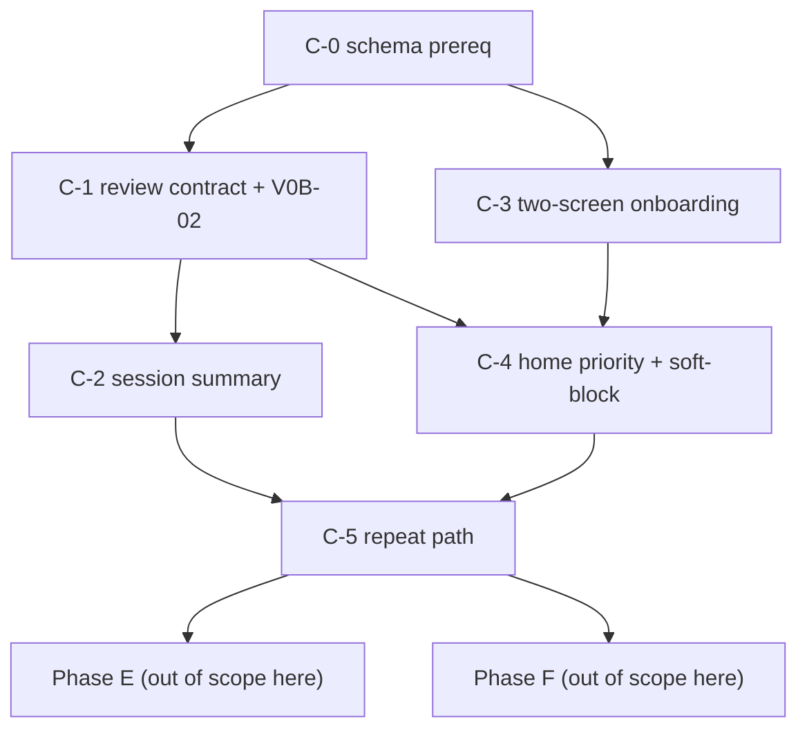

# Phase C master sequencing

## Purpose

This doc owns the execution order, dependency DAG, per-sub-phase exit criteria, and deployment posture for Phase C (sub-phases C-0 through C-5). Each sub-phase has its own implementation plan (linked below) that owns its units, requirements trace, and tests. This doc does **not** duplicate that content — it orchestrates across them.

The scope and cut registry for Phase C lives in [2026-04-16-003-rest-of-v0b-plan.md](2026-04-16-003-rest-of-v0b-plan.md) sections 2 and 6. The approved red-team decisions (H9-H20, A1-A9, GD25-GD31) live in [2026-04-16-004-red-team-fixes-plan.md](2026-04-16-004-red-team-fixes-plan.md). This doc references them without re-litigating.

## Agent Quick Scan

- Phase C ends at Phase E (content + founder tooling: V0B-06 icons, V0B-15 export, V0B-18 regulatory copy verification) and Phase F (D91-validity hardening: Home CTA cleanup + solo-voice header + block-end audio + Swap on RunScreen + lite-polish). Phases E and F are independent and can interleave; both are pre-D91. **Phase E and F scope are not in scope of this doc** — they each own their own plan document.
- Per `H15`, **no tester-facing incremental builds** during Phase C. Internal dev builds only; D91 testers receive one end-to-end v0b build at D91 kickoff. C-0's onboarding backfill migration is defense-in-depth in case that posture slips.
- Single-engineer serial order: `C-0 -> C-1 -> C-2 -> C-3 -> C-4 -> C-5`. Two-engineer split can parallelize `C-1` and `C-3` after `C-0` lands.
- Every sub-phase ships as a **single atomic deploy** per its own critical-sequencing callout. Partial landings inside a sub-phase can produce inconsistent data (most acutely in C-1, where A1 + A3 + A6 + A8 + A9 must arrive together).
- Treat Phase C as the **D91 artifact surface contract**, not the full self-coached product ceiling. Some items that read like polish in isolation (Phase F) were validity-critical for the field test, and richer recommendation / explanation / weekly-confidence surfaces still return post-D91.

## Dependency DAG

The DAG is intentionally shallow: five edges, one diamond at C-4 (depends on both C-1 and C-3). Parallelization note: C-2 cannot start until C-1 has landed `SessionReview.status` semantics end-to-end because the A2 3-case matrix reads that field. C-4 needs both C-1's A7 plumbing and C-3's `storageMeta.onboarding.completedAt` trigger, so it can't begin earlier.

## Sub-phase plans

| Sub-phase | Plan | Status | Gated on |
|-----------|------|--------|----------|
| C-0 schema | [2026-04-16-005-feat-phase-c0-schema-plan.md](2026-04-16-005-feat-phase-c0-schema-plan.md) | **landed 2026-04-17** | Phase B complete (landed) |
| C-1 review contract + V0B-02 | [2026-04-17-feat-phase-c1-review-contract-plan.md](2026-04-17-feat-phase-c1-review-contract-plan.md) | **landed 2026-04-17** | C-0 shipped |
| C-2 session summary | [2026-04-17-feat-phase-c2-session-summary-plan.md](2026-04-17-feat-phase-c2-session-summary-plan.md) | **landed 2026-04-17** | C-1 shipped |
| C-3 two-screen onboarding | [2026-04-17-feat-phase-c3-two-screen-onboarding-plan.md](2026-04-17-feat-phase-c3-two-screen-onboarding-plan.md) | **landed 2026-04-17** | C-0 shipped (parallelizable with C-1) |
| C-4 home priority + soft-block | [2026-04-17-feat-phase-c4-home-priority-plan.md](2026-04-17-feat-phase-c4-home-priority-plan.md) | landed | C-1 + C-3 shipped |
| C-5 repeat path | [2026-04-17-feat-phase-c5-repeat-path-plan.md](2026-04-17-feat-phase-c5-repeat-path-plan.md) | landed | C-2 + C-4 shipped |

**Phase C is complete end-to-end** (2026-04-17). Post-landing UX polish (SafetyCheckScreen escape hatch, Brandmark / HomeScreen polish) documented in [rest-of-v0b §"Phase C post-landing polish"](./2026-04-16-003-rest-of-v0b-plan.md#phase-c-post-landing-polish--safetycheckscreen-escape-hatch-complete-2026-04-17).

**Phase E is complete end-to-end** (2026-04-17) — icons (V0B-06), JSON export (V0B-15), and broadened D86 regulatory copy audit (V0B-18) all landed. See [2026-04-17-feat-phase-e-content-tooling-plan.md](./2026-04-17-feat-phase-e-content-tooling-plan.md).

**Phase F (landed 2026-04-19) — D91-validity hardening + Home CTA cleanup.** Founder-led UX red-team from a beach-amateur weekend-warrior POV surfaced five items before the D91 build: Home CTA same-URL duplication (Repeat/Edit share `/setup?from=repeat`), pair-voice first-open header misleading solo users, silent block-end on iOS Safari PWA (navigator.vibrate unsupported per `D57`), missing Swap action documented in `m001-courtside-run-flow.md` §3, and Phase C lite-polish (verdict glyph, coaching-cue default, forward-looking reason copy). All five units independent (no shared schema / service dependency) landed together. Regression coverage: 67 vitest files / 490 tests pass (+46 new) and all 29 Playwright specs pass (including the previously-flaky `edge-cases::advance through all blocks`). See [2026-04-19-feat-phase-f-d91-validity-hardening-plan.md](./2026-04-19-feat-phase-f-d91-validity-hardening-plan.md). **v0b is now feature-complete for the D91 field test, but it is still the field-test cut rather than the full post-gate self-coached product.**

Flip each status to `active` when the sub-phase starts and `landed` when all its units are checked off and its exit criteria are met.

## Per-sub-phase exit criteria

A sub-phase is **landed** when every line below passes.

### C-0 exit criteria

- [x] Dexie `db.version(4)` block lands with `storageMeta` table + both backfills (`backfillSessionReviewStatus`, `backfillOnboardingCompletedAt`).
- [x] `SessionReview.status`, `SetupContext.wind`, `SessionDraft.rationale`, `StorageMetaEntry` exported from `app/src/db/types.ts`.
- [x] `submitReview` / `expireReview` / `skipReview` emit `status` unconditionally (Unit 5, per red-team hygiene note).
- [x] Vitest + Playwright suites all green. (`edge-cases::advance through all blocks reaches review` is a pre-existing wall-clock-timing flake unrelated to C-0; recorded against this exit point, carried into C-1 and onward.)

### C-1 exit criteria

- [x] A1 enumerated filters applied across the three C-1-owned caller sites (`findPendingReview`, `expireStaleReviews`, `expireReview` idempotency guard). The remaining A1 caller sites — C-2 counter, V0B-15 export, D-C1 modal — land with their owning sub-phases.
- [x] A3 transactional guards wrap every read-decide-write in `submitReview` / `expireReview` / `skipReview`; 4x3 state-vs-action matrix test suite passes (`review.a3-matrix.test.ts`, 12/12).
- [x] A6 submit-time cap re-check lives inside `ReviewScreen.handleSubmit`.
- [x] A7 helper exports `readSoftBlockDismissed(execId)` / `markSoftBlockDismissed(execId)` / `clearSoftBlockDismissed(execId, tx?)`; terminal-review writes delete the key in the same transaction.
- [x] A8 excludes `endedEarlyReason === 'discarded_resume'` from `findPendingReview` + `expireStaleReviews`, and ReviewScreen auto-routes to `/` for such a log as a belt over the service filter.
- [x] A9 route flow: submit / home-skip / expired all land on `/complete/{execId}`; discarded-resume routes to `/`.
- [x] Review draft persistence: `saveReviewDraft` / `loadReviewDraft` through the A3 envelope; ReviewScreen rehydrates on mount via a `hydrated` gate; auto-saves on every meaningful form change; `notCaptured` chip zeros the metric and tags.
- [x] V0B-02 / H13: `PassMetricInput.tsx` is tap-to-type-only (no +/- buttons); regression test `PassMetricInput.test.tsx` asserts none of the old stepper aria-labels render.
- [x] H19 conflict copy renders when `submitReview` refuses; "View saved review" routes to CompleteScreen with the persisted values.
- [x] Red-team contract tests from [2026-04-16-003-rest-of-v0b-plan.md](2026-04-16-003-rest-of-v0b-plan.md) §7 that target C-1 all pass. Landed under 34 vitest files / 229 tests; Playwright regression 20/21 (same pre-existing timing flake as the C-0 baseline).

### C-2 exit criteria

- [x] `composeSummary({ review, plan, sessionCount })` pure function in `app/src/domain/sessionSummary.ts` returns one of the 3 cases for every valid review state.
- [x] Pain-first ordering invariant test passes.
- [x] CompleteScreen renders `Today's pair verdict` / `Today's verdict` header + verdict + reason + recap card per Surface 5 wireframe.
- [x] Session counter query uses `status === 'submitted'` only (`countSubmittedReviews` in `services/review.ts`).
- [x] V0B-13: every pass-rate % display shows `N` alongside (`formatPassRateLine` in `lib/format.ts`, used on CompleteScreen and reserved for C-5 LastComplete).
- [x] Copy regex guard test passes (no `compared|trend|progress|spike|overload|injury risk|first N days|baseline|early sessions`) — enforced at both `composeSummary` layer (`sessionSummary.test.ts`) and CompleteScreen integration layer (`CompleteScreen.copy-guard.test.tsx`).

### C-3 exit criteria

- [x] First-open route resolver: `FirstOpenGate` redirects `/` to `/onboarding/skill-level` when `storageMeta.onboarding.completedAt` is absent, and to `/onboarding/todays-setup` when the step was left there (resume semantics).
- [x] `SkillLevelScreen` renders four D121 bands + `Not sure yet`; atomic `setStorageMetaMany` writes `skillLevel` + `step` together (shared `updatedAt` verified) before navigating.
- [x] `TodaysSetupScreen` is a thin wrapper around `<SetupScreen isOnboarding />`; SetupScreen's Build handler writes `storageMeta.onboarding.completedAt` and `SessionDraft` before routing to `/safety`. Wind chip row renders; `'calm'` (default) is NOT materialized on the draft per C-0 Key Decision #7.
- [x] Back arrow hidden on Skill Level; back on Today's Setup returns to `/onboarding/skill-level` (onboarding) or `/` (non-onboarding). Escape-to-onboarding path in SetupScreen re-routes if the sentinel is somehow absent.
- [x] V0B-16 answer-first safety copy already present on `SafetyCheckScreen` from pre-work; verified via 3-test spec that also enforces the D86 regex guard.
- [x] Playwright smoke landed ([app/e2e/phase-c3-onboarding.spec.ts](../../app/e2e/phase-c3-onboarding.spec.ts), 2 tests): fresh install -> Skill Level -> Today's Setup -> Safety (verified `onboarding.completedAt` lands via direct IDB read), and seeded-exec variant skips onboarding + lands on Home.
- [x] Schema-blocked / resume tests: `FirstOpenGate.resume.test.tsx` exercises true unmount/remount round-trip (tap band -> unmount mid-nav -> remount -> lands on `/onboarding/todays-setup`).

### C-4 exit criteria

- [x] `HomeScreen` extended from 5 kinds to the full 7-row flat precedence model (`resume > review_pending > draft > last_complete > new_user`).
- [x] Exactly-one-primary-card invariant test passes for every row.
- [x] `HomePrimaryCard` + `HomeSecondaryRow` components render with `role="region"` / `role="list"` accessibility.
- [x] D-C1 soft-block modal fires on non-review CTA tap when review_pending, dismisses once per exec via A7 helper.
- [x] Copy updated to Surface 2 wireframes (NewUser, Draft, LastComplete, Resume, Review Pending).

### C-5 exit criteria

- [x] LastComplete primary card renders normal case and ended-early branching variant.
- [x] "Same as last time" text link routes to Safety without re-entering Setup.
- [x] Pre-filled Setup loads last `SessionPlan.context`; stale-context banner renders.
- [x] D83 invariant test: safety answers are never pre-filled (pain + recency always default).
- [x] Playwright smoke: Home -> Repeat -> Setup-prefilled -> Safety (defaults) -> Run.

## Deployment posture (H15, restated)

- No tester-facing builds during Phase C. Only internal dev builds.
- D91 testers receive **one** v0b build at D91 kickoff containing every Phase C and Phase E item.
- The onboarding-backfill migration (C-0 Unit 2) is the belt-and-suspenders guard that prevents existing testers from being force-routed through onboarding if the posture slips and a partial build reaches a device with existing `ExecutionLog` records.

## Cross-references

- Scope and cut registry: [2026-04-16-003-rest-of-v0b-plan.md](2026-04-16-003-rest-of-v0b-plan.md) sections 1, 2, 4, 6.
- Approved red-team decisions: [2026-04-16-004-red-team-fixes-plan.md](2026-04-16-004-red-team-fixes-plan.md) — Group A (A1-A9), Group B (B4-B5), Group GD (GD25-GD31), H9-H20.
- Surface behavior, wireframes, copy: [../specs/m001-phase-c-ux-decisions.md](../specs/m001-phase-c-ux-decisions.md).
- Stable decision IDs: [../decisions.md](../decisions.md) — D-C1 through D-C8, D86, D91, D93, D104, D113, D118, D120, D121.
