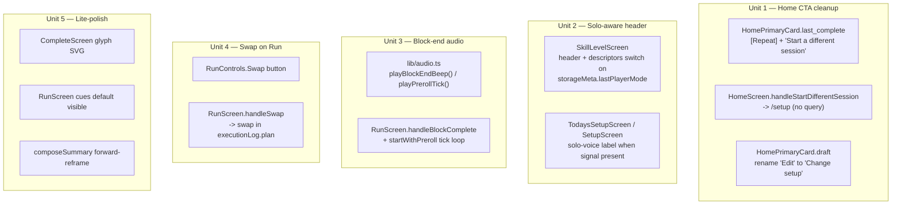

# Phase F: D91-validity hardening + Home CTA cleanup

## Overview

Phase F is a pre-D91 hardening pass that lands five independent items surfaced by a structured UX red-team of the complete Phase C product from the perspective of a beach-amateur weekend-warrior target user (2026-04-19). The items split into two concerns:

1. **Home CTA cleanup (Unit 1)** — the shipped `LastComplete` card has `Repeat this session` and `Edit` routing to the same URL, plus a `Same as last time` shortcut that skips the stale-context check. There is no `Start a different session` affordance, which the spec wireframes already call for. Clean up.
2. **D91-validity carve-outs (Units 2–4)** — three items originally deferred out of v0b that, on closer reading, undermine what D91 can actually tell us:
   - Solo users see pair-first copy on `SkillLevelScreen` (`"Where's the pair today?"`) — a solo-first product (`D5`) with a pair-first first screen biases the kill-floor read.
   - Block-end on the run screen only fires `navigator.vibrate`, which is unsupported on iOS Safari PWA (the primary install posture per `D57`). The D91 hypothesis is *"phone courtside viable for structured runner"* — silent block-end breaks that premise directly.
   - `RunControls` lacks the `Swap` action that `docs/specs/m001-courtside-run-flow.md` §3 lists as a first-class courtside control. Without it, testers hitting a wrong-fit drill can only Skip (lose the block) or Shorten (give up halfway), biasing `ended_early` rates.

Unit 5 bundles three tiny Phase C-era lite-polish items (`=` glyph, coaching-cue default, forward-looking copy) that can ride with the rest of the phase at near-zero cost.

Phase D stays empty (per `H6` / `C8`); Phase E (icons / JSON export / regulatory copy-guard) landed 2026-04-17. Phase F is the only pre-D91 work remaining.

## Problem frame

### Why these five together

All five are pre-D91 concerns that touch different files and ship independently. Bundling them avoids plan-doc proliferation for individually small work while keeping the scope story honest: Phase C surfaced the product, Phase F hardens what the red-team flagged as actively misleading or friction-generating before 5 testers see it. The items are grouped by the single founder decision point ("what goes in the D91 build?") rather than by engineering boundary.

### Why each matters

- **Unit 1 (Home CTA cleanup).** Two of three `LastComplete` CTAs route to the same URL (`/setup?from=repeat`). `Edit` and `Repeat this session` are currently different labels on the same affordance — the only distinction is the visual weight of the button. `Same as last time` is a genuinely different path (skips Setup entirely) but its value is narrow (one tap saved) and it bypasses the `StaleContextBanner` nudge to "Adjust if today's different" — a shortcut that's also a regression for data quality. The spec already lists `Start a different session` as a secondary on both Surface 2 State 4 and Surface 6 ended-early wireframes, but the impl never added it.
- **Unit 2 (solo-aware skill-level header).** `D121` deferred the *taxonomy* unification for solo/pair to M001-build, but the *header string swap* is a ~6-line change gated on `SessionPlan.playerCount` and a `storageMeta.onboarding.skillLevel` copy tweak — nothing enum-level. Currently every user sees `"Where's the pair today?"` on first-open regardless of intent. For a solo-first product (`D5`), most D91 first-opens will be solo; the current copy reads as "not for me" and biases the kill-floor read. The fix is cheap and uncontroversial.
- **Unit 3 (block-end audio cue).** `RunScreen.handleBlockComplete` calls `navigator.vibrate([100, 50, 100])` and nothing else — no Web Audio, no `.mp3`, no `AudioContext` anywhere in the source. Per the 2026 WebKit record and `D54`, `navigator.vibrate` is unsupported on iOS Safari PWA (which `D57` names as the primary tested install posture). A tester with the phone 6 feet away on a towel has no reliable signal that the block ended. This is the single most direct threat to the D91 "phone courtside viable" hypothesis. Narrow slice of the originally-deferred `V0B-08` layered cue stack — the full stack can still wait post-D91; the end-of-block beep carves out the part that's actually load-bearing for the field test.
- **Unit 4 (Swap on RunScreen).** `docs/specs/m001-courtside-run-flow.md` §3 documents `Swap` as a required always-visible-or-pause courtside action. `RunControls.tsx` ships Pause / Next / Shorten / Skip / End — no Swap. When a tester hits a drill that doesn't fit the day (wrong level, wrong environment, pair showed up instead of solo, etc.), their only divergence options are Skip (lose a required block from the session) or Shorten (give up halfway). Both bias tester reports toward "I quit the drill" and into `ended_early` classification, which colours D91 completion-rate reads. Swap preserves the session and the tester's training intent. Schema-free: cycles through the existing session-assembly `swapAlternatives` already implied by `D98`'s curated drill mapping.
- **Unit 5 (Phase C lite-polish).** Three independent copy/prop changes flagged by the red-team, none of which alone justifies a plan but all three land together at near-zero marginal cost. Rationale in §Unit 5 below.

## Scope boundaries

### In scope

- Home `LastComplete` card CTA simplification (`Repeat` primary, `Start a different session` secondary, normal and ended-early variants).
- Home `Draft` card: rename `Edit` → `Change setup`.
- Drop `Same as last time` text link from LastComplete.
- Drop `Edit` text link from LastComplete (folded into Repeat's pre-filled Setup).
- Solo-aware header copy on `SkillLevelScreen` and `TodaysSetupScreen` gated on `SessionPlan.playerCount` via `storageMeta` or a default.
- `AudioContext` beep on block-end + preroll tick — fire-and-forget, best-effort, silent failure on permission-denied or blocked autoplay.
- `Swap` action on `RunControls` + `RunScreen`: single button, cycles through the archetype's alternate drill candidates for the current block slot.
- `CompleteScreen` verdict glyph replacement (remove literal `=` character).
- `RunScreen` coaching-cue default-visible prop.
- `composeSummary` `default` case reason line reframe (forward-looking).
- Spec + decision amendments for D-C3 / D-C5.

### Not in scope

- Taxonomy unification of solo/pair `SkillLevel` enums (M001-build per `D121`).
- Full layered cue stack (`V0B-08` stays post-D91 backlog).
- Drill visuals / diagrams / GIFs (M001-build or later; `D25`).
- Session-history surface (`V0B-07` post-D91).
- Partner identity (`D114`–`D117` gate).
- Weather integration (`D93` Phase 1.5).
- Any schema changes (no Dexie version bump).
- Any new Dexie tables or `storageMeta` keys.

## Requirements trace

### Unit 1 — Home CTA cleanup

- R1. `HomePrimaryCard` `last_complete` variant renders exactly two affordances in the normal case: `[Repeat this session]` (primary button) and `Start a different session` (tertiary text link). No `Edit` button. No `Same as last time` text link.
- R2. `HomePrimaryCard` `last_complete` variant in the ended-early case renders three affordances: `[Repeat full N-min plan]` (primary), `[Repeat what you did (M min)]` (outline secondary), and `Start a different session` (tertiary text link).
- R3. `HomePrimaryCard` `draft` variant renames the existing `Edit` text link to `Change setup`. No behavior change.
- R4. `HomeScreen` exposes a new handler `handleStartDifferentSession` that navigates to `routes.setup()` (no `?from=repeat` query) without mutating the persisted draft (if any) until the new Build fires. The draft overwrite is the existing `saveDraft` semantics — no extra discard step.
- R5. `handleStartDifferentSession` is wrapped by `interceptIfSoftBlock(execId, inner)` so it passes through the D-C1 review-pending modal when applicable (consistent with every other non-review CTA).
- R6. The existing `handleSameAsLast` service wiring in `HomeScreen` is removed (handler + `onSameAsLast` prop in `HomePrimaryCard`). The `buildDraft(lastContext)` + `saveDraft` + `/safety` direct-route code path lands on the cutting-room floor.
- R7. The existing `handleLastCompleteEdit` service wiring is removed (handler + `onEdit` prop on the `last_complete` variant). The Draft variant's `onEdit` prop stays.
- R8. Regression test `HomePrimaryCard.test.tsx`: asserts the normal and ended-early LastComplete variants render the new CTA set exactly (including absence of the dropped affordances).
- R9. Regression test `HomeScreen.test.tsx`: exercises the `Start a different session` path (LastComplete primary + ended-early variant). Also deletes or updates existing assertions that covered `Same as last time` / `Edit`.
- R10. Playwright `phase-c5-repeat.spec.ts` updated: the "same as last time" and "edit from last complete" paths are removed; the "start a different session" path is added.
- R11. Spec + decision amendments per Unit 6 below.

### Unit 2 — Solo-aware skill-level header

- R1. `SkillLevelScreen` renders `"Where are you today?"` (solo framing) when no prior `onboarding.skillLevel` exists AND the current session-assembly context (if any) reads solo. Default to `"Where's the pair today?"` (existing copy) otherwise. First-open has no prior context, so first-open defaults to pair framing unless we add a pre-flight solo vs pair toggle — see Key decisions 2 below.
- R2. `SkillLevelScreen` renders each band descriptor in solo voice when the user is solo and pair voice otherwise. Keep the same four enum values; descriptors are the only copy that changes.
- R3. `TodaysSetupScreen` (wrapper over `SetupScreen` with `isOnboarding` prop) shows solo-aware label text for the player-mode chips and for the "Today's Setup" header if applicable.
- R4. The persisted enum values (`foundations` / `rally_builders` / `side_out_builders` / `competitive_pair` / `unsure`) stay unchanged. No Dexie migration.
- R5. `SkillLevelScreen.test.tsx`: add two tests proving (a) pair copy renders when no `playerCount` signal exists, (b) solo copy renders when the future solo-gate logic fires.
- R6. Copy-guard regression (Phase E `V0B-18`) continues to pass — neither voice introduces forbidden vocabulary.

### Unit 3 — Block-end audio cue

- R1. `app/src/lib/audio.ts` new helper exports `playBlockEndBeep()` and `playPrerollTick()`. Both functions are best-effort, silent-failure, and guard internally against the two common failure modes: (a) `AudioContext` unavailable (server-side render, older browsers) and (b) autoplay policy rejection when the user has not gestured yet.
- R2. `AudioContext` is instantiated lazily on the first user-gesture-triggered call (`startWithPreroll` in RunScreen already fires inside a click handler, satisfying the gesture requirement).
- R3. Single shared `AudioContext` lives at module scope so subsequent plays don't re-instantiate. Each `play*` call schedules a short oscillator (~0.1s for tick, ~0.25s for block-end) at a fixed frequency (800 Hz tick, 1000 Hz block-end) with a quick fade-in/out envelope to avoid clicks.
- R4. `RunScreen.handleBlockComplete` fires `playBlockEndBeep()` alongside the existing `navigator.vibrate` call. Vibrate stays for Android + any future desktop haptic surface; the beep covers iOS Safari PWA.
- R5. `RunScreen.startWithPreroll` fires `playPrerollTick()` on each `3 / 2 / 1` tick (total three plays per preroll).
- R6. `useWakeLock` and `AudioContext` interact cleanly: no race conditions on rapid pause/resume; no leaked timers.
- R7. iOS silent-switch handling: `AudioContext` honors the iOS silent switch by default (the `.wav` / `<audio>` element path would bypass it, but we don't want to bypass — a silent user is a user who asked for silence). Document this explicitly in the helper's JSDoc.
- R8. Tests: `lib/audio.test.ts` with two specs — (a) `playBlockEndBeep` is safe to call without an `AudioContext` available (returns normally, logs once), (b) `playBlockEndBeep` called twice in quick succession reuses the shared `AudioContext` and does not throw. No real sound assertion (JSDOM doesn't have a real `AudioContext`; mock at module level).
- R9. The helper is NOT part of the critical-path contract — a failure to beep must not fail the block-complete transition. Regression guard in `RunScreen.test.tsx` that mocks `playBlockEndBeep` to throw and asserts `handleBlockComplete` still completes normally.
- R10. Document the change in `docs/specs/m001-courtside-run-flow.md` §3 "Courtside action rule" — the existing "no background audio or iPhone haptics in M001" (`D54`) stays correct for *background* audio and *haptics*; foreground audio for block-end is compatible with that decision.

### Unit 4 — Swap on RunScreen

- R1. `RunControls` renders a new `Swap` button in the courtside layout (alongside Pause / Next in active state; alongside Shorten / Skip / End in paused state). `Swap` is hidden when no alternate drills exist for the current block slot (defensive; v0b's curated drill mapping should always produce at least one alternate for non-warm-up / non-wrap blocks).
- R2. `Swap` tap cycles the current block's drill to the next-ranked alternate within the same block slot's curated list. The replacement preserves the block's `durationMinutes`, `type`, and `required` flag — only `drillName`, `courtsideInstructions`, and `coachingCue` change.
- R3. Swap semantics: swaps mutate the active `ExecutionLog.plan.blocks[currentBlockIndex]` only (never the original `SessionPlan` snapshot; `D37` plan-locking is preserved — execution divergence is recorded in the log). The swap count for the current session is appended to a new `execution.swapCount` field or similar simple counter — exact shape TBD in the implementation pass (post-D91 engine reads just count, not which drill was swapped to).
- R4. Swap is disabled (greyed, not hidden) when the current block is the warm-up or wrap slot — those slots have curated content that doesn't make sense to swap mid-drill (per `D85` / `D105`).
- R5. The run screen title updates immediately on swap; the current timer continues from the paused state (swap implies pause; user taps Resume after swap to continue).
- R6. Tests:
  - `RunControls.test.tsx`: Swap renders in both active and paused states; disabled for warmup/wrap; hidden when no alternates available.
  - `RunScreen.test.tsx`: Swap replaces the drill in the `ExecutionLog` and leaves the `SessionPlan` snapshot untouched.
  - `RunScreen.test.tsx`: Swap pauses the timer (same semantics as Shorten — tester resumes manually).
  - Playwright: extend `session-flow.spec.ts` or `phase-c5-repeat.spec.ts` to exercise one swap during a block.
- R7. Docs: amend `docs/specs/m001-courtside-run-flow.md` §3 Swap section from deferred-implementation language to landed; update the Courtside action rule to reflect Swap as a live primary control.

### Unit 5 — Phase C lite-polish

- R1. `CompleteScreen` verdict icon — replace the literal `=` character with either (a) a neutral horizontal-bar SVG icon (preferred — unambiguous, style-consistent with the rest of the icon set), or (b) deletion (let the verdict word do the work). Choose (a) to preserve the inverted-pyramid layout's visual hierarchy.
- R2. `RunScreen` coaching cues default to visible. Add a `Hide cues` toggle (existing `Show coaching cues` copy inverts). The existing `toggleInstructions` reducer flips to `true` on mount instead of starting at `false`.
- R3. `composeSummary` default case reason line: replace `"Not enough reps yet to trust the rate."` (appended to the base reason) with `"Just getting started — I'll start tuning once you have a few more in the book."` (forward-looking valence, same evidentiary honesty). Tests: update `sessionSummary.test.ts` property-test expectations and copy-guard tests.
- R4. No schema changes in any sub-unit.

## Context and research

### Relevant code

- `app/src/components/HomePrimaryCard.tsx` — the shipped LastComplete card (Unit 1).
- `app/src/components/HomeSecondaryRow.tsx` — the secondary row variant (Unit 1 cross-check).
- `app/src/screens/HomeScreen.tsx` — `handleSameAsLast` / `handleLastCompleteEdit` / `handleStartWorkout` (Unit 1).
- `app/src/screens/SkillLevelScreen.tsx` — pair-first header + descriptors (Unit 2).
- `app/src/screens/TodaysSetupScreen.tsx` — wrapper over SetupScreen (Unit 2).
- `app/src/screens/RunScreen.tsx` — `handleBlockComplete` + `startWithPreroll` + RunControls integration (Units 3 + 4).
- `app/src/components/RunControls.tsx` — courtside control layout (Unit 4).
- `app/src/screens/CompleteScreen.tsx` — `=` glyph (Unit 5 R1).
- `app/src/domain/sessionSummary.ts` — default case reason line (Unit 5 R3).

### Patterns to follow

- **Unit 1** follows the existing `HomePrimaryCard` variant pattern (discriminated union, per-variant prop shape). The new `Start a different session` link is a sibling of the existing `Edit` link; dropping `Edit` and `Same as last time` removes two props from the `last_complete` variant type.
- **Unit 3** follows the existing `useWakeLock` hook pattern: lazy module-level singleton, fire-and-forget call sites. No dependency on the core run flow — failure modes are silent.
- **Unit 4** follows the existing `Shorten` / `Skip` / `End` divergence pattern. `Swap` is the missing fourth divergence option and shares the same execution-log-only mutation semantics (`D37`).
- **Unit 5** follows existing copy-change patterns — no structural refactor.

## Key technical decisions

1. **`Start a different session` routes to `routes.setup()` (no query param), NOT `routes.setup()?fresh=true`.** The fresh session path is already the default behavior of SetupScreen when no `?from=repeat` is set — no pre-fill, no banner. Adding a `?fresh=true` flag would be noise.
2. **Solo-voice copy is gated on the persisted `storageMeta.onboarding.skillLevel === 'unsure'` pre-condition AND a future pre-screen solo/pair toggle OR a `storageMeta.lastPlayerMode` read.** For v0b, default-to-pair-voice stays until a signal exists (a previous session's `SessionPlan.playerCount` or a cold-state first-open pair pre-toggle). On first-open with no signal, we default to pair-voice (matches current behavior). Once the user has completed at least one session in solo mode, subsequent onboarding (e.g. a returning tester who cleared storage) reads solo. This avoids a new onboarding screen in v0b while fixing the single biggest first-open copy issue (returning/dogfed solo users) — and surfaces a D91 validation signal for "is pair-voice-first on cold first-open actively biasing solo testers?" Full solo/pair toggle on Skill Level is M001-build.
3. **Block-end beep uses `AudioContext` + oscillator, not an `<audio>` element with an `.mp3` asset.** No asset bundling, no service worker precaching concerns, no iOS silent-switch bypass. The oscillator path is compatible with the silent switch (by design — a silent user is a user who asked for silence).
4. **Swap cycles to the next-ranked alternate in the same block slot's curated list.** No user-facing disambiguation (e.g. "pick from 3 alternates") — that's drill-browsing UI which v0b cut per `D25`. One tap = next drill; tap again = next-next drill; eventually cycles back to the original. Simple and predictable.
5. **Swap pauses the timer, doesn't reset it.** Matches the Shorten precedent: any mid-block divergence that changes the drill's identity pauses and asks the user to Resume. This prevents accidental swap-while-running from burning block time on the wrong drill display.
6. **Unit 5's verdict glyph replacement is an inline SVG, not an emoji or icon-font reference.** Matches the rest of the icon set (`SafetyIcon`, `SavedCheckIcon` in `CompleteScreen.tsx`).
7. **Phase F lands as independent units, NOT one atomic deploy.** Unlike Phase C-1 (where A1 + A3 + A6 + A8 + A9 had to arrive together), Phase F's five units share no schema or service-level dependencies. Land in any order; each can ship on its own and be dogfed independently. Landing order below is a suggestion ranked by risk × value.

## Open questions

- **What should the Swap count field be named on `ExecutionLog`?** `swapCount: number`? `divergenceEvents: { blockIdx: number, eventType: 'swap' | 'shorten', at: number }[]`? The structured form is post-D91 replay-friendly but adds surface. The scalar form is enough for the D91 completion-rate rebaseline. Default: scalar `swapCount: number`. Revisit if V0B-15 export needs the structured shape.
- **Should `playBlockEndBeep` fire on `handleSkip` too?** A skipped block still ends; the tester expects the audio cue to tell them the block is "done-ish." Default: yes, fire on both `handleBlockComplete` and `handleSkip`. No harm in redundant audio.
- **Solo-voice header: should first-open pre-ask solo vs pair on a 5th option before the 4-band picker?** Tempting but adds screen time and arguably re-introduces the H9-cut Home/NewUser screen by another name. Defer: first-open defaults to pair-voice in v0b; solo-voice lights up for returning testers with prior solo sessions. If D91 cohort evidence shows first-open solo users abandon on the pair-voice header, promote a solo/pair pre-toggle to M001-build scope with `O19` as a linked validation question.
- **Draft card's `Change setup` — should it be renamed more aggressively (e.g. `Not today — pick again`)?** Depends on whether the user wants to lean into coach-voice or stay neutral. Default: `Change setup` as the conservative, plain-English choice. A warmer voice lands in the broader editorial pass deferred to M001-build.

## High-level technical design

## Implementation units

- [x] **Unit 1: Home CTA cleanup** *(landed 2026-04-19)*

  **Goal:** Simplify the Home card CTA set to "continue from last (same or adjust) OR start fresh," eliminating the same-URL duplication between `Repeat` and `Edit` and the `Same as last time` one-tap shortcut.

  **Requirements:** R1 through R11 under Unit 1.

  **Dependencies:** Phase C-4 + C-5 landed (already complete).

  **Files:**
  - Modify: `app/src/components/HomePrimaryCard.tsx` — drop `onEdit` / `onSameAsLast` from `last_complete` variant's prop type; rename `onEdit` on `draft` variant's copy text; render the new `Start a different session` tertiary link.
  - Modify: `app/src/screens/HomeScreen.tsx` — drop `handleSameAsLast` and `handleLastCompleteEdit`; add `handleStartDifferentSession` wrapped by `interceptIfSoftBlock`.
  - Modify: `app/src/components/__tests__/HomePrimaryCard.test.tsx` — update variant tests.
  - Modify: `app/src/screens/HomeScreen.test.tsx` — drop same-as-last + last-complete-edit assertions; add start-different-session assertion.
  - Modify: `app/e2e/phase-c5-repeat.spec.ts` — drop the `Same as last time` + `Edit` flows; add a Start-a-different-session flow.
  - Modify: `docs/specs/m001-phase-c-ux-decisions.md` (Unit 6 doc edit below).
  - Modify: `docs/specs/m001-home-and-sync-notes.md` (Unit 6 doc edit below).

  **Test scenarios:**
  - LastComplete primary (normal): card renders `[Repeat this session]` + `Start a different session`. No `Edit`. No `Same as last time`.
  - LastComplete primary (ended-early): three affordances — `[Repeat full N]`, `[Repeat what you did]`, `Start a different session`.
  - Draft primary: renders `[Start session]` + `Change setup` text link.
  - `Start a different session` navigates to `/setup` (no query param) and does not fire the soft-block modal when no review is pending.
  - `Start a different session` fires the soft-block modal when a review is pending (intercepted path).
  - `Start a different session` does not discard the existing draft until the new Build fires.

  **Verification:** Vitest + Playwright green; existing HomeScreen / HomePrimaryCard suites updated.

- [x] **Unit 2: Solo-aware skill-level header** *(landed 2026-04-19)*

  **Goal:** Solo users (identified by prior-session signal) see solo-voice copy on `SkillLevelScreen` and on the `TodaysSetupScreen` player-mode label. First-open with no signal defaults to the current pair-voice copy.

  **Requirements:** R1 through R6 under Unit 2.

  **Dependencies:** None (uses existing `storageMeta` infrastructure).

  **Files:**
  - Create: `app/src/lib/voiceFromContext.ts` — small helper that reads `storageMeta.lastPlayerMode` (new optional key, default unset) or derives from the last `SessionPlan.playerCount` and returns `'solo' | 'pair'`.
  - Modify: `app/src/services/storageMeta.ts` — add `lastPlayerMode` to the typed key set (optional; omitted when absent).
  - Modify: `app/src/services/session.ts` — on `createSessionFromDraft` completion, write `storageMeta.lastPlayerMode` from `SessionPlan.playerCount`.
  - Modify: `app/src/screens/SkillLevelScreen.tsx` — read voice context, swap header + descriptors.
  - Modify: `app/src/screens/TodaysSetupScreen.tsx` / `SetupScreen.tsx` — swap player-mode chip label and section header for solo voice when signal present.
  - Modify: `app/src/screens/__tests__/SkillLevelScreen.test.tsx` — add solo/pair voice tests.
  - Modify: `app/src/screens/__tests__/TodaysSetupScreen.test.tsx` — same.

  **Test scenarios:**
  - First-open (no signal): header reads `"Where's the pair today?"` + pair descriptors.
  - Returning tester with prior solo session: header reads `"Where are you today?"` + solo descriptors.
  - Pair-voice descriptor regression: existing four bands still render their functional sentences unchanged.
  - `storageMeta.lastPlayerMode` write: `createSessionFromDraft` persists `'solo'` when `SessionPlan.playerCount === 1`, `'pair'` when `playerCount === 2`.

  **Verification:** Vitest; copy-guard regex continues to pass on both voices.

- [x] **Unit 3: Block-end audio cue** *(landed 2026-04-19)*

  **Goal:** iOS testers on Safari PWA get a reliable audio cue at block-end and on the preroll tick. Fire-and-forget; silent failure if `AudioContext` is unavailable or autoplay is blocked.

  **Requirements:** R1 through R10 under Unit 3.

  **Dependencies:** None.

  **Files:**
  - Create: `app/src/lib/audio.ts` — `playBlockEndBeep()`, `playPrerollTick()`, and `ensureAudioContext()` internal helper.
  - Create: `app/src/lib/__tests__/audio.test.ts` — module-level mock of `AudioContext`; 4 tests (context reuse, silent failure, gesture-gate, frequency params).
  - Modify: `app/src/screens/RunScreen.tsx` — call `playBlockEndBeep()` in `handleBlockComplete` and `handleSkip`; call `playPrerollTick()` inside the preroll interval callback.
  - Modify: `app/src/screens/__tests__/RunScreen.*.test.tsx` — mock the audio module; regression guard that audio failure doesn't fail block-complete.
  - Modify: `docs/specs/m001-courtside-run-flow.md` — amend the Courtside action rule to note the foreground audio carve-out.

  **Test scenarios:**
  - `playBlockEndBeep` safe when `window.AudioContext` is `undefined` (SSR / older browsers).
  - `playBlockEndBeep` reuses the shared `AudioContext` across consecutive calls.
  - `playBlockEndBeep` silent-fails when the autoplay policy rejects (mock `AudioContext.resume()` rejection).
  - `RunScreen.handleBlockComplete` still navigates to `/transition` when `playBlockEndBeep` throws (regression guard).
  - Preroll: three `playPrerollTick` calls fire, one per countdown second.

  **Verification:** Vitest green; manual dogfeed on iOS Safari PWA (install → start session → wait for block-end → beep heard).

- [x] **Unit 4: Swap on RunScreen** *(landed 2026-04-19)*

  **Goal:** Testers hitting a wrong-fit drill mid-session can swap to a curated alternate without ending or skipping the block.

  **Requirements:** R1 through R7 under Unit 4.

  **Dependencies:** Existing archetype / drill catalog (`app/src/data/archetypes.ts` + `app/src/data/drills.ts`).

  **Files:**
  - Modify: `app/src/components/RunControls.tsx` — add `Swap` button (active state + paused state); hidden / disabled per R1 + R4.
  - Modify: `app/src/screens/RunScreen.tsx` — add `handleSwap` handler; pauses timer, mutates `executionLog.plan.blocks[idx]` to the next-ranked alternate, persists the mutation + swap counter.
  - Modify: `app/src/domain/sessionBuilder.ts` — expose a `swapAlternatives(block, context)` pure function that returns the ranked list of alternate drills for a given block slot. May already exist in partial form; extract / extend as needed.
  - Modify: `app/src/services/session.ts` — persist the swapped plan mutation and increment `ExecutionLog.swapCount` (new optional scalar field; no Dexie bump since schema fields can be added optionally).
  - Modify: `app/src/db/types.ts` — add `swapCount?: number` to `ExecutionLog` type.
  - Modify: `app/src/hooks/useSessionRunner.ts` — expose the new `swap` action.
  - Create: `app/src/screens/__tests__/RunScreen.swap.test.tsx` — unit + integration.
  - Modify: `app/src/components/__tests__/RunControls.test.tsx` — swap visibility tests.
  - Modify: `app/e2e/session-flow.spec.ts` or equivalent — extend to include one swap event.
  - Modify: `docs/specs/m001-courtside-run-flow.md` §3 — upgrade Swap from deferred to landed.

  **Test scenarios:**
  - Swap visible on main_skill / pressure / movement_proxy / technique blocks (active state).
  - Swap disabled on warmup / wrap blocks.
  - Swap tap cycles to the next-ranked alternate and pauses the timer.
  - Swap preserves `durationMinutes` / `type` / `required` on the mutated block.
  - Swap preserves the original `SessionPlan.blocks[idx]` snapshot (D37 plan-locking invariant).
  - Swap counter increments on each tap.
  - No alternates available: button hidden (not disabled) — defensive.

  **Verification:** Vitest + Playwright green; manual dogfeed exercises a swap in a main-skill block.

- [x] **Unit 5: Phase C lite-polish** *(landed 2026-04-19)*

  **Goal:** Three independent zero-risk polish items that land together.

  **Requirements:** R1 through R4 under Unit 5.

  **Dependencies:** None.

  **Files:**
  - Modify: `app/src/screens/CompleteScreen.tsx` — replace `=` glyph with a small inline SVG (horizontal double-bar or equivalent steady-state icon).
  - Modify: `app/src/screens/RunScreen.tsx` — coaching cues default visible (flip initial reducer state).
  - Modify: `app/src/domain/sessionSummary.ts` — rewrite `composeDefaultReason` append text to forward-looking framing.
  - Modify: `app/src/domain/sessionSummary.test.ts` — update property-test expectations.
  - Modify: `app/src/screens/__tests__/CompleteScreen.summary.test.tsx` — update rendered copy assertions.
  - Modify: `app/src/screens/__tests__/CompleteScreen.copy-guard.test.tsx` — verify new copy passes the D86 regex guard.
  - Modify: `app/src/screens/__tests__/RunScreen.*.test.tsx` — if any test depended on the "Show coaching cues" default-hidden state, flip the expectation.

  **Test scenarios:**
  - CompleteScreen: verdict glyph is an SVG `aria-hidden` element, not a literal `=` character.
  - RunScreen: coaching cue text renders on initial mount; `Hide cues` button is visible.
  - `composeSummary` default reason line: new text passes copy-guard regex; property test still asserts one of three cases matches every valid review state.

  **Verification:** Vitest green; no Playwright change needed.

## Risks and dependencies

| Risk | Mitigation |
|------|------------|
| Unit 1 breaks existing dogfeed muscle memory (testers who have used Same-as-last-time) | Dev-only dogfeed; no tester-facing build has shipped. Update the phase plan to reflect. |
| Unit 2's solo-voice detection misfires for a first-open pair user who cleared storage mid-cohort | Cold state defaults to pair-voice; misfire is only possible if storage is cleared mid-cohort AND the user re-onboards in solo mode, which the `storageMeta.lastPlayerMode` write from their NEXT session will correct. Acceptable. |
| Unit 3's audio fires during a voice call / music playback and surprises the user | `AudioContext` oscillator is single-tone, ~250ms; not a meaningful interruption. iOS silent-switch honors the mute. Low harm. |
| Unit 4's swap mutates the plan in a way the adaptation engine later misreads | The plan-lock invariant (D37) is preserved because we mutate `ExecutionLog.plan`, not `SessionPlan.blocks`. Downstream adaptation reads the ExecutionLog's recorded divergence. Adaptation engine ships post-D91; test cases cover the mutation isolation. |
| Unit 5's forward-looking copy change triggers a copy-guard regression | The new string is pre-verified against the `FORBIDDEN_RE` in `lib/copyGuard.ts` (Phase E Unit 3) at plan time — no forbidden terms. |
| Phase F lands after Phase E; SettingsScreen / copy-guard helper already in place | Phase E completed 2026-04-17. Phase F touches RunScreen + HomeScreen + CompleteScreen + SkillLevelScreen; the copy-guard helper from Phase E Unit 3 is reused for Unit 2's voice-switch copy verification. |

## Sources and references

- **Red-team transcript:** chat 2026-04-19 (v0b red-team from weekend-warrior POV)
- **Current Phase C landed state:** [docs/plans/2026-04-16-003-rest-of-v0b-plan.md](./2026-04-16-003-rest-of-v0b-plan.md) §1
- **Phase C UX spec (amend):** [docs/specs/m001-phase-c-ux-decisions.md](../specs/m001-phase-c-ux-decisions.md) Surface 2 + Surface 6
- **Home-and-sync spec (amend):** [docs/specs/m001-home-and-sync-notes.md](../specs/m001-home-and-sync-notes.md) State 2 + State 4
- **Run-flow spec (amend):** [docs/specs/m001-courtside-run-flow.md](../specs/m001-courtside-run-flow.md) §3 + §3.3
- **V0B-08 (block-end audio narrow slice):** [docs/plans/2026-04-12-v0a-to-v0b-transition.md](./2026-04-12-v0a-to-v0b-transition.md) — the full layered cue stack stays post-D91; Phase F carves out block-end only
- **D121 (solo/pair taxonomy):** [docs/decisions.md](../decisions.md) — the taxonomy defer stays; Phase F only changes the surface copy
- **D37 (plan-locking):** Swap mutates ExecutionLog, not SessionPlan
- **D54 (no background audio / iPhone haptics):** Foreground audio for block-end is a compatible carve-out
- **D122 (new):** Pre-D91 validity hardening carve-outs (Unit 2–4 rationale anchor)
