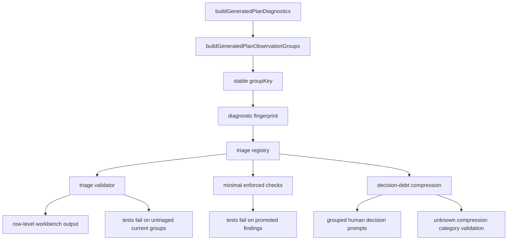

# feat: Add Generated Diagnostics Triage Workflow

## Overview

Add the workflow layer that turns generated-plan diagnostics from a report into a sequenced decision system. The first implementation slices created stable observation-group identity, a compact triage workbench, freshness and graduation gates, decision-debt compression, workload metadata guidance, and dynamic surface sentinels. The latest slice adds a diagnostic-only redistribution causality receipt so generator-policy groups can be reviewed as repeatable evidence before any runtime generator or catalog changes.

---

## Problem Frame

The generated-plan diagnostics report now exposes 540 seeded cells, 421 observation-only cells, 0 hard failures, and 53 routeable observation groups. That is enough signal to guide catalog and generator decisions, but it is not yet operational: a maintainer can see stretch pressure, but there is no durable record of whether each group is accepted, needs cap review, needs block splitting, needs source-backed content, or should eventually become a hard failure.

This plan follows `docs/brainstorms/2026-05-01-generated-plan-diagnostics-next-steps-requirements.md`: diagnostics are evidence, not automatic policy; hard failures still block readiness; catalog/content additions still require source-backed gap cards; and new supported surfaces must fail closed unless support is proven or explicitly not applicable.

The post-U1-U3 continuation follows `docs/brainstorms/2026-05-01-generated-diagnostics-decision-debt-compression-requirements.md`: once row-level triage is fresh and complete, the next decision bottleneck is compressing 53 rows into a small set of human review prompts.

---

## Requirements Trace

- R1. Expose routeable observation groups as a decision queue with stable group keys, drill/variant/block metadata, observation codes, affected cell count, likely fix paths, affected examples, triage status, chosen route, rationale, and owner/status fields.
- R2. Define a graduation ladder so existing known observations do not fail tests merely because they exist, new untriaged groups do fail, and explicitly promoted findings can become enforced hard gates.
- R3. Add a dynamic surface/new focus sentinel so newly supported focuses, durations, levels, and setups enter the diagnostic matrix or declare explicit not-applicable reasons; reserve future theme contracts until a concrete theme surface exists.
- R4. Provide a catalog change impact preview so future drill, variant, cap, or tag edits can be evaluated by readiness and generated-plan diagnostic deltas before activation.
- R5. Document workload envelope authoring rules for `durationMinMinutes`, `durationMaxMinutes`, and `fatigueCap.maxMinutes`.
- R6. Support a diagnostic-only redistribution comparison to distinguish catalog gaps from generator redistribution policy.
- R7. Compress unresolved triage entries into a smaller set of human decision prompts, generated from the current triage workbench, with narrow validation for missing or unknown compression lanes.

**Origin actors:** founder/maintainer, agent, future catalog author.

**Origin acceptance examples:** AE1 through AE15 from `docs/brainstorms/2026-05-01-generated-plan-diagnostics-next-steps-requirements.md`.

**Decision-debt addendum:** Plan R7 summarizes decision-debt addendum R1-R8; U4 covers decision-debt AE1-AE4.

**Dynamic-surface addendum:** Plan R3 is sharpened by `docs/brainstorms/2026-05-02-generated-diagnostics-dynamic-surface-sentinel-requirements.md`; U5 covers addendum R1-R16, F1-F3, and AE1-AE6.

**Redistribution-causality addendum:** Plan R6 is sharpened by `docs/brainstorms/2026-05-02-generated-diagnostics-redistribution-causality-receipt-requirements.md`; U8 covers addendum R1-R17, F1-F3, and AE1-AE6.

---

## Scope Boundaries

- Do not add new drills directly from the diagnostics report.
- Do not change shipped runtime `buildDraft()` behavior in the first slice.
- Do not ship mixed-focus themes in this plan.
- Do not build a full UI editor.
- Do not make all existing observations fail tests.
- Do not weaken existing hard-failure diagnostics or report freshness checks.
- Do not let decision-debt compression hide or replace row-level triage detail.
- Do not make unresolved compressed prompts fail diagnostics.

### Deferred to Follow-Up Work

- Full interactive UI for triage review: defer until the docs-first workbench proves the model.
- Runtime generator policy changes from redistribution comparison: defer until U8 produces evidence and a separate policy decision.
- Actual source-backed drill activation: defer to gap-card and activation-manifest work after triage identifies a content-depth route.
- Catalog impact preview as a full tool: defer until there is a concrete gap card, cap edit, or candidate catalog change to preview.
- Product-visible theme support: defer until a concrete theme contract exists; U5 only guards against false claims that raw multi-select OR behavior is theme coverage.

---

## Context & Research

### Relevant Code and Patterns

- `app/src/domain/generatedPlanDiagnostics.ts` owns generated-plan matrix construction, result summaries, observation grouping, and hard-failure versus observation classification.
- `app/src/domain/generatedPlanDiagnosticTriage.ts` owns stable triage identity, registry validation, and workbench generation.
- `app/src/domain/__tests__/generatedPlanDiagnostics.test.ts` is the primary unit-test home for diagnostic behavior.
- `app/src/domain/__tests__/generatedPlanDiagnosticTriage.test.ts` is the primary unit-test home for triage behavior.
- `app/scripts/validate-generated-plan-diagnostics-report.mjs` generates and validates `docs/reviews/2026-05-01-generated-plan-diagnostics-report.md` and `docs/reviews/2026-05-01-generated-plan-diagnostics-triage.md`.
- `app/src/domain/sessionAssembly/focusReadiness.ts` shows existing patterns for closed status unions, readiness states, activation manifests, and source-backed gap card contracts.
- `docs/reviews/2026-04-30-focus-coverage-gap-cards.md` owns source-backed content routing and activation-manifest conventions.
- `docs/reviews/2026-05-01-generated-plan-diagnostics-report.md` is intentionally compact; full group data should come from `buildGeneratedPlanObservationGroups(buildGeneratedPlanDiagnostics())`.
- `docs/reviews/2026-05-01-generated-plan-diagnostics-triage.md` is the row-level workbench and should remain the source of truth beneath compression.
- `DEFAULT_GENERATED_PLAN_SURFACE` in `app/src/domain/generatedPlanDiagnostics.ts` already derives from `VISIBLE_FOCUSES`, `READINESS_CONFIGURATIONS`, `PLAYER_LEVELS`, `READINESS_DURATIONS`, and `DEFAULT_GENERATED_PLAN_SEEDS`; U5 should formalize that as the supported-surface contract instead of inventing a second matrix source.
- `GeneratedPlanSupportedSurface.notApplicable` currently handles exact cell-level exclusions. U5 needs a separate surface-level deferred/reserved concept for dimensions or themes that should not expand into fake cells.
- `buildDraftWithAssemblyTrace()` in `app/src/domain/sessionBuilder.ts` already records `allocatedMinutes`, `redistributedMinutes`, `skippedOptionalLayoutIndexes`, and `redistributionLayoutIndex`, so U8 should start from trace-derived comparison rather than a hidden runtime builder mode.
- `GeneratedPlanObservationAffectedCell` in `app/src/domain/generatedPlanDiagnostics.ts` already carries `plannedMinutes`, `allocatedMinutes`, observation codes, and redistribution evidence. U8 can classify whether pressure remains by comparing authored caps against allocated minutes for affected cells.
- `GeneratedPlanDecisionDebtPrompt` in `app/src/domain/generatedPlanDiagnosticTriage.ts` already reports redistribution-affected and non-redistribution over-cap counts. U8 should extend this lane with causality receipt evidence rather than replacing the compression model.

### Institutional Learnings

- No `docs/solutions/` learning files exist yet for this pattern.
- Adjacent docs establish the reusable lesson: generated reports should produce routeable evidence first, then policy decisions, then source-backed activation or enforcement.
- A future `docs/solutions/` entry should capture the pattern once this workflow lands: generated report -> triage registry -> graduation ladder -> decision-debt compression -> fail-closed surface -> source-backed activation gates.

### External References

- Prior ideation used external analogies from exercise programming, recommender catalog coverage, quality gates, data quality incident triage, SRE alerting, and content governance. For this plan, local code patterns are sufficient; no new external research is needed.

---

## Key Technical Decisions

- Use one typed domain contract for triage identity and status. Diagnostics already live in pure domain code, so the triage model should start there rather than in UI or services.
- Separate lifecycle status, route, and enforcement status. A single enum would mix "where this finding is in review" with "what kind of fix it needs" and "whether it should fail tests."
- Require registry coverage for all generated routeable groups, not just the top groups committed to the report. The top-groups report is for scanability; the gate must compare against the full live group set.
- Add a stable `groupKey` and separate diagnostic fingerprint. The key identifies the finding; the fingerprint detects materially changed facts such as cap envelope, affected count, likely fix paths, or example cells.
- Keep existing observations non-blocking unless promoted. New untriaged groups fail the triage gate; current known groups do not fail only because they remain observed.
- Defer hard-fail predicate machinery until there is a concrete promoted finding. U3 should establish the enforcement status shape and one minimal exact-group check, not a general DSL.
- Add `generator_policy_investigation` as a route for redistribution-bearing groups. Otherwise the workbench can force generator-policy causes into catalog/content buckets.
- Add a decision-debt compression layer after U3. It should derive human review prompts from row-level triage, validate stale output or unexpected unknown lanes, and avoid persisting a second row-level taxonomy unless a later maintainer pass proves it is needed.
- Keep R3 through R6 sequenced behind R1/R2 and R7. Dynamic surfaces, impact previews, workload guidance, and redistribution experiments all depend on stable observation identity, triage semantics, and a small enough decision queue for maintainers to act on.
- Treat the readiness constants as the canonical generated-diagnostics surface for current Tune today single-focus coverage. U5 should validate around those constants instead of making raw `SkillFocus` type membership automatically create diagnostics cells.
- Keep cell-level `not_applicable` separate from surface-level `deferred` or `reserved` entries. Exact cells belong in the matrix; whole dimensions and future themes need reviewable reasons without pretending coverage exists.
- Reserve theme coverage behind a real theme contract. U5 may add metadata or validation that says themes are reserved, but it must not treat raw multi-select focus OR behavior as generated-plan theme readiness.
- Keep synthetic surface expansion tests out of the default product report. Synthetic fixtures prove sentinel behavior; only changes to the real default surface should affect the committed generated report and triage freshness.
- Start U8 as a trace-derived `allocated_duration_counterfactual` from current diagnostic evidence, not a rerun-without-redistribution builder mode. The receipt must state that pressure disappearing under allocated minutes means "cap pressure would disappear in a shorter draft with skipped optional time unfilled," not "removing redistribution is a valid runtime policy."
- Use deterministic precedence for U8 group action state while preserving evidence mix: `comparison_inconclusive` applies when missing evidence prevents interpreting the group; otherwise any remaining over-cap or under-minimum pressure makes the group action state `pressure_remains_without_redistribution`; otherwise over-cap pressure that disappears under allocated minutes is `likely_redistribution_caused`; redistribution-only groups with no cap/min pressure should be called out separately so they are not mislabeled as failures. Always include dominant cell state, per-state counts, and a `hasIncompleteEvidence` signal so one edge cell does not hide the broader pattern.
- Keep the U8 receipt generated and blocking-freshness-checked with the existing diagnostics report/triage path. Do not create a hand-maintained second report or allow stale receipt counts to remain as a warning-only condition.

---

## Open Questions

### Resolved During Planning

- Should triage cover all 53 current routeable groups or only report-top groups? Resolve as all generated groups, because the committed report intentionally truncates detail.
- Should route and lifecycle be one field? Resolve as separate `triageStatus`, `route`, and `enforcementStatus`.
- Should a new group fail tests? Yes, if it appears in live diagnostics without a valid triage registry entry.
- Should a synthetic new focus be the first slice? No. The first executable slice is R1/R2; R3 follows once triage identity exists.
- Should decision-debt compression be docs-only, generated, or gated? Stage all three: start as a generated docs review aid, then validate only stale output or missing/unknown categories once the prompt taxonomy exists.

### Deferred to Implementation

- Exact compression lane matching implementation: choose the simplest maintainable mechanism while implementing, but preserve the planning contract of ordered lanes, explicit precedence, a "why this lane" explanation, and an unknown/unclassified fallback.
- Exact generated Markdown layout for compressed prompts: settle while integrating with the existing workbench generator.
- Whether compression freshness rides `diagnostics:report:check` or a narrower helper: prefer the existing command unless implementation reveals the output needs separate update/check modes.
- Exact hard-fail predicate DSL: defer until a concrete promoted finding exists. U3 should not create a framework without a first use.
- Whether disappeared groups fail or warn: start with a non-blocking stale/superseded section in the workbench, then promote to blocking only if drift becomes noisy.
- U5 supported surface source of truth: resolve as the existing readiness constants plus default generated-plan seeds, with validation helpers around them where useful.
- U5 surface contract shape: resolve as a named diagnostics contract with included values, pre-activation deferred values, unsupported user-visible failures, and a diagnostics-only reserved-future theme note. `DEFAULT_GENERATED_PLAN_SURFACE` should derive from included values rather than being the only place support is declared.
- U5 whole-surface deferral shape: resolve as separate from cell-level `not_applicable`; surface-level deferrals should identify the dimension/value, reason code or rationale, authority reference, and revisit/activation trigger.
- U5 theme handling: resolve as a negative guardrail, not a theme registry. U5 may report that themes are reserved outside the current generated surface, but it must not enumerate future themes or claim coverage until a real theme contract exists. Raw multi-focus OR is explicitly not coverage.
- U5 real surface expansion and triage: resolve that real default-surface expansion should flow through report and triage freshness; synthetic sentinel fixtures should not.
- U5 surface shrinkage: resolve that removing a current baseline focus/configuration/level/duration/seed should be blocking; `pre_activation_deferred` is only for future or not-yet-visible values.
- U5 configuration validation: resolve that an included configuration must be part of canonical `READINESS_CONFIGURATIONS`; a duplicate context under an unknown ID is not enough to count as covered.
- U8 MVP comparison: resolve as trace-derived allocated-duration evidence using existing `allocatedMinutes` first. The receipt must include skipped optional / unfilled-minute evidence so the counterfactual is not confused with a valid full-length runtime draft.
- U8 workload limits: resolve that U8 must have an explicit source for authored min/max/fatigue limits before classifying a cell. Prefer enriching affected-cell evidence if it keeps existing helpers simple; otherwise look up the selected variant by `drillId`/`variantId`. Missing limits or variant identity should produce `comparison_inconclusive`.
- U8 mixed groups: resolve as cell-level rollups plus deterministic group action-state precedence, not a single optimistic group label. Preserve dominant state and incomplete-evidence flags in the receipt.
- U8 receipt freshness: resolve as blocking under the existing `diagnostics:report:check` path by default.

---

## High-Level Technical Design

> *This illustrates the intended approach and is directional guidance for review, not implementation specification. The implementing agent should treat it as context, not code to reproduce.*

Recommended triage state model:

| Field               | Purpose                               | Example values                                                                                                                    |
| ------------------- | ------------------------------------- | --------------------------------------------------------------------------------------------------------------------------------- |
| `triageStatus`      | Review lifecycle                      | `observed`, `routed`, `resolved`, `superseded`                                                                                    |
| `route`             | Product/content/generator disposition | `policy_allowance`, `variant_cap_review`, `block_split`, `source_backed_content_depth`, `generator_policy_investigation`, `defer` |
| `enforcementStatus` | Test strictness                       | `observation_only`, `hard_fail_candidate`, `hard_fail_enforced`                                                                   |

Recommended derived compression contract:

| Concept              | Purpose                        | Notes                                                                                                |
| -------------------- | ------------------------------ | ---------------------------------------------------------------------------------------------------- |
| Compression lane     | Human decision prompt grouping | Derived from current group + registry fields; not manually persisted per row in U4.                  |
| Lane explanation     | Maintainer trust               | Each prompt should state why rows were grouped there.                                                |
| Unknown/unclassified | Safety fallback                | Unexpected patterns are surfaced separately and validated so they do not disappear into a watchlist. |

---

## U5 Delta From Existing Diagnostics

The first generated-plan diagnostics plan already created a dynamic matrix that expands from readiness constants, preserves exact cell-level `not_applicable`, and hard-fails unsupported generated drafts. U5 is not a rebuild of that layer. It closes these remaining gaps:

- Make the supported surface a reviewable contract with included, deferred, and reserved states, instead of letting the included matrix arrays be the only source of truth.
- Detect silent omissions and surface shrinkage, including unknown configuration IDs that reuse an existing setup context.
- Preserve deferral and reservation reasons in generated report evidence, not only in transient test fixtures.
- Validate deterministic seed IDs explicitly, not just seed count.
- Guard future themes negatively: no raw multi-select OR behavior can claim theme coverage before a concrete theme contract exists.

---

## Implementation Units

- U1. **Define Stable Diagnostic Triage Identity**

**Goal:** Add stable identity and typed triage concepts for routeable observation groups.

**Requirements:** R1, R2.

**Dependencies:** None.

**Files:**

- Modify: `app/src/domain/generatedPlanDiagnostics.ts`
- Create or modify: `app/src/domain/generatedPlanDiagnosticTriage.ts`
- Test: `app/src/domain/__tests__/generatedPlanDiagnostics.test.ts`
- Test: `app/src/domain/__tests__/generatedPlanDiagnosticTriage.test.ts`

**Approach:**

- Add exported identity for observation groups, including a versioned `groupKey` derived from stable fields such as drill ID, variant ID, block type, required flag, and sorted observation codes.
- Add a separate diagnostic fingerprint that includes mutable facts: authored/fatigue cap envelope, affected cell count, likely fix paths, and compact example-cell fingerprints.
- Define closed unions for `triageStatus`, `route`, and `enforcementStatus`.
- Keep route hints as suggestions, not automatic decisions.

**Execution note:** Implement new domain behavior test-first.

**Patterns to follow:**

- Closed union/status patterns in `app/src/domain/sessionAssembly/focusReadiness.ts`.
- Existing observation group construction in `app/src/domain/generatedPlanDiagnostics.ts`.

**Test scenarios:**

- Happy path: given a current observation group, identity generation returns a deterministic `groupKey` and diagnostic fingerprint.
- Edge case: the same observation codes in different orders produce the same `groupKey`.
- Edge case: cap metadata changes preserve the `groupKey` but change the diagnostic fingerprint.
- Error path: invalid triage route/status strings are rejected by type guard helpers.
- Integration: `buildGeneratedPlanObservationGroups()` exposes keys without tests recreating private grouping logic.

**Verification:**

- Observation groups carry stable keys and tests prove deterministic identity.

---

- U2. **Create Triage Registry And Workbench Output**

**Goal:** Seed a compact docs-first triage queue for current generated observation groups without pretending every route decision is already resolved.

**Requirements:** R1, R2; covers AE1, AE2, AE3.

**Dependencies:** U1.

**Files:**

- Create or modify: `app/src/domain/generatedPlanDiagnosticTriage.ts`
- Create: `docs/reviews/2026-05-01-generated-plan-diagnostics-triage.md`
- Modify: `docs/catalog.json`
- Test: `app/src/domain/__tests__/generatedPlanDiagnosticTriage.test.ts`

**Approach:**

- Add a typed triage registry keyed by generated `groupKey`.
- Seed all current generated routeable groups, not only the top five shown in the report.
- Store enough information to count as initially captured: route, rationale, owner/status, affected cell count, likely fix paths, diagnostic fingerprint, reviewed report ID or snapshot marker, and evidence links when applicable.
- Use conservative defaults: redistribution-bearing groups default to `generator_policy_investigation` or `needs_human_review`; content-depth routes require evidence; uncertain cases should stay explicitly marked for human review.
- Generate or maintain a Markdown workbench with summary-first information architecture:
  - new/untriaged blockers
  - stale fingerprint review
  - evidence-required routes
  - needs-human-review routes
  - accepted policy allowances
  - resolved/superseded cleanup
  - route summary and top affected groups
- Enforce AE3: `source_backed_content_depth` cannot be marked resolved unless it references a gap card, activation manifest, or explicit source-backed follow-up path.

**Execution note:** Prefer generated or script-validated docs over hand-maintained duplicated tables.

**Patterns to follow:**

- Frontmatter and machine-readable review docs under `docs/reviews/`.
- Gap-card evidence requirements in `docs/reviews/2026-04-30-focus-coverage-gap-cards.md`.

**Test scenarios:**

- Happy path: every current live group has a registry entry with required triage fields.
- Happy path: `d25-solo` under-authored wrap is represented as a triage item, not as an immediate content-add request.
- Happy path: affected cell count and likely fix paths are preserved per triage item.
- Edge case: a `defer` route still requires a rationale and reviewed snapshot marker.
- Edge case: a changed diagnostic fingerprint appears in the stale-fingerprint section rather than silently passing.
- Error path: a `source_backed_content_depth` item marked resolved without evidence is invalid.
- Integration: generated workbench output contains current route counts and top examples from live diagnostics.

**Verification:**

- The triage workbench can be regenerated or validated and reflects every current routeable group.

---

- U3. **Add Freshness And Graduation Gates**

**Goal:** Make diagnostics fail on new untriaged groups while keeping known observations non-blocking by default and leaving room for future enforced findings.

**Requirements:** R2; covers AE4, AE5, AE6.

**Dependencies:** U1, U2.

**Files:**

- Modify: `app/src/domain/generatedPlanDiagnosticTriage.ts`
- Modify: `app/scripts/validate-generated-plan-diagnostics-report.mjs`
- Modify: `app/package.json`
- Test: `app/src/domain/__tests__/generatedPlanDiagnosticTriage.test.ts`

**Approach:**

- Add validator logic that compares live generated groups against the triage registry.
- Fail when a current group is missing a valid triage entry.
- Allow known non-enforced observations to remain observation-only.
- Add only the minimal enforcement shape needed to represent `hard_fail_candidate` and `hard_fail_enforced`; do not build a general predicate DSL until a concrete promoted finding exists.
- Keep report freshness and triage coverage separate: the existing report check proves generated Markdown freshness; the new triage gate proves decision coverage.

**Patterns to follow:**

- `diagnostics:report:check` and `diagnostics:report:update` script pattern in `app/package.json`.
- Full-report comparison behavior in `app/scripts/validate-generated-plan-diagnostics-report.mjs`.

**Test scenarios:**

- Happy path: current known groups with valid triage entries do not fail.
- Error path: adding a synthetic live group without a triage entry fails coverage validation.
- Error path: a group marked `hard_fail_enforced` fails validation while still present.
- Edge case: a disappeared group is reported as resolved/superseded cleanup-needed rather than silently ignored.
- Edge case: an existing group with a changed diagnostic fingerprint does not pass as fully fresh.
- Integration: the package-level diagnostics check can detect both stale report content and stale triage coverage.

**Verification:**

- A future new observation group cannot appear without an explicit triage decision.

---

- U4. **Add Decision-Debt Compression Review**

**Goal:** Compress the current 53 row-level triage entries into a smaller set of human decision prompts before starting dynamic surface, catalog preview, workload guidance, or redistribution follow-ups.

**Requirements:** R7; covers decision-debt AE1 through AE4 from `docs/brainstorms/2026-05-01-generated-diagnostics-decision-debt-compression-requirements.md`.

**Dependencies:** U1, U2, U3.

**Files:**

- Modify: `app/src/domain/generatedPlanDiagnosticTriage.ts`
- Modify: `app/scripts/validate-generated-plan-diagnostics-report.mjs`
- Modify: `docs/reviews/2026-05-01-generated-plan-diagnostics-triage.md`
- Test: `app/src/domain/__tests__/generatedPlanDiagnosticTriage.test.ts`

**Approach:**

- Add a derived compression layer over the existing triage registry/workbench; do not replace row-level triage and do not persist lane state in the row-level registry for U4.
- Group unresolved entries by the human decision needed, using ordered compression lanes with explicit precedence, a short lane explanation, and an unknown/unclassified fallback.
- Start with these lanes: short-session cooldown minimum, technique under-min review, workload envelope review, generator redistribution investigation, source-backed content-depth candidate, low-volume watchlist, and unknown/unclassified.
- Define low-volume watchlist eligibility narrowly by affected-cell threshold and absence of stronger lane matches; genuinely novel patterns should go to unknown/unclassified instead.
- Include prompt label, decision question, affected group count, total affected cell count, full group-key list or deterministic row-level anchor, route mix, disposition/next action, and next evidence needed.
- For redistribution prompts, split total affected cells from redistribution-affected cells and non-redistribution over-cap cells so the prompt does not overstate causality.
- Generate the grouped section from the current triage data so it does not become a hand-maintained second source of truth.
- Validate stale generated output, missing lane coverage, and unexpected unknown/unclassified groups, but do not fail merely because a prompt remains unresolved.
- Use the compressed prompts to recommend exactly one next implementation unit or a deliberate pause: U5 dynamic surface sentinel, U7 workload guidance, U8 redistribution comparison, or deferred U6 catalog preview tied to a real proposal.

**Patterns to follow:**

- Existing generated triage workbench sections in `docs/reviews/2026-05-01-generated-plan-diagnostics-triage.md`.
- Existing report validation flow in `app/scripts/validate-generated-plan-diagnostics-report.mjs`.

**Test scenarios:**

- Happy path: current triage groups are assigned to a known compression prompt lane with affected group and cell counts.
- Happy path: `d25-solo` wrap under-min appears under a short-session cooldown minimum prompt, not as a direct drill-add request.
- Happy path: redistribution-bearing over-cap groups appear under a generator redistribution investigation prompt with total affected, redistribution-affected, and non-redistribution over-cap counts separated.
- Error path: a synthetic triage group with no matching compression lane appears in unknown/unclassified and fails validation.
- Edge case: a low-volume group only enters low-volume watchlist when it is under the chosen affected-cell threshold and no stronger lane matches.
- Edge case: unresolved compressed prompts remain non-blocking.
- Integration: the generated triage workbench contains the compressed decision section and remains fresh under `diagnostics:report:check`.

**Verification:**

- Maintainers can review a small set of decision prompts while preserving row-level group traceability.

---

- U5. **Add Dynamic Surface And New Focus Sentinel**

**Goal:** Ensure newly supported focuses, configurations, levels, and durations enter diagnostics automatically or explicitly opt out with reasons, while reserving theme coverage until a real theme contract exists.

**Requirements:** R3 plus `docs/brainstorms/2026-05-02-generated-diagnostics-dynamic-surface-sentinel-requirements.md`; covers origin AE7-AE9 plus dynamic-surface addendum R1-R16, F1-F3, and AE1-AE6.

**Dependencies:** U1, U3, U4. U4 provides the compression context that selected U5 as the next protective workflow unit. U7 is already-completed context, not a dependency: U5 must not modify workload guidance, triage routes, or current observation classifications.

**Files:**

- Modify: `app/src/domain/generatedPlanDiagnostics.ts`
- Modify only if adding a read-only helper or export comment: `app/src/domain/sessionAssembly/focusReadiness.ts`
- Modify: `app/scripts/validate-generated-plan-diagnostics-report.mjs`
- Modify: `docs/reviews/2026-05-01-generated-plan-diagnostics-report.md`
- Test: `app/src/domain/__tests__/generatedPlanDiagnostics.test.ts`
- Test: `app/src/domain/sessionAssembly/__tests__/focusReadiness.test.ts`

**Approach:**

- Introduce a named diagnostics surface contract around the current readiness constants. The contract should distinguish `included` values that generate diagnostics from `pre_activation_deferred` values, `unsupported_user_visible` failures, and a diagnostics-only `reserved_future` note for themes. `DEFAULT_GENERATED_PLAN_SURFACE` should derive from included values, not serve as the only support declaration.
- Keep `VISIBLE_FOCUSES`, `READINESS_CONFIGURATIONS`, `PLAYER_LEVELS`, `READINESS_DURATIONS`, and `DEFAULT_GENERATED_PLAN_SEEDS` as the current canonical included values. U5 should not make raw type union membership diagnostic-supported by itself.
- Add the smallest validation/helper shape needed to distinguish:
  - included/applicable cells that generate diagnostics;
  - exact cell-level `not_applicable` entries with reasons;
  - surface-level deferred or reserved entries that should not expand into fake cells;
  - unknown or silent omissions that should fail closed.
- Preserve `not_applicable` for cells already inside the matrix. Use a separate surface-level deferral concept for whole dimensions where no honest cell expansion exists.
- Require surface-level deferred entries to identify at least the dimension, value, reason/rationale, authority reference, and activation or revisit trigger. Reject blank, duplicate, unknown, or generic reasons such as "unsupported", "n/a", or "todo".
- Validate the included surface itself: non-empty dimensions, unique values, exact seed IDs, canonical configuration IDs from `READINESS_CONFIGURATIONS`, and no unknown included configuration that merely duplicates an existing context.
- Include enough surface evidence in the generated report for review: current included arrays, exact seed IDs, not-applicable/deferred/reserved counts, and the associated reasons where relevant.
- Keep synthetic sentinel fixtures local to tests. Synthetic surfaces may use casted future values to prove fail-closed behavior, but they must be clearly named and must not mutate the default product surface or generated report.
- Keep real default-surface expansion wired into existing report/triage freshness. If a future product-supported dimension is added, diagnostics should produce cells, expose the changed surface in the report, and let U1-U4 triage gates catch any new routeable groups.
- Reserve themes as a negative guardrail: generated report evidence should state that themes are outside the current generated surface and require a concrete theme contract before coverage can be claimed. Do not add a theme matrix, durable theme registry, user-facing theme type, or multi-select OR shortcut in U5.
- Treat current baseline surface shrinkage as blocking. Do not let an excluded entry make an already-supported focus/configuration/level/duration/seed disappear from diagnostics; `pre_activation_deferred` is only for future or not-yet-visible values.

**Patterns to follow:**

- `DEFAULT_GENERATED_PLAN_SURFACE` in `app/src/domain/generatedPlanDiagnostics.ts`.
- `VISIBLE_FOCUSES`, `READINESS_CONFIGURATIONS`, and `READINESS_DURATIONS` in `app/src/domain/sessionAssembly/focusReadiness.ts`.
- Existing matrix expansion and `not_applicable` summary tests in `app/src/domain/__tests__/generatedPlanDiagnostics.test.ts`.
- Existing generated report stale-check flow in `app/scripts/validate-generated-plan-diagnostics-report.mjs`.

**Test scenarios:**

- Covers F1 / AE1. Happy path: a synthetic supported duration added to a test-only surface produces generated matrix cells and hard-fails when no draft can be built.
- Covers F1 / AE2. Error path: a synthetic product-supported visible focus or configuration with no generated coverage and no deferral reason fails surface validation as a silent omission.
- Covers F1 / AE2. Error path: an included configuration with an unknown ID but duplicate supported context fails validation instead of passing as covered.
- Covers F1 / AE2. Error path: empty or duplicate included focus/configuration/level/duration/seed values fail surface validation.
- Covers F2 / AE3. Happy path: an exact cell-level `not_applicable` entry with a specific reason remains visible in matrix summary and generated report data.
- Covers F2 / AE3. Error path: a deferred or `not_applicable` entry with a blank, generic, duplicate, unknown-value, or placeholder reason is invalid.
- Covers F2 / AE3. Error path: removing a current baseline focus/configuration/level/duration/seed fails validation even if an excluded entry tries to explain it away.
- Covers AE4. Edge case: synthetic sentinel fixtures are clearly isolated from the default product surface and do not change current 540-cell report counts.
- Covers F3 / AE5. Happy path: the report includes a diagnostics-only note that themes are outside the current generated surface and cannot claim raw multi-select OR coverage.
- Covers F3 / AE5. Error path: any attempt to mark theme coverage as included without a concrete theme contract fails validation.
- Covers AE6. Integration: the generated report exposes enough surface evidence for reviewers to see included dimensions, deferrals/reservations, and changed surface shape.
- Integration: real default-surface expansion flows through the existing report and triage freshness path so new routeable groups are not silently accepted.

**Verification:**

- Expanding the supported surface cannot bypass generated-plan diagnostics.
- Deferred or reserved surfaces are reviewable by reason and cannot masquerade as covered.
- Current observation policy remains unchanged: existing routeable observations stay governed by triage/compression rather than becoming hard failures from U5 alone.

---

- U6. **Provide Catalog Change Impact Preview**

**Goal:** Let maintainers preview how a concrete catalog or workload metadata proposal would change readiness and generated-plan diagnostics before activation.

**Requirements:** R4; covers AE10, AE11.

**Dependencies:** U1, U3, U4, plus a concrete gap card, cap edit, or candidate catalog change to preview.

**Files:**

- Create or modify: `app/src/domain/generatedPlanDiagnosticPreview.ts`
- Modify: `app/src/domain/generatedPlanDiagnostics.ts`
- Modify: `app/src/domain/sessionAssembly/focusReadiness.ts`
- Test: `app/src/domain/__tests__/generatedPlanDiagnosticPreview.test.ts`

**Approach:**

- Add the smallest pure comparison helper needed for the first real proposal; do not build a generic preview framework without a concrete input.
- Accept current readiness/diagnostics plus candidate readiness/diagnostics and return deltas for readiness cells, diagnostic status counts, hard failures, observation counts, and top group changes.
- Plan the catalog injection seam explicitly before implementing preview output. Current diagnostics read from static `DRILLS`; preview needs a deliberate candidate-catalog input path rather than hidden mutation.
- Keep the helper independent from any particular editing UI.
- Use the preview to evaluate cap/tag/content proposals before activation manifests are applied.
- Define maintainer-facing preview states: improves, regresses, no-op, and needs review.

**Patterns to follow:**

- Summary helpers in `app/src/domain/generatedPlanDiagnostics.ts`.
- Focus-readiness audit and activation-manifest separation in `app/src/domain/sessionAssembly/focusReadiness.ts`.

**Test scenarios:**

- Happy path: reducing a max-duration cap pressure changes `over_authored_max` counts in the preview.
- Happy path: adding a candidate variant shows new or removed affected groups without mutating the source catalog.
- Happy path: a candidate content change reports readiness audit deltas and generated-plan diagnostic deltas together.
- Edge case: preview reports no-op edits as zero deltas.
- Error path: candidate diagnostics with hard failures are surfaced prominently.

**Verification:**

- A concrete catalog proposal can be reviewed as matrix deltas before any activation.

---

- U7. **Write Workload Envelope Authoring Guide**

**Goal:** Document how catalog authors should choose duration and fatigue metadata before changing caps or adding content.

**Requirements:** R5; covers AE12, AE13.

**Dependencies:** U2, U4.

**Files:**

- Create or modify: `docs/ops/workload-envelope-authoring-guide.md` if U4 proves the policy is reused across multiple routes; otherwise modify `docs/reviews/2026-05-01-generated-plan-diagnostics-triage.md` with a focused guidance section.
- Modify: `docs/catalog.json`
- Modify: `docs/reviews/2026-05-01-generated-plan-diagnostics-triage.md`

**Approach:**

- Start as a focused section or short guide. Promote to a standalone `docs/ops/` guide only if the triage workbench shows the policy is reused across multiple routes.
- Define guidance for `durationMinMinutes`, `durationMaxMinutes`, and `fatigueCap.maxMinutes` by block intent, setup, skill level, session length, and practice logic.
- Include a decision rubric for when to accept a long round, review a cap, split a block, or add source-backed content.
- Link the guide from triage entries that choose `variant_cap_review` or `policy_allowance`.

**Patterns to follow:**

- Docs frontmatter conventions in `docs/ops/agent-documentation-contract.md`.
- Existing source-backed catalog routing in `docs/reviews/2026-04-30-focus-coverage-gap-cards.md`.

**Test scenarios:**

- Test expectation: none, because this is documentation guidance. Validation should come from agent-doc checks and cross-links.

**Verification:**

- The guide gives catalog authors a clear policy basis for resolving under-min and over-fatigue observations.

---

- U8. **Add Redistribution Comparison Diagnostic**

**Goal:** Build a repeatable diagnostic-only redistribution causality receipt that separates optional-slot redistribution pressure from pressure that remains under trace-derived no-redistribution evidence, without changing runtime generation.

**Requirements:** R6 plus `docs/brainstorms/2026-05-02-generated-diagnostics-redistribution-causality-receipt-requirements.md`; covers origin AE14-AE15 plus redistribution-causality addendum R1-R17, F1-F3, and AE1-AE6.

**Dependencies:** U1, U3, U4, U7. U7 supplies workload-envelope routing language for pressure that remains without redistribution; U8 must not rewrite U7 guidance or absorb U6 preview work.

**Files:**

- Modify: `app/src/domain/generatedPlanDiagnostics.ts`
- Modify: `app/src/domain/generatedPlanDiagnosticTriage.ts`
- Modify: `app/scripts/validate-generated-plan-diagnostics-report.mjs`
- Modify: `docs/reviews/2026-05-01-generated-plan-diagnostics-triage.md`
- Avoid unless trace evidence proves insufficient: `app/src/domain/sessionBuilder.ts`
- Test: `app/src/domain/__tests__/generatedPlanDiagnostics.test.ts`
- Test: `app/src/domain/__tests__/generatedPlanDiagnosticTriage.test.ts`
- Conditional test only if `sessionBuilder.ts` changes: `app/src/domain/sessionBuilder.test.ts`

**Approach:**

- Start from the full live group set, not the truncated report summary: `buildGeneratedPlanObservationGroups(buildGeneratedPlanDiagnostics())`.
- Filter through existing triage state for `generator_policy_investigation` groups so the receipt stays anchored to the row-level registry and stable group keys.
- Derive the MVP comparison from existing trace metadata: current pressure is `plannedMinutes` compared with authored min/max/fatigue limits; allocated-duration pressure is `allocatedMinutes` compared with those same limits.
- Add an explicit workload-limit source before classification. Either enrich `GeneratedPlanObservationAffectedCell` with authored min/max/fatigue limits while building groups, or have the U8 receipt helper look up the selected variant by `drillId`/`variantId`. If limits or variant identity are missing, classify the cell as inconclusive.
- Do not add a hidden `buildDraft()` option in the first slice. If a cell lacks enough trace evidence for a fair comparison, classify that cell as inconclusive.
- Label the comparison mode as `allocated_duration_counterfactual` and include skipped optional slot / unfilled-minute evidence so the receipt cannot imply that no-redistribution is already a valid full-length draft policy.
- Add explicit receipt states:
  - `likely_redistribution_caused`: over-cap or over-fatigue pressure disappears when comparing against allocated minutes.
  - `pressure_remains_without_redistribution`: over-cap, over-fatigue, or under-minimum pressure remains even without redistributed minutes.
  - `comparison_inconclusive`: trace evidence is missing, mismatched, or cannot fairly answer the question.
  - `redistribution_without_pressure`: redistribution is present but there is no cap/min pressure to resolve, so the group should not be exaggerated into a failure.
- Use deterministic group action-state precedence while preserving the evidence mix: inconclusive evidence wins only when it prevents interpreting the group; remaining pressure wins over likely-redistribution-caused for mixed groups; otherwise use the strongest cell-level state present.
- Report both group-level and aggregate counts: total groups, total affected cells, redistribution-affected cells, current over-max/current over-fatigue/current under-minimum counts, allocated-duration over-max/over-fatigue/under-minimum counts, cells where pressure disappears, cells where pressure remains, inconclusive cells, redistribution-without-pressure cells, dominant cell state, and `hasIncompleteEvidence`.
- Add follow-up routing to the receipt:
  - `future_generator_policy_decision` for groups where pressure disappears under the trace-derived comparison.
  - `workload_review`, `block_shape_review`, `source_backed_proposal_work`, or `u6_proposal_admission_candidate` for groups where pressure remains, with U6 gated behind a concrete source-backed proposal.
  - `no_implementation_action_yet` for redistribution without cap/min pressure.
  - `comparison_support_needed` for inconclusive groups.
- Render the receipt in the generated triage workbench, near the existing `Generator redistribution investigation` prompt, and serialize the receipt payload enough for exact validation.
- Make receipt freshness blocking under `diagnostics:report:check`: compare group membership, per-state cell counts, aggregate totals, route labels, and generated Markdown.
- Keep the existing runtime boundary explicit in docs and tests: U8 can add derived diagnostics and generated output, but cannot alter shipped draft assembly behavior.

**Patterns to follow:**

- Existing non-persisted `DraftAssemblyTrace` metadata in `app/src/domain/sessionBuilder.ts`; prefer reading it over adding a new builder mode.
- `GeneratedPlanObservationAffectedCell` fields in `app/src/domain/generatedPlanDiagnostics.ts`, especially `plannedMinutes`, `allocatedMinutes`, `authoredMaxMinutes`, `fatigueMaxMinutes`, observation codes, and redistribution evidence.
- Decision-debt prompt generation in `app/src/domain/generatedPlanDiagnosticTriage.ts`, especially the existing generator redistribution lane and workbench Markdown output.
- Existing report/triage freshness flow in `app/scripts/validate-generated-plan-diagnostics-report.mjs`.

**Test scenarios:**

- Covers F1 / AE1. Happy path: current generator-policy lane produces a receipt with group count, total affected cells, redistribution-affected cells, pressure-disappears cells, pressure-remains cells, and inconclusive cells.
- Covers F1 / AE1. Happy path: receipt output reports current pressure counts and allocated-duration pressure counts separately, including over-max, over-fatigue, and under-minimum breakdowns where applicable.
- Covers F1 / AE1. Happy path: a cell whose final planned minutes exceed authored max only after redistribution is counted under `likely_redistribution_caused`.
- Covers F3 / AE4. Happy path: a cell whose allocated minutes still exceed authored max or fatigue cap is counted under `pressure_remains_without_redistribution` and routes toward workload review or future U6 proposal admission.
- Covers F2 / AE3. Happy path: pressure disappearing under allocated minutes is labeled as `allocated_duration_counterfactual` and includes skipped optional / unfilled-minute evidence.
- Covers F1 / AE2. Edge case: a group with missing or mismatched trace allocation data becomes `comparison_inconclusive` instead of disappearing or receiving a false causality label.
- Covers F1 / AE2. Edge case: a selected variant with missing workload limits or missing variant identity becomes `comparison_inconclusive`.
- Covers F1 / AE2. Edge case: a group with redistribution evidence but no cap/min pressure is reported as `redistribution_without_pressure`.
- Covers F1 / AE1. Edge case: a mixed group with some pressure-disappears cells and some pressure-remains cells uses deterministic group action-state precedence, still reports dominant cell state and per-state counts, and does not claim the whole group is solved by removing redistribution.
- Covers F2 / AE3. Error path: U8 tests prove `buildDraft()` output is unchanged and public draft-building options do not gain a diagnostic-only redistribution toggle.
- Covers AE5. Integration: generated triage workbench includes the U8 receipt beside the generator redistribution prompt and preserves stable group-key traceability.
- Covers AE6. Integration: `diagnostics:report:check` fails when the U8 receipt in the committed workbench no longer matches live diagnostics.

**Verification:**

- Maintainers can tell whether current generator-policy groups are mostly redistribution-caused, mixed, inconclusive, or not actionable without scanning all affected cells.
- Runtime generation, catalog content, workload metadata, and U6 preview scope remain unchanged.

---

## System-Wide Impact

- **Interaction graph:** Pure domain diagnostics feed generated Markdown reports, triage registry validation, decision-debt compression, and docs-first workbench artifacts. UI, Dexie persistence, and services remain unchanged in the first decision-debt slice.
- **Error propagation:** Existing hard failures remain blocking. Triage coverage introduces a failure class for missing decision records, and decision-debt compression introduces a narrow failure class for unknown/missing compression lanes or stale generated output.
- **State lifecycle risks:** Registry entries can drift when diagnostic facts change; per-group fingerprints, resolved/superseded statuses, freshness tests, and compression freshness checks mitigate silent drift.
- **API surface parity:** The plan adds internal domain helpers and scripts, not public APIs. Future CLI/script exposure should use the same domain helpers.
- **Integration coverage:** Unit tests must prove pure helper behavior; script checks must prove generated docs, triage coverage, and compression output remain current.
- **Unchanged invariants:** Current `buildDraft()` runtime behavior, source-backed catalog activation rules, and existing hard-failure semantics remain intact throughout this plan. Any runtime generator behavior change requires a separate follow-up plan.

---

## Risks & Dependencies

| Risk                                                    | Mitigation                                                                                                                                               |
| ------------------------------------------------------- | -------------------------------------------------------------------------------------------------------------------------------------------------------- |
| Triage registry becomes stale                           | Validate against live `buildGeneratedPlanObservationGroups(buildGeneratedPlanDiagnostics())`.                                                            |
| All current observations accidentally become blocking   | Keep default `enforcementStatus` as observation-only and only fail missing triage entries, unknown compression lanes, or explicit enforced group checks. |
| Same-key facts drift while the gate passes              | Store a diagnostic fingerprint per group and surface stale fingerprints for review.                                                                      |
| Stable keys become brittle after cap edits              | Keep mutable cap facts in the fingerprint rather than the key; use resolved/superseded cleanup for disappeared groups.                                   |
| Agents add drills before policy decisions               | Keep content-depth routes unresolved without source-backed gap cards or activation manifests.                                                            |
| Decision-debt compression becomes another stale surface | Generate or validate it from the triage registry, and keep row-level triage as the source of truth.                                                      |
| R3-R6 follow-ups bloat the first slice                  | Sequence R1/R2/R7 first and treat dynamic surfaces, impact previews, workload guidance, and redistribution comparisons as follow-on work.                |
| Compression lane matching hides novel patterns          | Require an unknown/unclassified lane and validate unexpected unknowns rather than sending them to low-volume watchlist.                                  |
| Redistribution prompt overstates causality              | Split total affected cells from redistribution-affected and non-redistribution over-cap cells.                                                           |
| Allocated-duration counterfactual implies valid runtime policy | Label U8 comparison mode explicitly, include skipped optional / unfilled-minute evidence, and route policy decisions outside U8.                 |
| Redistribution comparison changes runtime behavior      | Make comparison diagnostic-only and test directly that `buildDraft()` output and public options stay unchanged.                                           |
| Missing workload limits produce false causality labels  | Require an explicit workload-limit source before classification and mark missing variant/limit evidence as inconclusive.                                  |
| U8 receipt becomes stale but still authoritative        | Make U8 receipt freshness blocking under `diagnostics:report:check`, including group membership, counts, route labels, and Markdown.                      |

---

## Documentation / Operational Notes

- Keep this plan in `docs/catalog.json`.
- Keep `docs/brainstorms/2026-05-01-generated-diagnostics-decision-debt-compression-requirements.md` registered in `docs/catalog.json`.
- Add or update review docs under `docs/reviews/` with YAML frontmatter and scan-first summaries.
- Run agent-doc validation after adding durable docs.
- Keep generated report, row-level triage workbench, and compressed decision prompts separate but cross-linked: one reports diagnostics, one records row decisions, and one groups human review debt.

---

## Sources & References

- **Origin document:** `docs/brainstorms/2026-05-01-generated-plan-diagnostics-next-steps-requirements.md`
- **Decision-debt addendum:** `docs/brainstorms/2026-05-01-generated-diagnostics-decision-debt-compression-requirements.md`
- **Ideation:** `docs/ideation/2026-05-01-generated-plan-diagnostics-next-steps-ideation.md`
- **Diagnostics report:** `docs/reviews/2026-05-01-generated-plan-diagnostics-report.md`
- **Triage workbench:** `docs/reviews/2026-05-01-generated-plan-diagnostics-triage.md`
- **Gap cards:** `docs/reviews/2026-04-30-focus-coverage-gap-cards.md`
- **Diagnostics domain:** `app/src/domain/generatedPlanDiagnostics.ts`
- **Triage domain:** `app/src/domain/generatedPlanDiagnosticTriage.ts`
- **Readiness domain:** `app/src/domain/sessionAssembly/focusReadiness.ts`
- **Report validation script:** `app/scripts/validate-generated-plan-diagnostics-report.mjs`

