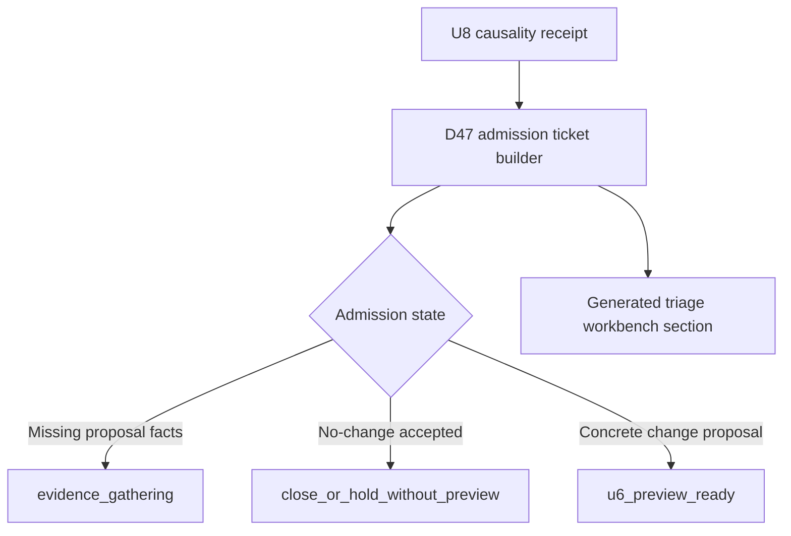

# feat: Add D47 Proposal Admission Ticket

## Overview

Add a generated, docs-first proposal-admission ticket for `d47` / `d47-solo-open` (Four Great Sets / Solo open). The ticket turns the U8 redistribution causality receipt into a concrete admission gate before U6 catalog impact preview work begins.

This plan does not build U6 preview tooling. It should prove the admission package can live in the existing generated triage/review surface first.

---

## Problem Frame

U8 identified `d47-solo-open` as the strongest first receipt-backed candidate because it has mixed evidence: some pressure disappears under the `allocated_duration_counterfactual`, some pressure remains without redistribution, and non-redistribution pressure remains visible. That evidence is useful but not yet a proposal.

The next slice should make the candidate reviewable by generating a ticket that preserves the receipt facts, states why the candidate is not preview-ready yet, names missing proposal facts, separates generator-policy evidence from workload/block/source-backed tracks, and gives no-change a valid non-preview exit.

---

## Requirements Trace

- R1-R3. Preserve stable admission identity: group key, drill ID, variant ID, block type, route context, and U8 receipt facts.
- R4-R8. Require a concrete proposed delta, source evidence state, expected diagnostic movement, and verification artifacts before U6 preview readiness.
- R9-R11. Keep pressure-disappears, pressure-remains, non-redistribution pressure, and generator-policy evidence separate.
- R12-R17. Add evidence basis, falsification condition, product/training-quality hypothesis, no-action threshold, D47-vs-alternative comparison, existing-surface check, counterfactual-only handling, and no-change exit behavior.
- R18-R21. Keep the ticket non-authorizing, gate U6 preview, leave missing facts in evidence-gathering, and reuse the shape only if D47 proves it.

**Origin actors:** A1 maintainer, A2 proposal author, A3 agent planner, A4 reviewer.

**Origin flows:** F1 D47 candidate becomes an admission ticket; F2 mixed evidence stays split; F3 U6 preview remains gated.

**Origin acceptance examples:** AE1-AE7 from `docs/brainstorms/2026-05-02-generated-diagnostics-d47-u6-proposal-admission-requirements.md`.

---

## Scope Boundaries

- Do not edit `app/src/data/drills.ts`.
- Do not change `durationMinMinutes`, `durationMaxMinutes`, `fatigueCap.maxMinutes`, courtside instructions, source-backed content, or runtime `buildDraft()` behavior.
- Do not create `app/src/domain/generatedPlanDiagnosticPreview.ts` in this slice.
- Do not build generic U6 preview tooling.
- Do not create a new standalone admission artifact unless the existing generated triage/review surface cannot host the ticket cleanly.
- Do not treat the allocated-duration counterfactual as a valid runtime generator policy.

---

## Context & Research

### Relevant Code and Patterns

- `app/src/domain/generatedPlanDiagnosticTriage.ts` owns the triage registry, decision-debt prompts, U8 redistribution receipt, and workbench Markdown generation.
- `buildGeneratedPlanRedistributionCausalityReceipt()` already exposes group-level receipt facts and follow-up routes for `u6_proposal_admission_candidate`.
- `buildGeneratedPlanTriageWorkbenchMarkdown()` is the existing generated review surface and should host the D47 ticket near the U8 receipt.
- `app/scripts/validate-generated-plan-diagnostics-report.mjs` is the report/triage freshness path and should keep the generated D47 ticket checked by `npm run diagnostics:report:check`.
- `app/src/domain/__tests__/generatedPlanDiagnosticTriage.test.ts` is the lowest useful test tier for new admission-ticket domain behavior.
- `docs/ops/workload-envelope-authoring-guide.md` already says U6 requires affected group keys, changed IDs, proposed delta, expected diagnostic delta, and source/gap evidence.
- `docs/reviews/2026-04-30-focus-coverage-gap-cards.md` is the source-backed activation precedent if the eventual proposal requires content-depth work.

### Institutional Learnings

- No `docs/solutions/` learning files exist yet for this pattern.
- Adjacent docs establish the local rule: generated diagnostics are evidence first; catalog, workload, source-backed, and generator-policy changes require explicit proposal evidence before implementation.

### External References

- None. Local diagnostics, workload guidance, and source-backed activation rules are sufficient for this planning slice.

---

## Key Technical Decisions

- Host the first admission ticket in the generated triage workbench. This satisfies the existing-surface check and avoids a new durable artifact for one candidate.
- Add a pure-domain admission-ticket builder beside the U8 receipt builder. The ticket depends on generated receipt data, not on app UI, services, Dexie, or runtime draft mutation.
- Keep the current D47 ticket in an `evidence_gathering` state. Current evidence identifies a candidate, but it lacks a concrete changed surface, evidence basis, falsification condition, expected movement, and no-action threshold.
- Treat counterfactual-only pressure as diagnostic evidence. It can route to future generator-policy analysis only after a policy-admissible hypothesis exists.
- Preserve no-change as a first-class outcome. A no-change disposition may close or hold the ticket without U6 preview unless preview would test a specific no-change claim.

---

## Open Questions

### Resolved During Planning

- What artifact should represent the first D47 admission ticket? Use a generated section in `docs/reviews/2026-05-01-generated-plan-diagnostics-triage.md` first; do not create a standalone artifact unless this proves insufficient.
- Which diagnostic deltas should U6 preview compute first? Deferred beyond this slice. The ticket should name expected movement fields but remain not preview-ready until a concrete proposal exists.
- What source evidence is sufficient? The ticket should record source-backed evidence as present, missing, or not needed by proposal type; source-backed content changes still require the gap-card/manifest path.

### Deferred to Implementation

- Exact exported type names for admission state and missing-fact codes.
- Exact Markdown layout for the generated D47 ticket, as long as it preserves the required facts and remains scan-friendly.

---

## High-Level Technical Design

> *This illustrates the intended approach and is directional guidance for review, not implementation specification. The implementing agent should treat it as context, not code to reproduce.*

---

## Implementation Units

- [x] U1. **Define Admission Ticket Domain Contract**

**Goal:** Add the pure data shape and builder for D47 admission ticket evidence.

**Requirements:** R1-R8, R12-R17, AE1-AE3, AE5-AE6.

**Dependencies:** U8 receipt implementation.

**Files:**
- Modify: `app/src/domain/generatedPlanDiagnosticTriage.ts`
- Test: `app/src/domain/__tests__/generatedPlanDiagnosticTriage.test.ts`

**Approach:**
- Add closed unions for admission state and missing proposal facts.
- Add a ticket shape that carries candidate identity, receipt facts, follow-up tracks, evidence-state fields, and preview-readiness state.
- Build the first ticket from `buildGeneratedPlanRedistributionCausalityReceipt()` by selecting the `d47` / `d47-solo-open` group.
- Default the current ticket to evidence-gathering, with missing facts for concrete delta, evidence basis, falsification condition, expected movement, product/training-quality hypothesis, and no-action threshold.

**Execution note:** Implement domain behavior test-first.

**Patterns to follow:**
- Existing U8 receipt types and helpers in `app/src/domain/generatedPlanDiagnosticTriage.ts`.
- Closed union/type-guard patterns already used in the same module.

**Test scenarios:**
- Covers AE1. Happy path: current diagnostics produce a D47 ticket with the exact group key, drill ID, variant ID, route context, and U8 receipt counts.
- Covers AE2 / AE5. Edge case: a ticket with missing proposal facts is not U6-preview-ready.
- Covers AE6. Happy path: no-change state has a close-or-hold path and does not automatically require preview.
- Covers R16. Happy path: pressure that disappears only under the counterfactual remains diagnostic-only until a policy-admissible generator hypothesis exists.

**Verification:**
- D47 ticket facts are generated from current diagnostics and are stable under the existing triage registry path.

---

- [x] U2. **Render Admission Ticket In Triage Workbench**

**Goal:** Make the admission ticket visible and freshness-checked in the generated review doc.

**Requirements:** R1-R3, R9-R11, R15, R18-R21, F1-F3, AE1, AE4, AE7.

**Dependencies:** U1.

**Files:**
- Modify: `app/src/domain/generatedPlanDiagnosticTriage.ts`
- Modify: `app/scripts/validate-generated-plan-diagnostics-report.mjs`
- Modify generated output: `docs/reviews/2026-05-01-generated-plan-diagnostics-triage.md`
- Test: `app/src/domain/__tests__/generatedPlanDiagnosticTriage.test.ts`

**Approach:**
- Add a `## D47 Proposal Admission Ticket` section near the redistribution receipt section.
- Render identity, receipt facts, admission state, missing facts, follow-up tracks, existing-surface decision, no-change path, and explicit non-authorizations.
- Include enough machine-readable or generated text output so `npm run diagnostics:report:check` fails when the committed triage doc is stale.

**Patterns to follow:**
- Current U8 receipt rendering in `buildGeneratedPlanTriageWorkbenchMarkdown()`.
- Existing generated-doc validation in `app/scripts/validate-generated-plan-diagnostics-report.mjs`.

**Test scenarios:**
- Covers AE1 / AE4. Happy path: workbench Markdown contains the D47 ticket, split evidence tracks, and follow-up routes.
- Covers AE5. Edge case: workbench Markdown lists missing proposal facts instead of suggesting U6 preview work.
- Integration: generated triage check detects stale Markdown when the rendered ticket changes.

**Verification:**
- The committed triage doc includes the D47 ticket and remains fresh under the existing diagnostics check.

---

- [x] U3. **Keep U6 Preview Explicitly Deferred**

**Goal:** Make the current U6 unit safe to execute later by updating plan references without starting preview code now.

**Requirements:** R18-R21, AE2, AE5, AE7.

**Dependencies:** U1, U2.

**Files:**
- Modify: `docs/plans/2026-05-01-002-feat-generated-diagnostics-triage-workflow-plan.md`
- Modify: `docs/catalog.json`
- Test expectation: none -- documentation/routing update only.

**Approach:**
- Update U6 requirement references from the old R1-R15/AE1-AE5 range to the reviewed R1-R21/AE1-AE7 range.
- Clarify that this D47 ticket is a prerequisite/admission slice and that `app/src/domain/generatedPlanDiagnosticPreview.ts` remains deferred until a ticket reaches preview-ready state.
- Sync catalog routing text if needed so agents do not treat this ticket as direct preview implementation.

**Patterns to follow:**
- Existing U8 completion updates in the generated diagnostics triage workflow plan.
- Machine-scannable docs rule requiring `docs/catalog.json` sync for routing-critical changes.

**Test scenarios:**
- Test expectation: none -- validate with docs checks.

**Verification:**
- Agents reading the plan can distinguish the admission-ticket slice from future U6 preview tooling.

---

## System-Wide Impact

- **Interaction graph:** Pure diagnostics domain and generated docs only; no app runtime, storage, UI, or service layer changes.
- **Error propagation:** Missing D47 receipt facts should render as evidence-gathering or unavailable ticket state rather than throwing in user-facing runtime code.
- **State lifecycle risks:** Generated triage docs must stay fresh; stale output should be caught by existing diagnostics check commands.
- **API surface parity:** New exported types/helpers are internal app-domain planning surfaces, not public runtime APIs.
- **Unchanged invariants:** Catalog data, workload metadata, source-backed content, runtime generator behavior, and U6 preview tooling remain unchanged.

---

## Risks & Dependencies

| Risk | Mitigation |
|------|------------|
| The ticket becomes another hand-maintained artifact. | Generate it through the existing triage workbench and freshness check. |
| The ticket implies U6 preview is ready too early. | Default current D47 state to evidence-gathering and list missing proposal facts. |
| Counterfactual evidence is mistaken for runtime policy. | Render a diagnostic-only generator-policy boundary in the ticket. |
| D47 overfits the reusable admission shape. | Include D47-vs-alternative rationale and abandon criteria in the ticket. |

---

## Documentation / Operational Notes

- Update generated docs with the existing diagnostics update path only after tests for the rendered ticket pass.
- Run the narrow app tests before refreshing generated docs so the generated output reflects tested behavior.
- If this pattern proves useful, a later slice can consider whether future candidates need a generalized admission-ticket list.

---

## Sources & References

- **Origin document:** `docs/brainstorms/2026-05-02-generated-diagnostics-d47-u6-proposal-admission-requirements.md`
- **Parent plan:** `docs/plans/2026-05-01-002-feat-generated-diagnostics-triage-workflow-plan.md`
- **Generated triage:** `docs/reviews/2026-05-01-generated-plan-diagnostics-triage.md`
- **Generated report:** `docs/reviews/2026-05-01-generated-plan-diagnostics-report.md`
- **Workload guidance:** `docs/ops/workload-envelope-authoring-guide.md`
