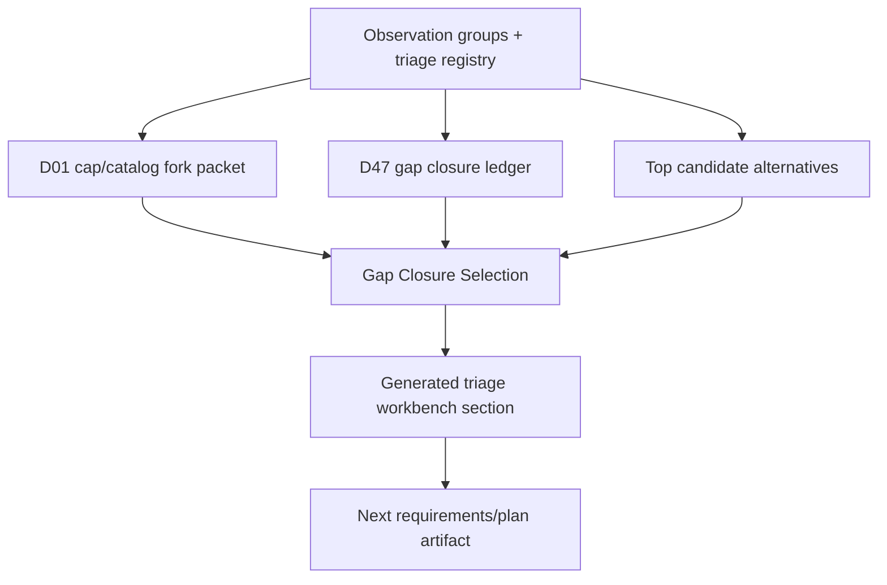

# feat: Add Gap Closure Selection Workbench

## Overview

Add a compact generated `Gap Closure Selection` section to the generated-plan diagnostics triage workbench. The section should pick one next artifact from current evidence, explain why it beats the main alternatives, keep D01 visibly held, and avoid authorizing catalog/config edits.

This is a selection artifact, not the catalog fill itself.

Status note (2026-05-02): Implemented and verified. The generated workbench currently selects `comparator_proposal` for `d47/d47-solo-open vs d05/d05-solo`, keeps `authorizationStatus: not_authorized`, and points follow-up work to D47-vs-D05 comparator proposal requirements before any catalog, workload, block-shape, generator-policy, or U6 edit.

---

## Problem Frame

The current diagnostics workflow can surface and route observations, but it still leaves the next action scattered across D01, D47, compression lanes, and route lists. The new workbench section should answer the maintainer's immediate question: "What is the next smallest high-quality artifact to plan?"

The origin requirements choose the Gap Closure Selection Workbench as the highest-value idea from the fresh catalog-gap ideation. D47 reentry is the first concrete case because D01 is now held and D47 is the largest mixed-pressure candidate that still needs a concrete delta or a clear rejection.

---

## Requirements Trace

- R1-R6. Render a generated selection artifact with one selected next artifact, current D01/D47 state, rejected alternatives, and non-authorization status.
- R7-R11. Handle D47 reentry after D01 selects `resume_d47_with_d01_held`, while preventing D47 from becoming catalog/config work without a complete evidence payload.
- R12-R16. Preserve evidence gates and scope boundaries: no catalog edits, workload metadata edits, source-backed activation, U6 preview tooling, or runtime generator changes.

**Origin actors:** A1 Maintainer, A2 Gap author, A3 Agent planner, A4 Reviewer.
**Origin flows:** F1 Generated selection from fresh diagnostics, F2 D47 reentry decision, F3 Evidence-gated handoff.
**Origin acceptance examples:** AE1 generated selection section, AE2 D47 reentry with D01 held, AE3 count does not dominate candidate selection, AE4 non-authorization guard.

---

## Scope Boundaries

- Do not edit `app/src/data/drills.ts` or any drill workload metadata.
- Do not add source-backed content or activation manifests.
- Do not change generated session assembly, optional-slot redistribution, or block allocation behavior.
- Do not build U6 preview tooling.
- Do not create a generic dashboard or full maintainer queue.
- Do not mark a catalog/config edit as authorized from this selection section.

---

## Context & Research

### Relevant Code and Patterns

- `app/src/domain/generatedPlanDiagnosticTriage.ts` already builds D47 admission, D47 ledger, D01 proposals, D01 fill receipt, D01 cap/catalog fork packet, and generated workbench markdown.
- `app/src/domain/__tests__/generatedPlanDiagnosticTriage.test.ts` is the focused home for generated diagnostic triage contract tests.
- `app/scripts/validate-generated-plan-diagnostics-report.mjs` generates and freshness-checks `docs/reviews/2026-05-01-generated-plan-diagnostics-report.md` and `docs/reviews/2026-05-01-generated-plan-diagnostics-triage.md`.
- `docs/ops/workload-envelope-authoring-guide.md` defines cooldown, technique, workload, U6, and U8 boundaries.
- `docs/reviews/2026-04-30-focus-coverage-gap-cards.md` defines source-backed activation expectations.

### Institutional Learnings

- No durable `docs/solutions/` learning was found for this exact workflow. Existing generated-diagnostics plans consistently preserve the same rule: generated observations are evidence, not authorization.

### External References

- The ideation pass used curriculum gap analysis, content catalog approval/versioning, and evidence-quality review as analogies for gated remediation. The actionable takeaway is already encoded in the requirements: mapped evidence, explicit approval states, and documented no-action decisions.

---

## Key Technical Decisions

- Add a pure derived selection object in `generatedPlanDiagnosticTriage.ts`: This matches the existing D47/D01 receipt pattern and avoids persisted state.
- Render inside the generated triage workbench: Freshness stays covered by `npm run diagnostics:report:check`.
- Use deterministic current-state rules for v1: D01 held plus complete D47 evidence should select a D47-vs-D05 comparator proposal unless a complete evidence payload exists later. This keeps the slice minimal while avoiding D47-by-momentum.
- Keep alternatives explicit but shallow: D25, D05, and one adjacent D33/D46/D47 group should be compared with one-line reasons, not full proposals.
- Treat all selected artifacts as `not_authorized`: The selected artifact is a planning target, not approval to edit catalog/config surfaces.
- Product-lens constraint: v1 should shorten the path to the next concrete D47/comparator artifact. If implementation starts creating a reusable ranking framework, scorecard, or queue, cut it back to the current D01-held / D47-reentry decision.

---

## Open Questions

### Resolved During Planning

- Should the workbench live in generated triage or a standalone doc? Generated triage, because the selection depends on fresh diagnostic state.
- Should D47 automatically become catalog work after D01 is held? No. It becomes the default reentry candidate, but catalog/config edits remain blocked without a complete evidence payload.
- Should the first version rank every current group? No. It should compare enough candidates to prevent D47 momentum from dominating, without creating a full scorecard.

### Deferred to Implementation

- Exact field names for the selection object can follow the surrounding type names in `generatedPlanDiagnosticTriage.ts`.
- The third adjacent comparison group can be chosen from current groups during implementation, with preference for the clearest generated evidence and test stability.

---

## High-Level Technical Design

> _This illustrates the intended approach and is directional guidance for review, not implementation specification. The implementing agent should treat it as context, not code to reproduce._

---

## Implementation Units

- [x] U1. **Define selection contract**

**Goal:** Add a pure domain object that selects the next gap closure artifact from current D01, D47, and top alternative evidence.

**Requirements:** R1-R6, R7-R11, R12-R16, F1, F2, AE1, AE2, AE3, AE4

**Dependencies:** None.

**Files:**

- Modify: `app/src/domain/generatedPlanDiagnosticTriage.ts`
- Test: `app/src/domain/__tests__/generatedPlanDiagnosticTriage.test.ts`

**Approach:**

- Define a small union for selected next artifacts from the origin requirements.
- Build the selection from existing D01 cap/catalog fork packet, D47 ledger, and current observation groups.
- Select a D47-vs-D05 comparator proposal when D01 is held and D47 is current with complete comparison evidence, but set planning/edit authorization to `not_authorized`.
- Include rejected alternatives for D25 cooldown policy, D05 comparator pressure, and one adjacent D33/D46/D47 group.
- Preserve D01 held state and D47 currentness in the returned object.
- Keep the selected artifact actionable enough that the next brainstorm/plan can start from it; avoid generic "needs review" copy unless the selected artifact is explicitly `hold_for_evidence`.

**Execution note:** Implement the domain behavior test-first because this is the contract the generated docs will mirror.

**Patterns to follow:**

- `buildGeneratedPlanD47GapClosureLedger()` in `app/src/domain/generatedPlanDiagnosticTriage.ts`
- `buildGeneratedPlanD01CapCatalogForkPacket()` in `app/src/domain/generatedPlanDiagnosticTriage.ts`

**Test scenarios:**

- Covers AE1 / AE2. Happy path: current D01 fork selects `resume_d47_with_d01_held` and current D47 exists with complete comparison evidence -> selection chooses the D47-vs-D05 comparator artifact, marks edits not authorized, and keeps D01 held.
- Covers AE3. Happy path: D25 has the largest affected count -> selection still records D25 as rejected because cooldown policy review precedes catalog work.
- Edge case: D47 target is missing or stale -> selection falls back to `hold_for_evidence` or a comparator artifact without claiming D47 is ready.
- Edge case: D01 is not in the held/reentry state -> selection preserves existing state and does not invent a D47 reentry.

**Verification:**

- Domain tests prove selected artifact, rejected alternatives, authorization status, and held-state behavior.

---

- [x] U2. **Render selection in generated workbench**

**Goal:** Add a compact `Gap Closure Selection` section to generated triage markdown.

**Requirements:** R1-R6, R11-R16, F1, F3, AE1, AE4

**Dependencies:** U1.

**Files:**

- Modify: `app/src/domain/generatedPlanDiagnosticTriage.ts`
- Test: `app/src/domain/__tests__/generatedPlanDiagnosticTriage.test.ts`

**Approach:**

- Render selected target, selected artifact, reason, authorization status, D01 held state, D47 state, rejected alternatives, and next artifact.
- Keep copy terse and scan-friendly, matching adjacent generated sections.
- Make non-authorization explicit so the section cannot be read as permission to edit drills/config.

**Patterns to follow:**

- Markdown builders for D47 and D01 sections in `app/src/domain/generatedPlanDiagnosticTriage.ts`

**Test scenarios:**

- Covers AE1. Happy path: generated markdown includes `## Gap Closure Selection` with selected artifact and rejected alternatives.
- Covers AE4. Happy path: generated markdown includes `not_authorized` or equivalent non-authorization copy.
- Edge case: selection falls back to held/evidence state -> markdown renders the hold reason instead of omitting the section.

**Verification:**

- Focused markdown tests prove the generated section is present and bounded.

---

- [x] U3. **Refresh generated diagnostics artifacts**

**Goal:** Regenerate the triage workbench and keep freshness validation aligned with the new section.

**Requirements:** R1-R6, R12-R16, AE1, AE4

**Dependencies:** U1, U2.

**Files:**

- Modify: `app/scripts/validate-generated-plan-diagnostics-report.mjs`
- Modify generated output: `docs/reviews/2026-05-01-generated-plan-diagnostics-triage.md`
- Test: `app/src/domain/__tests__/generatedPlanDiagnosticTriage.test.ts`

**Approach:**

- Ensure the generated triage output includes the new section through existing generation paths.
- Add requirements/plan dependencies to generated output freshness where the existing pattern calls for it.
- Regenerate generated docs using the diagnostics update script during implementation.

**Patterns to follow:**

- Prior generated dependencies for D01/D47 addenda in `app/scripts/validate-generated-plan-diagnostics-report.mjs`

**Test scenarios:**

- Integration: diagnostics report check sees generated triage as current after regeneration.
- Happy path: generated output contains the new section without changing the report data surface unnecessarily.

**Verification:**

- Diagnostics freshness check passes after generated docs are refreshed.

---

- [x] U4. **Sync docs routing and plan state**

**Goal:** Keep the new requirements, ideation, plan, and catalog routing aligned.

**Requirements:** R1-R6, R12-R16

**Dependencies:** U3.

**Files:**

- Modify: `docs/catalog.json`
- Modify: `docs/plans/2026-05-02-011-feat-gap-closure-selection-workbench-plan.md`
- Modify if needed: `docs/plans/2026-05-01-002-feat-generated-diagnostics-triage-workflow-plan.md`

**Approach:**

- Register the new plan in `docs/catalog.json`.
- Mark this plan complete only after implementation and verification.
- Update the parent generated diagnostics workflow plan only if it needs to name the new selected artifact in the sequence.

**Patterns to follow:**

- Recent D01/D47 plan registrations in `docs/catalog.json`

**Test scenarios:**

- Test expectation: none -- docs routing only, validated by agent-doc validation rather than unit tests.

**Verification:**

- Agent-doc validation passes after routing updates.

---

## System-Wide Impact

- **Interaction graph:** Generated diagnostics groups -> D01/D47 derived receipts -> Gap Closure Selection -> generated triage workbench -> next requirements/plan artifact.
- **Error propagation:** Missing/stale D01 or D47 evidence should render as held/not-authorized state, not throw.
- **State lifecycle risks:** Generated output can go stale if not refreshed; existing diagnostics freshness check should catch this.
- **API surface parity:** The new helper is an internal diagnostics-domain planning surface, not app runtime API.
- **Integration coverage:** Generated markdown and diagnostics freshness checks are required; unit tests alone are not enough.
- **Unchanged invariants:** App runtime, drill catalog, workload metadata, U6 tooling, and optional-slot redistribution remain unchanged.

---

## Risks & Dependencies

| Risk                                                 | Mitigation                                                                                                                                 |
| ---------------------------------------------------- | ------------------------------------------------------------------------------------------------------------------------------------------ |
| Workbench becomes a generic ranking system.          | Keep v1 deterministic and anchored to D01 held + D47-vs-D05 comparator selection plus three alternatives.                                  |
| Selection implies permission to edit catalog/config. | Render `not_authorized` and scope boundaries directly in the generated section.                                                            |
| D47 wins by momentum.                                | Require explicit rejected alternatives and keep comparator/no-change paths visible.                                                        |
| The output adds process but no product progress.     | Require a named next artifact and stop condition; if none can be named, select `hold_for_evidence` rather than building broader machinery. |
| Generated docs drift.                                | Use the existing diagnostics update/check workflow.                                                                                        |

---

## Documentation / Operational Notes

- The workbench should be read as "what artifact next," not "what code to edit next."
- A later source-backed catalog fill, cap proposal, block-shape proposal, or generator-policy hypothesis still needs its own requirements and plan.

---

## Sources & References

- **Origin document:** `docs/brainstorms/2026-05-02-gap-closure-selection-workbench-requirements.md`
- Related ideation: `docs/ideation/2026-05-02-catalog-gap-closure-ideation.md`
- Related requirements: `docs/brainstorms/2026-05-02-catalog-gap-closure-requirements.md`
- Related generated triage: `docs/reviews/2026-05-01-generated-plan-diagnostics-triage.md`
- Related guide: `docs/ops/workload-envelope-authoring-guide.md`
