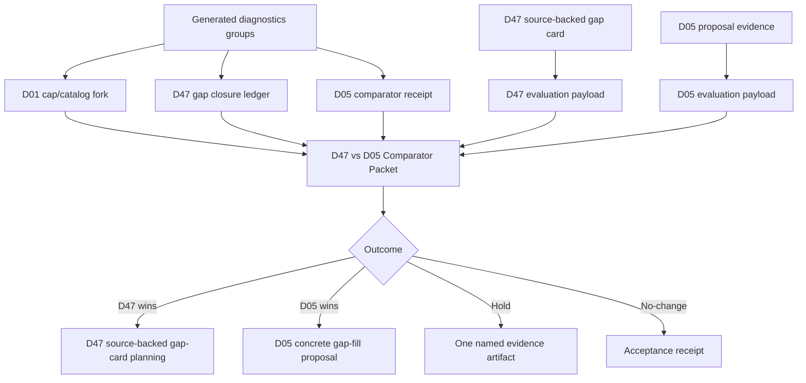

# feat: Add D47 vs D05 Comparator Decision Packet

## Overview

Add a generated `D47 vs D05 Comparator Decision Packet` to the diagnostics triage workflow. The packet should decide whether D47 has earned the right to use `docs/reviews/2026-05-02-d47-source-backed-gap-card.md` as catalog-planning input, whether D05 is the better next gap-fill target, whether both candidates should hold for evidence, or whether a no-change receipt is the right outcome.

This is a decision packet, not the catalog fill itself.

Status note (2026-05-02): Implemented in `app/src/domain/generatedPlanDiagnosticTriage.ts`, rendered into `docs/reviews/2026-05-01-generated-plan-diagnostics-triage.md`, and validated by focused diagnostics-triage tests plus report freshness checks. Current generated evidence selects `hold_both_for_evidence` with next artifact `D47-vs-D05 comparator evaluation payload`; D47's source-backed gap card remains a held exhibit, not catalog authorization.

---

## Problem Frame

The current generated workbench selects `comparator_proposal` for `d47/d47-solo-open vs d05/d05-solo`. D47 has a tempting source-backed gap-card candidate, but it is mixed-causality, advanced, and more expensive to implement. D05 is simpler and higher-confidence as a comparator, but may have lower strategic value than adding advanced setting/movement depth.

The product risk is choosing by momentum instead of truth: D47 should not win just because a source-backed card already exists, and D05 should not win just because it is smaller. The comparator packet should force both candidates to carry the same burden: athlete/session problem, changed surface, smallest action, expected diagnostic movement, regression risk, no-action threshold, and loser re-entry trigger.

---

## Requirements Trace

- R1. Start from the current generated `Gap Closure Selection` state: `comparator_proposal` for `d47/d47-solo-open vs d05/d05-solo`.
- R2. Preserve D01 as held/visible via `resume_d47_with_d01_held`; if D01 is no longer held, fail closed.
- R3. Compare D47 and D05 symmetrically on causal warrant, athlete-facing session value, minimality, source/readiness evidence, future selection path, maintenance cost, expected movement, and no-action threshold.
- R4. Select exactly one outcome: `d47_wins`, `d05_wins`, `hold_both_for_evidence`, or `accepted_no_change`.
- R5. Keep every outcome `not_authorized` for implementation edits until a later selected artifact is planned and reviewed.
- R6. Treat `docs/reviews/2026-05-02-d47-source-backed-gap-card.md` as a held exhibit, not positive authorization; it can only become input after D47 wins.
- R7. D47 can win only when it proves a source-backed or otherwise concrete path beyond current FIVB 4.7 coverage and explains why sessions will actually select the new surface instead of continuing to overuse `d47-solo-open`.
- R8. D05 can win only when it names a concrete proposal type, expected movement, and athlete-facing value for beginner/intermediate solo passing trust.
- R9. If neither candidate names a product-relevant session problem beyond diagnostic pressure, select hold or no-change instead of adding more process.
- R10. Affected-cell movement is secondary; training-quality value per unit of change is the primary tie-break.

**Origin actors:** A1 Maintainer, A2 Gap author, A3 Agent planner, A4 Reviewer.
**Origin flows:** F1 Generated selection from fresh diagnostics, F2 D47 reentry decision, F3 Evidence-gated handoff.
**Origin acceptance examples:** Gap Closure Selection AE1-AE4; D47 concrete-delta AE1-AE4.

---

## Scope Boundaries

- Do not edit `app/src/data/drills.ts`, workload metadata, progression data, runtime generation, optional-slot redistribution, or U6 preview tooling in this plan's implementation.
- Do not implement `d49`, `d49-solo-open`, or `d49-pair-open` here; those remain conditional D47 gap-card candidates.
- Do not let the D47 gap card pre-decide the comparator.
- Do not let D05 be only a token comparator; it must be allowed to win.
- Do not use diagnostic count reduction alone as the winner.
- Do not build a broad maintainer queue or generic scoring framework.

### Deferred to Follow-Up Work

- D47 catalog implementation: only if the decision packet selects `d47_wins` and a later plan accepts the source-backed gap card.
- D05 concrete gap-fill implementation: only if the packet selects `d05_wins` and a later proposal chooses workload/block-shape, source-backed, generator-policy, or no-change work.
- U6 catalog impact preview: still deferred until a concrete catalog/cap proposal exists.

---

## Context & Research

### Relevant Code and Patterns

- `app/src/domain/generatedPlanDiagnosticTriage.ts` already owns the D47 proposal admission ticket, D47 gap closure ledger, D01 cap/catalog fork packet, and gap closure selection workbench.
- `app/src/domain/__tests__/generatedPlanDiagnosticTriage.test.ts` is the focused test surface for generated diagnostics decision artifacts.
- `app/scripts/validate-generated-plan-diagnostics-report.mjs` owns generated report/triage freshness and dependency frontmatter.
- `docs/reviews/2026-05-01-generated-plan-diagnostics-triage.md` currently records D47 facts (30 total, 12 pressure-disappears, 18 pressure-remains, 6 non-redistribution) and D05 comparator facts (15 total, 6 pressure-disappears, 9 pressure-remains, 3 non-redistribution).
- `app/src/data/drills.ts` shows D47 is an intermediate/advanced setting/movement drill with 5-9 minute solo/pair open variants, while D05 is a beginner/intermediate solo/pair passing drill with an honesty clause: platform and direction, not serve-reading.

### Institutional Learnings

- No durable `docs/solutions/` learning exists for this exact diagnostic-to-gap-fill loop yet.
- Existing generated-diagnostics plans repeat the key rule: generated observations are evidence, not authorization.
- `docs/reviews/2026-04-30-focus-coverage-gap-cards.md` says focus readiness is complete for the current matrix; new activation needs a new readiness dimension, founder-use demand, or a source-backed polish objective.

### External References

- `docs/reviews/2026-05-02-d47-source-backed-gap-card.md` records external D47 source candidates from Better at Beach, JVA, and The Art of Coaching Volleyball, but those sources remain adaptation-gated for 1-2 player M001 use.

### Review Findings Integrated

- Product review: add user-segment, session exposure, perceived session failure, future selection path, maintenance cost, and loser re-entry trigger.
- Flow review: add deterministic tie-breaks, stale evidence handling, concrete D05 proposal typing, and no-change/hold evidence burdens.
- Adversarial review: treat the D47 gap card as held evidence, add anti-count-clearing criteria, keep D05 equally eligible, and stop if neither candidate names a real session problem.

---

## Key Technical Decisions

- Implement a pure derived comparator packet: This follows the existing diagnostics-domain pattern and avoids persisted state.
- Use a closed outcome union: `d47_wins`, `d05_wins`, `hold_both_for_evidence`, and `accepted_no_change` make impossible middle states visible in tests.
- Accept optional evaluation payloads for winner states: Current generated diagnostics can prove freshness and receipt facts, but a win should require an explicit payload naming changed surface, session problem, expected movement, and no-action threshold.
- Default current state should not authorize either candidate: Without complete evaluation payloads, the packet should hold for comparator evidence rather than silently promote D47 or D05.
- Treat D47 source evidence as conditional: The gap card can satisfy D47's source path only after D47 wins the comparator and still needs a later catalog plan.
- Keep D05 proposal type explicit: If D05 wins, the packet should name whether the next artifact is workload/block-shape, source-backed, generator-policy, accepted no-change, or another bounded proposal.

---

## Open Questions

### Resolved During Planning

- Does D47 win because it already has a source-backed card? No. The card is a held exhibit until D47 proves product value and selection path against D05.
- Does D05 win because it is smaller? No. D05 must name a concrete proposal type and athlete-facing value.
- Should this edit catalog data? No. The packet chooses the next artifact only.

### Deferred to Implementation

- Exact field names in the comparator packet can follow local naming in `generatedPlanDiagnosticTriage.ts`.
- Whether current generated output defaults to `hold_both_for_evidence` or a named `needs_comparator_evaluation` reason can be chosen during implementation, as long as no edits are authorized.
- The D05 first proposal type should be derived from current receipt facts if possible; if not, encode it as an explicit evaluation payload rather than guessing.

---

## High-Level Technical Design

> *This illustrates the intended approach and is directional guidance for review, not implementation specification. The implementing agent should treat it as context, not code to reproduce.*

Recommended packet shape:

| Field | Purpose |
| ----- | ------- |
| `selectionState` | Whether the packet selected an outcome or is holding for currentness/evidence. |
| `selectedOutcome` | One of `d47_wins`, `d05_wins`, `hold_both_for_evidence`, `accepted_no_change`. |
| `authorizationStatus` | Always `not_authorized` in this slice. |
| `d01State`, `d47State`, `d05State` | Currentness and decision context. |
| `d47Evaluation`, `d05Evaluation` | Optional complete proof payloads; required for winner outcomes. |
| `tieBreakSummary` | Why the selected outcome beats the other candidate and no-change. |
| `nextArtifact` | Exactly one next artifact to plan. |
| `stopCondition` | When implementation must stop instead of editing catalog/config/runtime surfaces. |

---

## Implementation Units

- [x] U1. **Define Comparator Packet Contract**

**Goal:** Add typed comparator packet concepts for D47-vs-D05 outcome selection without authorizing implementation edits.

**Requirements:** R1-R6, R9-R10.

**Dependencies:** None.

**Files:**
- Modify: `app/src/domain/generatedPlanDiagnosticTriage.ts`
- Test: `app/src/domain/__tests__/generatedPlanDiagnosticTriage.test.ts`

**Approach:**
- Add closed unions for comparator outcome, currentness/selection state, authorization status, and D05 proposal type.
- Define evaluation payload types for D47, D05, and no-change with symmetric burden-of-proof fields: served segment, session exposure, perceived session failure, changed surface, smallest action, expected diagnostic movement, regression risk, no-action threshold, and loser re-entry trigger.
- Keep winner states impossible unless the corresponding evaluation payload is complete.
- Keep `authorizationStatus` fixed to `not_authorized`.

**Execution note:** Implement contract tests first so the packet cannot represent impossible winner/evaluation combinations.

**Patterns to follow:**
- `GeneratedPlanD01CapCatalogForkPacket` discriminated union in `app/src/domain/generatedPlanDiagnosticTriage.ts`
- `GeneratedPlanGapClosureSelectionWorkbench` in `app/src/domain/generatedPlanDiagnosticTriage.ts`

**Test scenarios:**
- Happy path: a complete D47 evaluation can produce `d47_wins` and requires the D47 source-backed next artifact.
- Happy path: a complete D05 evaluation can produce `d05_wins` and requires a concrete D05 proposal type.
- Edge case: incomplete D47 or D05 evaluation cannot produce a winner state.
- Edge case: no-change evaluation requires accepted blast radius, no-action threshold, and revisit trigger.
- Error path: unknown or impossible outcome combinations are rejected at compile time through the discriminated union.

**Verification:**
- Focused tests prove outcome/evaluation combinations are closed and edits remain `not_authorized`.

---

- [x] U2. **Build Current D47 And D05 Evidence Receipts**

**Goal:** Derive the current comparator packet inputs from generated diagnostics, D47 ledger evidence, D05 receipt facts, and D01 held state.

**Requirements:** R1-R3, R6-R8.

**Dependencies:** U1.

**Files:**
- Modify: `app/src/domain/generatedPlanDiagnosticTriage.ts`
- Test: `app/src/domain/__tests__/generatedPlanDiagnosticTriage.test.ts`

**Approach:**
- Reuse the D47 ledger for D47 candidate facts and currentness.
- Locate the current D05 comparator group from the U8 redistribution causality receipt or generated observation groups using the stable D05 group key.
- Record D05 facts separately from D47: total affected cells, pressure-disappears, pressure-remains, non-redistribution pressure, block type, route, and workload facts where available.
- Derive `d01State` from the D01 cap/catalog fork packet and fail closed if D01 is no longer `resume_d47_with_d01_held`.
- Preserve the D47 gap card as a referenced planning artifact, not as runtime-readable authorization.

**Patterns to follow:**
- `buildGeneratedPlanD47GapClosureLedger()`
- `buildGeneratedPlanD01CapCatalogForkPacket()`
- `buildGeneratedPlanGapClosureSelectionWorkbench()`

**Test scenarios:**
- Happy path: current diagnostics derive D47 facts (30 / 12 / 18 / 6) and D05 facts (15 / 6 / 9 / 3).
- Edge case: missing or shifted D05 evidence prevents D05 from winning but does not authorize D47 by default.
- Edge case: missing or shifted D47 evidence prevents D47 from winning; D05 may win only with complete evidence.
- Edge case: D01 no longer held causes the packet to hold rather than selecting D47 or D05.

**Verification:**
- Domain tests prove current D47/D05 facts are derived from generated evidence, not duplicated by hand in the generated markdown.

---

- [x] U3. **Implement Symmetric Winner And Hold Logic**

**Goal:** Select exactly one comparator outcome with deterministic tie-breaks and explicit no-change/hold burdens.

**Requirements:** R3-R10.

**Dependencies:** U1, U2.

**Files:**
- Modify: `app/src/domain/generatedPlanDiagnosticTriage.ts`
- Test: `app/src/domain/__tests__/generatedPlanDiagnosticTriage.test.ts`

**Approach:**
- Add a builder that accepts current evidence plus optional evaluations.
- If currentness fails, select `hold_both_for_evidence` with a refresh/review next artifact.
- If only D47 has a complete evaluation, D47 wins only if it names source/adaptation basis, future selection path, and why it beats no-change and D05.
- If only D05 has a complete evaluation, D05 wins only if it names proposal type, athlete/session problem, expected movement, and why it beats no-change and D47.
- If both qualify, use the tie-break order: athlete-facing session value per unit of change, evidence readiness, future selection path, maintenance cost, diagnostic movement, then strategic priority.
- If neither qualifies, select `hold_both_for_evidence` with one named evidence artifact, not open-ended research.
- Select `accepted_no_change` only with explicit acceptance evidence and revisit trigger for both candidate surfaces.

**Patterns to follow:**
- D01 fork packet fail-closed selection behavior.
- Gap-closure selection non-authorization and stop-condition copy.

**Test scenarios:**
- Happy path: D47 wins with a complete source-backed gap-card evaluation and D05 loser re-entry trigger.
- Happy path: D05 wins with a complete workload/block-shape proposal evaluation and D47 held.
- Edge case: both candidates qualify; tie-break chooses the higher training-value-per-change candidate and renders the tie-break summary.
- Edge case: neither candidate qualifies; packet holds with one named evidence artifact.
- Edge case: accepted no-change requires no-action threshold and revisit trigger for both D47 and D05.
- Regression: affected-cell count alone never decides the winner.

**Verification:**
- Tests cover all four outcomes and prove implementation edits remain unauthorized.

---

- [x] U4. **Render Comparator Packet In Generated Triage**

**Goal:** Add a compact generated section that makes the comparator decision visible and usable by the next planner.

**Requirements:** R1-R10.

**Dependencies:** U1, U2, U3.

**Files:**
- Modify: `app/src/domain/generatedPlanDiagnosticTriage.ts`
- Modify: `app/scripts/validate-generated-plan-diagnostics-report.mjs`
- Modify generated output: `docs/reviews/2026-05-01-generated-plan-diagnostics-triage.md`
- Test: `app/src/domain/__tests__/generatedPlanDiagnosticTriage.test.ts`

**Approach:**
- Render the selected outcome, D47 facts, D05 facts, D01 held state, winner burden, rejected/held candidate reason, next artifact, authorization status, and stop condition.
- Include the D47 gap card path only when D47 is the selected winner or as held evidence when the current state holds.
- Keep copy terse enough for the generated workbench while preserving the tie-break rationale.
- Add requirements/plan dependencies to the generated triage frontmatter validation only when the generated output depends on the new packet.

**Patterns to follow:**
- `formatGeneratedPlanGapClosureSelectionWorkbenchMarkdown()`
- D47/D01 generated section rendering in `buildGeneratedPlanTriageWorkbenchMarkdown()`

**Test scenarios:**
- Happy path: generated markdown includes `## D47 vs D05 Comparator Decision Packet`.
- Happy path: markdown includes `Authorization status: not_authorized`.
- Edge case: hold outcome renders one named evidence artifact and does not omit D47/D05 facts.
- Regression: generated workbench remains freshness-checked by diagnostics report validation.

**Verification:**
- Focused markdown tests pass, and regenerated triage output is current.

---

- [x] U5. **Sync Docs Routing And Plan State**

**Goal:** Keep the planning chain and machine-readable routing aligned with the new decision packet.

**Requirements:** R1-R10.

**Dependencies:** U4.

**Files:**
- Modify: `docs/catalog.json`
- Modify: `docs/plans/2026-05-01-002-feat-generated-diagnostics-triage-workflow-plan.md`
- Modify: `docs/plans/2026-05-02-012-feat-d47-d05-comparator-decision-packet-plan.md`
- Possibly modify: `docs/brainstorms/2026-05-02-generated-diagnostics-d47-concrete-delta-proposal-requirements.md`
- Possibly modify: `docs/reviews/2026-05-02-d47-source-backed-gap-card.md`

**Approach:**
- Register this plan in `docs/catalog.json` as active before implementation and complete after verification.
- Update parent generated-diagnostics workflow routing only after the packet renders in generated triage.
- If implementation changes the current next artifact, update the D47 gap card/concrete-delta docs so they remain honest about whether D47 won, lost, or stayed held.

**Test scenarios:**
- Test expectation: none -- docs routing only, validated by `scripts/validate-agent-docs.sh`.

**Verification:**
- Agent-doc validation passes after routing updates.

---

## System-Wide Impact

- **Interaction graph:** Generated diagnostics groups -> D01 cap/catalog fork -> D47 gap closure ledger + D05 comparator receipt -> D47-vs-D05 comparator packet -> next artifact.
- **Error propagation:** Missing/stale D01, D47, or D05 evidence should render as hold/not-authorized state, not throw.
- **State lifecycle risks:** Generated triage can drift from source docs if not regenerated; existing diagnostics freshness checks should catch this once U4 lands.
- **API surface parity:** New helpers are internal diagnostics-domain planning surfaces, not user-facing app APIs.
- **Integration coverage:** Unit tests prove selection logic; diagnostics update/check proves generated-doc integration.
- **Unchanged invariants:** No catalog data, workload metadata, runtime generator behavior, U6 preview tooling, Dexie schema, UI, or routes change in this plan.

---

## Risks & Dependencies

| Risk | Mitigation |
|------|------------|
| D47 wins by prework because the source-backed gap card exists. | Treat the gap card as held evidence and require D47 to beat D05 and no-change on session value, selection path, and maintenance cost. |
| D05 wins by being smaller but less strategically valuable. | Require D05 to prove athlete/session value and proposal type, not just lower affected count. |
| The comparator becomes another process layer. | Require exactly one outcome and one next artifact; hold only with one named evidence artifact. |
| Count-clearing overrides training quality. | Make training-quality value per unit of change the primary tie-break; diagnostic movement is secondary. |
| Catalog work starts too early. | Keep every outcome `not_authorized`; D47 catalog work still requires a later plan from the source-backed gap card. |
| Stale evidence selects the wrong target. | Fail closed when D01-held, D47, or D05 currentness is missing or shifted. |

---

## Documentation / Operational Notes

- The packet should be read as "which artifact next," not "which code edit next."
- If D47 wins, the immediate next plan is source-backed catalog planning from `docs/reviews/2026-05-02-d47-source-backed-gap-card.md`.
- If D05 wins, write a D05 concrete gap-fill proposal before touching catalog, workload metadata, block shape, or generator policy.
- If neither wins, stop and hold rather than adding another broad diagnostic layer.

---

## Sources & References

- **Origin requirements:** `docs/brainstorms/2026-05-02-gap-closure-selection-workbench-requirements.md`
- **D47 reentry requirements:** `docs/brainstorms/2026-05-02-generated-diagnostics-d47-reentry-selection-requirements.md`
- **D47 concrete-delta gate:** `docs/brainstorms/2026-05-02-generated-diagnostics-d47-concrete-delta-proposal-requirements.md`
- **D47 held gap-card exhibit:** `docs/reviews/2026-05-02-d47-source-backed-gap-card.md`
- **Generated triage:** `docs/reviews/2026-05-01-generated-plan-diagnostics-triage.md`
- **Source-backed activation precedent:** `docs/reviews/2026-04-30-focus-coverage-gap-cards.md`
- **Workload guidance:** `docs/ops/workload-envelope-authoring-guide.md`
- **Domain code:** `app/src/domain/generatedPlanDiagnosticTriage.ts`
- **Catalog data:** `app/src/data/drills.ts`
