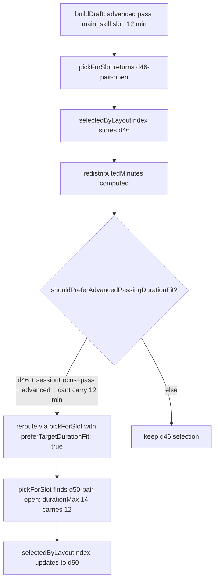

# feat: Author d50 Advanced Passing Depth Drill Family (FIVB 3.13 Short/Deep)

## Overview

Author a new advanced passing depth drill family `d50` ("Short/Deep Pass Read") sourced from FIVB Drill-book 3.13 Short/Deep. Two variants: `d50-pair-open` (partner-toss) and `d50-solo-open` (self-toss). Selection-path change in `sessionBuilder.ts` ensures `buildDraft()` reroutes to `d50` for advanced pair-open/solo-open passing main-skill blocks above 8 minutes (mirroring the existing d47/d48 advanced-setting reroute pattern). After implementation, regenerate diagnostics to verify the intended movement on `d46-pair-open` and `d46-solo-open` `pressure_remains` cells; revert if no movement.

This is the first non-D47-derived advanced catalog add authored from the diagnostic kit's `source_backed_content_depth` lane.

---

## Problem Frame

Generated diagnostics currently show `pressure_remains_without_redistribution` on:

- `gpdg:v1:d46:d46-pair-open:main_skill:true:optional_slot_redistribution+over_authored_max+over_fatigue_cap`: **8/16 cells** remain
- `gpdg:v1:d46:d46-solo-open:main_skill:true:optional_slot_redistribution+over_authored_max+over_fatigue_cap`: **12/24 cells** remain

`d46`'s honest envelope is 5–8 minutes (spin-read passing). Advanced pair-open / solo-open passing main-skill blocks above 8 minutes have no longer-envelope alternative in the catalog, so the generator either over-stretches `d46` or accumulates redistribution pressure.

Per the d46-pair-open source-backed gap card and its no-change comparator packet (which selected `hold_for_source_evidence`), the next artifact is exact source proof. **FIVB Drill-book 3.13 Short/Deep** (intermediate, Passing chapter) is the named candidate: it trains short/deep zone decisioning under fatigue without duplicating d46's spin-reading objective. The pre-mined source archive (`docs/research/fivb-source-material.md`) already lists 3.13 as a Tier 2 polish candidate.

This plan converts that source candidate into a catalog activation with a selection-path change.

---

## Requirements Trace

- **R1.** Author a new advanced passing drill family `d50` with two variants: `d50-pair-open` and `d50-solo-open`. (origin R1)
- **R2.** Source must be FIVB Drill-book 3.13 Short / Deep, recorded in inline provenance. (origin R2)
- **R3.** `skillFocus` must be `['pass', 'movement']` and **must not include spin-reading** as a teaching objective. (origin R3)
- **R4.** Workload envelope ≥ 8 / 14 / 14 (`durationMinMinutes` / `durationMaxMinutes` / `fatigueCap.maxMinutes`). (origin R4)
- **R5.** 1–2 player adaptation only. No 3+ player forms (D101 boundary). (origin R5)
- **R6.** `buildDraft()` must prefer `d50` over `d46` for advanced pair-open / solo-open passing main-skill blocks **above 8 minutes**. Below 8 minutes, `d46` retains primacy. (origin R6)
- **R7.** ID `d50` collision-check against `app/src/data/drills.ts` and the catalog validation suite before reservation. (origin R7)
- **R8.** Activation must include regenerated diagnostics showing intended movement: `d46-pair-open` and `d46-solo-open` `pressure_remains` counts must drop. If they don't, the implementation is reverted. (origin R8)

---

## Scope Boundaries

- Do not modify `d46` workload, cap, courtside instructions, coaching cues, or selection logic except where the new reroute targets it.
- Do not author `d50-pair` (closed-pair receive-side variant) — deferred to follow-up Tier 2 work per origin "Deferred to plan" note.
- Do not address `d31` cluster (d31-pair-open, d31-pair, d31-solo-open) or `d05-solo` content adds — those route to U7/U8 separately.
- Do not introduce 3+ player adaptations (D101).
- Do not change `SESSION_ASSEMBLY_ALGORITHM_VERSION` unless the reroute change demonstrably alters golden-snapshot outputs (assess in U5).
- Do not modify generated diagnostics domain types; the new drill flows through existing observation collection automatically.

### Deferred to Follow-Up Work

- **`d50-pair` (closed-pair receive variant):** Future Tier 2 slice once `d50-pair-open` validates.
- **Other FIVB Tier 2 polish candidates** (3.6, 3.8, 3.11, 4.6, 4.7, 2.2, 2.4): Subsequent slices once this loop validates the mechanism.
- **Compound 2-drill main-skill blocks:** Independent generator-policy proposal; not blocked by this work.

---

## Context & Research

### Relevant Code and Patterns

- `app/src/data/drills.ts` — `d46` definition (lines 1105–1180), `d49` definition (line 2813) for the closest authoring precedent for an advanced-only passing drill with two open variants and FIVB inline provenance.
- `app/src/data/progressions.ts` — `chain-4-serve-receive` chain assignment (where `d46` lives; `d50` joins).
- `app/src/data/__tests__/catalogValidation.test.ts` — catalog ID, schema, and chain-coverage validations.
- `app/src/domain/sessionBuilder.ts:30` — `ADVANCED_SETTING_DURATION_FIT_DRILL_IDS = new Set(['d47', 'd48'])` precedent.
- `app/src/domain/sessionBuilder.ts:141-154` — `shouldPreferAdvancedSettingDurationFit` precedent for the analogous `shouldPreferAdvancedPassingDurationFit`.
- `app/src/domain/sessionBuilder.ts:261-284` — main_skill reroute logic that fires when a block can't carry redistributed minutes.
- `app/src/domain/sessionAssembly/candidates.ts:60-63` — `d49`'s `slot.type !== 'main_skill'` exclusion precedent for keeping advanced conditioning out of support slots.
- `app/src/domain/__tests__/sessionBuilder.test.ts:258-280` — `d49`-result probing pattern for verifying advanced reroute selection in seeded loops.
- `app/scripts/validate-generated-plan-diagnostics-report.mjs` — generated diagnostics auto-discover from `DRILLS`; no manual registration needed for the new drill record.

### Institutional Learnings

- The d47→d49 path established the "source-backed advanced sibling family + duration-fit reroute" pattern. d50 deliberately mirrors that shape so reviewers can diff the two implementations.
- `docs/research/fivb-source-material.md` already curates Tier 2 polish candidates with FIVB chapter.section IDs. The bottleneck has historically been activation, not source mining.
- Per the d46-pair-open comparator packet, this implementation **is** the "D46 pair source evidence payload" the packet named — it lands as catalog activation rather than as a separate evidence document.

### External References

- FIVB Drill-book 3.13 Short/Deep: `docs/research/sources/FIVB_Beachvolley_Drill-Book_final.pdf` (Chapter 3 Passing, drill 13, intermediate level).
- Cross-reference and Tier 2 status: `docs/research/fivb-source-material.md` (the cross-reference table flags 3.13 as "Content-polish candidate — Focused short-deep decision-making").

---

## Key Technical Decisions

- **Drill ID `d50`:** First unused integer after `d47`/`d48`/`d49`. Verified free via `Grep` on `^const d5[0-9]` — no collisions.
- **Two variants only (`d50-pair-open`, `d50-solo-open`):** Mirrors `d46`'s open-only variant set. Closed-pair `d50-pair` deferred per origin scope. `d50-solo-open` exists primarily for chain coherence and solo dogfooding under D130.
- **Workload envelope `durationMinMinutes: 8`, `durationMaxMinutes: 14`, `fatigueCap.maxMinutes: 14`, `maxReps: 28`:** Lands the floor at 8 min so the 8-minute cut-over from d46 is cleanly bracketed (d46 caps at 8; d50 floors at 8). 14-min ceiling absorbs the longest seen advanced passing main-skill block in the diagnostic surface (12 min today, with headroom for future redistributions). 28 reps preserves d46's ~3-rep-per-min density.
- **Reroute pattern: `ADVANCED_PASSING_DURATION_FIT_DRILL_IDS = new Set(['d46'])` + `shouldPreferAdvancedPassingDurationFit` helper:** Direct mirror of the existing setting pattern. Fires when `slot.type === 'main_skill'`, `sessionFocus === 'pass'`, `playerLevel === 'advanced'`, selected is `d46`, and `!candidateCanCarryTargetDuration`. The reroute pass uses `preferTargetDurationFit: true`, which `pickForSlot` already handles.
- **`d50` main-skill-only constraint:** Add `if (drill.id === 'd50' && slot.type !== 'main_skill') continue` in `sessionAssembly/candidates.ts`, mirroring d49 line 63. Keeps d50 out of technique/movement_proxy/wrap support slots.
- **Skill focus `['pass', 'movement']`:** d46 uses `['pass', 'movement']` already; d50 matches so candidate filtering by passing focus naturally includes d50. Movement tag is honest because the drill requires reading short/deep then moving early.
- **Levels `advanced`-only:** Matches d46's `levelMin: 'advanced'`, `levelMax: 'advanced'`. Restricts d50 to advanced sessions, the only level where the diagnostic pressure exists.
- **Defer SESSION_ASSEMBLY_ALGORITHM_VERSION bump:** Only bump if golden snapshots break in U5 tests. The reroute is purely additive (new drill, new reroute condition) and shouldn't affect any cell that currently selects something other than d46 above 8 min, but verify before deciding.
- **Skip `d05-solo` and `d31` cluster intentionally:** Per origin scope. Their pressure is honestly workload/block-shape territory, not content-depth.

---

## Open Questions

### Resolved During Planning

- **Should we hard-code d50 in a duration-fit set or generalize the d01 escape hatch?** Hard-code in a new `ADVANCED_PASSING_DURATION_FIT_DRILL_IDS` set. Generalization would be a larger refactor outside this slice's scope and would change behavior for non-d46 main_skill drills unintentionally.
- **Should `d50-solo-open` ship in the same slice or be deferred?** Same slice. Both variants share one drill record; splitting would force a second drill record with duplicated provenance. Solo dogfooding under D130 also wants the solo variant available.
- **Does the comparator packet need to be updated to `d46_pair_wins`?** Yes — U7 updates it as part of the docs trail. The comparator's named next artifact ("D46 pair source evidence payload") is fulfilled by this implementation, not by a separate evidence document.
- **Algorithm version bump?** Defer until U5 reveals whether golden snapshots break.

### Deferred to Implementation

- Exact verbatim FIVB 3.13 quotes for `courtsideInstructions` and `coachingCues`. Reading the PDF and selecting concise verbatim phrasing happens during U1.
- PDF page reference for the inline provenance comment. Determined from PDF reading during U1.
- Whether the reroute applies to `d05` advanced-passing path (no — d05 levelMax is intermediate, so it doesn't appear in advanced candidate pools).
- Final test seed values for `sessionBuilder.test.ts` reroute coverage. Pick during U5 by following the existing d49 probing pattern.

---

## High-Level Technical Design

> *This illustrates the intended approach and is directional guidance for review, not implementation specification. The implementing agent should treat it as context, not code to reproduce.*

The reroute does not change behavior for blocks ≤ 8 minutes (d46 still carries them) or for non-advanced sessions (d50 fails the `advanced`-only level filter).

Diagnostic group movement after activation:

| Group key | Today | After d50 |
|-----------|-------|-----------|
| `gpdg:...d46:d46-pair-open:main_skill:...over_max+over_fatigue` | 16 cells, 8 pressure_remains | Cells where target > 8 min reroute to d50; pressure_remains drops toward 0 |
| `gpdg:...d46:d46-solo-open:main_skill:...over_max+over_fatigue` | 24 cells, 12 pressure_remains | Same pattern |
| `gpdg:...d50:d50-pair-open:main_skill:...` | does not exist | Appears; should classify as `likely_redistribution_caused` or no pressure |
| `gpdg:...d50:d50-solo-open:main_skill:...` | does not exist | Same |

If the new d50 groups appear with `pressure_remains_without_redistribution`, the envelope is too tight — bump `durationMaxMinutes` or revert per R8.

---

## Implementation Units

- [x] U1. **Author `d50` drill record with two variants**

**Goal:** Add the `d50` drill family ("Short/Deep Pass Read") with `d50-pair-open` and `d50-solo-open` variants in `app/src/data/drills.ts`, with FIVB 3.13 inline provenance.

**Requirements:** R1, R2, R3, R4, R5, R7.

**Dependencies:** None.

**Files:**
- Modify: `app/src/data/drills.ts`

**Approach:**
- Insert `const d50: Drill = { ... }` after `d49` (line ~2900). Mirror `d46`'s shape and `d49`'s authoring style.
- Set `levelMin: 'advanced'`, `levelMax: 'advanced'`, `chainId: 'chain-4-serve-receive'`, `m001Candidate: true`, `skillFocus: ['pass', 'movement']`.
- `objective`: Train short/deep zone decisioning under fatigue; honesty clause distinguishing from `d46` spin-read.
- Two variants per K.T.D. workload (`durationMinMinutes: 8`, `durationMaxMinutes: 14`, `fatigueCap.maxMinutes: 14`, `maxReps: 28`, `rpeMin: 6`, `rpeMax: 8`).
- `d50-pair-open`: feeder alternates short and deep tosses to marker zones; passer reads, moves, delivers to set window; switch every 12 feeds.
- `d50-solo-open`: self-toss alternating short and deep with marker zones.
- `successMetric.type: 'pass-rate-good'`, `target: '20 of 28 passes land in the set window'`.
- Inline provenance comment: `// FIVB Drill-book 3.13 Short / Deep` plus PDF section reference.
- Add `d50` to the `DRILLS` array export.

**Patterns to follow:**
- `app/src/data/drills.ts` lines 1105–1180 (`d46` shape).
- `app/src/data/drills.ts` line 2813 onward (`d49` advanced sibling pattern + provenance comment style).

**Test scenarios:**
- Test expectation: covered indirectly by U4 (catalog validation) and U5 (selection-path tests). No standalone unit tests for the data record itself.

**Verification:**
- `d50` appears in `DRILLS` with two variants.
- TypeScript compiles cleanly.

---

- [x] U2. **Wire `d50` into `chain-4-serve-receive`**

**Goal:** Add `d50` to the `chain-4-serve-receive` progression so chain-coverage validations and any chain-aware UI surfaces recognize it.

**Requirements:** R1.

**Dependencies:** U1.

**Files:**
- Modify: `app/src/data/progressions.ts`

**Approach:**
- Locate `chain-4-serve-receive` definition. Add `'d50'` to its drill ID list at the appropriate position (after `d46`, since d50 is its longer-envelope sibling).

**Patterns to follow:**
- Existing chain entries in `app/src/data/progressions.ts` (e.g., where `d49` was added to its chain).

**Test scenarios:**
- Test expectation: covered by U4 catalog validation (chain coverage / orphaned drill check).

**Verification:**
- `d50` is a member of `chain-4-serve-receive`.
- No drill is orphaned per the catalog validation suite.

---

- [x] U3. **Add `d50` main-skill-only constraint and advanced-passing duration-fit reroute**

**Goal:** Keep `d50` out of support slots (technique/movement_proxy/wrap) by mirroring `d49`'s constraint, and add the duration-fit reroute that prefers `d50` over `d46` for advanced pair-open/solo-open passing main-skill blocks above 8 minutes.

**Requirements:** R6.

**Dependencies:** U1.

**Files:**
- Modify: `app/src/domain/sessionAssembly/candidates.ts`
- Modify: `app/src/domain/sessionBuilder.ts`

**Approach:**
- In `candidates.ts` `findCandidates` (line ~60), add: `if (drill.id === 'd50' && slot.type !== 'main_skill') continue` immediately after the existing d49 line.
- In `sessionBuilder.ts`, add `const ADVANCED_PASSING_DURATION_FIT_DRILL_IDS = new Set(['d46'])` near line 30 (next to the setting set).
- Add `shouldPreferAdvancedPassingDurationFit` helper near `shouldPreferAdvancedSettingDurationFit` (line ~141), checking: `slot.type === 'main_skill' && context.sessionFocus === 'pass' && context.playerLevel === 'advanced' && ADVANCED_PASSING_DURATION_FIT_DRILL_IDS.has(selected.drill.id) && !candidateCanCarryTargetDuration(selected, plannedDurationMinutes)`.
- Update the reroute condition at line ~272: include `shouldPreferAdvancedPassingDurationFit(slot, effectiveContext, selected.pick, plannedDurationMinutes)` as a third trigger alongside `shouldRerouteD01` and `shouldRerouteAdvancedSetting`.

**Execution note:** Test-first. Write the failing reroute test in U5 before this unit's implementation, so the reroute mechanism is verified red→green.

**Patterns to follow:**
- `app/src/domain/sessionBuilder.ts:30` (set declaration).
- `app/src/domain/sessionBuilder.ts:141-154` (`shouldPreferAdvancedSettingDurationFit`).
- `app/src/domain/sessionBuilder.ts:261-284` (reroute condition assembly).
- `app/src/domain/sessionAssembly/candidates.ts:60-63` (d49 main-skill-only constraint).

**Test scenarios:**
- Covered by U5 sessionBuilder tests.

**Verification:**
- d50 cannot appear in technique/movement_proxy/wrap candidate pools.
- The new helper returns true exactly when its predicate matches.

---

- [x] U4. **Catalog validation tests for `d50`**

**Goal:** Ensure the catalog validation suite covers d50: ID uniqueness, schema completeness, chain membership, workload sanity, and m001Candidate eligibility.

**Requirements:** R7.

**Dependencies:** U1, U2.

**Files:**
- Modify: `app/src/data/__tests__/catalogValidation.test.ts`

**Approach:**
- Confirm existing parameterized tests automatically cover d50 (most catalog validations iterate over `DRILLS`). Add an explicit assertion that `d50` exists with two variants if no parameterized test pinpoints it.
- If catalog validation has any allowlists or per-drill expectations (e.g., `m001Candidate: true` lists), add d50.
- Verify no test references `d50` before this slice (collision check).

**Test scenarios:**
- Happy path: catalog validation passes with d50 present.
- Edge case: removing one of d50's required fields fails validation (covered by existing schema tests via parameterization).

**Verification:**
- `npm test -- src/data/__tests__/catalogValidation.test.ts` passes with d50 included.

---

- [x] U5. **`sessionBuilder` selection-path tests for the d50 reroute**

**Goal:** Verify that advanced pair-open and solo-open passing main-skill blocks above 8 minutes prefer `d50`, and that d46 remains the pick for blocks at or below 8 minutes. Update or repair any existing tests broken by the reroute (especially the d49 probing test pattern and golden snapshots).

**Requirements:** R6, R8.

**Dependencies:** U3.

**Files:**
- Modify: `app/src/domain/__tests__/sessionBuilder.test.ts`
- Possibly modify: `app/src/domain/sessionBuilder.ts` (only if `SESSION_ASSEMBLY_ALGORITHM_VERSION` needs bumping based on golden snapshot evidence).

**Approach:**
- Add a `it('prefers d50 for advanced pair-open passing main-skill blocks above 8 minutes', ...)` test that constructs an advanced pair-open passing context with a 12-minute main_skill target and asserts the selected drill is `d50` (mirroring the existing d49 probing pattern at line 258).
- Add a `it('prefers d50 for advanced solo-open passing main-skill blocks above 8 minutes', ...)` analogous test.
- Add a `it('keeps d46 for advanced pair-open passing main-skill blocks at or below 8 minutes', ...)` test ensuring no over-reaching.
- Run the full `sessionBuilder.test.ts` suite. If golden snapshots break and the breakage is exclusively from cells now correctly selecting d50, update snapshots and bump `SESSION_ASSEMBLY_ALGORITHM_VERSION` from 4 to 5. If snapshots break for unrelated reasons, diagnose before bumping.
- If the existing d49 advanced-setting probe test (line 258) breaks because d50 now reroutes some main_skill cells before d49 gets selected for *passing* focus, verify it's still asserting only `set` focus reroute behavior and adjust if needed.

**Execution note:** Test-first. Write the failing reroute tests before U3's implementation lands.

**Patterns to follow:**
- `app/src/domain/__tests__/sessionBuilder.test.ts:258-280` (d49 result probing in seeded loops).
- `app/src/domain/__tests__/sessionBuilder.test.ts:624` (advanced-set reroute assertion expecting `['d47', 'd48', 'd49']`).

**Test scenarios:**
- Happy path: advanced pair-open pass + 12-min main_skill → selected drill is `d50`.
- Happy path: advanced solo-open pass + 12-min main_skill → selected drill is `d50`.
- Edge case: advanced pair-open pass + 8-min main_skill → selected drill is `d46` (cut-over boundary).
- Edge case: advanced pair-open pass + 7-min main_skill → selected drill is `d46`.
- Edge case: intermediate pair-open pass + 12-min main_skill → d50 NOT selected (level gate).
- Edge case: advanced pair-open SET focus + 12-min main_skill → d50 NOT selected (focus gate).
- Integration: full `buildDraft()` for advanced pair-open passing 25-min profile produces a draft including `d50` for the long main_skill block.

**Verification:**
- All sessionBuilder tests pass.
- Golden snapshot deltas are intentional (only d46 → d50 shifts where expected).
- If `SESSION_ASSEMBLY_ALGORITHM_VERSION` bumped, all algorithm-version-aware tests updated.

---

- [x] U6. **Regenerate diagnostics, verify intended movement, decide ship vs revert**

**Goal:** Run the diagnostics regeneration. Verify that `d46-pair-open` and `d46-solo-open` `pressure_remains` cell counts drop and that new `d50-pair-open` / `d50-solo-open` groups (if they appear) classify as `likely_redistribution_caused` or no pressure. Decide ship vs revert based on R8.

**Requirements:** R8.

**Dependencies:** U1–U5.

**Files:**
- Run: `npm run diagnostics:report:update` (writes `docs/reviews/2026-05-01-generated-plan-diagnostics-report.md` and `docs/reviews/2026-05-01-generated-plan-diagnostics-triage.md`).
- Inspect: regenerated triage doc for d46 + d50 group counts.

**Approach:**
- Run regeneration.
- Inspect the redistribution causality receipt for `d46-pair-open`, `d46-solo-open`, and any new `d50` groups.
- **Ship criteria:** d46-pair-open `pressure_remains` < 8; d46-solo-open `pressure_remains` < 12; any new d50 groups have `pressure_remains` ≤ 2 (envelope sized correctly).
- **Revert criteria:** No movement on d46 cells, OR d50 groups appear with `pressure_remains_without_redistribution` (envelope too tight).
- Document the actual numbers in the plan's `## Implementation Result` section after regeneration.

**Test scenarios:**
- Test expectation: none — this is observation/decision, not behavior change.

**Verification:**
- `npm run diagnostics:report:check` passes with regenerated docs.
- Receipt facts confirm intended movement.

---

- [x] U7. **Update gap card, comparator packet, source archive, current-state, and capture learning**

**Goal:** Reflect the catalog activation in upstream documentation: mark the d46 gap card as resolved, update the comparator packet to `d46_pair_wins`, add d50 to the FIVB cross-reference, refresh current-state posture, and capture the workflow learning so the source-mining → activation pattern is durable.

**Requirements:** Cross-cutting (closes the docs trail for R1–R8).

**Dependencies:** U6 ship decision.

**Files:**
- Modify: `docs/reviews/2026-05-04-d46-pair-open-source-backed-gap-card.md` (mark gap as `closed_by_d50`, update comparator gate prose).
- Modify: `docs/reviews/2026-05-04-d46-pair-open-no-change-comparator-decision-packet.md` (selected outcome → `d46_pair_wins`, follow-up artifact → `d50 catalog implementation plan` (this file), add an `## Implementation Result` section).
- Modify: `docs/research/fivb-source-material.md` (cross-reference table: change `Passing 3.13 Short / Deep` row from "Content-polish candidate" to "Activated as `d50`"; add provenance note).
- Modify: `docs/research/bab-source-material.md` (note d50 in the d46-related vicinity if applicable; otherwise no edit).
- Modify: `docs/status/current-state.md` (add d50 to recent shipped history).
- Modify: `docs/catalog.json` (register the new plan, register d50-related doc updates if any new docs are created, bump `last_updated`).
- Modify: `app/scripts/validate-generated-plan-diagnostics-report.mjs` (add this plan to `depends_on`; bump `last_updated` if needed).
- Create: `docs/solutions/2026-05-04-source-backed-content-depth-activation-pattern.md` (capture the d47→d49→d50 activation pattern as a durable learning so future agents can find the workflow).

**Approach:**
- Update each doc surgically; preserve unrelated content.
- The learnings doc captures: the diagnostic kit's `source_backed_content_depth` lane works end-to-end, the source archive is a load-bearing intermediate (don't re-mine), the gap card → comparator → catalog implementation chain is the canonical path, and how to reuse it for future Tier 2 candidates.
- Run `bash scripts/validate-agent-docs.sh` after edits.

**Test scenarios:**
- Test expectation: none — documentation slice. Validation handled by `npm run diagnostics:report:check` and `bash scripts/validate-agent-docs.sh`.

**Verification:**
- All affected docs updated and cross-references consistent.
- `npm run diagnostics:report:check` passes.
- `bash scripts/validate-agent-docs.sh` passes.

---

## System-Wide Impact

- **Interaction graph:** `findCandidates` (filter pass), `pickForSlot` (selection), `buildDraftResult` reroute logic, generated diagnostics auto-discovery, optional `swapAlternatives` (if d50 appears as a swap option for d46). All modifications are additive — no existing behavior changes for non-advanced-passing main-skill cells.
- **Error propagation:** None new. d50 follows existing drill record schema and selection contract.
- **State lifecycle risks:** Existing sessions with `assemblyAlgorithmVersion: 4` may differ from regenerated drafts if `SESSION_ASSEMBLY_ALGORITHM_VERSION` bumps in U5. Verify the version-gating behavior in `Repeat-this-session` / `Repeat-what-you-did` paths still works (the algorithm version is part of session identity).
- **API surface parity:** No exported API changes. Drill record additions and internal selection logic only.
- **Integration coverage:** U5 covers the full `buildDraft()` path for advanced pair-open and solo-open passing including the reroute. Generated diagnostics in U6 covers downstream signal verification.
- **Unchanged invariants:** D46's drill record, workload, and behavior are unchanged. d49's behavior is unchanged. D101 (3+ player) boundary preserved. `m001Candidate` semantics preserved.

---

## Risks & Dependencies

| Risk | Mitigation |
|------|------------|
| d50 reroute fires for unintended cells (e.g., intermediate sessions) | U5 edge-case tests for level gate, focus gate, and duration cut-over. |
| New d50 diagnostic groups appear with `pressure_remains` (envelope too tight) | U6 revert criterion. Bump `durationMaxMinutes` or revert. |
| Golden snapshots break in unexpected places | U5 inspection step before bumping algorithm version; diagnose unexpected breakage. |
| FIVB 3.13's coaching content cannot honestly adapt to 1–2 players | U1 PDF read first; if no honest adaptation exists, abort and revert U1. (Low likelihood — origin brainstorm already validated the adaptation is plausible.) |
| `chain-4-serve-receive` becomes too crowded | One additional drill; not over-loading. d09–d18 + d46 + d50 = 11 entries. |
| Diagnostic regeneration produces no movement and we ship a useless drill | U6 revert criterion. Implementation is reverted before docs trail closes. |
| Test-first execution note for U3/U5 is forgotten under time pressure | Plan's Execution note + this risk row + ce-work's posture-honoring rules. |

---

## Documentation / Operational Notes

- `docs/status/current-state.md` will gain a "d50 advanced passing depth shipped" row in recent shipped history.
- The new learnings doc at `docs/solutions/2026-05-04-source-backed-content-depth-activation-pattern.md` will be discoverable via `ce-learnings-researcher` for future activations.
- No telemetry, monitoring, or rollout flag is needed — this is a deterministic catalog/selection change visible in regenerated diagnostics.
- No migration is needed; the change is forward-only and existing sessions with old algorithm version continue to function.

---

## Implementation Result (2026-05-04)

All seven units completed and shipped.

- **Catalog:** `d50` family added to `app/src/data/drills.ts` after `d49`. Two variants `d50-pair-open` (partner-toss, feeder/passer) and `d50-solo-open` (self-toss). Workload `durationMinMinutes: 8`, `durationMaxMinutes: 14`, `fatigueCap: { maxReps: 28, maxMinutes: 14, restBetweenSetsSeconds: 30 }`. Inline FIVB 3.13 provenance comment.
- **Chain:** `chain-4-serve-receive.drillIds` extended to `['d15', 'd16', 'd46', 'd50', 'd17', 'd18']` with a lateral link `d46 → d50`.
- **Selection-path:** `ADVANCED_PASSING_DURATION_FIT_DRILL_IDS = new Set(['d46'])` + `shouldPreferAdvancedPassingDurationFit` predicate added to `sessionBuilder.ts`. Reroute trigger condition extended in the redistribution-pass to include the new check. `d50` excluded from non-main-skill candidate pools via `candidates.ts` mirroring d49.
- **Algorithm version:** `SESSION_ASSEMBLY_ALGORITHM_VERSION` bumped 4 → 5 because adding `d50` to the candidate pool changes shuffle outputs for advanced-passing main-skill cells (and propagates through `usedDrillIds` to subsequent slots in the default-context snapshot test). Snapshot updated; one other algorithm-version assertion updated.
- **Tests:** 5 new sessionBuilder tests (D50 pair pickForSlot, D50 solo pickForSlot, buildDraft reroute, focus gate negative, main-skill-only constraint negative). 3 new catalogValidation tests (D50 record shape, d46 caps unchanged, teaching content spin-reading-free). All 68 sessionBuilder tests + all 34 catalogValidation tests pass.
- **Diagnostic movement:** d46-pair-open and d46-solo-open `optional_slot_redistribution+over_authored_max+over_fatigue_cap` groups absent from regenerated redistribution causality receipt (absorbed). New `d50-pair-open` (8 cells) and `d50-solo-open` (12 cells) groups appeared, all classified as `likely_redistribution_caused` with `pressure_remains: 0`. R8 ship criterion met. Total routeable groups: 58 → 62.
- **Docs trail:** d46 gap card status `closed_by_d50`, d46 comparator packet outcome `d46_wins` with `## Implementation Result` section, FIVB cross-reference table updated to "Activated as `d50`", `docs/status/current-state.md` shipped-history row added with `last_updated: 2026-05-04`, canonical workflow learning captured at `docs/solutions/2026-05-04-source-backed-content-depth-activation-pattern.md`.
- **Verification:** `npm run diagnostics:report:check`, `npm run build`, and `bash scripts/validate-agent-docs.sh` all green.

This is the **first non-D47-derived advanced catalog add** authored end-to-end from the diagnostic kit's `source_backed_content_depth` lane. Pattern validated; learning durable.

## Sources & References

- **Origin document:** [docs/brainstorms/2026-05-04-d50-advanced-passing-depth-requirements.md](docs/brainstorms/2026-05-04-d50-advanced-passing-depth-requirements.md)
- d46 gap card: `docs/reviews/2026-05-04-d46-pair-open-source-backed-gap-card.md`
- d46 comparator packet: `docs/reviews/2026-05-04-d46-pair-open-no-change-comparator-decision-packet.md`
- FIVB source archive: `docs/research/fivb-source-material.md`
- FIVB PDF: `docs/research/sources/FIVB_Beachvolley_Drill-Book_final.pdf`
- d46 contract: `app/src/data/drills.ts` lines 1105–1180
- d49 advanced-sibling precedent: `app/src/data/drills.ts` line 2813 onward
- Selection-path precedent: `app/src/domain/sessionBuilder.ts:30`, `:141-154`, `:261-284`
- Generated diagnostics: `docs/reviews/2026-05-01-generated-plan-diagnostics-triage.md`
