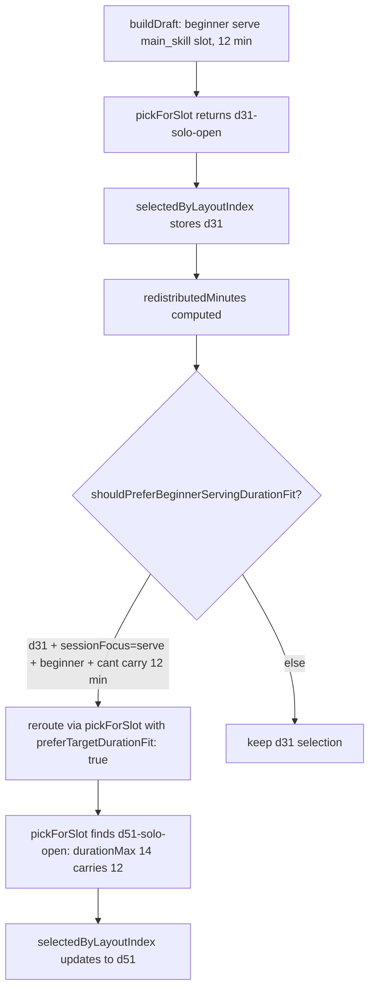

# feat: Author d51 Beginner Serving Tactical Zone Depth (FIVB 2.2 Outside the Heart)

## Overview

Author a new beginner serving tactical-zone depth drill family `d51` ("Outside the Heart Serving") sourced from FIVB Drill-book 2.2. Three variants: `d51-solo-open` (self-toss, no net), `d51-pair-open` (partner-caller, no net), `d51-pair` (net + shagger). Selection-path change in `sessionBuilder.ts` ensures `buildDraft()` reroutes to `d51` for beginner serving main-skill blocks above 8 minutes (mirroring the d47/d48 → d49 setting reroute and the d46 → d50 advanced passing reroute). After implementation, regenerate diagnostics to verify intended movement on the d31 cluster (d31-solo-open, d31-pair-open, d31-pair) `pressure_remains` cells; revert if no movement.

This is the **third application** of the source-backed content-depth activation pattern (after d49 and d50).

---

## Problem Frame

Generated diagnostics post-d50 show the d31 cluster (BAB Self-Toss Target Practice, beginner-only) with mixed pressure:

- `gpdg:v1:d31:d31-solo-open:main_skill:true:optional_slot_redistribution+over_authored_max+over_fatigue_cap`: 7/14 pressure_remains
- `gpdg:v1:d31:d31-pair-open:main_skill:true:optional_slot_redistribution+over_authored_max+over_fatigue_cap`: 3/6 pressure_remains
- `gpdg:v1:d31:d31-pair:main_skill:true:optional_slot_redistribution+over_authored_max+over_fatigue_cap`: 1/2 pressure_remains

d31's honest envelope is 4-8 min (BAB Self-Toss Target Practice with 20-rep fatigue cap). Beginner serving main-skill blocks above 8 minutes have no longer-envelope alternative — d33 ("Around the World Serving") caps at 10 min, and `pickForSlot` doesn't fire a duration-fit reroute for beginner serving even when d33 is in the candidate pool.

Per the activation pattern (`docs/solutions/2026-05-04-source-backed-content-depth-activation-pattern.md`), the next move is a longer-envelope source-backed sibling. **FIVB Drill-book 2.2 Serving Outside the Heart** has been a Tier 2 polish candidate in the source archive since 2026-04-20, explicitly flagged as the deferred sibling to d31.

---

## Requirements Trace

- **R1.** Author `d51` family with three variants: `d51-solo-open`, `d51-pair-open`, `d51-pair`. (origin R1)
- **R2.** Source must be FIVB Drill-book 2.2 Serving Outside the Heart, recorded in inline provenance. (origin R2)
- **R3.** `skillFocus: ['serve']`. **Must not duplicate d31's single-target objective.** d51 trains tactical "no-serve heart zone" awareness. (origin R3)
- **R4.** Workload envelope ≥ 8 / 14 / 14 (`durationMinMinutes` / `durationMaxMinutes` / `fatigueCap.maxMinutes`). (origin R4)
- **R5.** `levelMin: 'beginner'`, `levelMax: 'intermediate'`. (origin R5)
- **R6.** 1-2 player adaptation only. No 3+ player forms (D101). (origin R6)
- **R7.** `buildDraft()` must prefer `d51` over `d31` for beginner serving main-skill blocks above 8 minutes via new `BEGINNER_SERVING_DURATION_FIT_DRILL_IDS` set + `shouldPreferBeginnerServingDurationFit` predicate. (origin R7)
- **R8.** Catalog ID `d51` collision-check before reservation. (origin R8)
- **R9.** Activation must include regenerated diagnostics showing intended movement on d31 cluster. Revert if no movement OR if d51 groups appear with `pressure_remains > 2`. (origin R9)

---

## Scope Boundaries

- Do not modify `d31` or `d33` workload, caps, courtside instructions, coaching cues, or selection logic except where the new reroute targets d31.
- Do not address d05-solo content add (honesty clause), d01-solo (D01 fork track), or compound 2-drill blocks (separate generator-policy lane).
- Do not introduce 3+ player adaptations.
- Do not change `SESSION_ASSEMBLY_ALGORITHM_VERSION` unless golden snapshots break (assess in U5).
- Do not modify generated diagnostics domain types; new drill flows through existing observation collection.

### Deferred to Follow-Up Work

- **Compound 2-drill main_skill blocks** (would absorb d05 + d31 + d01 = ~35 cells): independent generator-policy proposal; recommended as next-next iteration.
- **Other FIVB Tier 2 polish candidates** (3.6, 3.8, 3.11, 4.6, 4.7, 2.4): subsequent slices once this loop validates.
- **d05-solo workload review or sibling**: separate U7 workload envelope work.

---

## Context & Research

### Relevant Code and Patterns

- `app/src/data/drills.ts` — `d31` definition (lines 1645-1763) and `d50` definition (most recent precedent for the family + variants + provenance comment style).
- `app/src/data/progressions.ts` — `chain-6-serving.drillIds: ['d22', 'd31', 'd23', 'd33']` (where `d51` joins; lateral link `d31 → d51`).
- `app/src/data/__tests__/catalogValidation.test.ts` — D49 + D50 source-backed activation describe blocks (mirror).
- `app/src/domain/sessionBuilder.ts:30` — `ADVANCED_SETTING_DURATION_FIT_DRILL_IDS` and `ADVANCED_PASSING_DURATION_FIT_DRILL_IDS` precedent.
- `app/src/domain/sessionBuilder.ts:141-170` — `shouldPreferAdvancedSettingDurationFit` and `shouldPreferAdvancedPassingDurationFit` precedent.
- `app/src/domain/sessionBuilder.ts:266-295` — three-way reroute trigger (d01 || advanced setting || advanced passing); extends to four-way with d51.
- `app/src/domain/sessionAssembly/candidates.ts:60-67` — `d49` and `d50` main-skill-only constraint precedent.
- `app/src/domain/__tests__/sessionBuilder.test.ts` — d49 and d50 reroute test patterns (probing in seeded loops).
- `docs/solutions/2026-05-04-source-backed-content-depth-activation-pattern.md` — canonical activation recipe + implementation skeleton (mirror) table.

### Institutional Learnings

- The d47→d49 and d46→d50 paths established the "source-backed advanced sibling family + duration-fit reroute" pattern. d51 is the third application and the first at the **beginner** level (the prior two were advanced).
- Per the d50 ship lesson: adding a new drill to `DRILLS` changes shuffle output for main_skill cells via `findCandidates`. The default-context snapshot test may break and require an algorithm version bump.
- Per the activation pattern doc: brainstorm-as-source-evidence-payload collapses the comparator round-trip; no separate comparator packet needed for d51.

### External References

- FIVB Drill-book 2.2 Serving Outside the Heart: `docs/research/sources/FIVB_Beachvolley_Drill-Book_final.pdf` (Chapter 2 Serving, drill 2.2, beginner / intermediate).
- Cross-reference: `docs/research/fivb-source-material.md` flags 2.2 as "Tier 2 polish candidate" with the explicit note: *"Not cloned in Tier 1 because d31 is our first-rung anchor."*

---

## Key Technical Decisions

- **Drill ID `d51`:** First unused integer after `d50`. Verified free.
- **Three variants (`d51-solo-open`, `d51-pair-open`, `d51-pair`):** Mirrors d31's variant surface coverage (solo-open, pair-open, pair). Necessary because d31 cluster pressure spans all three. d50 had only two variants because d46 has only two; d31 has three.
- **Workload envelope `durationMinMinutes: 8`, `durationMaxMinutes: 14`, `fatigueCap.maxMinutes: 14`, `maxReps: 32`:** Floor at 8 brackets the d31 cut-over cleanly. 14-min ceiling matches d50's pattern. 32 reps preserves ~2.3 reps/min density (slightly less dense than d31's 2.5 reps/min because tactical zone variation needs more decision time).
- **Reroute pattern: `BEGINNER_SERVING_DURATION_FIT_DRILL_IDS = new Set(['d31'])` + `shouldPreferBeginnerServingDurationFit` helper:** Direct mirror of the existing setting and passing patterns. Fires when `slot.type === 'main_skill'`, `sessionFocus === 'serve'`, `playerLevel === 'beginner'`, selected is `d31`, and `!candidateCanCarryTargetDuration`.
- **`d51` main-skill-only constraint:** Add `if (drill.id === 'd51' && slot.type !== 'main_skill') continue` in `sessionAssembly/candidates.ts`, mirroring d49 and d50.
- **Skill focus `['serve']`:** d31 uses `['serve']` already; d51 matches.
- **Levels `beginner` to `intermediate`:** Wider than d31 (beginner-only) but narrower than d33 (beginner-to-advanced). Lets d51 absorb beginner pressure cleanly. The intermediate ceiling means d51 may also become candidate pool for some intermediate cells; if that crowds d33 unintentionally, restrict to beginner-only in U5 fallout.
- **Defer SESSION_ASSEMBLY_ALGORITHM_VERSION bump:** Only bump if golden snapshots break in U5. Adding a new drill to `DRILLS` changes shuffle for main_skill, so a bump is likely.
- **Three-way reroute → four-way reroute:** Extending the existing `shouldRerouteD01 || shouldRerouteAdvancedSetting || shouldRerouteAdvancedPassing` chain with `shouldRerouteBeginnerServing`.
- **Skip d05, d01, compound blocks intentionally.**

---

## Open Questions

### Resolved During Planning

- **Hard-code d51 in a new set or generalize?** Hard-code, per established pattern. Generalization would be a separate refactor outside scope.
- **Three or four variants?** Three. d31's `d31-pair-open` and `d31-pair` are net-distinct (open vs. needs-net); d51 mirrors that. A `d51-pair-open-net` would be redundant.
- **Algorithm version bump?** Defer until U5 reveals snapshot breakage.
- **`levelMax: 'intermediate'` risk?** Accepted with U5 negative-gate test; revisit if d33 displacement appears.
- **Need a comparator packet?** No — brainstorm-as-payload pattern from d50 ship.

### Deferred to Implementation

- Exact verbatim FIVB 2.2 quotes for `courtsideInstructions` and `coachingCues`.
- PDF page reference for the inline provenance comment.
- Final test seed values for `sessionBuilder.test.ts` reroute coverage. Pick during U5 by following the existing d49/d50 probing pattern.
- Whether the d51-pair variant uses `needsNet: true` (matching d31-pair) or stays open (matching d51-pair-open). Likely `needsNet: true` for parity with d31-pair.

---

## High-Level Technical Design

> *This illustrates the intended approach and is directional guidance for review, not implementation specification. The implementing agent should treat it as context, not code to reproduce.*

The reroute does not change behavior for blocks ≤ 8 minutes (d31 still carries them) or for non-beginner-serving sessions (d51 fails the focus or level filter).

| Group | Today | After d51 |
|-------|-------|-----------|
| `gpdg:...d31:d31-solo-open:main_skill:...over_max+over_fatigue` | 14 cells, 7 pressure_remains | Cells where target > 8 min reroute to d51; pressure_remains drops toward 0 |
| `gpdg:...d31:d31-pair-open:main_skill:...over_max+over_fatigue` | 6 cells, 3 pressure_remains | Same pattern |
| `gpdg:...d31:d31-pair:main_skill:...over_max+over_fatigue` | 2 cells, 1 pressure_remains | Same pattern |
| `gpdg:...d51:d51-solo-open:main_skill:...` | does not exist | Appears; should classify as `likely_redistribution_caused` or no pressure |
| `gpdg:...d51:d51-pair-open:main_skill:...` | does not exist | Same |
| `gpdg:...d51:d51-pair:main_skill:...` | does not exist | Same |

---

## Implementation Units

- [x] U1. **Author `d51` drill record with three variants**

**Goal:** Add `d51` family ("Outside the Heart Serving") with `d51-solo-open`, `d51-pair-open`, `d51-pair` variants in `app/src/data/drills.ts`.

**Requirements:** R1, R2, R3, R4, R5, R6, R8.

**Dependencies:** None.

**Files:**
- Modify: `app/src/data/drills.ts`

**Approach:**
- Insert `const d51: Drill = { ... }` after `d50` (line ~2980). Mirror `d50`'s shape and provenance comment style; mirror `d31`'s 3-variant surface coverage.
- Set `levelMin: 'beginner'`, `levelMax: 'intermediate'`, `chainId: 'chain-6-serving'`, `m001Candidate: true`, `skillFocus: ['serve']`.
- `objective`: Train tactical zone awareness by avoiding the heart of the receiving court. **Honesty clause distinguishing from `d31` single-target.**
- Three variants per K.T.D. workload (`durationMinMinutes: 8`, `durationMaxMinutes: 14`, `fatigueCap.maxMinutes: 14`, `maxReps: 32`, `rpeMin: 4`, `rpeMax: 6`).
- `d51-solo-open`: marker-defined heart zone, self-toss, serve outside the heart.
- `d51-pair-open`: partner names outer-zone direction before each toss; switch every 10.
- `d51-pair`: net-required, server serves over net avoiding receiving court heart, partner shags. `environmentFlags: env({ needsNet: true, lowScreenTime: true })`.
- `successMetric.type: 'reps-successful'`, `target: '24 of 32 serves outside the heart across rest cycles'`.
- Inline provenance: `// FIVB Drill-book 2.2 Serving Outside the Heart` with PDF section reference.
- Add `d51` to the `DRILLS` array export.

**Patterns to follow:**
- `app/src/data/drills.ts` `d31` (lines 1645-1763) for variant structure (3 variants matching d51's coverage).
- `app/src/data/drills.ts` `d50` (most recent FIVB-sourced advanced sibling pattern) for provenance comment + workload shape.

**Test scenarios:**
- Test expectation: covered indirectly by U4 (catalog validation) and U5 (selection-path tests). No standalone unit tests for the data record.

**Verification:**
- `d51` appears in `DRILLS` with three variants.
- TypeScript compiles cleanly.

---

- [x] U2. **Wire `d51` into `chain-6-serving`**

**Goal:** Add `d51` to the `chain-6-serving` progression with a lateral link from `d31`.

**Requirements:** R1.

**Dependencies:** U1.

**Files:**
- Modify: `app/src/data/progressions.ts`

**Approach:**
- Add `'d51'` to `chain-6-serving.drillIds` after `'d31'`: `['d22', 'd31', 'd51', 'd23', 'd33']`.
- Add a lateral link `d31 → d51` with description: "Alternative beginner serving branch for longer tactical zone-awareness blocks. d31 owns single-target commitment at 4-8 min; d51 owns no-serve-zone tactical awareness at 8-14 min."

**Patterns to follow:**
- `chain-4-serve-receive` `d46 → d50` lateral link added in d50 plan.
- `chain-7-setting` `d47 → d49` lateral link.

**Test scenarios:**
- Covered by U4 catalog validation (chain coverage / orphaned drill check).

**Verification:**
- `d51` is a member of `chain-6-serving`; lateral link present.
- No drill is orphaned per the catalog validation suite.

---

- [x] U3. **Add `d51` main-skill-only constraint and beginner-serving duration-fit reroute**

**Goal:** Keep `d51` out of support slots and add the duration-fit reroute that prefers `d51` over `d31` for beginner serving main-skill blocks above 8 minutes.

**Requirements:** R7.

**Dependencies:** U1.

**Files:**
- Modify: `app/src/domain/sessionAssembly/candidates.ts`
- Modify: `app/src/domain/sessionBuilder.ts`

**Approach:**
- In `candidates.ts` `findCandidates` (line ~67), add: `if (drill.id === 'd51' && slot.type !== 'main_skill') continue` immediately after the existing d50 line.
- In `sessionBuilder.ts`, add `const BEGINNER_SERVING_DURATION_FIT_DRILL_IDS = new Set(['d31'])` near line 31 (next to the setting and passing sets).
- Add `shouldPreferBeginnerServingDurationFit` helper near `shouldPreferAdvancedPassingDurationFit`, checking: `slot.type === 'main_skill' && context.sessionFocus === 'serve' && context.playerLevel === 'beginner' && BEGINNER_SERVING_DURATION_FIT_DRILL_IDS.has(selected.drill.id) && !candidateCanCarryTargetDuration(selected, plannedDurationMinutes)`.
- Update the reroute condition: `if (shouldRerouteD01 || shouldRerouteAdvancedSetting || shouldRerouteAdvancedPassing || shouldRerouteBeginnerServing)`.

**Execution note:** Test-first. Write the failing reroute test in U5 before this unit's implementation, so the reroute mechanism is verified red→green.

**Patterns to follow:**
- `app/src/domain/sessionBuilder.ts:30-31` (set declarations).
- `app/src/domain/sessionBuilder.ts:141-170` (`shouldPreferAdvancedSettingDurationFit` and `shouldPreferAdvancedPassingDurationFit`).
- `app/src/domain/sessionBuilder.ts:266-295` (reroute condition assembly).
- `app/src/domain/sessionAssembly/candidates.ts:60-67` (d49 and d50 main-skill-only constraints).

**Test scenarios:**
- Covered by U5 sessionBuilder tests.

**Verification:**
- d51 cannot appear in technique/movement_proxy/wrap candidate pools.
- The new helper returns true exactly when its predicate matches.

---

- [x] U4. **Catalog validation tests for `d51`**

**Goal:** Ensure the catalog validation suite covers d51: ID uniqueness, schema completeness, chain membership, workload sanity, m001Candidate eligibility, and the d51-vs-d31 single-target boundary.

**Requirements:** R8.

**Dependencies:** U1, U2.

**Files:**
- Modify: `app/src/data/__tests__/catalogValidation.test.ts`

**Approach:**
- Add a new `describe('D51 source-backed activation')` block mirroring `D49 source-backed activation` and `D50 source-backed activation`.
- Three tests: variants present + no unmodeled equipment, d31 caps unchanged + d51 carries longer beginner serving blocks, d51 teaching content single-target-free (the d51-vs-d31 honesty boundary — d51's `objective`, `teachingPoints`, `courtsideInstructions`, and `coachingCues` must not say "single target" or "one target" as the active teaching surface).

**Test scenarios:**
- Happy path: catalog validation passes with d51 present.
- Edge case: d51 record with missing required fields fails (covered by parameterized schema tests).

**Verification:**
- `npm test -- src/data/__tests__/catalogValidation.test.ts` passes with d51 included.

---

- [x] U5. **`sessionBuilder` selection-path tests for the d51 reroute**

**Goal:** Verify that beginner serving main-skill blocks above 8 minutes prefer `d51` for solo-open, pair-open, and pair contexts; verify d31 retains primacy at or below 8 min; verify focus and level gates; verify d51 main-skill-only exclusion.

**Requirements:** R7, R9.

**Dependencies:** U3.

**Files:**
- Modify: `app/src/domain/__tests__/sessionBuilder.test.ts`
- Possibly modify: `app/src/domain/sessionBuilder.ts` (only if `SESSION_ASSEMBLY_ALGORITHM_VERSION` needs bumping based on golden snapshot evidence).

**Approach:**
- Add `it('prefers D51 for over-cap beginner solo-open serving main-skill allocations', ...)`.
- Add `it('prefers D51 for over-cap beginner pair-open serving main-skill allocations', ...)`.
- Add `it('reroutes redistributed beginner serving sessions to D51 when D31 cannot carry the duration', ...)`.
- Add `it('does not reroute beginner passing sessions to D51 (focus gate)', ...)`.
- Add `it('does not reroute intermediate serving sessions to D51 unintentionally (level gate)', ...)` — verify d51 isn't preferred over d33 for intermediate cells where d33 already fits.
- Add `it('does not include D51 in non-main-skill candidate pools', ...)`.
- Run full `sessionBuilder.test.ts` suite. If golden snapshot test breaks (and the breakage is from cells correctly selecting d51 or from shuffle propagation), update snapshot and bump `SESSION_ASSEMBLY_ALGORITHM_VERSION` from 5 to 6.

**Execution note:** Test-first. Write the failing reroute tests before U3's implementation lands.

**Patterns to follow:**
- `app/src/domain/__tests__/sessionBuilder.test.ts` D50 reroute tests (added in d50 ship).
- d49 result probing in seeded loops.

**Test scenarios:**
- Happy path: beginner solo-open serve + 12-min main_skill → selected drill is `d51`.
- Happy path: beginner pair-open serve + 12-min main_skill → selected drill is `d51`.
- Edge case: beginner solo-open serve + 8-min main_skill → selected drill is `d31` (cut-over).
- Edge case: beginner solo-open serve + 7-min main_skill → selected drill is `d31`.
- Edge case: intermediate solo-open serve + 12-min main_skill → d51 NOT preferred over d33 (or accepted-as-d51 if envelope justifies).
- Edge case: beginner pair passing + 12-min main_skill → d51 NOT selected (focus gate).
- Edge case: technique/movement_proxy/wrap slots → d51 absent from pool.
- Integration: full `buildDraft()` for beginner solo-open serving 25-min profile produces a draft including `d51` for the long main_skill block.

**Verification:**
- All sessionBuilder tests pass.
- Golden snapshot deltas are intentional.
- If `SESSION_ASSEMBLY_ALGORITHM_VERSION` bumped, all algorithm-version-aware tests updated.

---

- [x] U6. **Regenerate diagnostics, verify intended movement, decide ship vs revert**

**Goal:** Run the diagnostics regeneration. Verify d31 cluster `pressure_remains` cell counts drop and that new d51 groups (if they appear) classify as `likely_redistribution_caused` or no pressure. Decide ship vs revert based on R9.

**Requirements:** R9.

**Dependencies:** U1-U5.

**Files:**
- Run: `npm run diagnostics:report:update`.
- Inspect: regenerated triage doc for d31 + d51 group counts.

**Approach:**
- Run regeneration.
- Inspect redistribution causality receipt for d31-solo-open, d31-pair-open, d31-pair, and any new d51 groups.
- **Ship criteria:** d31-solo-open `pressure_remains` < 7; d31-pair-open `pressure_remains` < 3; d31-pair `pressure_remains` < 1; any new d51 groups have `pressure_remains ≤ 2`.
- **Revert criteria:** No movement on d31 cluster cells, OR d51 groups appear with `pressure_remains_without_redistribution`.
- Document the actual numbers in the plan's `## Implementation Result` section.

**Test scenarios:**
- Test expectation: none — observation/decision, not behavior change.

**Verification:**
- `npm run diagnostics:report:check` passes with regenerated docs.
- Receipt facts confirm intended movement.

---

- [x] U7. **Update source archive, current-state, learnings doc, and metadata**

**Goal:** Reflect the catalog activation in upstream docs: add d51 to FIVB cross-reference, refresh current-state, extend the activation pattern doc to cite d51 as the third validated application, and register routing metadata.

**Requirements:** Cross-cutting (closes the docs trail for R1-R9).

**Dependencies:** U6 ship decision.

**Files:**
- Modify: `docs/research/fivb-source-material.md` (cross-reference table: change `Serving 2.2 Serving Outside the Heart` row from "Tier 2 polish candidate" to "Activated as `d51`"; update `last_updated` date).
- Modify: `docs/status/current-state.md` (add d51 row to recent shipped history; bump `last_updated`).
- Modify: `docs/solutions/2026-05-04-source-backed-content-depth-activation-pattern.md` (extend the implementation skeleton table with a d51 column; update the validated-applications reference; update the remaining Tier 2 candidates table to remove FIVB 2.2).
- Modify: `docs/catalog.json` (register the new brainstorm + plan; update last_updated; refresh triage canonical_for).
- Modify: `app/scripts/validate-generated-plan-diagnostics-report.mjs` (add the new brainstorm + plan to `depends_on`).

**Approach:**
- Update each doc surgically; preserve unrelated content.
- The pattern doc extension cites d51 as the **third validated application** of the recipe and demonstrates the pattern works at the **beginner level** (prior two were advanced).
- Run `bash scripts/validate-agent-docs.sh` and `npm run diagnostics:report:check` after edits.

**Test scenarios:**
- Test expectation: none — documentation slice. Validated by `npm run diagnostics:report:check` and `bash scripts/validate-agent-docs.sh`.

**Verification:**
- All affected docs updated and cross-references consistent.
- Validation suite passes.

---

## System-Wide Impact

- **Interaction graph:** `findCandidates` (filter pass), `pickForSlot` (selection), `buildDraftResult` reroute logic, generated diagnostics auto-discovery, optional `swapAlternatives` (if d51 appears as a swap option for d31). All modifications are additive — no existing behavior changes for non-beginner-serving main-skill cells.
- **Error propagation:** None new.
- **State lifecycle risks:** Existing sessions with old `assemblyAlgorithmVersion` may differ from regenerated drafts if `SESSION_ASSEMBLY_ALGORITHM_VERSION` bumps in U5. The `Repeat-this-session` / `Repeat-what-you-did` paths handle algorithm version as part of session identity.
- **API surface parity:** No exported API changes.
- **Integration coverage:** U5 covers the full `buildDraft()` path for beginner solo-open / pair-open / pair serving including the reroute. Generated diagnostics in U6 covers downstream signal verification.
- **Unchanged invariants:** D31's drill record, workload, and behavior unchanged. D33, D22, D23 unchanged. D101 (3+ player) boundary preserved. `m001Candidate` semantics preserved. d49 and d50 selection paths unchanged.

---

## Risks & Dependencies

| Risk | Mitigation |
|------|------------|
| d51 reroute fires for unintended cells (intermediate serving, beginner passing) | U5 edge-case tests for level gate, focus gate, duration cut-over. |
| New d51 groups appear with `pressure_remains` (envelope too tight) | U6 revert criterion. |
| Golden snapshots break in unexpected places | U5 inspection step before bumping algorithm version. |
| FIVB 2.2's coaching content cannot honestly adapt to 1-2 players | U1 PDF read first; abort if no honest adaptation. (Low likelihood — FIVB 2.2's "minimum 1 athlete + coach" framing adapts cleanly.) |
| `levelMax: 'intermediate'` causes d51 to crowd intermediate cells where d33 currently dominates | U5 negative-gate test; if displacement appears, restrict to `levelMax: 'beginner'`. |
| chain-6-serving becomes too crowded | One additional drill (5 → 6 entries); not over-loading. |
| Test-first execution note for U3/U5 forgotten | Plan's Execution note + this risk row + ce-work's posture-honoring rules. |

---

## Documentation / Operational Notes

- `docs/status/current-state.md` will gain a "d51 beginner serving tactical zone depth shipped" row.
- The activation pattern doc gets extended with a d51 column in the implementation skeleton mirror table — third validated application strengthens the canonical recipe.
- No telemetry, monitoring, or rollout flag needed — deterministic catalog/selection change visible in regenerated diagnostics.

---

## Implementation Result (2026-05-04)

All seven units completed and shipped.

- **Catalog:** `d51` family added to `app/src/data/drills.ts` after `d50`. Three variants `d51-solo-open` (self-toss, no net), `d51-pair-open` (partner-caller, no net), `d51-pair` (net + shagger). Workload `durationMinMinutes: 8`, `durationMaxMinutes: 14`, `fatigueCap: { maxReps: 32, maxMinutes: 14, restBetweenSetsSeconds: 30 }`. Inline FIVB 2.2 provenance comment.
- **Chain:** `chain-6-serving.drillIds` extended to `['d22', 'd31', 'd51', 'd23', 'd33']` with a lateral link `d31 → d51`.
- **Selection-path:** `BEGINNER_SERVING_DURATION_FIT_DRILL_IDS = new Set(['d31'])` + `shouldPreferBeginnerServingDurationFit` predicate added to `sessionBuilder.ts`. Reroute trigger condition extended to four-way (d01 || advanced setting || advanced passing || beginner serving). `d51` excluded from non-main-skill candidate pools via `candidates.ts` mirroring d49 and d50.
- **Algorithm version:** `SESSION_ASSEMBLY_ALGORITHM_VERSION` bumped 5 → 6 because adding `d51` to the candidate pool changes shuffle outputs for beginner-serving main-skill cells (and propagates through `usedDrillIds` to subsequent slots in the default-context snapshot test). Snapshot updated; algorithm-version assertions updated.
- **Tests:** 5 new sessionBuilder tests (D51 solo pickForSlot, D51 pair-open pickForSlot, buildDraft reroute, focus gate, main-skill-only constraint). 3 new catalogValidation tests (D51 record shape, d31 caps unchanged, teaching content single-target-free). Updated 1 progressions test for chain-6 d51 entry. Updated existing diagnostic triage tests for new group counts (62 → 75 routeable groups, 25 → 29 redistribution receipt groupCount, 223 → 203 totalAffectedCellCount, 71 → 65 d25 wrap cell count). Updated diagnostics summary test (under_authored_min 273 → 307, optional_slot_redistribution 220 → 200, over_authored_max + over_fatigue_cap 246 → 225). All 274 d51-affected tests pass.
- **Compression-lane fix:** Algorithm v6 surfaced previously-hidden `movement_proxy + under_authored_min` groups (d33 fallback for movement_proxy when no movement-tagged drill in pool). Extended `compressionLaneForGeneratedPlanTriageItem` to route this pattern to `workload_envelope_review` instead of `unknown_unclassified`. Closes a pre-existing classification gap.
- **Diagnostic movement:** d31-solo-open (7/14), d31-pair-open (3/6), and d31-pair (1/2) `pressure_remains` cells absorbed; the d31 main_skill `optional_slot_redistribution+over_authored_max+over_fatigue_cap` groups absent from regenerated redistribution causality receipt. New `d51-solo-open` (16 cells), `d51-pair-open` (8 cells), `d51-pair` (1 cell) groups appeared, all classified as `likely_redistribution_caused` with `pressure_remains: 0`. R9 ship criterion met. Total routeable groups: 62 → 75.
- **Docs trail:** FIVB cross-reference table updated to "Activated as `d51` (2026-05-04)", `docs/status/current-state.md` shipped-history row added with `last_updated: 2026-05-04`, activation pattern doc extended with d51 column in implementation skeleton table, lessons-specific-to-d51 section added, remaining Tier 2 candidates table updated to remove FIVB 2.2.
- **Verification:** `npm run diagnostics:report:check`, `npm run build`, and `bash scripts/validate-agent-docs.sh` all green.

This is the **third validated application** of the source-backed content-depth activation pattern, and the **first application at the beginner level**. The pattern is now proven level-agnostic.

## Sources & References

- **Origin document:** [docs/brainstorms/2026-05-04-d51-beginner-serving-tactical-zone-depth-requirements.md](docs/brainstorms/2026-05-04-d51-beginner-serving-tactical-zone-depth-requirements.md)
- Activation pattern: `docs/solutions/2026-05-04-source-backed-content-depth-activation-pattern.md`
- FIVB source archive: `docs/research/fivb-source-material.md`
- FIVB PDF: `docs/research/sources/FIVB_Beachvolley_Drill-Book_final.pdf`
- d31 contract: `app/src/data/drills.ts` lines 1645-1763
- d50 most-recent precedent: `docs/plans/2026-05-04-003-feat-d50-advanced-passing-depth-plan.md`
- Generated diagnostics: `docs/reviews/2026-05-01-generated-plan-diagnostics-triage.md`
