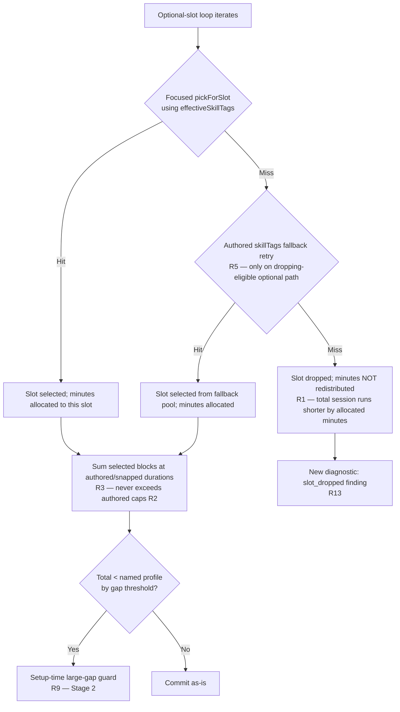

# feat: Session Duration Honesty

## Summary

Two-stage implementation of the duration-honesty slice: Stage 1 lands engine truncation, optional-slot pass fallback, source-backed reroute intent re-validation, and the diagnostic surface replacement behind an algorithm version bump (`v7 → v8`); Stage 2 adds the Setup-time real-duration display and large-gap guard. Engine ships first and kills the live 24-min serve drill bug independently of the UI half.

---

## Resolved User Decisions

Both ce-doc-review decisions from 2026-05-25 are now resolved (locked in 2026-05-25 by the founder). ce-work executes against the chosen direction below; the original three-option / two-option menus are preserved here for traceability.

### PD-1 (RESOLVED 2026-05-25): Source-backed reroute disposition → (A) Re-wire reroute on base allocation

**Background:** R1 removes the `redistributedMinutes` path. The `shouldRerouteForSourceBackedSibling` call site in `sessionBuilder.ts` is gated by `redistributionIndex !== undefined`, which under R1 is permanently undefined. Consequence: all 4 `SOURCE_BACKED_REROUTES` entries (`d01-duration-fit`, `d47-d48-to-d49`, `d46-to-d50`, `d31-to-d51`) become dormant code paths. U3's "characterize the post-slice trigger condition" approach is impossible-by-construction because the trigger no longer fires.

A real consequence under R1 alone: a drill like `d01` (5-min envelope) selected for a 10-min `main_skill` slot would run the slot's authored 10 min without being rerouted to a longer-envelope sibling. R1 removed both the surplus AND the over-envelope protection mechanism.

**Resolved direction:** (A) Re-wire reroute to fire on base-allocation-over-envelope. The trigger is decoupled from the dead `redistributionIndex !== undefined` gate and instead evaluated for each main_skill slot post-selection: if `!candidateCanCarryTargetDuration(selected, durations[i])` AND `shouldRerouteForSourceBackedSibling` returns true for the registry entry, re-pick using `preferTargetDurationFit: true`. Honors R11/R12 literal intent and prevents the new short-envelope-on-long-slot dishonesty R1 alone would introduce. Below: original three-option menu retained for traceability.

**Original decision menu (now resolved):**

- **(A) Re-wire reroute to fire on base allocation over envelope.** Detangle the reroute trigger from the redistribution code path. New trigger: if `!candidateCanCarryTargetDuration(selected, durations[i])` for a main_skill slot, evaluate `shouldRerouteForSourceBackedSibling` and re-pick if the registry matches. Preserves R11/R12's literal intent ("re-validate intent under honest durations"). Adds code change to U3 beyond characterization. **Recommended** — honors the brainstorm's stated R11/R12 intent and prevents the new short-envelope-on-long-slot dishonesty R1 alone would introduce.
- **(B) Accept reroute retirement.** Remove the dead code path entirely; document that source-backed reroutes are no longer dynamic; d49/d50/d51 remain in the catalog as content reachable via normal candidate selection but not preferentially routed-to. The new short-envelope-on-long-slot dishonesty becomes a known residual owned by the coverage brainstorm.
- **(C) Defer to a follow-up brainstorm.** Mark the entries as no-op in `sourceBackedReroutes.ts`, ship Stage 1 with the dormancy explicit, route the "ensure long-envelope drills get selected for long allocations" question to a fresh brainstorm. Smallest blast radius now; preserves the coverage-brainstorm sequencing.

**Affected units:** U3 (entire approach changes); U1 (Approach line about the reroute call site depends on the choice).

### PD-2 (RESOLVED 2026-05-25): U5 approach → (A) Build-on-completable

**Background:** Four reviewers (coherence, scope-guardian, design-lens, adversarial) converged on the U5 eager-build approach as carrying unaddressed scope drift, an implicit seed-stability requirement (two `buildDraft` calls in the same Setup session must produce byte-identical drafts), missing UX rationale for live-updating duration in a calm-by-default courtside register, and a Dexie-read-cost concern (N reads per Setup toggle).

**Resolved direction:** (A) Build-on-completable. Build the draft once Setup is completable (all required choices made — Players, Net, Time, Focus, optional Wall), display the assembled duration in the existing Setup chrome at that moment, persist on Build commit. Removes the seed-stability, ARIA live-region, and N-Dexie-reads-per-toggle concerns in one move; aligns with the founder calm-by-default preference; satisfies R7 and R10 literally. Below: original two-option menu retained for traceability.

**Original decision menu (now resolved):**

- **(A) Build-on-completable.** Build the draft once Setup is completable (all required choices made — Players, Net, Time, Focus, optional Wall), display the assembled duration in the existing Setup chrome at that moment, persist on Build commit. **Recommended** — removes the seed-stability concern (one build per commit), removes the ARIA live-region concern (number is static once shown), removes the N-Dexie-reads-per-toggle concern, aligns with the founder's calm-by-default preference. Satisfies R7 ("displays the real assembled total duration before commit") and R10 ("visible at the existing Setup commit moment") literally. Trade-off: loses the live-updating-as-you-toggle UX.
- **(B) Eager-build, fully specified.** Keep eager-build on every setup-state change but specify the previously-implicit contracts: seed is derived deterministically from `(focus, level, profile, archetype, session-day-key)` — not per-call random; debounce window pinned to a named threshold (e.g. 200ms); duration container carries `aria-live="polite"`; Dexie reads from `findLastCompletedDrillIdsByType` are cached per Setup mount; named UX justification ("the duration is the composed consequence of multiple inputs; seeing it shift on each toggle prevents the assemble-then-be-surprised loop the slice motivates"). Higher implementation surface; richer UX.

**Affected units:** U5 entirely (Approach + Test scenarios + Verification all change shape); U5 design-lens dependents (ARIA live-region for dynamic updates, duration-display states for async/null/zero-gap) dissolve if (A), persist with explicit treatment if (B).

---

## Problem Frame

Origin doc (see `docs/brainstorms/2026-05-24-session-duration-honesty-requirements.md`) captures the full motivation: the assembler today dumps the allocated minutes of dropped optional slots onto `main_skill` with no cap, producing 24-min drills on `serve + pair_net + 40` in 40 of 40 probe sessions; field reports on 2026-05-04 and 2026-05-10 named this courtside as "too many minutes for drills." Removing the dump alone exposes the underlying catalog-coverage gap as ~23-29 min serve sessions; honoring the slot's authored `skillTags` fallback on the dropping-eligible optional path lifts the same scenario to ~37 min / 6 honest blocks without authoring new content. The Setup surface then makes the residual gap visible at commit time so the user is not surprised mid-session.

---

## Requirements

Plan requirements trace 1:1 to origin doc R-IDs.

**Engine — Stage 1**

- R1. Remove the legacy `redistributedMinutes`-onto-`main_skill` path (see origin: R1).
- R2. `main_skill` block durations never exceed authored slot/variant maximums (see origin: R2).
- R3. Total assembled session duration equals the sum of selected blocks' authored/snapped durations (see origin: R3).
- R4. Assembly remains deterministic per seed (see origin: R4).
- R5. Optional-slot pass fallback: under named focus, when a dropping-eligible optional slot finds no candidate from its focused `skillTags`, retry candidate selection using the slot's authored `skillTags` fallback before dropping (see origin: R5).
- R6. Required slots gain no fallback behavior from this slice (see origin: R6).

**Setup-time honesty surface — Stage 2**

- R7. Setup displays the real assembled total duration before commit, derived from the same draft Run executes (see origin: R7).
- R8. Setup → Run uses the same draft / pinned seed; today's `buildDraft → saveDraft → Run reads persisted draft` flow already satisfies this and is verified in U5 (see origin: R8).
- R9. When the gap between named profile and assembled total crosses the threshold, surface a large-gap guard (see origin: R9).
- R10. Setup duration surface is visible at the existing commit moment, not behind a secondary disclosure (see origin: R10).

**Reroute re-validation — Stage 1 definition-of-done**

- R11. Re-validate the four `SOURCE_BACKED_REROUTES` entries (`d01-duration-fit`, `d47-d48-to-d49`, `d46-to-d50`, `d31-to-d51`) under honest durations: each must still fire for the right product reason or be named as a follow-up (see origin: R11).
- R12. Stage 1 does not ship without R11 closed (see origin: R12).

**Diagnostics surface and regen — Stage 1 definition-of-done**

- R13. Replace the `optional_slot_redistribution` finding with `slot_dropped` + `under_named_profile_duration` findings routing to a `coverage_gap_review` triage lane (see origin: R13).
- R14. `npm run diagnostics:report:check` passes at Stage 1 ship; report regen via `npm run diagnostics:report:update` is in the slice's definition-of-done (see origin: R14).
- R15. Algorithm version bumps `v7 → v8` (see origin: R15).

**No-op / preserved**

- R16. Snap mechanism (`snapWarmupWrapDurations`) is not modified (see origin: R16).

**Origin actors:** A1 Founder (and partner Seb) — end user of assembled session; A2 Agent implementer; A3 Generated-diagnostics workbench.

**Origin flows:** F1 Honest assembly under named focus (Stage 1); F2 Setup-time duration honesty (Stage 2); F3 Source-backed reroute intent re-validation (Stage 1 closeout).

**Origin acceptance examples:** AE1 (R1, R2, R3, R5 — ~37 min serve+fallback); AE2 (R1, R3, R5 — slot drops past fallback); AE3 (R2, R6 — required-slot reuse residual); AE4 (R7, R8 — displayed duration matches delivered); AE5 (R9 — large-gap guard); AE6 (R11, R12 — per-reroute intent log); AE7 (R14 — diagnostics:report:check passes).

---

## Scope Boundaries

Default single-list structure (origin is Standard-tier, not Deep-product).

- New serve / attack drills, repeat-drill policy, required-slot cross-focus fallback — owned by the coverage brainstorm; not authorized here.
- `ended_early` misclassification (`buildEndedSession` in `app/src/domain/executionState.ts`) and the F1 mid-session-extend surface from the 2026-05-22 capture — paired into a separate brainstorm next.
- Custom session durations (`D135` feature-wish).
- Modifications to `snapWarmupWrapDurations` or its cap-respecting freed-minutes redistribution.
- `app/src/domain/sessionAssembly/sourceBackedReroutes.ts` registry contents are not edited; R11 re-validation may surface findings that fold back into the D01 / d49-d51 brainstorms but does not consume them.
- Modifications to the candidate pool for swap alternatives, recovery sessions, or non-`main_skill` redistribution targets.
- Exact UI copy for the large-gap warning (sensible default in U6; final wording is a courtside-copy follow-up).

### Deferred to Follow-Up Work

- **Tightening the large-gap warning copy + threshold** if field use shows the 5-min default fires too often or too rarely: same-file polish PR after Stage 2 ships.
- **Required-slot duplicate-pick residual** (e.g., `technique` and `main_skill` resolving to the same serve drill via `allowUsedFallback: true`): origin Dependencies/Assumptions calls this out as owned by the coverage brainstorm; AE3 records it as a known residual, but no implementation fix lands here.

---

## Context & Research

### Relevant Code and Patterns

- `app/src/domain/sessionBuilder.ts:238-273, :289-328` — the uncapped `redistributedMinutes` path (R1, R2, R3) and the `selectedByLayoutIndex` write loop where snapped/redistributed durations land on blocks. R5's pass-fallback hook is the optional-slot loop at `:221`.
- `app/src/domain/sessionAssembly/effectiveFocus.ts` — `effectiveSkillTags(slotType, context, fallback)`; under named focus, returns `[context.sessionFocus]` and suppresses the slot's authored fallback. R5 is a policy refinement that bypasses this suppression **only** on the dropping-eligible optional path (not by modifying `effectiveSkillTags`).
- `app/src/domain/sessionAssembly/candidates.ts` — `pickForSlot` is the per-slot selection surface; `findCandidates` returns the filtered pool. R5 adds a retry call with the authored fallback `skillTags`.
- `app/src/data/archetypes.ts:96-133` — slot defs carrying authored `skillTags`: `technique: ['pass']`, `movement_proxy: ['pass']`, `main_skill: ['pass', 'serve']`, `pressure: ['pass', 'serve']`. The fallback tags the R5 retry will use.
- `app/src/domain/sessionAssembly/sourceBackedReroutes.ts` — the registry to re-validate (4 entries). `shouldRerouteForSourceBackedSibling` takes `plannedDurationMinutes`; under R1, this collapses to base allocation almost always.
- `app/src/domain/sessionAssembly/snapDurations.ts` — preserved unchanged per R16; comment at `sessionBuilder.ts:283-288` documents how snap and the legacy redistribution composed (legacy half is what R1 removes).
- `app/src/domain/generatedPlanDiagnostics.ts` — `optional_slot_redistribution` finding lives here; R13 replaces it.
- `app/src/domain/generatedPlanDiagnosticTriage.ts:742` — `optional_slot_redistribution` triage lane; updated alongside R13.
- `app/src/screens/SetupScreen.tsx:142-213` — `handleConfirm` already does `buildDraft → saveDraft → navigate(routes.safety())`. R7's duration display reads from the locally-built `draft` in this same flow; R8's "same draft" contract is satisfied by the existing persistence.
- `app/src/domain/sessionBuilder.test.ts:23-78` and many follow-on tests — fixed-seed golden tests asserting `assemblyAlgorithmVersion === 7` plus exact block shapes. R15's v8 bump touches every such test.
- `app/src/screens/__tests__/SetupScreen.test.tsx` — RTL pattern for Setup screen tests; the duration display + large-gap guard tests live here.

### Institutional Learnings

- `docs/solutions/2026-05-04-source-backed-content-depth-activation-pattern.md` — directly applicable. Item 5 ("Algorithm version bump if golden snapshots break") is the canonical pattern for U1; item 4 ("Selection-path change is part of the slice") frames R11/R12 re-validation.
- `docs/solutions/2026-05-10-drill-first-time-runnability-system.md` — informs the large-gap warning copy (when it lands as polish): one-cue, doer-POV, plain language.
- `.cursor/rules/data-access.mdc` — domain stays pure; engine work in `domain/` only. Setup UI work in `screens/` calling `services/session` for persistence (no direct Dexie).
- `.cursor/rules/testing.mdc` — domain-tier Vitest tests for U1–U4; component-tier RTL tests for U5/U6.
- `.cursor/rules/component-patterns.mdc` — UI primitives (`ChoiceSection`, `StatusMessage`, `Callout`) are the reuse target for the duration display; the existing `incompleteHint` pattern at `SetupScreen.tsx:131-138` is the model for the inline warning.

### External References

External research skipped per Phase 1.2 — codebase has strong local patterns for session assembly, fixed-seed testing, and diagnostic regen; recently touched (2026-05-13 snap fix); conventions codified in `.cursor/rules/`.

---

## Key Technical Decisions

- **Pass-fallback retry sits in `sessionBuilder`'s optional-slot loop, not in `effectiveSkillTags`.** `effectiveSkillTags`'s named-focus suppression is the right default behavior for the focused-pick path; refining the suppression itself would make every code path that calls it ambiguous about whether fallback is in play. Cleaner: optional-slot loop calls `pickForSlot` once with focused tags; if null, calls again with the slot's authored `skillTags`; only drops if both miss.
- **Algorithm version bump (v7 → v8) bundles with U1 in one commit.** Per the source-backed pattern's item 5: changing engine behavior without bumping the version means golden snapshots drift silently; bumping without the behavior change is meaningless. Same commit also regenerates affected snapshots so the version assertion stays load-bearing.
- **Two duration thresholds, two surfaces.** U4's `under_named_profile_duration` diagnostic finding fires at a 1-min engine-side threshold (agent-readable; surfaces small honest-duration gaps in the diagnostics workbench so the founder sees catalog-coverage signal early in the diagnostics report). U6's large-gap guard fires at a 5-min UI-side threshold (user-facing; courtside-readable; only surfaces when the gap is meaningful enough to warrant attention at commit). Keeping the two distinct keeps the diagnostics surface reactive to small gaps while the user-facing guard stays calm-by-default — both serve "be honest about session duration" at different audiences and reactivity registers.
- **R8 (seed-pinning) is a verification step inside U5, not its own unit.** Today's `SetupScreen.tsx:186` already builds-once and persists; Run consumes the persisted draft. U5 verifies this contract holds and only escalates to a code change if Run is found to re-build.
- **Two diagnostic findings, one triage lane.** `slot_dropped` (per-slot evidence: which focused selection failed) and `under_named_profile_duration` (per-session evidence: total assembled vs named) both route to `coverage_gap_review`. Splitting the findings keeps the agent-readable evidence shape sharp; collapsing the lane keeps the founder-readable triage surface simple.
- **Reroute re-validation is per-entry, not aggregate.** The 4 registry entries (`d01-duration-fit`, `d47-d48-to-d49`, `d46-to-d50`, `d31-to-d51`) each get an explicit intent-confirmation note in U3's verification log. A green test suite alone is not sufficient — the reroute must still fire for the right product reason.
- **Large-gap threshold defaults to 5 min with inline warning affordance** (no blocked commit, no alternative-profile nudge). Lowest-friction surface that still tells the truth; exact value/copy is a later polish opportunity.
- **No Run-screen code change planned.** R8 verification is read-only; if Run is found to re-build (it shouldn't be), U5 escalates and the plan needs a U7. Treat as expected steady state, plan-time risk if it surfaces.

---

## Open Questions

### Resolved During Planning

- **Pass-fallback retry call shape** (origin Deferred-to-Planning #1): retry in the optional-slot loop with an explicit `skillTags` override passed to `pickForSlot`, not by modifying `effectiveSkillTags`. Resolved per Key Technical Decisions above; ce-work owns exact API shape.
- **Where Setup draft gets built/pinned** (origin #2): already at `SetupScreen.tsx:186`; persisted via `saveDraft` immediately after. No new pre-commit step needed.
- **Threshold + affordance** (origin #3): 5-min threshold + inline warning above the Build button. Resolved per Key Technical Decisions; copy details deferred to ce-work and a follow-up courtside-copy polish PR.
- **Which reroutes shift** (origin #4): all four registry entries enumerated above; U3 produces per-entry intent log.
- **Diagnostic finding shape** (origin #5): two findings (`slot_dropped`, `under_named_profile_duration`) on one triage lane (`coverage_gap_review`); exact `gpdg:v1:...` fingerprint strings deferred to U4 implementation.
- **Golden-snapshot regen scope** (origin #6): every `sessionBuilder.test.ts` test asserting `assemblyAlgorithmVersion === 7`, plus the generated-plan diagnostics fixtures consumed by `diagnostics:report:check`. U1 enumerates before regenerating so unexpected breakage is flagged.

### Deferred to Implementation

- Exact filename / shape of the new diagnostic findings inside `app/src/domain/generatedPlanDiagnostics.ts` — depends on the existing finding-registry shape U4 reads.
- Whether the optional-slot loop's pass-fallback retry runs before or after the `selectedByLayoutIndex.set` write — implementation-time choice; should not affect determinism if the focused pick is null.
- Whether U3's per-reroute intent verification needs new tests or extends `sourceBackedReroutes.test.ts` — depends on what each existing test currently asserts. Characterization-first per the execution note.
- The list of fixed-seed golden tests in `sessionBuilder.test.ts` likely to change shape under R1 + R5 (vs just version-number changes): enumerate during U1 execution, accept all behavior-shape changes that match R1+R5 expectations, flag any others.

---

## High-Level Technical Design

> *This illustrates the intended slot-resolution flow after Stage 1 ships, plus the per-reroute re-validation matrix. Directional guidance for review, not implementation specification.*

### New optional-slot resolution flow (U1 + U2)

### Per-reroute intent re-validation matrix (U3)

| Registry entry | Pre-slice trigger | Post-slice trigger (honest durations) | Intent preserved? |
|---|---|---|---|
| `d01-duration-fit` | `d01` selected for any block where `plannedDuration = base + redistributedMinutes` > d01 cap | `d01` selected where `plannedDuration = base` > d01 cap | TBD by U3 — likely preserved (base alone exceeds d01 cap in the original failure scenarios) |
| `d47-d48-to-d49` | Advanced setting; redistributed planned duration over D47/D48 envelope | Advanced setting; base planned duration over D47/D48 envelope | TBD by U3 |
| `d46-to-d50` | Advanced passing; redistributed over D46 envelope | Advanced passing; base over D46 envelope | TBD by U3 |
| `d31-to-d51` | Beginner serving; redistributed over D31 envelope | Beginner serving; base over D31 envelope | TBD by U3 |

For each entry, U3 produces a one-line intent confirmation or named follow-up; "no longer fires at all" must be examined as a behavior change, not silently accepted.

---

## Implementation Units

### Stage 1 — Engine (ships first)

- U1. **Engine truncation + algorithm version bump**

**Goal:** Remove the uncapped `redistributedMinutes`-onto-`main_skill` path; bump `SESSION_ASSEMBLY_ALGORITHM_VERSION` from 7 to 8; regenerate affected golden snapshots so version assertions stay load-bearing.

**Requirements:** R1, R2, R3, R4, R15

**Dependencies:** None

**Files:**
- Modify: `app/src/domain/sessionBuilder.ts` (remove the redistribution path at `:238-273`, simplify block-write at `:289-328`)
- Modify: `app/src/domain/sessionBuilder.test.ts` (version assertion at `:34`; all fixed-seed golden shapes that change — enumerate during execution)
- Modify: any `app/src/domain/**/__tests__/*` containing a `toBe(7)` version assertion or a fixed-seed shape that shifts under R1
- Modify: `app/src/services/__tests__/*` and `app/src/screens/__tests__/*` test fixtures that pin assembled-draft shape or `assemblyAlgorithmVersion` (notably `services/__tests__/session.v0b.test.ts`, repeat-flow screens tests under `HomeScreen.repeat-*.test.tsx`) — enumerate via `grep -rn assemblyAlgorithmVersion app/src` during execution
- Modify: `app/e2e/**` Playwright specs that pin block-duration shapes or `assemblyAlgorithmVersion` (typically `session-flow.spec.ts`, `phase-c0-schema-v4.spec.ts`) — enumerate during execution
- Test: `app/src/domain/sessionBuilder.test.ts` extended with at least one new fixed-seed test covering `serve + pair_net + 40` honest-assembly behavior

**Approach:**
- First pass: write the new behavior tests (no `main_skill` over authored cap; total session length equals sum of selected blocks at snapped durations; deterministic per seed).
- Second pass: remove the entire dead code path R1 obsoletes — the `redistributedMinutes` computation, the `redistributionIndex` selection logic (the lookup that targets a main_skill slot for surplus), and the `+ redistributedMinutes` uplift in the block-write loop at `sessionBuilder.ts:315`. The `assemblyTrace.redistributedMinutes` field is preserved as `0` for trace-shape stability until U4 updates the trace contract. The source-backed reroute call site itself is governed by **PD-1** (see Pending User Decisions above); the second-pass removal scope here does not pre-decide that question.
- Third pass: bump `SESSION_ASSEMBLY_ALGORITHM_VERSION` to 8; run the test suite; for each broken golden test, verify the new shape matches R1 expectations and regenerate.
- The `assemblyTrace.redistributedMinutes` field is preserved as `0` (or removed) to keep the trace shape stable for `generatedPlanDiagnostics` until U4 updates it.

**Execution note:** Test-first — write the new behavior tests before removing the redistribution path. Characterization-first for the golden snapshots — confirm each broken assertion's new shape matches R1 intent before regenerating.

**Technical design:** *(see High-Level Technical Design flowchart above — covers U1 + U2 together)*

**Patterns to follow:**
- `docs/solutions/2026-05-04-source-backed-content-depth-activation-pattern.md` item 5 (algorithm version bump alongside golden snapshot regen).
- Existing fixed-seed test shape at `sessionBuilder.test.ts:23-78`.

**Test scenarios:**
- Happy path: Given `pair + net + 40 + Recommended` and any seed, when the draft is built, then total session duration equals the sum of selected blocks at their authored/snapped durations and no block exceeds its authored cap. Pins R1+R2+R3 on a focus-untouched path (Recommended does not engage `effectiveSkillTags` named-focus suppression, so AE1/AE2 conditions are not exercised here).
- Happy path: Given `pair + net + 40 + serve + beginner` and a seed that previously produced a 24-min `main_skill` block, when the draft is built, then `main_skill` does not exceed its authored cap; optional slots still drop and the session runs shorter. Establishes the pre-U2 baseline; AE1's full "6 blocks at ~37 min" outcome is U2's test scenario, not this one.
- Edge case: Given a seed where all optional slots successfully fill from the focused catalog, when the draft is built, then total session duration matches the named profile to within snap tolerance (snap mechanism preserved per R16).
- Edge case: Given a `pair + net + 15` Recommended session, when the draft is built, then no block duration regresses vs the pre-U1 baseline shape (golden test).
- Error/integration: Given a context that yields a null draft pre-U1 (e.g., assembly failure), when the draft is built post-U1, then the null path is unchanged.

**Verification:**
- New behavior tests pass.
- `assemblyAlgorithmVersion === 8` everywhere.
- All previously-asserted fixed-seed shapes either match unchanged or have been verified to shift in a way that matches R1+R2+R3.
- `npm run test` passes.

---

- U2. **Optional-slot pass fallback (effectiveSkillTags policy refinement)**

**Goal:** Under named focus, when a dropping-eligible optional slot finds no candidate from its focused `skillTags`, retry candidate selection using the slot's authored `skillTags` fallback before dropping. Lifts `serve + pair_net + 40` from ~23-29 min / 4 blocks to ~37 min / 6 blocks.

**Requirements:** R5, R6

**Dependencies:** U1

**Files:**
- Modify: `app/src/domain/sessionBuilder.ts` (optional-slot loop at `:221`; add the fallback retry after the first `selectSlot` returns null)
- Modify: `app/src/domain/sessionAssembly/candidates.ts` (extend `pickForSlot` options with an explicit-`skillTags`-override path, or expose a sibling function that bypasses `effectiveSkillTags`)
- Test: `app/src/domain/sessionBuilder.test.ts` extended with serve-focus + thin-catalog + fallback-recovers tests
- Test: `app/src/domain/sessionAssembly/__tests__/effectiveFocus.test.ts` extended to pin that `effectiveSkillTags` itself is unchanged (R5 is in `sessionBuilder`, not here)

**Approach:**
- Refine the optional-slot loop in `sessionBuilder.ts:221-229`: on `selectSlot` returning null, retry with the slot's authored `slot.skillTags` (the literal value from `archetypes.ts`, bypassing `effectiveSkillTags`'s named-focus suppression). Only fires on optional slots; required slots (loop at `:212`) unchanged per R6.
- The retry call uses the same `pickForSlot` infrastructure; the new option is a tag-override flag or a direct-tags argument. Determine exact shape during execution.
- Determinism (R4) preserved: the retry is a deterministic function of `(focused-pick-failed, slot.skillTags, usedDrillIds, seed)`.

**Execution note:** Test-first — write the serve+pair_net+40+fallback-recovers test before adding the retry path.

**Patterns to follow:**
- The existing focused-then-required two-pass shape at `sessionBuilder.ts:211-229` is the model: two iterations with different selection criteria.
- `archetypes.ts:111-114` comment explains why named-focus suppression exists; the U2 refinement narrows that policy without erasing it.

**Test scenarios:**
- Happy path: Given `serve + pair_net + 40 + beginner` and a seed where the focused-catalog can't fill `movement_proxy` and `pressure`, when the draft is built, then both slots fill via the authored `['pass']` / `['pass', 'serve']` fallback and the session is 6 blocks summing to ~37 min. **Covers AE1.**
- Happy path: Given `serve + pair_net + 40 + beginner` and a seed where the focused-catalog fills `pressure` but not `movement_proxy`, when the draft is built, then `pressure` keeps its serve selection and `movement_proxy` fills via the `['pass']` fallback.
- Edge case: Given a seed where the focused-catalog AND the authored fallback both fail to fill an optional slot, when the draft is built, then the slot is dropped (no further fallback chain), no minutes are redistributed (per U1), and the new `slot_dropped` finding surfaces (verified in U4). **Covers AE2.**
- Edge case: Given `pass + pair_net + 40` (focus matches the authored fallback), when the draft is built, then behavior is identical to pre-U2 (no fallback retry needed; first pick succeeds). Pin determinism.
- Required-slot residual: Given `serve + pair_net + 40 + beginner` and a thin focused catalog where required `technique` and `main_skill` resolve to the same drill via `allowUsedFallback: true`, when the draft is built, then both blocks land at their authored durations and the duplicate is recorded as a known residual (no R6 fallback fires). **Covers AE3.**
- Integration: Given the post-U2 engine and the source-backed reroute path, when a serve session triggers `d31-to-d51` reroute, then the reroute still fires on the correct base allocation (U3 closes the per-entry intent verification).

**Verification:**
- The 40-of-40 serve+pair_net+40 probe from the brainstorm now shows ≤ 10 min `main_skill` cap across all seeds, and the modal session shape is 6 blocks summing to ≥ 35 min.
- `effectiveSkillTags` test suite unchanged (R5 lives in the loop, not in this module).
- `npm run test` passes.

---

- U3. **Source-backed reroute intent re-validation**

**Goal:** Per PD-1 (A): re-wire the source-backed reroute trigger to fire on base-allocation-over-envelope (decoupled from the dead `redistributionIndex !== undefined` gate that R1 removes), and produce a per-entry intent-confirmation log for each of the 4 `SOURCE_BACKED_REROUTES` entries (`d01-duration-fit`, `d47-d48-to-d49`, `d46-to-d50`, `d31-to-d51`) under the new trigger.

**Requirements:** R11, R12

**Dependencies:** U1, U2

**Files:**
- Modify: `app/src/domain/sessionAssembly/__tests__/sourceBackedReroutes.test.ts` (characterize each entry's post-slice firing condition; new assertions that mirror the per-reroute matrix in High-Level Technical Design)
- No production code edits expected; if intent shifts materially for one entry, document and either bump that entry's metadata (in `sourceBackedReroutes.ts`) or open a follow-up.

**Approach (per PD-1 (A)):**
- **Code change in `sessionBuilder.ts`:** after the optional-slot loop completes (U1+U2 already removed the `redistributionIndex` block), evaluate each selected main_skill block: if `!candidateCanCarryTargetDuration(selected, durations[i])` AND `shouldRerouteForSourceBackedSibling(slot, effectiveContext, selected.pick, durations[i])` returns true, re-pick the slot via `pickForSlot` with `preferTargetDurationFit: true` and `targetDurationMinutes: durations[i]`, then replace the selection. The `plannedDurationMinutes` signal now equals the base allocation — no more inflated trigger.
- For each of the 4 registry entries, read the existing test(s) and identify what scenario triggers the reroute today (typically: `<from-drill>` selected for a slot whose `plannedDuration = base + redistributedMinutes` exceeds the from-drill envelope).
- Construct a post-slice equivalent scenario where `plannedDuration = base` already exceeds the from-drill envelope — the legitimate "base allocation needs a longer-envelope sibling" case.
- Assert each reroute fires in the post-slice scenario for the same product reason; assert it does NOT fire on a base allocation that fits.
- Produce the per-entry intent log (matrix above filled in) in the verification record before Stage 1 ships.

**Execution note:** Characterization-first — read the existing test assertions and capture their intent in a new test that survives R1 + R2 + R5 before changing anything.

**Patterns to follow:**
- `docs/solutions/2026-05-04-source-backed-content-depth-activation-pattern.md` (the precedent for reroute behavior under registry-driven activation).
- `sourceBackedReroutes.ts:102-117` comment about defensive byte-equivalence with the four helpers it replaced — the post-slice tests should preserve that disciplinary framing.

**Test scenarios:**
- For each registry entry: post-slice trigger scenario fires correctly; post-slice no-fire scenario stays no-fire. **Covers AE6** across all 4 entries.
- Edge case: D01 default-leaf entry — given the base allocation for a `pair_net + 40` pass main_skill is within d01 cap, when the draft is built, then `d01-duration-fit` does NOT fire (vs pre-slice where the inflated plannedDuration could have triggered it for the wrong reason).
- Integration: For each focus + level combination historically known to trigger a reroute (advanced setting, advanced passing, beginner serving), the post-slice draft for that combination still routes to the source-backed sibling on the legitimate over-envelope-base scenarios.

**Verification:**
- Per-entry intent log populated (each entry: ✓ intent preserved | ⚠ shifted but acceptable | × named follow-up).
- `sourceBackedReroutes.test.ts` passes.
- No entry quietly stops firing entirely without an explicit follow-up note.

---

- U4. **Diagnostic surface replacement + report regen**

**Goal:** Replace the `optional_slot_redistribution` finding with `slot_dropped` + `under_named_profile_duration` findings routing to a `coverage_gap_review` triage lane; regenerate the diagnostics report so `npm run diagnostics:report:check` passes.

**Requirements:** R13, R14

**Dependencies:** U1, U2

**Files:**
- Modify: `app/src/domain/generatedPlanDiagnostics.ts` (replace `optional_slot_redistribution` finding emission with `slot_dropped` + `under_named_profile_duration`)
- Modify: `app/src/domain/generatedPlanDiagnosticTriage.ts` (replace `optional_slot_redistribution` across all ~14 references — decision-debt lane at `:742`, D47/D05/D01/D49 stable group keys, conservative routing fallback, cell-count helpers, review fingerprint surface; enumerate via `grep -rn optional_slot_redistribution app/src` and verify completeness before `npm run diagnostics:report:update`)
- Modify: `app/src/domain/__tests__/generatedPlanDiagnostics.test.ts` (assert the two new findings; remove `optional_slot_redistribution` assertions)
- Modify: `app/src/domain/__tests__/generatedPlanDiagnosticTriage.test.ts` (assert the new triage lane)
- Regenerate (via `npm run diagnostics:report:update`): all generated-plan-diagnostics report fixtures

**Approach:**
- `slot_dropped` finding: per-slot evidence, fires when an optional slot in the assembled draft has no selected variant (i.e., the slot ID appears in `skippedOptionalLayoutIndexes` after U2's fallback retry).
- `under_named_profile_duration` finding: per-session evidence, fires when the assembled total duration < named profile by ≥ a finding-threshold (use 1 min as the diagnostic-grade threshold; distinct from the user-facing 5-min UI threshold in U6).
- Both findings carry the standard `gpdg:v1:...` fingerprint; both route to the new `coverage_gap_review` triage lane.
- Run `npm run diagnostics:report:update` to regenerate fixtures; verify `npm run diagnostics:report:check` passes.

**Execution note:** Test-first for the new finding shapes; mechanical for the report regen.

**Patterns to follow:**
- Existing finding emission shape in `generatedPlanDiagnostics.ts`.
- D139 report-check pattern: `npm run diagnostics:report:check` (gate) + `npm run diagnostics:report:update` (regen).

**Test scenarios:**
- Happy path: Given a draft assembled with all optional slots filled (focused or fallback), when diagnostics run, then `slot_dropped` does not fire and `under_named_profile_duration` does not fire.
- Happy path: Given a draft where one optional slot dropped past fallback, when diagnostics run, then `slot_dropped` fires for that slot exactly once and `under_named_profile_duration` fires for the session if its total < profile by ≥ 1 min. **Covers AE2 (diagnostic half).**
- Edge case: Given a draft where the session total equals the named profile exactly (e.g., Recommended), when diagnostics run, then `under_named_profile_duration` does not fire.
- Edge case: Given a draft where multiple optional slots dropped past fallback, when diagnostics run, then `slot_dropped` fires once per dropped slot.
- Integration: Given the regenerated fixtures, when `npm run diagnostics:report:check` runs, then the gate passes. **Covers AE7.**

**Verification:**
- The two new findings appear in `generatedPlanDiagnostics.ts` and are tested at the domain tier.
- `optional_slot_redistribution` is no longer emitted by `generatedPlanDiagnostics.ts` and no triage lane references it.
- `npm run diagnostics:report:check` passes.
- The D139 staleness flagged in the 2026-05-23 pulse report is cleared by this regen.

---

### Stage 2 — Setup-time honesty surface (ships second)

- U5. **Setup-time real-duration display (and build-once contract verification)**

**Goal:** Display the real assembled total duration to the user in Setup before commit, derived from the same draft Run will execute. Verify the existing `buildDraft → saveDraft → Run reads persisted draft` flow satisfies R8 (build-once / pinned seed).

**Requirements:** R7, R8, R10

**Dependencies:** U1, U2, U3, U4 (Stage 1 complete)

**Files:**
- Modify: `app/src/screens/SetupScreen.tsx` (compute the assembled total from the locally-built `draft` in `handleConfirm`, surface it visibly at the commit moment; minor refactor likely needed to make the duration available before navigation)
- Modify: `app/src/screens/__tests__/SetupScreen.test.tsx` (test that the duration display appears for completable contexts, matches the built draft's block-sum)
- Read-only: `app/src/screens/RunScreen.tsx` (or wherever Run reads the persisted draft) — verify Run does NOT call `buildDraft` itself

**Approach (per PD-2 (A) build-on-completable):**
- Today's `handleConfirm` at `SetupScreen.tsx:142-213` builds the draft, persists it, then navigates. PD-2 (A) does NOT introduce eager-build; instead, build the draft once Setup is **completable** (all required choices made — the existing `isComplete` predicate at `SetupScreen.tsx:129-130` already names this state) and display the assembled total in the existing Setup chrome immediately. On Build commit, persist that already-built draft (no rebuild). Setup navigates to `routes.safety()` as today.
- One build per completable state per Setup mount — no eager-on-every-toggle, no debounce, no seed-stability-across-rebuilds contract, no ARIA live-region (the number is static once shown). Removes the four U5 concerns the doc-review surfaced in one move.
- Display the assembled total via a `Callout tone="info"` or compact static text in the existing layout above the Build button, NOT next to the "Time" section (the assembled duration is the composed consequence of Focus + Time + Players, so placement near commit beats placement near Time).
- Verify Run consumes the persisted draft only: read the controller calling `getCurrentDraft` or the equivalent service, confirm no re-`buildDraft` call exists on the Run side. If Run is found to re-build (regression risk), escalate: add a U7 unit to pin the build-once contract. **Default U7 path: pass the persisted draft seed forward** via the existing draft persistence (cheaper, no Run refactor, minimal scope expansion — `getCurrentDraft()` can return the seed alongside the draft, and any rebuild that occurs reuses that seed for byte-identical output). Refactoring Run to read the draft directly is the fallback if the seed-forward path proves incompatible.

**Execution note:** Verification-first — start by reading the Run side to confirm R8 is already satisfied (build-on-completable still depends on Run consuming the persisted draft as-stored). Then test-first for the new UI surface: write the `SetupScreen.test.tsx` cases for build-once-on-completable + display-matches-persisted + correct-update-on-state-change before adding the production code.

**Patterns to follow:**
- Existing `incompleteHint` rendering pattern at `SetupScreen.tsx:131-138` and footer at `:309-321` is the model for the inline duration display (existing chrome, visible at commit, no extra disclosure step).
- `ChoiceSection`, `StatusMessage`, and `Callout` primitives (per `.cursor/rules/component-patterns.mdc`) are the reuse target.
- `Promise.allSettled` pattern at `SetupScreen.tsx:178-184` for parallel reads is the model if the eager-build needs to coexist with the existing prefill.

**Test scenarios:**
- Happy path: Given a completable Setup state (`pair + net + 40 + serve`), when the user reaches the commit moment, then the assembled duration is visible and equals the sum of the to-be-persisted draft's blocks. **Covers AE4.**
- Happy path: Given the user changes focus mid-Setup (e.g., `serve` → `pass`), when the change settles, then the displayed duration updates to reflect the new assembled draft.
- Edge case: Given an incomplete Setup state, when rendering, then the duration display is hidden (the existing `incompleteHint` pattern owns this surface; duration only appears once the draft can be built).
- Integration: Given the user taps Build, when navigation reaches Run, then Run uses the persisted draft whose total matches the displayed duration (Run does not re-build). **Covers AE4 (delivery half).**

**Verification:**
- Setup test passes.
- Manual verification (or a Playwright e2e if cheap): `serve + pair_net + 40` Setup displays ~37 min, Run executes ~37 min.
- Confirmed: Run consumes persisted draft without re-building.

---

- U6. **Setup-time large-gap guard**

**Goal:** When the gap between the named profile and the assembled total duration crosses the 5-min threshold, surface an inline warning above the Build button.

**Requirements:** R9

**Dependencies:** U5

**Files:**
- Modify: `app/src/screens/SetupScreen.tsx` (add the gap-check and warning surface)
- Modify: `app/src/screens/__tests__/SetupScreen.test.tsx` (test the threshold + warning visibility)

**Approach:**
- Compute `gap = namedProfile - assembledTotal` from U5's draft.
- When `gap >= 5`, render an inline `Callout tone="warning"` (per `.cursor/rules/component-patterns.mdc`) above the Build button. Sensible default copy: "This session will run ~{assembledTotal} min instead of {namedProfile} min. Fewer drills available for this focus."
- The warning does NOT block commit. User retains agency.
- Copy is sensible-default; a courtside-copy polish follow-up may refine (per Deferred to Follow-Up Work).

**Execution note:** Test-first — write the threshold-fires-warning test before adding the surface.

**Patterns to follow:**
- `incompleteHint` rendering at `SetupScreen.tsx:131-138, :310-312` is the model for an inline pre-Button cue.
- `Callout tone="warning"` per `.cursor/rules/component-patterns.mdc` for the warning panel shape.
- Courtside copy rules per `.cursor/rules/courtside-copy.mdc` apply to the default copy: plain language, no em-dashes, one-season-rec-player jargon gate.

**Test scenarios:**
- Happy path: Given `serve + pair_net + 40` where U2's fallback recovers to ~37 min (gap = 3), when Setup renders, then the warning does NOT appear.
- Happy path: Given `serve + pair_net + 40` where U2's fallback can't recover (e.g., thin catalog, total = 30 min, gap = 10), when Setup renders, then the warning appears with the correct assembled and named durations interpolated. **Covers AE5.**
- Edge case: Given a session where the gap is exactly 5 (boundary), when Setup renders, then the warning appears (using `>=`, not `>`).
- Edge case: Given a session where the assembled duration exceeds the named profile (shouldn't happen under R1+R2+R3, but defensive), when Setup renders, then the warning does NOT appear.
- Integration: Given the warning is visible, when the user taps Build anyway, then the build proceeds (warning does not block commit).

**Verification:**
- Setup test passes.
- Manual verification: `serve + pair_net + 15` (small profile, more likely to trigger) surfaces the warning when fallback can't recover.

---

## System-Wide Impact

- **Interaction graph:** `sessionBuilder.buildDraft` is called from `SetupScreen.handleConfirm` (Setup commit), `HomeScreen.handleRepeat` (repeat-from-history path), `useSessionRunner` (recovery / resume paths if any), and tests. U1 + U2 changes propagate to every caller; U5 adds an eager-build call on Setup-state change. The `HomeScreen.handleRepeat` path under v8 against a v7-persisted draft is examined under U5's R8 verification — Repeat must consume the persisted draft as-stored, not re-build under the v8 algorithm; otherwise a user's v7-persisted 24-min `main_skill` block could either run as-stored or silently rebuild to a different duration.
- **Error propagation:** Null-draft path in `sessionBuilder` (assembly failure) is unchanged; Setup's existing "Can't build a session for these constraints" error remains the user-facing fallback.
- **State lifecycle risks:** None new — Setup already persists the built draft; Run reads it. Pinning per R8 is verification, not new state.
- **API surface parity:** `assemblyAlgorithmVersion` is consumed by `generatedPlanDiagnostics` (for fingerprint cohorting), test fixtures, and persisted drafts. U1's v7→v8 bump propagates to all three; U4 absorbs the fingerprint shift; persisted drafts pre-v8 are read-compatible (block durations are explicit per-block, not derived from version).
- **Integration coverage:** U3 explicitly covers the source-backed reroute integration (cross-`sessionBuilder` / `sourceBackedReroutes` boundary). U4 explicitly covers the `sessionBuilder` / `generatedPlanDiagnostics` finding-emission boundary.
- **Unchanged invariants:**
  - `snapWarmupWrapDurations` and its freed-minutes redistribution (R16).
  - `effectiveSkillTags` named-focus suppression behavior on the default path (R5 refines the optional-slot loop, not the function).
  - Required-slot selection (`allowUsedFallback: true`) and assembly-failure semantics (R6).
  - Run-screen behavior, post-block route policy, `executionState` semantics — all out of scope.
  - `D135` custom-duration framing, F1 mid-session-extend surface, `ended_early` misclassification — all explicitly out of scope.

---

## Risks & Dependencies

| Risk | Mitigation |
|------|------------|
| Source-backed reroute (one or more of the 4 entries) silently stops firing under honest durations because the inflated trigger no longer fires. **Most likely place a hidden behavior regression lurks** per origin doc. | U3 is explicitly characterization-first per-entry; "no longer fires entirely" must be named as a follow-up, not silently accepted. Per-entry intent log is Stage 1 definition-of-done. |
| Run is found to re-call `buildDraft` (regression vs the assumed contract), breaking R8's seed-pinning. | U5's verification step reads Run-side code before UI work begins. If contract is broken, U5 escalates and a U7 is added to pin the contract before U6 ships. |
| Golden-snapshot regen scope is larger than enumerated, breaking unrelated tests that look like fixed-seed assertions. | U1's third pass enumerates broken assertions before regenerating; any non-R1-shaped break is flagged for review rather than absorbed. The source-backed pattern's item 5 names this discipline. |
| The 5-min default threshold (U6) fires too often for short profiles (`pair + 15`, `solo + 15`) and trains users to ignore the warning. | Deferred-to-Follow-Up-Work captures the polish opportunity; field use after Stage 2 informs the right threshold (and whether to scale by profile length). |
| Pass-fallback retry (U2) inadvertently broadens candidate pools for cases where focused suppression was actually intended (i.e., the user explicitly chose "Serving" and gets pass drills — counter to product framing). | R5 narrowly fires only on the dropping-eligible path; if the focused pick succeeds, no fallback runs. Tests pin this boundary. Founder evidence (2026-05-10 export: pass-support already runs in serve sessions de facto via existing layout) suggests this is product-aligned. |
| Diagnostic fingerprint change (U4) breaks downstream consumers of `optional_slot_redistribution` (triage workbench, weekly reports). | U4 modifies the triage layer in the same commit (all ~14 `optional_slot_redistribution` references in `generatedPlanDiagnosticTriage.ts` plus downstream fixtures); report fixtures regen via `npm run diagnostics:report:update`. The 2026-05-23 pulse report already flagged D139 staleness — this slice clears it. |

---

## Documentation / Operational Notes

- After Stage 1 ships, update `docs/solutions/2026-05-04-source-backed-content-depth-activation-pattern.md` with a brief addendum: "2026-05-24 added a fifth load-bearing application — duration-honesty re-validation under removed redistribution; verified all four registry entries still fire for the right product reason."
- After Stage 2 ships, capture a brief learning in `docs/solutions/` if the 5-min threshold or warning copy needed iteration: pattern name candidate "Setup-time honesty surface for catalog-bounded sessions."
- No D139 / pulse-report-gate runbook changes expected — this slice clears the existing stale-fixture flag rather than creating a new one.
- Run-screen verification (read-only) does not change the architecture-boundary check (`npm run architecture:check`); no `.cursor/rules/` updates needed.
- No deploy / migration / feature-flag concerns. Algorithm version bump (v7→v8) is read-compatible for persisted drafts since per-block durations are explicit.

---

## Sources & References

- **Origin document:** [docs/brainstorms/2026-05-24-session-duration-honesty-requirements.md](../brainstorms/2026-05-24-session-duration-honesty-requirements.md)
- Related code: `app/src/domain/sessionBuilder.ts`, `app/src/domain/sessionAssembly/sourceBackedReroutes.ts`, `app/src/domain/sessionAssembly/effectiveFocus.ts`, `app/src/domain/sessionAssembly/candidates.ts`, `app/src/data/archetypes.ts`, `app/src/domain/generatedPlanDiagnostics.ts`, `app/src/domain/generatedPlanDiagnosticTriage.ts`, `app/src/screens/SetupScreen.tsx`
- Related research: `docs/research/2026-05-04-pair-serving-session-feedback.md`, `docs/research/2026-05-10-pair-net-serving-duration-feedback.md`, `docs/research/2026-05-22-mid-session-extend-and-content-asks-feedback.md`
- Related brainstorms (adjacent tracks, not consumed here): `docs/brainstorms/2026-05-02-generated-diagnostics-d01-redistribution-handoff-requirements.md`, `docs/brainstorms/2026-05-04-long-envelope-drill-floor-enforcement-requirements.md`
- Institutional pattern: `docs/solutions/2026-05-04-source-backed-content-depth-activation-pattern.md`
