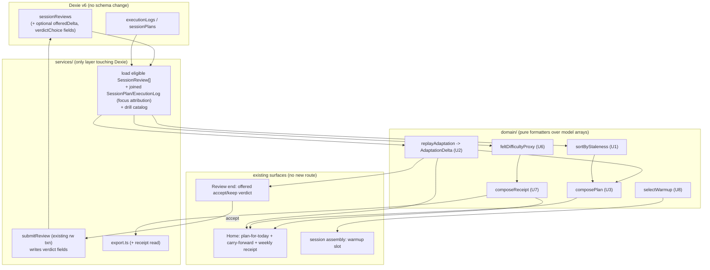

# feat: M002.1 thin-spine plan + visible adaptation + behavioral receipt + warmup

## Summary

Build M002.1 v1 of the "Weekly Training Home": a returning user sees what to do next, sees the plan adapting to them, and gets a calm behavioral receipt — without degrading the quick-start loop. Everything is a **pure formatter over already-captured records** (derive-don't-persist, `D150`); the only new persistence is two additive optional fields on the existing `SessionReview` row (the offered next-time delta + the accept/keep choice), written inside the existing review-submit transaction — **no new Dexie store and no data migration** (just an empty `version(7)` labelled boundary per repo convention). Felt-readiness self-report is deferred (`D151`); the objective drill score is a reserved seam for M002.3.

## Problem Frame

M001 proved one believable courtside loop. M002.1 is the first milestone of the M002 series (`D149`): it turns a finished-once timer into a training home by adding a longitudinal layer — a thin-spine plan, visible adaptation, and a behavioral-primary weekly receipt — on top of the existing v0b surfaces. The founder's stated #1 need is to "see the plan building up / know I'm getting at least 1% better"; the evidence (`docs/research/2026-06-02-m002-evidence-meta-synthesis.md`) says the honest v1 carrier of that need is **visible adaptation** (a carry-forward line + one offered accept/keep verdict), with behavioral consistency as the receipt headline and the honest skill read coming from a felt-difficulty proxy (R8). The felt-readiness self-report is a distinct construct and is deferred (`D151`); v1 surfaces no readiness number. The hard constraint is calm: the longitudinal layer must not add a pre-run route (`D137`), must not introduce streaks or calendar-guilt, and must not slow the quick-start loop.

## Requirements

Traced from the origin requirements doc (`see origin`). R1–R11 are carried forward verbatim in intent; the plan's disposition for each is noted.

**Plan shape (thin-spine)**

- R1. The plan is a small set of durable intentions (focuses being trained) + a steady weekly cadence + a ready backlog of focuses; only the next session is concrete. Build (U3).
- R2. The backlog is ordered by staleness (least-recently-trained first) over the currently-captured focuses; warmup/recovery handled outside the staleness ordering. Build (U1). Scoped to pass/serve/set (KTD2).
- R3. The plan is emitted as a single artifact Home/run/review/export format from — a pure formatter over the existing typed records, not a persisted source. Build (U3); foundational to KTD1.

**Visible adaptation (minimal #5)**

- R4. After a completed session, Home/Complete surfaces a visible carry-forward: one bounded deterministic line for what carried into the next recommendation. Build (U2 derivation, U5 surface).
- R5. Each session's review ends with one forward "next time" delta offered as accept / keep original — never a silent reshuffle, framed in stress vocabulary. Build (U2 logic, U4 persistence, U5 surface).

**Weekly receipt (behavioral-primary)**

- R6. The receipt headlines a behavioral consistency signal (sessions done against the user's own cadence); denominator avoids calendar-guilt. Build (U7); denominator resolved as a derivable trailing window (KTD3).
- R7. Confidence appears only as a relabeled felt-readiness companion. **Deferred from v1 (`D151`)** — v1 surfaces no readiness number; reserved weekly off-session seam (see Scope Boundaries).
- R8. One skill proxy derived from the already-captured per-drill difficulty-tag distribution, labeled honestly as felt-difficulty. Build (U6 proxy, U7 surface).

**Content + invariants**

- R9. A structured warmup pre-block every session can front-load, scaled to focus, filling the existing `warmup` focus. Build (U8).
- R10. The objective "1% better" drill score is an explicit seam reserved for M002.3. **Not built** (see Scope Boundaries).
- R11. Calm/no-overload invariants: no streaks-as-hero, no missed-day/calendar-guilt, no precise weekly-delta, quick-start loop intact, no new pre-run route. Cross-cutting (KTD7, KTD9; honored in every unit).

---

## Key Technical Decisions

- KTD1. **Derive-don't-persist (`D150`).** Plan, backlog ordering, carry-forward line, receipt, and skill proxy are all pure formatters in `domain/` over already-loaded model arrays (`SessionReview[]`, drill catalog, and — for focus attribution — the linked `SessionPlan`/`ExecutionLog`; see KTD10). Mirror the `composeSummary` precedent (`app/src/domain/sessionSummary.ts`): a screen/service does the Dexie read and passes data in. The only new persisted state is two additive optional fields on `SessionReview` — the **offered delta** (`offeredDelta`) and the **accept/keep choice** (`verdictChoice`) — written together in the existing review-submit transaction. This is a deliberate **simplification below `D150`'s "minimal append-only record"**: rather than a separate ledger store, the choice rides the review row it is 1:1 with (the heavy append-only verdict ledger stays deferred). Adding non-indexed fields needs **no data migration**; following the repo's D133/D134 convention, still bump to an empty `db.version(7).upgrade(() => {})` purely as a labelled deployment/replay boundary (no data transform). Readers treat absent fields on older rows as "no verdict."
- KTD2. **Staleness scope = pass/serve/set only (F3), with a deliberately minimal comparator.** `movement`/`conditioning` are never recorded as a session focus and `warmup`/`recovery` are focus-agnostic slots, so the v1 backlog ranks only the three captured focuses. For a 3-focus set with one focus trained per session, a plain least-recently-trained sort already gives anti-thrash (a just-trained focus sinks to the tail) and anti-starvation (the oldest is always at the head) — so the v1 comparator is **just least-recently-trained + an all-stale "fresh start" tie-break** (which serves the R11 calm invariant for a lapsed return). Cooldown bands and aging-promotion thresholds are **deferred** to the fuller-taxonomy milestone where they earn their keep; adding tunable machinery now is premature. The hysteresis that genuinely matters in v1 lives on the adaptation arm, not here (KTD6).
- KTD3. **Behavioral denominator = derivable trailing window (F2), not a stored cadence-target — and below a minimum history, no comparison at all.** No "planned" count is persisted. **Below a minimum-history threshold** (new/irregular users, fewer than N prior eligible sessions in the window), the receipt shows a plain **absolute count** ("3 sessions this window") with no rhythm comparison and no direction. Above the threshold, it frames the count as a **neutral band** ("in your usual range"), never a numeric or directional deficit — "below your usual" is itself a personalized quota and is forbidden. A 0-session week reads as a neutral fresh ledger. The receipt freezes on week-close (Hevy/168-app pattern); the week/window boundary is computed in **local time** with a pinned start-of-week, not raw UTC epoch math (F10).
- KTD4. **Felt-difficulty proxy (R8/F6) folds the existing difficulty-tag distribution.** Per-skill band label ("mostly comfortable / mixed / often stretched in [skill]") computed from `SessionReview.perDrillCaptures[].difficulty` over the rolling window, reusing the `aggregateDrillCaptures` precedent. Labeled honestly as felt-difficulty, relative-to-you, never an objective skill grade, never a future prediction. Adds no capture and no new metric type.
- KTD5. **Felt-readiness self-report deferred (`D151`).** The receipt carries no readiness number in v1. The research-correct capture (skill-specific present-state 11-pt NRS, weekly, off the post-session window) is a reserved seam for a later milestone, specced in the felt-readiness sub-brainstorm.
- KTD6. **Verdict = offered, never imposed, and never nagging.** `replayAdaptation(reviews)` produces a discriminated `AdaptationDelta` whose only v1 arm is stress-direction (`more | less | keep`). **Derivation rule (F3):** the per-drill difficulty-tag trend is the focus-level driver of direction; session-level sRPE (which is not focus-attributable) only gates magnitude/suppression and breaks no ties at the focus level. **Hysteresis (F4):** a direction flips only on a sustained trend across ≥2 eligible sessions, with a dead-band so a marginal signal stays `keep` — preventing per-session oscillation. **Effective-delta, not raw (F13):** the carry-forward line (R4) and the offered verdict (R5) read the *effective* delta after applying prior accept/keep choices; if the latest offer for a focus was kept-original, that focus is suppressed until the signal materially changes (no re-nagging a declined verdict every session). The line is suppressed when there is no effective delta (no filler). Accept persists the choice; keep-original is the zero-action default (doing nothing leaves the plan unchanged — never a silent reshuffle). Copy uses stress vocabulary, forward-compatible with M002.2.
- KTD7. **No new route (`D137`); render on existing surfaces.** Plan-for-today + carry-forward render through the Home seam (`useHomeScreenState` / `HomeFlags` → `HomePrimaryCard` area); the offered verdict renders at review end; the weekly receipt is a calm frozen-on-close section on Home. No `/plan`, `/week`, or pre-run route is added.
- KTD8. **Warmup = parameterized `selectWarmup(focus)`.** Scales the single authored warmup drill (`d28` Beach Prep Three) to the session focus inside the warmup-slot branch of `pickForSlot`. Honors the ≤45-word READ-DO courtside copy contract. If assembly output changes for a given seed/context, bump `SESSION_ASSEMBLY_ALGORITHM_VERSION` (currently 8). No new catalog drills (avoids the source-backed-content-activation ceremony).
- KTD9. **Layer boundaries + copy lints (CI-enforced).** New formatters live in `domain/` and import only `model/`/`data/` — never `services/`, `db/`, `react`, or `platform/`. All persistence goes through `services/`. User-visible copy honors the ≤45-word ceiling and no-em-dash rules (`drillCopyRegressions` lint).
- KTD10. **One eligible-session definition; one focus-attribution join (F2, F14, F11).** Both the staleness comparator (U1) and the receipt (U7) consume a single shared `eligibleTrainingSessions(reviews)` helper that filters to `status === 'submitted'` AND `eligibleForAdaptation` — so skipped/expired/late-captured stubs (with `sessionRpe: null`) never reset the staleness clock, poison the delta fold, or inflate the receipt count, and the two surfaces can't drift on what "a session" means. Focus attribution is **not** derivable from `SessionReview` alone (it carries only `executionLogId`); the loader joins review → `ExecutionLog` → `SessionPlan` and attributes via `inferSessionFocus(plan.blocks)`. v1 accepts the `skillFocus[0]` approximation for multi-skill drills (F11) and documents it; ages are clamped to `max(0, now - lastTrained)` against clock skew (F9).

---

## High-Level Technical Design

The architecture is a one-directional pipe: captured records are loaded once by a service/screen, folded through pure domain formatters, and rendered on existing surfaces. The only write-back is the verdict choice onto the review row.

The same `replayAdaptation` delta feeds both the Home carry-forward (read) and the review verdict (offered + persisted on accept). The same `composeReceipt` output feeds the user's Home section and the founder export (dual-read) — one computation, two reads, never able to drift.

---

## Implementation Units

Units are dependency-ordered. The pure domain formatters (U1, U2, U3, U6, U8) are independently landable and testable with no IO; the surface/persistence units (U4, U5, U7) build on them.

### U1. Staleness backlog comparator

- **Goal:** A pure function that orders the captured focuses by least-recently-trained, with anti-thrash and anti-starvation behavior, so the plan's backlog head is deterministic and calm.
- **Requirements:** R2.
- **Dependencies:** none.
- **Files:** `app/src/domain/staleness.ts` (new), `app/src/domain/staleness.test.ts` (new), `app/src/domain/eligibleSessions.ts` (new — the shared `eligibleTrainingSessions` helper per KTD10, also consumed by U7), `app/src/domain/eligibleSessions.test.ts` (new). Consumes pre-joined session records (review + its `SessionPlan` blocks) and the drill catalog; attributes focus via `inferSessionFocus(plan.blocks)` from `app/src/domain/sessionFocus.ts`.
- **Approach:** The comparator takes **attributed, eligible** sessions, not raw `SessionReview[]`: a session must pass `eligibleTrainingSessions` (`status === 'submitted'` AND `eligibleForAdaptation`) and carry a focus attributed from its joined `SessionPlan` blocks (KTD10) — `SessionReview` alone cannot attribute focus (it has only `executionLogId`). `sortByStaleness(attributedSessions, now)` returns `{ head, deferredTail }` over `pass | serve | set` (KTD2); `warmup`/`recovery`/`movement`/`conditioning` are excluded. Each focus's last-trained timestamp is the most recent eligible session attributed to it; ages clamp to `max(0, now - lastTrained)` (F9). Ordering is **plain least-recently-trained** (no cooldown band, no aging-promotion — KTD2); when all focuses are equally stale or untrained (lapsed/new user) return a deterministic tie-break + a "fresh start" signal. The loader (in `services/`, or the Home hook) does the Dexie join and passes attributed sessions in; this module stays pure. v1 accepts the `skillFocus[0]` multi-skill approximation (F11) — documented inline.
- **Patterns to follow:** the pure-comparator + exhaustive-property-test shape of `app/src/domain/homePriority.ts` / `homePriority.test.ts`; `inferSessionFocus` in `app/src/domain/sessionFocus.ts`; eligibility flags on `app/src/model/review.ts` (`status`, `eligibleForAdaptation`, `captureWindow`).
- **Test scenarios:**
  - Happy path: three focuses with distinct last-trained dates order least-recent-first at the head.
  - Edge — eligibility gate: a `status: 'skipped'` stub linked to a plan with a `main_skill` focus does NOT reset that focus's staleness clock; a `next_day_plus` (`eligibleForAdaptation: false`) review is excluded.
  - Edge — just-trained sinks: the focus trained in the most-recent eligible session is at the tail, not the head (plain-LRU anti-thrash, no cooldown needed).
  - Edge — all-stale / lapsed return: every focus equally stale → deterministic tie-break + "fresh start" signal, not an arbitrary head.
  - Edge — new user (zero eligible sessions): deterministic default order + fresh-start signal, never throws.
  - Edge — clock skew: a future-dated review (age would be negative) clamps to 0 and does not invert ordering.
  - Edge — `inferSessionFocus` returns `'partial'` (drill renamed/unmatched): that session contributes to no focus's clock and does not throw.
- **Verification:** pure function, full branch coverage; given fixed attributed sessions + `now`, output is deterministic and the head is predictable from last-trained timestamps alone; the eligibility filter is exercised by a skipped-stub fixture.

### U2. Adaptation replay fold + delta/verdict types

- **Goal:** A pure fold over review history that yields the single `AdaptationDelta` both the carry-forward line and the offered verdict read, plus the model types for the persisted verdict.
- **Requirements:** R4 (line derivation), R5 (offered-delta logic).
- **Dependencies:** none (U3, U5 depend on this).
- **Files:** `app/src/domain/adaptation/replayAdaptation.ts` (new), `app/src/domain/adaptation/replayAdaptation.test.ts` (new), `app/src/model/adaptation.ts` (new — `AdaptationDelta`, `VerdictChoice`), re-exported via `app/src/model/index.ts` and the `app/src/domain/index.ts` barrel.
- **Approach:** `replayAdaptation(input): AdaptationDelta` consumes **eligible, attributed** sessions (via the KTD10 helper + focus join) plus the prior verdict choices, and returns a discriminated union whose only v1 arm is `{ kind: 'stress'; focus; direction: 'more' | 'less' | 'keep' }`. **Derivation rule (F3):** the per-focus difficulty-tag trend drives direction (`too_hard` cluster → `less`, `too_easy` cluster → `more`); session-level `sessionRpe` only gates magnitude/suppression and is never used to attribute a direction to a focus (it is not focus-decomposable). A `sessionRpe: null` stub cannot produce a direction. **Hysteresis (F4):** a direction flips only on a sustained trend across ≥2 eligible sessions, with a dead-band keeping marginal signals at `keep`. **Effective-delta (F13):** compute the effective delta after applying prior accept/keep choices — if the latest offer for a focus was `kept_original`, suppress that focus until the signal materially changes. Provide `composeCarryForwardLine(effectiveDelta, plan): string | null` returning `null` on `keep`/suppressed (no filler — KTD6) and a bounded ≤45-word stress-vocabulary line otherwise. `VerdictChoice = 'accepted' | 'kept_original'`. The union is shaped so M002.2 can add magnitude and M002.3 a `score` arm without a surface rewrite. Pure; imports only `model/`.
- **Patterns to follow:** the discriminated-union-with-one-v1-arm pattern from `MetricCapture` in `app/src/model/capture.ts` (`D134`); the deterministic string-constant composition of `composeDefaultReason` in `app/src/domain/sessionSummary.ts`; the shared eligibility helper from U1 (KTD10).
- **Test scenarios:**
  - Happy path: a sustained `too_hard` cluster on a focus across ≥2 eligible sessions yields `direction: 'less'`; sustained `too_easy` yields `'more'`.
  - Edge — sRPE vs tags disagree: high sRPE + `too_easy` tags resolves per the rule (tags drive direction = `more`; sRPE only affects magnitude/suppression), deterministically.
  - Edge — hysteresis/dead-band: a single hard session (no sustained trend) stays `keep`; an oscillating signal does not flip every session.
  - Edge — declined verdict: a focus whose last offer was `kept_original` is suppressed on the next read (no re-nag) until the signal materially changes.
  - Edge — eligibility: skipped/`sessionRpe: null`/late-captured rows are excluded and never produce a direction.
  - Edge — copy ceiling: every non-null carry-forward line is ≤45 words and em-dash-free (enforced in test).
  - Edge — single review / cold start: returns a safe `keep`, never throws.
- **Verification:** pure and deterministic over fixed eligible sessions + prior choices; the derivation rule and hysteresis are pinned by tests so "same history → same delta" actually holds.

### U3. composePlan thin-spine projection

- **Goal:** The single plan artifact (durable intentions + cadence read + staleness-ordered backlog, only next session concrete) that Home/run/review/export format from.
- **Requirements:** R1, R3.
- **Dependencies:** U1, U2.
- **Files:** `app/src/domain/composePlan.ts` (new), `app/src/domain/composePlan.test.ts` (new), exported via `app/src/domain/index.ts`.
- **Approach:** `composePlan(input: PlanInput): PlanOutput` mirroring the `SummaryInput`/`SummaryOutput` shape. `PlanInput` carries `reviews`, `now`, and optional `acceptedDeltas` (the persisted verdict choices, empty until U4/U5 wire them). Derives: durable intentions = the focuses actually being trained (from attributed history); a weekly cadence read (derivable rolling rhythm, no stored target); and the backlog via `sortByStaleness` (U1), exposing only the head as the concrete "next session." An accepted stress delta (U2) nudges the head's framing. The warmup pre-block that front-loads each session is assembled separately at session-build time (U8) and is referenced by the projection, not built by it — so U8 is not a build dependency of `composePlan`. `PlanOutput` carries a ≤45-word courtside render string plus the structured fields run/review/export reuse. Pure; imports only `model/` + sibling domain modules.
- **Patterns to follow:** `app/src/domain/sessionSummary.ts` (`composeSummary` input/output discipline, deterministic branches, co-located test).
- **Test scenarios:**
  - Happy path: given reviews across pass/serve/set, the output names the next session as the staleness head + warmup, lists the deferred backlog as intent, and renders ≤45 words.
  - Edge — only next session concrete: nothing beyond the head is rendered as a committed session.
  - Edge — accepted delta present: an accepted `less stress on serve` shifts the serve framing in the head/next-rec without reshuffling the backlog order.
  - Edge — cold start (no reviews): emits a calm first-session projection (fresh-start framing from U1), no crash.
  - Edge — regenerability: same `(reviews, acceptedDeltas, now)` always yields identical output.
- **Verification:** pure formatter; replaying captured inputs reproduces the plan exactly (no persisted plan artifact exists).

### U4. Verdict persistence (additive SessionReview fields + submit-path write)

- **Goal:** Persist the one new user input — the accept/keep verdict choice — as additive fields on the existing review row, written atomically with review submit. No new store, no migration.
- **Requirements:** R5 (the persisted choice).
- **Dependencies:** U2 (delta/verdict types).
- **Files:** `app/src/model/review.ts` (add optional `offeredDelta?: AdaptationDelta` and `verdictChoice?: VerdictChoice`), `app/src/db/schema.ts` (add an empty `db.version(7).stores({...all six restated...}).upgrade(() => {})` as a labelled boundary per the D133/D134 convention — no data transform), `app/src/services/review/submit.ts` (thread the fields into the existing `rw` transaction write), `app/src/services/review/drafts.ts` (carry the fields through field-scoped patch writers), `app/src/services/review/__tests__/verdict-persistence.test.ts` (new, services tier with `fake-indexeddb`).
- **Approach:** Add two optional, non-indexed fields to `SessionReview`. Adding them needs no data migration; per repo convention (v5 added `perDrillCaptures`, v6 added `metricCapture` — both bumped with an empty `.upgrade`), bump to `db.version(7)` with an empty upgrade purely as a labelled deployment/replay boundary, restating the six existing stores (KTD1). `submitReview` already opens an `rw` transaction over `sessionReviews`/`storageMeta`; write the verdict fields in that same transaction so the choice is atomic with submit. Keep the A3 read-decide-write guard (never overwrite a terminal row). Absence of the fields on older rows means "no verdict offered/recorded" to all readers. Persistence stays in `services/`; the model type is consumed by `domain/` but `domain/` never imports `db/`.
- **Patterns to follow:** the additive-field + field-scoped-patch pattern from the `D133`/`D134` `perDrillCaptures`/`metricCapture` work in `app/src/services/review/`; schema-invariant test style under `app/src/db/__tests__/` / services tier with `fake-indexeddb`.
- **Test scenarios:**
  - Happy path: submitting a review with `verdictChoice: 'accepted'` persists both fields; reloading the row returns them.
  - Edge — keep-original / no interaction: a submitted review with no verdict has both fields `undefined`; readers treat it as no-verdict (regression: older rows still load).
  - Edge — atomicity: the verdict write shares the submit transaction (no partial state where review is submitted but verdict is lost).
  - Edge — terminal-row guard: a second submit attempt does not overwrite an existing accepted verdict.
  - Integration: a round-trip through `submitReview` → reload → `replayAdaptation` sees the recorded choice in subsequent plan projection.
- **Verification:** services-tier tests pass with `fake-indexeddb`; the v7 bump is an empty `.upgrade` with no data transform (existing rows load unchanged, `db.verno === 7`); a round-trip persists and reloads both fields; older rows without the fields still load.

### U5. Visible adaptation surfaces (carry-forward on Home + offered verdict at review)

- **Goal:** Render the carry-forward line on Home/Complete and the offered accept/keep verdict at review end, wiring the accept path to U4. This is the honest v1 carrier of the founder's "see it adapting" need.
- **Requirements:** R4, R5.
- **Dependencies:** U2, U3, U4.
- **Files:** `app/src/screens/home/useHomeScreenState.ts` (extend `HomeFlags`/`resolveHomeSnapshot` to load reviews and compute the carry-forward line via U2/U3 — the read happens in the hook/service layer, the formatter stays pure), `app/src/components/home/` (a new carry-forward cell rendered in the `HomePrimaryCard` area), `app/src/screens/CompleteScreen.tsx` (surface the same carry-forward line post-session), `app/src/screens/ReviewScreen.tsx` (render the offered accept/keep verdict at review end, defaulting to keep-original), and the matching `*.test.tsx` files. No new route; no change to `routePaths` or `screenContracts.ts`.
- **Approach:** Home loads eligible attributed sessions in `resolveHomeSnapshot` (services read — including the `SessionPlan` join for focus attribution, KTD10), passes them to `composePlan`/`composeCarryForwardLine`, and exposes the line + plan-for-today through `HomeFlags`; the carry-forward cell renders only when the effective line is non-null. At review end, present the offered delta in stress vocabulary with two affordances — accept (persists via U4's submit path) and keep original (the zero-action default). Never silently reshuffle. Honor calm invariants and the ≤45-word copy contract.
  - **Verdict interaction-state model (D1):** define all visual states explicitly — default (keep-original pre-selected so doing nothing is the safe path), accept-selected, post-accept confirmation, and no-delta (the affordance is absent, not a disabled control). One in-screen toggle between accept/keep; no modal.
  - **Home information architecture (D2):** specify the vertical order on Home — the existing quick-start primary card stays dominant at the top (unchanged precedence), then the carry-forward line (when present), then the frozen weekly receipt section below the fold. Plan-for-today renders within the existing primary-card area, not as a competing card.
    - **EXTENDED 2026-06-05 by `D152` (Home coherence, post-dogfood):** the `last_complete` focal card now **IS the plan** — its primary CTA "Start [focus] session" launches a focus-steered session on the staleness head (via Setup → Safety), Repeat/Start-different demote to secondary, and the separate descriptive plan line is absorbed by the CTA (suppressed for `last_complete`; the card carries a "Then: serving and setting." queue line and labels its metadata "Last session: …" per the 2026-06-11 review refinement). The standalone weekly receipt section is removed from Home and **merged into the Recent-sessions header** with a temporally-labeled headline ("Last week: N sessions", steady + strong; low-history/zero reads omitted) + felt-difficulty lines. Plan ordering decouples from adaptation eligibility (trained-sessions basis for staleness; `eligibleTrainingSessions` still gates adaptation + receipt count). `composeReceipt`/export and `D150`/`D151` unchanged. KNOWN v1 GAP carried to M002.2: an accepted verdict delta is presentation-only — the launch does not modulate assembly with it. See `docs/decisions.md` `D152`.
  - **Carry-forward lifecycle (D4):** the line appears after a delta-producing session and is replaced (not animated away mid-read) on the next snapshot; when it transitions to no-delta it is simply absent on the next Home load — no jarring in-place dismissal.
  - **Review → Complete → Home coherence (D3):** Complete and Home read the *effective* delta (post accept/keep, U2/F13), so the carry-forward never describes a change the user just declined.
  - **Accessibility (D5):** the accept/keep controls meet the ≥44px courtside tap-target and one-handed-reach conventions and carry screen-reader labels, consistent with the existing courtside control standards.
- **Patterns to follow:** `app/src/domain/homePriority.ts` precedence model + `app/src/components/HomePrimaryCard.tsx` discriminated dispatcher; `app/src/screens/CompleteScreen.tsx` (loads bundle, calls a pure formatter, renders fields); review write path in `app/src/services/review/submit.ts`.
- **Test scenarios:**
  - Happy path: after a session that produced a real delta, Home shows the carry-forward line and Complete shows the same line.
  - Edge — no delta: carry-forward cell is absent entirely (no filler line) on Home and Complete.
  - Happy path — accept: tapping accept at review end persists `verdictChoice: 'accepted'` (asserted against U4 service) and the next plan projection reflects it.
  - Edge — keep-original default: submitting review without touching the verdict leaves the plan unchanged and records no accepted delta (never a silent reshuffle).
  - Edge — quick-start intact: Home with a draft/resume still prioritizes the existing primary card; the carry-forward cell does not displace the quick-start affordance.
  - Edge — verdict default state: on a review with an offered delta, keep-original is the pre-selected/default state; submitting without interacting records `kept_original` (or no accepted delta) and changes nothing.
  - Edge — Home order: with a draft/resume present, the quick-start primary card renders above the carry-forward line and receipt (precedence unchanged).
  - Edge — declined-then-coherent (D3): a kept-original verdict does not produce a carry-forward line describing that declined change on Complete or the next Home load.
  - Edge — accessibility: the accept/keep controls expose screen-reader labels and meet the ≥44px tap-target standard.
  - Integration: Home snapshot read → `composePlan` → carry-forward render uses the live attributed review data, not a stubbed plan.
- **Verification:** the carry-forward line is visible after a delta-producing session and absent otherwise; accept persists and is reflected next session; declined verdicts never re-nag; the quick-start loop and `D137` spine are unchanged (route list untouched).

### U6. Felt-difficulty skill proxy

- **Goal:** A pure per-skill band label folded from the existing difficulty-tag distribution, honestly labeled as felt-difficulty.
- **Requirements:** R8.
- **Dependencies:** none (U7 consumes it).
- **Files:** `app/src/domain/feltDifficultyProxy.ts` (new), `app/src/domain/feltDifficultyProxy.test.ts` (new).
- **Approach:** `feltDifficultyProxy(eligibleSessions, window): Record<focus, Band>` where `Band = 'mostly_comfortable' | 'mixed' | 'often_stretched'`. Fold `perDrillCaptures[].difficulty` (`too_easy`/`still_learning`/`too_hard`) per focus within the rolling window over eligible sessions (KTD10). Note: `aggregateDrillCaptures` is a **shape precedent only** — it sums a single session and does not bucket by focus, and `PerDrillCapture` has no focus field — so the per-focus bucketing is built fresh here, joining each capture's `drillId` to `skillFocus` via the drill catalog (`data/` import is allowed from `domain/`). Emits a relative-to-you, time-bounded read; never an objective skill grade, never a future prediction; returns a "not enough data yet" state below the minimum-N captures. Adds no capture and no metric type.
- **Patterns to follow:** the `tagBreakdown` counting shape in `app/src/domain/capture/aggregate.ts` (precedent, not direct reuse — build per-focus bucketing fresh); `drillId → skillFocus` lookup against `app/src/data/drills.ts`; `app/src/domain/capture/__tests__/` test layout.
- **Test scenarios:**
  - Happy path: a focus whose recent captures skew `too_hard` reads `often_stretched`; skew `too_easy` reads `mostly_comfortable`; balanced reads `mixed`.
  - Edge — sparse window: below the minimum-N captures returns "not enough yet," never a band.
  - Edge — honest labeling: output type cannot express a numeric score or a "your skill improved" claim (structural).
  - Edge — focus with no captures in window: returns the empty/not-enough state, not a default band.
- **Verification:** pure fold over existing `difficulty` values; no new capture surface introduced; deterministic for a fixed `(reviews, window)`.

### U7. Behavioral-consistency weekly receipt + dual-read export

- **Goal:** A calm, frozen-on-close weekly receipt on Home headlining behavioral consistency + the felt-difficulty proxy, with the same record read by the founder export (dual-read).
- **Requirements:** R6, R8 (proxy surfaced here).
- **Dependencies:** U6.
- **Files:** `app/src/domain/composeReceipt.ts` (new), `app/src/domain/composeReceipt.test.ts` (new), a new receipt section component under `app/src/components/home/` + test, `app/src/services/export.ts` (extend `ExportPayload` with the receipt read for the founder D130 evidence), `app/src/screens/home/useHomeScreenState.ts` (expose the receipt to Home).
- **Approach:** `composeReceipt(eligibleSessions, now): ReceiptOutput` headlines sessions completed in a trailing rolling window, consuming the **same `eligibleTrainingSessions` helper as U1** (KTD10) so the receipt's session count can never drift from what staleness treats as training. Below the minimum-history threshold it shows a plain **absolute count** with no comparison; above it, a **neutral band** ("in your usual range") — never a numeric or directional deficit, never a precise weekly delta (KTD3, F5). The receipt freezes on week-close, with the week/window boundary computed in **local time** with a pinned start-of-week (not raw UTC epoch math — F10); a 0-session week is a neutral fresh ledger. Includes the U6 felt-difficulty band per focus, honestly labeled. User copy and the founder-export read derive from the same `ReceiptOutput` (dual-read, kept thin — a read of the already-computed receipt, no export-only aggregation). The export extension also bumps `ExportPayload.schemaVersion` (currently the frozen `4`) since the payload shape changes (the new `SessionReview` fields + receipt), so the founder's replay scripts can branch on version (F7). Calm invariants: no streaks-as-hero, no missed-day/calendar-guilt.
- **Patterns to follow:** `app/src/domain/sessionSummary.ts` (formatter shape); `app/src/services/export.ts` (`buildExportPayload` structure); the dual-read learning (`docs/solutions/architecture-patterns/2026-05-27-dual-read-pattern-for-milestone-evidence-artifacts.md`).
- **Test scenarios:**
  - Happy path: a window with 3 sessions renders a behavioral headline + per-focus felt-difficulty bands, ≤45-word calm copy.
  - Edge — zero-session week: reads as a neutral fresh-ledger invitation, no word implying failure/miss (assert no guilt vocabulary).
  - Edge — frozen-on-close: the receipt reflects the closed prior period, not a live-updating current-week number.
  - Edge — no readiness number: the receipt contains no self-reported readiness/confidence value (R7 deferred — structural assertion).
  - Edge — below-min-history: a new user (fewer than N prior eligible sessions) sees an absolute count with no rhythm comparison and no direction.
  - Edge — below-average-but-nonzero: a light-but-nonzero week renders a neutral band, never a down-arrow/deficit/"below your usual" (assert no directional-deficit vocabulary).
  - Edge — local-time boundary: a session at 23:59 local on the last day of the window buckets into the correct period (not shifted by UTC).
  - Integration / dual-read: the founder export's receipt read equals the user-facing `composeReceipt` output for the same review set; export `schemaVersion` reflects the shape change.
  - Integration / cross-unit (F14): the receipt's session count equals the count `sortByStaleness` (U1) treats as training for the same eligible review set (shared helper).
- **Verification:** Home shows a calm frozen weekly section; export carries the identical receipt under a bumped `schemaVersion`; no calendar-guilt, deficit-direction, or readiness-number surface exists; the receipt and staleness agree on session count.

### U8. Parameterized warmup selector

- **Goal:** A focus-scaled warmup pre-block that fills the existing `warmup` slot from the single authored drill, without new catalog content.
- **Requirements:** R9.
- **Dependencies:** none.
- **Files:** `app/src/domain/sessionAssembly/selectWarmup.ts` (new) + test under `app/src/domain/sessionAssembly/`; `app/src/domain/sessionBuilder.ts` (`buildDraft` — thread focus into the warmup block's `segments` at the `segments: pick.variant.segments` seam; bump `SESSION_ASSEMBLY_ALGORITHM_VERSION` 8 → 9 since assembly output changes for warmup sessions). Note: `pickForSlot` in `candidates.ts` returns an **immutable catalog `{drill, variant}` reference** and cannot re-portion it — the re-portioning seam is the segment assignment in `buildDraft`, not the slot pick.
- **Approach:** `pickForSlot` still selects the `warmup`-tagged `d28` as today. `selectWarmup(focus, playerCount, baseSegments)` then derives focus-scaled segments from `d28`'s base segments (ball-control touches/passes/low-pepper + courtside mobility), re-portioning emphasis to the session focus within the ≤45-word READ-DO copy contract and the existing segment/duration model; `buildDraft` applies the result where it currently assigns `segments: pick.variant.segments` for the warmup block. No new drill records; the selector is the seam future warmup content plugs into. Bump the algorithm version because warmup output now varies by focus.
- **Patterns to follow:** the `segments: pick.variant.segments` assignment in `app/src/domain/sessionBuilder.ts` (`buildDraft`); `app/src/data/drills.ts` `d28` segment model; the `SESSION_ASSEMBLY_ALGORITHM_VERSION` stamp; courtside copy lint `app/src/data/__tests__/drillCopyRegressions.test.ts`.
- **Test scenarios:**
  - Happy path: a pass-focus session and a serve-focus session produce visibly re-portioned warmup emphasis from the same base drill.
  - Edge — focus = recommended/none: returns a sensible default warmup block, never empty.
  - Edge — copy contract: emitted warmup copy is ≤45 words and em-dash-free (assert against the lint).
  - Edge — assembly provenance: if output changes for a fixed seed/context, `SESSION_ASSEMBLY_ALGORITHM_VERSION` is bumped (regression test pins the version/output pairing).
  - Edge — solo vs pair player count scales the block without requiring a different plan.
- **Verification:** every session can front-load a focus-scaled warmup from `d28`; copy lints pass; assembly version provenance is correct.

---

## Scope Boundaries

### Deferred for later (in the M002 series, not v1)

- Felt-readiness self-report (R7) — deferred per `D151`; the research-correct weekly off-session 11-pt NRS is a reserved seam (`docs/brainstorms/2026-06-03-m002-1-felt-readiness-capture-requirements.md`).
- The objective "1% better" drill score (R10) — reserved seam for M002.3; v1 builds nothing toward capture.
- Stress-ladder content + technique-how depth (M002.2); goals/anchor (M002.4); 3+ player/rotation (M002.5); attack + tactics content (M002.6). v1 speaks stress vocabulary (the verdict's "more/less stress") but builds no ladder content.
- The heavy append-only verdict ledger / threshold machinery — v1 records only the single accept/keep choice on the review row.

### Outside this product's identity

- AI-generated plans or open-ended coach chat (`P7`); coach-facing UI; a full calendar/periodized planner; gamification; rich analytics/benchmarking; a persistent `Team` object.

### Deferred to follow-up work

- A fuller focus taxonomy for staleness ranking (movement/conditioning as first-class session focuses) — needs new capture/derivation; waits on the versioned-taxonomy primitive (KTD2).
- A dedicated history/receipt route — v1 keeps the receipt as a Home section under the no-new-route constraint; a standalone route is a separate decision if discoverability proves insufficient.

---

## Open Questions

These are genuine decisions surfaced in review that are better settled with real data during implementation than pinned in the plan:

- **Adaptation derivation thresholds (F3/F4).** The difficulty-tag-trend → `more`/`less`/`keep` thresholds, the sustained-trend window (≥2 sessions), and the dead-band width are tuning values. The *rule* is pinned (tags drive direction, sRPE gates magnitude/suppression, hysteresis required); the *numbers* should be calibrated against the founder's own session data in `ce-work`, not guessed here.
- **Regenerability hardening (F1).** Decide between (a) denormalizing the attributed `sessionFocus` onto the plan/review row at capture time (so focus attribution survives catalog renames) versus (b) accepting the "stable while catalog/vocabulary unchanged" scope and shipping a catalog-rename guard test. (a) is more robust but adds a captured field; (b) is lighter and matches v1's derive posture. Recommend (b) for v1 with the guard test, revisit if catalog churn proves frequent.
- **Export `schemaVersion` coordination (F7).** Bumping the literal is decided; confirm the founder's D130 replay scripts branch on version (or are regenerated) before relying on the new export shape.

---

## Risks & Dependencies

- **Home information density.** Plan-for-today + carry-forward + a weekly receipt all land on Home under the no-new-route constraint. Risk: Home becomes crowded against the calm/shibui posture. Mitigation: carry-forward suppresses when there is no delta; the receipt is a single frozen section; reuse the existing primary-card precedence so quick-start stays dominant. Watch in founder dogfood.
- **Staleness attribution accuracy.** `inferSessionFocus` name-matches the main-skill block to the catalog; mis-attribution would mis-order the backlog. Mitigation: scope to pass/serve/set where attribution is reliable; test the comparator against attributed reviews.
- **Verdict determinism for regenerability.** The accepted verdict must be replayable so `composePlan` reproduces the same plan. Mitigation: persist the explicit choice (U4) and fold it deterministically (U2/U3); covered by the round-trip integration test.
- **Behavioral denominator framing (F2).** A trailing-window variance read must not read as a quota. Mitigation: KTD3 + the zero-session-week "no guilt vocabulary" test.
- **Regenerability ≠ durability (F6).** "Always regenerable from captured records" assumes the records survive. They live only in device IndexedDB (local-first, no backup per `D131`); a browser storage eviction or "clear site data" silently resets the entire longitudinal layer to cold-start with no error. Mitigation in scope: request persistent storage via `navigator.storage.persist()` through `platform/` and name the eviction risk; true durability needs the deferred cloud-peer seam.
- **Regenerability ≠ stable across catalog/vocabulary drift (F1, F12).** The projection recomputes against the *current* drill catalog and difficulty-tag vocabulary, not the versions in effect when a session ran. A drill rename makes `inferSessionFocus` return `'partial'` (the focus loses its staleness credit); a future tag-vocabulary change (likely at M002.2) mixes old/new semantics in the proxy window. v1 is stable while catalog + vocabulary are unchanged; this is the honest scope of the regenerability claim. A catalog-rename guard test should pin staleness output across a rename. (See Open Questions for the denormalize-vs-scope decision.)
- **Dependency:** all units ride existing capture surfaces (`ExecutionLog`, `SessionReview`, per-drill `/run/check`) and the `D137` spine. No external service, no new dependency, no telemetry change (`D131`).

---

## System-Wide Impact

- **Data lifecycle:** two additive non-indexed fields on `SessionReview`; no data migration and no new store, but an empty `db.version(7).upgrade(() => {})` labelled boundary per the D133/D134 convention. Older rows remain valid (absent = no verdict). This is the only persistence change.
- **Export contract:** `ExportPayload.schemaVersion` bumps from the frozen `4` when the new review fields + receipt ship, so the founder's D130 replay scripts can branch on the shape change.
- **Layer boundaries (CI-enforced):** new formatters live in `domain/` importing only `model/`; the grep gate (`domain/*` must not import `db`/`services`/`react`) must stay green. All reads/writes go through `services/`.
- **Routing:** no change to `routePaths` / `screenContracts.ts`; the `D137` Setup→Safety spine is untouched.
- **Assembly provenance:** `SESSION_ASSEMBLY_ALGORITHM_VERSION` bumps only if U8 changes warmup assembly output for a fixed seed/context.
- **Founder evidence (`D130`):** the dual-read receipt extends `services/export.ts`; the founder reads the same record the user sees, feeding the 2026-07-20 re-eval without a parallel diagnostics layer.

---

## Sources / Research

- Origin: `docs/brainstorms/2026-06-03-m002-thin-spine-and-milestone-series-requirements.md` (R1–R11, F-series feasibility); `docs/brainstorms/2026-06-03-m002-1-felt-readiness-capture-requirements.md` (R7 deferral).
- Decisions: `D149` (M002 series + reframe), `D150` (derive-don't-persist), `D151` (felt-readiness deferral), `D137` (no new pre-run route), `D131` (telemetry-off/local-first), `D133`/`D134` (per-drill capture + discriminated-union field pattern), `D146` (pair-first).
- Evidence: `docs/research/2026-06-02-m002-evidence-meta-synthesis.md`; `docs/research/subjective-skill-confidence-validity.md`; `docs/solutions/design-patterns/low-dose-self-coached-progress-signal-design.md`; `docs/solutions/architecture-patterns/2026-05-27-dual-read-pattern-for-milestone-evidence-artifacts.md`; `docs/solutions/architecture-patterns/2026-05-25-markdown-as-api-choice.md`.
- Code anchors: `app/src/domain/sessionSummary.ts` (formatter precedent), `app/src/domain/homePriority.ts` (Home precedence), `app/src/services/review/submit.ts` (review write path), `app/src/model/capture.ts` (`DifficultyTag`, discriminated-union pattern), `app/src/domain/capture/aggregate.ts` (`aggregateDrillCaptures`), `app/src/services/export.ts` (export), `app/src/domain/sessionAssembly/candidates.ts` (`pickForSlot`), `app/src/db/schema.ts` (v6, unchanged), `.cursor/rules/data-access.mdc` (layer boundary), `.cursor/rules/courtside-copy.mdc` (copy contract).

