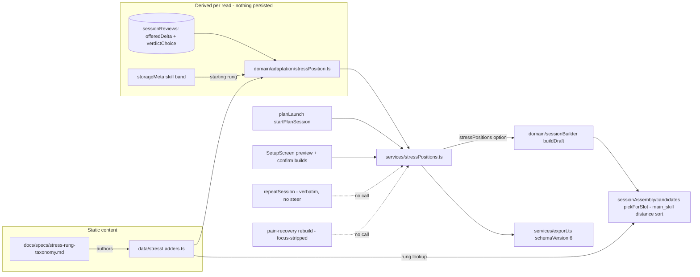

# feat: Stress substrate — rung ladders, derived position, delta-consuming assembly

## Summary

Make stress a first-class internal concept: a short taxonomy brief fixes an ordinal rung scale, every `m001Candidate` pass/serve/set drill is placed on a per-focus **stress ladder** (static registry, no Dexie change), the user's per-focus **ladder position** is derived by folding accepted verdicts over already-persisted review rows, and session assembly's main-skill selection **prefers the drill nearest the current rung** — so an accepted "more/less stress" delta finally acts. No new UI; the carry-forward line stays the only visible trace. This retires `D152`'s named v1 gap.

## Problem Frame

M002.1 shipped sense-and-show adaptation: captures derive an `AdaptationDelta`, the user accepts or keeps it at Review, Home shows the carry-forward. The accepted delta then does nothing — `D152` names the gap. The M002 series doc already picked "stress" (progressive contextual interference, `D68`) as the spine's organizing primitive, with vocabulary shipped and content deferred to M002.2. The catalog carries four latent difficulty dimensions (player bands, dormant `ProgressionChain` links, RPE envelopes, delta vocabulary) with no unifying ordering. This plan pulls the M002.2 substrate forward: annotation + position + assembly mechanics, leaving cue/criterion depth and any user-facing exposure for M002.2 proper.

---

## Requirements

Carried from origin (R1–R14); plan disposition per requirement.

**Substrate**

- R1. Taxonomy brief defines the ordinal scale before catalog annotation. Build (U1; U7 decision linkage).
- R2. Every catalog drill with pass/serve/set `skillFocus` carries a rung consistent with the taxonomy. Build (U1 authoring, U2 registry). Scoped to `m001Candidate` drills (KTD8): the 14 non-candidate focus-tagged rows (d02, d04, d06, d08, d12–d14, d16, d17, d19–d21, d23, d24) are outside assembly and stay un-rung until activated — the taxonomy brief names this exclusion so future activation knows to place them.
- R3. Validation enforces rung presence and steppability: ≥4 distinct rungs per focus, ≥1 drill per rung. Build (U2 test-time validation; KTD8).

**Position and movement**

- R4. Per-focus position derived at read time by replaying accepted verdicts; nothing persisted. Build (U3).
- R5. Starting position for a focus with no accepted verdicts maps from the onboarding skill band. Build (U3; mapping authored in U1).
- R6. Accepted `more` moves +1, accepted `less` moves −1, keep-original moves nothing; clamp at ladder ends. Build (U3).
- R7. Derivation is deterministic and pure (`P7`, `D150`). Build (U3; enforced by domain-layer purity).

**Assembly consumption**

- R8. Main-skill selection prefers drills at the focus's current rung. Build (U4; U5 caller wiring).
- R9. No rung-matching drill fits the context → nearest-rung compatible drill, never a failure. Build (U4; distance ordering gives R8+R9 in one mechanism, KTD3).
- R10. Plan launch and Setup-built sessions consume the same rung preference; Repeat stays verbatim. Build (U5).

**Exposure and instrumentation**

- R11. No new user-facing stress surface; carry-forward stays the only visible trace. Honored in every unit (no screen/copy changes).
- R12. Founder diagnostic read via the existing export pathway. Build (U6) — **deliberate narrowing of origin R12**: the payload carries current positions per focus only; the rung of each assembled main drill is derivable offline from the static ladder plus the exported `sessionPlans`, so it is not duplicated into the payload.

**Constraints**

- R13. No Dexie schema change, no new capture fields. Honored: the registry is static content; position is a fold over existing rows.
- R14. Drill courtside copy untouched; rung is assembly metadata, never rendered copy. Honored: registry is a separate file from `drills.ts`; copy-guard suites must stay green.

---

## Key Technical Decisions

- KTD1. **Ladder-as-registry, drill-level rungs.** New static module `app/src/data/stressLadders.ts` exporting per-focus ladders: an ordered list of rungs, each holding one or more drill ids (set fundamentals `d38`/`d39`/`d40` legitimately share a low rung). The ladder is the reviewable artifact — one file shows each focus's full ordering, and M002.2 later attaches cue/criterion fields to the same rung objects. Rungs sit on drills, not variants: variants differ by context (solo/pair, net/open), not stress intent; context fit stays the candidate filter's job. The dual-focus drill `d18` gets an independently authored rung in both the pass and serve ladders. Mirrors the registry precedent (e.g. warmup/cue registries) rather than widening `drills.ts` rows — keeps `D70` copy surfaces untouched (R14).
- KTD2. **Position = pure fold over persisted verdict pairs.** M002.1 already persists `offeredDelta` + `verdictChoice` on `SessionReview` — position replay needs no re-derivation of historical offers. New domain sibling `app/src/domain/adaptation/stressPosition.ts`: sort reviews by `submittedAt`, fold rows where `verdictChoice === 'accepted'` and `offeredDelta.direction !== 'keep'` into a per-focus offset from the band-mapped starting rung, clamping to each ladder's bounds at every step. Same-layer conventions as `verdictOffer.ts`.
- KTD3. **Assembly preference = stable distance sort inside `pickForSlot`.** When the slot is `main_skill`, the effective focus is a scoped focus, and a position is provided, stable-sort the candidate pool by `|drillRung − position|` after pool construction — generically, so all three pool branches (unused, band-relax, used-fallback) get the ordering. Drills absent from the ladder sort last; under U2's completeness invariant that branch is defensive only (future drill activation), exercised in tests via a synthetic fixture. Exact-rung preference (R8) and nearest-rung fallback (R9) are one mechanism; the stable sort preserves shuffle order within equal distance so output stays deterministic per seed (R7/`P7`). Existing duration-fit and band-relax logic then operate on the reordered pool unchanged. Bump `SESSION_ASSEMBLY_ALGORITHM_VERSION` as a semantics-change marker — positionless builds stay output-identical, so the bump documents the new option, not churn.
- KTD4. **One consumption seam, two callers, three non-callers.** `BuildDraftOptions` gains optional `stressPositions`; a thin service (`app/src/services/stressPositions.ts`) loads reviews + persisted skill band and returns the derived per-focus positions. Callers: `startPlanSession` (the focal Home CTA) and SetupScreen's build path — note SetupScreen builds at **two** call sites (the on-mount preview and the commit-time fallback) and `handleConfirm` persists the preview draft without rebuilding, so positions must reach the preview inputs, not just the confirm path. Non-callers by design: `repeatSession` (R10 verbatim), the pain-recovery rebuild (focus-stripped, so no scoped focus exists to steer), and the generated-plan diagnostics harness (`buildDraftWithAssemblyTrace` stays positionless, so the diagnostics baseline keeps measuring un-steered assembly). Absent `stressPositions` → selection behaves exactly as today (legacy fallback everywhere). `buildAndSaveDraft` is shared by both planLaunch flows, so the caller boundary is a parameter on the helper, not a separate code path.
- KTD5. **Export read mirrors the receipt pattern.** `buildExportPayload` adds a `stressPositions` key resolved through the same service the assembly callers use — one computation, two reads — and bumps `schemaVersion` 5 → 6 (R12). No new UI.
- KTD6. **`ProgressionChain` stays dormant; its orderings inform, its gating retires.** Initial rung assignments draw on the chain orderings (chain-1→4 spine for pass, the chain-6 serve graph, chain-7's fundamentals+spine for set) but the Bayesian/pass-fail gate philosophy is explicitly not revived — movement is user-accepted only (origin Key Decisions). Chains are left untouched in code.
- KTD7. **Taxonomy brief gates annotation; decision logged as `D154`.** `docs/specs/stress-rung-taxonomy.md` fixes scale semantics (rung anchors in contextual-interference terms), the skill-band → starting-rung mapping, the multi-focus rule, and the authored per-focus ladders with one-line rationale each. This is the just-in-time brief `D149` queued. The docs trail (U7) logs `D154` and closes `D152`'s named gap.
- KTD8. **Validation is test-time, architecture-safe.** Ladder invariants (R3 steppability; completeness: every `m001Candidate` pass/serve/set drill appears exactly once per matching focus ladder; no unknown drill ids) are enforced in a colocated test suite, the same way existing catalog invariants are. The registry types use a model-level focus type (or a local `'pass' | 'serve' | 'set'` union) so `data/` keeps importing only `model/` — `ScopedFocus` currently lives in `domain/eligibleSessions.ts`, `model/adaptation.ts` already documents that `model/` cannot import it (which is why `AdaptationDelta.focus` is the wider `SkillFocus`), and `data/ → domain/` would invert the documented layer direction (`.cursor/rules/data-access.mdc`) and create a cycle with `domain/ → data/`. Note: `check-architecture-boundaries.mjs` does **not** mechanically catch `data/ → domain/` (it only flags `data/` importing `services/`/`react`/`dexie`), so this is a convention the implementer holds by hand. Consequence for U3: the fold must narrow `offeredDelta.focus` from `SkillFocus` via `isScopedFocus`, skipping non-scoped values defensively.

---

## High-Level Technical Design

Prose remains authoritative; the diagram shows the one-direction flow: static ladder + persisted verdicts → derived position → assembly preference and founder export.

---

## Implementation Units

### U1. Stress-rung taxonomy brief

**Goal:** Fix the ordinal scale and author the three ladders on paper before any code consumes them.

**Requirements:** R1, R2 (authoring half), R5 (mapping).

**Dependencies:** none.

**Files:**
- `docs/specs/stress-rung-taxonomy.md` (new)
- `docs/catalog.json` (register the spec)

**Approach:** Frontmatter per repo doc contract. Content: (a) scale semantics — ordinal rungs anchored in progressive contextual interference (constant → varied → reactive → live-read), explicitly not physiological load (`D149` demoted load to backend-only; sRPE semantics unchanged); (b) per-focus ladders over `m001Candidate` drills, informed by chain orderings — pass ~5–6 rungs over 11 drills (d01 → d03/d05 → d07/d10 → d11 → d46/d50, with assembly-blocked d09/d15/d18 placed for completeness), serve 4 rungs over 5 (d31 → d51 → d22 → d33, d18 placed), set ~5 rungs over 8 (d38/d39/d40 shared base → d41 → d42 → d47 → d48/d49); (c) skill-band → starting-rung mapping (beginner → 1, intermediate → 2, advanced → 4, clamped per ladder; `'unsure'` already maps to beginner upstream); (d) multi-focus rule (independent rung per ladder); (e) the named exclusion of the 14 non-candidate focus-tagged drills (R2) and the authoring backlog for missing rungs (origin Scope Boundaries). Exact rung assignments are the brief's authored judgment — the counts above are directional.

**Patterns to follow:** existing `docs/specs/` frontmatter and structure (e.g. `docs/specs/m001-adaptation-rules.md`).

**Test scenarios:** Test expectation: none — docs-only unit; U2's validation suite enforces the brief's output mechanically.

**Verification:** `bash scripts/validate-agent-docs.sh` passes; ladders in the brief cover every `m001Candidate` pass/serve/set drill exactly once per matching focus.

### U2. Stress ladder registry + catalog validation

**Goal:** Encode the brief's ladders as a typed static registry with invariant enforcement.

**Requirements:** R2, R3, R13, R14.

**Dependencies:** U1.

**Files:**
- `app/src/data/stressLadders.ts` (new)
- `app/src/data/__tests__/stressLadders.test.ts` (new)

**Approach:** Export per-focus ladders (ordered rungs, each with `drillIds`) plus small pure lookups: rung-for-drill-in-focus, ladder bounds, starting rung for a `PlayerLevel` band. Keep `data/` importing only `model/` (KTD8 focus-type note — the boundary script won't catch a violation, so hold it by review). No change to `drills.ts` (R14).

**Patterns to follow:** existing static data modules and their colocated invariant tests under `app/src/data/__tests__/`.

**Test scenarios:**
- Completeness: every `m001Candidate` drill whose `skillFocus` includes pass/serve/set appears exactly once in that focus's ladder; no ladder references an unknown or non-candidate drill id.
- Steppability (R3): each focus has ≥4 distinct rungs and ≥1 drill per rung.
- Lookup: rung-for-drill returns the authored rung; returns undefined for a drill not in the focus's ladder (e.g. a set drill queried under pass).
- Starting rung: beginner → bottom rung; advanced → 4, which lands on the serve ladder's top rung (the clamp guards future mapping/ladder tuning, not this case).

**Verification:** new suite green; `npm run lint` passes; no `data/ → domain/` import (held by review — the boundary script doesn't flag it).

### U3. Derived ladder position (domain)

**Goal:** Pure fold producing per-focus positions from persisted verdict pairs.

**Requirements:** R4, R5, R6, R7.

**Dependencies:** U2.

**Files:**
- `app/src/domain/adaptation/stressPosition.ts` (new)
- `app/src/domain/adaptation/__tests__/stressPosition.test.ts` (new)

**Approach:** `deriveStressPositions(reviews, band)` → per-focus rung. Sort by `submittedAt`; fold rows with `verdictChoice === 'accepted'` and a directional `offeredDelta`; narrow `offeredDelta.focus` (typed as the wider `SkillFocus`) via `isScopedFocus`, skipping non-scoped values; clamp at each step against the focus ladder's bounds (clamp-per-step, not at the end, so an over-the-top acceptance history can come back down symmetrically). Reviews lacking the M002.1 fields are skipped (pre-M002.1 rows). Imports only `model/`, `data/`, sibling domain — mirrors `verdictOffer.ts`.

**Patterns to follow:** `app/src/domain/adaptation/verdictOffer.ts` (sorting, optional-field tolerance), `replayAdaptation.ts` doc-comment style.

**Test scenarios:**
- Covers AE5: same review array twice → identical positions (purity).
- No accepted verdicts → band starting rung per focus (beginner/intermediate/advanced cases).
- Covers AE1/AE2 (derivation half): one accepted `more` on pass → pass +1, serve/set unchanged; kept-original rows move nothing.
- Accumulation: two accepted `more` then one accepted `less` on one focus → net +1.
- Covers AE4: accepted `more` at top rung → clamped, no error; accepted `less` at rung 1 → stays 1.
- Edge: accepted row whose `offeredDelta.direction === 'keep'` is a no-op; rows without `offeredDelta`/`verdictChoice` are skipped; an `offeredDelta.focus` outside pass/serve/set is skipped (isScopedFocus narrowing); unsorted input is sorted internally.

**Verification:** suite green; architecture boundary check confirms domain purity.

### U4. Assembly rung preference

**Goal:** Main-skill selection prefers the current rung with nearest-rung fallback, deterministically.

**Requirements:** R8, R9, R7.

**Dependencies:** U2, U3 (types only — U4 consumes a passed-in position, not the fold).

**Files:**
- `app/src/domain/sessionAssembly/candidates.ts`
- `app/src/domain/sessionBuilder.ts`
- `app/src/domain/sessionBuilder.test.ts` (colocated existing suite)

**Approach:** Thread `stressPositions` from `BuildDraftOptions` through `buildDraft` into `pickForSlot` options at **all three** call sites inside `buildDraftResult` (slot selection, optional-slot fallback retry, source-backed reroute re-pick). Inside `pickForSlot`: apply the stable rung-distance sort generically after pool construction so all three pool branches (unused, band-relax, used-fallback) are covered, gated on `slot.type === 'main_skill'` + scoped effective focus + position present (KTD3). Interplay note: the existing `d01` duration-fit special case reads `pool[0]` — after the sort, `pool[0]` is the nearest-rung pick, which is the intended precedence (rung first, duration-fit still applies over the reordered pool). Known v1 bypass (deliberate): when the `lastCompletedByType` main-skill **substitution rule** fires, `pickMainSkillSubstitute` decides the slot without `pickForSlot`, so rung preference does not apply to that pick — accepted for v1, listed under Deferred to Follow-Up Work. Bump `SESSION_ASSEMBLY_ALGORITHM_VERSION` (8 → 9); exactly three literal `toBe(8)` assertions in the builder suite re-pin mechanically.

**Patterns to follow:** the existing two-pass band-relax structure in `pickForSlot`; seeded-randomness test conventions in the assembly suites.

**Test scenarios:**
- Covers AE1: position rung N with an eligible rung-N drill in context → main_skill block is that drill (across a few seeds).
- Covers AE3: position rung 4, all rung-4 drills for the focus are pair-only, solo context → nearest-rung solo-eligible drill selected, never undefined.
- No `stressPositions` option → block selection identical to today's for the same seed/context, modulo the bumped `assemblyAlgorithmVersion` field (legacy regression guard).
- Drill absent from ladder sorts last but remains selectable when it is the only candidate (synthetic-fixture ladder — production completeness invariant makes this branch defensive).
- Determinism (R7): same seed + same positions → same draft on repeated builds.
- Non-interference: technique/warmup/wrap slots ignore positions; unscoped focus (no `sessionFocus`) ignores positions.

**Verification:** assembly suites green; generated-plan diagnostics report still passes unchanged — the harness builds positionless, and the baseline does not embed the algorithm version, so no re-baseline is expected.

### U5. Service seam + caller wiring

**Goal:** Plan launch and Setup builds consume positions; Repeat and pain-rebuild stay unsteered; `D152` gap comment retired.

**Requirements:** R10, R8 (caller half), R11.

**Dependencies:** U3, U4.

**Files:**
- `app/src/services/stressPositions.ts` (new)
- `app/src/services/__tests__/stressPositions.test.ts` (new)
- `app/src/services/planLaunch.ts`
- `app/src/services/__tests__/planLaunch.test.ts`
- `app/src/screens/SetupScreen.tsx`
- SetupScreen test suite (existing file)

**Approach:** Service loads `db.sessionReviews` + persisted skill band (reuse the `getStorageMeta('onboarding.skillLevel', isSkillLevel)` + `skillLevelToDrillBand` idiom already in `planLaunch.ts`), returns the domain fold's positions. `buildAndSaveDraft` is shared by both planLaunch flows, so it takes a steer/no-steer parameter: `startPlanSession` passes positions, `repeatSession` does not (R10). SetupScreen wires positions into **both** build sites — load them into the on-mount `previewInputs` (the preview draft is what `handleConfirm` persists) and pass them on the commit-time fallback build. Replace the "KNOWN v1 GAP (named in D152)" comment block in `planLaunch.ts` with a pointer to the new behavior. No screen renders anything new (R11).

**Patterns to follow:** `app/src/services/verdictOffer.ts` (thin Dexie read + pure domain call); existing `planLaunch.ts` structure.

**Test scenarios:**
- Covers AE1 end-to-end (service level): seeded reviews with an accepted `more` on pass → `startPlanSession` draft's main_skill drill is one rung above the no-verdict baseline draft (pin `assemblySeed` or spy on `buildDraft` options — unseeded drafts differ run-to-run regardless of positions).
- Covers AE2 (assembly half): seeded kept-original review → `startPlanSession` passes positions equal to the no-verdict baseline (unchanged rung).
- `repeatSession` ignores positions: spy asserts `buildDraft` receives no `stressPositions` even when accepted verdicts exist (R10).
- Service with empty reviews + no persisted skill level → band defaults resolve (unsure/absent → beginner start).
- SetupScreen preview build passes positions (mock seam assertion on the on-mount inputs) and renders no new copy (copy-guard suite stays green, R11).

**Verification:** service + screen suites green; `rg "KNOWN v1 GAP" app/src` returns nothing.

### U6. Founder export read

**Goal:** Positions visible through the existing export pathway.

**Requirements:** R12.

**Dependencies:** U3, U5 (consumes the service).

**Files:**
- `app/src/services/export.ts`
- `app/src/services/__tests__/export.test.ts` (existing suite file)

**Approach:** Add `stressPositions` to `ExportPayload` via the U5 service (one computation, two reads); bump `schemaVersion` 5 → 6 with a doc-comment noting the shape change (mirrors the M002.1 receipt addition). The per-assembled-drill rung is deliberately not duplicated into the payload (see R12 disposition).

**Patterns to follow:** the `receipt` key precedent in `export.ts`.

**Test scenarios:**
- Payload carries `schemaVersion: 6` and a `stressPositions` key with all three focuses present.
- Positions in the payload equal the domain fold over the same seeded reviews (one computation, two reads).

**Verification:** export suite green.

### U7. Docs trail

**Goal:** Canon reflects the substrate; `D152`'s gap closed durably.

**Requirements:** R1 (decision linkage), origin Dependencies ("D152 docs trail closed in the same change").

**Dependencies:** U1–U6 (states what shipped).

**Files:**
- `docs/decisions.md` (new `D154`; amend `D152` named-gap text to point at `D154`)
- `docs/status/current-state.md` (snapshot + shipped-history entry)
- `docs/catalog.json` (brainstorm doc + this plan + taxonomy spec entries)
- `AGENTS.md` (Learned Workspace Facts: stress ladders exist, positions derived, delta now acts) — only if the one-line fact earns its place

**Approach:** `D154` logs: stress substrate shipped (ladders, derived position, assembly consumption), movement-on-acceptance-only pedagogy, ProgressionChain gating retired-not-revived, exposure deferred. Update the brainstorm doc's frontmatter (`status`/`stage`) to mark it consumed planning history.

**Test scenarios:** Test expectation: none — docs-only unit.

**Verification:** `bash scripts/validate-agent-docs.sh` passes.

---

## Assumptions

- Sequencing authorization: pulling M002.2's substrate forward ahead of roadmap reconciliation is founder-authorized by the `/lfg` dispatch on the confirmed synthesis (origin Dependencies).
- Advanced → rung 4 lands on the 4-rung serve ladder's top rung; the clamp exists to guard future mapping/ladder tuning, and the taxonomy brief may tune per-focus mappings without code-shape changes.
- Assembly-blocked drills (`d09`, `d15`, `d18`) belong in ladders for catalog completeness; R9's distance ordering makes their unavailability harmless.

## Scope Boundaries

**Deferred for later** (carried from origin)

- User-facing ladder/level exposure.
- Per-rung external-focus cues and "see how it feels" criteria — M002.2 proper.
- Rung-clear scoring — M002.3's seam.
- Attack/tactics ladders — M002.6.
- Authoring missing rung drills (named backlog in the taxonomy brief).

**Outside this feature's identity** (carried from origin)

- Physiological load management semantics.
- Auto-movement without user acceptance.
- Evidence-gated pass/fail progression (retired `ProgressionChain` gating).

**Deferred to Follow-Up Work**

- Mid-session drill substitution (`DrillCheckScreen` swap path) rung-awareness — v1 steers only initial assembly.
- Build-time main-skill substitution bypass: when the `lastCompletedByType` substitution rule fires, `pickMainSkillSubstitute` decides the slot without `pickForSlot`, so rung preference doesn't apply to that pick (U4 Approach).
- Hysteresis/cooldown on position movement — unnecessary while movement is acceptance-gated; revisit if dogfood shows thrash.
- Per-variant rung overrides — only if a drill's variants demonstrably diverge in stress.

## Risks & Dependencies

- **Selection-distribution shift.** Rung preference narrows main-skill variety at a fixed position (same nearest drill until the user accepts a delta). Mitigation: distance ties preserve seeded shuffle (KTD3) so equal-rung drills still rotate; flagged for dogfood observation.
- **`d01` duration-fit interplay.** The existing special case keys off `pool[0].drill.id === 'd01'`; the rung sort changes which drill is `pool[0]`. U4's regression scenarios pin both behaviors.
- **Ladder authorship is judgment.** Wrong rung assignments mis-steer sessions. Mitigation: taxonomy brief gates annotation (KTD7); assignments draw on chain orderings already authored as easy→hard; founder export (U6) makes positions inspectable.
- **Serve ladder is minimum-viable (exactly 4 levels).** Acceptable per R3; the named authoring backlog covers deepening it.

## Open Questions (deferred to implementation)

- Exact home for the scoped-focus type used by `data/stressLadders.ts` (model-level definition re-exported from `domain/eligibleSessions.ts` to keep the ~14 existing import sites valid, vs local literal union) — whichever lands with least churn while keeping `data/ → model/` only.

## Sources & Research

- Origin: `docs/brainstorms/2026-06-11-stress-substrate-requirements.md` (all R/AE/Key Decisions carried; every origin section addressed above).
- `docs/brainstorms/2026-06-03-m002-thin-spine-and-milestone-series-requirements.md` — series scoping; taxonomy-brief gate.
- `docs/decisions.md` — `D68`, `D149`, `D150`, `D151`, `D152`.
- Code seams verified during planning: `app/src/model/review.ts` (persisted `offeredDelta`/`verdictChoice`), `app/src/domain/adaptation/verdictOffer.ts` (fold conventions), `app/src/domain/sessionAssembly/candidates.ts` (`pickForSlot` pool construction, band-relax, duration-fit), `app/src/lib/skillLevel.ts` (band mapping), `app/src/services/export.ts` (schemaVersion precedent).
- Catalog inventory (2026-06-11 planning pass): pass 11 drills / 8 assembly-eligible; serve 5 / 4; set 8 / 8; chain orderings per `app/src/data/progressions.ts`; assembly-blocked rows `d09`, `d15`, `d18`.
- External prior art (load-bearing): TrainerRoad Workout/Progression Level split (static annotation + derived athlete position); challenge point framework (nominal vs functional difficulty) — shaped KTD1/KTD2's two-part model.
