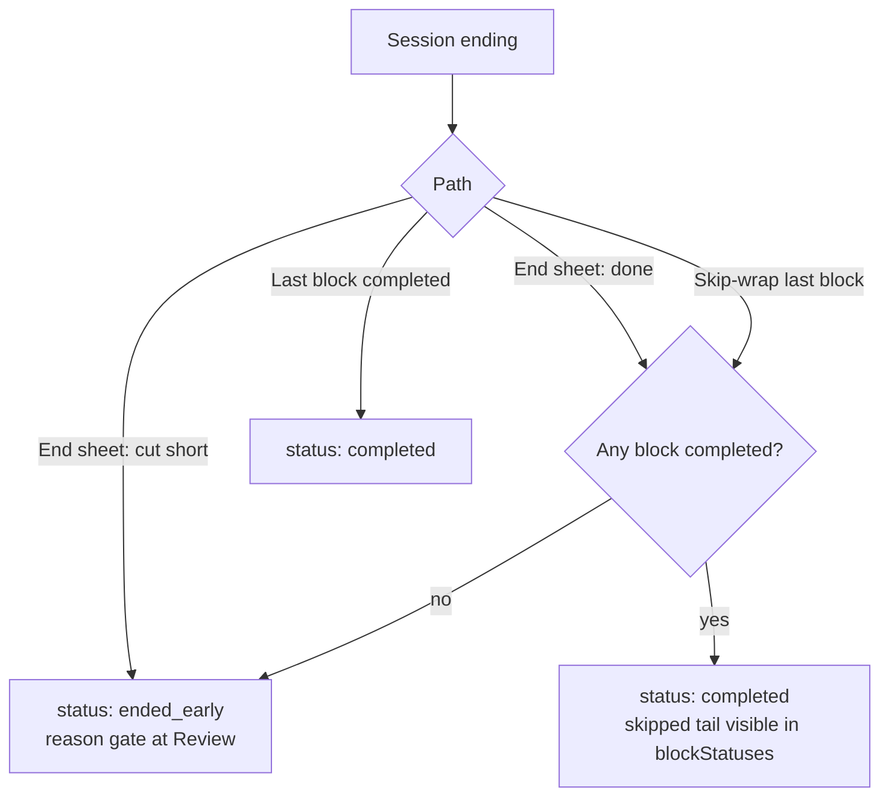
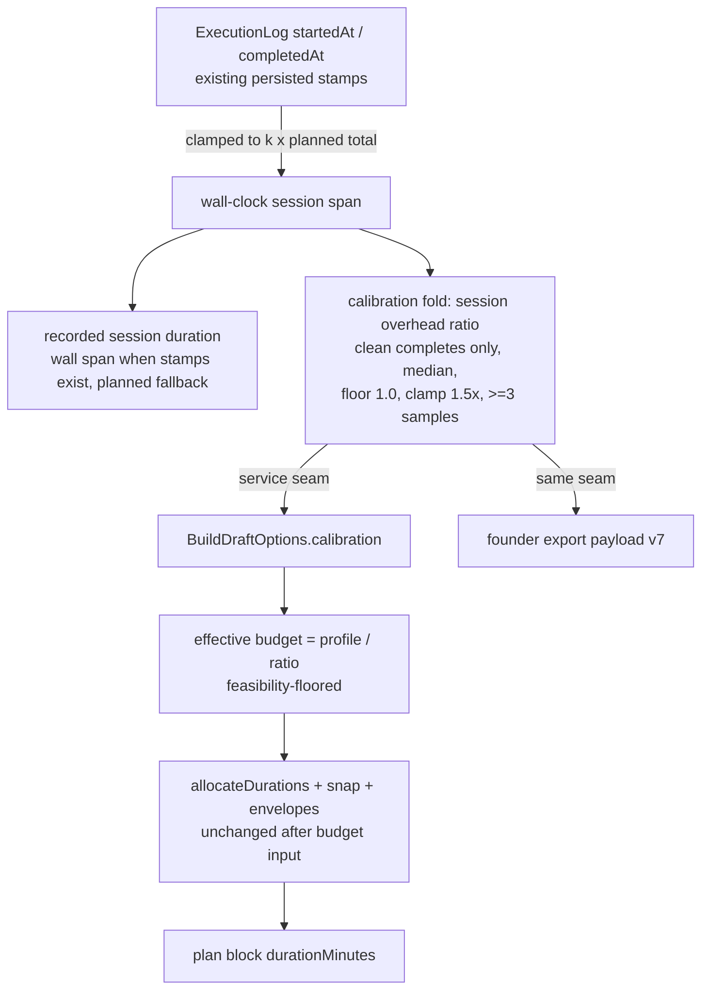

# feat: Session truth and clock calibration — honest end semantics, observed time, calibrated durations

## Summary

Make session records tell the truth at the two points they currently lie. A deliberately wrapped session records as **completed with a visible skipped tail** instead of `ended_early` abandonment, with end intent captured as one tap on the existing end sheet; zero-work ends record cut-short on every path. Recorded session duration becomes the **clamped wall-clock session span** derived from the timestamps already persisted, and a pure **session-grain calibration fold** scales the time-profile budget so the session-length promise tracks observed reality — upward-only, clamped, inert below 3 clean completes, threaded through the same `BuildDraftOptions` path the stress substrate used. No new persisted field, no schema bump, no new route, no new exposure surface; Repeat stays verbatim.

## Problem Frame

The founder's 2026-05-10 export recorded a session as `ended_early`; the founder annotated "We did not end early." The end affordance always records abandonment and Review then refuses to submit until a reason chip is picked — a forced false confession. Skipping the same remaining blocks one at a time records `completed`: courtside-equivalent wraps, opposite records. On time: `computeActualDurationMinutes` sums planned minutes, the pause-free elapsed in the singleton timer row is destroyed on every block advance, and assembly re-promises authored minutes a 2026-06-11 red-team pass found over-running in 2/2 founder field sessions. `D154` made the adaptation loop act on these records; this plan is the "record nothing false" half (origin: `docs/brainstorms/2026-06-11-session-truth-and-clock-calibration-requirements.md`).

---

## Requirements

Carried from origin (R1–R11); plan disposition per requirement.

**Session-end truth**

- R1. Ending early captures done-vs-cut-short at the end moment, one tap, no typing. Build (U1 semantics, U2 end sheet). End intent is realized as the choice of terminal status — no new intent field (KTD1).
- R2. A wrapped session is not presented as abandonment on Home/Recent, Review header, or export. Build (U1, U3). Satisfied at the persisted-representation level: wraps record `status: 'completed'`, so the raw founder dump is honest without per-surface patching (KTD1).
- R3. Review requires an end-early reason only for genuinely cut-short sessions; existing chips untouched for that case. Build (U3). System-finalized sentinels (`missing_plan`, `resume_out_of_bounds`) are also exempted — today they force the same false confession.
- R4. Skip-wrap and the end affordance converge on the same recorded meaning. Build (U1). Convergence target for zero completed blocks: cut-short on every path (KTD2).
- R5. No retroactive reclassification of existing records. Honored for status throughout: historical `ended_early` rows render unchanged. Duration is a derived read, not a persisted value, so the new wall-span rule applies uniformly to historical records — a deliberate `D150` interpretation (records untouched, reads evolve), pinned in U4 and recorded in the U6 decision row.

**Clock calibration**

- R6. Recorded session duration reflects observed time, not planned minutes. Build (U4): clamped wall-clock session span from the existing `startedAt`/`completedAt` stamps — no new banking.
- R7. Assembled plan durations calibrate against observed time. Build (U5) at **session grain**: doc review falsified the per-block-type grain — the countdown timer auto-advances at zero, so per-block elapsed is structurally capped at planned duration and per-block over-run is unobservable. The over-run lives in pauses, post-beep play, and between-screen dwell, which only the session wall span contains. AE5 is re-pinned in session-total terms (U5, U6).
- R8. Sparse or absent history leaves authored durations unchanged. Build (U5): the fold is inert below 3 qualifying sessions.
- R9. Calibration reads are deterministic and pure. Build (U5): pure fold in `domain/`, Dexie read behind a service seam, mirroring the `deriveStressPositions` / `loadStressPositions` split.

**Constraints**

- R10. New writes limited to the end-intent input. **Fully honored — better than the origin hoped:** end intent needs no new field (KTD1), and both the duration read and the calibration fold derive entirely from the session-level timestamps already persisted (KTD3, KTD5). No new persisted value, no schema bump. (An earlier draft amended this floor to bank per-block `observedSeconds`; doc review showed that source is capped at planned duration by the auto-advancing timer and would have shipped calibration permanently inert. The session-grain re-grain removed the need for the amendment.)
- R11. No new user-facing surface. Honored: the end sheet gains a second intent on the existing confirm step; duration and status displays are the only visible traces. Founder export gains the calibration read through the same seam assembly uses (`D130` dual-read, `D154` precedent).

---

## Key Technical Decisions

- **KTD1 — Wrap records as `completed` with skipped tail; cut-short stays `ended_early`; no new status union member, no new intent field.** The raw founder dump exports `executionLogs` rows wholesale, so any shape that keeps `ended_early` on wraps fails R2 at the export surface. Recording wraps as `completed` makes every existing read honest by construction: the Dexie `status`-index queries (`TERMINAL_STATUSES`/`RESUMABLE_STATUSES`), `statusLabel`'s exhaustive switch, the Run terminal redirect, and the Recent list's Done/Partial split all need no semantic patching. The skipped tail stays visible in `blockStatuses`, which is what downstream affordances key on (KTD7). Skip-wrap already lands `completed`, so R4 convergence falls out of the representation.
- **KTD2 — Zero completed blocks records `ended_early` on every path, and zero-work sessions stop steering focus.** Today skipping every block one-by-one yields a `completed` session that shows "Done" and moves the focus staleness clock with zero work done. Terminal-status derivation gains one rule: no completed block → cut-short, whether the path was skip-everything or the end sheet. The end sheet only offers "done" once at least one block has completed. The status flip alone does not stop the staleness clock — the trained-sessions basis counts all terminal sessions — so zero-completed-block sessions are also excluded from the focus-staleness input (U1), keeping the honesty claim true end to end.
- **KTD3 — Observed session duration is the clamped wall-clock session span, derived from existing stamps.** Doc review killed the planned per-block banking: the countdown timer auto-advances at zero, so its pause-aware elapsed is capped at planned duration and can never contain over-run. The signal that does contain it — pauses, post-beep play, between-screen dwell — lives in the session-level `startedAt` → terminal `completedAt` span already persisted on every log. The read clamps to a sane multiple of planned total to neutralize the app-kill/resume-hours class of inflation (the "721 min" case the repo fixed once before). Pauses count as session time deliberately: courtside rest is part of how long the session took. No new field; `D150` floor fully honored.
- **KTD4 — Recorded duration uses the clamped wall span when both stamps exist, planned-minutes rule otherwise.** Duration is a derived read, so the rule change applies to historical records too — records untouched, reads evolve (pinned in U4). Malformed records (missing terminal stamp) keep the planned-minutes fallback.
- **KTD5 — Calibration is a session-grain, upward-only, clamped median overhead ratio; inert below 3 clean completes.** Per-block and per-type grains are unobservable under the auto-advancing timer (see KTD3); session grain is also where the founder's trust break happened (duration budgeting, 2/2 field sessions). Qualifying sample: a terminal `completed` session with **no skipped tail** — clean completes only, so the planned total was fully executed and span/planned is apples-to-apples (wraps and cut-shorts would bias the ratio downward). Ratio per sample = clamped wall span ÷ planned total; median over a recent window; floor 1.0 (upward-only — the Shorten control deliberately produces short sessions that would poison downward calibration); clamp 1.5×; inert below 3 samples. Window size and exact clamps are plan-time defaults, tunable at implementation.
- **KTD6 — Calibration scales the time-profile budget before allocation; slot machinery binds unchanged.** Same threading path as `stressPositions` (`D154`): pure fold in `domain/`, service loader, option threading from `planLaunch` and Setup. The effective drill-minute budget becomes profile minutes ÷ overhead ratio (floored so allocation stays feasible against per-slot minimums), so a founder who picks a 60-minute window gets a session whose **expected wall time** lands near 60 instead of running 1.3× over. This moves the session-level promise itself rather than reshuffling a zero-sum budget between slots. Allocation, snapping, and variant envelopes apply after, unchanged; assembled drill minutes may legitimately read below the profile label (honest: less drill time fits the real window). `SESSION_ASSEMBLY_ALGORITHM_VERSION` 9 → 10 (duration semantics change). `repeatSession` stays verbatim — repeat means repeat.
- **KTD7 — Partial-repeat and shorter-version affordances key on skipped-tail presence, not `ended_early` status.** Wraps presenting as `completed` would otherwise lose the "Repeat shorter version (N min)" branch and gain a full-plan repeat that re-promises the tail the user skips. A skipped-tail predicate in `domain/` replaces the status check.
- **KTD8 — Ending gains an in-flight guard mirroring the advance dedupe.** The end sheet sits inside the pending-pause machinery the ADV-2 fix hardened; a second end intent multiplies interleavings. `endSession` gets the same dedupe shape as `advanceInFlightRef`, and the cancel path must not resume a timer after a session ended.
- **KTD9 — No Dexie change; founder export payload bumps `schemaVersion` 6 → 7.** The session-grain re-grain removed the only schema delta, so the database stays at v7 untouched. The export bump carries the calibration read (overhead ratio, sample count, qualifying-session window) through the same seam assembly uses, keeping the founder dump and assembly consistent (`D130` dual-read).

---

## High-Level Technical Design

Terminal-status derivation after this plan (the prose in KTD1/KTD2 is authoritative):

Observed-time derivation and consumption (no new persistence — everything derives from existing stamps):

---

## Implementation Units

### U1. Terminal-status semantics in domain

- **Goal:** Pure builders distinguish wrap from cut-short and derive cut-short for zero-work ends on every path.
- **Requirements:** R1, R2, R4; KTD1, KTD2; AE1, AE3.
- **Dependencies:** none.
- **Files:** `app/src/domain/executionState.ts`, `app/src/domain/executionState.test.ts`, `app/src/domain/executionPredicates.ts`, `app/src/domain/executionPredicates.test.ts`, `app/src/domain/eligibleSessions.ts`, `app/src/domain/__tests__/eligibleSessions.test.ts`, `app/src/services/planInputs.ts` (only if the exclusion seam lives there), `app/src/services/__tests__/planInputs.test.ts`.
- **Approach:** Add a wrap builder (active in-progress block → `skipped` with `completedAt`, remaining planned → `skipped`, status `completed`) alongside `buildEndedSession`; both derive `ended_early` when no block is `completed`. `buildAdvancedBlock`'s last-advance path applies the same zero-work rule (this changes the skip-everything outcome deliberately). Every terminal builder stamps the session-level `completedAt` (U4's duration read depends on it). Add a skipped-tail predicate to `executionPredicates.ts` for KTD7 consumers. Exclude zero-completed-block sessions from the trained-sessions basis feeding focus staleness (KTD2). The ADV-1 past-the-end guard is preserved untouched. No `ExecutionStatus` union change.
- **Patterns to follow:** existing pure-builder shape in `executionState.ts`; A8 single-home rule in `executionPredicates.ts`.
- **Test scenarios:**
  - Covers AE1. Wrap mid-block with 2 of 4 blocks completed → status `completed`, tail blocks `skipped`, active block `skipped` with `completedAt`.
  - Covers AE3. Skip-wrap of the same remaining blocks → same status and equivalent block meanings.
  - Wrap while paused → same outcome as wrap while running.
  - Zero-work wrap (first block in flight, nothing completed) → `ended_early`.
  - Skip every block one-by-one → `ended_early` (changed behavior, pinned).
  - Skip some blocks mid-session, complete the rest → `completed` (unchanged, pinned).
  - Cut-short via `buildEndedSession` → `ended_early` regardless of completed count.
  - Double-advance past the final block remains a no-op (ADV-1 regression).
  - Skipped-tail predicate: true for wraps and cut-shorts with skipped blocks, false for clean completes.
  - Zero-completed-block terminal session → excluded from the trained-sessions basis; a session with ≥1 completed block → counted (focus staleness clock unaffected by zero-work ends).
- **Verification:** domain suite green; no `statusLabel`/`logSelectors` compile breaks (union unchanged).

### U2. Two-intent end sheet and controller guards

- **Goal:** The end affordance captures done-vs-cut-short in one tap, safely inside the pause machinery.
- **Requirements:** R1, R11; KTD2, KTD8; AE1, AE2.
- **Dependencies:** U1.
- **Files:** `app/src/screens/RunScreen.tsx`, `app/src/screens/run/useRunController.ts`, `app/src/hooks/useSessionRunner.ts`, `app/src/hooks/useSessionRunner.test.ts`, `app/src/screens/__tests__/RunScreen.run-face.test.tsx` (or a new `RunScreen.end-intent` suite), `app/src/test-utils/runnerFixture.ts`.
- **Approach:** The existing end confirm sheet gains a second affirmative action: "done" (wrap) and "cut short" alongside "Go back" — one sheet, no second confirm step. **Display contract (pinned):** "done" renders as a non-danger affirmative, first; "cut short" carries the `D153` danger variant, second (it is the abandonment path that triggers the reason gate); "Go back" stays the safe dismiss and keeps `initialFocusRef`. When "done" renders, the sheet title drops the "early" framing (today's "End session early?" presumes abandonment); the zero-work single-action sheet keeps today's title. Exact copy is an implementation pick within courtside-copy rules. "Done" renders only when at least one block is completed (KTD2); otherwise the sheet keeps today's single end action. The runner exposes end-with-intent routing to the U1 builders. Add an end-in-flight ref mirroring the advance dedupe; the cancel/error path must not resume the timer after a terminal transition (KTD8). Copy avoids copyGuard forbidden words.
- **Patterns to follow:** `ConfirmModal` canonical confirm shape with `initialFocusRef` on the safe action (component-patterns rule); runnerFixture boolean-mock default-false convention.
- **Test scenarios:**
  - Covers AE1. Tap done with completed blocks → wrap persisted, navigates to Review.
  - Covers AE2. Tap cut short → `ended_early` persisted, Review reason gate will fire.
  - Zero completed blocks → "done" absent from the sheet; end records cut-short; title keeps the early framing.
  - Danger styling lands on "cut short" only; "done" is non-danger; "Go back" holds initial focus (display contract pinned).
  - Two-intent sheet title does not presume "early"; single-action sheet keeps today's title.
  - Double-tap an end action → one terminal transition (in-flight guard).
  - End while pending pause is in flight → awaited, no timer resume after end.
  - Go back → timer resumes, session continues (existing behavior pinned).
- **Verification:** controller and hook suites green; manual mobile pass of the sheet on the deployed preview is the dogfood-level check.

### U3. Read-surface sweep: Review gate, Home cards, Recent list

- **Goal:** Wraps present as finished everywhere; the reason gate fires only for genuine cut-shorts; partial repeat survives for wraps.
- **Requirements:** R2, R3; KTD7; AE1, AE2, AE3.
- **Dependencies:** U1.
- **Files:** `app/src/screens/review/useReviewController.ts`, `app/src/screens/__tests__/ReviewScreen.verdict.test.tsx` (touch only if gating leaks), a new `ReviewScreen` end-intent gating suite, `app/src/screens/HomeScreen.tsx`, `app/src/components/home/LastCompleteCard.tsx`, `app/src/components/RecentSessionsList.tsx`, their `__tests__`, `app/src/lib/__tests__/copyGuard.phase-c-surfaces.test.tsx`.
- **Approach:** `needsIncompleteReason` exempts the system sentinels (`missing_plan`, `resume_out_of_bounds`) alongside `discarded_resume`; wraps are `completed` so the gate self-resolves. `LastCompleteCard` re-keys **per element**, not card-wide: status copy keys on `status` (wraps read Done — "ended early" copy must never render for a wrap), while the metadata line and the repeat affordance key on the U1 skipped-tail predicate (wraps keep the honest "completed N of M · X min" and the shorter-version repeat). `HomeScreen`'s repeat-what-you-did branch keys on the same predicate. `RecentSessionsList`'s Done/Partial split stays status-keyed (wraps now correctly read Done). Historical `ended_early` rows keep today's presentation (R5).
- **Patterns to follow:** copyGuard sweep conventions (any new Home/Review copy avoids `FORBIDDEN_RE` words, notably "progress").
- **Test scenarios:**
  - Covers AE1. Wrapped session at Review → no reason chips, header reads Completed, submit enabled once RPE set.
  - Covers AE2. Cut-short at Review → chips required, submit blocked until picked (existing behavior pinned).
  - `missing_plan` and `resume_out_of_bounds` records → no reason gate (changed behavior, pinned).
  - `discarded_resume` → still bounces to Home (regression).
  - Wrap on Home → Done in Recent list; LastCompleteCard shows honest minutes and shorter-version repeat, and never renders ended-early/Partial copy (negative assertion pinned).
  - Cut-short on Home → repeat-what-you-did branch unchanged.
  - copyGuard sweep green over the updated surfaces.
- **Verification:** screens/components suites green; `npm run architecture:check` clean.

### U4. Honest recorded duration from the wall-clock session span

- **Goal:** Recorded session duration is the clamped wall-clock span derived from existing stamps; no new persistence.
- **Requirements:** R5, R6, R10; KTD3, KTD4; AE4.
- **Dependencies:** U1 (terminal builders stamp `completedAt` on every path).
- **Files:** `app/src/domain/executionState.ts` + test, `app/src/test-utils/persistedRecords.ts`; duration-formatting call sites only if the read's home moves.
- **Approach:** `computeActualDurationMinutes` becomes wall-span-based: session `startedAt` → terminal `completedAt`, clamped to a sane multiple of planned total (the "721 min" app-kill class collapses to the clamp ceiling); records missing the terminal stamp keep the planned-minutes rule (KTD4). Pauses are deliberately inside the span (KTD3). The rule applies uniformly to historical records — duration is a derived read and reads evolve; pin this interpretation with a fixture test rather than special-casing record age (which would itself require a new field).
- **Execution note:** Add the failing duration test first — the planned-vs-observed gap is the bug being fixed.
- **Test scenarios:**
  - Covers AE4. Session spanning 26 wall minutes against 20 planned → recorded ~26.
  - Pause-heavy session → paused time included in the span (pinned semantic).
  - App-kill / resume-hours gap → clamped to the ceiling, not 721 minutes.
  - Cut-short session → span from start to end stamp, honest partial duration.
  - Wrap mid-block → span ends at the wrap stamp; partial work inside the span.
  - Record missing terminal `completedAt` → planned-minutes fallback (malformed-record path).
  - Historical fixture → wall-span rule applies (read-evolution interpretation pinned, R5 status untouched).
- **Verification:** domain suite green; `npm run typecheck` clean.

### U5. Session-grain calibration fold and budget threading

- **Goal:** The session-length promise tracks observed reality, bounded and deterministic.
- **Requirements:** R7, R8, R9, R11; KTD5, KTD6, KTD9; AE5 (re-pinned at session grain — see below).
- **Dependencies:** U1 (clean-complete vs wrap distinction exists), U4 (clamped wall-span read exists).
- **Files:** new `app/src/domain/calibration/sessionCalibration.ts` + `app/src/domain/calibration/__tests__/sessionCalibration.test.ts`, new `app/src/services/calibration.ts` + test, `app/src/domain/sessionBuilder.ts`, `app/src/domain/sessionBuilder.test.ts`, `app/src/domain/sessionAssembly/durations.ts`, `app/src/services/planLaunch.ts` + test, `app/src/screens/SetupScreen.tsx` + test, `app/src/services/export.ts`, `app/src/services/__tests__/export.test.ts`.
- **Approach:** Pure fold over terminal logs joined to plans: qualifying samples are clean completes only (terminal `completed`, no skipped tail — reuses the U1 predicate); ratio per sample = clamped wall span ÷ planned total; median over a recent window, floor 1.0, clamp 1.5×, inert below 3 samples (KTD5). Service loader mirrors `loadStressPositions` (including the prefetched-records param for export consistency). Threading: `BuildDraftOptions.calibration` scales the resolved time-profile budget before allocation — effective budget = profile ÷ ratio, floored so per-slot minimums stay feasible; allocation, snapping, and envelopes bind unchanged after (KTD6). `planLaunch` steers; Setup preview/confirm threads the same option; `repeatSession` is untouched. Bump `SESSION_ASSEMBLY_ALGORITHM_VERSION` to 10 and the export payload to `schemaVersion` 7 with the calibration read.
- **AE5 re-pin:** origin AE5 pinned a warmup-grain example; per-type grain is unobservable under the auto-advancing timer (KTD3/KTD5), so AE5 is honored at session grain: history of sessions consistently running over planned (≥3 clean completes) → the next assembled session's drill-minute budget shrinks so expected wall time matches the profile; with 1 sample, assembly is unchanged. The amendment is recorded in the U6 decision row.
- **Patterns to follow:** `deriveStressPositions`/`loadStressPositions` split; seeded-randomness and golden-pin conventions in `sessionBuilder.test.ts`.
- **Test scenarios:**
  - Covers AE5 (re-pinned). Three clean completes at ~1.3× planned → next assembly's effective budget ≈ profile ÷ 1.3; with 1 sample, assembly byte-identical to uncalibrated.
  - Fold determinism: same records → same ratio (double-fold equality).
  - Upward-only: clean completes faster than planned (ratio < 1) → ratio floors at 1.0, assembly unchanged.
  - Clamp: pathological over-run capped at 1.5×.
  - Wraps and cut-shorts → excluded from the fold (skipped-tail and status checks).
  - Feasibility floor: extreme ratio against a short profile → allocation still satisfies per-slot minimums.
  - Assembly with calibration active: drill total ≤ profile budget; variant envelopes respected; determinism double-build; golden pin updated for v10.
  - Repeat: calibration never re-steers a repeated session.
  - Export: payload `schemaVersion` 7 carries the calibration read consistent with the service seam.
- **Verification:** assembly + services suites green; `npm run diagnostics:report:check` clean (plan diagnostics consume assembled plans).

### U6. Docs registry sync

- **Goal:** Canon reflects the ship.
- **Requirements:** repo doc contract (machine-scannable docs rules).
- **Dependencies:** U1–U5 shipped.
- **Files:** `docs/decisions.md` (new decision row closing the origin's debt: the AE5 session-grain re-pin, the duration read-evolution interpretation of R5/D150, and the zero-work staleness exclusion), `docs/status/current-state.md`, `docs/catalog.json` (plan + brainstorm status flips), `docs/brainstorms/2026-06-11-session-truth-and-clock-calibration-requirements.md` (frontmatter status), `app/README.md` (assembly v10, export payload v7).
- **Approach:** Follow the `D154` row shape: what shipped, pedagogy/honesty rationale, authorization boundary, named follow-ups (Transition end affordance, symmetric calibration, per-block calibration grain).
- **Test scenarios:** Test expectation: none — docs-only unit.
- **Verification:** `bash scripts/validate-agent-docs.sh` passes.

---

## Scope Boundaries

**Deferred for later** (carried from origin)

- Mid-session extend / re-entrant recomposition (Elastic Outing).
- Tap-deep "why" exposure of adaptation reasoning (parked on `D154`'s internal-first posture).
- `D154`'s named rung-steering gaps (substitution bypass, swap-path rung-awareness).
- Attack/tactics content; 3s/4s and rotation support.

**Outside this slice's identity** (carried from origin)

- Physiological load management — calibration is wall-clock honesty, never sRPE re-parameterization.
- Any adaptation movement without user acceptance.

### Deferred to Follow-Up Work

- A Transition-screen end affordance. The natural wrap moment is Transition, but skip-wrap now converges to the same honest record there, so the dedicated affordance is a UX nicety, not a truth fix.
- Symmetric (downward) calibration — requires distinguishing deliberate Shorten from genuinely short sessions, which needs persistence that is out of floor for this slice.
- Per-block (or per-type) calibration grain — unobservable today because the countdown timer auto-advances at zero. Requires either banking pause spans per block (new persistence) or letting the timer run into overtime with user-confirmed advance (a product-behavior change needing brainstorm-level authorization). Revisit if session-grain proves too coarse in dogfood.
- Display-time mapping of historical `ended_early` wraps (origin R5 keeps them as-is; a future presentation pass could soften the "Partial" label for old records with completed work).

---

## Risks & Dependencies

- **Assembly churn:** scaling the budget input interacts with the 2026-05-24 duration-honesty machinery (snapping, envelopes, source-backed reroutes). Mitigation: calibration moves only the budget before the existing constraint stack, which binds unchanged; the feasibility floor keeps allocation solvable; golden-pin and determinism tests gate the change; v10 marks the semantics.
- **Setup display surprise:** with calibration active, assembled drill minutes read below the profile label (a 60-minute pick may assemble ~46 drill minutes). Honest by design — the promise being kept is wall time — but watch it in dogfood; copy softening is a follow-up, not new exposure.
- **Historical duration reads change:** wall-span durations apply to old records too (KTD4). Derived-read evolution, status untouched; the U6 decision row records the interpretation so it is challengeable.
- **Skip-everything behavior change:** zero-work skip-wraps now record `ended_early` and stop counting toward focus staleness. Deliberate (KTD2), but it changes a terminal status some flows read; the U1 pins and the Review-gate exemptions in U3 cover the fallout. Note: zero-work cut-shorts will hit the Review reason gate — honest, since nothing was trained.
- **End-sheet race surface:** the ADV-1/ADV-2 history says this seam breeds races. The in-flight guard (KTD8) plus the pinned interleaving tests are the mitigation; keep the sheet single-step.
- **runnerFixture drift:** the fixture maps `ended_early` to an in-progress active block and defaults boolean mocks to false; U2 must update it deliberately rather than working around it.

---

## Sources & Research

- Origin: `docs/brainstorms/2026-06-11-session-truth-and-clock-calibration-requirements.md` (R-IDs, AE1–AE5, key decisions).
- `docs/decisions.md` — `D150` (derive-don't-persist + persistence floor), `D151`, `D152`, `D153` (end-sheet danger semantics), `D154` (threading precedent, internal-first posture, labelled-boundary convention).
- `app/src/domain/executionState.ts`, `app/src/hooks/useSessionRunner.ts`, `app/src/hooks/useTimer.ts` — verified end/advance/timer semantics, including the ADV-1/ADV-2 fixes and the `clearTimerState()` destruction of pause-free elapsed.
- `app/src/services/session/logSelectors.ts`, `app/src/domain/executionPredicates.ts`, `app/src/services/session/queries.ts`, `app/src/components/RecentSessionsList.tsx`, `app/src/components/home/LastCompleteCard.tsx`, `app/src/screens/review/useReviewController.ts`, `app/src/services/export.ts`, `app/src/services/export/sessionExport.ts` — the complete `ended_early` read-surface inventory (note: the per-session adapter is `schemaVersion: 1`; the founder dump is the v6 payload this plan bumps to 7).
- `app/src/domain/sessionAssembly/durations.ts`, `snapDurations.ts`, `candidates.ts`, `app/src/domain/sessionBuilder.ts` — duration allocation pipeline and the d01 duration-fit special case; `SESSION_ASSEMBLY_ALGORITHM_VERSION` convention.
- `app/src/domain/adaptation/stressPosition.ts`, `app/src/services/stressPositions.ts`, `app/src/services/planLaunch.ts` — the `D154` fold/seam/threading pattern this plan copies.
- `app/src/db/schema.ts` — v5/v6/v7 labelled-boundary bump convention.
- `docs/reviews/2026-06-11-red-team-review.md` — duration budgeting flagged in 2/2 founder field sessions; ADV-1/ADV-2 provenance.
- 2026-06-11 flow analysis (planning-time): per-block pause-free time unrecoverable from persisted records; zero-work convergence gap; system-sentinel false confession; Shorten poisoning risk; calibration-vs-budget precedence — all resolved in KTDs above.
- 2026-06-11 doc review (five-persona pass): timer auto-advance caps per-block elapsed at planned duration, falsifying the per-block-type calibration grain — re-grained to session-level budget calibration (KTD3/KTD5/KTD6); end-sheet display contract, per-element Home-card keying, and the zero-work staleness exclusion also originate here.
