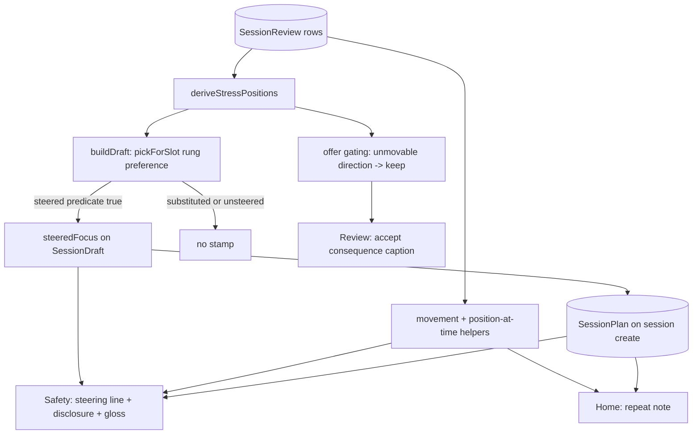

# feat: Stress visibility — v1 trust loop

## Summary

Make the D154 stress steering legible without touching the run face. The Review accept gains a hedged drill-exemplar consequence line, the Safety screen cashes accepted deltas with one quiet steering line plus a one-time disclosure and an evergreen "how sessions adapt" gloss, and Home notes when a repeat's plan has moved since that session was assembled. Every trace derives from a single build-time "steered" predicate persisted as assembly metadata or from movement-based folds over existing records, and verdict offers become position-aware so nothing is ever offered that cannot act.

## Problem Frame

`D154` shipped rung-steered assembly with exposure deferred: the only visible trace is the carry-forward line, and the steering's proof is visible nowhere. The origin brainstorm converged on a trust loop at the deliberate-reading moments, bound by two display rulings (no raw rungs ever; present-tense only) and an honesty gate (no trace may assert steering that did not happen).

Flow analysis against the shipped assembly paths found the brainstorm's surface placement unreachable on the app's primary flow, and a latent honesty bug in the existing offer logic. Both were resolved with the founder during planning (see Revisions below).

---

## Revisions to the Origin Document

Two requirements-level revisions, founder-ratified 2026-06-11 during planning:

- **Trace surface is Safety, not the Setup preview** (revises origin R6/R9/R10 and the "new lines live on Setup, Review, and the repeat path only" dependency note). Ground truth: `startPlanSession` — the focal Home CTA — routes Home → Safety and never passes Setup, and Recommended-focus Setup builds are never steered (steering keys on an explicit scoped `sessionFocus`). Safety is the one pre-run surface every steered session traverses (`D137`: never skipped). The Setup preview ships unchanged. The gloss availability condition also changes from the origin's unconditioned evergreen: it appears only once the athlete has ever been steered, and from then on stays reachable on every Safety visit including repeats (doc-review finding: the Home repeat note points users into Safety, which must be able to answer it).
- **Position-aware offer gating** (new requirement R15). The verdict offer derives purely from difficulty signals and never consults position; at a ladder bound it offers a delta that acceptance cannot act on — the existing carry-forward line then asserts steering that will not happen, violating R11 before any new surface ships. Offers that cannot move the position are no longer made.

Acceptance examples AE2, AE3, and AE5 are re-anchored to Safety accordingly; AE7 is added for the gating.

---

## Requirements

Carried from origin (R1–R14) with dispositions; R15 added during planning.

**Display rulings (bind every unit)**

- R1. No user-facing surface renders a raw stress-rung number, ladder position integer, or per-focus scale. Pinned by screen tests (AE6).
- R2. Visible stress state is present-tense only; no history, trends, or dated movement.
- R3. No new athlete-facing stress vocabulary; all copy uses the existing carry-forward voice.

**Review verdict**

- R4. The accept option at Review shows one short hedged exemplar line naming a drill at the prospective position (one rung in the delta's direction). Build (U3). Rendered as a caption tied to the accept option, not inside the chip label; the origin's em-dash copy is reworded per the courtside punctuation rule.
- R5. The exemplar frames a tendency, never a promise ("lean toward … like"). Build (U3).
- R15. No delta is offered when acceptance cannot move the position (ladder bound). Build (U2).

**Steering trace (surface revised to Safety)**

- R6. Safety shows one quiet steering line ("A bit more stress on setting today.") on the next steered session per focus after a position-moving accepted delta, and renders nothing otherwise. Build (U4).
- R7. The line renders only when the loaded session's assembly was actually rung-steered on that focus. Build (U1 provenance + U4).

**Repeat path**

- R8. Home shows a one-line note only when the focus position has moved since the repeated session was assembled; repeat assembly behavior is unchanged by this plan. Build (U5). Copy claims same conditions, not "as-is" — repeat re-rolls selection with a fresh seed.

**Disclosure**

- R9. The first steered session's Safety screen shows a one-time dismissable disclosure stating that the plan quietly adjusts challenge and the athlete approves every change; it never repeats after explicit dismissal. Build (U4).
- R10. An evergreen on-demand "how sessions adapt" gloss is reachable from every Safety visit once the athlete has ever been steered, so the contract stays readable on repeats and unsteered sessions; it never appears before the first steered session. Build (U4).

**Honesty gate**

- R11. No steering trace may assert steering that did not happen. Bind: every trace derives from the single steered predicate (U1) or movement-based folds (U2).
- R12. The build-time main-skill substitution path suppresses the steering trace for that session (rung-aware substitution deferred). Build (U1).

**Constraints**

- R13. No Dexie schema change and no new capture fields; the disclosure dismissal flag persists through the existing key-value storage pattern. Bind — see KTD2 for the provenance-stamp interpretation, founder-ratified.
- R14. All new lines derive at render time from existing records, deterministically. Bind.

---

## Key Technical Decisions

- **KTD1 — Single "steered" predicate, fixed at build time, on realized outcomes.** Steered means: scoped `sessionFocus` present, derived position resolved for it, the `main_skill` pick made via `pickForSlot`'s rung preference (not the substitution path), and the picked drill's authored rung equal to the steer-target position. Rung preference is a preference in shipped code — nearest-rung fallback and the duration-fit reroute can land the pick off-target — and a mechanism-level stamp would let the line claim stress the session does not contain; off-target picks fail quiet exactly like substitution (doc-review finding, both feasibility and adversarial reviewers). One definition feeds the steering line, the disclosure trigger, and promise consumption. Rationale: three surfaces deriving "steered" independently would drift; flow analysis showed the term was previously undefined.
- **KTD2 — Persisted steering provenance.** An optional `steeredFocus` stamped on `SessionDraft` at build time and carried to `SessionPlan` on session create. Rationale: steered and unsteered plans are otherwise indistinguishable in persisted records (a repeat re-roll stamps the same algorithm version), so the cash trigger cannot be derived purely — Repeat would falsely consume the promise. The stamp is assembly metadata in the family of `assemblySeed` / `assemblyAlgorithmVersion`: non-indexed (no Dexie version bump) and not a capture field, so R13's intent holds. Founder-ratified.
- **KTD3 — Safety is the trace surface.** Steering line, one-time disclosure, and gloss render on `SafetyCheckScreen` from the saved draft's provenance. Founder-ratified; see Revisions.
- **KTD4 — Position-aware offer gating at the offer seam.** `computeVerdictOffer` consults the derived position and ladder bounds after replay; a direction that cannot move the position degrades to keep. `replayAdaptation`'s hysteresis stays untouched. The gating position derives through the `loadStressPositions` seam (passing the offer service's already-loaded reviews as the prefetched snapshot) rather than a parallel band-read-plus-fold, so the gate can never diverge from the steering input (D150 single seam); `loadVerdictOffer` returns the resolved position alongside the offer so the U3 caption reuses the same fold. Gating prevents unmovable offers at offer time; a concurrent deferred accept on the same focus between offer and submit can still produce a clamped accept, so the movement-based derivations below guard both that race and pre-gating historical records.
- **KTD5 — Movement-based cash trigger, consumed by training.** Armed for focus F when the latest accepted review on F moved the position (fold-compare including vs excluding that review) and no terminal session with `steeredFocus === F` was assembled after it. The line additionally renders only on a draft built after the arming accept's `submittedAt`: a steered draft assembled before the accept (a stale draft resurfaced from Home after a deferred review) was steered at the old position and renders nothing. Requiring a terminal session means a built-then-discarded draft does not burn the promise. The line's direction anchors on the accepted plan state ratified at Review, not the athlete's last trained session — netted opposite accepts therefore render the latest accepted direction even when the resulting position matches lived sessions; this anchoring is deliberate (the line confirms the contract in effect). The failure direction is quiet: a repeat carries no provenance and can never consume.
- **KTD6 — Trace suppression for substitution, not rung-aware substitution.** A substituted `main_skill` pick yields no `steeredFocus`, so every trace stays silent for that session (R12 satisfied). No `SESSION_ASSEMBLY_ALGORITHM_VERSION` bump — selection semantics are unchanged in this plan; only metadata is added. Rung-aware substitution is a deferred follow-up (it would be a semantics change, version 9 → 10).
- **KTD7 — Repeat note on Home, claiming conditions.** Rendered beside the repeat affordances pre-tap, where the decision happens. Derivation: position at the repeated plan's `createdAt` (timestamp-filtered fold) vs now; focus from the plan's context, falling back to `inferSessionFocus`; non-scoped focus → no note. Net-zero movement → no note.
- **KTD8 — Deterministic exemplar candidate rule.** Candidates are the drills at the prospective rung that are assembly-available and eligible under the reviewed session's context, excluding the drill just trained; first-authored ladder order picks among them. No candidate (empty rung, or every drill ineligible or assembly-blocked) renders no caption — never a wrong-direction or unassemblable drill.
- **KTD9 — Copy register.** All lines in the shipped carry-forward voice; the 'less' direction reuses the "Ease the stress…" voice ("Easing the stress on setting today."). No em-dashes (`U+2014`) in any user-visible string; no "rung" / "ladder" / "steered" vocabulary (jargon gate). New lines claim plan-action, never athlete improvement (progress-signal learning). Exact copy finalized at implementation under the courtside rules; lines here are directional.

---

## High-Level Technical Design

Derivation spine — everything renders from existing records plus the one provenance stamp:

Render conditions (the honesty gate as a table):

| Trace | Surface | Renders when | Goes quiet when |
|---|---|---|---|
| Accept consequence caption | Review | A movable delta is offered (post-gating) and the prospective rung has an exemplar | Offer is keep / gated; empty prospective rung |
| Steering line | Safety | Draft is steered on F, built after the arming accept, and the promise is armed (position-moving accept on F, not yet cashed by a terminal steered-F session) | Promise consumed, draft built before the accept, pain override active, or draft unsteered / substituted / repeat |
| Disclosure | Safety | Draft is steered, dismissal flag unset, no pain override active | Explicitly dismissed (flag set on dismissal only, never on render) |
| Gloss ("how sessions adapt") | Safety | Athlete has ever been steered (collapsed expander, on demand) | Never steered yet, or pain override active |
| Repeat note | Home | Repeated plan's focus position differs between its assembly time and now | No movement, net-zero movement, or non-scoped focus |

---

## Implementation Units

### U1. Steered predicate and build provenance

- **Goal:** One build-time definition of "steered," stamped as optional provenance on the draft and carried to the plan record.
- **Requirements:** R7, R11, R12, R13, R14.
- **Dependencies:** none.
- **Files:** `app/src/domain/sessionBuilder.ts`, `app/src/model/draft.ts`, `app/src/model/session.ts`, `app/src/services/session/` (`createSessionFromDraft`), `app/src/domain/sessionBuilder.test.ts`, `app/src/services/__tests__/planLaunch.test.ts`.
- **Approach:** `buildDraftResult` sets `steeredFocus` on the returned draft only when the session focus is scoped, `stressPositions` resolved a position for it, the `main_skill` slot was selected via `pickForSlot` (the up-front `mainSkillSubstitute` did not fire), and the picked drill's authored rung equals that position (KTD1 realized-outcome rule). Optional non-indexed field on `SessionDraft` and `SessionPlan`; `createSessionFromDraft` copies it through. Update the "known v1 bypass" JSDoc on `BuildDraftOptions.stressPositions` to record that the bypass now suppresses traces. No algorithm version bump. Confirm the founder-export treatment of the additive field in this unit — the export ships raw `SessionPlan` rows (`app/src/services/export.ts`) and a curated payload (`app/src/services/export/sessionExport.ts`); decide whether the payload `schemaVersion` bumps and record the outcome.
- **Patterns to follow:** `assemblySeed` / `assemblyAlgorithmVersion` stamping in `sessionBuilder.ts`; optional-field convention noted in `app/src/model/adaptation.ts`.
- **Test scenarios:**
  - Explicit scoped-focus build with positions → draft stamped with that focus.
  - Focus-absent (Recommended) build with positions → no stamp.
  - Scoped-focus build without positions → no stamp.
  - Covers AE5 (build half). Scoped-focus steered build where the substitution rule fires → no stamp.
  - Realized-outcome rule: nearest-rung fallback off the target rung → no stamp; duration-fit reroute off the target rung → no stamp.
  - `repeatSession` build → no stamp; `startPlanSession` build → stamped with the plan's next focus (service tier, fake-indexeddb).
  - Integration: stamp survives `createSessionFromDraft` onto the persisted `SessionPlan`.
- **Verification:** Builder tests pin the predicate truth table; a steered plan-launch round-trip shows the stamp on the stored plan; the founder-export version-bump decision for the additive field is recorded.

### U2. Prospective-position helpers and offer gating

- **Goal:** Domain helpers for prospective position, movement detection, and position-at-timestamp; the verdict offer consults them so unmovable directions are never offered.
- **Requirements:** R15, R11; helpers serve the R6 and R8 derivations.
- **Dependencies:** none (parallel with U1).
- **Files:** `app/src/domain/adaptation/stressPosition.ts`, `app/src/domain/adaptation/verdictOffer.ts`, `app/src/services/verdictOffer.ts`, `app/src/domain/adaptation/__tests__/stressPosition.test.ts`, `app/src/domain/adaptation/__tests__/verdictOffer.test.ts`, `app/src/screens/__tests__/ReviewScreen.verdict.test.tsx` (re-seed; see approach).
- **Approach:** Gating lands at the `computeVerdictOffer` seam, after replay: if the proposed direction is clamped for that focus at the current position, return keep. The position derives through the `loadStressPositions` seam with the offer service's already-loaded reviews prefetched (KTD4); `loadVerdictOffer` returns `{ offer, position }` so U3 reuses the same fold. The existing verdict screen test seeds two too-hard pass sessions with no skill level — exactly the AE7 ladder-floor fixture — so its 'less'-offer assertions go red the moment gating lands; re-seed it in this unit (an accepted 'more' verdict or a persisted `onboarding.skillLevel`) so the suite stays green before U3 touches the file. Helpers: positions folded from reviews filtered by `submittedAt <= t`; "did this accept move the position" as a fold-compare.
- **Test scenarios:**
  - Beginner at rung 1 with a too-hard trend → no 'less' offer (Covers AE7).
  - Advanced serve at serve's ladder top → no 'more' offer (Covers AE7).
  - Mid-ladder trends → offers unchanged from today.
  - Gating composes with declined-re-offer hysteresis: a gated direction does not poison later offers in the other direction.
  - Position-at-timestamp: reviews after `t` excluded from the fold.
  - Movement detection: a historical clamped accept reports no movement.
- **Verification:** Offer tests prove no offer is ever proposed whose acceptance leaves the position unchanged.

### U3. Review accept consequence line

- **Goal:** The accept option shows its concrete consequence as a hedged drill exemplar.
- **Requirements:** R1, R3, R4, R5, R14.
- **Dependencies:** U2.
- **Files:** `app/src/domain/adaptation/acceptConsequence.ts` (new composer), `app/src/screens/review/useReviewController.ts`, `app/src/screens/ReviewScreen.tsx`, `app/src/domain/adaptation/__tests__/acceptConsequence.test.ts`, `app/src/screens/__tests__/ReviewScreen.verdict.test.tsx`.
- **Approach:** Pure composer takes focus, direction, current position, the reviewed session's context, and the just-trained drill id; returns an exemplar drill name or null (KTD8 candidate rule). The current position comes from U2's `loadVerdictOffer` return — one fold serves the gate and the caption. Domain may import `data/stressLadders` and `catalogLookup` per the inward-dependency rule. Rendered as a caption beneath the verdict `ChoiceRow` and programmatically tied to the accept option via `aria-describedby` from the "Try it" chip to the caption's id (`ChoiceRowOption` gains an optional described-by hook), so assistive tech hears the consequence on the option it qualifies; chip labels stay "Keep the same" / "Try it". Directional copy: "Setting sessions lean toward drills like Set and Look."
- **Patterns to follow:** `composeCarryForwardLine` voice contract in `replayAdaptation.ts` (sentence shape, ≤45 words, no `\u2014`, pinned by test); caption placement mirroring the existing verdict card structure in `ReviewScreen.tsx`.
- **Test scenarios:**
  - Covers AE1. Set position 1, 'more' offered → caption names the rung-2 drill.
  - 'Less' at position 2 → caption names the rung-1 drill.
  - Candidate rule: multi-drill prospective rung picks the first-authored assembly-available, context-eligible drill, excluding the just-trained drill; an all-ineligible rung renders no caption; deterministic across calls.
  - No offer / keep → no caption.
  - Covers AE6 (Review slice). Caption never contains `\u2014`, "rung", or a number rendered as a position.
  - Screen test: seeded real offer renders the caption inside the verdict card (extend the existing verdict screen test's seeding).
- **Verification:** Review shows consequence captions exactly when a movable offer exists, with deterministic exemplars.

### U4. Safety steering trace: cash-the-promise line, disclosure, gloss

- **Goal:** Safety renders the steering line on the next steered session per focus after a position-moving accept, the first-steered one-time disclosure, and the evergreen gloss.
- **Requirements:** R1, R2, R3, R6, R7, R9, R10, R11, R13, R14.
- **Dependencies:** U1, U2.
- **Files:** `app/src/domain/adaptation/steeringTrace.ts` (new pure selector), `app/src/services/steeringTrace.ts` (new read seam), `app/src/screens/SafetyCheckScreen.tsx`, `app/src/domain/adaptation/__tests__/steeringTrace.test.ts`, `app/src/services/__tests__/steeringTrace.test.ts`, `app/src/screens/__tests__/SafetyCheckScreen.steering-trace.test.tsx`.
- **Approach:** Armed(F) per KTD5, including the built-after-the-arming-accept condition; the service reads reviews, plans, terminal logs, and the current draft through existing service seams (terminal join mirrors `planInputs`' trained-sessions notion), and every position fold resolves the skill band through the same `onboarding.skillLevel` read assembly uses (the `loadStressPositions` seam pattern) — a beginner-default fold silently mis-derives movement for non-beginner users. Line direction comes from the armed accepted delta; voice per KTD9. Disclosure renders when the draft is steered and `ux.adaptDisclosureDismissed` is unset; the flag is written on explicit dismissal only — a small quiet "Got it" button inside the disclosure `Callout` with a ≥44px touch target (the preroll-hint precedent supplies flag persistence only, not the affordance; its flag flips automatically) — so a glanced-past disclosure re-shows. Disclosure and steering line may coexist (the disclosure states the contract; the line instantiates it). Gloss is a collapsed `Expander` labeled "How sessions adapt," rendered on every Safety visit once the athlete has ever been steered (derivable as: current draft steered, or any persisted plan carries `steeredFocus` — keeps the contract reachable on the repeat flow the Home note points into), mirroring the heat-tips expander on the same screen; content states the contract in jargon-gated plain language (sessions adapt as you train; you approve every change at review; repeat repeats; nothing moves without an accept). Placement: steering line + disclosure render as one quiet block at the top of `ScreenShell.Body` above the recency question; the gloss expander sits directly beneath the heat-tips expander; the trace read joins the screen's existing parallel draft load so the elements never pop in after first paint (this screen has documented 390x844 fold-overflow history — verify the worst-case stack keeps both safety questions and the Start session footer reachable). While the pain override is active, all three elements suppress: the created session is the recovery rebuild, which carries no provenance, stays trace-quiet, and does not consume — the shipped recovery copy must not coexist with a steering claim. Note: Home's carry-forward summary uses global-latest-verdict semantics (`resolveLastAcceptedDelta`) while the Safety line is per-focus armed — the two can intentionally tell different stories; record this in code comments so it is not later "fixed."
- **Test scenarios:**
  - Covers AE2. Accept on set → next steered set draft's Safety shows the line; after that session is trained, the following steered set draft shows no line.
  - Covers AE3. First steered session with no accepted deltas yet (seed one prior trained session so `startPlanSession` has its required `priorContext`; zero accepted verdicts) → no steering line; disclosure shows; after explicit dismissal it never re-renders; without dismissal it re-shows next steered Safety.
  - Stale steered draft built before the arming accept (back out of Safety, accept a deferred review on the same focus, re-enter) → no line.
  - Pain override active → line, disclosure, and gloss all suppress; the recovery rebuild carries no provenance and does not consume.
  - Covers AE5. Substituted build (no provenance) → no line, no disclosure trigger; the gloss renders only if an earlier session was steered.
  - Repeat draft after an accept → no line for it, and it does not consume (the next steered build still shows the line).
  - Built-then-discarded steered draft does not consume.
  - Deferred review: an accept submitted after a plan was created does not count that plan as consuming.
  - Per-focus isolation: accept on pass does not arm set.
  - Historical clamped accept (pre-gating record) → not armed, including under a non-beginner band fixture (band-dependent starting rungs make the beginner default mask exactly this case).
  - 'Less' direction renders the easing voice.
  - Covers AE6 (Safety slice). No raw numbers or reserved vocabulary in any line.
  - Service test over fake-indexeddb; screen test for line, disclosure, dismissal write, and gloss presence/absence.
- **Verification:** The Safety trace truth table in High-Level Technical Design holds end-to-end against seeded records.

### U5. Home repeat note

- **Goal:** A one-line note beside the repeat affordances when the focus position moved since the repeated session was assembled.
- **Requirements:** R8, R2, R3, R14.
- **Dependencies:** U2; U4 for file sequencing (the repeat-drift selector lands in `steeringTrace.ts`, created in U4).
- **Files:** `app/src/domain/adaptation/steeringTrace.ts` (repeat-drift selector lives with the trace selectors), `app/src/services/planInputs.ts`, `app/src/screens/home/useHomeScreenState.ts`, `app/src/screens/HomeScreen.tsx`, `app/src/services/__tests__/planInputs.test.ts`, `app/src/screens/__tests__/HomeScreen.repeat-note.test.tsx`.
- **Approach:** Focus from the repeated plan's `context.sessionFocus`, falling back to `inferSessionFocus(plan.blocks)`; non-scoped → no note. Fold-compare positions at `plan.createdAt` vs now (U2 helper), resolving the skill band the same way assembly does — the fold is band-dependent (see U4). The note renders inside whichever surface currently hosts the active Repeat affordance (the last-complete primary card or the secondary row), not at a fixed Home position. Directional copy: "Repeating with the same setup. Your plan has moved since."
- **Patterns to follow:** `resolveLastAcceptedDelta` shape in `planInputs.ts` for the input extension; `CarryForwardCell` rendering for a quiet Home line.
- **Test scenarios:**
  - Covers AE4. Accept after the last session → note renders; no movement since assembly → no note.
  - Accept-up then accept-down (net zero) → no note.
  - Clamped accept (no movement) → no note.
  - Legacy plan without persisted context → focus inferred from blocks; non-scoped inference → no note.
  - Covers AE6 (Home slice). The repeat note never contains `\u2014`, "rung", or a number rendered as a position.
  - Screen test: note renders beside the repeat actions only under movement.
- **Verification:** Note presence tracks actual position drift, never accept count.

### U6. Docs and decision trail

- **Goal:** Record the exposure-posture revision and keep machine-scannable surfaces in sync at ship time.
- **Requirements:** Traceability for the R6/R9/R10 surface revision, R15, and the D154 named-follow-up disposition.
- **Dependencies:** U1–U5.
- **Files:** `docs/decisions.md`, `docs/status/current-state.md`, `docs/catalog.json`, `docs/brainstorms/2026-06-11-stress-visibility-trust-loop-requirements.md` (status flip to complete).
- **Approach:** New decision row recording: session-level stress copy now renders on Safety, Review, and Home while the rung itself never renders (revises D154's exposure deferral and the stress-substrate brainstorm's R11/R14 posture — `docs/brainstorms/2026-06-11-stress-substrate-requirements.md`, "no new user-facing stress surface" / "the rung is never rendered copy"; not this plan's R11/R14, which are unrevised binds); position-aware offer gating; the provenance-stamp R13 interpretation; substitution trace suppression with rung-aware substitution as the named deferral; the honesty-gate boundary (assembly assertions, not user-initiated mid-run swaps). Flip plan/brainstorm catalog statuses.
- **Test expectation:** none — docs-only unit.
- **Verification:** `bash scripts/validate-agent-docs.sh` passes.

---

## Scope Boundaries

### Deferred to Follow-Up Work

- Rung-aware main-skill substitution (selection-semantics change; `SESSION_ASSEMBLY_ALGORITHM_VERSION` 9 → 10). Suppression covers v1 honesty.
- Mid-run swap rung-awareness. The honesty gate covers assembly assertions; a user-initiated swap does not retroactively falsify a true-at-assembly trace.
- Stale comment in `app/src/screens/transition/useTransitionController.ts` claiming `swapBlock` is level-aware — verify and fix alongside any swap work.
- Recommended-focus Setup builds remain unsteered (no scoped focus to steer on); revisit if Setup ever resolves the recommended focus pre-build.

### Deferred for later (carried from origin)

- Drill-level marks during runs — exception-only "stretch," reopened only on dogfood evidence.
- Position legibility (pull-gloss, place vocabulary, ladder atlas) beyond the founder export.
- CI-dimension tags on rungs — M002.2, with coach-language traces recorded there.
- Rung-audit diagnostics — rider on the next diagnostics pass.
- Replay-stream definition — settle before M002.2 adds event types.
- Mid-session visible downshift — own consent-exemption policy fork.

### Outside this feature's identity (carried from origin)

- Absolute difficulty scores, badges, or always-on per-drill labels.
- Position history, trends, or charts.
- Auto-applied position movement without an accepted verdict.
- Athlete-set rung dial.

---

## Acceptance Examples

- AE1. **Covers R4, R5.** Athlete at set position 1 is offered "a bit more stress on setting." The accept option carries the caption "Setting sessions lean toward drills like *Partner Set Back-and-Forth*" (the rung-2 drill).
- AE2. **Covers R6.** (Revised: Safety.) After accepting, the next steered setting session's Safety screen shows "A bit more stress on setting today." The steered setting session after that, with no new accepted delta, shows no steering line.
- AE3. **Covers R6, R9.** (Revised: Safety.) An athlete with one prior trained session and no accepted deltas launches their next plan from Home — their first steered session (`startPlanSession` requires a prior context, so a literal first-ever session cannot take this path): Safety shows the one-time disclosure and no per-session steering line; after dismissal the disclosure never returns.
- AE4. **Covers R8.** Athlete accepts a delta, then taps Repeat last session: the repeat note appears on Home. Repeating when no position has moved since that session was assembled: no note.
- AE5. **Covers R7, R11, R12.** (Revised: Safety.) The main-skill substitution rule fires for a session: that session carries no steering provenance, its Safety screen shows no steering line, and it does not trigger the disclosure; the gloss appears only if an earlier session was steered.
- AE6. **Covers R1, R3.** Nowhere in v1 does the UI render a rung number, the word "rung," or any new stress vocabulary.
- AE7. **Covers R15, R11.** An advanced athlete at serve's ladder top logs a too-easy trend: no "more stress on serving" delta is offered, and no consequence caption renders.

---

## Risks & Dependencies

- **Offer gating changes Review behavior at bounds** for existing users (including the founder): fewer offers near ladder tops/bottoms. Intended — an offer that cannot act is the dishonesty being removed.
- **Pre-gating historical records** may contain clamped accepts. All new derivations are movement-based, so they stay quiet rather than rendering false lines.
- **Provenance stamp on persisted records** is additive and optional; legacy drafts/plans without it read as unsteered, which fails in the quiet direction.

---

## Sources & Research

- Steering ground truth: `app/src/domain/sessionAssembly/candidates.ts` (stress lookup keys on `context.sessionFocus`), `app/src/domain/sessionBuilder.ts` (up-front substitution bypass + "known v1 bypass" JSDoc), `app/src/services/planLaunch.ts` (plan-launch steers and routes Home → Safety; repeat never steers).
- Surface precedents: `app/src/screens/SafetyCheckScreen.tsx` (heat-tips `Expander`, footer/Callout patterns), `ux.prerollHintDismissed` one-time-flag pattern in `app/src/screens/run/useRunController.ts` + `app/src/screens/__tests__/RunScreen.preroll-hint.test.tsx`, gloss atoms in `app/src/components/ui/` (`useGloss`, `GlossInline`, `GlossedText`).
- Voice and copy law: `app/src/domain/adaptation/replayAdaptation.ts` (`MORE_LINES` / `LESS_LINES` / summaries; no-em-dash pin), `.cursor/rules/courtside-copy.mdc` rules 2 and 4; `docs/solutions/design-patterns/low-dose-self-coached-progress-signal-design.md` (claim plan-action, not improvement).
- Architecture: `.cursor/rules/data-access.mdc` layer rules; `docs/solutions/architecture-patterns/d137-canonical-pre-run-spine-setup-safety-2026-05-07.md` (Safety is never skipped); `app/src/services/stressPositions.ts` single-seam JSDoc (D150 dual-read).
- Origin and canon: `docs/brainstorms/2026-06-11-stress-visibility-trust-loop-requirements.md`; `docs/specs/stress-rung-taxonomy.md` (uneven ladder tops behind R1 and the clamp analysis); `docs/decisions.md` D154, D152, D150, D137. External digest carried from origin: TrainerRoad accept-diff and relational labels; Kizilcec transparency-expectation findings; hidden-DDA trust breach; orthosomnia metric anxiety.
