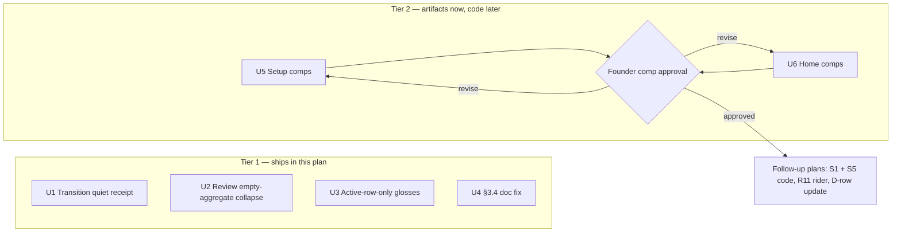

# feat: Shibui empty-space polish — direct-ship quiet wins + structural comps

## Summary

Ship the 2026-06-11 shibui research pass in two tiers. Tier 1 (code, this plan's executable units): demote Transition's previous-block receipt to one quiet line (S2), collapse the empty Good-passes card on Review to a single quiet line (S3), render gloss underlines only on the active segment row of the run face (S4), and reconcile `brand-ux-guidelines.md` §3.4 (S6). Tier 2 (artifacts only): produce the 390×844 screenshot comps that gate the Setup recommendation-first restructure (S1) and the Home link-pile relocation (S5) — their code ships in follow-up work after founder comp approval, not here. Zero semantic, route, or data changes anywhere; every item independently revertible against founder-use gates in the D130 window.

---

## Problem Frame

The research pass (`docs/design/reviews/2026-06-11-shibui-empty-space-research-pass.md`) found the run flow is the app's best `ma`; the gaps are at the edges. Founder-confirmed friction: the Home `last_complete` card stacks six text elements with an underlined escape-link pile inside the focal card (S5, founder-felt #1), and Setup renders twelve equally-weighted chips with no focal zone (S1, founder-felt #2 — the oldest unrealized visual-direction canon item). Three quieter wins were confirmed relevant: the green previous-block receipt out-shouts `Up next` on Transition (S2), the wholly-empty Good-passes card spends full card chrome announcing nothing (S3), and 4–5 gloss underlines compete with the one active segment row mid-run (S4). The origin requirements doc gates S1/S5 behind approved comps and direct-ships S2–S4 with in-session screenshot iteration.

---

## Requirements

Traceability to origin (`docs/brainstorms/2026-06-11-shibui-empty-space-polish-requirements.md`):

| Origin | Disposition in this plan |
|---|---|
| R1–R3 (S5 Home relocation) | Comp set only — U6. Code deferred to follow-up behind comp approval. |
| R4–R6 (S1 Setup restructure) | Comp set only — U5. Code deferred to follow-up behind comp approval. |
| R7 (S2 Transition quiet receipt) | U1 |
| R8 (S3 empty Good-passes collapse) | U2 |
| R9 (S4 active-row-only glosses) | U3 |
| R10 (S6 §3.4 reconciliation) | U4 |
| R11 (Home covenant deferral amendment) | Deferred — fires "when S5 ships," which is follow-up work, not this plan. |
| AE4 (Transition glance) | U1 test scenarios + in-session screenshot check |
| AE5 (empty Review line; active-row gloss) | U2/U3 test scenarios + in-session screenshot check |
| AE1–AE3 (Home/Setup glance behavior) | Encoded in U5/U6 comp-state checklists; verified at comp review and again when the follow-up code ships. |

---

## Key Technical Decisions

- **Tiered sequencing (resolves the origin's deferred planning question).** S2–S4 + S6 land now; S1/S5 comps are produced now as durable artifacts; S1/S5 *code* is follow-up work gated on founder approval of those comps. Rationale: comp approval is a human gate the implementation session cannot grant, and the origin explicitly allows the tiers to move independently ("each item independently revertible").
- **U1 extends `JustFinishedPill` with a presentation variant rather than adding a component.** A `presentation: 'panel' | 'line'` prop (default `'panel'`) keeps the check/dash glyphs and the `Complete`/`Skipped` vocabulary in one place; `TransitionScreen` passes `'line'`, `DrillCheckScreen` stays on the default untouched (origin R7 keeps the fuller pill there).
- **U2's collapse keys on the aggregate branch only.** In `useReviewController`, `useAggregateSummary` is already gated on `drillsTagged > 0`, so the aggregate display with `drillsWithCounts === 0` always means tag-only/not-captured drills today — the tag-acknowledging copy variant is the practically-live branch. Both R8 copy variants are still implemented (the zero-tag base variant is cheap and keeps the component honest if controller gating ever changes). The legacy `PassMetricInput` path (no captures at all) is untouched — R8 targets the aggregate display.
- **U3 keeps `SegmentRow`'s unconditional `useGloss` call.** Rules of hooks forbid conditionalizing it; rendering gates instead — `GlossInline` and `GlossReveal` render only when `status === 'now'`; other rows render the plain label text. `currentIndex` is forward-only mid-run, so a row leaving `'now'` simply unmounts its reveal; no stale-open-definition handling is needed.
- **Comps are committed artifacts, not code.** Produced from the dev server with browser-side DOM/CSS overrides at 390×844 (per the headless-preview screenshot ladder in `docs/solutions/`), saved under `docs/design/comps/2026-06-12-shibui-polish/` with a frontmattered README that maps each image to origin R-IDs and lists the questions origin defers to comp review. No application code from S1/S5 is committed.
- **New quiet-line copy follows the courtside-copy rules** (`.cursor/rules/courtside-copy.mdc`). Origin R7 already fixes the Transition line's copy shape (`{drill} · Complete` / `Skipped`); only R8's two Review variants are an implementation-time copy decision, validated against the existing copy-guard tests.

---

## High-Level Technical Design

Two-tier delivery shape:

Review metrics-card decision table after U2 (directional; the first two rows are unchanged behavior):

| `showMetricsCard` | `useAggregateSummary` | `drillsWithCounts` | Renders |
|---|---|---|---|
| false | — | — | nothing (unchanged) |
| true | false | — | `PassMetricInput` card (unchanged) |
| true | true | > 0 | Good-passes `Card` with pass-rate line (unchanged) |
| true | true | 0 | **new:** no card chrome; one quiet `text-text-secondary` line (tag-acknowledging variant when `drillsTagged > 0`, base variant otherwise) |

---

## Implementation Units

### U1. Transition quiet receipt (S2)

**Goal:** Transition's previous-block receipt reads as one quiet confirmed line — small success-tone check glyph + `{drill} · Complete` in `text-sm text-text-secondary`, no panel fill, no semibold — while Drill check keeps the fuller pill.

**Requirements:** Origin R7, AE4.

**Dependencies:** none.

**Files:**
- `app/src/components/patterns/JustFinishedPill.tsx` (add `presentation` variant)
- `app/src/screens/TransitionScreen.tsx` (pass `presentation="line"`)
- `app/src/components/patterns/__tests__/JustFinishedPill.test.tsx`
- `app/src/screens/__tests__/TransitionScreen.controller.test.tsx` (only if it asserts pill markup)

**Approach:** Add the `'line'` presentation: a single flex row, glyph rendered small (reuse `CheckGlyph`/`DashGlyph`, sized down) in `text-success`, then one `text-sm text-text-secondary` line `{drillName} · {STATUS_LABEL[status]}`. The `Skipped` variant uses the dash glyph and must be equally visible (origin: "stays equally visible" — same size/contrast tier, only the glyph differs). Keep the existing hairline divider below the receipt on Transition. Default `'panel'` rendering is byte-identical to today so `DrillCheckScreen` needs no change.

**Patterns to follow:** the quiet secondary-voice line conventions already on Transition (`text-sm text-text-secondary` meta lines); `STATUS_LABEL` mapping stays the single copy source.

**Test scenarios:**
- Covers AE4. `presentation="line"` + `status="completed"`: renders drill name and `Complete` in one line, no `bg-bg-warm` panel, no `font-semibold`; check glyph present and `aria-hidden`.
- `presentation="line"` + `status="skipped"`: dash glyph; `Skipped` label rendered at the same type tier as the completed variant.
- Default (no `presentation` prop): existing panel markup unchanged — the current `JustFinishedPill` test assertions still pass without modification.
- TransitionScreen renders the line variant for both `completed` and `skipped` previous-block statuses; DrillCheck keeps the panel (existing DrillCheck tests stay green untouched).

**Verification:** `app/` tests, lint, and typecheck pass; axe and contrast checks pass on Transition (origin success criteria — the quiet line must still clear the outdoor contrast floors); in-session 390×844 screenshot of Transition shows `Up next` as the dominant element with the receipt as one quiet line (success criterion: completion still reads confirmed — the S2 failure mode).

### U2. Review empty Good-passes collapse (S3)

**Goal:** When the aggregate Good-passes display would announce no logged counts, the card chrome drops and one quiet line renders in its place; the line acknowledges tag captures when they exist; the card returns whenever any count exists.

**Requirements:** Origin R8, AE5.

**Dependencies:** none.

**Files:**
- `app/src/screens/ReviewScreen.tsx`
- `app/src/screens/__tests__/ReviewScreen.perDrillAggregate.test.tsx`
- `app/src/lib/__tests__/copyGuard.phase-c-surfaces.test.tsx` (only if that suite governs the Review surface)

**Approach:** Inside the `showMetricsCard && useAggregateSummary` branch, split on `captureAggregate.drillsWithCounts === 0`: the zero case renders no `Card` (and drops the card's internal heading + "Captured between blocks…" explainer) — just one `text-sm text-text-secondary` line, keeping the `data-testid="per-drill-aggregate"` hook on the line so existing test selectors keep working. Two copy variants per origin R8: tag-acknowledging when `drillsTagged > 0` (the practically-live branch — see Key Technical Decisions), base variant otherwise. The hairline divider above the section may stay or go at the implementer's screenshot judgment; the requirement is only that no card chrome announces nothing. The `PassMetricInput` legacy branch and the `drillsWithCounts > 0` aggregate card are unchanged.

**Patterns to follow:** §6.2 empty-state voice in `docs/research/brand-ux-guidelines.md`; the 2026-06-11 design-language comment already in this file explaining the quiet-register choice for the no-counts line; courtside-copy rules for the new strings.

**Test scenarios:**
- Covers AE5. Aggregate with tags but zero counts (`drillsTagged > 0`, `drillsWithCounts === 0`): no Good-passes card/heading rendered; one quiet line present, copy acknowledges the tag captures; line carries `data-testid="per-drill-aggregate"`.
- Aggregate with counts (`drillsWithCounts > 0`): full card with heading and pass-rate line renders exactly as today (existing assertions unchanged).
- Edge: all captures `notCaptured: true` (still `drillsTagged > 0` since every capture carries a difficulty tag): collapse fires, tag-acknowledging copy renders.
- Base copy variant (`drillsTagged === 0` — unreachable via current controller gating but implemented per R8): pinned at component level with direct props so the branch isn't dead-untested.
- No captures at all: `useAggregateSummary` is false — legacy `PassMetricInput` card renders unchanged (regression pin).
- Copy strings pass the copy-guard conventions (extend `app/src/lib/__tests__/copyGuard.phase-c-surfaces.test.tsx` only if that suite governs Review surfaces).

**Verification:** `app/` tests, lint, typecheck pass; axe and contrast checks pass on Review (the quiet line is `text-sm text-text-secondary` — confirm it clears the outdoor floors); in-session 390×844 screenshots of Review in tags-only and with-counts states; S3 failure-mode check: the empty state still teaches where capture lives and reads calm, not broken.

### U3. Active-row-only glosses on the segmented run face (S4)

**Goal:** Gloss underlines render only on the active segment row; upcoming and past rows render plain label text with no gloss button in the a11y tree; a row's definitions become reachable when it turns active.

**Requirements:** Origin R9, AE5.

**Dependencies:** none.

**Files:**
- `app/src/components/run/SegmentList.tsx`
- `app/src/components/run/__tests__/SegmentList.gloss.test.tsx`
- `app/src/components/run/__tests__/SegmentList.test.tsx` (if row-markup assertions need updating)

**Approach:** In `SegmentRow`, keep the `useGloss(segment.label)` call unconditional (rules of hooks); gate rendering on `status === 'now'`: active row renders `GlossInline` + conditional `GlossReveal` exactly as today; `done`/`future` rows render the plain text from the hook's parsed `parts` joined (not the raw `segment.label`, which may carry gloss markup; not `GlossInline` with disabled buttons — the button must leave the a11y tree entirely per R9's "no invisible tappables"). One interaction state to settle with a screenshot at implementation: when the pacing timer advances while a definition is open, the reveal unmounts with the row's active status — acceptable per R9's forward-only reachability contract, but verify the unmount doesn't visually jar mid-read (no animation exists on this screen, so the cut is instant). `eachSide` suffix, marker column, duration cell, and the `aria-live` announcer are untouched. Transition's `GlossedText` and the `Show more cues` disclosure are out of this unit's reach (different components — verify by not touching them).

**Patterns to follow:** the existing per-row gloss scope contract documented in `SegmentRow`'s comment block; the no-cue-render pinning test in `SegmentList.test.tsx` as the model for contract-pinning assertions.

**Test scenarios:**
- Covers AE5. Three-segment list with `currentIndex = 1`: row 1 exposes gloss button(s); rows 0 and 2 contain no `button` elements and render the plain label text.
- Active-row gloss behavior unchanged: tapping a gloss term on the active row opens `GlossReveal`; toggle closes it. Note: `SegmentList.gloss.test.tsx`'s per-row open-scope contract (open in row 1 doesn't close row 2) is dead under R9 — only one row can offer glosses at a time — so that test is replaced by the active-row contract, not rebased.
- Row transition: re-render with `currentIndex` advanced from 1 to 2 — row 1's open reveal unmounts; row 2 now exposes gloss buttons (definitions "become reachable again when it turns active" — here, reachable when first active).
- Bonus state (`currentIndex === SEGMENT_INDEX_BONUS`): all rows `done`, zero gloss buttons in the list; bonus prose unchanged.
- A11y: active row still carries `aria-current="step"`; total button count in the list equals the active row's gloss-term count only.

**Verification:** `app/` tests, lint, typecheck pass; axe and contrast checks pass on the run face (the a11y-tree reduction is intended, but the active row's gloss semantics must be unchanged); in-session 390×844 screenshot of a warmup run face showing underlines only on the active row; S4 failure-mode check deferred to founder use (a mid-drill "what is that movement?" still has its inline answer — on the active row, where the question fires).

### U4. brand-ux-guidelines §3.4 separator reconciliation (S6)

**Goal:** `docs/research/brand-ux-guidelines.md` §3.4 matches shipped reality: "keep meta lines to at most three `·`-separated segments" replaces "one middle dot separator max."

**Requirements:** Origin R10.

**Dependencies:** none.

**Files:**
- `docs/research/brand-ux-guidelines.md`

**Approach:** Surgical text replacement in §3.4 plus the doc's `last_updated` frontmatter bump. No catalog change needed (path and routing unchanged) unless the catalog entry's summary quotes the old rule — check and sync if so, per the machine-scannable-docs rule.

**Test expectation:** none — doc-only change.

**Verification:** `bash scripts/validate-agent-docs.sh` passes.

### U5. Setup recommendation-first comps (S1, artifact only)

**Goal:** A founder-reviewable 390×844 comp set showing Setup leading with the resolved recommendation as the focal statement and the four chip sections subordinated into a refine cluster — covering every state origin R4–R5 enumerate — committed under `docs/design/comps/`.

**Requirements:** Origin R4, R5, R6 (comp dimension), AE2, AE3.

**Dependencies:** none (parallel with U1–U4). U5 owns creating the shared README, its `docs/catalog.json` entry, and the `docs/design/README.md` index line; U6 appends its section to the same README.

**Files:**
- `docs/design/comps/2026-06-12-shibui-polish/README.md` (frontmattered; created here, shared with U6)
- `docs/design/comps/2026-06-12-shibui-polish/setup-*.png` (one per state)
- `docs/catalog.json` (entry for the comps README)
- `docs/design/README.md` (index line for the comps folder)

**Approach:** Run the app dev server, apply DOM/CSS overrides in the browser at 390×844 (headless-preview screenshot ladder from `docs/solutions/`), capture full-viewport frames (no crops — the founder approves the whole screen's balance, not a detail). Overrides must compose from the app's existing design tokens (`index.css` `@theme` variables, the established type/spacing classes) — no arbitrary values, so an approved comp translates directly to shippable classes. Required states: returning-user resolved (`Pair + Net · 40 min · Recommended focus`), explicit-focus variant (chosen focus in place of `Recommended focus`), first-run/onboarding default (same shared component — `TodaysSetupScreen` wraps `SetupScreen`, so the comp demonstrates the inherited layout), and the unresolved/incomplete state showing a concrete cause (e.g. the wall follow-up unanswered) with the quiet secondary-voice placeholder naming what's missing — never blank or stale. Where an origin comp-review question has discrete visual options (refine-cluster heading treatment, spacing), include one frame per option when cheap so the comp review can actually decide them rather than approve a single take. The focal line's minute segment must show the assembled preview total, the same number the duration-honesty Callout uses. The README maps each image to its origin R-ID, restates the R6 guardrails (contrast/tap-target floors, chips still read tappable, Callout keeps weight and position), and lists the origin's "decided at comp review" questions (refine-cluster spacing/heading treatment; Callout copy slim-down). No `SetupScreen` code is committed.

**Test expectation:** none — design artifact; the guardrail and behavior tests land with the follow-up implementation plan.

**Verification:** comp set covers all four named states; README frontmatter valid; `bash scripts/validate-agent-docs.sh` passes after the catalog entry.

### U6. Home link-pile relocation comps (S5, artifact only)

**Goal:** A founder-reviewable 390×844 comp set showing `Start a different session` relocated out of the `last_complete` focal card to a page-field quiet-tertiary below it, for both the normal and ended-early states, committed under `docs/design/comps/`.

**Requirements:** Origin R1, R2, R3 (comp dimension), AE1.

**Dependencies:** U5 creates the shared README and its catalog/index entries; U6 appends its section.

**Files:**
- `docs/design/comps/2026-06-12-shibui-polish/README.md` (section appended; created by U5)
- `docs/design/comps/2026-06-12-shibui-polish/home-*.png` (normal + ended-early states)

**Approach:** Same capture mechanics and constraints as U5 (full-viewport frames, token-composed overrides). Required states: normal post-session Home (card interior ends at state line, meta line, focal CTA, `Then:` queue line, and at most one quiet link; escape link in the page field below) and the **maximal** ended-early Home — all three links present (`Repeat full plan`, `Repeat shorter version (N min)`, `Start a different session`) — shown without recreating the pile below the card; the maximal state is the one that stresses R2, so it is the one the founder must see. Comps must show placement relative to the secondary action rows and Recent sessions (origin R3's collision concern). Origin R1 routes the "do `Repeat` links move too?" question to comp review, so the normal state ships as two frames — repeat link kept as the card's one quiet link vs. moved below — letting the review decide rather than approve a single take. The README notes the R3 rider: if the Home covenant's render-budget test exists by ship time, the S5 implementation PR updates the pinned census.

**Test expectation:** none — design artifact; routing/intercept/floor regression pins ride with the follow-up implementation plan.

**Verification:** both states captured; placement relative to secondary rows visible in frame; `bash scripts/validate-agent-docs.sh` passes.

---

## Assumptions

Inferred bets made without a synchronous user (pipeline mode); flag at review if wrong:

- Tiered delivery is the right reading of the origin's open sequencing question — S2–S4 + S6 land now while S1/S5 hold at comps. The origin lists this as the first of two named options and the comp gate forces it in an autonomous run.
- The `presentation` prop on `JustFinishedPill` (vs. a separate line component) is an implementation-shape call the origin leaves open; chosen for single-source copy/glyphs.
- Comps live under a new `docs/design/comps/` folder — no prior comps convention exists in the repo (`docs/design/` has `README.md` and `reviews/` only); the README + catalog entry make the new folder routable.
- Exact quiet-line copy for R7/R8 is decided at implementation under courtside-copy rules, per the origin's deferred question.

---

## Scope Boundaries

**In scope:** visual weight, placement, and copy-voice changes on Transition (receipt), Review (empty Good-passes aggregate), and the segmented run face; the §3.4 doc fix; S1/S5 comp artifacts.

**Out of scope** (carried from origin):

- Any semantic, route, or data change; chip behavior, focus policy, duration honesty, the D137 spine.
- Everything in the research pass's "Not re-surfaced" table (paused helper, Callout weight, Recommended semantics, D153-ratified items, warning-tone vocabulary split, D127 cluster, lock-screen timer footer line (ADV-3 routing), onboarding skill cards, Transition density).
- The Home covenant's own deliverables (identity ratification, claimant ledger, render-budget test) — coordinated with, not owned here (a covenant ratification plan is in flight as `docs/plans/2026-06-12-001-docs-home-covenant-ratification-plan.md`).
- The run `Now` surface, Drill check, and Complete — defended as the app's best `ma`; no changes.

### Deferred to Follow-Up Work

- **S1 Setup restructure code** (origin R4–R6) — its own plan after founder approves the U5 comps; inherits the comp-review decisions (spacing, heading treatment, Callout copy).
- **S5 Home relocation code** (origin R1–R3) — its own plan after founder approves the U6 comps; carries origin R11 (Home covenant "Deferred for later" amendment) and the D152 decision-row update in the same change, plus the render-budget census update if that test exists by then.
- Whether the duration-honesty Callout's large-gap copy slims down once the focal line reports the assembled total — comp-review question, lands with S1 code if at all.

---

## Risks & Dependencies

- **Copy-guard / courtside-copy collisions:** new R7/R8 strings could trip the copy lint conventions; mitigated by writing copy against `.cursor/rules/courtside-copy.mdc` and running the copy-guard suite (learning: READ-DO/DO-CONFIRM system in `docs/solutions/`).
- **Existing test pins on demoted markup:** Transition/Review/SegmentList tests may pin the old markup; the fix is updating assertions to the new contract, never skipping tests (learning: test-skip discipline in `docs/solutions/`).
- **Comp staleness:** Home is also being touched by the covenant ratification plan; U6 comps should be captured against current `main` and note which Home census they reflect (origin's "lands against whichever Home census is current").
- **S4 over-trim:** if founder use hits a "what is that movement?" moment on a non-active row, S4's named failure mode fires — it reverts alone (origin success criteria); no code accommodation needed now.

---

## Sources / Research

- Origin: `docs/brainstorms/2026-06-11-shibui-empty-space-polish-requirements.md` (six-persona doc review applied 2026-06-12).
- Evidence base: `docs/design/reviews/2026-06-11-shibui-empty-space-research-pass.md`.
- Repo research (this session): surface map — `JustFinishedPill` rendered at `app/src/screens/TransitionScreen.tsx` and `app/src/screens/DrillCheckScreen.tsx`; aggregate fields from `app/src/domain/capture/aggregate.ts` via `app/src/screens/review/useReviewController.ts` (`useAggregateSummary` gated on `drillsTagged > 0`); segmented face in `app/src/components/run/SegmentList.tsx` with unconditional `useGloss` per row; Setup/onboarding share one component (`TodaysSetupScreen` is a thin `isOnboarding` wrapper). No render-budget test exists yet (R3 rider conditional).
- Institutional learnings (`docs/solutions/`): headless-preview screenshot freeze ladder (comps mechanics); READ-DO/DO-CONFIRM courtside-copy system + lint test; honest low-dose progress-receipt pattern (S2's quiet line stays a *receipt*); test-skip discipline; D137 Setup→Safety spine background.
- Verification surface: `app/` npm scripts — `test`, `lint`, `typecheck`, `build`, `typography:guardrails:check`, `architecture:check`; repo-wide `bash scripts/validate-agent-docs.sh`.
