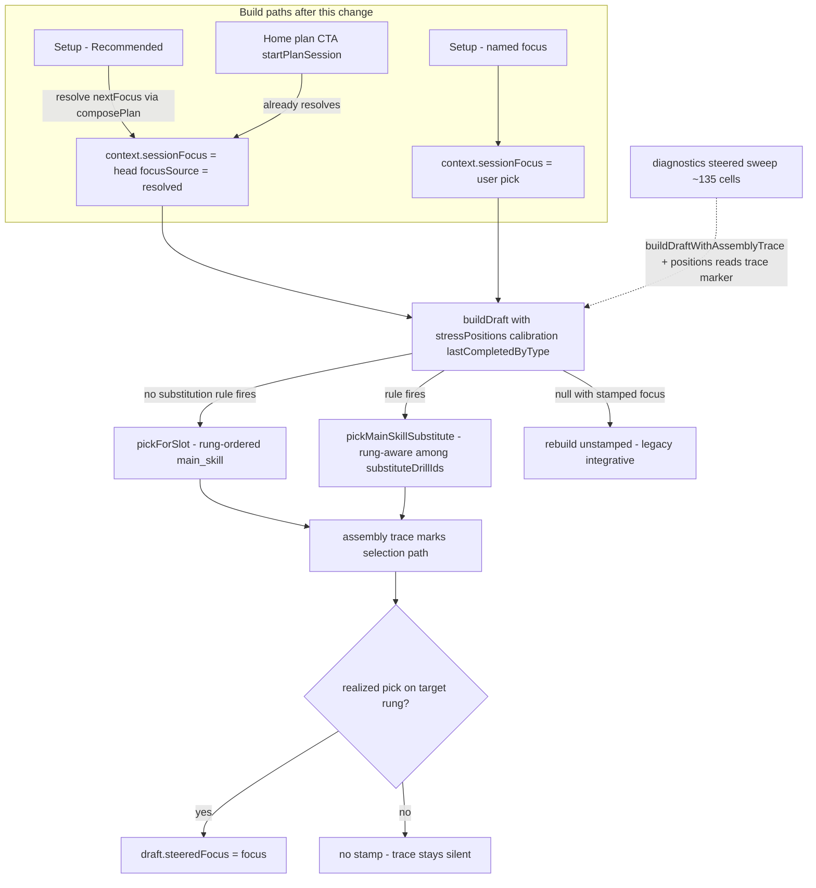

# feat: Engine-integrity front porch — steering everywhere, catalog-wide stress ladders, docs reconciliation

## Summary

Close the adaptation loop on every build path before M002.2 content work begins. Setup's "Recommended" resolves through the derived plan (staleness head + stress steering, matching Home plan launch), main-skill substitution becomes rung-aware and steered-provenance-eligible, and generated-plan diagnostics gain a steered sweep so the engine-as-deployed has a regression surface. Alongside: every catalog drill with a pass/serve/set tag gets a stress-ladder rung (the 14 currently off-ladder drills), catalog validation hardens (bidirectional chains, ladder cross-checks), dead seams from the D154–D158 ships are removed, and the stale M002 doc surfaces are reconciled with shipped reality.

## Problem Frame

The 2026-06-12 engine audit found the adaptation loop closes only on the Home plan CTA: Setup "Recommended" omits `sessionFocus` so steering is inert and rotation never applies; substitution bypasses rung preference (named `D157` deferral); the 540-cell diagnostics sweep never passes stress positions. Separately, 17 of 40 catalog drills carry no ladder rung, `catalogValidation` never cross-checks ladders (the `d24`/chain-2 mismatch slips through), and the M002 charter, roadmap, catalog, and ideation docs lag the shipped M002.1 + `D154`–`D158` state. Founder directive 2026-06-12: build the integrity items now and ladder the remaining drills where possible.

## Home Surface

Assembly-only change riding the M002.2 stress-rung claimant's plan-input lane (D156 rule 2): steering semantics change what launches assemble, zero new Home pixels, render budget untouched.

---

## Requirements

**Steering everywhere**

- R1. With "Recommended" selected, Setup resolves the focus via `composePlan` over `loadPlanInputs` (staleness head) and builds with that focus stamped, plus stress positions and calibration — the same semantics as `startPlanSession`.
- R2. A Recommended-resolved focus is distinguishable from a user-picked focus: context carries `focusSource: 'resolved'`, the Setup focus pill stays on "Recommended" when hydrating such a draft, and the Setup summary line shows the currently-resolved focus (preview semantics — the persisted draft is untouched until Build).
- R3. If the stamped build returns null, Setup falls back to an unstamped (legacy integrative) build rather than erroring; if plan-input loading fails, Setup builds unstamped. Recovery rebuilds strip `focusSource` along with `sessionFocus`.
- R4. Named-focus Setup builds and Home plan launches keep their current behavior; `startPlanSession` additionally passes last-completed drill ids so Setup and Home builds are fully symmetric (substitution can fire on both). This parity is an addition beyond the dictated build-now set and is named as such in D159 for founder sign-off.
- R5. `pickMainSkillSubstitute` selects among a rule's `substituteDrillIds` by stress-rung distance (authored order as tie-break) when positions and a scoped focus are available, and substitution picks that land on the target rung receive the `steeredFocus` stamp. The mid-run Swap path keeps authored-order semantics. `SESSION_ASSEMBLY_ALGORITHM_VERSION` bumps 10 → 11.
- R6. Generated-plan diagnostics gain a bounded steered sweep (representative stress positions) with hard-failure checks driven by an assembly-trace selection-path marker — rung-nearest selection honored, provenance stamped when earned, legitimate duration-fit/reroute/substitution overrides not misflagged; the committed report and triage docs are regenerated and `diagnostics:report:check` passes.

**Catalog-wide stress ladders**

- R7. Every catalog drill whose `skillFocus` includes `pass`, `serve`, or `set` holds exactly one rung on that focus's ladder — all 14 currently off-ladder scoped-tag drills are placed (`d02 d04 d06 d08 d12 d13 d14 d16 d17 d19 d20 d21 d23 d24`; `d08` dual pass+serve, `d20`/`d21` dual pass+set). Lifecycle-only drills (`d25 d26 d28`) stay off-ladder.
- R8. Ladder expansion changes no assembly or adaptation behavior: non-`m001Candidate` drills remain excluded from session pools, and per-focus rung bounds stay exactly pass 1–5, serve 1–4, set 1–5 (placements land within existing rungs so `stressLadderBounds`, `startingStressRung`, offer gating, and derived positions are untouched).
- R9. `validateDrillCatalog` cross-checks ladders (known drill ids, no duplicates per ladder, every scoped-tag drill on-ladder) and chains bidirectionally (a drill whose `chainId` names an existing chain must be in that chain's `drillIds`); the `d24` / `chain-2-direction` mismatch is fixed.

**Hygiene**

- R10. Dead seams removed and stale anchors corrected, re-verified against HEAD at work time: `selectWarmup` module + test deleted; repeat-era comment anchors reworded in `app/src/model/session.ts`, `app/src/services/planInputs.ts`, `app/src/services/session/commands.ts`; `progressions.ts` header states gating is retired (swap-hint + authoring only, per `D154`).

**Docs reconciliation**

- R11. Decision rows D159 (Recommended-through-plan, steering on all build paths) and D160 (catalog-wide ladder coverage + validation hardening) appended to `docs/decisions.md` with the content specified in U1.
- R12. M002 charter (`docs/milestones/m002-weekly-confidence-loop.md`, filename kept per D149) reconciled: status/stage reflect an active series, `decision_refs` extended through D160, a series-progress section records M002.1 + D154–D158 + this ship, superseded legacy sections trimmed; `docs/milestones/README.md` and `AGENTS.md` current-state lines synced.
- R13. `docs/roadmap.md` stale lines refreshed (receipt no longer deferred, stress-ladder substrate shipped, receipt framing per D150/D151); `docs/specs/stress-rung-taxonomy.md` updated for D160 (scope amendment, new placements recorded); `docs/research/brand-ux-guidelines.md` §7.2 setup-01 focal line updated for the resolved-focus copy; `docs/catalog.json` synced (M002 entry, `repo_state.stack` Dexie v7, entries for the missing 2026-06-04 M002.1 plan and this plan); `docs/status/current-state.md` snapshot line updated and a shipped-history entry added.
- R14. Ideation survivors updated in `docs/ideation/2026-06-11-what-to-build-next-ideation.md`: #1 marked shipped (D154–D158), #2 marked substantially shipped via D154 with M002.2 owning the remainder.
- R15. `bash scripts/validate-agent-docs.sh` and the full app battery pass (typecheck, lint, vitest, diagnostics check, architecture + typography checks, prettier check, build).

---

## Key Technical Decisions

- **Recommended becomes "rotating single-focus," stated as resolution semantics (D159):** stamping `sessionFocus` narrows all focus-controlled slots, switches redistribution priority, enables focus-gated reroutes, and narrows mid-run Swap — exactly what Home plan launch already does. D159 cites D141/O24: this is the Recommended resolution behavior under the current single-chain generator, not a ruling that the product is permanently skill-isolation-only. Accepted user-visible deltas: Safety's pain note ("Recovery overrides today's focus.") now renders for Recommended sessions; Swap alternates narrow to the resolved focus; editing a Home-launched draft now shows the Recommended pill (resolved provenance) instead of a named focus.
- **Provenance via `focusSource: 'resolved'`, not a parallel focus field:** one optional context field distinguishes resolved from user-picked focus; both Setup-Recommended and `startPlanSession` stamp it. Hydration maps `focusSource === 'resolved'` back to the Recommended pill; rebuild re-resolves the staleness head (fresh-by-design). Recovery rebuilds (`stripSessionFocus`) drop it alongside `sessionFocus` so focus-less drafts never claim machine-resolved provenance. Optional field on `SetupContext` — no Dexie schema bump.
- **Resolution rides the existing readiness gate:** `nextFocus` resolves inside the same `Promise.allSettled` as the other preview inputs and mirrors in the confirm fallback, so the first preview is already stamped and a fast confirm cannot persist an unstamped draft. No new service module: extend `app/src/services/planInputs.ts` (or call `loadPlanInputs` + `composePlan` directly in Setup) — a single-consumer wrapper is not justified.
- **Substitution rung-awareness re-specs selection, not pool order:** `findSubstitute` looks substitutes up by id, so ordering the pool is a no-op. The change: choose among `rule.substituteDrillIds` by rung distance with authored order as tie-break, scoped to the build path (`pickMainSkillSubstitute`) — the mid-run Swap path stays authored-order per the live D157 deferral. Latent with today's single rule (`d03 → [d10]`), real for future multi-substitute rules — a selection-semantics change, so the algorithm version bumps per the v9 precedent, and the stamp guard (`!mainSkillSubstitute`) is deleted with the "Known v1 bypass" docblocks rewritten.
- **Assembly trace records the main-skill selection path:** `DraftAssemblyTrace` gains a marker (`rung_nearest | duration_fit | reroute | substitution`) for the main-skill slot so diagnostics can audit steering without re-implementing `pickForSlot`'s duration policy.
- **Ladder membership broadens to all scoped-tag catalog drills (D160):** runtime is unchanged because `findCandidates` filters `m001Candidate`; rungs on non-M001 drills are content metadata that becomes live if eligibility ever widens. Placements stay within existing per-focus bounds — bounds growth (new top rungs) would silently shift offer gating and re-derive accepted positions, so it requires its own decision row. Placement heuristic: anchor to on-ladder chain siblings (chain position + level band + feed/CI character), one-line rationale comment per new entry; placements flagged for founder review in the shipped-history entry. D160 also names the new authoring invariant: every new scoped-tag catalog drill ships with a same-commit ladder rung plus placement rationale.
- **Validation stays pure:** `validateDrillCatalog` gains a `stressLadders` input and new error codes rather than importing registry singletons; the chain rule is "if a chain object exists for `drill.chainId`, the drill must be in its `drillIds`" — `d28`'s `chain-warmup` (no chain object) stays legal.
- **Diagnostics steered sweep is a separate bounded scenario set with its own surface contract:** 3 focuses × 5 configurations × 3 levels × 25-min profile × seed `matrix-a` × 3 positions (ladder min, band start, ladder max) ≈ 135 nominal cells (degenerate band-start overlaps with min/max are acceptable). The steered sweep gets its own contract instance and baseline (durations `[25]`, seeds `[matrix-a]`, positions) validated by steered-specific rules — `REQUIRED_GENERATED_PLAN_SURFACE_BASELINE` and the 540-cell contract stay untouched. New hard-failure codes keyed on the trace marker: `steering_violation` (marker absent/inconsistent, or a rung-nearest selection that is not nearest-eligible) and `steered_focus_missing` (realized on-target pick without provenance); duration-fit, reroute, and substitution markers are legitimate non-violations.
- **Milestone filename stays `m002-weekly-confidence-loop.md`:** D149 chose path stability; 25+ inbound referrers and the catalog coupling confirm it. Reconciliation is content-only.
- **Single-branch flow:** all work lands on `main` with a commit per unit cluster, pushed after each commit, per the repo operating model. CI is the push-triggered `app-ci.yml` workflow; no PR.

---

## High-Level Technical Design

---

## Implementation Units

### U1. Decision rows D159 and D160

- **Goal:** Canon authorizes the behavior changes before code cites them.
- **Requirements:** R11
- **Dependencies:** none
- **Files:** `docs/decisions.md`
- **Approach:** Append two rows to the `## Decided` table matching the D154–D158 format (bold title + date, body, date column). D159 content: Setup Recommended resolves through the derived plan — staleness-head focus stamped with `focusSource: 'resolved'`, steering + calibration on all Setup builds, null-build fallback to unstamped, substitution rung-aware and provenance-eligible (cashes the D157 deferral; Swap stays authored-order). Cite D141/O24: rotating single-focus is the resolution semantics under the current single-chain generator and does not supersede D141's ruling that integrative-focus sessions remain a legitimate future direction. Name the accepted deltas (Swap narrowing, Safety pain note, single-focus slot narrowing, fresh-user deterministic pass/d01 first session, Home-launched-draft hydration shows the Recommended pill) and name `startPlanSession` last-completed parity as an explicit addition beyond the dictated build-now set, flagged for founder dogfood review. Cite the D156 plan-input lane (assembly-only Home change). D160 content: ladder membership broadens to every scoped-tag catalog drill (amends D154's `m001Candidate`-only scope; non-M001 rungs are inert content metadata); placements stay within existing per-focus bounds (bounds growth needs its own decision row); validation hardening (ladder cross-checks, bidirectional chains); new authoring invariant — every new scoped-tag drill ships with a same-commit rung + one-line placement rationale.
- **Test scenarios:** Test expectation: none — docs-only; covered by `scripts/validate-agent-docs.sh` in U8.
- **Verification:** Rows render in the Decided table; IDs are D159/D160 (next free after D158).

### U2. Catalog-wide stress-ladder entries

- **Goal:** All 14 off-ladder scoped-tag drills hold rungs within existing bounds; module contract and taxonomy spec updated together.
- **Requirements:** R7, R8
- **Dependencies:** U1
- **Files:** `app/src/data/stressLadders.ts`, `app/src/data/__tests__/stressLadders.test.ts`, `app/src/domain/sessionBuilder.test.ts` (assembly-unchanged scenario), `docs/specs/stress-rung-taxonomy.md`
- **Approach:** Add pass entries for `d02 d04 d06 d08 d12 d13 d14 d16 d17 d19 d20 d21 d24`, serve entries for `d08 d23`, set entries for `d20 d21`, each with a one-line placement rationale anchored to on-ladder chain siblings (e.g. chain-1 fundamentals near `d01`/`d03` rungs; chain-3 movement drills mid-ladder; chain-5 group add-ons at higher existing rungs). Hard constraint: every placement lands on an existing rung index — per-focus min/max stay pass 1–5, serve 1–4, set 1–5. Update the module-contract comment from "every m001Candidate drill" to "every catalog drill" with the lifecycle exclusion stated. Update the completeness test to iterate the whole catalog. Update `docs/specs/stress-rung-taxonomy.md` in the same commit: amend the m001Candidate-only scope statement and "non-candidate rows stay un-rung" exclusion per D160, record the 14 placements in the per-focus tables (marked runtime-inert), append D160 to `decision_refs`.
- **Patterns to follow:** existing `d18` dual-focus authoring (independent rungs per ladder); existing rung comments in `stressLadders.ts`.
- **Test scenarios:**
  - every catalog drill with a scoped tag appears exactly once in that focus's ladder (parameterized over pass/serve/set; replaces the m001-only invariant)
  - `d08` holds independent pass and serve rungs; `d20`/`d21` hold independent pass and set rungs (mirror the `d18` test)
  - rung-shape invariants still hold post-expansion: ≥4 distinct rungs, ≥1 drill per rung, strictly ascending from 1
  - per-focus bounds pinned: `stressLadderBounds` returns exactly pass {1,5}, serve {1,4}, set {1,5} (protects `startingStressRung`, offer gating, and derived-position clamping)
  - ladder references only known catalog drills
  - assembly unchanged: a steered pass build's main-skill pool contains no non-M001 drill (e.g. `d02`) even though it now has a rung
- **Verification:** `stressLadders.test.ts` and `sessionBuilder.test.ts` green; no diagnostics drift (`diagnostics:report:check` still passes before U7's regen); taxonomy spec and module agree.

### U3. Validation hardening and d24 fix

- **Goal:** `validateDrillCatalog` catches ladder and chain inconsistencies; the known mismatch is fixed.
- **Requirements:** R9
- **Dependencies:** U2
- **Files:** `app/src/data/catalogValidation.ts`, `app/src/data/__tests__/catalogValidation.test.ts`, `app/src/data/progressions.ts` (add `d24` to `chain-2-direction.drillIds`)
- **Approach:** Extend `validateDrillCatalog` input with `stressLadders`. New error codes: `ladder_unknown_drill`, `ladder_duplicate_drill`, `scoped_drill_off_ladder`, `drill_chain_membership_missing`. Chain rule per KTD: only fires when a chain object exists for the drill's `chainId`. Fix `d24` by adding it to chain-2's `drillIds` (membership is validation/authoring metadata; `links` unchanged, so swap preference is unaffected).
- **Patterns to follow:** existing error-code union + per-check structure in `catalogValidation.ts`.
- **Test scenarios:**
  - real catalog + chains + ladders validate to `[]`
  - synthetic drill with `chainId` naming an existing chain but absent from its `drillIds` → `drill_chain_membership_missing`
  - `d28`-style `chainId` with no chain object → no error
  - ladder referencing an unknown drill id → `ladder_unknown_drill`; same drill twice in one ladder → `ladder_duplicate_drill`
  - synthetic scoped-tag drill absent from its focus ladder → `scoped_drill_off_ladder`; lifecycle-only drill off-ladder → no error
- **Verification:** `catalogValidation.test.ts` green; `progressions.test.ts` unaffected.

### U4. Dead-seam and stale-anchor hygiene

- **Goal:** Remove superseded code and correct comment anchors stranded by the D154–D158 ships.
- **Requirements:** R10
- **Dependencies:** none
- **Files:** delete `app/src/domain/sessionAssembly/selectWarmup.ts` + `app/src/domain/sessionAssembly/__tests__/selectWarmup.test.ts`; reword repeat-era comment anchors in `app/src/model/session.ts`, `app/src/services/planInputs.ts`, `app/src/services/session/commands.ts`; `app/src/data/progressions.ts` header annotation (gating retired per D154, swap-hint + authoring only)
- **Approach:** Re-grep every target against HEAD before acting — the D157/D158 ships landed the same day this plan was audited and already removed several candidates (`deriveStressPositionsAt`, the SafetyCheck repeat gloss, `policies.ts` anchors are confirmed gone; `app/README.md`'s `repeatSession` mention is already a dated historical note and stays). Keep dated D158 retirement notes (historical record); remove only misleading live-sounding references. Do not touch `deriveStressPositions` or other live `stressPosition.ts` exports.
- **Test scenarios:** Test expectation: none — deletions and comments; existing suites pin the surviving behavior and must stay green.
- **Verification:** `npm run typecheck` (no dangling imports), full vitest green.

### U5. Setup Recommended resolves through the derived plan

- **Goal:** The default Setup path rotates focus and steers, with honest provenance and safe fallbacks.
- **Requirements:** R1, R2, R3, R4 (Setup side)
- **Dependencies:** U1
- **Files:** `app/src/screens/SetupScreen.tsx`, `SetupContext` type home (verify at work time; plan-era pointer: `app/src/types/session.ts`) for optional `focusSource`, `app/src/services/planInputs.ts` (focus resolution co-located; no new service module), `app/src/services/planLaunch.ts` (stamp `focusSource: 'resolved'`), `app/src/domain/sessionBuilder.ts` (`stripSessionFocus` also drops `focusSource`), `app/src/screens/__tests__/SetupScreen.test.tsx`
- **Approach:** Resolve `nextFocus` inside the existing `Promise.allSettled` preview-input load; when the pill is Recommended, stamp `sessionFocus: nextFocus` + `focusSource: 'resolved'` into the build context (preview and confirm paths, including the confirm legacy fallback). Null stamped build → rebuild unstamped (drop both fields). Plan-input load failure → unstamped build. Hydration: `focusSource === 'resolved'` maps the pill to Recommended; the summary line shows the currently-resolved focus from the rebuilt preview (the persisted draft's stamped focus is never displayed; the draft is untouched until Build — consistent with edit-mode's rebuild-reshuffle semantics). Update the pinned summary-line regex; copy direction: `Solo + Net · 25 min · Passing (recommended)` — final copy at work time within the D158 setup-01 frame. Stamp `focusSource` in `startPlanSession` for cross-path consistency.
- **Patterns to follow:** `startPlanSession` (`app/src/services/planLaunch.ts`) steer semantics; `useHomeScreenState` plan-input usage.
- **Test scenarios:**
  - Covers R1. with serve most stale, Recommended preview context carries `sessionFocus: 'serve'`, `focusSource: 'resolved'`, and steering inputs; main-skill pick is rung-ordered
  - fresh user (zero trained sessions): resolves deterministically to the staleness tie-break head (pass) — onboarding Setup included
  - named-focus pick: context carries the pick, no `focusSource`, behavior unchanged
  - hydrating a resolved draft whose stamped focus differs from the current staleness head (divergent fixture): pill shows Recommended, summary line shows the re-resolved focus, persisted draft untouched until Build
  - hydrating a draft with user-picked focus: pill shows that focus (unchanged)
  - stamped build returns null → unstamped fallback build saved, no error toast
  - plan-input load rejects → unstamped build, Setup still usable
  - fast confirm before preview inputs settle → persisted draft is stamped (confirm fallback mirrors resolution)
  - recovery rebuild from a resolved draft: `stripSessionFocus` output carries neither `sessionFocus` nor `focusSource` (extend the existing "recovery rebuilds never carry provenance" coverage)
  - steering-trace interplay: accept "more stress" on focus F, next Recommended resolution is focus G → F's promise stays armed; trace line renders when F next reaches head (pins the intended delay)
- **Verification:** `SetupScreen.test.tsx` green including updated summary-line pin (currently ~line 742); manual mobile pass of Setup → Safety with Recommended showing resolved focus.

### U6. Rung-aware substitution with steered provenance and trace marker

- **Goal:** The substitution path participates in steering instead of silently bypassing it, and the trace records how the main-skill slot was decided.
- **Requirements:** R4 (Home parity), R5, R6 (marker substrate)
- **Dependencies:** U1
- **Files:** `app/src/domain/sessionAssembly/substitution.ts`, `app/src/domain/drillSelection.ts` (substitute choice), `app/src/domain/sessionBuilder.ts` (pass `stressPositions`; delete the `!mainSkillSubstitute` stamp guard; rewrite the "Known v1 bypass" and KTD6 docblocks; bump `SESSION_ASSEMBLY_ALGORITHM_VERSION` 10 → 11; emit the main-skill selection-path marker on `DraftAssemblyTrace`), `app/src/services/planLaunch.ts` (pass `findLastCompletedDrillIdsByType()` through `startPlanSession`), `app/src/domain/sessionBuilder.test.ts` (version pins ~126/295/2029 and the AE5 substitution-stamp pin ~2547), substitution/drillSelection tests
- **Approach:** `pickMainSkillSubstitute` accepts `stressPositions`; substitute selection iterates `rule.substituteDrillIds` choosing the rung-nearest available candidate (authored order tie-break; today's single rule is outcome-identical). Keep the rung-aware logic out of the shared swap path — Swap stays authored-order per the live D157 deferral. Stamp condition evaluates the realized pick regardless of path. Add the selection-path marker (`rung_nearest | duration_fit | reroute | substitution`) to the trace for the main-skill slot. Version bump per the v9 selection-semantics precedent.
- **Patterns to follow:** `orderByStressDistance` distance math (`app/src/domain/sessionAssembly/candidates.ts`); v9 bump comment style in `sessionBuilder.ts`.
- **Test scenarios:**
  - Covers R5. pass position 3, last main-skill `d03`, `netAvailable: false` → substitute `d10` selected and `steeredFocus: 'pass'` stamped (rewrites the AE5 pin that currently asserts no stamp)
  - pass position 1, same setup → `d10` substituted, no stamp (off-target quiet-fail)
  - synthetic multi-substitute rule: rung-nearest substitute wins; authored order breaks ties; no positions → authored order preserved
  - mid-run Swap path unchanged: swap alternates keep authored-order semantics with positions present
  - substitution + reservation coexist: seed where technique would otherwise claim `d10` still yields the reserved substitute with stamp
  - `startPlanSession` passes last-completed ids: Home-launched build with a firing rule substitutes identically to Setup
  - trace marker: substitution builds mark `substitution`; steered non-substituted builds mark `rung_nearest` (or `duration_fit`/`reroute` when those policies fire)
  - version pins assert 11
- **Verification:** `sessionBuilder.test.ts`, substitution tests green; `steeringTrace` tests green (freshness keys on `assembledAt`, not version — confirm no regression).

### U7. Diagnostics steered sweep

- **Goal:** The steered path gets a regression surface; committed diagnostics reflect post-U5/U6 assembly.
- **Requirements:** R6
- **Dependencies:** U2, U5, U6
- **Files:** `app/src/domain/generatedPlanDiagnostics.ts`, its tests, `app/scripts/validate-generated-plan-diagnostics-report.mjs` (only if the surface needs it), `docs/reviews/2026-05-01-generated-plan-diagnostics-report.md`, `docs/reviews/2026-05-01-generated-plan-diagnostics-triage.md` (regenerated in place — canonical filenames unchanged)
- **Approach:** Add a steered scenario set per KTD (own surface-contract instance and baseline: durations `[25]`, seeds `[matrix-a]`, positions {ladder min, band start, ladder max}; the 540-cell contract and `REQUIRED_GENERATED_PLAN_SURFACE_BASELINE` untouched), evaluated via `buildDraftWithAssemblyTrace` with `stressPositions` injected. Hard-failure codes keyed on U6's selection-path marker: `steering_violation` and `steered_focus_missing` per KTD — duration-fit, reroute, and substitution markers are legitimate non-violations, so the checker never re-implements `pickForSlot` policy. Regenerate committed docs with `diagnostics:report:update`.
- **Patterns to follow:** existing matrix construction (`buildGeneratedPlanMatrix`), hard-failure battery (`generationHardFailures`), surface-contract validation.
- **Test scenarios:**
  - steered sweep over the real catalog yields zero hard failures
  - `steering_violation` fires on a crafted trace whose marker claims `rung_nearest` but whose selected drill is not nearest-eligible (unit-test the checker directly)
  - `steering_violation` does NOT fire on `duration_fit`/`reroute`/`substitution` markers (legitimate overrides)
  - `steered_focus_missing` fires when a realized on-target pick lacks provenance
  - steered surface contract accepts the position dimension and bounded baseline; cell counts match the bounded design (degenerate band-start overlaps documented)
  - `diagnostics:report:check` passes against regenerated docs
- **Verification:** `npm run diagnostics:report:check` green; report diff reviewed for unexpected observation shifts.

### U8. Docs reconciliation pass

- **Goal:** Canonical docs match shipped reality through this change.
- **Requirements:** R12, R13, R14, R15
- **Dependencies:** U1–U7 (documents the ship)
- **Files:** `docs/milestones/m002-weekly-confidence-loop.md`, `docs/milestones/README.md`, `AGENTS.md`, `docs/roadmap.md`, `docs/research/brand-ux-guidelines.md` (§7.2 setup-01 focal line), `docs/catalog.json`, `docs/status/current-state.md`, `docs/ideation/2026-06-11-what-to-build-next-ideation.md`
- **Approach:** Charter: status `active`, stage reflecting an in-flight series, `last_updated` bumped, `decision_refs` extended D150–D160, add a concise series-progress section (M002.1 shipped 2026-06-04/05; D154–D158 pull-forwards; this ship; M002.2 next), trim or supersede-mark legacy receipt/Repeat text. `milestones/README.md` line 61 → "Weekly Training Home" + status sync. `AGENTS.md`: Current State milestone line (active, planned via this pass) + `last_updated`. Roadmap: lines ~68/142/160/185 factual refresh only. Brand-ux §7.2: fold the final resolved-focus Recommended copy into the setup-01 focal-line spec, citing D159. Catalog: M002 entry status + `canonical_for` refresh, `repo_state.stack` → Dexie v7, add entries (with `canonical_for`) for `docs/plans/2026-06-04-001-feat-m002-1-thin-spine-and-adaptation-plan.md` and this plan (complete + `active_registry` at ship). Current-state: snapshot M002 line + new shipped-history entry that flags for founder review both the ladder placements and the D159 accepted deltas, with an explicit first-week dogfood ask: run one Setup-Recommended session and confirm the resolved-focus display, Swap narrowing, and Safety pain note read as intended. Ideation: #1 status → shipped with decision refs; #2 → substantially shipped via D154, remainder owned by M002.2.
- **Test scenarios:** Test expectation: none — docs-only; gated by `scripts/validate-agent-docs.sh`.
- **Verification:** `bash scripts/validate-agent-docs.sh` green; full app battery green (typecheck, lint, vitest, `diagnostics:report:check`, architecture + typography checks, prettier check, build); catalog paths exist; no stale "Weekly Confidence Loop" naming outside historical/archive contexts.

---

## Scope Boundaries

**Deferred to Follow-Up Work**

- M002.2 content authoring: new drills for thin serve rungs, per-rung cues, technique-how depth, `cueCadenceRegistry` keep-or-delete decision.
- Mid-run Swap rung-awareness (stays on the D157 deferral list; U6 explicitly keeps Swap authored-order).
- Benchmark-kata pull-forward (fires only if the difficulty sensor stays flat through early M002.2 dogfood).
- Defense taxonomy O-row; attack focus (M002.6, chains-first).
- Existing diagnostics triage lanes (375 observation-only cells) — unchanged policy.
- Ladder bounds growth (new top rungs) — requires its own decision row if M002.2 authoring wants it.

**Outside this change's identity**

- Periodization, goals anchor, next-N queue (O2 / M002.4 / Phase 1.5).
- Pair data handoff, off-script capture (separate ideation survivors).

---

## Risks & Dependencies

- **Recommended semantics shift is user-visible** (single-focus narrowing, Swap narrowing, Safety pain note, Home-draft hydration pill): accepted in D159 with the D141 citation; U8's shipped-history entry carries the explicit founder dogfood ask so the veto surface does not depend on organic Setup usage.
- **Stamped default path can hit a null build** in odd constraint cells: R3's unstamped fallback guarantees Recommended never errors where it used to succeed. Accepted residual: the silent fallback masks resolution regressions — the observable signal is the summary line reading generic "Recommended" instead of a named focus.
- **Ladder placements are content judgment under founder-use mode:** runtime-inert (non-M001), bounds-pinned, rationale-commented, and flagged for founder review in the shipped-history entry.
- **Test pins that will fail until updated:** `sessionBuilder.test.ts` version pins (~126/295/2029), the AE5 substitution-stamp pin (~2547, asserts no stamp in the exact scenario U6 now stamps), and the Setup summary-line regex pin (`SetupScreen.test.tsx` ~742) — listed in U5/U6 file sets. copyGuard fixtures update with the U5 summary-line copy in the same commit.
- **Diagnostics runtime grows ~25%** (135 added builds): bounded by single seed/duration choices.
- **Plan was audited the day D157/D158 landed:** several hygiene targets were already removed at HEAD; U4 and U6 re-verify every target/line anchor against the working tree before acting.
- **Uncommitted-tree risk:** verify `git status` is clean and `origin/main` is current before work starts.

---

## Assumptions

- The founder's "build everything you suggested we build now" authorizes authoring D159/D160 directly; rows are dated 2026-06-12 and attributed to founder direction in this session. Additions beyond the dictated set (`startPlanSession` last-completed parity) are named as additions inside D159 rather than folded silently.
- "Add stress ladders to the rest of the drills if possible" is satisfied by laddering all 14 scoped-tag drills and documenting why `d25`/`d26`/`d28` (lifecycle-only tags, no ladder exists for warmup/recovery) stay off — placements for drills with no scoped tag are not possible under the D154 model.
- Milestone filename stays per D149; the earlier chat suggestion to rename is dropped.
- Fresh-user Recommended resolves to pass/d01 deterministically and that is acceptable (matches Home's existing "First up: passing" promise).
- Single-branch `main` flow with direct pushes; CI is the push-triggered `app-ci.yml`; no PR is opened.
- Diagnostics report/triage keep their 2026-05-01 canonical filenames and are regenerated in place (existing convention; catalog treats those paths as canonical).
