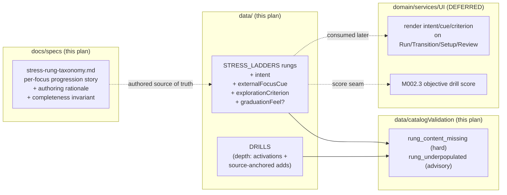
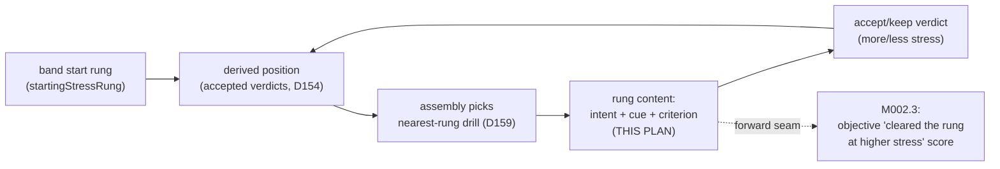

# feat: M002.2 rung depth + meaningful-progression content (pre-UI)

## Summary

M002.2 is the content milestone over the stress-ladder substrate that already shipped (`D154` ladders + derived position + rung-steered assembly, `D159` steering on every build path, `D160` catalog-wide rung membership). The *skeleton* exists — every `pass`/`serve`/`set` drill sits at a rung. What does not exist is the **content that makes climbing a rung a meaningful skill step**: per-rung intent, an external-focus cue, and an exploratory "see how it feels" criterion — and the documented progression semantics tying them together.

This plan delivers two things, both held at the **data / spec / domain layer with no UI rendering** (the user's explicit "before the UI" boundary):

1. **Roster depth** — thicken thin rungs with assembly-eligible options *where the catalog legitimately allows it* (activate inert drills whose graduate-when trigger is satisfied; author source-anchored new content for the thinnest rungs; enumerate the rest as a deferred, source-gated backlog).
2. **Meaningful progression content** — author rung-level `intent` + `externalFocusCue` + `explorationCriterion` for all 14 rungs, document the per-focus rung-to-rung progression story, and pin a rung-content completeness invariant.

The progression *mechanism* is unchanged: movement stays user-accepted (`D154` accept-verdict stepping); gating stays retired. M002.2 gives that mechanism *meaning*, not new gates. The objective "1% better" drill score remains the `M002.3` seam.

---

## Problem Frame

The 2026-06-11 first-principles pass and `D154`/`D159`/`D160` closed the adaptation loop: an accepted "more stress" verdict steps the derived ladder position, and assembly picks the nearest-rung drill on every build path. But a step today is only as meaningful as the catalog and the content behind it:

- **Depth gap.** Several rungs are single-drill in *active-candidate* terms, so "stepping up" can pick the same drill or a barely-different one. The taxonomy already names the visible thin spots (serve rungs 1 and 3). A full active-candidate audit (below) shows serve rungs 1/3 and set rungs 2/3 are the real thin points.
- **Meaning gap.** Rungs carry an ordinal number and a one-line authoring rationale, but no athlete-facing *intent*, no external-focus cue, and no exploratory criterion. Nothing tells a self-coached athlete what a rung trains, what to attend to, or what "better here" feels like. Without that, a higher rung is harder, not *developmental* — which is exactly the over-coaching / empty-scaffold failure mode the vision warns about.

The brainstorm scopes M002.2 as: "each focal skill gains an ordered ladder of stress rungs … each carrying an external-focus cue and an exploratory 'see how it feels' criterion … built user-owned / process-framed / exploratory — never coach-graded pass/fail." This plan builds that content layer and the depth to back it, and stops at the data/spec boundary.

---

## Active-candidate depth audit (grounding)

Counts are **assembly-eligible** drills (`m001Candidate: true`) per rung today. `(+N inert)` = authored-but-parked drills already placed at that rung per `D160`.

| Focus | Rung | Active candidates | Parked (inert) | Depth |
|---|---|---|---|---|
| pass | 1 | d01 | d02, d04 | thin-ish |
| pass | 2 | d03, d05 | d06, d19 | ok |
| pass | 3 | d07, d09, d10 | d12, d13, d14, d16, d17, d24 | deep |
| pass | 4 | d11, d15 | d20, d21 | ok |
| pass | 5 | d18, d46, d50 | d08 | deep |
| serve | 1 | d31 | — | **thin (no sibling)** |
| serve | 2 | d51 | d23 | thin-ish |
| serve | 3 | d22 | — | **thin (no sibling)** |
| serve | 4 | d18, d33 | d08 | ok |
| set | 1 | d38, d39, d40 | — | deep |
| set | 2 | d41 | — | **thin (no sibling)** |
| set | 3 | d42 | — | **thin (no sibling)** |
| set | 4 | d47 | d20, d21 | thin-ish |
| set | 5 | d48, d49 | — | ok |

**Key constraint:** most parked drills are gated by `docs/reviews/2026-04-28-m001-candidate-false-audit.md` — `hold-pending-D101` (3+ player: d08, d14, d20), `hold-pending-M002` group (d19, d21), or `graduate-when` equipment/evidence (d06, d12, d13, d16, d17, d24). The four hardest thin rungs (serve 1/3, set 2/3) have **no parked sibling at all**, so depth there can only come from new authored content, which is source- and coach-review-gated. This plan does not fabricate unsourced drills.

---

## High-Level Technical Design

Rung content attaches to the existing rung object (rung-level, focus-specific), stays pure data (the `data → types` inward rule), and is consumed later — never in this plan — by domain/services and finally UI.

Progression flow the content layer serves (mechanism already shipped; this plan fills the labelled boxes):

---

## Key Technical Decisions

**KTD1 — Rung content lives on `StressRung`, authored from the taxonomy spec.**
Add `intent`, `externalFocusCue`, `explorationCriterion` (and optional `graduationFeel`) to the `StressRung` interface in `app/src/data/stressLadders.ts`; `docs/specs/stress-rung-taxonomy.md` stays the authored source of truth and the registry must match it (existing colocated-test precedent). Rationale: the brainstorm attaches cue/criterion to the *rung* (focus-specific, stress-level-specific), not to a drill; the rung object already exists here; `data/` importing only `types/` keeps the inward layering rule; completeness is machine-checkable. Rejected: per-drill fields (a drill sits at one rung per focus, but the cue describes the *stress level*, and dual-focus drills would need conflicting per-focus cues); a separate registry (needless indirection over a 14-row table).

**KTD2 — Rung content is authored data + spec only; rendering is a deferred M002.2 UI follow-up.**
Honors the explicit "before going to the UI" boundary. No Run/Transition/Setup/Review surface changes; no new route; no Dexie change. This keeps the change pure-content and low-risk, and lets the UI pass be planned separately against real authored content.

**KTD3 — Cue is external-focus (Wulf / courtside-copy rule 12b); criterion is exploratory, never pass/fail.**
`externalFocusCue` names an outcome / environmental referent (ball flight, target, landing, partner reach), never a body part or internal sensation. `explorationCriterion` is process-framed ("see how it feels when …"), never a coach-graded threshold. Rationale: self-coached pedagogy evidence (`coach-pedagogy-translation-self-coached.md`) says pass/fail backfires coachlessly; `D154` retired ladder gating and this plan does not revive it.

**KTD4 — Progression mechanism unchanged; M002.2 supplies meaning, not gates.**
The derived-position accept-verdict step (`D154`) and `startingStressRung` band mapping are untouched. No new auto-promotion, no threshold. The content answers "what does climbing train / feel like," and feeds the `M002.3` objective-score seam without building it.

**KTD5 — Roster depth respects the candidate-false audit as the activation gate.**
Inert drills activate only where (a) a fresh trigger genuinely clears the audit's `graduate-when` and (b) the drill is assembly-feasible today (solo/pair, no `D101` 3+ geometry, no unmodeled equipment). New drills are authored only where anchored to a named in-repo source (the BAB/FIVB lineages the catalog and audit already cite), capped, courtside-copy compliant, and rung-placed in the same commit (`D160` invariant). Unsourced gaps become an enumerated, source-gated backlog — never fabricated content.

**KTD6 — Depth target is an advisory, not a hard failure.**
Target: ≥2 assembly-eligible candidates per rung in its dominant context, *where the catalog can support it*. Encoded as a `rung_underpopulated` advisory in catalog validation so thin-but-legitimately-gated rungs (serve 1/3, set 2/3) are visible without breaking CI. `rung_content_missing` (cue/criterion absent) is a hard failure.

---

## Requirements traceability

From `docs/brainstorms/2026-06-03-m002-thin-spine-and-milestone-series-requirements.md` (M002.2 milestone scope) and `docs/specs/stress-rung-taxonomy.md`:

- **M002.2 outcome — ordered ladder of stress rungs, each carrying an external-focus cue + exploratory criterion** → U1, U2.
- **Technique-"how" depth, user-owned / process-framed / never coach-graded pass/fail** → U2 (rationale + invariant), KTD3.
- **"How many skills get ladders first" / "how a rung renders in the spine"** → all three focus ladders get content (U1); rendering deferred (KTD2).
- **Thin-rung backfill (serve 1/3 named; set 2/3 found here)** → U4 (activations), U5 (source-anchored adds + backlog).
- **`D160` authoring invariant (same-commit rung + rationale for new scoped drills)** → U3 (validation), U5.
- **Substrate the next milestone scores against (M002.3 seam)** → U2 (documented seam), KTD4.

---

## Implementation Units

### U1. Rung-content fields + author all 14 rungs

**Goal:** Give every rung the athlete-facing content that makes a step meaningful: `intent`, `externalFocusCue`, `explorationCriterion`, optional `graduationFeel`.
**Requirements:** M002.2 ordered-ladder-with-cue/criterion outcome.
**Dependencies:** none.
**Files:** `app/src/data/stressLadders.ts`; `app/src/data/__tests__/stressLadders.test.ts`.
**Approach:** Extend the `StressRung` interface with the new fields (`intent`, `externalFocusCue`, `explorationCriterion` required; `graduationFeel` optional). Author all rungs across pass (5), serve (4), set (5). Content is authored to the taxonomy rung scale (constant → serial → varied → constrained/reactive → live-read) and obeys courtside-copy invariants even though nothing renders yet (no em-dashes, jargon glossed, external-focus cue, no internal-focus body cue). Keep `stressRungForDrill` / `stressLadderBounds` / `startingStressRung` signatures unchanged — additive only.
**Patterns to follow:** existing `STRESS_LADDERS` authoring + its colocated test; courtside-copy rule 12(b) for cue voice; `D149` boundary (stress ≠ physiological load — content speaks contextual interference, never sRPE).
**Test scenarios:**
- Every rung in every focus ladder has non-empty `intent`, `externalFocusCue`, `explorationCriterion`.
- `externalFocusCue` strings contain no em-dash (`U+2014`) and no banned internal-focus tokens (reuse/extend the copy-guard token list where practical).
- `explorationCriterion` strings contain no pass/fail threshold vocabulary (no "%", "graded", "must", "pass/fail") — process-framed only.
- Existing ladder invariants (completeness, strict ascent, bounds, band mapping) still pass unchanged.
**Verification:** `stressLadders.test.ts` green; typecheck clean (new required fields force authoring everywhere).

### U2. Taxonomy spec: progression semantics + authoring rationale + completeness invariant

**Goal:** Document *how* each focus progresses rung-to-rung and *why* a step is a real improvement, so the authored content is governed, not ad hoc.
**Requirements:** technique-"how" depth; never-pass/fail framing; M002.3 seam.
**Dependencies:** U1 (the authored content this documents).
**Files:** `docs/specs/stress-rung-taxonomy.md`.
**Approach:** Add a per-focus "Progression story" section (what each step trains in contextual-interference terms, how cue/criterion evolve up the ladder, what readiness-to-step feels like) for pass/serve/set. Add an "Authoring rationale" section pinning KTD3 (external focus; exploratory, never pass/fail) with its evidence (`coach-pedagogy-translation-self-coached.md`, Wulf, `D68`). Add the **rung-content authoring invariant**: every rung ships with `intent` + `externalFocusCue` + `explorationCriterion`; new scoped drills still take a same-commit rung (`D160`). Document the `M002.3` seam explicitly (objective score = "cleared this rung at a higher stress level"; not built here). Update frontmatter `last_updated` and `decision_refs`.
**Test scenarios:** `Test expectation: none -- documentation`. (Spec correctness is reviewed, and the invariant it declares is enforced by U3.)
**Verification:** `bash scripts/validate-agent-docs.sh` passes; spec reads coherently against the U1 content.

### U3. Catalog validation: rung-content completeness + depth advisory

**Goal:** Make the rung-content invariant and the depth target machine-checked.
**Requirements:** `D160` authoring invariant; KTD6 depth target.
**Dependencies:** U1.
**Files:** `app/src/data/catalogValidation.ts`; `app/src/data/__tests__/catalogValidation.test.ts`.
**Approach:** Add `rung_content_missing` (hard issue: any rung lacking non-empty `intent`/`externalFocusCue`/`explorationCriterion`). Add `rung_underpopulated` (advisory issue, distinct severity or a separated advisory list: a rung whose assembly-eligible candidate count in its dominant context is below the KTD6 target). Thread `STRESS_LADDERS` + `DRILLS` candidacy into the existing `validateDrillCatalog` ladder cross-check block. Keep advisory separate from the hard catalog gate so legitimately-gated thin rungs do not fail CI.
**Patterns to follow:** existing `scoped_drill_off_ladder` / `ladder_unknown_drill` cross-checks and their test cases.
**Test scenarios:**
- A rung with an empty `externalFocusCue` (test fixture) raises `rung_content_missing`.
- The real catalog raises zero `rung_content_missing`.
- A fixture rung with one eligible candidate raises `rung_underpopulated`; the advisory does not appear in the hard-failure list.
- The real catalog's known thin rungs (serve 1/3, set 2/3 pre-U4/U5) appear in the advisory list, not the hard list.
**Verification:** `catalogValidation.test.ts` green; `npm test` and `diagnostics:report:check` unaffected.

### U4. Roster depth: legitimate inert activations

**Goal:** Thicken rungs by activating parked drills whose audit trigger is genuinely satisfied and that are assembly-feasible today.
**Requirements:** thin-rung backfill; KTD5.
**Dependencies:** U1, U3 (so activations are measured against the depth advisory).
**Files:** `app/src/data/drills.ts` (`m001Candidate` flips only); `docs/reviews/2026-04-28-m001-candidate-false-audit.md` (verdict updates); `app/src/domain/sessionAssembly/__tests__/*` and/or `app/src/data/__tests__/*` (assembly/candidacy pins).
**Approach:** For each parked drill, re-check its audit verdict against current evidence and feasibility. Activate **only** clear cases — no `D101` 3+ geometry (d08, d14, d20 stay parked), no group-mode (d19, d21 stay parked), no unmodeled equipment. Candidate evaluation order: `d23` (serve rung 2; `graduate-when` serve-to-defensive-base after d31/d33 dogfood — weigh against its conditioning-load caveat), `d02`/`d04` (pass rung 1 solo/pair posture), `d06` (pass rung 2, only if its `pass-grade-avg` capture shape is acceptable). Each activation updates the drill's audit row with the trigger that cleared it. If none clear the bar honestly, U4 ships zero activations and says so — depth then rests on U5 + the U6 backlog.
**Patterns to follow:** the audit's `graduate-when` discipline; Tier 1b activation precedent.
**Test scenarios:**
- Each newly-activated drill is assembly-eligible and appears in `findCandidates` for its focus/context (no `D101`/equipment regression).
- No previously-passing assembly or diagnostics test regresses (e.g., single-chain guardrail, steered sweep).
- Activated drills already hold a rung (`D160`), so `scoped_drill_off_ladder` stays clean.
**Verification:** full suite green; `diagnostics:report:check` green; audit doc updated.

### U5. Roster depth: source-anchored adds for the thinnest rungs (or backlog)

**Goal:** Give serve rungs 1/3 and set rungs 2/3 a second option *only* where anchored to a named in-repo source; otherwise route to the U6 backlog.
**Requirements:** thin-rung backfill; `D160` same-commit rung; KTD5.
**Dependencies:** U1 (rung content for the target rungs), U2 (authoring invariant), U3 (validation).
**Files:** `app/src/data/drills.ts`; `app/src/data/stressLadders.ts` (same-commit rung placement); `app/src/data/progressions.ts` (chain membership if applicable); `app/src/data/__tests__/drillCopyRegressions.test.ts`; relevant catalog/assembly tests.
**Approach:** For each of the four thinnest rungs, attempt a source-anchored addition: prefer a **new variant** of an existing same-rung drill (rides the existing source) before a new drill family; author a new family only when a named source (`docs/research/bab-source-material.md`, or an FIVB drill number already cited in the audit) supports it. Every new scoped drill takes a same-commit rung + one-line placement rationale (`D160`) and passes the full courtside-copy authoring checklist (skill-verb-first, role-tagged pair clauses, ≤45-word ceiling, glossing, external-focus `coachingCues[0]`). Any rung with no clean source → **no fabrication**; it moves to the U6 backlog with its source gap named. Respect anti-displacement: cap total new families at a small number (≤4) and prefer variants.
**Execution note:** Author content source-first — cite the source line before writing the drill; if the citation can't be produced, stop and route that rung to backlog rather than inventing it.
**Test scenarios:**
- Each new drill/variant passes `drillCopyRegressions` (skill-verb-first, word-count lint, role clauses where pair).
- Each new scoped drill holds a same-commit rung; `scoped_drill_off_ladder` stays clean.
- The target rung's `rung_underpopulated` advisory clears for any rung that received an addition.
- New drills are `m001Candidate` only if assembly-feasible; otherwise authored parked with an audit row.
**Verification:** full suite green; copy lints green; advisory list reflects the adds.

### U6. Deferred depth backlog + docs reconciliation

**Goal:** Make the remaining (source-gated) depth gaps legible, and sync routing surfaces.
**Requirements:** scope hygiene; honest backlog.
**Dependencies:** U2, U4, U5.
**Files:** `docs/specs/stress-rung-taxonomy.md` (extend "Authoring backlog"); `docs/catalog.json` (register/refresh this plan + spec changes); `docs/status/current-state.md` (one-line pointer that M002.2 content layer landed / what remains).
**Approach:** Enumerate every rung still below the depth target after U4/U5, with the source needed to fill it (so a future authoring wave or coach review has a precise shopping list). Reconcile machine-scannable-docs surfaces in the same pass (catalog.json entry, current-state pointer). No new canonical claims beyond what shipped.
**Test scenarios:** `Test expectation: none -- documentation`.
**Verification:** `bash scripts/validate-agent-docs.sh` passes.

---

## Scope Boundaries

### Deferred for later (in the M002 series, not this plan)
- Rendering rung intent/cue/criterion anywhere (Run/Transition/Setup/Review) — the M002.2 **UI follow-up**, deliberately out per the "before the UI" boundary (KTD2).
- The objective "1% better" drill score (`M002.3`) — referenced as a seam only.
- Goals/anchor (`M002.4`), 3+/rotation (`M002.5`), attack + tactics content (`M002.6`).

### Outside this product's identity
- Coach-graded pass/fail rung gating (retired with `D154`; not revived).
- AI-generated drills or rung content; a settable difficulty control (position stays *derived*, never picked).
- `D101` 3+ player / group drills; wall-access solo (Phase 1.5).

### Deferred to Follow-Up Work (plan-local sequencing)
- New drill families for rungs with no clean in-repo source — enumerated in U6 backlog, gated on source + standing coach-review caveat.
- Unifying the "five disjoint difficulty encodings" (levelMin/Max, RPE envelopes, feedType, progression/regression prose, chains) onto the rung axis — a larger refactor; this plan only adds the rung-content layer, it does not collapse the others.

---

## Risks & Mitigations

- **Authoring unsourced volleyball content.** Mitigation: KTD5 + U5 source-first execution note — cite before authoring, else backlog. The agent does not invent drills.
- **Rung cue competing with `coachingCues[0]`.** Mitigation: rung content is authored data only (KTD2); its run-face relationship to `coachingCues[0]` is resolved in the deferred UI pass, not here. Documented in U2 so the future UI plan inherits the boundary.
- **Depth target failing CI on legitimately-gated thin rungs.** Mitigation: KTD6 — `rung_underpopulated` is advisory, separate from the hard catalog gate.
- **Activations regressing assembly/diagnostics.** Mitigation: U4 pins candidacy + reruns the steered diagnostics sweep and single-chain guardrail; activate only clearly-feasible drills.
- **Scope creep into UI.** Mitigation: explicit Scope Boundaries + KTD2; verification commands are data/spec/test only.

## Open Questions (deferred to implementation / future milestones)

- Exact depth-target number per context (KTD6 starts at ≥2; tune if dogfood shows a rung needs more genuine variety).
- Whether `graduationFeel` is authored now or left as a reserved optional field until the M002.2 UI pass needs it (default: reserve, author opportunistically).
- Which (if any) parked drills clear their audit trigger — resolved empirically in U4; zero is an acceptable outcome.

## Sources & Research

- `docs/brainstorms/2026-06-03-m002-thin-spine-and-milestone-series-requirements.md` — M002.2 milestone scope.
- `docs/specs/stress-rung-taxonomy.md` — rung scale, ladders, band mapping, named thin spots.
- `docs/reviews/2026-04-28-m001-candidate-false-audit.md` — per-drill activation gates.
- `.cursor/rules/courtside-copy.mdc` — cue voice (rule 12b external focus), authoring checklist.
- `docs/research/coach-pedagogy-translation-self-coached.md` — never-pass/fail, process-framed rationale.
- `app/src/data/stressLadders.ts`, `app/src/domain/sessionAssembly/candidates.ts`, `app/src/domain/adaptation/stressPosition.ts` — substrate this content layer rides.
