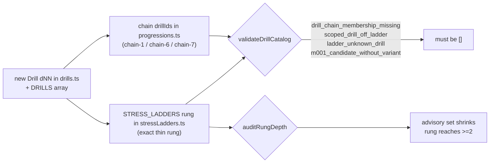

# feat: Roster depth — source-backed second drills for thin stress rungs

## Summary

Seven of the fourteen stress rungs carry only one assembly-eligible (`m001Candidate: true`) drill today, so stepping onto them offers no variety. This plan authors **seven new drills (`d52`–`d58`)** — one per thin rung — each anchored to a specific drill in the **FIVB Beach Volleyball Drill-book** or **Better at Beach (BAB)** corpus, reduced to solo/pair open-sand form where the source assumes a coach or a third player. After this wave every rung reaches `RUNG_DEPTH_TARGET = 2` and the `auditRungDepth` advisory empties.

This is content authoring at the data layer plus its ladder/chain wiring and docs. It does **not** add UI, routes, Dexie changes, or selection-path reroutes.

---

## Problem Frame

`auditRungDepth` (shipped in the M002.2 progression-content layer) flags every rung below two eligible drills. The real catalog today:

| Focus | Rung (eligible count) | Anchor drill | Parked sibling? |
|-------|----------------------|--------------|-----------------|
| pass | **1** (1) | `d01` Pass & Slap Hands | `d02` (towel/markers, prop-friction), `d04` (net-required, substitution-linked) |
| serve | **1** (1) | `d31` Self Toss Target Practice | none |
| serve | **2** (1) | `d51` Serving Outside the Heart | `d23` Serve & Dash (conditioning-gated, `D149`) |
| serve | **3** (1) | `d22` First to 10 Serving | none |
| set | **2** (1) | `d41` Partner Set Back-and-Forth | none |
| set | **3** (1) | `d42` Corner to Corner Setting | none |
| set | **4** (1) | `d47` Four Great Sets | `d20`/`d21` (3+ player, `D101`-gated) |

The user asked to review **all** source material (BAB **and** FIVB) and curate real depth. The existing parked siblings are unfit for solo/pair-first M001 scope (prop friction, net-required, substitution-linked, conditioning-gated, or 3+ player), so depth comes from **new authored drills**, not flag flips. This was the deferred "source-cited backlog" recorded in `docs/specs/stress-rung-taxonomy.md`; this plan executes it.

---

## Source Curation

Each new drill cites a specific source drill captured verbatim in our research archives, and is reduced to the smallest honest open-sand form. Each is deliberately **distinct in intent** from its rung's existing anchor so the rung offers genuine variety, not a near-duplicate.

| New | Rung | Name | Primary source | Modes | Distinct from anchor by |
|-----|------|------|----------------|-------|--------------------------|
| `d52` | pass 1 | Pass Back and Forth | BAB Plan 1 Drill 1 ("Pass back and forth — 10 each") | solo (self-toss continuous), pair (continuous rally) | pure continuous control, no behind-back slap (`d01`) |
| `d53` | serve 1 | Deep Serve Practice | FIVB 2.3 Deep Serve Practice | solo-open, pair-open | grooves the high deep-arc serve, not pinpoint accuracy to a small circle (`d31`) |
| `d54` | serve 2 | Four Corner Serving | BAB "Serving Spots Around the World" (4-zone beginner sequence) | solo-open, pair-open | serial zone *sequence*, vs the single no-serve heart zone (`d51`) |
| `d55` | serve 3 | Sideline Serving Challenge | BAB Plan 2 Drills 5–7 (Server vs Passer) | pair (net, +/- pressure), solo-open (called target) | called single-target under pressure, vs multi-zone points race (`d22`) |
| `d56` | set 2 | Set and Move | FIVB 4.1 Set and Move | solo (continuous self-set, walking), pair | adds a **solo** continuous-rhythm option (`d41` is pair-only) |
| `d57` | set 3 | Moving Target Setting | FIVB 4.4 High Rep Setting (Triangle) reduced + BAB footwork | solo (alternating markers), pair (roaming partner) | changing/random targets, vs two fixed corners (`d42`) |
| `d58` | set 4 | Two-Touch Set Choice | BAB Plan 6 Drill 2 (Steps 2 & 4: pass-to-self → choose bump/hand → set to partner) | pair, solo | explicit first-contact-then-choose structure reducible to pair (`d47` uses four pass locations) |

**Provenance discipline.** Each new drill carries a `// FIVB Drill-book <n.m> <name>` or `// BAB <plan/lesson> <drill>` comment per the citation convention in `docs/research/fivb-source-material.md`. Verbatim cues stay in the research archives; code comments reference, they do not duplicate long quotes. Where the reduction departs from source (e.g., solo open-sand form of a coach-fed drill), the comment states the honest-transfer boundary (the established `d49`/`d50`/`d51` pattern in `docs/solutions/2026-05-04-source-backed-content-depth-activation-pattern.md`).

---

## High-Level Technical Design

Each new drill must satisfy three invariants in the same commit (the `D160` authoring invariant + the M002.2 catalog gate):

The existing test `stress ladder registry invariants > every scoped-tag X drill appears exactly once in its ladder` (in `app/src/data/__tests__/stressLadders.test.ts`) auto-enforces that every new scoped-tag drill lands on exactly one rung. The `auditRungDepth` real-catalog test pins the **exact** thin-rung set and must be updated to the post-wave set (target: empty).

---

## Key Technical Decisions

- **KTD1 — New drills, not flag flips.** Parked siblings are unfit for solo/pair-first scope (see Problem Frame). Authoring new source-backed drills is the only path to honest depth and matches the validated `d49`/`d50`/`d51` activation pattern. Activation of `d02`/`d04`/`d23`/`d20`/`d21` is explicitly rejected and recorded in the candidate-false audit.
- **KTD2 — One drill per thin rung, distinct in intent.** Each new drill differs from the rung anchor on mode, target structure, or skill emphasis (see Source Curation table) so depth adds variety rather than a near-duplicate. No rung gets two new drills.
- **KTD3 — Solo/pair open-sand first.** Every new drill ships at least one variant with `participants.max <= 2` and no unmodeled equipment (no `balls: 'many'`, no `balls > 1`, no towel-only path), so it survives `hasUnmodeledRequirements` in `app/src/domain/sessionAssembly/candidates.ts` and the `m001_candidate_without_variant` gate. Net-required variants (e.g. `d55-pair` server-vs-passer) are allowed only alongside an open-sand sibling variant.
- **KTD4 — Sequential IDs `d52`–`d58`.** Continue the catalog's sequential id convention. (`d34` is unused but reserving it would break the read-order convention; skip it.)
- **KTD5 — Rung content is rung-level, unchanged.** The M002.2 `intent`/`externalFocusCue`/`explorationCriterion`/`graduationFeel` fields live on the `StressRung`, not the drill, so adding drills to an existing rung needs **no** new progression content. `rung_content_missing` stays satisfied.
- **KTD6 — No selection-path reroute.** The `d49`/`d50`/`d51` long-envelope reroutes existed to serve >8-min blocks. This wave targets depth (variety within a rung), which `pickForSlot` already exploits via more candidates per rung. No `selectionPath` change; if dogfood later shows a long-envelope gap, that is a separate follow-up.
- **KTD7 — Courtside-copy compliance.** All authored `courtsideInstructions`/`coachingCues`/`objective` obey `.cursor/rules/courtside-copy.mdc`: no em-dash, jargon glossed on first use (e.g. "set window (where the setter would stand, ~3 m off the net)"), skill-verb-first instructions, role-tagged "you/partner" clauses for pair variants, fatigue caps per `D77`.

---

## Requirements Traceability

- **R1** — Every thin rung (pass 1, serve 1/2/3, set 2/3/4) reaches `eligibleCount >= RUNG_DEPTH_TARGET`. Verified by `auditRungDepth` returning an empty (or documented-residual) advisory set.
- **R2** — Each new drill is source-backed and cited. Verified by code-comment provenance + the curation table.
- **R3** — Each new scoped-tag drill holds exactly one ladder rung and is a member of its declared chain (`D160`). Verified by `validateDrillCatalog` `=== []` and the ladder once-each test.
- **R4** — Each new drill has a solo or pair (<=2 player) open-sand eligible variant. Verified by the `m001_candidate_without_variant` gate and a depth count over `m001Candidate` drills.
- **R5** — Authored copy passes courtside-copy invariants. Verified by the existing rung-content guards + manual courtside-copy checklist at author time.

---

## Implementation Units

### U1. Pass rung 1 depth — `d52` Pass Back and Forth

- **Goal**: add a second constant-contact passing drill to pass rung 1.
- **Requirements**: R1, R2, R3, R4, R5
- **Dependencies**: none
- **Files**: `app/src/data/drills.ts` (new `const d52` + `DRILLS` entry), `app/src/data/progressions.ts` (`chain-1-platform` drillIds), `app/src/data/stressLadders.ts` (`pass` rung 1 drillIds)
- **Approach**: `skillFocus: ['pass']`, `chainId: 'chain-1-platform'`, `levelMin/Max: beginner/intermediate`, `m001Candidate: true`. Solo variant: self-toss continuous control, streak metric, open sand, `fatigueCap` mirroring `d01-solo`. Pair variant: continuous back-and-forth rally (BAB "10 each"), streak metric, `partner-toss`, role-tagged copy. Source comment: `// BAB Plan 1 Drill 1 (Best Warm Up Ever) - pass back and forth`.
- **Patterns to follow**: `d01` (slap-hands, same chain/rung) for variant shape; `d03` continuous-passing copy register.
- **Test scenarios**: covered by catalog + ladder invariants (U8). No bespoke test. `Test expectation: structural — drill validity + rung placement asserted by existing suite.`
- **Verification**: `d52` appears once on pass ladder rung 1; `validateDrillCatalog === []`.

### U2. Serve rung 1 depth — `d53` Deep Serve Practice

- **Goal**: add a second serve rung 1 drill grooving the high, deep serve.
- **Requirements**: R1–R5
- **Dependencies**: none
- **Files**: `app/src/data/drills.ts`, `app/src/data/progressions.ts` (`chain-6-serving`), `app/src/data/stressLadders.ts` (`serve` rung 1)
- **Approach**: `skillFocus: ['serve']`, `chainId: 'chain-6-serving'`, beginner/intermediate, `m001Candidate: true`. Solo-open variant: serve a high ball that lands past a marked deep line, count deep landings, open sand (markers, one ball). Pair-open variant: caller names "deep", server grooves, switch. Carry the FIVB deep-serve cue verbatim-derived: serve must travel high to force passers back. Source comment: `// FIVB Drill-book 2.3 Deep Serve Practice`.
- **Patterns to follow**: `d31` variant shape (solo-open / pair-open / markers, `reps-successful` metric).
- **Test scenarios**: structural (U8). `Test expectation: structural.`
- **Verification**: `d53` once on serve rung 1; catalog clean.

### U3. Serve rung 2 depth — `d54` Four Corner Serving

- **Goal**: add a serial zone-sequence serving drill at serve rung 2.
- **Requirements**: R1–R5
- **Dependencies**: none
- **Files**: `app/src/data/drills.ts`, `app/src/data/progressions.ts` (`chain-6-serving`), `app/src/data/stressLadders.ts` (`serve` rung 2)
- **Approach**: serve the four beginner quadrants in order, repeating a missed zone (capped). Solo-open + pair-open (caller). Open sand with zone markers, one ball. This is the level-scaled sibling between `d53` (one zone) and `d33` (six zones). Source comment: `// BAB Plan 2 Drill 3 Serving Spots Around the World (4-zone beginner)`.
- **Patterns to follow**: `d33` Around the World Serving (six-zone), `d31` markers/metric shape.
- **Test scenarios**: structural (U8). `Test expectation: structural.`
- **Verification**: `d54` once on serve rung 2; catalog clean.

### U4. Serve rung 3 depth — `d55` Sideline Serving Challenge

- **Goal**: add a called-target pressure serving drill at serve rung 3.
- **Requirements**: R1–R5
- **Dependencies**: none
- **Files**: `app/src/data/drills.ts`, `app/src/data/progressions.ts` (`chain-6-serving`), `app/src/data/stressLadders.ts` (`serve` rung 3)
- **Approach**: Pair variant (`needsNet: true`): server serves to passer's sideline/seam; off-target serves redone; `+3/-3` passer-scored pressure frame (BAB Plan 2 Drills 5–7). Solo-open variant: serve to a self-called sideline/seam target on open sand, score hit/miss with redo. Both `live-serve`/`self-toss` as appropriate. The pair variant is the honest pressure form; the solo-open keeps the rung assemblable solo. Source comment: `// BAB Plan 2 Drills 5-7 Server vs Passer (sideline/seam, +3/-3)`.
- **Patterns to follow**: `d22` First to 10 (`points-to-target` metric, net), `d31-pair` caller role.
- **Test scenarios**: structural (U8). `Test expectation: structural.`
- **Verification**: `d55` once on serve rung 3; catalog clean; open-sand variant present so `m001_candidate_without_variant` stays clear.

### U5. Set rung 2 depth — `d56` Set and Move

- **Goal**: add a solo continuous-rhythm setting option at set rung 2.
- **Requirements**: R1–R5
- **Dependencies**: none
- **Files**: `app/src/data/drills.ts`, `app/src/data/progressions.ts` (`chain-7-setting`), `app/src/data/stressLadders.ts` (`set` rung 2)
- **Approach**: `skillFocus: ['set']` (solo self-set has no movement-decision load) — confirm against `d41`. Solo variant: continuous self-set, keep the ball above reach height, walk a slow line, streak metric. Pair variant: continuous set rally adding a step between sets. `chainId: 'chain-7-setting'`, beginner/intermediate. Gives set rung 2 (currently pair-only `d41`) a solo route. Source comment: `// FIVB Drill-book 4.1 Set and Move`.
- **Patterns to follow**: `d41` Partner Set Back-and-Forth (streak metric, arc-above-reach cue).
- **Test scenarios**: structural (U8). `Test expectation: structural.`
- **Verification**: `d56` once on set rung 2; catalog clean.

### U6. Set rung 3 depth — `d57` Moving Target Setting

- **Goal**: add a changing-target setting drill at set rung 3.
- **Requirements**: R1–R5
- **Dependencies**: none
- **Files**: `app/src/data/drills.ts`, `app/src/data/progressions.ts` (`chain-7-setting`), `app/src/data/stressLadders.ts` (`set` rung 3)
- **Approach**: `skillFocus: ['set', 'movement']` (target changes force court-position movement, mirroring `d42`). Solo variant: set to alternating left/right markers, moving between each. Pair variant: partner roams to varied spots, setter squares up and sets to wherever partner is. `reps-successful` metric. Distinct from `d42`'s two fixed corners by random/alternating targets. Source comment: `// FIVB Drill-book 4.4 High Rep Setting (Triangle) reduced; BAB footwork-for-setting`.
- **Patterns to follow**: `d42` Corner to Corner (markers, square-up cue, `set + movement` focus).
- **Test scenarios**: structural (U8). `Test expectation: structural.`
- **Verification**: `d57` once on set rung 3; catalog clean.

### U7. Set rung 4 depth — `d58` Two-Touch Set Choice

- **Goal**: add a bump-or-hand decision setting drill reducible to pair at set rung 4.
- **Requirements**: R1–R5
- **Dependencies**: none
- **Files**: `app/src/data/drills.ts`, `app/src/data/progressions.ts` (`chain-7-setting`), `app/src/data/stressLadders.ts` (`set` rung 4)
- **Approach**: `skillFocus: ['set', 'movement']`, intermediate/advanced. Pair variant: partner feeds an imperfect first ball; setter passes to self (first touch), chooses bump set vs hand set, delivers a hittable ball to partner (BAB Plan 6 Drill 2 Steps 2 & 4). Solo variant: self-pass off a self-toss, choose hands/platform, set into a target window. Distinct from `d47`'s four-pass-location structure by the explicit pass-to-self-then-choose pattern. Source comment: `// BAB Plan 6 Drill 2 (Corner to Corner) Steps 2 & 4 - two-touch bump/hand choice`.
- **Patterns to follow**: `d47` Four Great Sets (bump/hand choice, `set + movement`, solo-open + pair-open).
- **Test scenarios**: structural (U8). `Test expectation: structural.`
- **Verification**: `d58` once on set rung 4; catalog clean.

### U8. Tests, advisory pin, and docs sync

- **Goal**: prove the wave and update the depth advisory + canonical docs.
- **Requirements**: R1, R3
- **Dependencies**: U1–U7
- **Files**: `app/src/data/__tests__/catalogValidation.test.ts`, `app/src/data/__tests__/stressLadders.test.ts` (if rung-membership expectations are explicitly enumerated anywhere), `docs/specs/stress-rung-taxonomy.md`, `docs/reviews/2026-04-28-m001-candidate-false-audit.md`, `docs/status/current-state.md`, `docs/catalog.json`
- **Approach**:
  - Update the `auditRungDepth` real-catalog test (`surfaces exactly the known thin rungs`) to the post-wave advisory set. Target is `[]`; if any rung legitimately stays thin (it should not), pin the residual explicitly with a comment.
  - In `docs/specs/stress-rung-taxonomy.md`: mark the roster-depth backlog rows filled, update the depth-target note (the "7 under target today" line in code/spec) to the new state, and record the per-rung source choice.
  - In the candidate-false audit: add a 2026-06-21 note that depth came from new authored drills (`d52`–`d58`) and that `d02`/`d04`/`d23`/`d20`/`d21` stay parked (reasons unchanged).
  - Update `docs/catalog.json` (register this plan) and `docs/status/current-state.md` (shipped-history entry).
- **Test scenarios**:
  - `auditRungDepth({drills: DRILLS, stressLadders: STRESS_LADDERS})` returns `[]` (happy path / the headline assertion).
  - `validateDrillCatalog({drills: DRILLS, progressionChains: PROGRESSION_CHAINS, stressLadders: STRESS_LADDERS})` returns `[]` (no membership/ladder/candidate regressions).
  - Existing ladder once-each test passes for all three focuses (each new drill on exactly one rung).
- **Verification**: full app test suite green; `bash scripts/validate-agent-docs.sh` passes.

---

## Scope Boundaries

**In scope**: seven new drills + their chain membership, ladder placement, source comments; the advisory-test update; spec/audit/catalog/current-state docs sync.

### Deferred to Follow-Up Work

- **Selection-path reroutes / long-envelope siblings** for any of the new drills (only if dogfood shows a >8-min block gap).
- **`serve.2` net-faithful variant** beyond the open-sand four-corner form, if partner dogfood wants a true net sequence.
- **3+ player drills** (`d20`/`d21` group set, BAB triangle/monster passing) — remain `D101`-gated.
- **Attack-track content** — out of this wave entirely.

### Not in this product's scope now

- Rendering rung/drill progression content on Run/Transition/Setup/Review (the deferred M002.2 UI pass).
- The objective "1% better" score (`M002.3`).

---

## Risks & Mitigations

- **Fabricated coaching content (correctness).** New `courtsideInstructions`/cues are authored, not literally copied. Mitigation: anchor each to a captured source drill, keep reductions conservative, obey courtside-copy invariants, and rely on founder-as-coach (`D130`) dogfood review. This is the accepted `d49`/`d50`/`d51` pattern.
- **Near-duplicate of the rung anchor (maintainability).** Mitigation: KTD2 distinct-intent rule; the curation table names the specific axis of distinction per drill.
- **Unmodeled-equipment filtering silently de-activates a drill (depth not actually achieved).** Mitigation: KTD3 — at least one `<=2`-player, single-ball, no-towel variant per drill; verify `auditRungDepth` actually empties (not just that the drill exists).
- **Ladder/chain drift (`D160`).** Mitigation: add chain drillIds + ladder rung in the same unit as each drill; `validateDrillCatalog === []` is the tripwire.

---

## Sources & Research

- `docs/research/fivb-source-material.md` — FIVB Beach Volleyball Drill-book archive (2.3 Deep Serve Practice, 4.1 Set and Move, 4.4 High Rep Setting, drill data model, citation convention).
- `docs/research/bab-source-material.md` — Better at Beach archive (Plan 1 pass/set back-and-forth, Plan 2 Serving Spots Around the World + Server vs Passer, Plan 6 Corner to Corner two-touch).
- `docs/specs/stress-rung-taxonomy.md` — rung semantics, depth target, and the roster-depth backlog this plan fills.
- `docs/reviews/2026-04-28-m001-candidate-false-audit.md` — why parked siblings stay parked.
- `docs/solutions/2026-05-04-source-backed-content-depth-activation-pattern.md` — the validated `d49`/`d50`/`d51` source-backed authoring pattern this wave follows.
