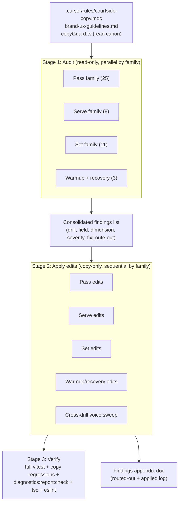

# refactor: Catalog-wide drill logic + authoring + tone audit

## Summary

Read every drill in `app/src/data/drills.ts` (47 drills, ~90 variants) field by field, confirm each is internally **logical** and **well-authored**, and run a catalog-wide **tone/voice** pass so the copy reads as one calm, consistent coach voice. Edit where needed. This is a copy-and-coherence refactor: it must not change participants, equipment, workload, fatigue caps, `skillFocus`, `m001Candidate`, source-backed training promises, ladder/chain wiring, or seeded assembly output. Where a quality problem can only be fixed by changing one of those, it is logged as a finding and routed out, not silently patched here.

---

## Problem Frame

The catalog grew incrementally across many tiers and authoring waves (most recently d52–d58 in the M002.2 roster-depth wave). The mechanical copy invariants (`.cursor/rules/courtside-copy.mdc`, enforced by `drillCopyRegressions.test.ts`) all pass, but mechanical compliance is a floor, not a ceiling. Three quality dimensions are **not** test-enforced and have drifted unevenly across authoring waves:

1. **Logical coherence** — does each field say something true and self-consistent, and do the fields agree with each other? (e.g., does `successMetric.target` match what `courtsideInstructions` tells you to do; does `progressionDescription` actually make the drill harder; does `regressionDescription` actually make it easier; do `teachingPoints` match the `objective`; do `coachingCues` reinforce the stated skill).
2. **Authoring quality** — is each field clear, specific, and free of vague or filler phrasing; are instructions actionable; are targets concrete; are cues single-idea and observable.
3. **Tone / voice consistency** — does the whole catalog read in one register: calm, shibui, encouraging, plain-language, courtside-appropriate; no drill that is markedly chattier, terser, more clinical, or more jargon-y than its neighbours.

The user asked to "team read" all drills (new and pre-existing) across all fields, fix what needs fixing, and do a copy pass for tone.

---

## Scope

### In scope

- All 47 drills and ~90 variants in `app/src/data/drills.ts`, every user-visible field:
  - `name`, `shortName`, `objective`, `teachingPoints[]`, `progressionDescription`, `regressionDescription`
  - per variant: `successMetric.description`, `successMetric.target`, `courtsideInstructions`, `coachingCues[]`, `segments[].label`
- Cross-field coherence within each drill, and cross-drill voice consistency across the catalog.
- Editing copy in place where a finding is a genuine copy-only fix.

### Out of scope (route out, do not patch here)

- Any change to `participants`, `equipment`, `workload`, `fatigueCap`, `environmentFlags`, `skillFocus`, `levelMin/Max`, `m001Candidate`, `chainId` — these are envelope/assembly fields. Per the courtside-copy "envelope-honesty rule," if better copy needs one of these to change, that is not a copy fix; log it and route to the catalog/workload/generator workflow.
- Source fidelity rewrites that would change a drill's source-backed training promise (route to the source-backed content workflow).
- New drills, new rungs, ladder/chain rewiring (owned by the roster-depth / progression workflows).
- Changing the copy invariants themselves (`.cursor/rules/courtside-copy.mdc`).

### Deferred to Follow-Up Work

- Any finding that requires an envelope or assembly change is captured in a findings appendix (committed) and handed off; it is not implemented in this plan.

---

## The audit rubric

Every drill is scored against this rubric, field by field. A finding records: `drillId`, `variantId?`, `field`, `dimension` (logic | authoring | tone | envelope-routed), `severity` (P1 must-fix / P2 should-fix / P3 nit), the problem, and the proposed fix (or "route out" target).

### A. Logical coherence checks

- **objective ↔ teachingPoints**: teaching points support the stated objective; no contradiction; no teaching point that describes a different skill.
- **objective ↔ skillFocus**: the prose trains the skill the eyebrow claims.
- **progression actually harder / regression actually easier**: each names a real difficulty lever in the correct direction; neither silently changes participants/equipment (envelope-honesty).
- **successMetric.target ↔ description ↔ courtsideInstructions**: the count/streak/time you are told to chase matches what the instructions tell you to do; target is achievable within the workload window; `type` (streak/reps-successful/etc.) matches the described measurement.
- **courtsideInstructions internal logic**: the sequence is executable as written; no step depends on something not yet set up; miss-handling and end condition are coherent (rule 10 for pair drills).
- **coachingCues ↔ skill**: cues reinforce the drill's actual skill and stated objective; no cue that contradicts the instructions.
- **variant parity**: solo vs pair variants of the same drill describe the same underlying skill honestly (the reduction is not a different drill wearing the same name).

### B. Authoring-quality checks

- Concrete over vague: targets are numeric/observable; instructions name the action, not a mood.
- One idea per coaching cue; cues are observable outcomes (external focus, rule 12) not body-part instructions unless justified.
- `successMetric.description` says what counts and when to reset/stop.
- No filler, no redundancy across fields (objective should not just restate the name; teachingPoints should not repeat each other).
- `name` / `shortName` are descriptive and consistent in style across the catalog.

### C. Tone / voice consistency checks

- One register across the catalog: calm, encouraging, plain, courtside. Reference: `docs/research/brand-ux-guidelines.md` (shibui / calm) and the courtside-copy voice rules.
- No drill noticeably chattier, terser, more clinical, or more coach-jargon-y than the catalog norm.
- Consistent person/address (second person "you"; pair role-tagging per rule 8).
- Consistent vocabulary for the same concept across drills (e.g., "catchable height", "set window", "reset the count" used the same way everywhere).
- Encouraging-not-pressuring framing consistent with the exploratory-criterion pedagogy already in the stress-rung content.

### Hard guardrails (a fix is invalid if it breaks any)

- All `drillCopyRegressions.test.ts` invariants stay green (rules 1–14: jargon gloss, no em-dash, skill-verb-first, role-tagging, ≤45 words, cue ordering, etc.).
- `copyGuard.ts` / D86 regulatory boundary: no medical, therapeutic, diagnostic, or pain-treatment claims.
- No envelope/assembly field changes; seeded `sessionBuilder` golden snapshot unchanged; `generatedPlanDiagnostics` counts unchanged (copy does not feed diagnostics).
- Source-backed provenance comments remain accurate after edits.

---

## High-Level Technical Design

Two-stage flow per skill family: **read-only audit → apply edits**. The audit stage produces a structured findings list; the edit stage applies only copy-only findings and routes the rest to the appendix.

The family split matches the `skillFocus[0]` distribution (25 pass / 8 serve / 11 set / 2 recovery / 1 warmup). Editing one family per commit keeps each change atomic and reviewable, and isolates any test fallout.

---

## Key Technical Decisions

- **KTD1 — Audit before edit, with a written findings list.** The "team read" is a genuine read-only pass first (dispatch one read-only reviewer per family), producing a consolidated findings list scored by the rubric. Edits are applied from the list, not improvised while reading. This keeps the edit diff justified and lets envelope-routed findings be separated cleanly.
- **KTD2 — Copy-only boundary is the firewall.** The single most important guardrail: this work touches only user-visible string fields. Any finding that wants an envelope/assembly change is logged and routed out (envelope-honesty rule). This is what keeps the seeded assembly snapshot and diagnostics counts stable and the change low-risk.
- **KTD3 — Severity gate on edits.** Apply P1 (logic errors, broken target↔instruction agreement, tone outliers that break the calm register) and P2 (clear authoring improvements) findings. P3 nits are applied only when they are zero-risk and improve consistency; otherwise logged. Avoid churn-for-churn's-sake rewrites of already-good copy.
- **KTD4 — Voice consistency is measured against the catalog norm, not invented.** The tone pass aligns outliers toward the existing dominant voice (calm, plain, second-person, encouraging), rather than imposing a new style. The reference is the best-authored existing drills plus `brand-ux-guidelines.md`.
- **KTD5 — Edit family-by-family with a verification gate between families.** Run the copy-regression suite after each family's edits so any invariant break (em-dash, word count, skill-verb-first, role-tagging) is caught against a small diff, not the whole catalog at once.

---

## Implementation Units

### U1. Establish the audit harness and findings doc

**Goal:** Create the structured findings document and confirm the canon references so every later unit scores against the same rubric.

**Files:**
- `docs/reviews/2026-06-21-drill-catalog-quality-audit.md` (create — findings log + routed-out appendix)

**Approach:** Seed the findings doc with the rubric (sections A/B/C above), a per-family table skeleton, and a "routed-out (envelope/assembly)" appendix section. Re-read `.cursor/rules/courtside-copy.mdc`, `docs/research/brand-ux-guidelines.md` (voice/shibui section), and `app/src/lib/copyGuard.ts` to pin the guardrail vocabulary. No code edits.

**Test scenarios:** Test expectation: none — documentation scaffold, no behavioral change.

**Verification:** Findings doc exists with the rubric and an empty per-family table ready to fill.

---

### U2. Audit pass — read-only, all families

**Goal:** Produce the consolidated findings list for all 47 drills.

**Dependencies:** U1

**Files:**
- `docs/reviews/2026-06-21-drill-catalog-quality-audit.md` (fill findings tables)
- reads `app/src/data/drills.ts`

**Approach:** Dispatch read-only reviewers per family (pass / serve / set / warmup+recovery), each scoring every drill and variant against rubric A/B/C and tagging severity. Each finding names `drillId`, `field`, `dimension`, `severity`, problem, and proposed fix or route-out target. Consolidate into the findings doc. Flag cross-drill voice inconsistencies (vocabulary drift, register outliers) as a separate family-spanning section feeding U7.

**Execution note:** Start read-only — no edits during the audit pass. The reviewers must verify each finding against the actual file text (quote the current string), not assume.

**Test scenarios:** Test expectation: none — read-only analysis; output is the findings doc.

**Verification:** Every drill (d01–d58, all variants) appears in the findings tables with at least a "no issues" line; each finding is actionable and severity-tagged; envelope-needing findings are in the routed-out appendix, not the edit queue.

---

### U3. Apply edits — pass family (25 drills)

**Goal:** Apply copy-only P1/P2 (and zero-risk P3) findings for pass-focus drills.

**Dependencies:** U2

**Files:**
- `app/src/data/drills.ts` (pass drills only)
- `app/src/data/__tests__/drillCopyRegressions.test.ts` (only if a pinned expectation must track an intentional copy change)

**Approach:** Edit string fields in place per the findings list. Preserve every envelope field. Keep skill-verb-first, role-tagging, jargon-gloss, ≤45-word, and no-em-dash invariants. Update any provenance comment only if a copy change makes it inaccurate.

**Test scenarios:**
- Happy path: edited pass drills still pass all `drillCopyRegressions` cases (skill-verb-first, jargon gloss, word count, role-tagging where applicable).
- Edge: any `successMetric.target` edited to match instructions does not change `successMetric.type`.
- Integration: full `catalogValidation` still clean; no envelope field changed (diff is string-only).

**Verification:** `npx vitest run src/data/__tests__/drillCopyRegressions.test.ts src/data/__tests__/catalogValidation.test.ts` green; `git diff` on `drills.ts` shows only string-field changes for pass drills.

---

### U4. Apply edits — serve family (8 drills)

**Goal:** Apply copy-only findings for serve-focus drills.

**Dependencies:** U2

**Files:**
- `app/src/data/drills.ts` (serve drills only)

**Approach:** As U3, scoped to serve drills. Pay special attention to spatial POV anchoring (rule 11: prefer short/deep over front/back) and pair logistics (rule 10) since serve drills carry the heaviest logistics load.

**Test scenarios:**
- Happy path: edited serve drills pass all copy regressions including the POV-anchor and five-question logistics expectations.
- Edge: zone enumerations remain non-combinatoric (rule 3) and POV-anchored after edits.

**Verification:** Copy-regression + catalogValidation suites green; serve-drill diff is string-only.

---

### U5. Apply edits — set family (11 drills)

**Goal:** Apply copy-only findings for set-focus drills.

**Dependencies:** U2

**Files:**
- `app/src/data/drills.ts` (set drills only)

**Approach:** As U3, scoped to set drills. Verify `set`/`set+movement` cue consistency and that hand-set vs bump-set vocabulary is used consistently and correctly.

**Test scenarios:**
- Happy path: edited set drills pass all copy regressions.
- Integration: `acceptConsequence` and `findSwapAlternatives` (which reference specific set drills) still pass — copy edits must not perturb their assertions.

**Verification:** Copy-regression + catalogValidation + the set-referencing domain tests green; set-drill diff is string-only.

---

### U6. Apply edits — warmup + recovery family (3 drills)

**Goal:** Apply copy-only findings for warmup/recovery drills (the lowest-engagement, highest-jargon-hiding blocks per rule 5).

**Dependencies:** U2

**Files:**
- `app/src/data/drills.ts` (warmup/recovery drills only)

**Approach:** As U3, scoped to warmup/recovery. Apply rule 5 weight: movement-vocabulary glosses, cadence-format labels on timed segments, and spatial-referent execution cues for named stretches.

**Test scenarios:**
- Happy path: edited warmup/recovery drills pass all copy regressions (movement-vocabulary gloss, cadence-format).
- Edge: `segments[].label` cadence formats remain valid; no em-dash introduced in wrap copy.

**Verification:** Copy-regression + catalogValidation green; warmup/recovery diff is string-only.

---

### U7. Cross-drill voice consistency sweep

**Goal:** Resolve the catalog-spanning tone findings — vocabulary drift and register outliers — so the catalog reads as one voice.

**Dependencies:** U3, U4, U5, U6

**Files:**
- `app/src/data/drills.ts` (any drill flagged as a voice outlier)
- `docs/reviews/2026-06-21-drill-catalog-quality-audit.md` (mark voice findings resolved)

**Approach:** Apply the family-spanning voice findings from U2: normalize repeated-concept vocabulary (e.g., consistent phrasing for "catchable height", "reset the count", "set window"), bring chatty/terse/clinical outliers toward the catalog norm, and confirm consistent second-person address and encouraging framing. This unit is deliberately last so per-family edits are already in before the global consistency judgment.

**Test scenarios:**
- Happy path: full `drillCopyRegressions` suite green after the sweep.
- Edge: no vocabulary normalization reintroduces an unglossed jargon term.

**Verification:** Full copy-regression suite green; a re-read of three random drills per family shows consistent voice.

---

### U8. Verify, sync docs, and record routed-out findings

**Goal:** Prove the catalog is unbroken end-to-end and leave a durable record.

**Dependencies:** U3–U7

**Files:**
- `docs/reviews/2026-06-21-drill-catalog-quality-audit.md` (finalize: applied log + routed-out appendix)
- `docs/catalog.json` (add the audit doc entry)
- `docs/status/current-state.md` (one-line shipped-history entry)

**Approach:** Run the full gate. Confirm the seeded assembly snapshot and diagnostics counts are unchanged (proof the edits were truly copy-only). Finalize the findings doc with what was applied and what was routed out (with route-out targets). Add the catalog entry and a current-state line. Run agent-docs validation since docs changed.

**Test scenarios:**
- Integration: `npx vitest run` (full suite) green; `npm run diagnostics:report:check` current (unchanged); `npx tsc --noEmit` + `npx eslint` clean.
- Regression: `sessionBuilder` golden snapshot and `generatedPlanDiagnostics` counts unchanged from pre-audit (copy-only proof).

**Verification:** Full suite green, diagnostics unchanged, `bash scripts/validate-agent-docs.sh` passes, findings doc finalized, catalog + current-state synced.

---

## Verification Strategy

- Per-family gate (U3–U7): `npx vitest run src/data/__tests__/drillCopyRegressions.test.ts src/data/__tests__/catalogValidation.test.ts` after each family.
- Final gate (U8): full `npx vitest run`, `npm run diagnostics:report:check`, `npx tsc --noEmit`, `npx eslint`, `bash scripts/validate-agent-docs.sh`.
- Copy-only proof: `git diff app/src/data/drills.ts` contains only string-literal changes (no envelope keys); `sessionBuilder` golden + `generatedPlanDiagnostics` snapshots unchanged.

---

## Risks & Mitigations

- **Risk: scope creep into envelope/assembly fixes.** Mitigation: KTD2 firewall — envelope-needing findings are routed out to the appendix, never patched here. The copy-only `git diff` check at U8 is the proof.
- **Risk: tone pass becomes subjective churn.** Mitigation: KTD3 severity gate + KTD4 align-to-existing-norm. Do not rewrite already-good copy.
- **Risk: a copy edit silently breaks a pinned regression (em-dash, word count, skill-verb-first).** Mitigation: per-family verification gate (KTD5) catches breaks against a small diff.
- **Risk: regulatory copy boundary.** Mitigation: copyGuard/D86 is a hard guardrail in the rubric; no therapeutic/medical/pain-treatment claims introduced.
- **Risk: an edit changes seeded assembly output.** Mitigation: copy fields do not feed assembly or diagnostics; U8 explicitly re-checks the golden snapshot and diagnostics counts are unchanged.

---

## Sources & Research

- `.cursor/rules/courtside-copy.mdc` — the 14 copy invariants (jargon gate, no em-dash, skill-verb-first, pair role-tagging, cue ordering, word-count ceiling) and the exercise copy contract / envelope-honesty rule.
- `docs/research/brand-ux-guidelines.md` — calm/shibui voice reference for the tone pass.
- `app/src/lib/copyGuard.ts` + D86 regulatory boundary — forbidden therapeutic/medical vocabulary guardrail.
- `app/src/data/__tests__/drillCopyRegressions.test.ts` — mechanical enforcement of the copy invariants (the floor this audit sits above).
