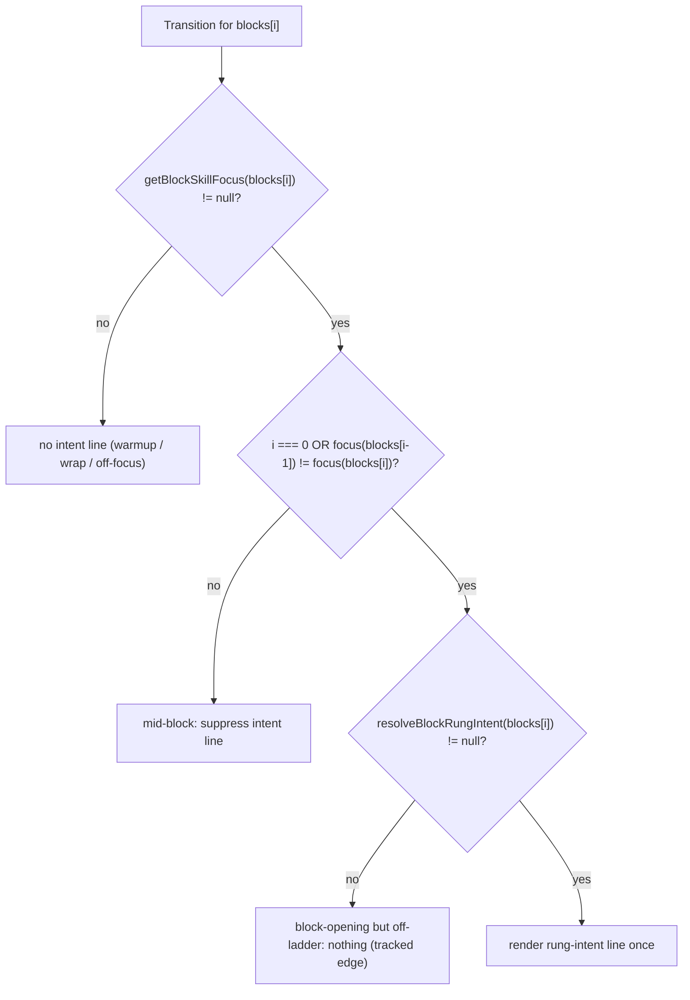

# feat: Run-flow beat contract — Stage 1 (lean the beats apart) + Stage 0 lexicon

**Origin:** `docs/brainstorms/2026-06-23-run-flow-beat-contract-requirements.md`
**Plan type:** feat · **Depth:** Standard
**Created:** 2026-06-23

## Summary

Make the run flow read as one calm instrument by giving each beat one job. This plan ships **Stage 0** (author the beat contract + a run-flow label lexicon, pinned by a light test) and **Stage 1** (lean the beats apart): cut the coaching cue from `TransitionScreen` outright (the cue's only home becomes Run's "Now"), gate the rung-intent line to the **block-opening** Transition only, and remove Run's inline full-instructions read (segment-0 paragraph + the instructions branch of the disclosure) so the full setup read is homed only on Transition. Run stays the one-cue DO-CONFIRM cockpit, keeping "Now" plus the "Show more cues" affordance for extra coaching cues. Stages 2-4 (recovery peek, felt continuity, collapse) are gated on Stage-1 dogfood and explicitly deferred.

Founder steer this session: **as minimal as possible**; staging is what keeps the change safe.

## Problem Frame

`TransitionScreen`'s body is a near-superset of `RunScreen`'s body one tap apart (the deliberate 2026-04-22 "mirror"/dress-rehearsal treatment, documented in `app/src/screens/TransitionScreen.tsx`). The coaching cue renders under "Cue" on Transition and again as "Now" on Run (and a third time behind Transition's "More cues"); the D163 rung-intent line (shipped 2026-06-22) is rung-generic but renders on every ladder-bearing Transition, including mid-block; the full `courtsideInstructions` read renders on both Transition and Run. The cost is paid every drill by a winded athlete who can absorb one or two items, not a paragraph. The durable fix is a **beat contract** that assigns each athlete-facing field exactly one full-weight home; Stage 1 applies the first, highest-impact slice of that contract. (See origin: `docs/brainstorms/2026-06-23-run-flow-beat-contract-requirements.md`.)

## Key Technical Decisions

- **Run keeps "Show more cues"; only the full *instructions* read is removed (R7b reconciled with R16 / courtside-copy rule 12a).** The beat-contract table lists the cue's demoted home as "behind Run's 'Show more cues'", so the disclosure stays for *extra coaching cues*. R7b removes the *instructions* content from Run — the segment-0 inline paragraph and the instructions branch of the shared `
` — not the cue branch. Alternative (delete the whole disclosure) is rejected: it would strip the rule-12a more-cues affordance and contradict the contract table. The combined "Show more cues and instructions" summary collapses to "Show more cues".
- **Block-opening detection is a new pure domain helper over the flat `blocks[]`; `resolveBlockRungIntent` is left unchanged.** There is no "focus block" grouping field — `SessionPlan.blocks` is a flat ordered `SessionPlanBlock[]` and sessions are single-skill-chain (each block type appears at most once). A focus block "opens" at index `i` when `getBlockSkillFocus(blocks[i]) != null && (i === 0 || getBlockSkillFocus(blocks[i-1]) !== getBlockSkillFocus(blocks[i]))`. Keeping `resolveBlockRungIntent` untouched preserves its existing domain test (D163).
- **Positional gating (matches AE1); off-ladder opener is an accepted Stage-1 edge.** If a focus run's opening block is off-ladder (intent `null`) but a later same-focus block is on-ladder, positional gating shows nothing for that run. This is rare in current archetypes (technique/movement/main/pressure are on-ladder) and matches AE1's positional phrasing; recorded as a tracked edge, not solved here.
- **Lexicon scope for Stage 1 = the founder-decided changes only.** Canonicalize the action CTA to **"Start"** (was "Start next block") and the cue label to **"Now"** (unified once the Transition "Cue" label is cut), pinned by a discriminating test. Swap / shorten / skip / block-counter strings are contextual variants (full vs compact, "Next:"/"Last:"/bare), not drift; they are recorded in the lexicon module as canonical-at-current-strings and **not churned**. Their normalization is deferred to a quick founder pass (origin OQ).
- **Encode lexicon + sunset via existing patterns, not a new framework (R4).** Reuse the `app/src/contracts/runFlowInteractionContract.ts` + `SUNSET_*` shape and the `app/src/lib/copyGuard.ts` DOM+ARIA scan. The beat contract itself is a durable doc (R1/R2); the code-side pin is a small constants module + vitest test.
- **Land the D163 revisit as an explicit decision row, not a silent revert.** Relocating the intent line and cutting the Transition cue both touch D163's shipped placement; add a new decision row in `docs/decisions.md` citing courtside-copy rule 12a/13 and invariant R16.
- **Tests must be discriminating and mutation-checked.** A pin that also passes against pre-change code pins nothing. The load-bearing assertions are *negative-today*: cue **absent** on Transition, full instructions **absent** on Run — each must go red if its removal is reverted.
- **Stage 1 deliberately strands mid-rep recovery on Run.** Removing Run's full read leaves no on-Run way to re-read the setup until Stage 2's peek (R9). This is a sequenced trade justified by rule 13 (the `skillFocus` + `successMetric.description` + `coachingCues[0]` triple is re-runnable without the prose read); do not patch it inside Stage 1.

## High-Level Technical Design

Block-opening predicate (R6), evaluated in the domain layer and consumed by `useTransitionController`:

Stage-1 beat bodies (what each screen carries after this plan):

| Beat | Before (today) | After (Stage 1) |
|---|---|---|
| Transition | title + eyebrow + duration + **intent (every ladder block)** + full read + **cue + "More cues"** + footer | title + eyebrow + duration + **intent (block-opening only)** + full read + footer (**no cue**) |
| Run (live) | "Now" + **segment-0 inline read** + **"Show full instructions/more cues" disclosure** + SegmentList + preroll | "Now" + **"Show more cues" (extra cues only)** + SegmentList + preroll (**no full read**) |

## Implementation Units

### U1. Run-flow lexicon + sunset module (Stage 0)

- **Goal:** A single source of truth for run-flow action/cue labels and the retired strings, so drift cannot silently return and Stage-1 screens render from constants.
- **Requirements:** R1 (code-side anchor), R2, R3, R4.
- **Dependencies:** none.
- **Files:**
  - `app/src/contracts/runFlowLexicon.ts` (new) — export `RUN_FLOW_LABELS` (`startAction: 'Start'`, `cue: 'Now'`, plus current canonical `swap`/`shorten`/`shortenFull`/`skip` recorded as-is) and `SUNSET_RUN_FLOW_LABELS` (`['Start next block', 'GO', 'Cue']`).
  - `app/src/contracts/__tests__/runFlowLexicon.test.ts` (new).
- **Approach:** Plain exported `const` objects/arrays (no React). Mirror the data shape of `runFlowInteractionContract.ts` (typed `as const`). Document inline that swap/shorten/skip/counter are contextual variants pending a founder normalization pass. Do not wire screens here beyond export; U2/U5 consume it.
- **Patterns to follow:** `app/src/contracts/runFlowInteractionContract.ts` (`SUNSET_RUN_FLOW_CONTRACT` shape); `app/src/lib/copyGuard.ts` for the consumption model.
- **Test scenarios:**
  - `RUN_FLOW_LABELS.startAction === 'Start'` and `RUN_FLOW_LABELS.cue === 'Now'`.
  - `SUNSET_RUN_FLOW_LABELS` contains `'Start next block'`, `'GO'`, and `'Cue'`.
  - No active label string also appears in `SUNSET_RUN_FLOW_LABELS` (active ∩ sunset = ∅).
- **Verification:** module test passes; `tsc` clean.

### U2. Cut the coaching cue from Transition; rename CTA to "Start" (R5, R7, R3)

- **Goal:** Transition carries no coaching cue at all and its primary CTA reads "Start".
- **Requirements:** R5, R7, R3, R16. Covers AE2 (Transition half).
- **Dependencies:** U1.
- **Files:**
  - `app/src/screens/TransitionScreen.tsx` — remove the `cueLines`/`primaryCue`/`moreCues` derivation (~`:62-63`) and the entire cue `<section>` (~`:218-245`); remove the now-unused `splitCueLines` import (keep `blockEyebrowLabel`/`formatDuration`); set the primary CTA to `RUN_FLOW_LABELS.startAction`; rewrite the "mirror/dress-rehearsal" docblock (~`:67-116`) to state the new beat-contract intent (READ-DO setup + decide; no cue) rather than leaving the reversed rationale in place.
  - `app/src/screens/__tests__/TransitionScreen.beat-density.test.tsx` (new) — Transition body census + cue-absence.
  - `app/src/screens/__tests__/TransitionScreen.controller.test.tsx` (update any `'Start next block'` query to `'Start'`).
- **Approach:** Keep the title cluster, the `GlossedText` full read, and the footer adjust controls untouched (swap/shorten/skip labels unchanged this stage). Only the cue block and the CTA string change.
- **Patterns to follow:** existing `ScreenShell.Body`/`Footer` zones; the `D156` `HomeScreen.render-budget.test.tsx` census-assertion precedent for the new density test.
- **Test scenarios:**
  - **(discriminating)** No coaching-cue text and no "Cue"/"More cues" control render anywhere on Transition for a block that has `coachingCue` set — must fail if the cue section is restored. *(Covers AE2.)*
  - The full setup read (`courtsideInstructions`) still renders.
  - Primary CTA renders the exact string "Start" (and "Start next block" is absent).
  - Mid-block Transition body contains only: title, eyebrow, duration, full read, footer (census). *(Covers R7.)*
- **Verification:** new + updated Transition tests green; cue gone; CTA reads "Start".

### U3. Block-opening rung-intent domain helper (R6)

- **Goal:** A pure predicate/resolver that yields the rung intent only at a focus block's opening.
- **Requirements:** R6.
- **Dependencies:** none (logically precedes U4).
- **Files:**
  - `app/src/domain/drillMetadata.ts` — add `resolveBlockOpeningIntent(blocks: SessionPlanBlock[], index: number, playerCount: number): string | null` (and/or a `isFocusBlockOpening` helper it composes).
  - `app/src/domain/__tests__/drillMetadata.blockOpening.test.ts` (new).
- **Approach:** Compute focus via the existing `getBlockSkillFocus`; apply the predicate from Key Technical Decisions; when opening, return `resolveBlockRungIntent(blocks[index], playerCount)` (unchanged resolver), else `null`. Pure, null-safe, no React/Dexie. Leave `resolveBlockRungIntent` and its test untouched.
- **Patterns to follow:** sibling `getBlockSkillFocus` / `resolveBlockRungIntent` resolvers in the same file (same null-return contract).
- **Test scenarios:**
  - `warmup(0,null) → technique(1,pass)`: index 1 is an opening → returns the pass intent. *(Covers AE1.)*
  - Same-focus successor (`technique(pass) → main_skill(pass)`): mid-block → returns `null`. *(Covers AE1.)*
  - Index where focus is `null` (warmup/wrap) → `null`.
  - Block-opening but off-ladder drill (intent `null`) → `null`, no throw (tracked edge).
  - Focus change `pass → set` at an index → opening → returns the **set** intent (not pass).
- **Verification:** new domain test passes; `drillMetadata.rungIntent.test.ts` still green.

### U4. Gate the Transition intent line to block-opening (R6)

- **Goal:** The rung-intent line renders only on the block-opening Transition, never mid-block, never on Run.
- **Requirements:** R6. Covers AE1.
- **Dependencies:** U3.
- **Files:**
  - `app/src/screens/transition/useTransitionController.ts` — replace the unconditional `resolveBlockRungIntent(nextBlock, …)` with `resolveBlockOpeningIntent(plan.blocks, currentBlockIndex, plan.playerCount ?? 1)`; keep returning `rungIntentLine: string | null`.
  - `app/src/screens/__tests__/TransitionScreen.rungIntent.test.tsx` — extend: opening shows, mid-block suppressed; warmup absent; rewrite the "ladder-bearing ⇒ shows" docblock to "block-opening ⇒ shows".
- **Approach:** Screen render stays `{rungIntentLine && …}` — no JSX change needed; the policy moves into the controller via the domain helper. No new state.
- **Patterns to follow:** the controller's existing `nextBlock`/`prevBlock`/`currentBlockIndex` access; the screen's `{rungIntentLine && …}` guard.
- **Test scenarios:**
  - First (block-opening) Transition of a focus block renders the intent line. *(Covers AE1.)*
  - Second and third transitions within the same focus block render no intent line. *(Covers AE1.)*
  - Warmup/off-ladder next block renders no intent line (unchanged).
- **Verification:** rungIntent test green with the new cases; Run never renders the line.

### U5. Remove Run's inline full read; keep "Now" + "Show more cues" (R7b, R16)

- **Goal:** Run shows only the one-cue "Now" plus an extra-cues disclosure; the full prose read is gone from Run.
- **Requirements:** R7b, R10, R16. Covers AE3 (pre-collapse half).
- **Dependencies:** U1.
- **Files:**
  - `app/src/screens/RunScreen.tsx` — remove the segment-0 inline instructions derivation/paragraph (~`:99-115`, `:239-246`); remove the *instructions* branch from the `
` (the `aria-label="Full drill instructions"` section ~`:282-284`) and from `hasInlineDetail`; simplify `inlineDetailSummaryLabel` (~`:443-454`) to return `'Show more cues'` (cue-only), gated by `hasCueDetail`; keep the "Now" section, the cue branch (`Full coaching cue`), `SegmentList`, and the preroll count-in. Remove the `splitCueLines` import only if it becomes unused (the cue branch still uses it → likely keep).
  - `app/src/screens/run/currentCue.ts` (+ `run/__tests__/currentCue.test.ts`) — trim the now-dead `fullInstructions` field if it leaves the `text`/`source` contract intact; otherwise leave and note dead field.
  - Update tests: `RunScreen.run-face.test.tsx`, `RunScreen.coaching-cues-default.test.tsx`, `RunScreen.now-cue-fallback.test.tsx`, `RunScreen.segments.test.tsx`, `RunScreen.rationale-placement.test.tsx`; retire/rewrite `RunScreen.h2-experiment.test.tsx` (its segment-0 inline premise is deleted). Rewrite the stale "full detail reachable inline within Run" docblocks (no `.skip` — migrate or delete per test-skip discipline).
- **Approach:** Surgical removal of the instructions paths only; the cue paths and SegmentList are load-bearing and stay. Verify `RunScreen.preroll-hint.test.tsx` stays green (preroll untouched).
- **Patterns to follow:** existing `selectNonSegmentedCurrentCue` `text`/`source` contract; the `seedPausedSession` helper for run-flow test seeding.
- **Test scenarios:**
  - **(discriminating)** Non-segmented drill with multi-line `courtsideInstructions`: the full read does **not** render on Run (no inline paragraph, no "Show full instructions") — must fail if the read is restored. *(Covers AE3.)*
  - Segmented drill: the segment-0 intro paragraph no longer renders; `SegmentList` rows still render.
  - "Now" still renders the lead cue; drill-name fallback still suppresses "Now".
  - A drill with extra coaching cues: "Show more cues" still reveals them (rule 12a preserved). *(Covers R16.)*
  - Preroll count-in unchanged (3·2·1 + "Get ready…").
- **Verification:** Run shows no full read; "Now" + more-cues + SegmentList + preroll intact; all RunScreen tests green or migrated.

### U6. Beat-contract spec, D163 revisit decision, catalog + rule prose (R1, R2)

- **Goal:** The beat contract is a durable, future-consulted doc; the D163 revisit is recorded; doc surfaces stay in sync.
- **Requirements:** R1, R2.
- **Dependencies:** content reflects U2/U4/U5 (do last).
- **Files:**
  - `docs/specs/run-flow-beat-contract.md` (new) — frontmatter (`id/title/status/stage/type/authority/last_updated/depends_on`, `decision_refs`); the per-field beat table (full-weight home / demoted / must-not-render); cross-reference `docs/research/brand-ux-guidelines.md` §7.4-7.5 rather than duplicating; note the staged rollout and that Stages 2-4 are deferred.
  - `docs/decisions.md` — new decision row (next free ID; provisionally **D164**) recording: cut the Transition cue, gate intent to block-opening, remove Run's full read; cite courtside-copy rule 12a/13, R16, and the D163 revisit.
  - `docs/catalog.json` — register the new spec (and any routing per machine-scannable-docs rule).
  - `.cursor/rules/courtside-copy.mdc` — update rule 12/12a prose: Run's disclosure is cue-only ("Show more cues"); the full read is homed on Transition (READ-DO).
- **Approach:** Keep the spec scan-friendly (Purpose / contract table / what's deferred). Confirm the next free decision ID at write time. Run the doc validator after.
- **Test scenarios:** `Test expectation: none — docs/decision/catalog; validated by the doc validator.`
- **Verification:** `bash scripts/validate-agent-docs.sh` passes; catalog + rule + spec consistent.

### U7. Cross-surface lexicon guard test (light lint, R4) + suite green

- **Goal:** A discriminating, mutation-checked test that pins the lexicon across the two live beats and the full app gate is green.
- **Requirements:** R3, R4.
- **Dependencies:** U1, U2, U5.
- **Files:**
  - `app/src/screens/__tests__/runFlowLexicon.guard.test.tsx` (new) — render Transition and Run; assert "Start" CTA on Transition, "Now" on Run, cue absent on Transition, full read absent on Run, and `SUNSET_RUN_FLOW_LABELS` absent from DOM text + ARIA (reuse `copyGuard` scan).
- **Approach:** Import `RUN_FLOW_LABELS`/`SUNSET_RUN_FLOW_LABELS` and `scanBodyAndAttributes`. Each assertion must be negative-today where applicable (cue/read absence). Note the mutation check in the docblock.
- **Patterns to follow:** `app/src/screens/__tests__/CompleteScreen.copy-guard.test.tsx` (DOM+ARIA scan); `drillCopyRegressions.test.ts` (positive pins).
- **Test scenarios:**
  - Transition renders "Start" and no sunset label (DOM + ARIA).
  - Run renders "Now"; no full `courtsideInstructions` paragraph.
  - Transition renders no coaching cue.
- **Verification:** `npm test`, `npm run typecheck`, `npm run lint`, `npm run typography:guardrails:check`, `npm run architecture:check` all green in `app/`.

## Scope Boundaries

### Deferred to Follow-Up Work

- **Stages 2-4** (recovery "peek setup", felt continuity across seams, the read-first Stage-4 collapse) — gated on Stage-1 dogfood (origin staging).
- **Swap / shorten / skip / block-counter lexicon normalization** — contextual variants today; a quick founder pass picks canonical forms later (origin OQ). Stage 1 only canonicalizes the action CTA ("Start") and cue ("Now").
- **Trimming the dead `fullCue`/`fullInstructions` fields** from `selectNonSegmentedCurrentCue` if removal risks the `text`/`source` contract — leave with a note.

### Outside this pass's identity (carried from origin)

- A `BeatBody` layout primitive that enforces the contract in code (doc + light lint is enough for one user).
- One cue per focus block; inferred/auto-selected difficulty tags; a propped-up/across-court phone redesign.

## Risks & Dependencies

- **D163 is one day old.** Mitigation: explicit decision row (U6), resolver left unchanged (U3), tests migrated not skipped.
- **Run recovery gap (intentional).** No on-Run full read until Stage 2. Mitigation: rule-13 triple justification; documented as a sequenced trade.
- **Stale run-flow tests.** Several assert the old "full detail reachable inline within Run" contract. Mitigation: migrate/delete with rewritten docblocks (test-skip discipline); zero `.skip` end state.
- **Off-ladder block-opening edge (R6).** Mitigation: accepted positional behavior, covered by a domain test, recorded as a tracked edge.
- **Invariants to hold (R16-R18):** one-cue cockpit (rule 12a), no raw rung numbers (D157), descriptive copy (D154), shared run-family header / no Back / no End-session on live face (D153), ≤45-word read + no em-dashes (rules 14/4). Keep `RunFlowHeader.test.tsx` and `RunScreen.preroll-hint.test.tsx` green.

## Sources & Research

- Origin: `docs/brainstorms/2026-06-23-run-flow-beat-contract-requirements.md` (beat contract table, R1-R18, AE1-AE4, staged rollout).
- Code: `app/src/screens/TransitionScreen.tsx`, `app/src/screens/RunScreen.tsx`, `app/src/screens/run/currentCue.ts`, `app/src/screens/transition/useTransitionController.ts`, `app/src/domain/drillMetadata.ts`, `app/src/model/session.ts`, `app/src/types/session.ts`, `app/src/data/archetypes.ts`.
- Patterns: `app/src/contracts/runFlowInteractionContract.ts`, `app/src/lib/copyGuard.ts`, `app/src/screens/__tests__/CompleteScreen.copy-guard.test.tsx`, `app/scripts/validate-typography-guardrails.mjs`.
- Canon: `.cursor/rules/courtside-copy.mdc` (rules 4/12/12a/13/14), `docs/specs/m001-courtside-run-flow.md`, `docs/research/brand-ux-guidelines.md` §7.4-7.5, `docs/decisions.md` (D153, D154, D157, D163, D137).
- Test commands (`app/`): `npm test`, `npm run typecheck`, `npm run lint`, `npm run typography:guardrails:check`, `npm run architecture:check`; docs: `bash scripts/validate-agent-docs.sh`.
